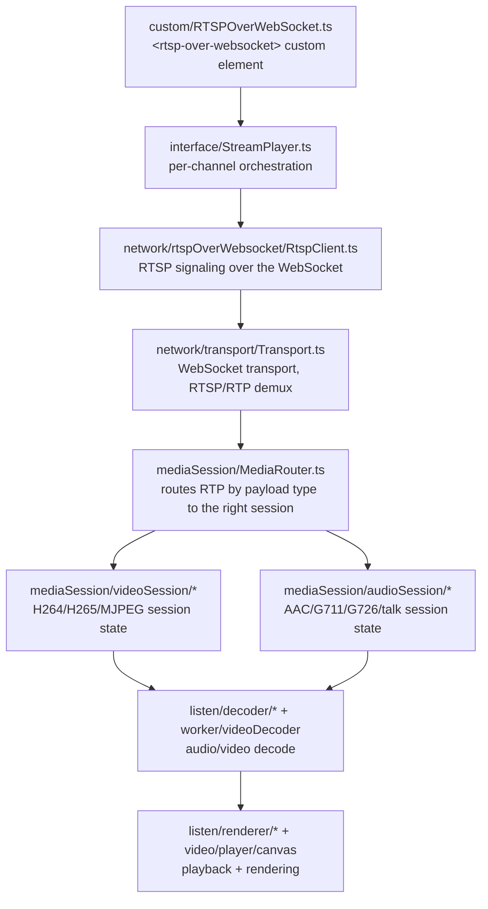

# Architecture

This document covers the structure of `src/`, how the pieces fit together, and the two main runtime data flows:
playing an existing RTSP-over-WebSocket source, and the demo server's YouTube → RTSP → WebSocket pipeline.

## Repository structure

```
src/
├── player/                  Player library (TypeScript, Vite build) — dist/player/rtsp-over-websocket.{esm,global}.js
│   ├── custom/              <rtsp-over-websocket> custom element (RTSPOverWebSocket.ts) — the public API surface
│   ├── interface/           StreamPlayer / StreamManager — per-channel orchestration above the network layer
│   ├── network/             Transport, RtspClient(Manager), Sunapi HTTP client, status codes
│   │   └── rtspOverWebsocket/   RTSP-over-WebSocket signaling (digest auth, RTSP request/response framing)
│   ├── mediaSession/        Per-codec session state (H264/H265/MJPEG video, AAC/G711/G726/talk audio, RTCP, text/meta)
│   ├── listen/              Audio decode + playback (decoder + renderer pairs per codec)
│   ├── video/                Canvas/WebGL video rendering
│   ├── worker/               Web Workers: video decode, audio transcode, MJPEG depacketize, backup zip, SUNAPI requests
│   ├── backup/                Local recording/backup (AVI/ZIP) support
│   ├── talk/                  Two-way audio (talk-back) support
│   ├── exceptions/             RTSPOverWebSocketBaseError and its subclasses (Auth/RTCP/RTSP/Sunapi errors)
│   ├── util/                    Shared helpers (SPS parsing, digest auth, byte/format utilities, a small Map utility)
│   ├── legacyHostInterface/      Optional legacy host-framework glue for a specific host app (not part of the neutral ESM API)
│   ├── vendor/                  Vendored third-party decode libraries (mp4 muxing, minizip, ffmpeg-derived AAC decoder)
│   └── test-support/             Test harness helpers, including the legacy-parity sandbox loader
│
├── server/                  Demo server (TypeScript, tsc build) — dist/server/index.js
│   ├── index.ts              Entry point: express app, HTTP/HTTPS listeners, MediaMTX reachability check
│   ├── config.ts              Ports, timeouts, and other tunables (env-var overridable)
│   ├── api/                    REST routes: /api/youtube, /api/sessions, /api/capabilities
│   ├── services/                YouTube probing (yt-dlp), ffmpeg transcode session management, codec capability
│   │                             detection, in-memory session store
│   └── rtspOverWebSocket/       The WebSocket <-> RTSP bridge itself (digest auth, RTSP framing, keyframe gating)
│
└── index.html                Vanilla-JS demo page (Player / Server / Test tabs) — copied to dist/index.html at build time
```

## The player: layering



The custom element is the only public entry point; everything below `interface/` is internal wiring not meant to be
imported directly by consumers. `network/http/Sunapi*` is a parallel path used for device REST calls (capabilities,
profiles) independent of the RTSP-over-WebSocket stream itself.

## Playing a stream: request/response flow

```mermaid
sequenceDiagram
    participant Browser as &lt;rtsp-over-websocket&gt;
    participant WS as WebSocket (/StreamingServer)
    participant Bridge as RTSP-over-WS bridge<br/>(server or camera)
    participant Backend as RTSP source<br/>(MediaMTX / camera)

    Browser->>WS: connect ws(s)://host:port/StreamingServer
    Browser->>WS: DESCRIBE (RTSP, interleaved framing)
    WS->>Bridge: forward
    Bridge-->>WS: 401 Unauthorized (WWW-Authenticate: Digest, nonce)
    WS-->>Browser: 401
    Browser->>WS: DESCRIBE + Authorization (digest response)
    WS->>Bridge: forward
    Bridge->>Backend: connect + relay RTSP
    Backend-->>Bridge: 200 OK + SDP
    Bridge-->>WS-->>Browser: 200 OK + SDP
    Browser->>WS: SETUP / PLAY (per track)
    Backend-->>Browser: interleaved RTP/RTCP frames (via Bridge/WS)
    Note over Browser,Backend: Video/audio/meta frames demuxed client-side<br/>by MediaRouter into per-codec sessions
```

This is the same wire protocol whether the "Bridge" is a real camera's embedded server or `src/server`'s own
bridge (`src/server/rtspOverWebSocket/server.ts`) — the player doesn't need to know which.

## The demo server: YouTube → RTSP → WebSocket pipeline

`src/server` exists to make the player demonstrable without a real RTSP camera: it transcodes a YouTube video into
a live RTSP source, publishes it to a local MediaMTX instance, and bridges that back out over the same
RTSP-over-WebSocket protocol the player already speaks.

```mermaid
sequenceDiagram
    participant UI as Demo page (Server tab)
    participant API as src/server REST API
    participant YtDlp as yt-dlp
    participant Ffmpeg as ffmpeg
    participant MediaMTX as MediaMTX (RTSP :8554)
    participant Player as &lt;rtsp-over-websocket&gt;

    UI->>API: GET /api/youtube/probe?url=...
    API->>YtDlp: probe formats
    YtDlp-->>API: title, duration, available resolutions/codecs
    API-->>UI: probe result

    UI->>API: POST /api/sessions {resolution, codecs, channel?, username, password}
    API->>API: assign/validate channel, create session (status: starting)
    API->>YtDlp: download (stdout pipe)
    YtDlp->>Ffmpeg: piped video+audio
    Ffmpeg->>MediaMTX: publish RTSP (rtsp://127.0.0.1:8554/<sessionId>)
    Ffmpeg-->>API: encoded frame observed -> status: live

    Player->>API: ws(s)://.../StreamingServer (RTSP-over-WebSocket, as above)
    API->>API: match channel -> session; digest auth against session credentials (skipped if session has none)
    API->>MediaMTX: relay RTSP for that session's publish path
    MediaMTX-->>Player: video/audio via the bridge
```

Key points:

- **Sessions are channel-addressed.** Each session gets a numeric channel (auto-assigned or explicitly requested);
  the RTSP-over-WebSocket bridge (`server.ts`) reads the channel out of the client's first RTSP request URI and
  looks up the matching session (`services/sessionStore.ts`).
- **Sessions aren't automatically garbage-collected on failure/completion** — a `stopped`/`failed` session stays in
  the store (for status visibility) but no longer blocks its channel from being reused by a new session; an
  active (`starting`/`live`) session does block reuse.
- **A session's username/password may both be left empty** to opt out of RTSP Digest auth entirely — the bridge
  (`rtspOverWebSocket/server.ts`) then skips the `401` challenge and relays from the first request. Validated as
  both-empty-or-both-set in `sessionRoutes.ts`; the demo page's Server tab exposes it as the Session Username
  "Use" toggle (on by default).
- **REST and the WebSocket bridge share a port per scheme** — `http`/`ws` both live on `HTTP_PORT`, `https`/`wss`
  both live on `HTTPS_PORT` (see `config.ts`). `npm run start:server` can start either or both, selected via
  `--http`/`--https` flags, `RTSP_WS_PROTOCOL`, or an interactive prompt.
- **MediaMTX is an external dependency**, not spawned by `src/server` — see the README's "External tools" section.
  If it isn't reachable at startup, the server logs a warning and keeps running; sessions can still be created but
  fail at the ffmpeg-publish step.

## Testing strategy (src/player)

Most of `src/player`'s ~200 test files are **parity tests**: they load the *original* legacy source for a given
module through `test-support/loadLegacyModule.ts` (Node's `vm` module, sandboxed) and assert the new TypeScript port
produces byte-for-byte identical output for the same inputs — including reproducing known legacy bugs/quirks where
call sites depend on them. This requires the legacy source to be present as a git submodule at `legacy-player/`
(see the README) — without it, those tests fail with `ENOENT` rather than a logic failure.

A smaller set are **contract tests** (e.g. `custom/RTSPOverWebSocket.test.ts`) that exercise the real Custom
Elements lifecycle under `jsdom` instead of comparing against legacy source — used where a DOM-dependent class isn't
practical to run byte-for-byte against a non-browser legacy sandbox. These same 37 cases are also reproduced
directly in a real browser via the demo page's Test tab (`src/index.html`), independent of Node/vitest.
