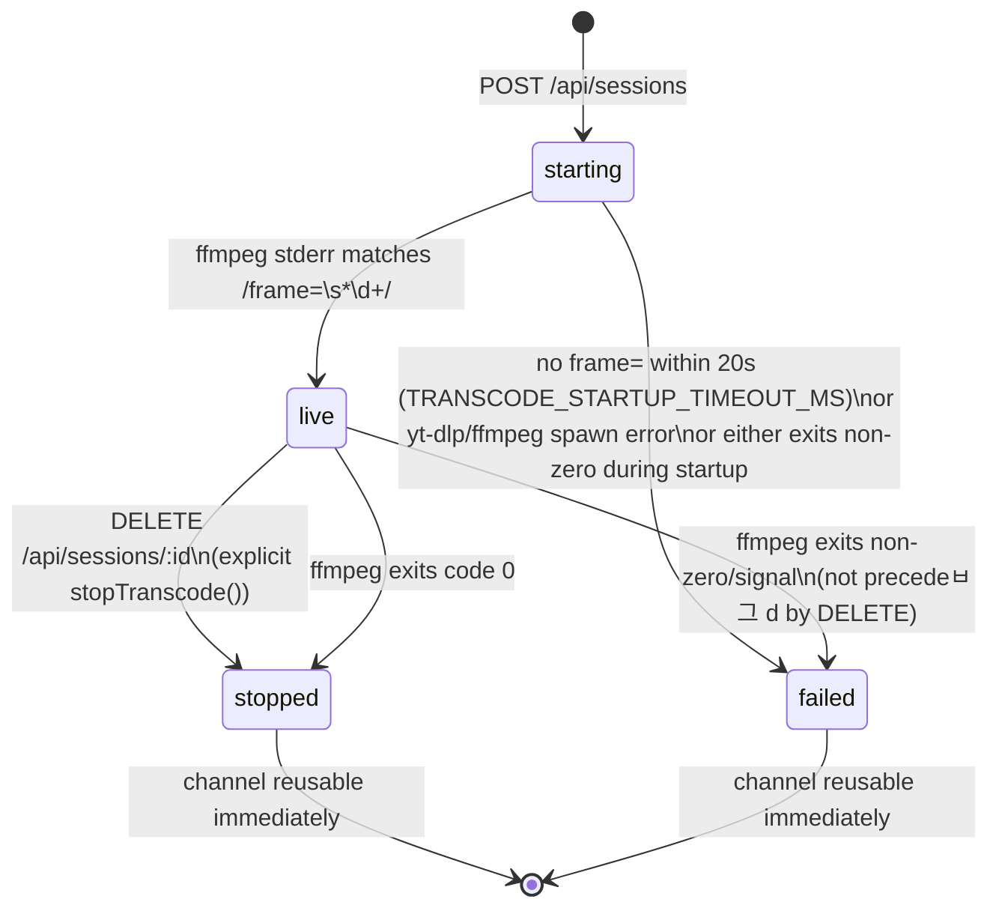
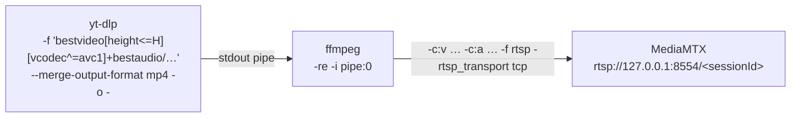
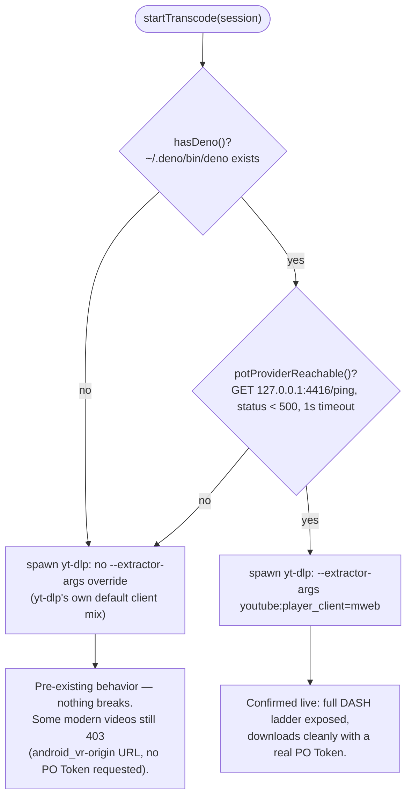
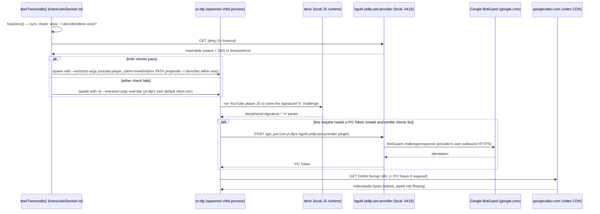
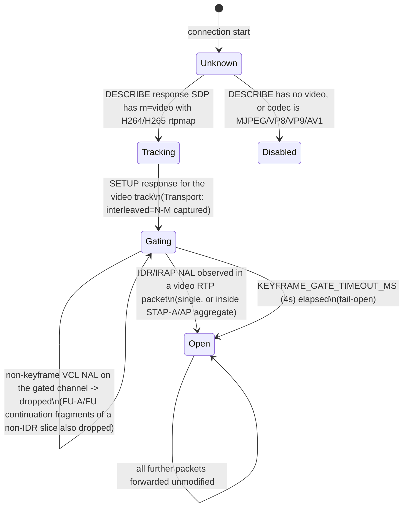
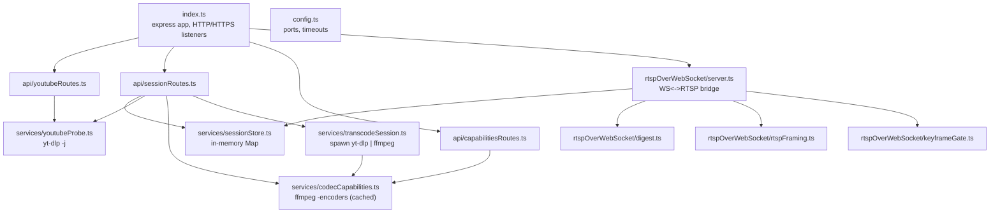
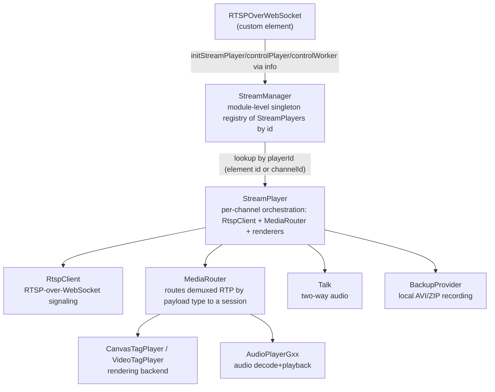
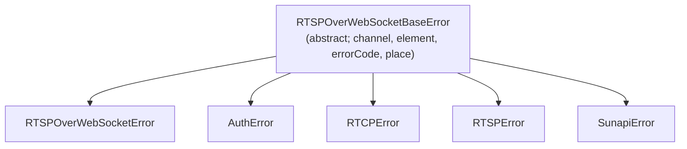
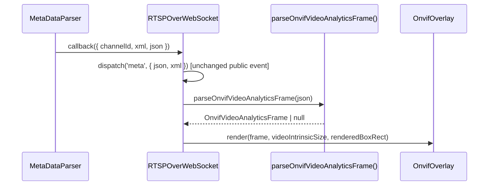

# Design Document

*Implementation-level design supporting the requirements in [SRS.md](SRS.md): state machines, protocol-level
sequence diagrams, and the specific algorithms behind the Server's transcode/bridge/keyframe-gate logic and the
Player's custom-element/StreamPlayer wiring.*

**Version:** 1.1.0 · **Author:** Youngho Kim · **Milestone:** —

**History**

| Date | Change |
| --- | --- |
| 2026-08-04 | Harden the YouTube demo pipeline (yt-dlp staleness, graceful shutdown, keyframe gating) and add project docs |
| 2026-08-11 | Add AV1/VP8/VP9 + WebCodecs decode support, per-class player docs, server lifecycle/config improvements, and fix SUNAPI protocol clobbering on non-http(s) hosts |
| 2026-08-26 | Added Title/Abstract/Version/Author/History metadata header |
| 2026-08-26 | Add a sequence diagram for the PO Token/`deno` pre-flight check and request flow to §1.3 (`e9a7e70`) |
| 2026-08-26 | Add a decision flowchart alongside the sequence diagram, showing `hasDeno()`/`potProviderReachable()`'s branch outcomes |
| 2026-09-04 | Add §2.7 (ONVIF metadata overlay) |
| 2026-09-04 | §2.7 coordinate mapping fix: `tt:Transformation` is no longer applied to `Shape` coordinates — a real device capture proved the inverse-divide formula corrupted already-pixel-space coordinates |
| 2026-09-04 | §2.7 rendering surface changed from SVG to plain positioned `<div>`s, per explicit user request |

---

Implementation-level design supporting the requirements in [SRS.md](SRS.md). For repository structure and the
top-level module layering/data-flow diagrams, start with [ARCHITECTURE.md](ARCHITECTURE.md) — this document goes
one level deeper: state machines, protocol-level sequence diagrams, and the specific algorithms behind the
Server's transcode/bridge/keyframe-gate logic and the Player's custom-element/StreamPlayer wiring.

## 1. Server design

### 1.1 Session status state machine

Implements REQ-SRV-030..032.



Key invariant (`transcodeSession.ts`'s `fail()`): once a session is already `live`, an unrelated startup-phase
failure path must not retroactively mark it failed — the `settled` flag partitions "still starting" from "was
live, now exiting" so the two code paths (`fail()` vs. the generic `ffmpeg.on('exit', ...)` handler) never race
each other into contradictory status writes. Similarly, `stopTranscode()` (used by `DELETE`) sets `stopped` before
killing child processes, and the `exit` handler explicitly skips overwriting a status that is already `stopped` —
this ordering is why `killProcesses()` (not `stopTranscode()`) is used from inside `fail()`, so a startup failure
can't be clobbered back to `stopped` by the generic exit handler.

### 1.2 Channel assignment and reuse

`sessionStore.ts` keeps a monotonically increasing `nextChannel` counter for auto-assignment, but also accepts an
explicit `channel` from the request. Two rules keep these consistent (REQ-SRV-011):

1. An explicit channel `>= nextChannel` bumps `nextChannel` past it, so a later auto-assigned session can never
   collide with a manually-chosen one.
2. `sessionRoutes.ts` checks `findByChannel()` *before* calling `createSession()`: an active (`starting`/`live`)
   occupant blocks the request (`409`); a terminal occupant is deleted first — never left in the store to create a
   duplicate-channel ambiguity in `findByChannel()`'s linear scan.

### 1.3 Transcode pipeline (`transcodeSession.ts`)



Design decisions worth preserving intent for (see inline comments in `transcodeSession.ts` for the full empirical
justification of each):

- **`yt-dlp` does the fetching, not a resolved googlevideo URL handed to `ffmpeg -i`.** A raw CDN URL 403s because
  YouTube ties it to request context only `yt-dlp`'s own HTTP client reproduces; piping `yt-dlp`'s stdout into
  `ffmpeg`'s stdin sidesteps this entirely.
- **Source format selection prefers `avc1` (H.264)** over VP9/AV1 sources at the same height, independent of the
  *output* codec — this build's `ffmpeg` AV1 decoder is unreliable on YouTube's AV1 formats.
- **`-strict experimental` on VP9 *and* AV1 *output*** (a separate concern from the source-decode note above) —
  ffmpeg's RTP muxer marks both payloaders experimental and refuses to write the output header without it (confirmed
  live: `Packetizing VP9/AV1 is experimental ... Please set -strict experimental`).
- **AV1 *output* needs ffmpeg 9+ — it's a real version floor, not just a missing flag.** ffmpeg 4.4.2 and 7.1.1 have
  no `a=rtpmap` entry for AV1 in the RTP muxer at all (confirmed by dumping the actual SDP via `-loglevel debug` —
  bare `m=video 0 RTP/AVP 96`, no rtpmap line — and by grepping `libavformat.so`'s compiled
  `a=rtpmap:%d <CODEC>/<rate>` string table), so MediaMTX correctly rejects it as invalid SDP (`Server returned 400
  Bad Request`; MediaMTX logs `invalid SDP: media 1 is invalid: clock rate not found`) and `-strict experimental`
  has no effect there — the feature is simply absent, not gated. ffmpeg 9.0 (`ppa:ubuntuhandbook1/ffmpeg9`) *does*
  have the rtpmap entry (exact version it landed in is unconfirmed; ffmpeg 8 untested) — on 9.0, AV1 output works
  exactly like VP9: needs `-strict experimental` and nothing else. Confirmed live end-to-end on ffmpeg 9.0 through
  the real REST API (session reaches `status: "live"`, publishes real AV1 frames to MediaMTX). See `README.md`'s
  "External tools" section for the full investigation, including two earlier wrong guesses corrected in sequence —
  first "needs ffmpeg 6.0+", then "no ffmpeg version fixes this at all". `codecCapabilities.ts`'s `getVideoEncoder`
  only probes `ffmpeg -encoders` (which does list `libaom-av1`/`libsvtav1`), not RTP-muxer capability or version, so
  an AV1 session on a pre-9.0 ffmpeg still isn't caught until the session actually runs.
- **`--merge-output-format mp4`, not `mkv`**, because only `mp4`'s fallback (an MPEG-TS-compatible bytestream for
  non-seekable pipe output) actually produces bytes over a stdout pipe; `mkv` silently emits zero bytes in this
  mode.
- **`repeat-headers=1`** on H.264/H.265 makes the encoder embed SPS/PPS (H.264) in-band before every keyframe, not
  just once at stream start — required because the player's session code reads parameter sets in-band, matching
  real camera encoder behavior, and a bitstream-filter alternative (`dump_extra`) was confirmed to only fire once.
- **Startup detection is stderr-log-driven** (`frame=\s*\d+` match), not a fixed delay or MediaMTX API poll —
  ties the `starting → live` transition to `ffmpeg` actually having encoded something, not merely having started.
- **`--extractor-args youtube:player_client=mweb` is added *conditionally*** — only when `hasDeno()` (a JS runtime
  for YouTube's signature/"n" challenge) **and** `potProviderReachable()` (a live bgutil-ytdlp-pot-provider HTTP
  server, REQ-SRV-036) both check out at the start of each session. Forcing `mweb` without both is confirmed live
  to be *worse* than the unforced default — YouTube's PO Token requirement makes `mweb` fail outright ("No video
  formats found!") in that case, for videos the default client mix still handles. With both available, `mweb`
  fixes a real gap in the default: yt-dlp's default client selection can end up keeping an `android_vr`-origin URL
  for a given itag over an equally-available `mweb`-origin one, and the `android_vr` URL `403`s regardless of PO
  Token/JS runtime (yt-dlp doesn't even request it a token). See `CLAUDE.md`'s "Environment gotchas" and
  `MEMORY.md` for the full investigation and README.md's "External tools" section for the provider setup.

**PO Token / `deno` pre-flight check and request flow.** `deno` and the PO Token provider solve two independent
problems — YouTube's signature/"n" challenge, and the PO Token itself — so they show up separately below, not as
one linear hand-off.

**Decision flow** — `startTranscode()`'s pre-flight check, and what each outcome means for the session:



**Request flow** — once `yt-dlp` is actually running, the message order behind the diagram above:



Note the two failure-independence points this diagram makes explicit: `hasDeno()`/`potProviderReachable()` only
gate whether `mweb` is *forced* (§1.3's bullet above) — `yt-dlp`'s own default client mix will still attempt the
same `deno`/PO-Token round trips on its own if it happens to pick a client that needs them, just without this
repo steering it toward the client confirmed to need (and correctly receive) both.

### 1.4 RTSP-over-WebSocket bridge (`server.ts`)

Per-connection state machine (implements REQ-SRV-040..047):

```mermaid
sequenceDiagram
    participant C as WebSocket client
    participant B as Bridge (server.ts)
    participant M as MediaMTX

    C->>B: WS connect /StreamingServer
    C->>B: RTSP request (any method) — first message
    B->>B: parseRtspRequestLine — not RTSP? close(1002)
    B->>B: extractChannel(uri) — no numeric segment? close(1008)
    B->>B: findByChannel — no session? send 404, close(1008)
    alt session has username/password
        B-->>C: 401 + WWW-Authenticate: Digest nonce=…
        C->>B: same request + Authorization: Digest …
        B->>B: verifyDigest(session.username/password) — fail (up to 3x)? re-challenge; >3? close(1008)
    else session created with empty username/password
        Note over B: no auth configured — challenge skipped entirely
    end
    Note over B: state: awaiting-auth -> relaying
    B->>B: waitForLive(session, 15s) — not live in time? close(1011)
    B->>M: TCP connect (BACKEND_CONNECT_TIMEOUT_MS=5s) — fail? close(1011)
    B->>M: rewriteRequestUri(original request) -> forward
    M-->>B: RTSP response / interleaved RTP frames
    B->>B: keyframe gate (video RTP only, see §1.5)
    B-->>C: relay (gated or passthrough)
    Note over C,M: all further C<->B<->M traffic is a raw relay
```

`rewriteRequestUri` (REQ-SRV-046) has two branches, checked in order: if the request URI already starts with the
backend target URI, forward unchanged (the client built it from our own `DESCRIBE` response's `Content-Base`); else
if it starts with the client's original base URI, splice in the backend target URI in its place. This mirrors a
design shared with a sibling camera-streaming server's bridge, minus that project's ingest-daemon fan-out
distinction (this server's ffmpeg publishes directly to MediaMTX, no intermediate fan-out).

### 1.5 Keyframe gate state machine

Per-connection, scoped to the video RTP interleaved channel only, once known (implements REQ-SRV-050..053):



NAL classification (`keyframeGate.ts`) operates on RFC 6184 (H.264) / RFC 7798 (H.265) payload structures read
directly off the RTP payload (after skipping the 12-byte+ RTP fixed header, CSRC list, and optional extension):
single-NAL packets are classified by NAL type directly; STAP-A/Aggregation-Packet types are scanned entry-by-entry
for an embedded IDR/IRAP; FU-A/Fragmentation-Unit types read the original NAL type out of the FU header's low bits.
Every ambiguous or malformed case (payload too short, codec not confirmed H264/H265) defaults to `forward: true` —
gating is strictly a latency/noise optimization (REQ-SRV-051), never allowed to also become an availability
requirement by dropping something it shouldn't.

### 1.6 Digest authentication

`digest.ts` implements RTSP Digest in "simple mode" (no `qop`/`cnonce`/`nc`) deliberately — this bridge only ever
authenticates a client against its own session's credentials over what is, in effect, a loopback-adjacent relay to
`ffmpeg`'s own publish, so the additional replay protection `qop=auth` buys isn't worth the server-side session
state (`nc` tracking) it would require. The player's own `DigestGenerator` (see §2.4) already falls back to this
exact scheme whenever a challenge omits `qop`/`algorithm`/`opaque`, so no player-side change was needed to support
it.

```
HA1 = MD5(username:REALM:password)
HA2 = MD5(method:uri)
response = MD5(HA1:nonce:HA2)
```

`REALM` is a fixed string (`rtsp-ws-youtube`) baked into both challenge and verification — it need not match any
real device realm since credentials are session-scoped, not device-scoped.

A session created with both `username`/`password` as empty strings (validated as an explicit both-empty-or-both-set
choice in `sessionRoutes.ts`, never one empty and the other not) skips Digest entirely: `server.ts` checks
`session.request.username` truthiness before ever calling `verifyDigest`/`challenge`, and goes straight to
`state = 'relaying'` on the first message. This needed no player-side change — `RtspClient`'s `Authentication`
header starts `''` and is only ever populated reactively in response to a `401` (see §2.4), so a client that's never
challenged simply never sends one.

### 1.7 Server module map



## 2. Player design

### 2.1 Custom element construction and attribute wiring

`RTSPOverWebSocket` (extends `HTMLElement`) builds a single `info: StreamPlayerInfo` object at construction time —
`{ device, media, callback }` — that is threaded through to `StreamPlayer`/`StreamManager` unchanged on every
control call. Attribute changes (`attributeChangedCallback`) update both a private backing field (`_hostname`,
`_channel`, ...) and the corresponding slot in `info.device`/`info.media`, then `dispatch()` a `change*` event —
but deliberately do **not** trigger a re-render themselves (a preserved legacy behavior: only `connectedCallback`
calls `updateRendering()`). This means attribute mutations after the element is already connected update internal
state and fire events, but a caller relying on the DOM to reflect a later attribute change without an explicit
control call would be depending on behavior the legacy library never provided either.

### 2.2 Class responsibilities



`StreamManager` is a quasi-singleton: `playerContainer`/`currentPlayer` live at module scope (outside the class),
matching the legacy IIFE's closure-scoped state — so every `new StreamManager()` instance shares the same
player registry. `computeId()` looks a player up by `media.element` (the host element's `id` attribute) if
present, else by `device.channelId` — this is how multiple `<rtsp-over-websocket>` elements on one page stay
correctly routed to independent `StreamPlayer` instances.

### 2.3 Play-state and play-type model

Two independent enums drive playback (`custom/RTSPOverWebSocketTypes.ts`):

- `RTSPOverWebSocketPlayType`: `LIVE` / `PLAYBACK` / `BACKUP` / `INSTANTPLAYBACK` — *what kind* of session this is.
- `RTSPOverWebSocketPlayState`: `STOPPED` / `PLAYING` / `PAUSED` / `STEP` — *what the current session is doing*.

The `playType` setter (not `mode`, which is a string convenience wrapper around it) contains the only
type-transition side effects: switching *into* `INSTANTPLAYBACK` pauses any active live playback and issues an
`init` control command; switching *out of* `INSTANTPLAYBACK` back to `LIVE` resumes. All other type values are
plain state assignment with an event dispatch — no other combination has special-cased transition logic.

### 2.4 RTSP-over-WebSocket signaling (network layer)

`network/rtspOverWebsocket/RtspClient.ts` builds the RTSP request URI per `device` attribute mode (`camera` puts
the channel first in the path; `nvr`-style deployments use `LiveChannel/<channel>/media.smp`, etc. — see
`sessionStore.ts`'s comment on the 1-based-UI/0-based-wire channel convention this must match). `DigestGenerator`
computes the RTSP Digest response; when a server challenge omits `qop`/`algorithm`/`opaque` it falls back to the
exact simple-mode scheme `src/server/rtspOverWebSocket/digest.ts` implements (§1.6) — the two were designed to
interoperate without either side needing session/nonce-count bookkeeping.

### 2.5 Error hierarchy



All five constructors accept only the options-object form (`{ message, channelId, elementId, errorCode, place }`)
— the legacy variadic `(template, ...args)` calling form was audited across the whole codebase and found unused,
so this port narrows the public constructor to the form actually exercised.

### 2.6 `legacyHostInterface` (excluded from the neutral API)

`src/player/legacyHostInterface` reproduces the legacy host-framework `rtspOverWebSocketStreamInterface` factory
and `rtspOverWebSocketStream` directive as plain dependency-injected functions (`streamInterface.ts`,
`streamCanvas.ts`); the actual module/factory/directive registration wiring is left to the external host app that
consumes them — this repository never performs that registration itself. Because the real host-framework services
this layer depends on (`UniversialManagerService`, `EventNotificationService`, etc.) don't exist in this
repository, this layer is contract-tested against inferred shapes (`types.ts`) rather than parity-tested against a
real implementation — see [TC.md](TC.md) §3.

### 2.7 ONVIF metadata overlay

Implements SRS §4.10 (REQ-PLY-110 through REQ-PLY-116). Full class reference:
[docs/player/10-onvif-metadata-overlay.md](player/10-onvif-metadata-overlay.md). This section
covers the two non-obvious algorithms: coordinate mapping and data lifecycle.

**Data flow.** `RTSPOverWebSocket.onRTSPOverWebSocketMeta(meta)` — already the sole call site that
dispatches the public `meta` event (see §2.2's class diagram, `MediaRouter` → callback chain in
`docs/player/03-mediaSession-core-video.md`) — gains one more side effect at the same point:
`meta.json` is passed to `parseOnvifVideoAnalyticsFrame()` (`src/player/util/onvifMetadata.ts`, a
pure function, no DOM/network access), and a successfully-parsed frame is handed to the mounted
`OnvifOverlay.render()`. The public `meta` event's payload is unchanged — this is a pure addition
alongside it, not a replacement.



**Coordinate mapping.** A `tt:Object`'s `tt:Shape/tt:BoundingBox`/`tt:CenterOfGravity` coordinates
go through one step before becoming an on-screen pixel rect (a real device capture disproved an
earlier two-step design — see below):

1. **`tt:Shape` coordinates are read as intrinsic pixel space directly — `tt:Transformation` is not
   applied.** An earlier version of this design additionally inverse-applied `tt:Frame`'s
   `tt:Transformation` (`Translate`/`Scale`) to every raw coordinate
   (`px = (rx - translateX) / scaleX`), on the theory that non-identity `Translate`/`Scale` meant
   raw coordinates needed correcting into pixel space. A real Wisenet/Samsung camera capture
   (2048x1536) disproved that theory in production: its `BoundingBox`/`CenterOfGravity` were
   already in that camera's own intrinsic pixel space (`CenterOfGravity` was exactly the
   `BoundingBox`'s own midpoint — only possible if neither needs further transforming), while its
   accompanying `Transformation` turned out to be a *pixel-to-normalized* ONVIF-compliance recipe
   instead (`scaleX ~= 2/width`, `scaleY ~= -2/height` — the standard pixel → `[-1, 1]` conversion,
   useful to a client that wants strictly-normalized ONVIF coordinates, not to this renderer which
   wants pixel coordinates). Inverse-applying it blew already-correct pixel values up by roughly
   1000x, producing a `<rect>` with a resulting negative height that browsers silently refuse to
   draw — the real root cause of a live "toggled the overlay on, no bounding box ever appears"
   report. See `onvifMetadata.ts`'s `parseBoundingBox` doc comment and `MEMORY.md` for the full
   writeup, and `onvifMetadata.test.ts`'s real-device-capture regression test.
2. **Intrinsic pixel space → rendered box.** The video's intrinsic resolution (`videoWidth`/
   `videoHeight`, already tracked from `onRTSPOverWebSocketResize`, see §2.2) is almost never the
   same aspect ratio as the element's own CSS box once `object-fit: contain` is applied (see
   `updateRendering()`'s own comment on this class). `OnvifOverlay` computes the actual rendered
   image rect within the element (the "letterboxed" sub-rect: same aspect ratio as intrinsic
   size, centered, `width`/`height` clamped to the container) using the same containment math
   `object-fit: contain` itself applies, then maps `(px, py)` linearly onto that sub-rect. This
   keeps the overlay pixel-accurate at any container size/aspect ratio without depending on the
   browser's own CSS layout of the underlying `<video>`/`<canvas>` (the overlay is a sibling
   element, not a child, so it can't read that box back from the DOM directly — it's computed the
   same way `object-fit: contain` would, from the same two inputs `object-fit: contain` uses:
   intrinsic size and container size).

**Object lifecycle.** Each `tt:Frame` is treated as a full refresh: `OnvifOverlay.render()` clears
every previously-drawn object and redraws exactly the current frame's `tt:Object` list. There is no
cross-frame object tracking, interpolation, or fade-out on a stream that stops sending frames —
the overlay simply shows whatever the most recent frame contained until a new one arrives or the
toggle is switched off. See `docs/ROADMAP.md` for staleness/timeout handling as a possible future
enhancement.

**Rendering surface.** Plain positioned `<div>`s, not SVG or `<canvas>`: `OnvifOverlay` mounts one
absolutely-positioned `<div class="onvif-overlay">` sized to the element's box, as a sibling of the
video/canvas element (so it works identically regardless of `tagMode`). Each object renders as a
bordered `<div class="onvif-overlay-box">` (`border: 2px solid <color>`, positioned/sized with
`left`/`top`/`width`/`height` in px, `box-sizing: border-box` so the border stays inside the mapped
coordinates) plus a `<div class="onvif-overlay-label">` (positioned at the box's top-left with
`transform: translateY(-100%)` to sit just above it regardless of its own auto-sized dimensions).
An earlier version of this used SVG (`<rect>`/`<text>`) instead; switched to plain `<div>`s per
explicit user request. Chosen (like SVG before it) over `<canvas>` because ONVIF analytics frames
carry a small, low-frequency set of objects (not a per-video-frame-rate signal), so per-object DOM
elements cost nothing meaningful here — and `<div>`s additionally avoid the hand-measured
`APPROX_CHAR_WIDTH`-style text-metrics math the SVG version needed to size its label background
rect up front, since a `<div>`'s width/height auto-size to its text content.

**Toggle component.** `src/player/components/ui/switch/Switch.ts` (`createSwitch(options)`) is a
new, standalone, reusable factory — not markup progressively enhanced in place, since this
element's context menu (unlike a page with static HTML) is built imperatively from scratch
(`refreshContextMenu()`/menu-construction code, §2.2). It owns its own DOM construction (track +
thumb) and returns a `{ element, getValue, setValue, destroy }` controller; the existing hand-rolled
Audio mute toggle in `RTSPOverWebSocket.ts` is left as-is (a pre-existing, working, narrower-scoped
control) — migrating it onto this new shared component is a possible follow-up, not part of this
change. CSS lives in the existing `panelStyles.ts` (the one stylesheet string injected into this
element's shadow DOM) rather than a second parallel styling mechanism, under generic `.ui-switch*`
class names sized/colored to match `wisenet-camera-discovery`'s `mountSwitch({variant:'slider'})`
dark-theme values (`40x20` track, `14px` accent-colored thumb, `#191b20`/`#1c2c4a`/`#3a4049`/
`#3b82f6`) — a deliberate external visual-parity target, not derived from this element's own
pre-existing (differently-sized/colored) Audio toggle.

## 3. Cross-cutting: how a Player and the Server interoperate

The Player has no server-specific code path — it speaks the same RTSP-over-WebSocket protocol to `src/server`'s
bridge as it would to a real camera. The only server-side concession to interoperate unmodified is `WS_PATH =
'/StreamingServer'`, matching the path `StreamPlayer.ts`'s `startStreaming()` hardcodes
(`${protocol}${addr}/StreamingServer${pathName}`) — not configurable via any element attribute. Everything else
(digest scheme, interleaved framing, channel-in-URI convention) is standard RTSP-over-WebSocket behavior both
sides already needed to implement for real-camera compatibility.
