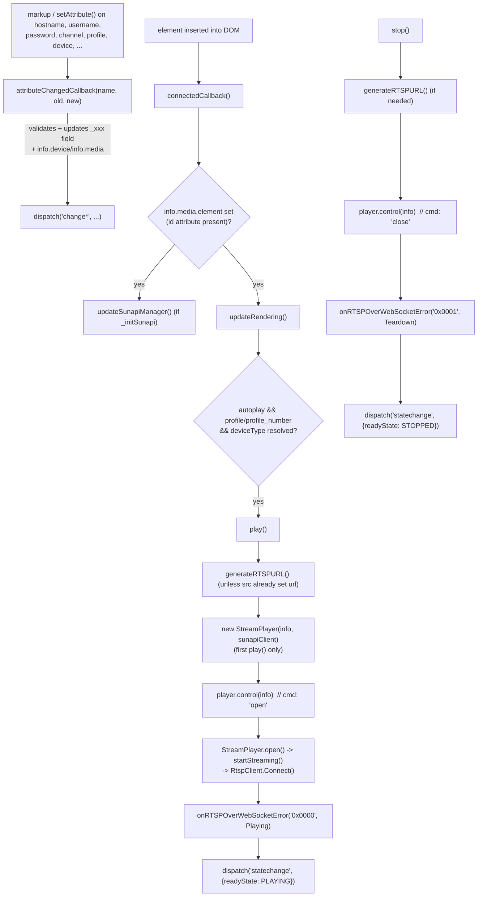
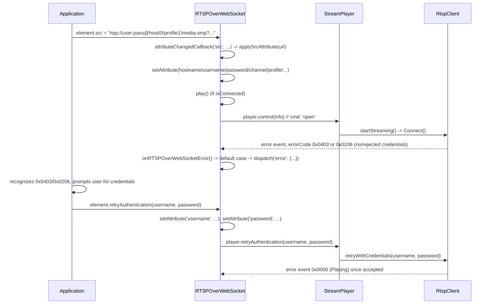
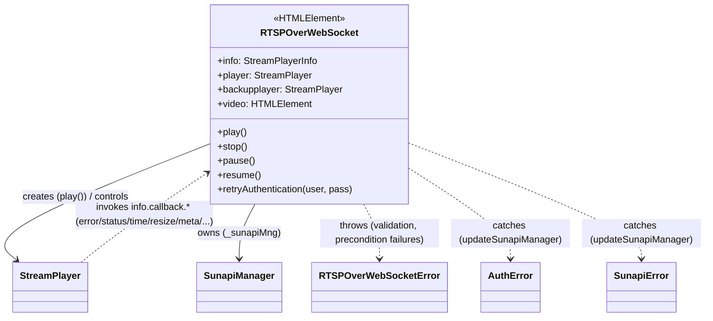
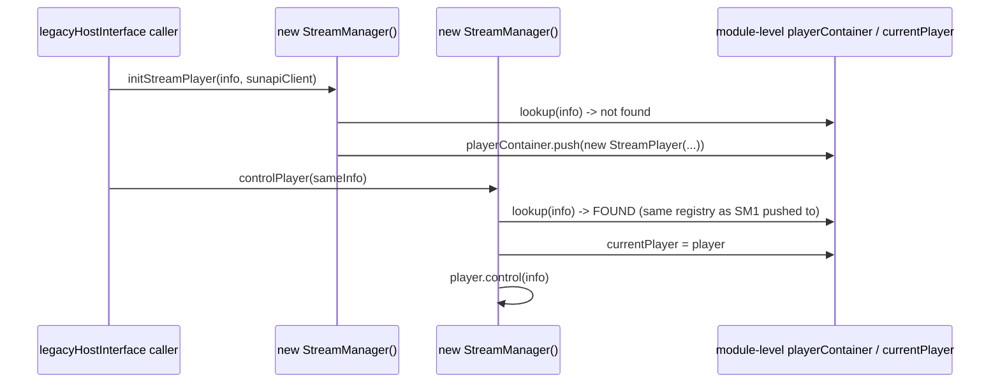
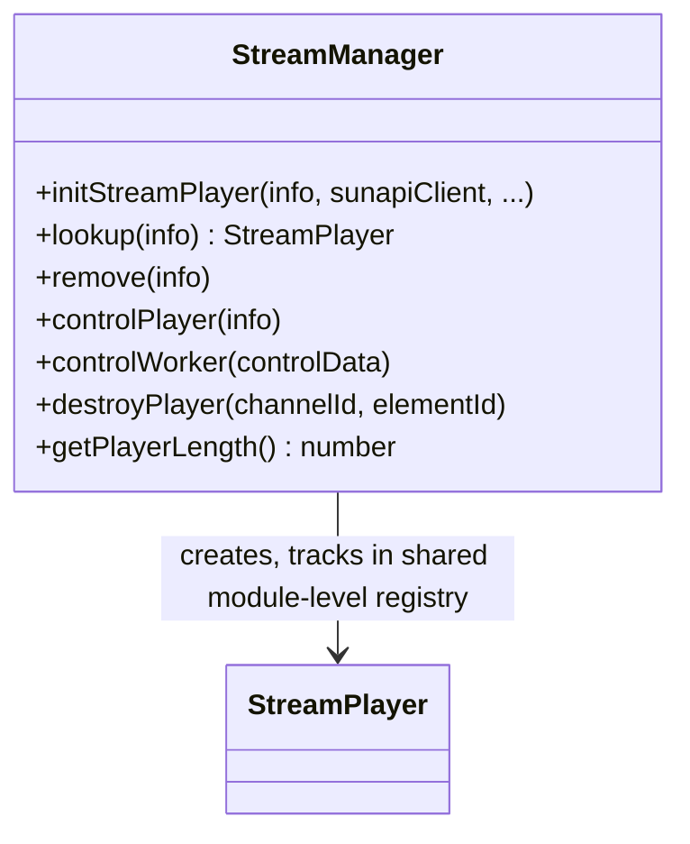
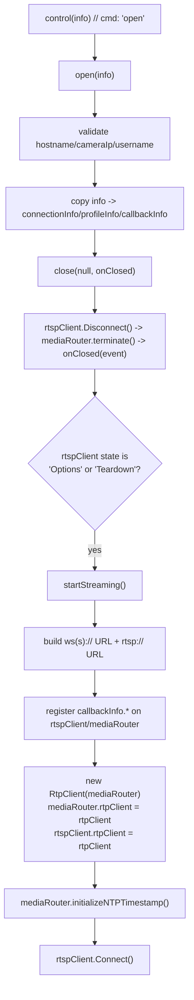
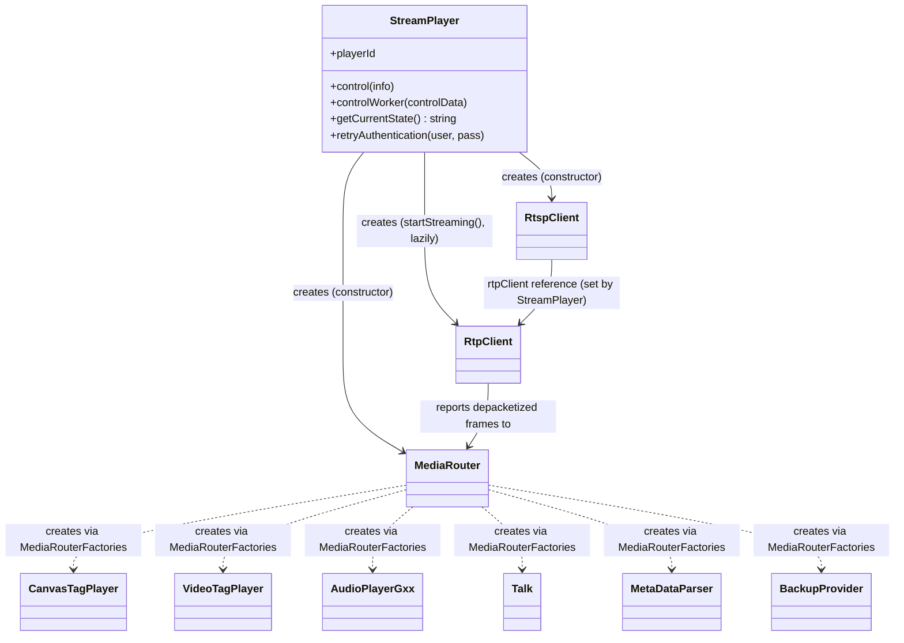
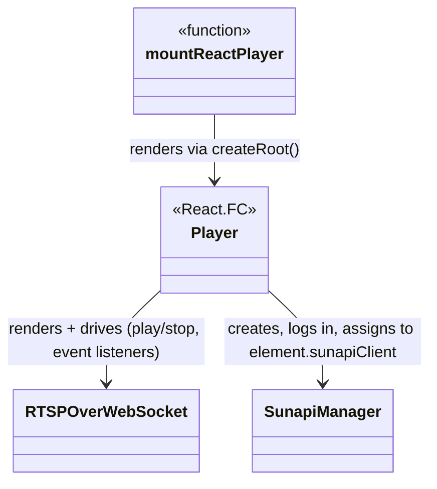
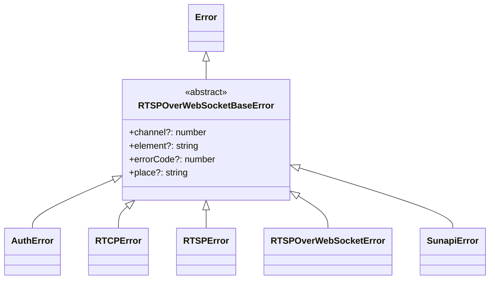

# `src/player` reference — elements, interface, exceptions

*Per-class reference for the public custom element (`elements/`), its per-channel orchestration layer
(`interface/`), the React wrapper (`react/`), and the error hierarchy (`exceptions/`).*

**Version:** 1.1.0 · **Author:** Youngho Kim

**History**

| Date | Change |
| --- | --- |
| 2026-08-06 | Add per-class reference docs for `src/player` (initial version) |
| 2026-08-11 | Add AV1/VP8/VP9 + WebCodecs decode support, per-class player docs, server lifecycle/config improvements, and fix SUNAPI protocol clobbering on non-http(s) hosts |
| 2026-08-11 | Implement `RTSPOverWebSocket.disconnectedCallback()` — was missing entirely |
| 2026-08-13 | Add `.env` support for the live-device test; fix `describe.skip` collection bug; docs |
| 2026-08-26 | Added Title/Abstract/Version/Author/History metadata header |
| 2026-08-26 | Add `RTSPOverWebSocket.transportFactory` get/set — exposes `StreamPlayer`/`RtspClient`'s existing `transportFactory` constructor param as a settable element property |
| 2026-09-01 | Fix mouse-wheel zoom anchoring on the wrong point: `ensureRTSPOverWebSocketWrapper()` now sets `transform-origin: 0 0` on the wrapper div |
| 2026-09-01 | Fix `statistics` attribute requiring two toggles to hide the panel: `attributeChangedCallback`'s `'statistics'` case now treats a removed attribute as off, matching the sibling boolean-attribute convention |
| 2026-09-01 | Fix camera-device drag-seek sending the wrong time: `generateRTSPURL()` no longer double-applies `GMT` to `seekingTime`, and `seeking()`'s camera branch now always recomputes `rangeClock` from `seekingTime` (was stuck on stale `_useIso`-gated logic) with the trailing `Z` stripped to match the camera's `samsung-replay-timezone` extension |

---

Per-class reference for the public custom element (`elements/`), the per-channel orchestration
layer it drives (`interface/`), the React wrapper (`react/`), and the error hierarchy
(`exceptions/`). This is one file in a set of per-subsystem references (network/, mediaSession/,
video/, listen/, talk/, backup/, worker/, util/ are documented separately); collaborators outside
this file's scope (`RtspClient`, `RtpClient`, `MediaRouter`, `CanvasTagPlayer`, `VideoTagPlayer`,
`AudioPlayerGxx`, `Talk`, `BackupProvider`, `SunapiManager`, ...) are referenced by name only.

See [src/player/README.md](../../src/player/README.md) for the full static class-relationship
map and [docs/ARCHITECTURE.md](../ARCHITECTURE.md) for the end-to-end data-flow/sequence
diagrams; this document goes deeper — per-method — than either.

## Contents

1. [`elements/RTSPOverWebSocket.ts`](#rtspoverwebsocket-srcplayerelementsrtspoverwebsocketts)
2. [`elements/RTSPOverWebSocketTypes.ts` and `elements/panelStyles.ts`](#elementsrtspoverwebsockettypests-and-elementspanelstylests-support-files)
3. [`interface/StreamManager.ts`](#streammanager-srcplayerinterfacestreammanagerts)
4. [`interface/StreamPlayer.ts`](#streamplayer-srcplayerinterfacestreamplayerts)
5. [`react/index.ts` and `react/Player.tsx`](#react-wrapper-reactindexts--reactplayertsx)
6. [`exceptions/*` hierarchy](#exceptions-hierarchy)

---

## `RTSPOverWebSocket` (`src/player/elements/RTSPOverWebSocket.ts`)

The public API surface of the library: a `customElements.define('rtsp-over-websocket',
RTSPOverWebSocket)` custom element (`src/player/elements/RTSPOverWebSocket.ts:5483`). It is an
intentionally large (~5,500-line), faithful, line-for-line port of a single legacy custom-element
class — every accessor, DOM-builder method, and playback command mirrors a legacy method of the
same name, including confirmed pre-existing bugs, which are preserved and documented inline at
their exact location rather than fixed silently (file header comment,
`RTSPOverWebSocket.ts:15-37`).

### Structure

- **Extends `HTMLElement`** directly — no other base class. Registered once at module load via
  `customElements.define('rtsp-over-websocket', RTSPOverWebSocket)` (`RTSPOverWebSocket.ts:5483`).
- **Custom-element lifecycle callbacks implemented:** `static get observedAttributes()`
  (`:314-349`), `attributeChangedCallback(name, oldValue, newValue)` (`:351-671`),
  `connectedCallback()` (`:673-850`), **`disconnectedCallback()`** (added — was missing entirely,
  see below).
  - **`disconnectedCallback()` — fixed, real bug.** Previously not implemented at all: the element
    did no cleanup (no `stop()`, no WebSocket teardown, no listener removal) when removed from the
    DOM, so a consumer that just detached/discarded the element without explicitly calling `stop()`
    first left the old instance's WebSocket connection, `MediaSource`/`SourceBuffer`, and RTP
    processing all still running in the background. Confirmed live: this repo's own demo's Connect
    button (`disconnect()` in `src/index.html`) does `playerHost.removeChild(playerEl)` with no
    `stop()`/`close()` call of its own — switching codecs (e.g. AV1 → a real camera's H.264) without
    pressing Stop first left two sessions running concurrently in the same tab, and the *new* one's
    video appeared to freeze (RTP still arriving per its own statistics, decode/render not keeping
    up) while contending with the still-live old one. Fixed with the same
    `stop()`-throws-if-nothing-was-playing guard already used for the analogous case in the `src`
    setter's own reconnect path (`stop()` only when `this.player` actually exists; errors caught
    rather than thrown out of a browser-invoked lifecycle callback) — see Method Analysis below.
    Calling `stop()` explicitly before discarding the element is still fine (redundant but
    harmless, since `stop()` isn't itself unsafe to call once cleanup has already happened via this
    callback... though in practice `disconnectedCallback` fires *after* removal, so an explicit
    `stop()` beforehand remains the more deterministic choice when a consumer controls both).
- **Attribute-backed private state:** ~35 `_xxx` fields (`_hostname`, `_channel`, `_profile`,
  `_username`, `_password`, `_width`/`_height`, `_secure`, `_playType`, `_playSpeed`,
  `_statistics`, `_network`, `_gmt`, `_bestshotFilter`, `_minimap`, `_usesubstream`,
  `_camChannel`, `_codec`, `_limitWidth`/`_limitHeight`, `_android`, ...), each exposed through a
  paired `get`/`set` accessor plus (for most) a matching `attributeChangedCallback` case
  (`:64-126`).
- **`info: StreamPlayerInfo`** (`:138`) — built once in the constructor (`:220-275`) as
  `{ callback, device, media }`; `callback` binds every `onRTSPOverWebSocket*` handler up front so
  `StreamPlayer`/`RtspClient`/`MediaRouter` can invoke them without knowing this class exists.
  This same object is threaded through to `StreamPlayer.control()`/`controlWorker()` on every
  playback command — it is the element's entire "outbound" contract with the orchestration layer.
- **`player: StreamPlayer | null`** (`:139`) and **`backupplayer: StreamPlayer | null`** (`:140`)
  — lazily created by `play()` (`:4120-4122`) and `startBackup()` (`:5456-5458`) respectively; two
  independent `StreamPlayer` instances so a live/playback session and a parallel backup export can
  run concurrently.
- **`video: VideoContainerElement`** (`:141`) — a `<canvas>` by default (`:277`), swapped for a
  `<video>` (or back) at runtime by `onRTSPOverWebSocketVideoMode()` (`:3375-3435`) in response to
  `MediaRouter`'s rendering-mode decision.
- **`_sunapiMng = new SunapiManager()`** (`:90`) — owns the optional SUNAPI REST/digest-auth
  client; `sunapiClient` get/set (`:1320-1356`) proxies to it. The setter also discards a stale
  `this.player` if one already exists — see its own Method Analysis bullet below for why.
- A large block of `?HTMLElement`/`?SVGPolylineElement` fields (`:144-215`) for the statistics
  panel, network-state dot, context menu, and gesture-notification overlays — all lazily created
  by the private DOM-builder methods (`statisticsDiv()`, `networkstateDiv()`, `contextmenuDiv()`,
  `updateRendering()`) rather than in the constructor.
- **`listeners: Map<LegacyListener, {type, listener}>`** (`:136`) — backs this class's own
  `addEventListener`/`removeEventListener`/`dispatchEvent` overrides (see below); it is *not* the
  native `EventTarget` listener list.
- Constructor also wires `oncontextmenu`/`onmousemove`/`onclick`/`ondblclick`/(non-standard)
  `onmousewheel` directly as element properties (`:280-289`), and registers
  `fullscreenchange`/`keyup` listeners on `window.document` (`:291-307`) for the Esc/F11
  fullscreen-toggle behavior.

### Method Analysis

**Lifecycle**

- `constructor()` (`:217-308`) — builds `info`, defaults `video` to a `<canvas>`, wires mouse/
  keyboard handlers, registers cross-browser fullscreen-change listeners.
- `static get observedAttributes()` (`:314-349`) — the ~30 attributes
  `attributeChangedCallback` reacts to (`src`, `hostname`, `channel`, `profile`,
  `profile_number`, `device`, `username`, `password`, `iframe`, `controls`, `multicast`, `width`,
  `height`, `autoplay`, `mode`, `proxy`, `port`, `secure`/`https`, `statistics`, `network`, `gmt`,
  `grunt`, `bestshotfilter`, `usesubstream`, `client`, `camchannel`, `profileusage`, `codec`,
  `limitwidth`, `limitheight`, `android`).
- `attributeChangedCallback(name, oldValue, newValue)` (`:351-671`) — one `switch` case per
  observed attribute; each case parses/validates `newValue`, updates the matching `_xxx` field
  and/or `this.info.device`/`this.info.media`, and (for most) dispatches a `change*` `CustomEvent`
  only when the value actually changed. Several cases `throw RTSPOverWebSocketError` on malformed
  input (e.g. `channel < 1`, non-integer `profile_number`, unrecognized `codec`). The `'src'` case
  is guarded by `_reflectingSrc` (see `applySrcAttribute()` below) so `generateRTSPURL()`'s own
  reflection write doesn't loop back into itself. Per a legacy-preserved comment (`:668-670`),
  `attributeChangedCallback` never re-renders anything itself — only `connectedCallback` does.
  **Boolean-attribute cases must treat `newValue === null` (attribute absent/removed) as off**,
  matching `'controls'`/`'secure'`/`'https'`/`'network'`/`'usesubstream'`'s shared
  `newValue === 'true' || newValue === ''` shape — `'statistics'` (`:542-552`) used to instead
  compute `newValue !== 'false'`, which reads a removed attribute as *on*. Since
  `statisticsDiv()`'s off-path (`:2865-2877`) tears down the panel and then calls
  `this.removeAttribute('statistics')`, that removal synchronously re-fired this callback with
  `newValue = null`, flipping `_statistics` back to `true` and rebuilding the very panel just torn
  down — so one `statistics = false` (or one attribute toggle-off) never actually hid it; only a
  second call did, since by then the attribute was already absent and `removeAttribute()` was a
  no-op that didn't re-fire the callback. Fixed (2026-09-01) by aligning `'statistics'` with the
  sibling pattern; if this file's code is ever refactored, don't reintroduce `!== 'false'` here.
- `connectedCallback()` (`:673-850`) — the one-time DOM-attach setup: sets `position: relative`/
  `display: block` if unset (so absolutely-positioned overlay panels anchor to this element, not
  the viewport), re-reads every attribute already present at attach time into the matching field/
  `info.*` slot (duplicating a subset of `attributeChangedCallback`'s own logic for attributes
  that were set before the element was upgraded), assigns the video element's DOM id, and — if
  `info.media.element` is set (an `id` attribute was given) — calls `updateSunapiManager()`
  (conditionally) and unconditionally `updateRendering()`. Wrapped in try/catch that only
  `console.error`s (a lifecycle callback throwing would otherwise be an uncaught exception the
  browser can't usefully surface).
- `disconnectedCallback()` — added (was missing entirely, see the bullet above on the class-level
  list of implemented callbacks for the full story). Calls `stop()` if `this.player` exists,
  guarded the same way the `src`-attribute reconnect path already guards its own `stop()` call
  (`stop()` throws if nothing was ever playing); wrapped in try/catch + `console.error`, matching
  `connectedCallback`'s own pattern for the same reason (a lifecycle callback the browser invokes
  directly shouldn't throw uncaught).
- `updateRendering()` (private, `:2231-2338`) — builds the `.video-container` overlay (rewind/
  forward tap-notification DOM + styles) if not already built, appends `this.video` into the
  shared wrapper, and — if `autoplay` plus a resolved profile/device are present — calls `play()`.
  Before appending, it sets an explicit `width: 100%; height: 100%; display: block;
  margin-left/right: auto; object-fit: contain` inline style on `this.video` (`:2303-2327` area) so
  the canvas/video tag always fits the `<rtsp-over-websocket>` host's own box. This matters because
  the canvas's `width`/`height` *attributes* hold the decoded stream's intrinsic pixel buffer size
  (set to the real resolution — e.g. 1920x1080 — by `CanvasRenderer`/`WebGLCanvas` once frames
  arrive), which is unrelated to on-screen display size; without this CSS the canvas previously
  rendered at that intrinsic size and overflowed a smaller host box (e.g. `width="800"
  height="480"`). `onRTSPOverWebSocketVideoMode`/`onRTSPOverWebSocketResize` (below) apply the same
  styling when they later touch the tag (mode switch / real resolution arriving) — setting it here
  up front makes the fit unconditional from initial attach.
  **`object-fit: contain` (fixed; was missing until a real consumer reported stretched/distorted
  video)**: `width/height: 100%` alone stretches the element to *exactly* fill the host's box,
  which distorts the picture whenever the host box's own aspect ratio (from its CSS/attributes)
  doesn't match the decoded video's — e.g. a `640x320` (2:1) host showing a `640x480` (4:3) stream.
  `object-fit: contain` is supported on `<canvas>` the same as `<video>` in every
  Chromium/Firefox/Safari version this player otherwise targets (both are CSS "replaced elements"),
  so it's applied unconditionally for both tag modes: the element's own box still fills 100% of the
  wrapper, but the picture inside it now letterboxes/pillarboxes and centers (object-fit's default
  `object-position` is `50% 50%`) instead of stretching — regardless of tag mode or host aspect
  ratio. Same fix, same reasoning, applied identically at all three places that (re)write this
  style: here, `onRTSPOverWebSocketVideoMode()`, and `onRTSPOverWebSocketResize()` (see below for
  why all three needed it, not just this one).

**`src` attribute / URL generation** (see "401 handling" below for the credential-retry piece)

- `get/set src` (`:1671-1676`) — thin `getAttribute('src')`/`setAttribute('src', v)` pair.
  Deliberately does **not** also write the legacy `_source` field (long comment at `:1656-1670`
  explains why: doing so would make every `if (this._source === null) generateRTSPURL()` gate
  elsewhere permanently skip URL generation after the first `src` write).
- `applySrcAttribute(srcValue)` (private, `:4297-4558`) — parses `src` as a `URL`. **A `src` whose
  `hostname` differs from this element's *current* `hostname` attribute clears `username`/
  `password` first** (fixed 2026-08-26, fourth fix from the same investigation) unless the new
  `src` supplies its own — a different device very often means different (or no) credentials, and
  the RTSP URL demo tab's element is created once and reused across "Connect" clicks, not
  recreated per attempt. Confirmed live: connecting to one IP with no credentials in the URL
  correctly triggered the "Credentials required" prompt and the user typed a
  username/password; changing only the IP in the URL and reconnecting on the same element then
  silently answered with the *first* IP's credentials instead of prompting again, because nothing
  cleared them for a `src` that simply omits its own. `previousHostname === null` (this element's
  very first `src`) deliberately does **not** count as a "change" — otherwise a `src` set after
  `username`/`password` had already arrived via markup/property assignment (e.g. this page's
  Player tab, which sets `username`/`password` as plain properties before `src`) would wipe them
  out immediately. Reconnecting a `src` to the *same* hostname leaves existing credentials alone.
  **Clearing uses `setAttribute('username'/'password', '')`, not `removeAttribute()`** — the first
  version of this fix used `removeAttribute()` and shipped a same-day regression: it fires the
  `'username'` `attributeChangedCallback` case with `newValue = null`, which computes
  `info.device.username = null ?? undefined` = `undefined` — a *different* state from this
  element's own default (`info.device.username: ''` in the `info` object literal). `StreamPlayer.ts`'s
  `open()` treats those two differently: `typeof info.device.username !== 'undefined'` is `true`
  for `''` (the normal "no credentials" state every fresh element already starts in — no throw)
  but `false` for `undefined`, throwing `RTSPOverWebSocketError` ("username is empty from input
  parameter."). Confirmed live: switching a `src`'s IP with `removeAttribute()` in place threw this
  on the very next connect attempt — `''` is this class's actual "no credentials" representation,
  `removeAttribute()`'s `null` is not, and the two are not interchangeable here even though both
  read as "falsy"/"empty" at a glance.
  Otherwise, username/password/hostname from the authority go through `setAttribute`
  unconditionally; `port` is handled specially (see below). Every recognized `?query=value` param
  is passed through generically to the matching attribute (bare flags like
  `?statistics` arrive as `''`, matching the existing boolean-attribute convention), with a few
  RTSP-session-only settings (`session`, `start`, `end`, `overlap`/`overlappedid`) special-cased
  onto plain properties instead since they were never real attributes. **`device` is resolved and
  written back explicitly** (`:4441-4442`, fixed 2026-08-26) rather than relying on the generic
  passthrough alone: it reads `url.searchParams.get('device') ?? this.getAttribute('device') ??
  'camera'` and always calls `setAttribute('device', deviceType)` with the result. This matters
  because the passthrough loop above it only fires for query params the `src` URL's *query
  string* actually contains — a `src` with no query string at all (a plain nvr-shaped path like
  `rtsp://host:port/LiveChannel/0/media.smp`, no `?device=nvr`) on a fresh element that never had
  `device` set another way used to leave the real attribute/`_deviceType` at its `null` default
  forever, and `generateRTSPURL()` would throw `0x0404` ("device attribute is not define.") the
  instant `play()` ran below — confirmed live, reported via exactly that URL shape from the demo
  page's "RTSP URL" tab. Note this only stops the *crash*: a `src` with no `?device=` at all still
  resolves to `'camera'` by default (matching the field-note/placeholder on the demo page's RTSP
  URL tab, which now shows both a camera- and an nvr-shaped example) — `?device=nvr` must be given
  explicitly for an nvr-shaped path, since nothing in the path shape alone reliably distinguishes
  the two. **The path's `channel` segment is also device-aware** (`:4460-4462`, fixed 2026-08-26,
  same investigation): nvr-mode paths (`generateRTSPURL()`'s nvr branch, and `RtspClient.ts`'s
  device="nvr" URI builder) lead with a literal `LiveChannel`/`PlaybackChannel`/`BackupChannel`
  segment before the channel number, unlike camera mode where the channel is `segments[0]` with
  no prefix — `applySrcAttribute()` now strips that literal prefix (matched case-insensitively)
  before reading the channel segment when `deviceType === 'nvr'`; previously `Number('LiveChannel')`
  was always `NaN` and `channel` silently never got set for *any* nvr-shaped `src`. The path also
  supplies, for camera devices, `profile`/`profile_number`. **nvr mode also accepts the *old*
  path-embedded pseudo-param style as a fallback** (`:4483-4530`, added 2026-08-26, same day
  `generateRTSPURL()`'s nvr branch switched to emitting a real `?query` string instead — see that
  entry below): every path segment after the channel is scanned for `&`-joined `key=value` pairs
  (a segment that's just `media.smp`/`play.smp`/`backup.smp` is skipped) and routed through the
  same `session`/`start`/`end`/`overlap`/`knownAttributes` handling the real `?query` loop above
  uses — so a hand-typed or bookmarked `.../media.smp/profile=H264` (or the old
  `/session=X&start=Y&profile=Z` combined-segment form) still works, alongside the new
  `?profile=H264` form. Never overrides a key the real query string already supplied in the same
  parse (tracked via `queryProvidedKeys`, populated by the `?query` loop above) — the path fallback
  is a best-effort guess, not authoritative over an explicit `?query` value. Verified live against
  this repo's own bridge (`rtspOverWebSocket/server.ts`): both `.../media.smp?device=nvr&profile=H264`
  and `.../media.smp/profile=H264?device=nvr` reach `200 OK` on the same session. **`port` resolves
  to a real default
  when the URL omits it, instead of silently keeping whatever a previous connection on this same
  element left behind** (fixed 2026-08-26, third fix from the same investigation): an explicit
  `url.port` is applied immediately, in its original position before the passthrough loop (so an
  explicit `?secure`/`?https` in the same URL, processed by that loop, still wins over the `'port'`
  `attributeChangedCallback` case's own `_secure = (port === 443)` side effect — see that case's
  comment on why order matters there); if `url.port === ''`, a *separate* step right after the
  passthrough loop sets `port` to `'443'`/`'80'` based on `this._secure` at that point (i.e.
  honoring an explicit `?secure`/`?https` from the same URL). Confirmed live: pasting a bare
  `rtsp://192.168.x.x/0/H.264/media.smp` (no port) into an element that had previously connected
  to `localhost:4000` kept trying `ws://192.168.x.x:4000/StreamingServer` — the stale `:4000`
  simply never got reset, since the old code only ever called `setAttribute('port', ...)` when
  `url.port !== ''` and otherwise did nothing at all. `play()` (`:4235-4247`) already has its own
  `_port === null` → default-443/80 fallback, confirming those are this codebase's existing
  canonical defaults — but that guard only helps a *never-set* `_port`, not a *stale* one, so it
  didn't save this case. After parsing, it sets `_autoplay = true` and, if already connected to
  the DOM, `stop()`s any existing player and `play()`s again (both try/caught, since a mid-parse
  `src` — e.g. missing password — surfaces as an ordinary `RTSPOverWebSocketError` from `play()`'s
  own checks, not something that should throw out of an
  attribute reaction).
- `generateRTSPURL()` (private, `:4602-4916`) — the inverse direction: builds the RTSP request
  *path* (not a full URL) from current element state, branching on `device` (`camera` vs `nvr`)
  and `info.media.type` (`live`/`playback`/`backup`). **This return value is not just a display
  string** — `play()` assigns it to `info.media.requestInfo.url`, which `RtspClient.ts` sends
  verbatim as the real outgoing RTSP request URI (`this._request(cmd, requestInfo.url, ...)`), so
  changing its format changes what's actually sent to the device/server, not just what `src`
  reflects. **Real bug fix (found live, 2026-09-01)** in the camera branch's `playback`
  sub-case (`:4658-4674`): `seekingTime`'s `strStart` used to add `this.GMT * 3600 * 1000` on top
  of `this.seekingTime` whenever `this.GMT` was set (true for essentially every camera device —
  `device.ts` parses the camera's own `TimeZoneIndex` into `player.GMT` right after connecting).
  But `seekingTime` is already the target wall-clock instant — the same convention this exact
  block's neighboring `endTime`/`_currentTimestamp` handling already uses, with no GMT adjustment
  of its own — so adding GMT again double-counted the offset. Confirmed via a live console trace:
  dragging to `16:31:28` under KST (+9) produced a URL start of `20260902013312` (01:33 the next
  calendar day) instead of `20260901163128`, corrupting the URL's start/end ordering. Fixed by
  dropping the GMT-conditional branch entirely for `seekingTime`, matching its neighbors. **This
  fix is camera-only and needs no separate nvr-branch counterpart**: this whole sub-case already
  sits inside the outer `if (this._deviceType === 'camera')` guard (`:4608`) — nvr never reaches
  it. nvr's own GMT handling for `startTime`/`endTime` in its completely separate branch
  (`:4793-4829`) is untouched and still applies GMT as before. **The nvr branch now collects every
  extra piece (`device`, `session`, `start`, `end`,
  `overlap`, `BestshotFilter`, `substream`, `profile`/`profile_number`/`ProfileUsage`,
  `camchannel`, `codec`, `limitWidth`, `limitHeight`, `iframe`) into a `queryParams: string[]` and
  joins them with exactly one `?` + `&`-separators at the end** (rewritten 2026-08-26 — a
  deliberate, requested protocol-format change, not a cosmetic one; the user explicitly asked for
  this after confirming they understood the real-device wire-format risk). Previously each piece
  was glued directly onto the path string with `/` or `&` chosen ad hoc per field (`/session=X` if
  a session key existed, else a bare trailing `/` with nothing marking where "path" stopped and
  "pseudo-query" began) — not real `URLSearchParams`-parseable syntax, which is exactly why
  `applySrcAttribute()` could never tell `device`/`profile`/etc. apart from the channel number in
  its own output. `device=nvr` is now included explicitly (nvr branch only — camera mode's own
  generated `src` was never ambiguous, since `applySrcAttribute()`'s 'camera' default already
  matches it) so a self-generated nvr `src` is always unambiguous when re-parsed, rather than
  relying on that 'camera' default guessing wrong. Verified live end-to-end against this repo's
  own bridge — a session's real `src` now
  round-trips through `applySrcAttribute()` back to identical `device`/`channel`/`profile` state
  (confirmed via direct generate-then-reparse simulation) and the resulting URI still reaches
  `200 OK` against `rtspOverWebSocket/server.ts`. The *old* path-embedded style is still accepted
  on the parsing side — see `applySrcAttribute()`'s nvr-mode legacy-fallback entry above — so this
  is additive/backward-compatible for anything that already saved a `src` in the old format; only
  what this element *generates* going forward changed. Camera mode's path format (`{channel}/
  {profile}/media.smp`) is unchanged — `profile` there was already a real path segment, correctly
  round-tripped, with none of the `&`-glued extras the nvr branch had. After building the path, it
  calls `buildAbsoluteRTSPURL()` to get a full `rtsp://` URL, reflects that back onto the `src`
  attribute (guarded by `_reflectingSrc`), and dispatches a `'generatertspurl'` event — this runs
  on every `play()`/`resume()`/`pause()`/`seek()`/etc., not just on real external `src` changes.
- `buildAbsoluteRTSPURL(pathPart)` (private, `:4874-4895`) — joins `username`/`password`/
  `hostname`/`port` (from the live accessors, not raw fields) with `generateRTSPURL()`'s path into
  one `rtsp://[user[:pass]@]host[:port]/{path}` string, purely for display/observation. Skips the
  `username[:password]@` authority segment entirely whenever `this.sunapiClient !== null` — a
  SUNAPI-authenticated session answers the RTSP digest challenge out of band (see `RtspClient`'s
  `sunapiClient` branch in `docs/player/02-network.md`, only reachable when the raw password is
  empty), so this purely-for-display URL no longer leaks a plaintext username/password once one is
  attached, regardless of whether `username`/`password` still happen to be set on the element.

**Playback control** (all public; all throw `RTSPOverWebSocketError` with `errorCode: 0x1000` if
`this.player` doesn't exist yet)

- `play()` (`:3979-4139`) — normalizes `mode` to `'live'` if unset; for `INSTANTPLAYBACK` just
  forwards an `{cmd:'init'}` command; for `LIVE` sets `boxsize`; for anything else (`playback`)
  requires `startTime`, computes `rangeClock` (GMT-aware or ISO, depending on `useIsoTimeFormat`/
  `GMT`). Rewires `info.callback.{close,error,status,vmode}` to this instance's own handlers,
  regenerates the RTSP URL (unless `src` already supplied one), lazily constructs `this.player =
  new StreamPlayer(...)` if absent, and finally calls `player.control(this.info)`. **No longer
  throws up front for missing username/password** (see the 401-handling section below) — a long
  comment at `:4078-4090` explains the redesign explicitly.
- `stop()` (`:4594-4625`) — regenerates the URL if needed, sets `cmd:'close'`, resets `playSpeed`
  to 1x for playback sessions (unless this is an error-triggered stop, tracked via
  `_withErrorStop`), calls `player.control(info)`, sets `_readyState = STOPPED`.
- `pause()` / `resume()` (`:4627-4778`) — device/GMT-aware `rangeClock` recomputation (playback
  mode only), state-consistency checks (throws `0x1004` if already in the target state),
  `player.control(info)`. `INSTANTPLAYBACK` is special-cased in both (different `cmd` values, and
  `resume()` restores `_oldPlayType`).
- `seeking()` (`:5534-5633`), `speed()` (`:4928-5015`), `forward()`/`backward()`
  (`:5017-5178`) — playback-only trick-play commands; each recomputes `rangeClock`/`scale` from
  `seekingTime`/`currentTimestamp`/`GMT` and forwards through `player.control(info)`. `speed()`
  has a preserved legacy typo (`:4942-4946`): for camera devices it writes the regenerated URL to
  `requestInfo.utl` (not `.url`), so speed changes never actually refresh the RTSP URL for
  cameras. `seeking()`'s camera branch (`:5564-5596`) had **two real bug fixes (found live,
  2026-09-01)**: (1) it used to only recompute `rangeClock` when `_useIso` was truthy (never set by
  this app's caller), so `rangeClock` silently kept whatever stale value `speed()`'s camera branch
  had just written from the *old* `currentTimestamp` — every drag-seek sent `Range: clock=<current
  position>-`, i.e. "resume where you already are," regardless of where the marker was dropped; now
  always recomputed from `this.seekingTime` regardless of `_useIso`. (2) the fix for (1) initially
  kept `seekingTime`'s trailing `Z` (RFC 2326 `utc-time` grammar, matching the nvr branch just
  below), but real cameras stopped playback outright on every seek once that shipped — every other
  camera-bound clock value in this class (`generateRTSPURL()`'s own `strStart`/`strEnd`, `speed()`'s
  camera branch) strips `Z` for the camera's proprietary `samsung-replay-timezone` RTSP extension,
  and only nvr's `onvif-replay` extension expects it kept; `seeking()`'s camera branch now strips
  `Z` too, matching the rest of the camera code paths. nvr's own branch (`:5597-5602`) is untouched
  and still applies `GMT` as before.
- `capture(filename?)` (`:5253-5279`), `talk(flag)` (`:5281-5299`), `backup(flag)`
  (`:5301-5340`) plus `startBackup()`/`endBackup()` (`:5342-5480`) — capture/two-way-audio/backup
  session control; `backup()`/`startBackup()` construct/reuse the separate `backupplayer`
  instance rather than `player`.
- `mute()`/`unmute()`/`getAudioVolume()`/`setAudioVolume()`/`isMute()` (`:4807-4926`) — thin
  wrappers around `player.control(info)`/`player.getAudioVolume()`/`player.isMute()`, with input
  validation (`0-5` volume range) and `changemute`/`changevolume` event dispatch.
- `isPlay()` (`:4784-4792`) and `setSessionKey()` — `@deprecated` since 2018-11-09; `isPlay()`
  **always throws** `RTSPOverWebSocketError` (`0x1006`) rather than returning a value; callers
  must use the `isplay` getter instead.

**401 / credential-retry (recent redesign)**

- `updateSunapiManager()` (`:2090-2191`, made **public**, not private, specifically so it can be
  re-invoked after initial setup) — (re-)initializes the SUNAPI REST client from current
  hostname/username/password/deviceType. On failure it classifies the error, but a preserved
  legacy bug (`:2144-2151`) means the nested 404/490/401 reclassification is dead code (`error
  instanceof AuthError && error instanceof SunapiError` can never both be true for one object).
- `retryAuthentication(username, password)` (`:2205-2211`) — the new, non-reconnecting answer to
  a 401 challenge: sets the `username`/`password` attributes (so `info.device` and future
  connections reflect them) and, if a `player` exists, calls `player.retryAuthentication(username,
  password)`, which forwards to `RtspClient.retryWithCredentials()` — re-answering the *same*
  still-open connection's cached challenge rather than tearing down and reopening a new one. The
  doc comment (`:2193-2204`) spells out the intended caller flow: on a `0x0206` ("credentials
  rejected") or `0x0403` ("no credentials to answer the challenge with") `error` event, prompt the
  user and call this instead of `stop()`+`play()`.
- `sunapiClient` setter (`:1320-1356`) — the *other* way a caller supplies late credentials: attach
  a SUNAPI-authenticated `SunapiClient` (via a standalone `SunapiManager.init()`, not this
  element's own attributes) instead of answering the RTSP-level 401 with a raw password. Beyond
  attaching it to `_sunapiMng`, it also discards `this.player` (calling `stop()` first if one
  exists) whenever one is already present — a fix, not original behavior. `play()` only ever
  constructs `this.player` once per element lifetime (`if (this.player === undefined || this.player
  === null)`, `:4191-4193`; nothing else in this file ever resets it back to `null`), baking in
  whatever `_sunapiMng.getSunapiClient()` returned *at that moment*. Without this reset, a
  sunapiClient attached *after* an earlier `play()` attempt (e.g. a raw/unauthenticated first try
  that got challenged, then credentials arrived and produced this sunapiClient) would silently have
  no effect: the next `play()` call would keep reusing the stale, no-sunapiClient player, and the
  caller would see the exact same 401 again despite a successful SUNAPI login. A no-op for the
  common case where a sunapiClient is attached *before* the first `play()` ever runs (`this.player`
  is still `null`, e.g. `react/Player.tsx`'s `useSunapi` flow, which never hits this at all).
- `transportFactory` get/set — a plain settable property (same shape as `sunapiClient` above),
  threaded straight through to `StreamPlayer`'s existing `transportFactory` constructor parameter
  (`interface/StreamPlayer.ts:217`, itself forwarded to `new RtspClient(transportFactory)`) when
  `play()` first constructs `this.player`. Lets a caller override how the RTSP-over-WebSocket
  transport opens its underlying `wss://` connection (`network/transport/Transport.ts`'s
  `createWebSocket()`, which otherwise does a plain `new WebSocket(serverAddr)`) — e.g. to supply a
  custom `WebSocketLike` for testing, or a non-browser-`WebSocket` implementation. `undefined` (the
  default) keeps the existing behavior unchanged. Like `sunapiClient`, only takes effect if set
  *before* the first `play()` call constructs `this.player` — no reset-on-set behavior exists for
  this property, unlike the `sunapiClient` setter's `stop()`-and-discard fix described just above.
- `play()` no longer validates username/password up front (see above) — the actual `0x0403`
  error now originates deeper, in `RtspClient`'s digest-auth header builder, and surfaces to this
  element the same way any other connection error does: via the ordinary `error` callback /
  `onRTSPOverWebSocketError()` → dispatched `'error'` `CustomEvent`. `RTSPOverWebSocket.ts` itself
  has **no special-cased switch branch** for `0x0206`/`0x0403` in `onRTSPOverWebSocketError()`
  (`:3445-3629`) — both fall through to the `default` case, which just dispatches `'error'` with
  `{error, message, place}`. Recognizing those two codes and prompting for credentials is a
  **consumer-side** responsibility; `src/index.html`'s "RTSP URL" demo tab is the reference
  implementation (`SUNAPI_CREDENTIALS_REQUIRED_ERROR_CODE = 0x0403`,
  `WRONG_CREDENTIALS_ERROR_CODE = 0x0206`, wired to `retryAuthentication()` — see commits
  `1338ef7`/`2931a9d`/`002138f`).

**Callback handlers** (bound once in the constructor into `info.callback`; invoked by
`StreamPlayer`/`MediaRouter`/`RtspClient` — never called directly by application code)

- `onRTSPOverWebSocketError(error)` (`:3445-3629`) — the largest handler: a `switch` on
  `toHex(error.errorCode)` covering connection-state transitions (`0x0000` play/pause,
  `0x0001` stop/teardown), the loading spinner (`0x0107`), backup progress (`0x0601`/`0x0602`/
  `0x0607`/`0x0609`, delegated to `onRTSPOverWebSocketBackup`), auto-retry-on-error for live/
  playback sessions (`0x0005`/`0x0006`/`0x0008`/`0x0100`/`0x0203`/`0x0205`/`0x0209`/`0x0210`/
  `0x030A` — `stop()` then `play()` again if `_retryFlag` is set), network-quality state
  (`0x1005`, feeds the statistics panel's network dot + variance chart), and decoder-performance
  events (`0x090B`). Everything else dispatches a generic `'error'` event.
- `onRTSPOverWebSocketVideoMode(event)` (`:3386-3446`) — swaps `this.video` between `<canvas>`
  and `<video>` in the live DOM when `MediaRouter` decides the rendering mode should change (e.g. a
  live Renderer Type switch). Rebuilds the new element's inline style from scratch
  (`width/height: 100%; display: block; margin-left/right: auto; object-fit: contain` — the
  `object-fit` **fixed**, was missing, same reasoning as `updateRendering()`'s above). Used to
  conditionally omit `width: 100%` via a legacy bug (`event.mode.toLowerCase !== 'canvas'` compared
  the *function reference* `toLowerCase`, never called, to the string `'canvas'` — always `true`,
  so `width: 100%` was appended unconditionally regardless of `event.mode` anyway); written directly
  as the unconditional style that bug always produced, since the conditional never did anything —
  no behavior change there, only the added `object-fit`.
- `onRTSPOverWebSocketResize(event)` (`:3662-3685`) — re-dispatches a public `resize` event, updates
  the statistics panel's resolution readout, and (re-)applies the fit-to-parent inline style
  (`width/height: 100%; display: block; margin-left/right: auto; object-fit: contain`) onto
  whichever element `event.tagmode`+`rtsp-channel-mapped-id` currently resolves to. Fires on every
  real resolution change reported by `MediaRouter` (`VideoResizeInfo`, first fired on the stream's
  very first keyframe), so in practice it's the *last* style write on the canvas/video tag before
  real playback starts — it runs after, and overwrites, whatever `updateRendering()` set at initial
  attach. It used to omit `width: 100%` specifically when `event.tagmode === 'canvas'` (on the
  assumption a canvas would size itself off its own `width`/`height` attributes); those attributes
  hold the decoded stream's *intrinsic pixel buffer* size, not a display size, and a replaced
  element like `<canvas>` with only `height: 100%` set auto-computes its displayed width from that
  intrinsic aspect ratio — overflowing a host box whose aspect ratio is narrower than the video's
  (confirmed live: an 800x480 host, 5:3, with a 1920x1080/16:9 stream). Fixed to apply
  `width: 100%` unconditionally, matching `updateRendering()`'s and
  `onRTSPOverWebSocketVideoMode()`'s styling. **`object-fit: contain` (fixed, separately, later)**:
  since this handler's write is the *last* one before real playback (see above), it was the actual
  reason a real consumer still saw stretched/distorted video even after `updateRendering()` and
  `onRTSPOverWebSocketVideoMode()` had already been given `object-fit` — this handler overwrites
  their style the moment the first keyframe's resolution is known, undoing it. All three writers of
  this style now agree; see `updateRendering()`'s comment above for the full `object-fit`
  reasoning.
- `onRTSPOverWebSocketMeta`, `onRTSPOverWebSocketMetaImage`,
  `onRTSPOverWebSocketTimestamp`, `onRTSPOverWebSocketStatistics`, `onRTSPOverWebSocketStep`,
  `onRTSPOverWebSocketCapture`, `onRTSPOverWebSocketInstantPlayback`,
  `onRTSPOverWebSocketBackup`, `onRTSPOverWebSocketRecv`, `onRTSPPacket` — each updates the
  relevant statistics-panel DOM element(s) and/or re-dispatches a public `CustomEvent` of the
  same/related name. `onRTSPOverWebSocketStatistics` (`:3724-3868`, not fully detailed here)
  maintains the rolling-history arrays (`fpsHistory`, `bufferHistory`, `rateHistory`,
  `dropsHistory`, `networkVarianceHistory`, each capped at `STATS_HISTORY_LENGTH = 30` samples)
  feeding the panel's line/intensity charts (`renderLineChart()`/`renderIntensityGraph()`,
  `:2824-2871`).

**Event plumbing (non-standard `EventTarget` override)**

- `addEventListener(type, listener)` (`:3299-3317`) — **not** `HTMLElement`'s native
  implementation. Stores into the private `listeners` map, but **deduplicates purely by event
  `type`**: if any listener is already registered for that `type`, the call is a silent no-op
  (`:3310-3314`). Only one listener per event type can ever be attached this way.
- `removeEventListener(type, listener)` (`:3319-3326`) and `dispatchEvent(event)`
  (`:3328-3341`) — `dispatchEvent` overwrites `event.target` to `this` via
  `Object.defineProperty`, invokes a same-named `on<type>` element property if one is assigned
  (e.g. `element.onerror = ...`), then every matching entry in `listeners`.
- `dispatch(event, data)` (private, `:2329-2339`) — the internal helper nearly every method above
  calls: stamps `channelId`/`elementId` onto `data` and calls `dispatchEvent(new
  CustomEvent(event, {bubbles: true, detail: data}))`.

**DOM-builder / overlay-panel methods** — `statisticsDiv()` (`:2341-2742`, the statistics HUD:
resolution/position/ratio/codec/FPS/frames/rate/drops/chunk/video-RTP/audio-RTP/latency/
received/timestamp rows plus SVG line/intensity charts), `networkstateDiv()`/
`applyNetworkStateDotClass()` (`:2873-2943`, the pulsing floating network-quality dot),
`contextmenuDiv(e?)` (`:2945-3175`, the right-click menu: Statistics/Network State/FullScreen/
Controls/Channel/Minimap/Show-bestshot toggles plus an Audio mute-switch + 1-5 volume-level
picker synced via `applyAudioMenuState()`), `updateMinimap()`/`updateMetaImage()`
(`:1091-1211`, the latter's tail is a confirmed copy-paste bug — it queries/updates the
`minimap` element and command instead of a `metaimage`-specific one). These build/toggle plain
DOM + inject scoped `<style>` blocks from `panelStyles.ts` via `appendStyle()`/`checkStyle()`/
`removeStyle()` (`:3271-3297`) — string-matching helpers that scan `document.head`'s `<style>`
tags to avoid injecting the same rule twice.

**Geometry / interaction helpers** — `getPosition(event)` (`:924-980`, maps a mouse event to
video-content pixel coordinates, accounting for aspect-ratio letterboxing via `fitAxis()`/
`gcd()`/`ratio()`), `handleClick`/`handleDoubleClick`/`handleMouseMove`/`handleMouseWheel`
(`:982-1089`, double-click triggers the 10-second-increment rewind/forward gesture in playback
mode; mouse wheel drives cursor-anchored zoom via `scrolled()`/`update()` in live/playback mode —
`scrolled()` (`:1071-1106`) computes `zoom_target` (the video-content point under the cursor,
`(zoom_point - pos) / scale`) then re-derives `pos` so that same content point stays under the
cursor at the new `scale`; `update()` (`:1108-1112`) applies `pos`/`scale` to
`rtspOverWebSocketWrapperElement` as `transform: translate(...) scale(...)`. This math assumes the
element scales from its top-left corner, so `ensureRTSPOverWebSocketWrapper()` (`:2337-2345`) sets
`transform-origin: 0 0` on that div explicitly — without it, CSS's default `50% 50%` origin makes
`scale()` pivot around the element's center instead, and the zoom visibly anchors near the video
center rather than the cursor regardless of what `scrolled()` computed for `pos`),
`toggleFullScreen(elem)`/`exitHandler()` (`:3175-3270`, cross-vendor fullscreen API shims).

### Call Stack

Attribute-driven connect → play → teardown:



`src` attribute set → connect, and the 401 / `retryAuthentication` flow:



### RFC / Standard References

- **W3C/WHATWG Custom Elements** (part of the HTML Living Standard) — `RTSPOverWebSocket` is a
  standards-conforming autonomous custom element (`extends HTMLElement`, `observedAttributes`,
  `attributeChangedCallback`, `connectedCallback`); it deliberately does **not** implement
  `disconnectedCallback`, `adoptedCallback`, or `formAssociated` — see Structure above.
  `dispatchEvent`/`addEventListener`/`removeEventListener` are overridden with non-standard
  semantics (see Method Analysis) rather than deferring to the inherited `EventTarget`
  implementation, so from an outside caller's perspective this element only partially honors the
  standard `EventTarget` contract (e.g. only one listener per event type actually gets stored).
- **IETF RTSP** — the element builds/consumes RTSP request paths (`generateRTSPURL()`) and
  understands RTSP session semantics (`play`/`pause`/`resume`/`seek`/`teardown`, `rangeClock`
  playback ranges) corresponding to RTSP 1.0 (RFC 2326) method/state semantics, though the actual
  wire protocol framing and HTTP Digest Authentication (RFC 7616, historically RFC 2617)
  challenge/response used for the WebSocket-tunneled RTSP session are implemented in
  `network/rtspOverWebsocket/RtspClient.ts` (out of scope here).
- No other formal external standard governs this class's own logic (statistics panel, context
  menu, network dot, gesture overlays, etc. are pure internal UI orchestration).

### Relations & Data Flow



`RTSPOverWebSocket` is the only class in this file group that end users import/instantiate
directly (via markup, `document.createElement('rtsp-over-websocket')`, or the `react/` wrapper).
Everything it creates (`StreamPlayer`, and transitively `RtspClient`/`RtpClient`/`MediaRouter`/
`CanvasTagPlayer`/`VideoTagPlayer`/`AudioPlayerGxx`/`Talk`/`BackupProvider`) is internal wiring —
see `src/player/README.md` §1 for the full composition graph.

---

## `elements/RTSPOverWebSocketTypes.ts` and `elements/panelStyles.ts` (support files)

Not documented as classes — both are pure data/constant modules, not covered by this doc's
per-class template, but referenced heavily above:

- **`RTSPOverWebSocketTypes.ts`** — four `as const` enum-like objects ported from the legacy
  source's `Object.prototype.Enum(...)` calls (`RTSPOverWebSocketPlayType`:
  `LIVE`/`PLAYBACK`/`BACKUP`/`INSTANTPLAYBACK`; `RTSPOverWebSocketPlayState`:
  `STOPPED`/`PLAYING`/`PAUSED`/`STEP`; `RTSPOverWebSocketBestshotFilter`:
  `Person`/`Face`/`FaceRecognition`/`Vehicle`/`LicensePlate`) plus `RTSPOverWebSocketPlaySpeed`, a
  plain object of 28 named `{value, name}` speed presets from `0.125x` seek to `256x` fast-
  forward/rewind (both signs). `RTSPOverWebSocket.playSpeed`'s setter switches on these values
  (see Method Analysis above) and preserves a legacy truncation bug for the `0.125x`/`-0.125x`
  presets (stored as `0.12`/`-0.12`, not `0.125`/`-0.125`).
- **`panelStyles.ts`** — every CSS text block the element's DOM-builder methods inject into
  `document.head` via `appendStyle()`, extracted verbatim from the legacy source's inline
  `[appendStyle](...)` string literals purely to keep `RTSPOverWebSocket.ts`'s own line count
  down (file header, `panelStyles.ts:1-8`). Covers the statistics panel (group/main/data-detail/
  span/graph styles), the pulsing network-state ball (including several confirmed-cosmetic legacy
  RGB-value typos in the keyframe generator, preserved verbatim — see `panelStyles.ts:303-412`),
  the context menu (including its Audio mute-toggle/volume-picker sub-styles), the video
  container's rewind/forward gesture overlays, the minimap/meta-image panels, and the loading
  spinner. No logic beyond two small parametrized style-string builder functions
  (`minimapStyle(height)`, `metaImageStyle(width, height)`).

---

## `StreamManager` (`src/player/interface/StreamManager.ts`)

Ported from the legacy player's `Interface/streamManager`. Provides a lookup/registry facade over
`StreamPlayer` instances, addressed by a computed id (element id if present, else channel id).

### Structure

- **No inheritance** — a plain class with no fields of its own; all "instance" state is actually
  **module-level**, not per-instance:
  ```ts
  const playerContainer: StreamPlayer[] = [];
  let currentPlayer: StreamPlayer | null = null;
  ```
  (`StreamManager.ts:33-34`). This reproduces a deliberate legacy quirk: the legacy source built
  `StreamManager` as `var StreamManager = (function () { ... function Constructor() {};
  Constructor.prototype = {...}; return Constructor; })();` — `playerContainer`/`currentPlayer`
  live in the enclosing IIFE's closure, **outside** `Constructor`, so every `new StreamManager()`
  anywhere in the app shares the exact same registry (a quasi-singleton reached via `new`). The
  TypeScript port reproduces this with real module-level `const`/`let` bindings for the identical
  reason, documented in the class's own header comment (`StreamManager.ts:21-32`) and in
  `docs/ARCHITECTURE.md`'s class-overview companion (`src/player/README.md` §9).
  **Why it matters:** any code path that constructs more than one `StreamManager` — including
  unrelated call sites in `legacyHostInterface` callers, which are written expecting exactly this
  shared-registry behavior — still sees every player ever registered through *any* instance. This
  is not accidental global state to "fix" into per-instance fields; doing so would silently break
  any legacy-host caller relying on cross-instance lookup/reuse.
  `checkPlayer` (a legacy field, confirmed write-only — set in `initStreamPlayer`, never read
  anywhere) is dropped entirely from this port rather than reproduced as dead state.
- Two free functions at module scope support id computation: `generateChannelInfo(channelId,
  elementId)` (`:10-15`) builds a minimal `StreamLookupInfo`, and `computeId(info)` (`:17-19`)
  picks `media.element` if present, else `device.channelId` (defaulting to `0`).

### Method Analysis

- `initStreamPlayer(info, sunapiClient, mediaRouterFactories?, transportFactory?)`
  (`:43-69`) — looks up an existing player for `info`; if none exists and the command isn't
  `'close'`, constructs a **new** `StreamPlayer` (passing through the optional DI seams —
  `mediaRouterFactories`/`transportFactory` are not part of the legacy signature, added purely
  for test injection), assigns its `playerId`, and pushes it into `playerContainer`. If a player
  *does* already exist for this id, this instead sends it a `'reassignCanvas'` `controlWorker`
  command (a no-op handler on `StreamPlayer`, see below) rather than creating a duplicate.
- `lookup(info)` (`:71-85`) — linear scan of `playerContainer` for a `player.playerId == id`
  match (loose `==`, intentional per an inline `eslint-disable-next-line eqeqeq` — ids may be a
  mix of string element-ids and numeric channel-ids).
- `remove(info)` (`:87-99`) — linear scan + `splice()` removal of every entry whose `playerId ==
  id` (loose equality, same reasoning).
- `controlPlayer(info)` / `controlWorker(controlData)` (`:101-115`) — look up the target player,
  set it as `currentPlayer` (the shared module-level "last touched" pointer), then forward to
  `player.control(info)` / `player.controlWorker(controlData)`.
- `destroyPlayer(channelId, elementId)` (`:117-126`) — looks up the player and, if found, sends it
  four `controlWorker` teardown commands (`initVideo:[false]`, `setLiveMode:['canvas']`,
  `controlAudioListen:['volumn', 0]`, `controlAudioTalk:['volumn', 0]` — all currently no-ops on
  `StreamPlayer`, see its own doc below), then unconditionally `remove()`s the registry entry
  regardless of whether a player was found.
- `getCurrentState`/`getVideoPlayer`/`getVideoWidth`/`getVideoHeight`/`getVideoCodecType`/
  `getAudioVolume`/`setAudioVolume` (`:128-183`) — each looks up the player (except
  `getVideoPlayer()`, which reads the shared `currentPlayer` pointer directly and will throw a
  `TypeError` if it's `null`), updates `currentPlayer`, and delegates to the matching
  `StreamPlayer` method, returning `undefined` if no player was found (except `getVideoPlayer`).
- `getPlayerLength()` (`:185-187`) — returns `playerContainer.length` (the shared registry's
  size across every `StreamManager` instance that has ever registered a player).

### Call Stack

`StreamManager` is **not** used by `RTSPOverWebSocket` in this codebase today (`RTSPOverWebSocket`
constructs and holds its own `StreamPlayer` directly — see `src/player/README.md`'s composition
diagram, which explicitly annotates this edge as "unused by RTSPOverWebSocket today"). Its call
stack is therefore driven only by `legacyHostInterface` callers or direct external use:



### RFC / Standard References

None — pure internal orchestration/registry logic, no external protocol or platform standard
involved.

### Relations & Data Flow



---

## `StreamPlayer` (`src/player/interface/StreamPlayer.ts`)

Ported from the legacy player's `Interface/streamPlayer` — the real per-channel orchestrator.
This is what `RTSPOverWebSocket` actually creates and drives; it wires `RtspClient` (WebSocket
RTSP signaling), `RtpClient`/`MediaRouter` (RTP depacketizing + rendering + audio + backup) behind
one `control()`/`controlWorker()` command surface.

### Structure

- **No inheritance.** Fields: `playerId: unknown` (public, set by `StreamManager`/callers, used
  as the lookup key); `channelId: number` (readonly, from `configInfo.device.channelId ?? 0`);
  `mediaRouter: MediaRouter` (readonly, created in the constructor); `rtspClient: RtspClient`
  (readonly, created in the constructor); `rtpClient: RtpClient | null` (created lazily in
  `startStreaming()`, not the constructor — it needs `mediaRouter` and device info that aren't
  final until `open()` runs); `isValidBackupCheck: boolean | null`; plus three private, mutable
  "profile" structs mirroring legacy's own shape: `connectionInfo` (protocol/hostname/port/proxy/
  ClientIPAddress), `profileInfo` (`device`/`media` sub-objects — camera IP, credentials, RTSP
  request info, framerate, etc.), `timeInfo` (`startTime`/`endTime`, used only by
  `checkRequestTimeChanged()`), and `callbackInfo` (every `onXxx` callback forwarded from the
  `info.callback.*` object `open()` was given).
- **Constructor** `(configInfo: StreamPlayerInfo, sunapiClient: SunapiClientLike | null,
  mediaRouterFactories = defaultMediaRouterFactories(), transportFactory?)`
  (`:213-243`) — creates `MediaRouter` immediately (configured with `channelId`, optional
  `deviceType`, initial audio volume/instant-playback-time/buffer-clear-interval/element/
  framedrop from `configInfo.media`), and creates `RtspClient` immediately (optionally with a
  custom `transportFactory` — the DI seam parity/unit tests use), wiring
  `rtspClient.channelId` and `rtspClient.SetSunapiClient(sunapiClient)`. **`RtpClient` is *not*
  created here** — see `startStreaming()` below.
  `defaultMediaRouterFactories()` (`:105-119`) is the real, browser-backed factory set: creates
  `CanvasTagPlayer`/`VideoTagPlayer`/`AudioPlayerGxx`/`Talk`/`MetaDataParser`/`BackupProvider` on
  demand — this is the concrete injection `MediaRouter` itself never imports directly (dependency
  inversion via the `MediaRouterFactories`/`*Like` interfaces defined in `MediaRouter.ts`).

### Method Analysis

- `open(info, audioOutStatus?)` (private, `:245-383`) — the real "start a session" entry point,
  called for every `cmd:'open'`/`'audioOut'`(off-branch)/`'backup'`(live→backup switch) command.
  With a non-null `info`: validates required fields — throws `RTSPOverWebSocketError` if
  `hostname`/`cameraIp` missing (`0x0400`/`0x0401`; these stay hard requirements, you genuinely
  can't connect without a target host). **`username` no longer throws when missing** (`:280-286`,
  fixed 2026-08-26) — defaults `profileInfo.device.username` to `''` instead of the old
  `throw ... 0x0402 ('username is empty from input parameter.')`. Mirrors the redesign
  `RTSPOverWebSocket.ts`'s own `play()` already went through (see this file's own "401 /
  credential-retry" note below): a no-credentials session is legitimate (the bridge may not
  require auth for that channel) and should reach the real WebSocket/RTSP layer and surface an
  actual `401` there if one comes back, not fail synchronously before any connection is even
  attempted. Found live: `applySrcAttribute()`'s hostname-change credential-clear (this file's
  sibling class, `RTSPOverWebSocket.ts`) could trip this exact throw if it cleared credentials the
  "wrong" way (`removeAttribute()`, producing `undefined`, instead of `setAttribute('', '')`,
  producing `''`) — see that fix's own note on why the distinction matters; this `open()` change
  makes the precondition itself more lenient too, as defense in depth beyond fixing that one call
  site. Copies
  connection/profile/media settings from `info` into `connectionInfo`/`profileInfo`, sends
  `audioIn` on/off via `mediaRouter.sendCommandData()`, records every `callback.*` into
  `callbackInfo`, then **always** calls `close()` first (tearing down any existing connection)
  with a completion callback that calls `startStreaming()` only if the RTSP client is currently
  `'Options'`/`'Teardown'` (i.e., safely idle) — so `open()` is really "reconnect", not "connect
  only if nothing is connected". For `media.type === 'backup'` it also sends a `backup` command
  with `{command:'start', fileName, split, callback, timestamp, gmt, deviceType}` and marks
  `isValidBackupCheck = true`; for `'playback'` it calls `playbackSpeed()`. With a **null** `info`
  (the `audioOut`-toggle call path), it just updates `profileInfo.media.audioOutStatus` and
  re-triggers the same close→(maybe)startStreaming sequence.
- `startStreaming()` (private, `:374-509`) — builds the WebSocket URL (`ws://`/`wss://` based on
  protocol, IE/Edge IPv6-literal-host escaping included, `/StreamingServer{pathname}`), builds the
  `rtsp://device/{path}` URL, assembles an `RtspDeviceInfo` and calls
  `rtspClient.SetDeviceInfo(deviceInfo)`. Registers every present `callbackInfo.*` handler onto
  `rtspClient`/`mediaRouter` (`error`, `recv`, `status` → `rtspClient`; `timeStamp`, `resize`,
  `metaEvent`, `metaImageEvent`, `videoMode`, `stepRequest`, `statistics`, `capture`,
  `instantplayback`, `gotAudioSupport` → `mediaRouter`). **This is where `RtpClient` is actually
  constructed** — `new RtpClient(mediaRouter)`, cross-wired both ways
  (`mediaRouter.rtpClient = rtpClient`, `rtspClient.rtpClient = rtpClient`) — plus
  `mediaRouter.boxsize`/`supportCovertAndOff`/`defaultVideoTagMode`/`framedrop`/`deviceType` are
  copied over from `profileInfo`. Finally calls `mediaRouter.initializeNTPTimestamp()` and
  `rtspClient.Connect()`.
- `close(info, response)` (private, `:511-521`) — if a backup session is in progress
  (`isValidBackupCheck === true`), sends a `backup:{command:'stop'}` first; always calls
  `rtspClient.Disconnect(event => mediaRouter.terminate(() => response(event)))` — i.e.
  transport teardown, then media-router teardown, then the caller's continuation.
- `terminate()` (private, `:523-525`) — **always throws** `RTSPOverWebSocketError` (`0x090A`,
  "this method was deplicated" [sic]); reachable only via `control()`'s `'terminate'` case, which
  therefore also always throws if ever invoked.
- `resume(info)` / `pause(info)` / `speed(info)` / `seek(info)` / `backward(info?)` /
  `forward(info?)` / `stepRequest(info)` (private, `:527-640`) — each mutates the relevant
  `profileInfo.media.requestInfo` fields (`cmd`, `url` rebuilt as
  `rtsp://{cameraIp}:554/{info.media.requestInfo.url}`, `scale`, `rangeClock`), sends the matching
  `mediaRouter.sendCommandData()` notification first, then (except when `info.media.streamControl
  === true`, an early-return short-circuit `resume`/`pause` support) calls
  `rtspClient.ControlStream(profileInfo)`. `speed()`/`seek()` return immediately for `type ===
  'live'` (trick-play only applies to playback/backup). A dead-code note (`:628-632`) documents
  that legacy's `step(info)` function has no reachable call site (the `'step'` `control()` case
  calls `stepRequest()`, not `step()`) and is correctly omitted from this port.
- `backup(info)` (private, `:642-661`) — for `media.type === 'live'`, sends a `backup` command
  (`start`/`stop` based on `requestInfo.cmd`) via `mediaRouter.sendCommandData()`; for `media.type
  === 'backup'`, delegates to `open(info)` (i.e., reconnecting into backup mode is just another
  `open()` call).
- `capture(info)` (`:663-666`), `digitalZoom(info)` (`:668-670`), `controlAudioIn(info)`
  (`:672-680`, throws `0x0303` if the current profile has no audio RTP session — checked via
  `rtpClient.checkRtpSession('audio')`), `controlAudioOut(info)` (`:682-687`, delegates to
  `open(null, data === 'on')`), `changeStackCount()` (`:689-693`, confirmed no-op — the only
  legacy effect, `workerManager.setStackCount`, is itself commented out in legacy),
  `updateMinimap(info)` (`:695-697`).
- `playbackSpeed(speed)` / `playbackSeek(speed)` (`:699-705`) — trivial `sendCommandData('speed'
  | 'seek', ...)` forwarders.
- `checkRequestTimeChanged(requestInfo)` (private, `:707-721`) — parses a `recording/<start>-
  <end>` style URL segment; if the parsed start/end differ from the last-seen `timeInfo`, updates
  it and sends a `requestTimeChanged` command. Returns early (no-op) for any URL not shaped like
  `recording/...`.
- `control(info)` (`:724-826`) — the main public command dispatcher, called by
  `RTSPOverWebSocket` on every playback action. Registers `error`/`rtsp`/`recv` callbacks from
  `info.callback` onto `rtspClient` if present, runs `checkRequestTimeChanged()` if a URL is
  present, then branches: if `info.media.type === 'instantplayback'`, a separate small switch
  (`init`/`open`/`pause`/`seek`/`terminate` → `mediaRouter.sendCommandData('instantplayback',
  ...)`) handles it and returns early; otherwise a large switch on `info.media.requestInfo.cmd`
  (`open`/`close`/`terminate`/`resume`/`pause`/`speed`/`seek`/`capture`/`dZoom`/`audioIn`/
  `audioOut`/`forward`/`backward`/`step`/`backup`|`backupstart`|`backupstop`/
  `changeStackCount`/`minimap`) dispatches to the matching private method above.
- `controlWorker(controlData)` (`:829-874`) — a second, smaller command surface (used by
  `StreamManager.controlWorker()`/`destroyPlayer()` and `RTSPOverWebSocket.play()`'s
  `changeVideoMode` call). `setCallback` registers a listener on `mediaRouter`; eight commands
  (`timeStamp`/`initVideo`/`setLiveMode`/`openFPSmeter`/`closeFPSmeter`/`setFpsFrame`/
  `playToggle`/`setPlaybackservice`/`reassignCanvas`) are confirmed no-ops (legacy's own bodies
  only called an already-removed `workerManager`); `playbackSpeed`/`playbackSeek`/`clearBuffer`/
  `changeVideoMode`/`audioShift` have real effects on `mediaRouter`.
- `getCurrentState()`, `getVideoPlayer()`, `getVideoWidth()`, `getVideoHeight()`,
  `getVideoCodecType()`, `isMute()` (throws `0x0303` if no audio RTP session while `Playing`),
  `getAudioVolume()`, `setAudioVolume(volume)`, `toogleControls(flags)` (`:876-917`, note the
  preserved legacy typo "toogle", matching `MediaRouter.ts`'s own method name) — thin delegations
  to `rtspClient`/`mediaRouter`.
- `retryAuthentication(username, password)` (`:919-923`) — the counterpart to
  `RTSPOverWebSocket.retryAuthentication()`: calls `rtspClient.retryWithCredentials(username,
  password)` directly, one layer below the element.

### Call Stack



### RFC / Standard References

None directly — `StreamPlayer` is pure internal orchestration. It builds RTSP-shaped request
paths and drives `RtspClient`'s connection lifecycle, but the actual RTSP (RFC 2326) protocol
framing and HTTP Digest Authentication (RFC 7616 / RFC 2617) handshake live in `RtspClient`
itself, outside this class.

### Relations & Data Flow



`defaultMediaRouterFactories()` (module-level function, `StreamPlayer.ts:105-119`) is the seam
where the concrete rendering/audio/talk/backup classes actually get named — `MediaRouter` itself
only ever sees them through the `MediaRouterFactories`/`*Like` interface types.

---

## React wrapper (`react/index.ts` + `react/Player.tsx`)

### `react/index.ts` (`src/player/react/index.ts`)

Not a class — a small module exporting `Player` (re-exported from `Player.tsx`), the `PlayerProps`/
`IDevice` types (re-exported from `Constant.ts`), and one helper function:

- `mountReactPlayer(container: HTMLElement, device: IDevice): () => void` (`:15-19`) — creates a
  React root on `container` via `createRoot()`, renders `<Player device={device} />`, and returns
  an unmount function (`root.unmount`). Exists so a plain-script consumer (e.g. `src/index.html`'s
  no-bundler demo page) can use the React wrapper without importing React/ReactDOM APIs itself.

### `react/Constant.ts` (`src/player/react/Constant.ts`)

Type-only — `IDevice` (the flat device-connection shape `Player` expects: `id`, `hostname`,
`port`, `username`, `password`, `profile`, `channel`, `device`, `autoplay`, `statistics`,
`https`, and optional `useSunapi?: boolean`, default `true` when omitted — see `Player`'s Method
Analysis below) and `PlayerProps { device: IDevice }`. Adapted from `react-wisenet-player`'s
`Constant.tsx`, keeping only the subset `Player.tsx` actually needs (the original's device-
management-UI types and unused statistics-event payload types are not ported).

### `Player` (`src/player/react/Player.tsx`)

Referenced here (though outside this doc's assigned file list) because it — not `index.ts` — is
where the actual "wrap the custom element for React" logic lives; documented at the depth needed
to explain what `react/index.ts` exports.

**Structure.** `Player: React.FC<PlayerProps>` (`Player.tsx:61`) — a function component, not a
class, and **not built with `forwardRef`**: it does not expose a ref to the underlying custom
element to its own caller. Instead it declares its own module-level JSX typing
(`RTSPOverWebSocketElementAttributes extends React.HTMLAttributes<RTSPOverWebSocket>`, augmenting
the global `JSX.IntrinsicElements` map, `:13-33`) so `<rtsp-over-websocket {...} />` type-checks
as a real intrinsic element, then renders that tag directly with props mapped from `IDevice`
(`hostname`, `username`, `port` (stringified), `profile`, `channel` (stringified), `device`). Two
of the JSX props need real typed values, not the empty-string/`undefined` "boolean HTML attribute"
idiom `autoplay` (see below) uses: `statistics`/`https` are passed as actual `!!`-coerced
booleans, because `RTSPOverWebSocket.ts` has real property setters for both
(`set statistics(v: boolean)`/`set https(v: boolean)`) that React assigns to directly rather than
via `setAttribute` — and both throw `RTSPOverWebSocketError` if the incoming value isn't strictly
`typeof v === 'boolean'`, which an empty string is not. Internally it holds `playerRef`
(`useRef<RTSPOverWebSocket|null>`, resolved post-mount via `document.getElementById`, not a
React ref callback), `sunapiManagerRef` (`useRef<SunapiManager|null>`), and `playState`/
`loginError` component state, plus a derived `useSunapi` — **not just `props.device.useSunapi`
verbatim** (fixed 2026-08-26): `const hasCredentials = !!(props.device.username ||
props.device.password); const useSunapi = hasCredentials && props.device.useSunapi !== false;`.
Previously this was `props.device.useSunapi !== false` alone (SUNAPI by default unless explicitly
opted out), which meant a connection with *no* `username`/`password` at all — a legitimate
no-auth request, e.g. against this library's own YouTube-transcode demo server, which now supports
sessions with no RTSP Digest auth — still attempted a SUNAPI REST login every time, which can only
ever fail with nothing to authenticate with, and this component never fell through to the
raw-attribute path that would otherwise have worked. Confirmed live: this reproduced even with
`useSunapi` *explicitly* `true` (this repo's own demo page's React panel's "Connect via SUNAPI
Manager" checkbox defaults to checked and always passes its literal boolean, never leaving
`useSunapi` `undefined` — so a first attempt at this fix that only downgraded the *unset default*
never actually applied on that panel; the final fix overrides *any* `useSunapi` value, not just
the default, whenever there are no credentials). An explicit `useSunapi: true` **with** credentials
present is unaffected — still SUNAPI, exactly as before.

**Method Analysis (component behavior, not class methods).** On mount (`useEffect`, empty dep
array, `:210-323`), branching on the derived `useSunapi` above:

- **`useSunapi` true (default when credentials are present)** — looks up the element by `id`,
  constructs a `SunapiManager`, logs in via `sunapiManager.init(deviceInfo)` (REST + digest auth —
  the "real device integration" flow, unlike this library's own YouTube-transcode demo server which
  has no SUNAPI endpoint), and only on success assigns `playerRef.current.sunapiClient =
  sunapiManager.sunapiClient` and (if `device.autoplay`) calls `player.play()` — explicitly, never
  via an `autoplay` attribute; on failure sets `loginError` for the rendered error banner. No
  `password`/`autoplay` attribute is ever passed to the DOM element in this mode, by design:
  credentials go through this login flow, not a plaintext `password` attribute or the element's own
  attribute-driven `connectedCallback` path (see the `sunapiClient`-setter note in this file's
  `RTSPOverWebSocket` section for exactly why calling `play()` only *after* login matters, not just
  before it).
- **`useSunapi` false (explicit opt-out, or no credentials at all)** — skips the SUNAPI login
  entirely; the JSX instead includes real `password`/`autoplay` attributes
  (`password={props.device.password}`, `autoplay={props.device.autoplay ? '' : undefined}` — the
  bare-flag idiom, since `autoplay` has no property setter and *is* read via `getAttribute`),
  letting `RTSPOverWebSocket.ts`'s own `connectedCallback()`/`updateSunapiManager()` drive the
  connection from those raw attributes instead. Originally existed only to reproduce/compare
  against that raw-attribute behavior (see `src/index.html`'s React panel's "Connect via SUNAPI
  Manager" checkbox) — as of the `useSunapi` derivation fix above, this is now also the mode a
  no-credentials connection actually goes through regardless of the checkbox/prop, since it's the
  only one of the two that can succeed with nothing to authenticate with. `username={''}`/
  `password={''}` reaching the element this way is safe: `RTSPOverWebSocket.ts`'s own default
  (`info.device.username: ''` in its `info` object literal) and `StreamPlayer.ts`'s `open()` (fixed
  the same day to default to `''` instead of throwing for a missing username — see this file's
  `StreamPlayer` section) both already treat an empty string as the normal no-auth state.

Both modes register the same ~20 native `CustomEvent` listeners on the element (`error`, `meta`,
`resize`, `statechange`, `timestamp`, `capture`, `statistics`, `backupstatechange`,
`changeplayermode`, `instantplayback`, `waiting`, `metaImage`, plus every `change*`
attribute-change event) — mostly `console.log` observability handlers, except
`onChannelNumberChanged`/`onHostnameChanged`, which actively `stop()`+`play()` the element in
response to a live channel/hostname change, and `onResize`, which force-sets
`video.style.width/height` to `100%`. Registers a `beforeunload` window listener that
force-`stop()`s the player before unload. Cleanup (the effect's return function) stops the player
if playing, detaches the `SunapiManager` (a no-op if `useSunapi` was false and one was never
created), and removes the `beforeunload` listener.

**Call Stack** (the default `useSunapi: true` path — see the Method Analysis above for how the
`false` path differs).

```mermaid
sequenceDiagram
    participant App
    participant Player as Player.tsx (React FC)
    participant Sunapi as SunapiManager
    participant El as &lt;rtsp-over-websocket&gt;

    App->>Player: <Player device={IDevice} />
    Player->>Player: render <rtsp-over-websocket id=... hostname=... .../>
    Player->>Player: useEffect: document.getElementById(device.id)
    Player->>Sunapi: new SunapiManager(); init(deviceInfo)
    Sunapi-->>Player: resolves (login OK)
    Player->>El: el.sunapiClient = sunapiManager.sunapiClient
    Player->>El: el.play()  (if device.autoplay)
    Player->>El: addEventListener('statechange' | 'error' | ..., handler)
    Note over Player,El: unmount
    Player->>El: el.stop() (if isplay)
    Player->>Sunapi: sunapiManager.dettach()
```

**RFC / Standard References.** No IETF/W3C standard — React function components and hooks are a
library convention, not a formal spec. The one interop point worth noting: augmenting
`JSX.IntrinsicElements` is the standard TypeScript/JSX mechanism for teaching JSX about a custom
element that was registered imperatively (via `customElements.define`) rather than declared as a
React component.

**Relations & Data Flow.**



---

## Exceptions hierarchy

Ported from the legacy player's `Exception/{RTSPOverWebSocketError,AuthError,RTCPError,
RTSPError,SunapiError}` — five legacy files that were independently copy-pasted IIFEs
implementing identical `arguments`-based construction logic. The legacy constructors also
supported a variadic `(messageTemplate, ...interpolationArgs)` calling form, but a repository-wide
search of every `new <X>Error(...)` call site found only the options-object form —
`new XError({ message, channelId, elementId, errorCode, place })` — actually used anywhere in this
codebase; this port narrows every constructor to that form (`RTSPOverWebSocketBaseError.ts:1-13`).



`SunapiException` (`network/http/SunapiException.ts`, out of scope here) is a **separate,
unrelated** class — the legacy SUNAPI HTTP error shape — and does **not** extend
`RTSPOverWebSocketBaseError`; don't confuse it with `SunapiError` below.

### `RTSPOverWebSocketBaseError` (`src/player/exceptions/RTSPOverWebSocketBaseError.ts`)

- **Structure.** `abstract class RTSPOverWebSocketBaseError extends Error`. Fields: `channel?:
  number`, `element?: string`, `errorCode?: number`, `place?: string` — all `readonly`,
  populated from a shared `RTSPOverWebSocketErrorOptions` bag (`{message?, channelId?,
  elementId?, errorCode?, place?}`). `protected constructor(errorName: string, options =
  {})` (`:28-41`) — calls `super(options.message)` (when `message` is omitted, `new
  Error(undefined).message` resolves to `''`, matching legacy behavior — legacy's "An exception
  has occurred" fallback lived only on the unused variadic-args path and is not reproduced), sets
  `this.name = errorName`, copies the four fields, and calls `Object.setPrototypeOf(this,
  new.target.prototype)` to restore the prototype chain under downlevel (pre-ES2015) compilation
  targets — necessary for `instanceof` to work correctly on transpiled `Error` subclasses.
- **Method Analysis.** No methods beyond the constructor; this is a field-holder base class. Every
  subclass constructor is a one-line `super(fixedName, options)` call.
- **Call Stack.** Not independently constructible (`abstract`); every call site goes through one
  of the five concrete subclasses below, each of which is `throw new XError({ channelId,
  elementId, errorCode, place, message })`-style, thrown synchronously from validation/precondition
  checks throughout `RTSPOverWebSocket.ts`/`StreamPlayer.ts` and caught either by application code
  (via the dispatched `'error'` event, for `RTSPOverWebSocket`-thrown errors) or by internal
  try/catch blocks (e.g. `updateSunapiManager()`).
- **RFC / Standard References.** None beyond standard ECMAScript `Error` subclassing semantics
  (not a formal IETF/W3C spec) — the `Object.setPrototypeOf` workaround addresses a well-known
  TypeScript/ES5-target `Error`-subclassing limitation, not a spec requirement.
- **Relations & Data Flow.**
  ```mermaid
  classDiagram
      class RTSPOverWebSocketBaseError {
          <<abstract>>
      }
      class RTSPOverWebSocket
      class StreamPlayer
      RTSPOverWebSocket ..> RTSPOverWebSocketBaseError : throws subclasses (validation)
      StreamPlayer ..> RTSPOverWebSocketBaseError : throws subclasses (validation)
  ```

### `AuthError` (`src/player/exceptions/AuthError.ts`)

- **Structure.** `class AuthError extends RTSPOverWebSocketBaseError`. No fields beyond the base
  class. Constructor: `constructor(options = {}) { super('Auth Error', options); }` — the error
  `name` is `'Auth Error'`. Does **not** carry a structured `WWW-Authenticate` challenge object
  (nonce/realm/qop/etc.) — only the shared `message`/`channelId`/`elementId`/`errorCode`/`place`
  fields; any challenge details that need surfacing are embedded in the free-text `message`.
- **Method Analysis.** No methods beyond the inherited constructor.
- **Call Stack.** Thrown from `RTSPOverWebSocket.updateSunapiManager()`'s SUNAPI-login failure
  path (`RTSPOverWebSocket.ts:2152-2185`) when reclassifying a SUNAPI 404/490/401 response — note
  the nested 404/490/401 branch is confirmed dead code (see that method's Method Analysis above:
  `error instanceof AuthError && error instanceof SunapiError` can never both be true for one
  object), so in practice only the outer `error instanceof AuthError` check (a `console.error`,
  no throw) is reachable there today.
- **RFC / Standard References.** Conceptually related to HTTP authentication challenge/response
  (RFC 7616 Digest / RFC 7235 generic HTTP auth) in that it's raised on auth-flow failures, but
  the class itself carries no protocol-specific fields or parsing — purely an internal marker
  type.
- **Relations & Data Flow.** See `RTSPOverWebSocketBaseError`'s diagram; specifically thrown by
  `RTSPOverWebSocket`'s `updateSunapiManager()` and referenced (for `instanceof` checks) in the
  same method.

### `RTCPError` (`src/player/exceptions/RTCPError.ts`)

- **Structure.** `class RTCPError extends RTSPOverWebSocketBaseError`. No fields beyond the base
  class. Constructor sets `name: 'RTSPOverWebSocket Error'` — **not** `'RTCP Error'`. A doc
  comment (`:3-17`) explains this is a preserved-intentionally quirk: the legacy file set
  `error.name` to the same shared base-class name every legacy error type used (almost certainly
  a copy-paste oversight upstream), rather than a name specific to RTCP. This port rebrands that
  shared string away from the old brand name (per this repo's no-old-brand-naming convention) but
  deliberately keeps the *underlying* quirk — `RTCPError` and `RTSPError` still share one `name`
  string rather than each getting its own — since rebranding is an observable string a real
  consumer of this library can read off a thrown error's `.name`, and diverging from the
  historical legacy value there is called out explicitly as a trade-off with the byte-for-byte
  legacy-parity tests.
- **Method Analysis.** No methods beyond the inherited constructor.
- **Call Stack.** Constructed for RTCP-session-related error conditions (out of this file group's
  scope — see the `mediaSession`/`network` reference docs for `RTCPSession`/`RtpClient` call
  sites); not directly thrown anywhere in the files covered by this document.
- **RFC / Standard References.** Named after RTCP (RTP Control Protocol, RFC 3550) — the protocol
  whose session/statistics errors this type is meant to represent — but carries no RTCP-specific
  structured data itself.
- **Relations & Data Flow.** Sibling of `RTSPError`/`AuthError`/`RTSPOverWebSocketError`/
  `SunapiError` under `RTSPOverWebSocketBaseError`; no direct relationship to the elements/
  interface classes documented above beyond the shared base class.

### `RTSPError` (`src/player/exceptions/RTSPError.ts`)

- **Structure.** `class RTSPError extends RTSPOverWebSocketBaseError`. No fields beyond the base
  class. Constructor sets `name: 'RTSPOverWebSocket Error'` — the identical copy-paste-oversight
  quirk as `RTCPError` (see its entry above for the full rationale); this class shares that exact
  `name` string with `RTCPError` (and, coincidentally by design, with `RTSPOverWebSocketError`
  itself — the base library's own error type — since that one was *correctly* named after the
  library to begin with).
- **Method Analysis.** No methods beyond the inherited constructor. Does **not** carry a
  structured RTSP status-code field distinct from the shared `errorCode` (which in this
  codebase's convention is this library's own internal hex error-code space, e.g. `0x0403`/
  `0x0206` — not a raw RTSP status code like `401`/`454`).
- **Call Stack.** Not thrown anywhere within the files covered by this document (`RTSPOverWebSocket.ts`
  and `StreamPlayer.ts` both throw `RTSPOverWebSocketError`, not `RTSPError`, for their own
  precondition/validation failures) — reserved for RTSP-protocol-layer error sites in `network/`.
- **RFC / Standard References.** Named after RTSP (RFC 2326 / RFC 7826) — the protocol whose
  request/response errors this type is meant to represent — but, like `RTCPError`, carries no
  protocol-specific structured fields itself.
- **Relations & Data Flow.** Sibling under `RTSPOverWebSocketBaseError`; see the hierarchy
  diagram above.

### `RTSPOverWebSocketError` (`src/player/exceptions/RTSPOverWebSocketError.ts`)

- **Structure.** `class RTSPOverWebSocketError extends RTSPOverWebSocketBaseError`. No fields
  beyond the base class. Constructor sets `name: 'RTSPOverWebSocket Error'`. Unlike `RTCPError`/
  `RTSPError`, this is the library's own base/catch-all error type, so legacy naming it this way
  was **not** a bug — this is the one class in the family whose `name` string was always correct;
  the port simply carries that name forward under the rebranded library name.
- **Method Analysis.** No methods beyond the inherited constructor.
- **Call Stack.** By far the most-used exception in this file group — every validation/
  precondition throw in `RTSPOverWebSocket.ts` (`attributeChangedCallback`'s per-attribute
  validation, `play()`/`stop()`/`pause()`/`resume()`/`seeking()`/`speed()`/`forward()`/
  `backward()`/`capture()`/`talk()`/`backup()`/`startBackup()`/`endBackup()`/`mute()`/`unmute()`/
  every property setter) and in `StreamPlayer.ts` (`open()`'s hostname/cameraIp/username checks,
  `terminate()`'s always-throw, `controlAudioIn()`/`isMute()`'s no-audio-session check) constructs
  this exact class, each with a distinct `errorCode` (a project-internal hex code, e.g. `0x0400`-
  `0x0414`, `0x1000`-`0x1006`) and `place` string identifying the throw site.
- **RFC / Standard References.** None — this is the library's own internal error-code space, not
  a mapping onto any external protocol's status codes.
- **Relations & Data Flow.**
  ```mermaid
  classDiagram
      class RTSPOverWebSocketError
      class RTSPOverWebSocket
      class StreamPlayer
      RTSPOverWebSocket ..> RTSPOverWebSocketError : throws (validation, precondition checks)
      StreamPlayer ..> RTSPOverWebSocketError : throws (open() validation, controlAudioIn/isMute)
  ```

### `SunapiError` (`src/player/exceptions/SunapiError.ts`)

- **Structure.** `class SunapiError extends RTSPOverWebSocketBaseError`. Adds exactly one field
  beyond the base class: `readonly uri?: string`, via its own `SunapiErrorOptions extends
  RTSPOverWebSocketErrorOptions { uri?: string }`. Constructor: `constructor(options:
  SunapiErrorOptions = {}) { super('SUNAPI Error', options); this.uri = options.uri; }` — the
  only subclass in this hierarchy with a field beyond the shared base set, and the only one whose
  `name` (`'SUNAPI Error'`) is unique to it (not shared with any sibling).
- **Method Analysis.** No methods beyond the inherited constructor.
- **Call Stack.** Referenced (for `instanceof` checks, currently dead due to the same
  `AuthError && SunapiError` impossible-intersection bug noted under `AuthError` above) in
  `RTSPOverWebSocket.updateSunapiManager()`'s SUNAPI-login failure handler
  (`RTSPOverWebSocket.ts:2141-2186`); actual construction sites live in `network/http/
  SunapiManager.ts`/`SunapiClient.ts` (out of this document's scope).
- **RFC / Standard References.** SUNAPI is a vendor REST API (not an IETF/W3C standard); this
  class models its error responses (hence the extra `uri` field, identifying which REST endpoint
  failed) but implements no formal external spec.
- **Relations & Data Flow.**
  ```mermaid
  classDiagram
      class SunapiError {
          +uri?: string
      }
      class RTSPOverWebSocket
      RTSPOverWebSocket ..> SunapiError : instanceof-checks (updateSunapiManager, dead branch)
  ```
