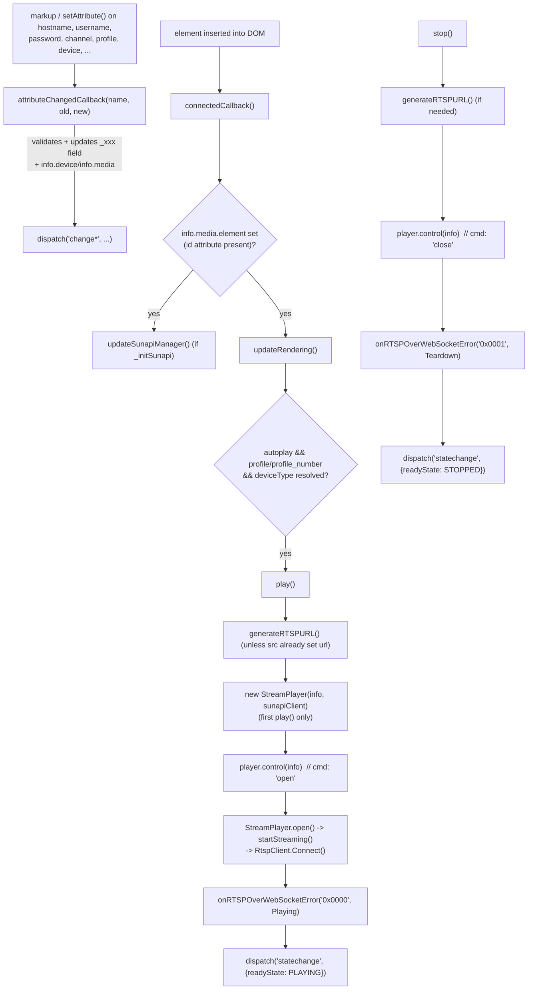
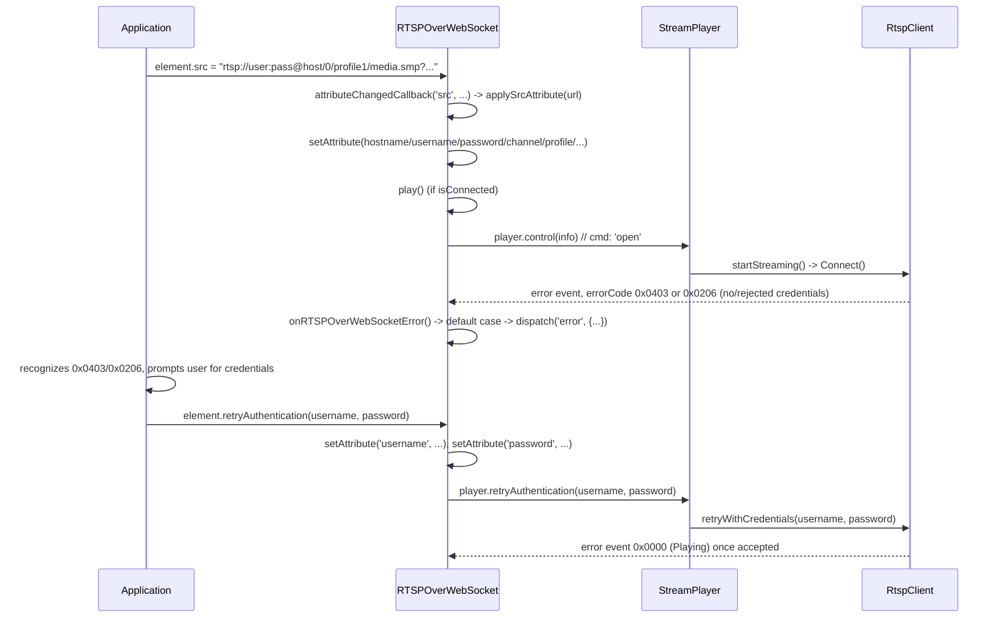
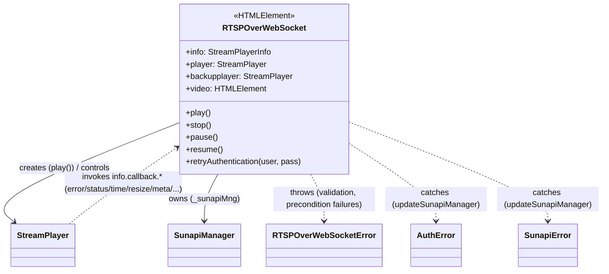
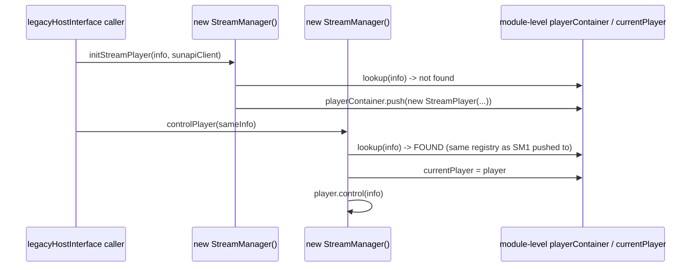
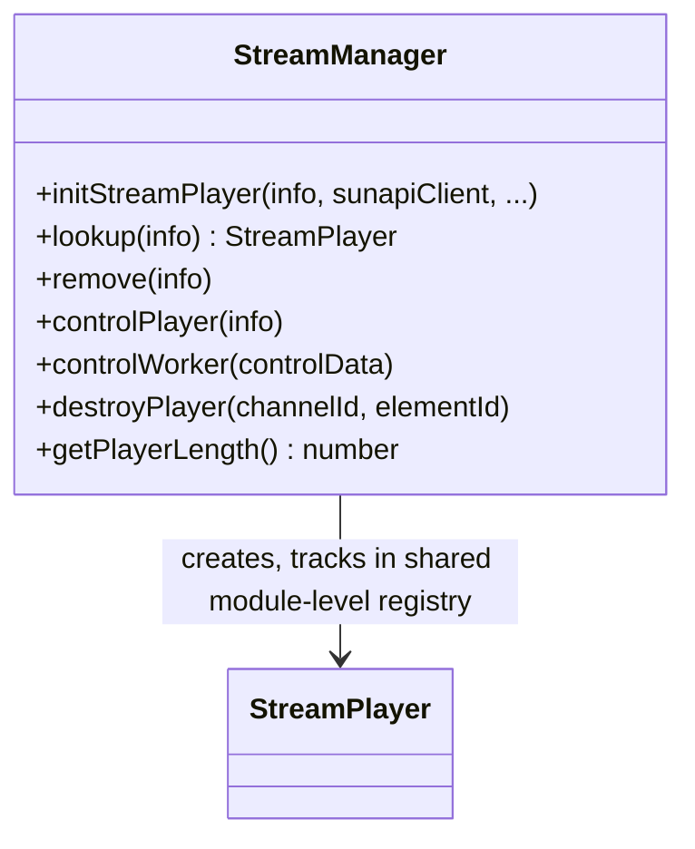
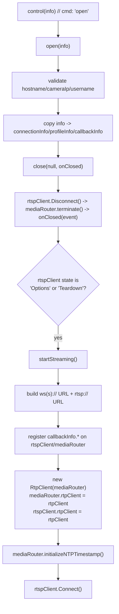
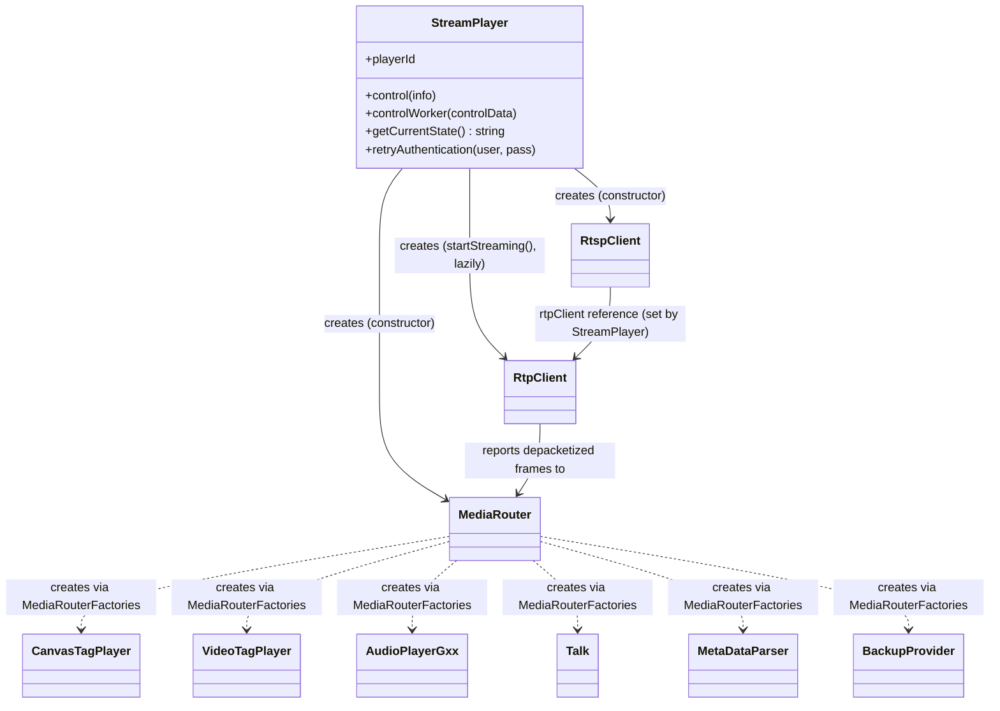
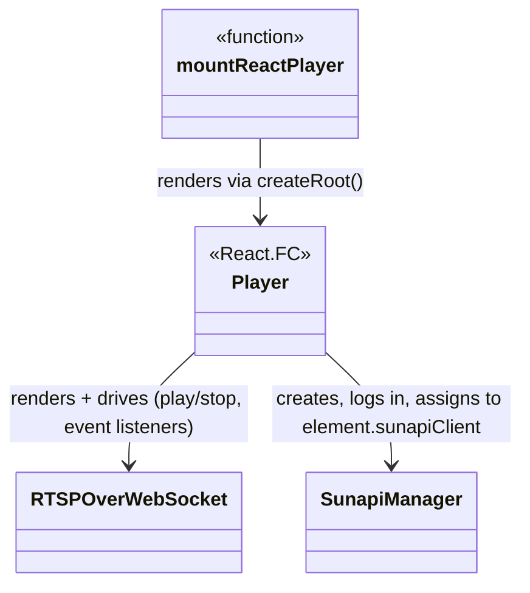
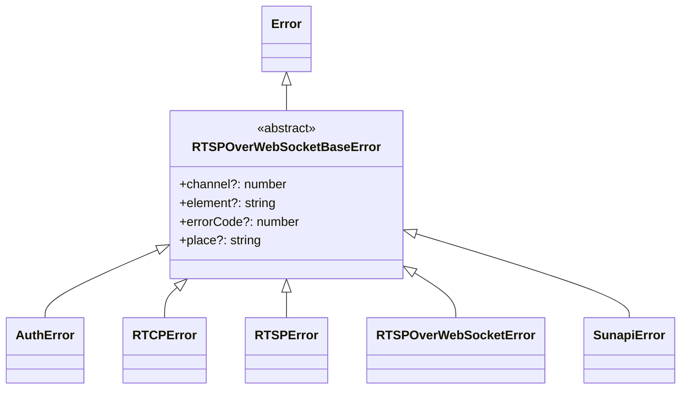

# `src/player` reference — elements, interface, exceptions

*Per-class reference for the public custom element (`elements/`), its per-channel orchestration layer
(`interface/`), the React wrapper (`react/`), and the error hierarchy (`exceptions/`).*

**Version:** 1.7.1 · **Author:** Youngho Kim

**History**

| Date | Change |
| --- | --- |
| 2026-08-06 | Add per-class reference docs for `src/player` (initial version) |
| 2026-08-11 | Add AV1/VP8/VP9 + WebCodecs decode support, per-class player docs, server lifecycle/config improvements, and fix SUNAPI protocol clobbering on non-http(s) hosts |
| 2026-08-11 | Implement `RTSPOverWebSocket.disconnectedCallback()` — was missing entirely |
| 2026-08-13 | Add `.env` support for the live-device test; fix `describe.skip` collection bug; docs |
| 2026-08-26 | Added Title/Abstract/Version/Author/History metadata header |
| 2026-08-26 | Add `RTSPOverWebSocket.transportFactory` get/set — exposes `StreamPlayer`/`RtspClient`'s existing `transportFactory` constructor param as a settable element property |
| 2026-09-03 | Fix `applySrcAttribute()`'s camera-mode path parsing silently discarding a pasted recording `src`'s `mode`/start/end/`OverlappedID` (misread as `profile = 'recording'`, causing a 404 on the following RTSP `OPTIONS`) |
| 2026-09-03 | Follow-up, same fix: widen the `.smp` search to anywhere in the path (not just the last segment) and hoist the legacy path-embedded `key=value` pseudo-param scan to run for camera mode too, ahead of the recording-shape block — so a `src` with trailing `device=`/`gmt=`/`mode=` pairs after `play.smp` (path-embedded or real `?query`) resolves `GMT`/`mode` correctly, with an explicit `mode=` always winning over the `play.smp`-shape inference |
| 2026-09-03 | Second follow-up, same fix: gate the recording-shape block on `this.mode === 'playback'` instead of `smpFilename === 'play.smp'` directly (symmetric with `generateRTSPURL()`'s own `info.media.type` dispatch), and make `start=`/`end=` accept a bare compact `YYYYMMDDHHMMSS` value (not just a combined `{start}-{end}` range segment or a full ISO string) via a new `normalizeStartEndInput()` helper, in both the real `?query` loop and the legacy path scan |
| 2026-09-03 | Third follow-up, same fix: accept `start_time`/`end_time` as alternate key names for `start`/`end` (falling through to the same `case` in both switches), each accepting either value shape (compact digits or full naive ISO); widened the recording-shape block's own start/end deferral checks to also recognize the `_time`-suffixed keys |
| 2026-09-03 | Fourth follow-up, same fix, at the user's explicit request: removed the `play.smp`-filename-based `mode` inference entirely (the `smpFilename` variable is gone) — `mode` is now resolved purely from an explicit `?query`/legacy-path `mode=` value, defaulting to `live` otherwise with no filename fallback. The original reported URL shape (no `mode=` anywhere) no longer auto-resolves to `playback` as a result — a deliberate simplification, not a regression; see MEMORY.md for the full history |
| 2026-09-03 | Fifth follow-up, same fix: the fourth follow-up's removal regressed the original reported URL for real (reported live within the same session — `generateRTSPURL()` producing `.../0/recording/media.smp` instead of the expected playback URL for a `src` with no `mode=`) — restored the fallback inference, this time keyed on the literal `recording` **path segment** (`profileSegment === 'recording'`) rather than the filename, still only feeding the `mode`-based gate rather than being the gate itself |
| 2026-09-03 | Sixth follow-up, same fix: mirrors `mode` onto `info.media.type` immediately inside the `mode === 'playback'` block (`this.info.media.type = 'playback';`), rather than leaving it to `play()`'s own assignment moments later, requested directly |
| 2026-09-03 | `applySrcAttribute()` now resets `username`/`password`/`hostname`/`port`/`sessionKey`/`startTime`/`endTime`/`overlappedId`/`device`/`multicast`/`mode`/`profile`/`profile_number` unconditionally at the top of every call, requested directly — supersedes the narrower hostname-change-only credential clearing this method used to have. Real behavior change: setting `username`/`password` as properties *before* `src` no longer survives the next `src` assignment (see MEMORY.md) |
| 2026-09-04 | Fixed a real memory leak: the constructor's `fullscreenchange`/`keyup` listeners (`window.document`) and `contextmenuDiv()`'s lazy click-to-hide-menu listener (`window`) were all registered with inline `.bind(this)`/arrow functions and never removed — `disconnectedCallback()` (added 2026-08-11, see above) only ever called `stop()`, not this. Since those three targets are page-lifetime `EventTarget`s, not this element, every `<rtsp-over-websocket>` instance ever created stayed reachable (pinning `mediaRouter`, players, buffers, everything) for the rest of the page's life once it had run its constructor, regardless of DOM removal — worst in an app that creates/destroys instances repeatedly (e.g. a multi-camera dashboard switching layouts). Fixed by storing each handler on `this` (`boundExitHandler`/`boundDocumentKeyupHandler`/`boundWindowClickHideMenuHandler`) and removing all three in `disconnectedCallback()`. No behavior change — same listeners, same effect, just now actually removable. Found by the user reading this file for exactly this kind of gap. |
| 2026-09-01 | Fix mouse-wheel zoom anchoring on the wrong point: `ensureRTSPOverWebSocketWrapper()` now sets `transform-origin: 0 0` on the wrapper div |
| 2026-09-01 | Fix `statistics` attribute requiring two toggles to hide the panel: `attributeChangedCallback`'s `'statistics'` case now treats a removed attribute as off, matching the sibling boolean-attribute convention |
| 2026-09-01 | Fix camera-device drag-seek sending the wrong time: `generateRTSPURL()` no longer double-applies `GMT` to `seekingTime`, and `seeking()`'s camera branch now always recomputes `rangeClock` from `seekingTime` (was stuck on stale `_useIso`-gated logic) with the trailing `Z` stripped to match the camera's `samsung-replay-timezone` extension |
| 2026-09-01 | Fix Stop button not actually stopping `<video>` playback: `startTime` setter now accepts `null` (matching `endTime`), which was throwing mid-teardown and aborting the disconnect callback chain before `VideoTagPlayer.close()` ran; added temporary diagnostic `console.log`s across the teardown chain and `generateRTSPURL()`'s playback branches for an ongoing investigation |
| 2026-09-02 | Fix `forward()`/`backward()` (first click, camera device) getting rejected with RTSP `457 Invalid Range` and tearing the connection down: `seeking()` now resets `requestInfo.scale = 1` up front. Root cause was a stale `scale = 0.0` left by `forward()`/`backward()` (set for their own eventual PLAY, tagged with a direction hint for correct serialization) bleeding into `seeking()` whenever `MediaRouter.ts`'s `stepRequest()` fallback called it instead — `seeking()`'s own scale-header call has no direction hint, so the stale value serialized as a bare, unsigned `Scale: 0.00`. Found via a raw RTSP trace against a real camera. |
| 2026-09-02 | Fix `forward()` computing its non-seeking-time `currentDateTime` from `_localTimestamp` (GMT-adjusted) for *camera* devices whenever `GMT` happened to be set — GMT/`_localTimestamp` is an nvr-only concept everywhere else in this class; now gated on `_deviceType === 'nvr'`, matching `seeking()`'s existing camera/nvr split. Reported directly by the user. Also added debug `console.log`s to `forward()`/`backward()` (computed time/rangeClock/scale/url, just before `player.control(info)`), at the user's request. |
| 2026-09-02 | Fix `onRTSPOverWebSocketStep('request')`'s `-2000ms` re-seek target being formatted with `toYYYYMMDDHHMMSS()` (local timezone by design) instead of UTC — shifted the target by this machine's own UTC offset (confirmed ~9 hours under KST via a raw RTSP trace the user captured: `Range: clock=...04:34:59-` from a `currentTimestamp` around `19:35:...`), which the camera rejected with `457 Invalid Range`. Now builds `_seekingTime` the same way `onCustomTimeSeek`'s already-working assignments do (`toISOString().split('.')[0] + 'Z'`), reaching `seeking()`'s existing camera-branch stripping logic in the shape it already handles correctly; removed the now-dead `toYYYYMMDDHHMMSS` import (the shared utility itself is untouched — its local-timezone behavior stays intentional). |
| 2026-09-02 | Fix `seeking()` only clearing `_seekingTime` at the very end of the method (after `generateRTSPURL()`/`player.control()` already ran) — any exception thrown in between left it stuck, and `generateRTSPURL()`'s camera-playback branch always prioritizes a non-null `seekingTime` over `_currentTimestamp`/`startTime`, so a value stuck from one interrupted seek silently overrode the start time of every later, unrelated camera playback search (confirmed live: a fresh `06:07:31`–`06:11:32` search actually played `2026-09-01T21:07:31`–, matching a leftover value from an earlier interrupted seek, not the requested time). Wrapped the method body in `try`/`finally` so the reset always runs. Requested directly by the user, who asked for a full audit of `play()`/`seeking()`/`forward()`/`backward()`/`pause()`/`resume()`/`speed()`'s time handling — the others were all found consistent (camera branches either don't touch GMT or already clear `seekingTime` immediately on read). |
| 2026-09-02 | Fix `onRTSPOverWebSocketTimestamp()` assigning `_localTimestamp` an unshifted `curDate.toISOString()` copy — byte-identical to `_currentTimestamp` — instead of the already-computed, correctly GMT-shifted `localTimestamp` local variable a few lines below (used only for the dispatched event/debug display, never written back). Confirmed against the class's own stated contract by the user: `currentTimestamp` is GMT-0/UTC, `_localTimestamp` is that instant shifted to the device's local wall clock. Every nvr branch reading `_localTimestamp` (`pause()`/`resume()`/`speed()`/`forward()`/`backward()`) expects it pre-shifted and subtracts the GMT offset back off to recover true UTC — with it never actually shifted, that subtraction moved nvr `rangeClock` values further from correct instead of recovering them, on every call. |
| 2026-09-02 | Cleanup, confirmed correct behavior first (reviewed with the user): `generateRTSPURL()`'s nvr `playback`/`backup` `strStart`/`strEnd` construction (`:4851-4869`) computed `const timezone = this.GMT * 3600 * 1000` and then discarded it (`void timezone;`), dead code left over from an earlier fix to a real double-GMT-application bug — `startTime`/`endTime` digits already represent the intended wall-clock instant (same convention `seekingTime` uses), so no further shift belongs here. Removed the dead computation; behavior is unchanged, now just without the misleading unused variable. |
| 2026-09-02 | Removed `_useIso`/`useIsoTimeFormat` entirely (private field, public getter/setter, and all nine branch sites in `play()`/`pause()`/`resume()`/`speed()`/`forward()`-unaffected/`backward()`-unaffected/`seeking()`-unaffected/`startBackup()`/`generateRTSPURL()`). Requested by the user after reviewing every branch: `_useIso === true` was a dead `TODO: camera iso time style generate (legacy: unimplemented)` stub in `generateRTSPURL()`'s two camera branches (checking it produced a URL with no start/end embedded at all), and its only real nvr-side effect (millisecond-fraction inclusion; `Z` was present in both states, contrary to an initial assumption during the same review) had no known real-device rationale. Every former no-GMT branch now unconditionally behaves the way `useIso === true` did — the real camera implementation, and the fraction-dropping nvr shape. `GMT`-present branches are untouched (a separate axis: `GMT` performs an actual timezone subtraction, `_useIso` never did). See MEMORY.md. |
| 2026-09-02 | `GMT` now unconditionally defaults to `0` (UTC) instead of `null` — `_gmt` field, the `GMT` setter's `v === null` case, and `attributeChangedCallback`'s `'gmt'` case all normalize to `0`; `get GMT()` narrowed to always return `number`. At the user's explicit request, every `typeof this.GMT !== 'undefined' && this.GMT !== null` check across `play()`/`generateRTSPURL()`/`pause()`/`resume()`/`speed()`/`forward()` (×2)/`backward()`/`seeking()`/`startBackup()`/the mouse-wheel click-to-seek handler in `update()` had its `else` branch converted from a silent, differently-computed fallback into a `throw new RTSPOverWebSocketError({errorCode: 0x0414, message: 'GMT is required but not set', ...})` — since `GMT` is now always defined through the public API, reaching one of these `else`s means something upstream left it unset, which is a bug to surface, not a legitimate state to degrade for. `backup()`'s `info.device.gmt = this.GMT` assignment (no prior `else`) was simplified to unconditional. `onRTSPOverWebSocketTimestamp()` — a hot per-frame callback, not a user-triggered precondition check — was simplified instead of given a throw: the `hasExplicitGMT` guard was removed entirely (both the `timestamp.timezone` assignment and `_localTimestamp` write are now unconditional), and the debug `timestampElement` display's now-dead GMT-unset fallback branch was removed. The `update()` mouse-wheel site is flagged as needing extra scrutiny beyond the rest: it is the one throw-converted site reachable directly from a live end-user gesture (drag/click-to-seek) rather than purely internal request-building — see MEMORY.md. Deferred, not part of this change: normalizing `startTime`/`endTime`/`seekingTime` through a GMT-conversion function at the setter level (reviewed with the user, judged a separate, larger follow-up). |
| 2026-09-02 | Fix `generateRTSPURL()`'s camera `playback` branch resuming/starting playback exactly `GMT` hours in the past on a positive-offset timezone (reported live: "GMT+9 카메라에서 pause/resume하면 9시간 전으로 재생됨") — its `strStart` fallback (used whenever `seekingTime` is unset, e.g. a plain pause→resume with no drag-seek in between) read `this._currentTimestamp`, which per this class's own confirmed contract is GMT-0/UTC, and embedded its digits directly with no shift — the same "no further shift, digits are already local" treatment `seekingTime`/`endTime` correctly get in this branch (because *those* are pre-shifted by the caller before being set), but wrong for `_currentTimestamp`, which never is. Fixed by reading `this._localTimestamp` instead — the same instant, already GMT-shifted to local wall clock by `onRTSPOverWebSocketTimestamp()` — matching the convention every other value in this branch already follows. Camera `pause()`/`resume()` do no GMT math of their own ("legacy: no-op" for camera devices, see their Method Analysis entries below), so this one line was the sole source of the correct playback position on resume for camera devices. |
| 2026-09-02 | `startTime`/`endTime`/`seekingTime` setters now normalize any accepted input to a canonical true-UTC ISO string, via a new private `normalizeTimeInputToUtcIso()` helper: a string carrying an explicit timezone designator (`Z` or `±HH:MM`/`±HHMM`) is trusted as-is via standard ISO parsing; a naive string (no designator) is treated as local wall-clock digits in the `GMT` zone and converted by subtracting `GMT` hours. Requested by the user, who wanted every internal time computation in this class to operate on one unambiguous representation instead of each caller/consumption site separately knowing, per device type, whether stored digits were pre-shifted to local or already true UTC — the exact ambiguity behind the two GMT-direction bugs fixed earlier the same day (seekingTime double-shifted +9h on camera drag-seek; camera pause/resume landing 9h in the past). Every nvr consumption site that used to subtract `GMT` from a stored value to "recover" true UTC (`play()`, `resume()`, `speed()`, `forward()`, `backward()`, `startBackup()`) now simply uses it directly; every camera consumption site (`generateRTSPURL()`'s `playback`/`backup` branches, `seeking()`'s camera branch — the only places camera wire values are built, since camera `pause()`/`resume()`/`speed()`/`forward()`/`backward()`/`startBackup()` are documented no-ops that rely on `generateRTSPURL()` being re-called) now shifts the stored true-UTC value forward by `GMT` itself before stripping punctuation, since storage is no longer pre-shifted for it. `coordinatedUniversalTime` (public property + `_coordinatedUniversalTime` field) removed entirely — same shape as `_useIso`'s earlier removal — since its `true` state (no GMT subtraction) is now the only correct behavior everywhere it was checked. The double-click/click-to-seek handler (`handleDoubleClick()`, historically referred to as "update()'s mouse-wheel handler" in earlier entries — the actual mouse-wheel handler is `scrolled()`, a pan/zoom feature unrelated to time) had its own GMT-unset throw (added earlier the same day) removed along with the `GMT` term in its formula entirely: it now computes its seek target from `_currentTimestamp` (already true UTC) plus only the click delta, instead of double-shifting `_localTimestamp` by `GMT` again. Not verified against real hardware (WSL2 can't reach real devices, see `CLAUDE.md`) — flagged to the user as needing camera *and* nvr testing with `GMT ≠ 0` before this is considered done. |
| 2026-09-02 | Fix `generateRTSPURL()`'s camera `playback` branch producing a URL with no start segment at all on a *fresh* Play (reported live, real device: `.../recording/-20260902090643/OverlappedID=0/play.smp`) — a direct regression from the `_currentTimestamp` → `_localTimestamp` fix earlier the same day (see History above): `_localTimestamp` is only ever populated by a live `'timestamp'` event, so it's still `null` before any playback has actually started, and with no `seekingTime` set either (a fresh Play, not a seek), `strStart` fell through both checks entirely. The old `_currentTimestamp`-based code never hit this, because `startTime`'s own setter always mirrors into `_currentTimestamp` immediately, independent of any live stream. Added `startTime` (now true UTC like `_currentTimestamp` always was, shifted forward by `GMT` before stripping) as a fallback, kept lower priority than `_localTimestamp` so an already-flowing stream's current position (not the original search start) is still what pause/resume/speed changes reuse. |
| 2026-09-02 | `onRTSPOverWebSocketError`'s `0x0107` case's `'waiting'` DOM event now also carries `playerClosed` (from `MediaRouter.ts`'s matching fix — see `03-mediaSession-core-video.md`'s History), flagging when *this* waiting notice also tore down `MediaRouter`'s internal player. Root cause of the underlying crash was in `MediaSession/MediaRouter.ts`, not this class (`sendCommandData`'s `forward`/`backward` asserting `player!` non-null instead of guarding it, same fix), but the DOM-event surface consumers actually listen on is here — a host page's `'waiting'` listener can now disable step-forward/backward buttons for that window instead of leaving them clickable into a null player. See MEMORY.md. |
| 2026-09-02 | Added `onRTSPOverWebSocketPlayerAvailability(available)`, wired as `info.callback.playerAvailability` and dispatching a new public `'playerstatechange'` DOM event (`{ available: boolean }`). Direct follow-up to the entry above, from a fresh live console trace after that fix shipped: `playerClosed` on `'waiting'` only covers `onWaiting()`'s own covert-mode teardown — the *other* place `MediaRouter.player` goes null (`initVideoPlayer()`, called from `stepRequest()`/the `resume`/`seek` command cases) had no consumer-visible signal at all, so a host page gating step buttons on `'statechange'` PAUSED/PLAYING/STEP could still have a click reach a null player: a step's own auto-pause ack (PAUSED) can arrive and re-enable those buttons while an *unrelated*, still-in-flight buffer-refill re-seek (from an earlier step) has the player null. This event is sourced directly from `MediaRouter.ts`'s `player` getter/setter (see that file's History) rather than from any particular code path, so it covers every null/non-null transition uniformly — not just covert-mode teardown. See `MEMORY.md`. |
| 2026-09-02 | Fix selecting a new event on a host page's timeline (`player.startTime = ...`) while a stream is already playing silently having no effect on the next `play()` — reported directly by the user. Root cause: `generateRTSPURL()`'s camera `playback` branch intentionally prioritizes `_localTimestamp` (an already-flowing stream's *current* position) over `startTime`, but `_localTimestamp` used to only get cleared by `stop()` or the `GMT` setter, not by `startTime` itself — so a fresh `startTime` assignment left the *previous* stream's stale `_localTimestamp` in place and got silently outranked by it, unlike `seekingTime`, which unconditionally overrides `strStart` regardless of priority. The `startTime` setter (`:~1482`) now also clears `_localTimestamp`, so an explicit new `startTime` always wins on the next `play()`; the pause/resume/speed path is unaffected since it reads `_localTimestamp` directly and never goes through this setter. |
| 2026-09-03 | `GMT` setter (`:1891-1917`) now treats `v === undefined` the same as `v === null` — both normalize to the default `0` — instead of throwing `RTSPOverWebSocketError` 0x0414 on `undefined`. Requested directly by the user, who pointed at the setter's previous `if (typeof v !== 'number' && v === undefined) throw ... else if (v === null) { ...default...}` shape (the `typeof v !== 'number'` half of that first condition was always redundant, since `v === undefined` already implies it) and asked for `undefined` to fold into the `null` branch instead of the throw branch. The two branches were merged into one `if (v === null || v === undefined)` check; the legacy loose validation for any other non-number garbage (e.g. a string) — falling through to the range check unvalidated — is unchanged. |
| 2026-09-03 | Direct follow-up, same setter: the "legacy loose validation" the entry above left unchanged (a non-number like a string silently fell through the range check, since `< -12`/`> 13` both evaluate `false` for it) is now removed at the user's explicit request — the range check became `if (typeof v !== 'number' || v < -12 || v > 13) throw ...`, so a non-number (that isn't already caught as `null`/`undefined` above) is rejected with the same `RTSPOverWebSocketError` 0x0414 an out-of-range number gets, instead of silently passing through to `setAttribute('gmt', String(v))`. The `(v as number)` casts on the old range check are gone too — TypeScript narrows `v` to `number` after the merged `typeof`/range guard on its own. |
| 2026-09-03 | Fixed `onRTSPOverWebSocketMeta` silently dropping every metadata frame: it required both `meta.json` and `meta.xml` before dispatching the `'meta'` DOM event, but `.json` is explicitly optional (only populated if the consuming page loads the optional `external-lib/fast-xml-parser` CDN script, per `MetaDataParser.ts`'s own documented graceful-degradation contract). Reported directly by the user (`wisenet-camera-discovery` never loads that script, so `meta.json` was always `undefined` and the event never fired — no error, nothing in console). Changed the guard's `&&` to `||` per the user's explicit follow-up request — dispatches whenever either field is present. See `MEMORY.md`. |
| 2026-09-04 | Added the ONVIF metadata overlay wiring: `onRTSPOverWebSocketMeta` now also drives a mounted `OnvifOverlay` (bounding boxes/labels colored by event type), gated on a new "ONVIF Event" context-menu toggle (`createSwitch()`, hidden until the first `VideoAnalytics` frame parses). Requested directly by the user. See `10-onvif-metadata-overlay.md` (new file) and `DESIGN.md` §2.7. |
| 2026-09-04 | Reported by the user: memory usage climbs past 1GB during a long session and doesn't drop back down after `stop()`, requiring the video tag to be reinitialized manually. Added `resetPlayerElement()`, called from `stop()`, which physically removes and recreates the `<video>`/`<canvas>` DOM node (same attribute-preserving swap `onRTSPOverWebSocketVideoMode()` already uses for a Renderer Type switch) — a browser's internal MSE/decoder/GPU-backed memory for a `<video>` element isn't reliably reclaimed just by clearing `src`/`srcObject`, only by the node itself leaving the DOM. Also hardened `VideoTagPlayer.close()` (see `05-video-player-rendering.md`'s History) to drop its own queued-sample arrays and `mediaSource` reference immediately rather than waiting on GC. Not yet verified against a real device. See `MEMORY.md`. |
| 2026-09-04 | Added a `debug` attribute/property: a JSON object naming which internal components (grouped by subsystem — `mediaSession`/`network`/`listen`/`video`/`backup`, matching `docs/player/02` through `07`'s own groupings, `vendor` excluded) should emit gated `console.log` tracing. `attributeChangedCallback`'s new `'debug'` case parses+validates the JSON (`util/debugLog.ts`'s `parseDebugAttribute()`), throwing `RTSPOverWebSocketError` (`0x0414`, the same generic invalid-attribute code every other malformed case uses) on bad shape; the `debug` property setter additionally accepts a pre-parsed object directly. Stored on `info.debug` (new `StreamPlayerInfo` field, see below) — read once by `StreamPlayer`'s constructor at `play()` time, not re-read afterward (matches most other attributes' "set before play" semantics). Requested directly by the user. See `03-mediaSession-core-video.md`, `05-video-player-rendering.md`, `06-listen-audio.md`, `07-talk-backup-worker.md`, and `08-util.md`'s new `debugLog.ts` entry for the full propagation chain and per-subsystem detail. |
| 2026-09-04 | `debug` gained a second axis on top of the per-component enable check added the same day above: a `"level"` key (`"debug"`\|`"info"`\|`"warning"`\|`"error"`, default `"info"`) filtering *which* of an enabled component's messages actually print. **Real behavior change for anyone already using `debug` from earlier the same day**: every existing gated call across `02`–`07` logs at `"debug"` severity, so `debug={"network":["RtspClient"]}` with no explicit `"level"` now shows **nothing** (default threshold `"info"` filters `"debug"` out) — `{"level":"debug", ...}` is required to see them, same as before this change. `warning`/`error` print via `console.warn`/`console.error` with a yellow/red `%c`-styled `[ComponentName]` tag respectively (requested directly by the user); `debug`/`info` stay plain `console.log`. See `08-util.md`'s `debugLog.ts` entry for the full level-vs-component-gate interaction and `MEMORY.md`. |
| 2026-09-04 | Added `setRTSPOverWebSocketDebug(config, selector?)`, exported and also attached to `window` as a module side effect (right after `customElements.define`) — a console/devtools convenience that sets `.debug` on every `<rtsp-over-websocket>` element currently matching `selector` (default: all of them) without needing a reference to a specific instance first, returning how many it updated. Accepts the same JSON-string-or-object duality the `debug` property setter itself does. Same "read once at `play()` time" semantics as `debug` itself — doesn't retroactively reconfigure an already-running session. Requested directly by the user; see README.md's "Debug logging" § "Setting it from the browser console". |
| 2026-09-04 | The "read once at `play()` time" limitation the entry above documented turned out to be a real problem in practice: reported directly by the user, `setRTSPOverWebSocketDebug(null)` mid-stream had no visible effect — packet-level tracing kept printing. Both the `debug` attribute case and the `debug` property setter now call a new private `pushDebugConfigToRunningPlayers()`, which sets `.debug` on `this.player`/`this.backupplayer` (if either already exists) in addition to updating `this.info.debug` — `StreamPlayer.ts`'s own `set debug()` (new; `debugConfig` is no longer `readonly`) cascades that down into `mediaRouter`/`rtspClient`/`rtpClient` and everything *they* already hold, all the way down to individual `*Session`s and, for video, `CanvasRenderer`'s drawer. See `MEMORY.md` for the full per-class breakdown and `03-mediaSession-core-video.md`/`05-video-player-rendering.md`/`06-listen-audio.md`'s matching entries. |

---

Per-class reference for the public custom element (`elements/`), the per-channel orchestration
layer it drives (`interface/`), the React wrapper (`react/`), and the error hierarchy
(`exceptions/`). This is one file in a set of per-subsystem references (network/, mediaSession/,
video/, listen/, talk/, backup/, worker/, util/ are documented separately); collaborators outside
this file's scope (`RtspClient`, `RtpClient`, `MediaRouter`, `CanvasTagPlayer`, `VideoTagPlayer`,
`AudioPlayerGxx`, `Talk`, `BackupProvider`, `SunapiManager`, ...) are referenced by name only.

See [src/player/README.md](../../src/player/README.md) for the full static class-relationship
map and [docs/ARCHITECTURE.md](../ARCHITECTURE.md) for the end-to-end data-flow/sequence
diagrams; this document goes deeper — per-method — than either.

## Contents

1. [`elements/RTSPOverWebSocket.ts`](#rtspoverwebsocket-srcplayerelementsrtspoverwebsocketts)
2. [`elements/RTSPOverWebSocketTypes.ts` and `elements/panelStyles.ts`](#elementsrtspoverwebsockettypests-and-elementspanelstylests-support-files)
3. [`interface/StreamManager.ts`](#streammanager-srcplayerinterfacestreammanagerts)
4. [`interface/StreamPlayer.ts`](#streamplayer-srcplayerinterfacestreamplayerts)
5. [`react/index.ts` and `react/Player.tsx`](#react-wrapper-reactindexts--reactplayertsx)
6. [`exceptions/*` hierarchy](#exceptions-hierarchy)

---

## `RTSPOverWebSocket` (`src/player/elements/RTSPOverWebSocket.ts`)

The public API surface of the library: a `customElements.define('rtsp-over-websocket',
RTSPOverWebSocket)` custom element (`src/player/elements/RTSPOverWebSocket.ts:5483`). It is an
intentionally large (~5,500-line), faithful, line-for-line port of a single legacy custom-element
class — every accessor, DOM-builder method, and playback command mirrors a legacy method of the
same name, including confirmed pre-existing bugs, which are preserved and documented inline at
their exact location rather than fixed silently (file header comment,
`RTSPOverWebSocket.ts:15-37`).

### Structure

- **Extends `HTMLElement`** directly — no other base class. Registered once at module load via
  `customElements.define('rtsp-over-websocket', RTSPOverWebSocket)` (`RTSPOverWebSocket.ts:5483`).
- **Custom-element lifecycle callbacks implemented:** `static get observedAttributes()`
  (`:314-349`), `attributeChangedCallback(name, oldValue, newValue)` (`:351-671`),
  `connectedCallback()` (`:673-850`), **`disconnectedCallback()`** (added — was missing entirely,
  see below).
  - **`disconnectedCallback()` — fixed, real bug.** Previously not implemented at all: the element
    did no cleanup (no `stop()`, no WebSocket teardown, no listener removal) when removed from the
    DOM, so a consumer that just detached/discarded the element without explicitly calling `stop()`
    first left the old instance's WebSocket connection, `MediaSource`/`SourceBuffer`, and RTP
    processing all still running in the background. Confirmed live: this repo's own demo's Connect
    button (`disconnect()` in `src/index.html`) does `playerHost.removeChild(playerEl)` with no
    `stop()`/`close()` call of its own — switching codecs (e.g. AV1 → a real camera's H.264) without
    pressing Stop first left two sessions running concurrently in the same tab, and the *new* one's
    video appeared to freeze (RTP still arriving per its own statistics, decode/render not keeping
    up) while contending with the still-live old one. Fixed with the same
    `stop()`-throws-if-nothing-was-playing guard already used for the analogous case in the `src`
    setter's own reconnect path (`stop()` only when `this.player` actually exists; errors caught
    rather than thrown out of a browser-invoked lifecycle callback) — see Method Analysis below.
    Calling `stop()` explicitly before discarding the element is still fine (redundant but
    harmless, since `stop()` isn't itself unsafe to call once cleanup has already happened via this
    callback... though in practice `disconnectedCallback` fires *after* removal, so an explicit
    `stop()` beforehand remains the more deterministic choice when a consumer controls both).
- **Attribute-backed private state:** ~35 `_xxx` fields (`_hostname`, `_channel`, `_profile`,
  `_username`, `_password`, `_width`/`_height`, `_secure`, `_playType`, `_playSpeed`,
  `_statistics`, `_network`, `_gmt`, `_bestshotFilter`, `_minimap`, `_usesubstream`,
  `_camChannel`, `_codec`, `_limitWidth`/`_limitHeight`, `_android`, ...), each exposed through a
  paired `get`/`set` accessor plus (for most) a matching `attributeChangedCallback` case
  (`:64-126`).
- **`info: StreamPlayerInfo`** (`:138`) — built once in the constructor (`:220-275`) as
  `{ callback, device, media }`; `callback` binds every `onRTSPOverWebSocket*` handler up front so
  `StreamPlayer`/`RtspClient`/`MediaRouter` can invoke them without knowing this class exists.
  This same object is threaded through to `StreamPlayer.control()`/`controlWorker()` on every
  playback command — it is the element's entire "outbound" contract with the orchestration layer.
- **`player: StreamPlayer | null`** (`:139`) and **`backupplayer: StreamPlayer | null`** (`:140`)
  — lazily created by `play()` (`:4120-4122`) and `startBackup()` (`:5456-5458`) respectively; two
  independent `StreamPlayer` instances so a live/playback session and a parallel backup export can
  run concurrently.
- **`video: VideoContainerElement`** (`:141`) — a `<canvas>` by default (`:277`), swapped for a
  `<video>` (or back) at runtime by `onRTSPOverWebSocketVideoMode()` (`:3375-3435`) in response to
  `MediaRouter`'s rendering-mode decision.
- **`_sunapiMng = new SunapiManager()`** (`:90`) — owns the optional SUNAPI REST/digest-auth
  client; `sunapiClient` get/set (`:1320-1356`) proxies to it. The setter also discards a stale
  `this.player` if one already exists — see its own Method Analysis bullet below for why.
- A large block of `?HTMLElement`/`?SVGPolylineElement` fields (`:144-215`) for the statistics
  panel, network-state dot, context menu, and gesture-notification overlays — all lazily created
  by the private DOM-builder methods (`statisticsDiv()`, `networkstateDiv()`, `contextmenuDiv()`,
  `updateRendering()`) rather than in the constructor.
- **`listeners: Map<LegacyListener, {type, listener}>`** (`:136`) — backs this class's own
  `addEventListener`/`removeEventListener`/`dispatchEvent` overrides (see below); it is *not* the
  native `EventTarget` listener list.
- Constructor also wires `oncontextmenu`/`onmousemove`/`onclick`/`ondblclick`/(non-standard)
  `onmousewheel` directly as element properties (`:280-289`), and registers
  `fullscreenchange`/`keyup` listeners on `window.document` for the Esc/F11 fullscreen-toggle
  behavior, via `boundExitHandler`/`boundDocumentKeyupHandler` — bound-once fields rather than
  inline `.bind(this)`/arrow functions specifically so `disconnectedCallback()` can remove them
  with the same reference later (fixed 2026-09-04, see the History entry above — this was a real
  leak before). `contextmenuDiv()`'s lazy click-to-hide-menu listener on `window`
  (`boundWindowClickHideMenuHandler`) follows the same pattern for the same reason.

### Method Analysis

**Lifecycle**

- `constructor()` (`:217-308`) — builds `info`, defaults `video` to a `<canvas>`, wires mouse/
  keyboard handlers, registers cross-browser fullscreen-change listeners.
- `static get observedAttributes()` (`:314-349`) — the ~30 attributes
  `attributeChangedCallback` reacts to (`src`, `hostname`, `channel`, `profile`,
  `profile_number`, `device`, `username`, `password`, `iframe`, `controls`, `multicast`, `width`,
  `height`, `autoplay`, `mode`, `proxy`, `port`, `secure`/`https`, `statistics`, `network`, `gmt`,
  `grunt`, `bestshotfilter`, `usesubstream`, `client`, `camchannel`, `profileusage`, `codec`,
  `limitwidth`, `limitheight`, `android`).
- `attributeChangedCallback(name, oldValue, newValue)` (`:351-671`) — one `switch` case per
  observed attribute; each case parses/validates `newValue`, updates the matching `_xxx` field
  and/or `this.info.device`/`this.info.media`, and (for most) dispatches a `change*` `CustomEvent`
  only when the value actually changed. Several cases `throw RTSPOverWebSocketError` on malformed
  input (e.g. `channel < 1`, non-integer `profile_number`, unrecognized `codec`). The `'src'` case
  is guarded by `_reflectingSrc` (see `applySrcAttribute()` below) so `generateRTSPURL()`'s own
  reflection write doesn't loop back into itself. Per a legacy-preserved comment (`:668-670`),
  `attributeChangedCallback` never re-renders anything itself — only `connectedCallback` does.
  **Boolean-attribute cases must treat `newValue === null` (attribute absent/removed) as off**,
  matching `'controls'`/`'secure'`/`'https'`/`'network'`/`'usesubstream'`'s shared
  `newValue === 'true' || newValue === ''` shape — `'statistics'` (`:542-552`) used to instead
  compute `newValue !== 'false'`, which reads a removed attribute as *on*. Since
  `statisticsDiv()`'s off-path (`:2865-2877`) tears down the panel and then calls
  `this.removeAttribute('statistics')`, that removal synchronously re-fired this callback with
  `newValue = null`, flipping `_statistics` back to `true` and rebuilding the very panel just torn
  down — so one `statistics = false` (or one attribute toggle-off) never actually hid it; only a
  second call did, since by then the attribute was already absent and `removeAttribute()` was a
  no-op that didn't re-fire the callback. Fixed (2026-09-01) by aligning `'statistics'` with the
  sibling pattern; if this file's code is ever refactored, don't reintroduce `!== 'false'` here.
- `connectedCallback()` (`:673-850`) — the one-time DOM-attach setup: sets `position: relative`/
  `display: block` if unset (so absolutely-positioned overlay panels anchor to this element, not
  the viewport), re-reads every attribute already present at attach time into the matching field/
  `info.*` slot (duplicating a subset of `attributeChangedCallback`'s own logic for attributes
  that were set before the element was upgraded), assigns the video element's DOM id, and — if
  `info.media.element` is set (an `id` attribute was given) — calls `updateSunapiManager()`
  (conditionally) and unconditionally `updateRendering()`. Wrapped in try/catch that only
  `console.error`s (a lifecycle callback throwing would otherwise be an uncaught exception the
  browser can't usefully surface).
- `disconnectedCallback()` — added (was missing entirely, see the bullet above on the class-level
  list of implemented callbacks for the full story). Calls `stop()` if `this.player` exists,
  guarded the same way the `src`-attribute reconnect path already guards its own `stop()` call
  (`stop()` throws if nothing was ever playing); wrapped in try/catch + `console.error`, matching
  `connectedCallback`'s own pattern for the same reason (a lifecycle callback the browser invokes
  directly shouldn't throw uncaught). **Also removes the constructor's/`contextmenuDiv()`'s
  `window`/`window.document` listeners** (`boundExitHandler`/`boundDocumentKeyupHandler`/
  `boundWindowClickHideMenuHandler`, in a second try/catch), fixed 2026-09-04 — those three were
  registered against page-lifetime `EventTarget`s and, until this fix, never removed, leaking
  every instance for the rest of the page's life once its constructor had run, independent of
  `stop()` tearing down its actual session. `removeEventListener` on a listener that was never
  added (e.g. `boundWindowClickHideMenuHandler` when the context menu was never opened) or already
  removed is a silent no-op, so this is safe to run unconditionally and more than once.
- `updateRendering()` (private, `:2231-2338`) — builds the `.video-container` overlay (rewind/
  forward tap-notification DOM + styles) if not already built, appends `this.video` into the
  shared wrapper, and — if `autoplay` plus a resolved profile/device are present — calls `play()`.
  Before appending, it sets an explicit `width: 100%; height: 100%; display: block;
  margin-left/right: auto; object-fit: contain` inline style on `this.video` (`:2303-2327` area) so
  the canvas/video tag always fits the `<rtsp-over-websocket>` host's own box. This matters because
  the canvas's `width`/`height` *attributes* hold the decoded stream's intrinsic pixel buffer size
  (set to the real resolution — e.g. 1920x1080 — by `CanvasRenderer`/`WebGLCanvas` once frames
  arrive), which is unrelated to on-screen display size; without this CSS the canvas previously
  rendered at that intrinsic size and overflowed a smaller host box (e.g. `width="800"
  height="480"`). `onRTSPOverWebSocketVideoMode`/`onRTSPOverWebSocketResize` (below) apply the same
  styling when they later touch the tag (mode switch / real resolution arriving) — setting it here
  up front makes the fit unconditional from initial attach.
  **`object-fit: contain` (fixed; was missing until a real consumer reported stretched/distorted
  video)**: `width/height: 100%` alone stretches the element to *exactly* fill the host's box,
  which distorts the picture whenever the host box's own aspect ratio (from its CSS/attributes)
  doesn't match the decoded video's — e.g. a `640x320` (2:1) host showing a `640x480` (4:3) stream.
  `object-fit: contain` is supported on `<canvas>` the same as `<video>` in every
  Chromium/Firefox/Safari version this player otherwise targets (both are CSS "replaced elements"),
  so it's applied unconditionally for both tag modes: the element's own box still fills 100% of the
  wrapper, but the picture inside it now letterboxes/pillarboxes and centers (object-fit's default
  `object-position` is `50% 50%`) instead of stretching — regardless of tag mode or host aspect
  ratio. Same fix, same reasoning, applied identically at all three places that (re)write this
  style: here, `onRTSPOverWebSocketVideoMode()`, and `onRTSPOverWebSocketResize()` (see below for
  why all three needed it, not just this one).

**`src` attribute / URL generation** (see "401 handling" below for the credential-retry piece)

- `get/set src` (`:1671-1676`) — thin `getAttribute('src')`/`setAttribute('src', v)` pair.
  Deliberately does **not** also write the legacy `_source` field (long comment at `:1656-1670`
  explains why: doing so would make every `if (this._source === null) generateRTSPURL()` gate
  elsewhere permanently skip URL generation after the first `src` write).
- `applySrcAttribute(srcValue)` (private, `:4460-...`) — parses `src` as a `URL`.

  **Resets every session-identifying field to its default at the very top, unconditionally, on
  every call** (requested directly, 2026-09-03 — supersedes the narrower hostname-change-only
  clearing this bullet used to describe; see MEMORY.md for that history): `username`/`password`
  (to `''`), `hostname`/`port`/`device` (via `removeAttribute()`), `sessionKey`/`startTime`/
  `endTime`/`overlappedId` (to `null`, via their plain-property setters), `multicast` (`_multicast
  = false`, assigned directly), `mode` (`_playType = null`, assigned directly), and
  `profile`/`profile_number` (assigned directly). Every `applySrcAttribute()` call is now a
  complete, self-contained "connect to exactly this stream" request: only what the new `src` itself
  specifies (below), or a property assigned *afterward* (e.g. `sunapiClient`), takes effect —
  nothing a *previous* `src` or connection left behind carries over.

  **Consequence worth knowing** (this is a real behavior change, not just an internal
  simplification): setting `username`/`password` as plain properties *before* assigning `src` on
  the same element — a pattern an earlier version of this method's own comments explicitly
  protected — no longer works; those properties are wiped by this reset the moment `src` is next
  assigned, unless the new `src` itself supplies its own credentials in its authority component
  (`user:pass@host`). No code in this repo's own demo pages or `react/Player.tsx` currently relies
  on that pattern (checked at the time of this change — the "RTSP URL" tab's SUNAPI-checked flow
  sets `username`/`sunapiClient` then calls `play()` directly, never also assigning `src`; the
  "Player" tab sets `username`/`password` as properties but never assigns `src` at all), but an
  external consumer of this element following the old documented pattern would need to switch to
  supplying credentials via the `src` URL's authority component, or via `sunapiClient`, instead.

  Three fields needed special handling to avoid throwing, since their `attributeChangedCallback`
  cases don't accept a `removeAttribute()`-style `newValue = null` cleanly: `mode`'s setter throws
  for anything that isn't a `string` (`null` always is); `profile`/`profile_number`'s cases both
  throw `RTSPOverWebSocketError` for a non-string/non-integer `newValue` (`null` again always is).
  `multicast` has a different problem — its case (`case 'multicast': { this._multicast = true;
  break; }`) sets `true` *unconditionally* whenever it fires at all, never actually checking
  `newValue`, so `removeAttribute('multicast')` would (per this pre-existing quirk) set `_multicast
  = true`, the opposite of a reset. All three are assigned directly to their private field instead
  of going through `setAttribute`/`removeAttribute`, matching each field's own true declared
  default. `hostname`/`port`/`device`, by contrast, all accept a `null` `newValue` safely in their
  own cases (no validation to trip), so `removeAttribute()` is used for those — it also keeps their
  `info.device.*` mirrors (`cameraIp`/`hostname`, `deviceType`) in sync, which a direct private-field
  poke would have missed. `username`/`password` reset to `''` via `setAttribute()`, not
  `removeAttribute()`, for the same reason this distinction mattered in the original hostname-change
  fix this reset now supersedes: `removeAttribute()` would set `info.device.username`/`password` to
  `undefined` rather than `''`, and `StreamPlayer.ts`'s `open()` throws `RTSPOverWebSocketError`
  ("username is empty from input parameter.") for `undefined` but not for `''` (this class's actual
  "no credentials" representation).

  Otherwise, username/password/hostname from the authority go through `setAttribute`
  unconditionally; `port` is handled specially (see below). Every recognized `?query=value` param
  is passed through generically to the matching attribute (bare flags like
  `?statistics` arrive as `''`, matching the existing boolean-attribute convention), with a few
  RTSP-session-only settings (`session`, `start`, `end`, `overlap`/`overlappedid`) special-cased
  onto plain properties instead since they were never real attributes. **`device` is resolved and
  written back explicitly** (`:4441-4442`, fixed 2026-08-26) rather than relying on the generic
  passthrough alone: it reads `url.searchParams.get('device') ?? this.getAttribute('device') ??
  'camera'` and always calls `setAttribute('device', deviceType)` with the result. This matters
  because the passthrough loop above it only fires for query params the `src` URL's *query
  string* actually contains — a `src` with no query string at all (a plain nvr-shaped path like
  `rtsp://host:port/LiveChannel/0/media.smp`, no `?device=nvr`) on a fresh element that never had
  `device` set another way used to leave the real attribute/`_deviceType` at its `null` default
  forever, and `generateRTSPURL()` would throw `0x0404` ("device attribute is not define.") the
  instant `play()` ran below — confirmed live, reported via exactly that URL shape from the demo
  page's "RTSP URL" tab. Note this only stops the *crash*: a `src` with no `?device=` at all still
  resolves to `'camera'` by default (matching the field-note/placeholder on the demo page's RTSP
  URL tab, which now shows both a camera- and an nvr-shaped example) — `?device=nvr` must be given
  explicitly for an nvr-shaped path, since nothing in the path shape alone reliably distinguishes
  the two. **The path's `channel` segment is also device-aware** (`:4460-4462`, fixed 2026-08-26,
  same investigation): nvr-mode paths (`generateRTSPURL()`'s nvr branch, and `RtspClient.ts`'s
  device="nvr" URI builder) lead with a literal `LiveChannel`/`PlaybackChannel`/`BackupChannel`
  segment before the channel number, unlike camera mode where the channel is `segments[0]` with
  no prefix — `applySrcAttribute()` now strips that literal prefix (matched case-insensitively)
  before reading the channel segment when `deviceType === 'nvr'`; previously `Number('LiveChannel')`
  was always `NaN` and `channel` silently never got set for *any* nvr-shaped `src`.

  **Legacy path-embedded `key=value` pseudo-params, now shared by both device types** (originally
  nvr-only, `:4483-4530`, added 2026-08-26 the same day `generateRTSPURL()`'s nvr branch switched
  to emitting a real `?query` string instead of embedding these in the path; widened to camera mode
  too, and hoisted to run once for both, 2026-09-03). `generateRTSPURL()`'s nvr branch used to embed
  pseudo-params directly in the path — `/profile=H264`, or (with a session key) a single
  `/session=X&start=Y&profile=Z`-shaped segment — instead of a real `?query` string; this fallback
  keeps a `src` written that way (hand-typed, bookmarked, or — the case that widened it to camera
  mode — a camera recording `src` with trailing `device=`/`gmt=`/`mode=` pairs *after* `play.smp`,
  e.g. `.../play.smp/device=camera/gmt=9/mode=playback`) working. Every path segment after the
  channel is scanned for `&`-joined `key=value` pairs (a bare resource-type suffix segment like
  `media.smp`/`play.smp`/`backup.smp` — already removed by the `.smp` search below by the time this
  runs, in practice — is skipped defensively) and routed through the same
  `session`/`start`/`end`/`overlap`/`knownAttributes` handling the real `?query` loop above uses —
  so a hand-typed or bookmarked `.../media.smp/profile=H264` (or the old
  `/session=X&start=Y&profile=Z` combined-segment form) still works, alongside the new
  `?profile=H264` form. Never overrides a key the real `?query` string already supplied in the same
  parse (tracked via `queryProvidedKeys`, populated by the `?query` loop above) — the path fallback
  is a best-effort guess, not authoritative over an explicit `?query` value — and once one of *its
  own* keys is applied, adds that key to `queryProvidedKeys` too, so (for example) a path-embedded
  `mode=playback` here still counts as "already provided" for the camera recording-shape block just
  below, the same way a real `?mode=` would. Verified live against this repo's own bridge
  (`rtspOverWebSocket/server.ts`): both `.../media.smp?device=nvr&profile=H264` and
  `.../media.smp/profile=H264?device=nvr` reach `200 OK` on the same session.

  The path also supplies, for camera devices, `profile`/`profile_number` — **or, if `mode` has
  already resolved to `'playback'` by this point, `start`/`end`/`overlappedid` instead** (fixed
  2026-09-03 across several iterations the same day, found live via a reported 404 on the RTSP
  `OPTIONS` that followed pasting a recording `src`; the block itself gates on the resolved `mode`,
  not directly on any filename or path segment — see below for how it got there). Camera-mode
  `generateRTSPURL()`'s
  `playback`/`backup` branches emit `{channel}/recording/{start}[-{end}]/OverlappedID={id}/
  {play|backup}.smp` (the compact `YYYYMMDDHHMMSS` digit pair, GMT-shifted — see that method's own
  entry below), not the plain `{channel}/{profile}/media.smp` live shape. Originally, camera mode had
  no equivalent of nvr's path-embedded fallback above (which didn't run for camera mode at all yet):
  `segments[1]` (`'recording'`) fell straight into the plain-profile case and was written out as
  `profile = 'recording'`, `mode` silently stayed at its `'live'` default, and the
  start/end/`OverlappedID` segments were dropped entirely — so pasting a camera recording `src`
  (including one copied from `generatertspurl`'s own reflected `src` value) resolved to the
  nonexistent `{channel}/recording/media.smp` and 404'd.

  **This went through four iterations the same day before settling on the current shape**
  (each corrected in response to the user testing a further real `src` shape — see MEMORY.md's four
  "follow-up" subsections for the blow-by-blow if this needs revisiting):
  1. First keyed the branch directly off `segments[1] === 'recording'` — worked for the initial
     report, but conflated "what shape is this path" with "what is `mode`" (no gate/inference split
     yet).
  2. Re-keyed off the trailing filename instead (`play.smp` vs `backup.smp`, captured into a
     `smpFilename` variable before removing it from `segments`) — motivated by `'recording'` being
     shared by *both* the `playback` and `backup` shapes (`generateRTSPURL()` writes that same
     literal segment for both `info.media.type` values), so it alone can't distinguish them, while
     the filename can.
  3. Split the design into an explicit **gate** (`this.mode === 'playback'`) fed by an **inference**
     (`smpFilename === 'play.smp'`, only when `mode` wasn't already given explicitly) — at the
     user's request, to make the gate itself symmetric with `generateRTSPURL()`'s own camera branch,
     which dispatches on `info.media.type` (`mode`'s underlying source), never on a filename.
  4. Removed the filename-based inference entirely, at the user's explicit request ("`smpFilename`의
     구분은 삭제해줘" — "delete the `smpFilename` distinction") — briefly leaving `mode` resolved
     *purely* from an explicit source (real `?query`/legacy path-embedded `mode=`), with no fallback
     inference of any kind. This regressed the *original* reported URL shape (no `mode=` anywhere at
     all) back to `profile = 'recording'`/`live` — reported live within the same conversation.
  5. **Current shape**: restored the inference, but keyed on the literal `recording` **path
     segment** (`profileSegment === 'recording'`, `segments[1]`) rather than the filename —
     satisfying both the step-4 request (no filename check) and the need for *some* fallback signal
     when `mode` isn't given explicitly. The `playback`-vs-`backup` ambiguity step 2 flagged about
     `'recording'` alone turns out not to matter for *this* inference specifically: `play()` (the
     method `applySrcAttribute()` calls to reconnect) has no `'backup'` `info.media.type` path of
     its own at all — that's only ever reached through the separate `backup()` method, a
     fundamentally different call shape — so inferring `'playback'` is the only sensible choice
     regardless of which the `src` was "really" for. The gate itself is still `this.mode ===
     'playback'`, fed by (in priority order) an explicit `?query`/legacy-path `mode=` value, then
     this `recording`-segment inference, then this element's ordinary `'live'` baseline.

  `.smp` is still searched for and removed from `segments` wherever it appears regardless of any of
  the above (needed so a trailing `play.smp`/`media.smp`/`backup.smp`, or one followed by further
  legacy pseudo-param segments, is never itself misread as a profile or a stray legacy pair) — it's
  just not consulted for `mode` inference purposes any more; only `profileSegment` is.

  **Also mirrors `mode` onto `info.media.type` immediately, inside this same `mode === 'playback'`
  block** (`this.info.media.type = 'playback';`, requested directly, sixth follow-up, 2026-09-03) —
  `generateRTSPURL()`'s camera branch reads `info.media.type` directly, not `mode`/`playType`, and
  `play()`'s own `this.info.media.type = 'playback'` assignment (in its `playType !==
  LIVE/INSTANTPLAYBACK` branch) otherwise wouldn't run until `play()` itself executes, moments
  later at the very end of `applySrcAttribute()` — leaving a brief window where `info.media.type`
  would still read this element's *previous* connection's value (e.g. `'live'`) if anything called
  `generateRTSPURL()` or otherwise inspected `info.media.type` in between.

  Within the `mode === 'playback'` block: parses `segments[2]` as `{start}[-{end}]` and
  re-punctuates each half via the module-level `formatCompactTimestampAsNaiveIso()` helper into a
  naive ISO string (`YYYY-MM-DDTHH:mm:ss`, no designator) before assigning it to `startTime`/
  `endTime` — those setters' own `normalizeTimeInputToUtcIso()` already converts a naive ISO string
  from `GMT`-zone local wall clock to true UTC, the exact inverse of the `+ GMT*3600*1000` shift
  `generateRTSPURL()` applies on the way out, so this reuses that existing conversion rather than
  duplicating the GMT math (this is also *why* the legacy `key=value` scan had to move ahead of this
  block and start running for camera mode too: a path-embedded `gmt=9` needs to already be applied
  to `this.GMT` before this conversion runs, not after) — and parses `segments[3]` as
  `OverlappedID={id}` into `overlappedId`. Each of these is itself only a fallback: an explicit
  `start=`/`end=`/`overlappedid=` pair (path-embedded or `?query`, handled by the shared scan above)
  already applied its own value and is left alone here via `queryProvidedKeys`, the same precedence
  `mode` gets. **That explicit `start=`/`end=` pair's *value* can itself be the same bare compact
  `YYYYMMDDHHMMSS` digit string** `segments[2]`'s combined range uses (e.g.
  `.../play.smp?start=20260903140724&end=20260903150724`, no `-`-joined range segment at all) —
  the real `?query` loop's and the legacy scan's `start`/`end` cases both now run the value through
  a small new module-level `normalizeStartEndInput()` helper first (regex-detects a bare 14-digit
  string and re-punctuates it the same way `formatCompactTimestampAsNaiveIso()` does; anything else
  passes through unchanged for `startTime`/`endTime`'s own ISO validation to accept or reject) —
  without it, a compact digit value there would fail that validation and throw `RTSPOverWebSocketError`
  0x0414, since the setters otherwise only accept a full ISO string. **`start_time`/`end_time` are
  also accepted as alternate key names for `start`/`end`** (requested directly, third follow-up,
  same day) — both the real `?query` loop's and the legacy scan's switches fall `start_time` through
  to the same `case 'start'` handling (and `end_time` to `case 'end'`), so
  `start_time=2026-09-03T14:07:24`/`end_time=2026-09-03T15:07:24` (a full naive-ISO value this time,
  no compact digits — `normalizeStartEndInput()` passes it through unchanged, then `startTime`'s own
  `normalizeTimeInputToUtcIso()` does the usual GMT-zone-to-UTC conversion) works the same as
  `start=`/`end=` with either value shape. The camera recording-shape block's own
  `!queryProvidedKeys.has('start')`/`'end'` deferral checks were widened to also check
  `'start_time'`/`'end_time'`, so a `start_time=`-only `src` (no `start=`) still correctly defers to
  it instead of also attempting `segments[2]`'s positional range parsing on top.

  Verified by hand-tracing the exact round trip with `GMT = 9`: `20260903140724-20260903150724`
  (no `mode=` anywhere) → correctly inferred `mode: 'playback'` from the `recording` segment → true-
  UTC `startTime`/`endTime` of `2026-09-03T05:07:24.000Z`/`06:07:24.000Z` → back through
  `generateRTSPURL()` to the identical `rtsp://.../0/recording/20260903140724-20260903150724/
  OverlappedID=0/play.smp` — the exact round trip reported broken partway through this fix's
  iterations, now working again; and by tracing eight further URL shapes end-to-end —
  `.../play.smp/device=camera/gmt=9/mode=playback` (explicit `mode=`) and its real-`?query`
  equivalent, `.../play.smp/device=camera/gmt=9/start=.../end=.../overlappedid=0` (separate pairs,
  compact digits, *no* `mode=` — confirmed inferred from `recording` again, not left at `live`) and
  its real-`?query` equivalent, the same again with `start_time=`/`end_time=` (full naive ISO,
  still no `mode=`) instead of `start=`/`end=` for both path-embedded and `?query` forms, and a
  plain live `.../profile1/media.smp` — all resolving to the expected state, with the plain-live
  case confirming `profile` parsing is unaffected by any of this. **`port` resolves
  to a real default
  when the URL omits it, instead of silently keeping whatever a previous connection on this same
  element left behind** (fixed 2026-08-26, third fix from the same investigation): an explicit
  `url.port` is applied immediately, in its original position before the passthrough loop (so an
  explicit `?secure`/`?https` in the same URL, processed by that loop, still wins over the `'port'`
  `attributeChangedCallback` case's own `_secure = (port === 443)` side effect — see that case's
  comment on why order matters there); if `url.port === ''`, a *separate* step right after the
  passthrough loop sets `port` to `'443'`/`'80'` based on `this._secure` at that point (i.e.
  honoring an explicit `?secure`/`?https` from the same URL). Confirmed live: pasting a bare
  `rtsp://192.168.x.x/0/H.264/media.smp` (no port) into an element that had previously connected
  to `localhost:4000` kept trying `ws://192.168.x.x:4000/StreamingServer` — the stale `:4000`
  simply never got reset, since the old code only ever called `setAttribute('port', ...)` when
  `url.port !== ''` and otherwise did nothing at all. `play()` (`:4235-4247`) already has its own
  `_port === null` → default-443/80 fallback, confirming those are this codebase's existing
  canonical defaults — but that guard only helps a *never-set* `_port`, not a *stale* one, so it
  didn't save this case. After parsing, it sets `_autoplay = true` and, if already connected to
  the DOM, `stop()`s any existing player and `play()`s again (both try/caught, since a mid-parse
  `src` — e.g. missing password — surfaces as an ordinary `RTSPOverWebSocketError` from `play()`'s
  own checks, not something that should throw out of an
  attribute reaction).
- `generateRTSPURL()` (private, `:4602-4916`) — the inverse direction: builds the RTSP request
  *path* (not a full URL) from current element state, branching on `device` (`camera` vs `nvr`)
  and `info.media.type` (`live`/`playback`/`backup`). **This return value is not just a display
  string** — `play()` assigns it to `info.media.requestInfo.url`, which `RtspClient.ts` sends
  verbatim as the real outgoing RTSP request URI (`this._request(cmd, requestInfo.url, ...)`), so
  changing its format changes what's actually sent to the device/server, not just what `src`
  reflects. **Real bug fix (found live, 2026-09-01)** in the camera branch's `playback`
  sub-case (`:4658-4674`): `seekingTime`'s `strStart` used to add `this.GMT * 3600 * 1000` on top
  of `this.seekingTime` whenever `this.GMT` was set (true for essentially every camera device —
  `device.ts` parses the camera's own `TimeZoneIndex` into `player.GMT` right after connecting).
  But `seekingTime` is already the target wall-clock instant — the same convention this exact
  block's neighboring `endTime`/`_currentTimestamp` handling already uses, with no GMT adjustment
  of its own — so adding GMT again double-counted the offset. Confirmed via a live console trace:
  dragging to `16:31:28` under KST (+9) produced a URL start of `20260902013312` (01:33 the next
  calendar day) instead of `20260901163128`, corrupting the URL's start/end ordering. Fixed by
  dropping the GMT-conditional branch entirely for `seekingTime`, matching its neighbors. **This
  fix is camera-only and needs no separate nvr-branch counterpart**: this whole sub-case already
  sits inside the outer `if (this._deviceType === 'camera')` guard (`:4608`) — nvr never reaches
  it. nvr's own GMT handling for `startTime`/`endTime` in its completely separate branch
  (`:4793-4829`) is untouched and still applies GMT as before. **The nvr branch now collects every
  extra piece (`device`, `session`, `start`, `end`,
  `overlap`, `BestshotFilter`, `substream`, `profile`/`profile_number`/`ProfileUsage`,
  `camchannel`, `codec`, `limitWidth`, `limitHeight`, `iframe`) into a `queryParams: string[]` and
  joins them with exactly one `?` + `&`-separators at the end** (rewritten 2026-08-26 — a
  deliberate, requested protocol-format change, not a cosmetic one; the user explicitly asked for
  this after confirming they understood the real-device wire-format risk). Previously each piece
  was glued directly onto the path string with `/` or `&` chosen ad hoc per field (`/session=X` if
  a session key existed, else a bare trailing `/` with nothing marking where "path" stopped and
  "pseudo-query" began) — not real `URLSearchParams`-parseable syntax, which is exactly why
  `applySrcAttribute()` could never tell `device`/`profile`/etc. apart from the channel number in
  its own output. `device=nvr` is now included explicitly (nvr branch only — camera mode's own
  generated `src` was never ambiguous, since `applySrcAttribute()`'s 'camera' default already
  matches it) so a self-generated nvr `src` is always unambiguous when re-parsed, rather than
  relying on that 'camera' default guessing wrong. Verified live end-to-end against this repo's
  own bridge — a session's real `src` now
  round-trips through `applySrcAttribute()` back to identical `device`/`channel`/`profile` state
  (confirmed via direct generate-then-reparse simulation) and the resulting URI still reaches
  `200 OK` against `rtspOverWebSocket/server.ts`. The *old* path-embedded style is still accepted
  on the parsing side — see `applySrcAttribute()`'s nvr-mode legacy-fallback entry above — so this
  is additive/backward-compatible for anything that already saved a `src` in the old format; only
  what this element *generates* going forward changed. Camera mode's path format (`{channel}/
  {profile}/media.smp`) is unchanged — `profile` there was already a real path segment, correctly
  round-tripped, with none of the `&`-glued extras the nvr branch had. After building the path, it
  calls `buildAbsoluteRTSPURL()` to get a full `rtsp://` URL, reflects that back onto the `src`
  attribute (guarded by `_reflectingSrc`), and dispatches a `'generatertspurl'` event — this runs
  on every `play()`/`resume()`/`pause()`/`seek()`/etc., not just on real external `src` changes.
- `buildAbsoluteRTSPURL(pathPart)` (private, `:4874-4895`) — joins `username`/`password`/
  `hostname`/`port` (from the live accessors, not raw fields) with `generateRTSPURL()`'s path into
  one `rtsp://[user[:pass]@]host[:port]/{path}` string, purely for display/observation. Skips the
  `username[:password]@` authority segment entirely whenever `this.sunapiClient !== null` — a
  SUNAPI-authenticated session answers the RTSP digest challenge out of band (see `RtspClient`'s
  `sunapiClient` branch in `docs/player/02-network.md`, only reachable when the raw password is
  empty), so this purely-for-display URL no longer leaks a plaintext username/password once one is
  attached, regardless of whether `username`/`password` still happen to be set on the element.

**Time normalization** (`startTime`/`endTime`/`seekingTime` setters + `normalizeTimeInputToUtcIso()`)

- `set startTime`/`set endTime`/`set seekingTime` (`:~1461`/`:~1488`/`:~1513`, format-validation
  regex broadened to accept a naive string, `Z`, or an explicit `±HH:MM`/`±HHMM` offset) each run
  their accepted input through the new private `normalizeTimeInputToUtcIso(v)` (`:~1441`) before
  storing: a string carrying an explicit timezone designator is trusted as-is via standard ISO
  parsing (`new Date(v).toISOString()`); a naive string (no designator) is treated as local
  wall-clock digits in the `GMT` zone and converted to true UTC by subtracting `GMT` hours. All
  three properties are therefore *always* true UTC internally, regardless of what shape the caller
  supplied or which device type is in play — no more per-consumption-site "was this pre-shifted to
  local, or is it already UTC?" ambiguity. `startTime`'s setter still mirrors the result into
  `_currentTimestamp` right after, same as before. It also clears `_localTimestamp` (see History's
  2026-09-02 "selecting a new event on a host page's timeline" entry) — an explicit new `startTime`
  is a request to start somewhere new, and must not be outranked by a previous stream's stale
  current-position value.
- Every nvr consumption site that used to subtract `GMT` from a stored value to "recover" true UTC
  (`play()`, `resume()`, `speed()`, `forward()`, `backward()`, `startBackup()`) now uses it
  directly — the subtraction was undoing a pre-shift that no longer happens. `generateRTSPURL()`'s
  nvr branch and `seeking()`'s nvr branch were already in this shape (fixed earlier the same day,
  see History) and needed no change.
- Every camera consumption site — confined entirely to `generateRTSPURL()`'s `playback`/`backup`
  branches and `seeking()`'s camera branch, since camera `pause()`/`resume()`/`speed()`/`forward()`/
  `backward()`/`startBackup()` are documented no-ops that rely on `generateRTSPURL()` being
  re-called — now explicitly shifts the stored true-UTC value forward by `GMT` (`new Date(...).getTime()
  + this.GMT * 3600 * 1000`) before stripping `-`/`:`/`T`/`Z`, since storage is no longer
  pre-shifted to local wall clock for it the way it used to be. `generateRTSPURL()`'s camera
  `playback` branch's `strStart` priority (highest first): `seekingTime` (explicit seek target) >
  `_localTimestamp` (an already-flowing stream's *current* position — unrelated to this change) >
  `startTime` (fresh-Play fallback, added right after this change shipped — see History's
  immediately-following entry for why `_localTimestamp` alone isn't enough here). `startTime`'s
  setter clears `_localTimestamp` as of the 2026-09-02 fix later in History, so this priority order
  only ever falls back to a *stale* `_localTimestamp` for pause/resume/speed changes on the same
  stream, never after an explicit new `startTime`.
- `coordinatedUniversalTime` (public getter/setter, `_coordinatedUniversalTime` field) removed
  entirely, same shape as `_useIso`'s earlier removal (see History) — every branch it gated now
  unconditionally behaves the way its `true` state did.
- `handleDoubleClick()`'s click-to-seek handler (`:~1133-1174`, historically referred to as
  "`update()`'s mouse-wheel handler" in an earlier History entry — the actual mouse-wheel handler is
  `scrolled()`, an unrelated pan/zoom feature) had its own GMT-unset throw (added earlier the same
  day) removed along with `GMT` itself: the formula no longer shifts `_localTimestamp` by `GMT`
  *again* on top of the click delta (a real double-shift once the setter stopped absorbing it
  silently) — it now computes from `_currentTimestamp` (already true UTC) plus only the click
  delta.

**Playback control** (all public; all throw `RTSPOverWebSocketError` with `errorCode: 0x1000` if
`this.player` doesn't exist yet)

- `play()` (`:3979-4139`) — normalizes `mode` to `'live'` if unset; for `INSTANTPLAYBACK` just
  forwards an `{cmd:'init'}` command; for `LIVE` sets `boxsize`; for anything else (`playback`)
  requires `startTime`, computes a GMT-aware `rangeClock` (`GMT` is unconditionally defaulted to
  `0` now, see History — reaching this method with it somehow unset/cleared throws `0x0414` instead
  of silently falling back to the old fraction-dropping shape). Rewires
  `info.callback.{close,error,status,vmode}` to this instance's own handlers,
  regenerates the RTSP URL (unless `src` already supplied one), lazily constructs `this.player =
  new StreamPlayer(...)` if absent, and finally calls `player.control(this.info)`. **No longer
  throws up front for missing username/password** (see the 401-handling section below) — a long
  comment at `:4078-4090` explains the redesign explicitly.
- `stop()` (`:5472-5504`) — regenerates the URL if needed, sets `cmd:'close'`, resets `playSpeed`
  to 1x for playback sessions (unless this is an error-triggered stop, tracked via
  `_withErrorStop`), calls `player.control(info)`, sets `_readyState = STOPPED`, then calls the new
  `resetPlayerElement()` (`:5429-5470`) — reported live: memory kept climbing past 1GB during a long
  session and never dropped back down after `stop()`, even though `VideoTagPlayer.close()`'s own
  cleanup (revoke object URL, clear `src`/`srcObject`, `removeSourceBuffer`/`endOfStream`) was
  running correctly. Browsers don't reliably reclaim a `<video>` element's internal MSE/decoder/
  GPU-backed memory from clearing `src` alone — the node itself has to actually leave the DOM.
  `resetPlayerElement()` removes the current `<video>`/`<canvas>` node and replaces it with a fresh
  one carrying the same id/`rtsp-channel-id`/`rtsp-channel-mapped-id`/style/class/controls — the
  same swap `onRTSPOverWebSocketVideoMode()` already does for a canvas↔video Renderer Type switch,
  just keyed off `this.video` directly rather than a `document.getElementById()` lookup. Safe to run
  synchronously immediately after `player.control(info)`, before its async TEARDOWN/close chain
  finishes: `VideoTagPlayer.close()` operates on its own captured element reference (set once at
  `play()` time, never re-queried from the DOM), so it still tears down the old, now-detached node
  correctly regardless of this swap; the next `play()` re-queries the DOM by the preserved
  attributes (`MediaRouter.selectVideoElement()`) and picks up the new node. Also hardened
  `VideoTagPlayer.close()` itself (`05-video-player-rendering.md`'s History) to drop its own large
  queued-sample arrays and `mediaSource` reference rather than leaving them until the instance is
  GC'd. Not yet verified against a real device for actual memory-usage impact. See `MEMORY.md`.
- `pause()` / `resume()` (`:4627-4778`) — device/GMT-aware `rangeClock` recomputation (nvr playback
  mode only — camera is a documented no-op here, see the `generateRTSPURL()` fix note above),
  state-consistency checks (throws `0x1004` if already in the target state), `player.control(info)`.
  `INSTANTPLAYBACK` is special-cased in both (different `cmd` values, and `resume()` restores
  `_oldPlayType`). Both now `console.log('[pause] request:', ...)`/`console.log('[resume] request:',
  ...)` (device type, `GMT`, `currentTimestamp`, `localTimestamp`, computed `rangeClock`/`url`) just
  before `player.control(info)`, added 2026-09-02 while investigating the GMT+9 pause/resume report
  above — temporary diagnostic tracing, same pattern as `forward()`/`backward()`'s existing logs.
- `seeking()` (`:5580-5679`), `speed()` (`:4928-5015`), `forward()`/`backward()`
  (`:5386-5578`) — playback-only trick-play commands; each recomputes `rangeClock`/`scale` from
  `seekingTime`/`currentTimestamp`/`GMT` and forwards through `player.control(info)`. `speed()`
  has a preserved legacy typo (`:4942-4946`): for camera devices it writes the regenerated URL to
  `requestInfo.utl` (not `.url`), so speed changes never actually refresh the RTSP URL for
  cameras. `seeking()`'s camera branch had **three real bug fixes (found live, 2026-09-01/2026-09-02)**:
  (1) it used to only recompute `rangeClock` when `_useIso` was truthy (never set by this app's
  caller), so `rangeClock` silently kept whatever stale value `speed()`'s camera branch had just
  written from the *old* `currentTimestamp` — every drag-seek sent `Range: clock=<current
  position>-`, i.e. "resume where you already are," regardless of where the marker was dropped; now
  always recomputed from `this.seekingTime` regardless of `_useIso`. (2) the fix for (1) initially
  kept `seekingTime`'s trailing `Z` (RFC 2326 `utc-time` grammar, matching the nvr branch just
  below), but real cameras stopped playback outright on every seek once that shipped — every other
  camera-bound clock value in this class (`generateRTSPURL()`'s own `strStart`/`strEnd`, `speed()`'s
  camera branch) strips `Z` for the camera's proprietary `samsung-replay-timezone` RTSP extension,
  and only nvr's `onvif-replay` extension expects it kept; `seeking()`'s camera branch now strips
  `Z` too, matching the rest of the camera code paths. (3) `seeking()` now unconditionally resets
  `requestInfo.scale = 1` up front (before either branch, `:5595`) — it never used to touch `scale`
  at all, so a stale `0.0` left by `forward()`/`backward()` (each sets `scale = 0.0` for their own
  eventual PLAY, tagged with a `'forward'`/`'backward'` direction hint so `RtspClient.ts`'s
  `toStringExtensionScale()` serializes it as the camera-recognized `Scale: +0.00`/`Scale: -0.00`)
  would bleed in whenever `MediaRouter.ts`'s `stepRequest()` fallback (first `forward()`/`backward()`
  click on a device, before its own local frame buffer is primed) called `seeking()` instead of
  sending `forward()`/`backward()`'s own request — `seeking()`'s own `scaleHeaderOrDefault()` call
  has no direction hint, so the stale `0.0` serialized as a bare, unsigned `Scale: 0.00`, which real
  hardware rejected with `457 Invalid Range`, tearing the connection down with no video ever
  playing; found via a raw RTSP request/response trace against a real camera. nvr's own branch is
  untouched and still applies `GMT` as before. **Fourth fix**: `_seekingTime` used to only be
  cleared (`this._seekingTime = null`) at the very end of the method, after
  `generateRTSPURL()`/`player.control()` had already run — any exception in between left it stuck,
  and `generateRTSPURL()`'s camera-playback branch always prefers a non-null `seekingTime` over
  `_currentTimestamp`/`startTime`, so a value stuck from one interrupted seek silently overrode the
  start time of every *later, unrelated* camera playback search until something else happened to
  clear it. The entire method body (after the two precondition checks) is now wrapped in
  `try`/`finally`, guaranteeing the reset on every exit path.
- `forward()`'s own non-seeking-time `currentDateTime` computation (`:5403-5411`) had a related
  **fourth real bug (found live, 2026-09-02, same investigation)**: it checked `this.GMT` before
  even knowing `_deviceType`, so a *camera* device with `GMT` set (`device.ts` parses a camera's own
  `TimeZoneIndex` into `player.GMT` too, not just nvr's) would wrongly compute from
  `_localTimestamp` instead of `currentTimestamp` — GMT/`_localTimestamp` substitution is an
  nvr-only concept everywhere else in this class (`seeking()`'s camera branch above never touches
  GMT at all). Reported directly by the user, pointing at `seeking()`'s existing camera/nvr split as
  the reference; now gated on `this._deviceType === 'nvr' && ...`, matching that split.
  `backward()`'s equivalent block (`:5487-5489`) never had this GMT check to begin with, so it
  needed no corresponding change. Debug tracing added at the same time: both `forward()` and
  `backward()` now `console.log` their computed `isoTimeString`/`rangeClock`/`scale`/final `url`
  just before `player.control(info)`, at the user's own request, to keep verifying this class of fix
  against real hardware traces going forward.
- `onRTSPOverWebSocketTimestamp(time)` (`:3853-3928`) — the `'time'` player callback: sets
  `_currentTimestamp` (GMT-0/UTC, `curDate.toISOString()`) on every rendered frame, and — this
  class's stated contract, confirmed directly by the user — `_localTimestamp` is meant to be that
  *same instant, GMT-shifted to the device's own local wall clock*, for nvr code paths that need it
  pre-shifted. **Real bug fix (found live, 2026-09-02)**: `_localTimestamp` used to be assigned
  `curDate.toISOString()` directly — no offset applied — making it always byte-identical to
  `_currentTimestamp`. The correctly GMT-shifted value was computed a few lines below as a local
  `localTimestamp` variable (lowercase, no underscore — easy to conflate with the instance field at
  a glance), but only ever consumed for the dispatched `timestamp` event's `local` field and the
  debug `timestampElement` display; nothing wrote it back to `this._localTimestamp`. Every nvr
  branch across this class that reads `this._localTimestamp` (`pause()`, `resume()`, `speed()`,
  `forward()`, `backward()`, all documented above) does so expecting an already-forward-shifted
  value, then subtracts the same GMT offset back off to recover true UTC for the outgoing
  `rangeClock` — with `_localTimestamp` never actually shifted, that subtraction moved an nvr's
  `rangeClock` further *away* from the correct instant instead of recovering it, on every call.
  Fixed by writing the already-computed `localTimestamp` back to `this._localTimestamp` (at the
  time, still gated on `GMT` being explicitly set, matching the original guard) instead of the
  unshifted `curDate` copy. **Simplified again, 2026-09-02**: now that `GMT` is unconditionally
  defaulted to `0` (see History), that guard (`hasExplicitGMT`) is always true and was removed —
  `timestamp.timezone`/`_localTimestamp` are unconditionally computed on every call. This method is
  on the hot per-frame timestamp-event path, so unlike the playback-control methods below it does
  **not** throw when `GMT` is somehow unset; it just always trusts `this.GMT`.
- `onRTSPOverWebSocketStep(step)` (`:4075-4111`) — the `'step'` player callback, fired by
  `MediaSession/MediaRouter.ts`'s `stepRequestCallback`: on the *first* `forward()`/`backward()`
  click on a device, via `stepRequest()`'s fallback (before its own local frame buffer is primed,
  see `forward()`/`backward()` above) — **and, correcting this doc's own prior wording, also on
  every *later* click within an already-active step sequence whose local buffer has simply run dry
  in that direction** (`sendCommandData`'s `forward`/`backward` cases call the same
  `stepRequestCallback('request', ...)` whenever `player.forward()`/`.backward()` itself returns
  `false`, not only from `stepRequest()`) — `'request'` re-seeks a *camera* device 2 seconds behind
  `currentTimestamp` (via `seeking()`) to start buffering fresh decode data; `'complete'` pauses
  (camera only) and dispatches `statechange(STEP)`. Both re-fetch paths eventually close and
  recreate `MediaRouter.player` (see `03-mediaSession-core-video.md`'s `player`
  getter/setter History entry), which is what the new `onRTSPOverWebSocketPlayerAvailability`
  below exists to surface. **Real bug fix (found live, 2026-09-02, via a raw RTSP trace the user
  captured)**: the `'request'` case used to format its `-2000ms` target with
  `util/dateFormat.ts`'s `toYYYYMMDDHHMMSS()` — which formats in the *local* timezone by design (see
  that function's own doc comment; a deliberate, documented behavior, not a bug in that shared
  utility itself). Every camera-bound clock string this class builds elsewhere represents a
  UTC-labeled instant as UTC-labeled digits (stripped from a `.toISOString()`) — using local-timezone
  digits here shifted the seek target by this machine's own UTC offset before it ever reached
  `seeking()`'s own (already-correct) camera-branch stripping logic. Confirmed live under KST (+9): a
  `currentTimestamp` around `19:35:...` produced an outgoing `Range: clock=...04:34:59-` — off by
  essentially exactly 9 hours — which the camera rejected with `457 Invalid Range`, tearing the
  connection down (and, since `play()`'s own camera branch never sets `requestInfo.rangeClock` at
  all — "legacy: no-op" — that same wrong value could persist and resurface on a subsequent
  reconnect's fresh PLAY too). Fixed at the call site, not in the shared utility (its local-timezone
  behavior stays intentional for whatever else might use it): now builds `_seekingTime` as
  `targetDateTime.toISOString().split('.')[0] + 'Z'` — the same shape (`'...T...Z'`, no
  milliseconds) `onCustomTimeSeek`'s already-working `seekingTime` assignments use, so it reaches
  `seeking()`'s existing stripping logic in the exact form it already handles correctly. The now-dead
  `toYYYYMMDDHHMMSS` import was removed from this file.
- `onRTSPOverWebSocketPlayerAvailability(available)` (added 2026-09-02) — the `'playerAvailability'`
  player callback (`info.callback.playerAvailability`), fired by `MediaRouter.ts`'s `player`
  getter/setter itself on every null <-> non-null transition. Just forwards to a public
  `'playerstatechange'` DOM event (`{ available }`) — see this file's own History and
  `03-mediaSession-core-video.md`'s `player` entry for why this needed to be sourced from the
  setter directly rather than any particular code path: `'waiting'`'s `playerClosed` field (added
  earlier the same day) only covers `onWaiting()`'s own covert-mode teardown, not `initVideoPlayer()`
  being called from `stepRequest()`/the `resume`/`seek` commands, so a host page gating UI on
  `'statechange'` readyState alone could still race a still-in-flight buffer-refill.
- `capture(filename?)` (`:5253-5279`), `talk(flag)` (`:5281-5299`), `backup(flag)`
  (`:5301-5340`) plus `startBackup()`/`endBackup()` (`:5342-5480`) — capture/two-way-audio/backup
  session control; `backup()`/`startBackup()` construct/reuse the separate `backupplayer`
  instance rather than `player`.
- `mute()`/`unmute()`/`getAudioVolume()`/`setAudioVolume()`/`isMute()` (`:4807-4926`) — thin
  wrappers around `player.control(info)`/`player.getAudioVolume()`/`player.isMute()`, with input
  validation (`0-5` volume range) and `changemute`/`changevolume` event dispatch.
- `isPlay()` (`:4784-4792`) and `setSessionKey()` — `@deprecated` since 2018-11-09; `isPlay()`
  **always throws** `RTSPOverWebSocketError` (`0x1006`) rather than returning a value; callers
  must use the `isplay` getter instead.

**401 / credential-retry (recent redesign)**

- `updateSunapiManager()` (`:2090-2191`, made **public**, not private, specifically so it can be
  re-invoked after initial setup) — (re-)initializes the SUNAPI REST client from current
  hostname/username/password/deviceType. On failure it classifies the error, but a preserved
  legacy bug (`:2144-2151`) means the nested 404/490/401 reclassification is dead code (`error
  instanceof AuthError && error instanceof SunapiError` can never both be true for one object).
- `retryAuthentication(username, password)` (`:2205-2211`) — the new, non-reconnecting answer to
  a 401 challenge: sets the `username`/`password` attributes (so `info.device` and future
  connections reflect them) and, if a `player` exists, calls `player.retryAuthentication(username,
  password)`, which forwards to `RtspClient.retryWithCredentials()` — re-answering the *same*
  still-open connection's cached challenge rather than tearing down and reopening a new one. The
  doc comment (`:2193-2204`) spells out the intended caller flow: on a `0x0206` ("credentials
  rejected") or `0x0403` ("no credentials to answer the challenge with") `error` event, prompt the
  user and call this instead of `stop()`+`play()`.
- `sunapiClient` setter (`:1320-1356`) — the *other* way a caller supplies late credentials: attach
  a SUNAPI-authenticated `SunapiClient` (via a standalone `SunapiManager.init()`, not this
  element's own attributes) instead of answering the RTSP-level 401 with a raw password. Beyond
  attaching it to `_sunapiMng`, it also discards `this.player` (calling `stop()` first if one
  exists) whenever one is already present — a fix, not original behavior. `play()` only ever
  constructs `this.player` once per element lifetime (`if (this.player === undefined || this.player
  === null)`, `:4191-4193`; nothing else in this file ever resets it back to `null`), baking in
  whatever `_sunapiMng.getSunapiClient()` returned *at that moment*. Without this reset, a
  sunapiClient attached *after* an earlier `play()` attempt (e.g. a raw/unauthenticated first try
  that got challenged, then credentials arrived and produced this sunapiClient) would silently have
  no effect: the next `play()` call would keep reusing the stale, no-sunapiClient player, and the
  caller would see the exact same 401 again despite a successful SUNAPI login. A no-op for the
  common case where a sunapiClient is attached *before* the first `play()` ever runs (`this.player`
  is still `null`, e.g. `react/Player.tsx`'s `useSunapi` flow, which never hits this at all).
- `transportFactory` get/set — a plain settable property (same shape as `sunapiClient` above),
  threaded straight through to `StreamPlayer`'s existing `transportFactory` constructor parameter
  (`interface/StreamPlayer.ts:217`, itself forwarded to `new RtspClient(transportFactory)`) when
  `play()` first constructs `this.player`. Lets a caller override how the RTSP-over-WebSocket
  transport opens its underlying `wss://` connection (`network/transport/Transport.ts`'s
  `createWebSocket()`, which otherwise does a plain `new WebSocket(serverAddr)`) — e.g. to supply a
  custom `WebSocketLike` for testing, or a non-browser-`WebSocket` implementation. `undefined` (the
  default) keeps the existing behavior unchanged. Like `sunapiClient`, only takes effect if set
  *before* the first `play()` call constructs `this.player` — no reset-on-set behavior exists for
  this property, unlike the `sunapiClient` setter's `stop()`-and-discard fix described just above.
- `play()` no longer validates username/password up front (see above) — the actual `0x0403`
  error now originates deeper, in `RtspClient`'s digest-auth header builder, and surfaces to this
  element the same way any other connection error does: via the ordinary `error` callback /
  `onRTSPOverWebSocketError()` → dispatched `'error'` `CustomEvent`. `RTSPOverWebSocket.ts` itself
  has **no special-cased switch branch** for `0x0206`/`0x0403` in `onRTSPOverWebSocketError()`
  (`:3445-3629`) — both fall through to the `default` case, which just dispatches `'error'` with
  `{error, message, place}`. Recognizing those two codes and prompting for credentials is a
  **consumer-side** responsibility; `src/index.html`'s "RTSP URL" demo tab is the reference
  implementation (`SUNAPI_CREDENTIALS_REQUIRED_ERROR_CODE = 0x0403`,
  `WRONG_CREDENTIALS_ERROR_CODE = 0x0206`, wired to `retryAuthentication()` — see commits
  `1338ef7`/`2931a9d`/`002138f`).

**Stop button not actually stopping the `<video>` element (real bug fix, found live, 2026-09-01)**

- `startTime` setter (`:1428-1470`) used to reject `null` unconditionally (`typeof v !== 'string'`
  threw for any non-string, `null` included) — unlike `endTime`'s setter right below it, which has
  always accepted `null` for exactly this "reset after stop" use case. The demo page's
  `videoControl.ts` `onstatechange()` `STOPPED` branch calls `player.startTime = null` to clear a
  finished playback's stale range, and that setter call happens synchronously inside a
  `dispatchEvent` chain invoked from `RtspClient.connectionCbFunc()`. The thrown
  `RTSPOverWebSocketError` unwound back up through `connectionCbFunc()`, aborting it **before** it
  ever reached firing `responseDisconnectCallback` — which is what `StreamPlayer.close()`'s
  `Disconnect()` callback depends on to call `mediaRouter.terminate()`
  (`VideoTagPlayer.close()`, which actually pauses the `<video>` tag and tears down MSE). Net
  effect: clicking Stop sent a real TEARDOWN and got a real RTSP response, but the local `<video>`
  element was never told to stop, so it kept looping whatever was already buffered. Fixed by
  widening `startTime`'s type to `string | null | undefined` and allowing `null` through both the
  type check and the ISO-format regex check, matching `endTime`.
- Found via a live console trace added across the teardown call chain — `StreamPlayer.close()`,
  `RtspClient.ts`'s `RtspResponseHandler`/`connectionCbFunc()`/`Disconnect()`/`clearTransport()`,
  and `VideoTagPlayer.close()` — plus `connectionCbFunc()`'s previously-silent `catch { }` (legacy:
  `console.error(...)` only) now logs the caught error via `console.error`, which is what
  surfaced the `startTime` setter's thrown error in the first place. **These `console.log`
  statements are temporary diagnostic instrumentation for this investigation, not permanent
  logging** — expect them to be stripped in a follow-up once the underlying issue chain is fully
  confirmed fixed; don't treat their presence as intentional production behavior if found later.
  `generateRTSPURL()`'s camera/nvr `playback` branches (`:4664`, `:4809-4811`) similarly gained a
  temporary `console.log` of `startTime`/`endTime`/`seekingTime` for a related, still-ongoing
  playback-seek time investigation — same caveat applies.

**Callback handlers** (bound once in the constructor into `info.callback`; invoked by
`StreamPlayer`/`MediaRouter`/`RtspClient` — never called directly by application code)

- `onRTSPOverWebSocketError(error)` (`:3445-3629`) — the largest handler: a `switch` on
  `toHex(error.errorCode)` covering connection-state transitions (`0x0000` play/pause,
  `0x0001` stop/teardown), the loading spinner (`0x0107`, **its dispatched `'waiting'` event now
  also forwards `error.playerClosed` — see History, 2026-09-02**), backup progress (`0x0601`/`0x0602`/
  `0x0607`/`0x0609`, delegated to `onRTSPOverWebSocketBackup`), auto-retry-on-error for live/
  playback sessions (`0x0005`/`0x0006`/`0x0008`/`0x0100`/`0x0203`/`0x0205`/`0x0209`/`0x0210`/
  `0x030A` — `stop()` then `play()` again if `_retryFlag` is set), network-quality state
  (`0x1005`, feeds the statistics panel's network dot + variance chart), and decoder-performance
  events (`0x090B`). Everything else dispatches a generic `'error'` event. **New (found live,
  2026-09-01, real RTSP transcript reported by the user)**: the `0x0000` case now self-corrects
  `_playSpeed` when `error.scale` is present and differs from the currently-held value — a device
  can clamp/reject a requested `Scale` (e.g. a camera that only supports whole-number playback
  speeds rejecting `0.75x`) and echo back the one it actually applied instead of what was
  requested. The correction goes through the new private `resolvePlaySpeedEntry(v)` (the same
  numeric-value → named-speed-entry lookup the public `playSpeed` setter itself now delegates to,
  extracted verbatim from its old inline `switch`, legacy truncation quirks — the `0.125x`/
  `-0.125x` → `0.12`/`-0.12` typo — included unchanged) assigned **directly to `_playSpeed`**, not
  through the `playSpeed` setter, and dispatches a `'changespeed'` event afterward. This
  distinction matters: the public setter also calls `speed()` to *send* a new request when playing,
  which here would just re-request the same already-rejected `Scale` and loop with the device's
  correction forever. `error.scale` is threaded from `RtspClient.ts`'s new `RtspResponseData.Scale`
  (parses a PLAY/SEEK/RESUME response's own `Scale:` header, `RtspClient.ts:820-821`) through
  `RtspClientErrorEvent.scale` on the PLAY/SEEK/RESUME error-dispatch sites in
  `RtspResponseHandler()`.
- `onRTSPOverWebSocketVideoMode(event)` (`:3386-3446`) — swaps `this.video` between `<canvas>`
  and `<video>` in the live DOM when `MediaRouter` decides the rendering mode should change (e.g. a
  live Renderer Type switch). Rebuilds the new element's inline style from scratch
  (`width/height: 100%; display: block; margin-left/right: auto; object-fit: contain` — the
  `object-fit` **fixed**, was missing, same reasoning as `updateRendering()`'s above). Used to
  conditionally omit `width: 100%` via a legacy bug (`event.mode.toLowerCase !== 'canvas'` compared
  the *function reference* `toLowerCase`, never called, to the string `'canvas'` — always `true`,
  so `width: 100%` was appended unconditionally regardless of `event.mode` anyway); written directly
  as the unconditional style that bug always produced, since the conditional never did anything —
  no behavior change there, only the added `object-fit`.
- `onRTSPOverWebSocketResize(event)` (`:3662-3685`) — re-dispatches a public `resize` event, updates
  the statistics panel's resolution readout, and (re-)applies the fit-to-parent inline style
  (`width/height: 100%; display: block; margin-left/right: auto; object-fit: contain`) onto
  whichever element `event.tagmode`+`rtsp-channel-mapped-id` currently resolves to. Fires on every
  real resolution change reported by `MediaRouter` (`VideoResizeInfo`, first fired on the stream's
  very first keyframe), so in practice it's the *last* style write on the canvas/video tag before
  real playback starts — it runs after, and overwrites, whatever `updateRendering()` set at initial
  attach. It used to omit `width: 100%` specifically when `event.tagmode === 'canvas'` (on the
  assumption a canvas would size itself off its own `width`/`height` attributes); those attributes
  hold the decoded stream's *intrinsic pixel buffer* size, not a display size, and a replaced
  element like `<canvas>` with only `height: 100%` set auto-computes its displayed width from that
  intrinsic aspect ratio — overflowing a host box whose aspect ratio is narrower than the video's
  (confirmed live: an 800x480 host, 5:3, with a 1920x1080/16:9 stream). Fixed to apply
  `width: 100%` unconditionally, matching `updateRendering()`'s and
  `onRTSPOverWebSocketVideoMode()`'s styling. **`object-fit: contain` (fixed, separately, later)**:
  since this handler's write is the *last* one before real playback (see above), it was the actual
  reason a real consumer still saw stretched/distorted video even after `updateRendering()` and
  `onRTSPOverWebSocketVideoMode()` had already been given `object-fit` — this handler overwrites
  their style the moment the first keyframe's resolution is known, undoing it. All three writers of
  this style now agree; see `updateRendering()`'s comment above for the full `object-fit`
  reasoning.
- `onRTSPOverWebSocketMeta`, `onRTSPOverWebSocketMetaImage`,
  `onRTSPOverWebSocketTimestamp`, `onRTSPOverWebSocketStatistics`, `onRTSPOverWebSocketStep`,
  `onRTSPOverWebSocketCapture`, `onRTSPOverWebSocketInstantPlayback`,
  `onRTSPOverWebSocketBackup`, `onRTSPOverWebSocketRecv`, `onRTSPPacket` — each updates the
  relevant statistics-panel DOM element(s) and/or re-dispatches a public `CustomEvent` of the
  same/related name. `onRTSPOverWebSocketStatistics` (`:3724-3868`, not fully detailed here)
  maintains the rolling-history arrays (`fpsHistory`, `bufferHistory`, `rateHistory`,
  `dropsHistory`, `networkVarianceHistory`, each capped at `STATS_HISTORY_LENGTH = 30` samples)
  feeding the panel's line/intensity charts (`renderLineChart()`/`renderIntensityGraph()`,
  `:2824-2871`).
  **`onRTSPOverWebSocketMeta` real bug, found live (2026-09-03)**: used to require *both*
  `meta.json` and `meta.xml` defined before ever calling `dispatch('meta', ...)`. But
  `MetaDataParser.ts`'s `.json` field is explicitly optional — only populated when the consuming
  page happens to load the `external-lib/fast-xml-parser` CDN script and set `window.parser`
  (that class's own comment states the `.xml`/callback should still fire without it, matching
  legacy's graceful-degradation contract) — and `MetaDataParser.parse()` itself does call its
  callback unconditionally once `.xml` is set, regardless of `.json`. A consumer that never loads
  that optional script (confirmed live: `wisenet-camera-discovery`'s `window.html` doesn't) got
  `json` always `undefined`, so this guard silently dropped every metadata frame — no dispatch,
  no error, nothing in the console. Fixed by changing the guard's `&&` to `||` (per explicit user
  follow-up request) — dispatches whenever *either* field is present. A second follow-up added a
  `meta !== undefined && meta !== null` guard ahead of it, since the call site passes its argument
  through unchecked. See this repo's `MEMORY.md`.
  **ONVIF metadata overlay (2026-09-04, new)**: `onRTSPOverWebSocketMeta` gained one more side
  effect alongside the existing `dispatch('meta', ...)` call (unchanged) — `meta.json` is also
  passed to `parseOnvifVideoAnalyticsFrame()` (`util/onvifMetadata.ts`), and a successfully-parsed
  frame is forwarded to a mounted `OnvifOverlay` instance's `render()`, but *only* while the new
  "ONVIF Event" context-menu toggle (`onvifOverlaySwitch`, a `createSwitch()` controller — see
  `10-onvif-metadata-overlay.md`) is On. The toggle row itself is built (and appended to the
  context menu, alongside the Audio group) the first time a `VideoAnalytics` frame is successfully
  parsed — mirroring the Audio group's existing "only show controls for data that's actually
  present" convention — and stays hidden entirely on a stream that never sends ONVIF metadata.
  `OnvifOverlay` is constructed once, alongside the video/canvas rendering element, in the same
  place `elementSetting()`/`updateRendering()` set those up; its mounted `<svg>` is resized on the
  same `onRTSPOverWebSocketResize()` path that already tracks `videoWidth`/`videoHeight` for the
  statistics overlay, and torn down from the same per-instance cleanup `close()`/disconnect path
  uses for everything else. See `10-onvif-metadata-overlay.md` for the full class reference and
  `DESIGN.md` §2.7 for the coordinate-mapping algorithm.

**Event plumbing (non-standard `EventTarget` override)**

- `addEventListener(type, listener)` (`:3299-3317`) — **not** `HTMLElement`'s native
  implementation. Stores into the private `listeners` map, but **deduplicates purely by event
  `type`**: if any listener is already registered for that `type`, the call is a silent no-op
  (`:3310-3314`). Only one listener per event type can ever be attached this way.
- `removeEventListener(type, listener)` (`:3319-3326`) and `dispatchEvent(event)`
  (`:3328-3341`) — `dispatchEvent` overwrites `event.target` to `this` via
  `Object.defineProperty`, invokes a same-named `on<type>` element property if one is assigned
  (e.g. `element.onerror = ...`), then every matching entry in `listeners`.
- `dispatch(event, data)` (private, `:2329-2339`) — the internal helper nearly every method above
  calls: stamps `channelId`/`elementId` onto `data` and calls `dispatchEvent(new
  CustomEvent(event, {bubbles: true, detail: data}))`.

**DOM-builder / overlay-panel methods** — `statisticsDiv()` (`:2341-2742`, the statistics HUD:
resolution/position/ratio/codec/FPS/frames/rate/drops/chunk/video-RTP/audio-RTP/latency/
received/timestamp rows plus SVG line/intensity charts), `networkstateDiv()`/
`applyNetworkStateDotClass()` (`:2873-2943`, the pulsing floating network-quality dot),
`contextmenuDiv(e?)` (`:2945-3175`, the right-click menu: Statistics/Network State/FullScreen/
Controls/Channel/Minimap/Show-bestshot toggles plus an Audio mute-switch + 1-5 volume-level
picker synced via `applyAudioMenuState()`), `updateMinimap()`/`updateMetaImage()`
(`:1091-1211`, the latter's tail is a confirmed copy-paste bug — it queries/updates the
`minimap` element and command instead of a `metaimage`-specific one). These build/toggle plain
DOM + inject scoped `<style>` blocks from `panelStyles.ts` via `appendStyle()`/`checkStyle()`/
`removeStyle()` (`:3271-3297`) — string-matching helpers that scan `document.head`'s `<style>`
tags to avoid injecting the same rule twice.

**Geometry / interaction helpers** — `getPosition(event)` (`:924-980`, maps a mouse event to
video-content pixel coordinates, accounting for aspect-ratio letterboxing via `fitAxis()`/
`gcd()`/`ratio()`), `handleClick`/`handleDoubleClick`/`handleMouseMove`/`handleMouseWheel`
(`:982-1089`, double-click triggers the 10-second-increment rewind/forward gesture in playback
mode; mouse wheel drives cursor-anchored zoom via `scrolled()`/`update()` in live/playback mode —
`scrolled()` (`:1071-1106`) computes `zoom_target` (the video-content point under the cursor,
`(zoom_point - pos) / scale`) then re-derives `pos` so that same content point stays under the
cursor at the new `scale`; `update()` (`:1108-1112`) applies `pos`/`scale` to
`rtspOverWebSocketWrapperElement` as `transform: translate(...) scale(...)`. This math assumes the
element scales from its top-left corner, so `ensureRTSPOverWebSocketWrapper()` (`:2337-2345`) sets
`transform-origin: 0 0` on that div explicitly — without it, CSS's default `50% 50%` origin makes
`scale()` pivot around the element's center instead, and the zoom visibly anchors near the video
center rather than the cursor regardless of what `scrolled()` computed for `pos`),
`toggleFullScreen(elem)`/`exitHandler()` (`:3175-3270`, cross-vendor fullscreen API shims).

### Call Stack

Attribute-driven connect → play → teardown:



`src` attribute set → connect, and the 401 / `retryAuthentication` flow:



### RFC / Standard References

- **W3C/WHATWG Custom Elements** (part of the HTML Living Standard) — `RTSPOverWebSocket` is a
  standards-conforming autonomous custom element (`extends HTMLElement`, `observedAttributes`,
  `attributeChangedCallback`, `connectedCallback`); it deliberately does **not** implement
  `disconnectedCallback`, `adoptedCallback`, or `formAssociated` — see Structure above.
  `dispatchEvent`/`addEventListener`/`removeEventListener` are overridden with non-standard
  semantics (see Method Analysis) rather than deferring to the inherited `EventTarget`
  implementation, so from an outside caller's perspective this element only partially honors the
  standard `EventTarget` contract (e.g. only one listener per event type actually gets stored).
- **IETF RTSP** — the element builds/consumes RTSP request paths (`generateRTSPURL()`) and
  understands RTSP session semantics (`play`/`pause`/`resume`/`seek`/`teardown`, `rangeClock`
  playback ranges) corresponding to RTSP 1.0 (RFC 2326) method/state semantics, though the actual
  wire protocol framing and HTTP Digest Authentication (RFC 7616, historically RFC 2617)
  challenge/response used for the WebSocket-tunneled RTSP session are implemented in
  `network/rtspOverWebsocket/RtspClient.ts` (out of scope here).
- No other formal external standard governs this class's own logic (statistics panel, context
  menu, network dot, gesture overlays, etc. are pure internal UI orchestration).

### Relations & Data Flow



`RTSPOverWebSocket` is the only class in this file group that end users import/instantiate
directly (via markup, `document.createElement('rtsp-over-websocket')`, or the `react/` wrapper).
Everything it creates (`StreamPlayer`, and transitively `RtspClient`/`RtpClient`/`MediaRouter`/
`CanvasTagPlayer`/`VideoTagPlayer`/`AudioPlayerGxx`/`Talk`/`BackupProvider`) is internal wiring —
see `src/player/README.md` §1 for the full composition graph.

---

## `elements/RTSPOverWebSocketTypes.ts` and `elements/panelStyles.ts` (support files)

Not documented as classes — both are pure data/constant modules, not covered by this doc's
per-class template, but referenced heavily above:

- **`RTSPOverWebSocketTypes.ts`** — four `as const` enum-like objects ported from the legacy
  source's `Object.prototype.Enum(...)` calls (`RTSPOverWebSocketPlayType`:
  `LIVE`/`PLAYBACK`/`BACKUP`/`INSTANTPLAYBACK`; `RTSPOverWebSocketPlayState`:
  `STOPPED`/`PLAYING`/`PAUSED`/`STEP`; `RTSPOverWebSocketBestshotFilter`:
  `Person`/`Face`/`FaceRecognition`/`Vehicle`/`LicensePlate`) plus `RTSPOverWebSocketPlaySpeed`, a
  plain object of 28 named `{value, name}` speed presets from `0.125x` seek to `256x` fast-
  forward/rewind (both signs). `RTSPOverWebSocket.playSpeed`'s setter switches on these values
  (see Method Analysis above) and preserves a legacy truncation bug for the `0.125x`/`-0.125x`
  presets (stored as `0.12`/`-0.12`, not `0.125`/`-0.125`).
- **`panelStyles.ts`** — every CSS text block the element's DOM-builder methods inject into
  `document.head` via `appendStyle()`, extracted verbatim from the legacy source's inline
  `[appendStyle](...)` string literals purely to keep `RTSPOverWebSocket.ts`'s own line count
  down (file header, `panelStyles.ts:1-8`). Covers the statistics panel (group/main/data-detail/
  span/graph styles), the pulsing network-state ball (including several confirmed-cosmetic legacy
  RGB-value typos in the keyframe generator, preserved verbatim — see `panelStyles.ts:303-412`),
  the context menu (including its Audio mute-toggle/volume-picker sub-styles), the video
  container's rewind/forward gesture overlays, the minimap/meta-image panels, and the loading
  spinner. No logic beyond two small parametrized style-string builder functions
  (`minimapStyle(height)`, `metaImageStyle(width, height)`).

---

## `StreamManager` (`src/player/interface/StreamManager.ts`)

Ported from the legacy player's `Interface/streamManager`. Provides a lookup/registry facade over
`StreamPlayer` instances, addressed by a computed id (element id if present, else channel id).

### Structure

- **No inheritance** — a plain class with no fields of its own; all "instance" state is actually
  **module-level**, not per-instance:
  ```ts
  const playerContainer: StreamPlayer[] = [];
  let currentPlayer: StreamPlayer | null = null;
  ```
  (`StreamManager.ts:33-34`). This reproduces a deliberate legacy quirk: the legacy source built
  `StreamManager` as `var StreamManager = (function () { ... function Constructor() {};
  Constructor.prototype = {...}; return Constructor; })();` — `playerContainer`/`currentPlayer`
  live in the enclosing IIFE's closure, **outside** `Constructor`, so every `new StreamManager()`
  anywhere in the app shares the exact same registry (a quasi-singleton reached via `new`). The
  TypeScript port reproduces this with real module-level `const`/`let` bindings for the identical
  reason, documented in the class's own header comment (`StreamManager.ts:21-32`) and in
  `docs/ARCHITECTURE.md`'s class-overview companion (`src/player/README.md` §9).
  **Why it matters:** any code path that constructs more than one `StreamManager` — including
  unrelated call sites in `legacyHostInterface` callers, which are written expecting exactly this
  shared-registry behavior — still sees every player ever registered through *any* instance. This
  is not accidental global state to "fix" into per-instance fields; doing so would silently break
  any legacy-host caller relying on cross-instance lookup/reuse.
  `checkPlayer` (a legacy field, confirmed write-only — set in `initStreamPlayer`, never read
  anywhere) is dropped entirely from this port rather than reproduced as dead state.
- Two free functions at module scope support id computation: `generateChannelInfo(channelId,
  elementId)` (`:10-15`) builds a minimal `StreamLookupInfo`, and `computeId(info)` (`:17-19`)
  picks `media.element` if present, else `device.channelId` (defaulting to `0`).

### Method Analysis

- `initStreamPlayer(info, sunapiClient, mediaRouterFactories?, transportFactory?)`
  (`:43-69`) — looks up an existing player for `info`; if none exists and the command isn't
  `'close'`, constructs a **new** `StreamPlayer` (passing through the optional DI seams —
  `mediaRouterFactories`/`transportFactory` are not part of the legacy signature, added purely
  for test injection), assigns its `playerId`, and pushes it into `playerContainer`. If a player
  *does* already exist for this id, this instead sends it a `'reassignCanvas'` `controlWorker`
  command (a no-op handler on `StreamPlayer`, see below) rather than creating a duplicate.
- `lookup(info)` (`:71-85`) — linear scan of `playerContainer` for a `player.playerId == id`
  match (loose `==`, intentional per an inline `eslint-disable-next-line eqeqeq` — ids may be a
  mix of string element-ids and numeric channel-ids).
- `remove(info)` (`:87-99`) — linear scan + `splice()` removal of every entry whose `playerId ==
  id` (loose equality, same reasoning).
- `controlPlayer(info)` / `controlWorker(controlData)` (`:101-115`) — look up the target player,
  set it as `currentPlayer` (the shared module-level "last touched" pointer), then forward to
  `player.control(info)` / `player.controlWorker(controlData)`.
- `destroyPlayer(channelId, elementId)` (`:117-126`) — looks up the player and, if found, sends it
  four `controlWorker` teardown commands (`initVideo:[false]`, `setLiveMode:['canvas']`,
  `controlAudioListen:['volumn', 0]`, `controlAudioTalk:['volumn', 0]` — all currently no-ops on
  `StreamPlayer`, see its own doc below), then unconditionally `remove()`s the registry entry
  regardless of whether a player was found.
- `getCurrentState`/`getVideoPlayer`/`getVideoWidth`/`getVideoHeight`/`getVideoCodecType`/
  `getAudioVolume`/`setAudioVolume` (`:128-183`) — each looks up the player (except
  `getVideoPlayer()`, which reads the shared `currentPlayer` pointer directly and will throw a
  `TypeError` if it's `null`), updates `currentPlayer`, and delegates to the matching
  `StreamPlayer` method, returning `undefined` if no player was found (except `getVideoPlayer`).
- `getPlayerLength()` (`:185-187`) — returns `playerContainer.length` (the shared registry's
  size across every `StreamManager` instance that has ever registered a player).

### Call Stack

`StreamManager` is **not** used by `RTSPOverWebSocket` in this codebase today (`RTSPOverWebSocket`
constructs and holds its own `StreamPlayer` directly — see `src/player/README.md`'s composition
diagram, which explicitly annotates this edge as "unused by RTSPOverWebSocket today"). Its call
stack is therefore driven only by `legacyHostInterface` callers or direct external use:



### RFC / Standard References

None — pure internal orchestration/registry logic, no external protocol or platform standard
involved.

### Relations & Data Flow



---

## `StreamPlayer` (`src/player/interface/StreamPlayer.ts`)

Ported from the legacy player's `Interface/streamPlayer` — the real per-channel orchestrator.
This is what `RTSPOverWebSocket` actually creates and drives; it wires `RtspClient` (WebSocket
RTSP signaling), `RtpClient`/`MediaRouter` (RTP depacketizing + rendering + audio + backup) behind
one `control()`/`controlWorker()` command surface.

### Structure

- **No inheritance.** Fields: `playerId: unknown` (public, set by `StreamManager`/callers, used
  as the lookup key); `channelId: number` (readonly, from `configInfo.device.channelId ?? 0`);
  `mediaRouter: MediaRouter` (readonly, created in the constructor); `rtspClient: RtspClient`
  (readonly, created in the constructor); `rtpClient: RtpClient | null` (created lazily in
  `startStreaming()`, not the constructor — it needs `mediaRouter` and device info that aren't
  final until `open()` runs); `isValidBackupCheck: boolean | null`; plus three private, mutable
  "profile" structs mirroring legacy's own shape: `connectionInfo` (protocol/hostname/port/proxy/
  ClientIPAddress), `profileInfo` (`device`/`media` sub-objects — camera IP, credentials, RTSP
  request info, framerate, etc.), `timeInfo` (`startTime`/`endTime`, used only by
  `checkRequestTimeChanged()`), and `callbackInfo` (every `onXxx` callback forwarded from the
  `info.callback.*` object `open()` was given).
- **Constructor** `(configInfo: StreamPlayerInfo, sunapiClient: SunapiClientLike | null,
  mediaRouterFactories = defaultMediaRouterFactories(), transportFactory?)`
  (`:213-243`) — creates `MediaRouter` immediately (configured with `channelId`, optional
  `deviceType`, initial audio volume/instant-playback-time/buffer-clear-interval/element/
  framedrop from `configInfo.media`), and creates `RtspClient` immediately (optionally with a
  custom `transportFactory` — the DI seam parity/unit tests use), wiring
  `rtspClient.channelId` and `rtspClient.SetSunapiClient(sunapiClient)`. **`RtpClient` is *not*
  created here** — see `startStreaming()` below. Also reads `configInfo.debug` (2026-09-04, see
  util/debugLog.ts) into a `readonly debugConfig` field, applied immediately to `mediaRouter` and
  `rtspClient` (`.debug = this.debugConfig`) and later to `rtpClient` once `startStreaming()`
  constructs it — the one config value threading through every subsystem's own `debug`
  setter/`setDebugConfig()`.
  `defaultMediaRouterFactories()` (`:105-119`) is the real, browser-backed factory set: creates
  `CanvasTagPlayer`/`VideoTagPlayer`/`AudioPlayerGxx`/`Talk`/`MetaDataParser`/`BackupProvider` on
  demand — this is the concrete injection `MediaRouter` itself never imports directly (dependency
  inversion via the `MediaRouterFactories`/`*Like` interfaces defined in `MediaRouter.ts`).

### Method Analysis

- `open(info, audioOutStatus?)` (private, `:245-383`) — the real "start a session" entry point,
  called for every `cmd:'open'`/`'audioOut'`(off-branch)/`'backup'`(live→backup switch) command.
  With a non-null `info`: validates required fields — throws `RTSPOverWebSocketError` if
  `hostname`/`cameraIp` missing (`0x0400`/`0x0401`; these stay hard requirements, you genuinely
  can't connect without a target host). **`username` no longer throws when missing** (`:280-286`,
  fixed 2026-08-26) — defaults `profileInfo.device.username` to `''` instead of the old
  `throw ... 0x0402 ('username is empty from input parameter.')`. Mirrors the redesign
  `RTSPOverWebSocket.ts`'s own `play()` already went through (see this file's own "401 /
  credential-retry" note below): a no-credentials session is legitimate (the bridge may not
  require auth for that channel) and should reach the real WebSocket/RTSP layer and surface an
  actual `401` there if one comes back, not fail synchronously before any connection is even
  attempted. Found live: `applySrcAttribute()`'s hostname-change credential-clear (this file's
  sibling class, `RTSPOverWebSocket.ts`) could trip this exact throw if it cleared credentials the
  "wrong" way (`removeAttribute()`, producing `undefined`, instead of `setAttribute('', '')`,
  producing `''`) — see that fix's own note on why the distinction matters; this `open()` change
  makes the precondition itself more lenient too, as defense in depth beyond fixing that one call
  site. Copies
  connection/profile/media settings from `info` into `connectionInfo`/`profileInfo`, sends
  `audioIn` on/off via `mediaRouter.sendCommandData()`, records every `callback.*` into
  `callbackInfo`, then **always** calls `close()` first (tearing down any existing connection)
  with a completion callback that calls `startStreaming()` only if the RTSP client is currently
  `'Options'`/`'Teardown'` (i.e., safely idle) — so `open()` is really "reconnect", not "connect
  only if nothing is connected". For `media.type === 'backup'` it also sends a `backup` command
  with `{command:'start', fileName, split, callback, timestamp, gmt, deviceType}` and marks
  `isValidBackupCheck = true`; for `'playback'` it calls `playbackSpeed()`. With a **null** `info`
  (the `audioOut`-toggle call path), it just updates `profileInfo.media.audioOutStatus` and
  re-triggers the same close→(maybe)startStreaming sequence.
- `startStreaming()` (private, `:374-509`) — builds the WebSocket URL (`ws://`/`wss://` based on
  protocol, IE/Edge IPv6-literal-host escaping included, `/StreamingServer{pathname}`), builds the
  `rtsp://device/{path}` URL, assembles an `RtspDeviceInfo` and calls
  `rtspClient.SetDeviceInfo(deviceInfo)`. Registers every present `callbackInfo.*` handler onto
  `rtspClient`/`mediaRouter` (`error`, `recv`, `status` → `rtspClient`; `timeStamp`, `resize`,
  `metaEvent`, `metaImageEvent`, `videoMode`, `stepRequest`, `statistics`, `capture`,
  `instantplayback`, `gotAudioSupport` → `mediaRouter`). **This is where `RtpClient` is actually
  constructed** — `new RtpClient(mediaRouter)`, cross-wired both ways
  (`mediaRouter.rtpClient = rtpClient`, `rtspClient.rtpClient = rtpClient`) — plus
  `mediaRouter.boxsize`/`supportCovertAndOff`/`defaultVideoTagMode`/`framedrop`/`deviceType` are
  copied over from `profileInfo`. Finally calls `mediaRouter.initializeNTPTimestamp()` and
  `rtspClient.Connect()`.
- `close(info, response)` (private, `:511-521`) — if a backup session is in progress
  (`isValidBackupCheck === true`), sends a `backup:{command:'stop'}` first; always calls
  `rtspClient.Disconnect(event => mediaRouter.terminate(() => response(event)))` — i.e.
  transport teardown, then media-router teardown, then the caller's continuation.
- `terminate()` (private, `:523-525`) — **always throws** `RTSPOverWebSocketError` (`0x090A`,
  "this method was deplicated" [sic]); reachable only via `control()`'s `'terminate'` case, which
  therefore also always throws if ever invoked.
- `resume(info)` / `pause(info)` / `speed(info)` / `seek(info)` / `backward(info?)` /
  `forward(info?)` / `stepRequest(info)` (private, `:527-640`) — each mutates the relevant
  `profileInfo.media.requestInfo` fields (`cmd`, `url` rebuilt as
  `rtsp://{cameraIp}:554/{info.media.requestInfo.url}`, `scale`, `rangeClock`), sends the matching
  `mediaRouter.sendCommandData()` notification first, then (except when `info.media.streamControl
  === true`, an early-return short-circuit `resume`/`pause` support) calls
  `rtspClient.ControlStream(profileInfo)`. `speed()`/`seek()` return immediately for `type ===
  'live'` (trick-play only applies to playback/backup). A dead-code note (`:628-632`) documents
  that legacy's `step(info)` function has no reachable call site (the `'step'` `control()` case
  calls `stepRequest()`, not `step()`) and is correctly omitted from this port.
- `backup(info)` (private, `:642-661`) — for `media.type === 'live'`, sends a `backup` command
  (`start`/`stop` based on `requestInfo.cmd`) via `mediaRouter.sendCommandData()`; for `media.type
  === 'backup'`, delegates to `open(info)` (i.e., reconnecting into backup mode is just another
  `open()` call).
- `capture(info)` (`:663-666`), `digitalZoom(info)` (`:668-670`), `controlAudioIn(info)`
  (`:672-680`, throws `0x0303` if the current profile has no audio RTP session — checked via
  `rtpClient.checkRtpSession('audio')`), `controlAudioOut(info)` (`:682-687`, delegates to
  `open(null, data === 'on')`), `changeStackCount()` (`:689-693`, confirmed no-op — the only
  legacy effect, `workerManager.setStackCount`, is itself commented out in legacy),
  `updateMinimap(info)` (`:695-697`).
- `playbackSpeed(speed)` / `playbackSeek(speed)` (`:699-705`) — trivial `sendCommandData('speed'
  | 'seek', ...)` forwarders.
- `checkRequestTimeChanged(requestInfo)` (private, `:707-721`) — parses a `recording/<start>-
  <end>` style URL segment; if the parsed start/end differ from the last-seen `timeInfo`, updates
  it and sends a `requestTimeChanged` command. Returns early (no-op) for any URL not shaped like
  `recording/...`.
- `control(info)` (`:724-826`) — the main public command dispatcher, called by
  `RTSPOverWebSocket` on every playback action. Registers `error`/`rtsp`/`recv` callbacks from
  `info.callback` onto `rtspClient` if present, runs `checkRequestTimeChanged()` if a URL is
  present, then branches: if `info.media.type === 'instantplayback'`, a separate small switch
  (`init`/`open`/`pause`/`seek`/`terminate` → `mediaRouter.sendCommandData('instantplayback',
  ...)`) handles it and returns early; otherwise a large switch on `info.media.requestInfo.cmd`
  (`open`/`close`/`terminate`/`resume`/`pause`/`speed`/`seek`/`capture`/`dZoom`/`audioIn`/
  `audioOut`/`forward`/`backward`/`step`/`backup`|`backupstart`|`backupstop`/
  `changeStackCount`/`minimap`) dispatches to the matching private method above.
- `controlWorker(controlData)` (`:829-874`) — a second, smaller command surface (used by
  `StreamManager.controlWorker()`/`destroyPlayer()` and `RTSPOverWebSocket.play()`'s
  `changeVideoMode` call). `setCallback` registers a listener on `mediaRouter`; eight commands
  (`timeStamp`/`initVideo`/`setLiveMode`/`openFPSmeter`/`closeFPSmeter`/`setFpsFrame`/
  `playToggle`/`setPlaybackservice`/`reassignCanvas`) are confirmed no-ops (legacy's own bodies
  only called an already-removed `workerManager`); `playbackSpeed`/`playbackSeek`/`clearBuffer`/
  `changeVideoMode`/`audioShift` have real effects on `mediaRouter`.
- `getCurrentState()`, `getVideoPlayer()`, `getVideoWidth()`, `getVideoHeight()`,
  `getVideoCodecType()`, `isMute()` (throws `0x0303` if no audio RTP session while `Playing`),
  `getAudioVolume()`, `setAudioVolume(volume)`, `toogleControls(flags)` (`:876-917`, note the
  preserved legacy typo "toogle", matching `MediaRouter.ts`'s own method name) — thin delegations
  to `rtspClient`/`mediaRouter`.
- `retryAuthentication(username, password)` (`:919-923`) — the counterpart to
  `RTSPOverWebSocket.retryAuthentication()`: calls `rtspClient.retryWithCredentials(username,
  password)` directly, one layer below the element.

### Call Stack



### RFC / Standard References

None directly — `StreamPlayer` is pure internal orchestration. It builds RTSP-shaped request
paths and drives `RtspClient`'s connection lifecycle, but the actual RTSP (RFC 2326) protocol
framing and HTTP Digest Authentication (RFC 7616 / RFC 2617) handshake live in `RtspClient`
itself, outside this class.

### Relations & Data Flow



`defaultMediaRouterFactories()` (module-level function, `StreamPlayer.ts:105-119`) is the seam
where the concrete rendering/audio/talk/backup classes actually get named — `MediaRouter` itself
only ever sees them through the `MediaRouterFactories`/`*Like` interface types.

---

## React wrapper (`react/index.ts` + `react/Player.tsx`)

### `react/index.ts` (`src/player/react/index.ts`)

Not a class — a small module exporting `Player` (re-exported from `Player.tsx`), the `PlayerProps`/
`IDevice` types (re-exported from `Constant.ts`), and one helper function:

- `mountReactPlayer(container: HTMLElement, device: IDevice): () => void` (`:15-19`) — creates a
  React root on `container` via `createRoot()`, renders `<Player device={device} />`, and returns
  an unmount function (`root.unmount`). Exists so a plain-script consumer (e.g. `src/index.html`'s
  no-bundler demo page) can use the React wrapper without importing React/ReactDOM APIs itself.

### `react/Constant.ts` (`src/player/react/Constant.ts`)

Type-only — `IDevice` (the flat device-connection shape `Player` expects: `id`, `hostname`,
`port`, `username`, `password`, `profile`, `channel`, `device`, `autoplay`, `statistics`,
`https`, and optional `useSunapi?: boolean`, default `true` when omitted — see `Player`'s Method
Analysis below) and `PlayerProps { device: IDevice }`. Adapted from `react-wisenet-player`'s
`Constant.tsx`, keeping only the subset `Player.tsx` actually needs (the original's device-
management-UI types and unused statistics-event payload types are not ported).

### `Player` (`src/player/react/Player.tsx`)

Referenced here (though outside this doc's assigned file list) because it — not `index.ts` — is
where the actual "wrap the custom element for React" logic lives; documented at the depth needed
to explain what `react/index.ts` exports.

**Structure.** `Player: React.FC<PlayerProps>` (`Player.tsx:61`) — a function component, not a
class, and **not built with `forwardRef`**: it does not expose a ref to the underlying custom
element to its own caller. Instead it declares its own module-level JSX typing
(`RTSPOverWebSocketElementAttributes extends React.HTMLAttributes<RTSPOverWebSocket>`, augmenting
the global `JSX.IntrinsicElements` map, `:13-33`) so `<rtsp-over-websocket {...} />` type-checks
as a real intrinsic element, then renders that tag directly with props mapped from `IDevice`
(`hostname`, `username`, `port` (stringified), `profile`, `channel` (stringified), `device`). Two
of the JSX props need real typed values, not the empty-string/`undefined` "boolean HTML attribute"
idiom `autoplay` (see below) uses: `statistics`/`https` are passed as actual `!!`-coerced
booleans, because `RTSPOverWebSocket.ts` has real property setters for both
(`set statistics(v: boolean)`/`set https(v: boolean)`) that React assigns to directly rather than
via `setAttribute` — and both throw `RTSPOverWebSocketError` if the incoming value isn't strictly
`typeof v === 'boolean'`, which an empty string is not. Internally it holds `playerRef`
(`useRef<RTSPOverWebSocket|null>`, resolved post-mount via `document.getElementById`, not a
React ref callback), `sunapiManagerRef` (`useRef<SunapiManager|null>`), and `playState`/
`loginError` component state, plus a derived `useSunapi` — **not just `props.device.useSunapi`
verbatim** (fixed 2026-08-26): `const hasCredentials = !!(props.device.username ||
props.device.password); const useSunapi = hasCredentials && props.device.useSunapi !== false;`.
Previously this was `props.device.useSunapi !== false` alone (SUNAPI by default unless explicitly
opted out), which meant a connection with *no* `username`/`password` at all — a legitimate
no-auth request, e.g. against this library's own YouTube-transcode demo server, which now supports
sessions with no RTSP Digest auth — still attempted a SUNAPI REST login every time, which can only
ever fail with nothing to authenticate with, and this component never fell through to the
raw-attribute path that would otherwise have worked. Confirmed live: this reproduced even with
`useSunapi` *explicitly* `true` (this repo's own demo page's React panel's "Connect via SUNAPI
Manager" checkbox defaults to checked and always passes its literal boolean, never leaving
`useSunapi` `undefined` — so a first attempt at this fix that only downgraded the *unset default*
never actually applied on that panel; the final fix overrides *any* `useSunapi` value, not just
the default, whenever there are no credentials). An explicit `useSunapi: true` **with** credentials
present is unaffected — still SUNAPI, exactly as before.

**Method Analysis (component behavior, not class methods).** On mount (`useEffect`, empty dep
array, `:210-323`), branching on the derived `useSunapi` above:

- **`useSunapi` true (default when credentials are present)** — looks up the element by `id`,
  constructs a `SunapiManager`, logs in via `sunapiManager.init(deviceInfo)` (REST + digest auth —
  the "real device integration" flow, unlike this library's own YouTube-transcode demo server which
  has no SUNAPI endpoint), and only on success assigns `playerRef.current.sunapiClient =
  sunapiManager.sunapiClient` and (if `device.autoplay`) calls `player.play()` — explicitly, never
  via an `autoplay` attribute; on failure sets `loginError` for the rendered error banner. No
  `password`/`autoplay` attribute is ever passed to the DOM element in this mode, by design:
  credentials go through this login flow, not a plaintext `password` attribute or the element's own
  attribute-driven `connectedCallback` path (see the `sunapiClient`-setter note in this file's
  `RTSPOverWebSocket` section for exactly why calling `play()` only *after* login matters, not just
  before it).
- **`useSunapi` false (explicit opt-out, or no credentials at all)** — skips the SUNAPI login
  entirely; the JSX instead includes real `password`/`autoplay` attributes
  (`password={props.device.password}`, `autoplay={props.device.autoplay ? '' : undefined}` — the
  bare-flag idiom, since `autoplay` has no property setter and *is* read via `getAttribute`),
  letting `RTSPOverWebSocket.ts`'s own `connectedCallback()`/`updateSunapiManager()` drive the
  connection from those raw attributes instead. Originally existed only to reproduce/compare
  against that raw-attribute behavior (see `src/index.html`'s React panel's "Connect via SUNAPI
  Manager" checkbox) — as of the `useSunapi` derivation fix above, this is now also the mode a
  no-credentials connection actually goes through regardless of the checkbox/prop, since it's the
  only one of the two that can succeed with nothing to authenticate with. `username={''}`/
  `password={''}` reaching the element this way is safe: `RTSPOverWebSocket.ts`'s own default
  (`info.device.username: ''` in its `info` object literal) and `StreamPlayer.ts`'s `open()` (fixed
  the same day to default to `''` instead of throwing for a missing username — see this file's
  `StreamPlayer` section) both already treat an empty string as the normal no-auth state.

Both modes register the same ~20 native `CustomEvent` listeners on the element (`error`, `meta`,
`resize`, `statechange`, `timestamp`, `capture`, `statistics`, `backupstatechange`,
`changeplayermode`, `instantplayback`, `waiting`, `metaImage`, plus every `change*`
attribute-change event) — mostly `console.log` observability handlers, except
`onChannelNumberChanged`/`onHostnameChanged`, which actively `stop()`+`play()` the element in
response to a live channel/hostname change, and `onResize`, which force-sets
`video.style.width/height` to `100%`. Registers a `beforeunload` window listener that
force-`stop()`s the player before unload. Cleanup (the effect's return function) stops the player
if playing, detaches the `SunapiManager` (a no-op if `useSunapi` was false and one was never
created), and removes the `beforeunload` listener.

**Call Stack** (the default `useSunapi: true` path — see the Method Analysis above for how the
`false` path differs).

```mermaid
sequenceDiagram
    participant App
    participant Player as Player.tsx (React FC)
    participant Sunapi as SunapiManager
    participant El as &lt;rtsp-over-websocket&gt;

    App->>Player: <Player device={IDevice} />
    Player->>Player: render <rtsp-over-websocket id=... hostname=... .../>
    Player->>Player: useEffect: document.getElementById(device.id)
    Player->>Sunapi: new SunapiManager(); init(deviceInfo)
    Sunapi-->>Player: resolves (login OK)
    Player->>El: el.sunapiClient = sunapiManager.sunapiClient
    Player->>El: el.play()  (if device.autoplay)
    Player->>El: addEventListener('statechange' | 'error' | ..., handler)
    Note over Player,El: unmount
    Player->>El: el.stop() (if isplay)
    Player->>Sunapi: sunapiManager.dettach()
```

**RFC / Standard References.** No IETF/W3C standard — React function components and hooks are a
library convention, not a formal spec. The one interop point worth noting: augmenting
`JSX.IntrinsicElements` is the standard TypeScript/JSX mechanism for teaching JSX about a custom
element that was registered imperatively (via `customElements.define`) rather than declared as a
React component.

**Relations & Data Flow.**



---

## Exceptions hierarchy

Ported from the legacy player's `Exception/{RTSPOverWebSocketError,AuthError,RTCPError,
RTSPError,SunapiError}` — five legacy files that were independently copy-pasted IIFEs
implementing identical `arguments`-based construction logic. The legacy constructors also
supported a variadic `(messageTemplate, ...interpolationArgs)` calling form, but a repository-wide
search of every `new <X>Error(...)` call site found only the options-object form —
`new XError({ message, channelId, elementId, errorCode, place })` — actually used anywhere in this
codebase; this port narrows every constructor to that form (`RTSPOverWebSocketBaseError.ts:1-13`).



`SunapiException` (`network/http/SunapiException.ts`, out of scope here) is a **separate,
unrelated** class — the legacy SUNAPI HTTP error shape — and does **not** extend
`RTSPOverWebSocketBaseError`; don't confuse it with `SunapiError` below.

### `RTSPOverWebSocketBaseError` (`src/player/exceptions/RTSPOverWebSocketBaseError.ts`)

- **Structure.** `abstract class RTSPOverWebSocketBaseError extends Error`. Fields: `channel?:
  number`, `element?: string`, `errorCode?: number`, `place?: string` — all `readonly`,
  populated from a shared `RTSPOverWebSocketErrorOptions` bag (`{message?, channelId?,
  elementId?, errorCode?, place?}`). `protected constructor(errorName: string, options =
  {})` (`:28-41`) — calls `super(options.message)` (when `message` is omitted, `new
  Error(undefined).message` resolves to `''`, matching legacy behavior — legacy's "An exception
  has occurred" fallback lived only on the unused variadic-args path and is not reproduced), sets
  `this.name = errorName`, copies the four fields, and calls `Object.setPrototypeOf(this,
  new.target.prototype)` to restore the prototype chain under downlevel (pre-ES2015) compilation
  targets — necessary for `instanceof` to work correctly on transpiled `Error` subclasses.
- **Method Analysis.** No methods beyond the constructor; this is a field-holder base class. Every
  subclass constructor is a one-line `super(fixedName, options)` call.
- **Call Stack.** Not independently constructible (`abstract`); every call site goes through one
  of the five concrete subclasses below, each of which is `throw new XError({ channelId,
  elementId, errorCode, place, message })`-style, thrown synchronously from validation/precondition
  checks throughout `RTSPOverWebSocket.ts`/`StreamPlayer.ts` and caught either by application code
  (via the dispatched `'error'` event, for `RTSPOverWebSocket`-thrown errors) or by internal
  try/catch blocks (e.g. `updateSunapiManager()`).
- **RFC / Standard References.** None beyond standard ECMAScript `Error` subclassing semantics
  (not a formal IETF/W3C spec) — the `Object.setPrototypeOf` workaround addresses a well-known
  TypeScript/ES5-target `Error`-subclassing limitation, not a spec requirement.
- **Relations & Data Flow.**
  ```mermaid
  classDiagram
      class RTSPOverWebSocketBaseError {
          <<abstract>>
      }
      class RTSPOverWebSocket
      class StreamPlayer
      RTSPOverWebSocket ..> RTSPOverWebSocketBaseError : throws subclasses (validation)
      StreamPlayer ..> RTSPOverWebSocketBaseError : throws subclasses (validation)
  ```

### `AuthError` (`src/player/exceptions/AuthError.ts`)

- **Structure.** `class AuthError extends RTSPOverWebSocketBaseError`. No fields beyond the base
  class. Constructor: `constructor(options = {}) { super('Auth Error', options); }` — the error
  `name` is `'Auth Error'`. Does **not** carry a structured `WWW-Authenticate` challenge object
  (nonce/realm/qop/etc.) — only the shared `message`/`channelId`/`elementId`/`errorCode`/`place`
  fields; any challenge details that need surfacing are embedded in the free-text `message`.
- **Method Analysis.** No methods beyond the inherited constructor.
- **Call Stack.** Thrown from `RTSPOverWebSocket.updateSunapiManager()`'s SUNAPI-login failure
  path (`RTSPOverWebSocket.ts:2152-2185`) when reclassifying a SUNAPI 404/490/401 response — note
  the nested 404/490/401 branch is confirmed dead code (see that method's Method Analysis above:
  `error instanceof AuthError && error instanceof SunapiError` can never both be true for one
  object), so in practice only the outer `error instanceof AuthError` check (a `console.error`,
  no throw) is reachable there today.
- **RFC / Standard References.** Conceptually related to HTTP authentication challenge/response
  (RFC 7616 Digest / RFC 7235 generic HTTP auth) in that it's raised on auth-flow failures, but
  the class itself carries no protocol-specific fields or parsing — purely an internal marker
  type.
- **Relations & Data Flow.** See `RTSPOverWebSocketBaseError`'s diagram; specifically thrown by
  `RTSPOverWebSocket`'s `updateSunapiManager()` and referenced (for `instanceof` checks) in the
  same method.

### `RTCPError` (`src/player/exceptions/RTCPError.ts`)

- **Structure.** `class RTCPError extends RTSPOverWebSocketBaseError`. No fields beyond the base
  class. Constructor sets `name: 'RTSPOverWebSocket Error'` — **not** `'RTCP Error'`. A doc
  comment (`:3-17`) explains this is a preserved-intentionally quirk: the legacy file set
  `error.name` to the same shared base-class name every legacy error type used (almost certainly
  a copy-paste oversight upstream), rather than a name specific to RTCP. This port rebrands that
  shared string away from the old brand name (per this repo's no-old-brand-naming convention) but
  deliberately keeps the *underlying* quirk — `RTCPError` and `RTSPError` still share one `name`
  string rather than each getting its own — since rebranding is an observable string a real
  consumer of this library can read off a thrown error's `.name`, and diverging from the
  historical legacy value there is called out explicitly as a trade-off with the byte-for-byte
  legacy-parity tests.
- **Method Analysis.** No methods beyond the inherited constructor.
- **Call Stack.** Constructed for RTCP-session-related error conditions (out of this file group's
  scope — see the `mediaSession`/`network` reference docs for `RTCPSession`/`RtpClient` call
  sites); not directly thrown anywhere in the files covered by this document.
- **RFC / Standard References.** Named after RTCP (RTP Control Protocol, RFC 3550) — the protocol
  whose session/statistics errors this type is meant to represent — but carries no RTCP-specific
  structured data itself.
- **Relations & Data Flow.** Sibling of `RTSPError`/`AuthError`/`RTSPOverWebSocketError`/
  `SunapiError` under `RTSPOverWebSocketBaseError`; no direct relationship to the elements/
  interface classes documented above beyond the shared base class.

### `RTSPError` (`src/player/exceptions/RTSPError.ts`)

- **Structure.** `class RTSPError extends RTSPOverWebSocketBaseError`. No fields beyond the base
  class. Constructor sets `name: 'RTSPOverWebSocket Error'` — the identical copy-paste-oversight
  quirk as `RTCPError` (see its entry above for the full rationale); this class shares that exact
  `name` string with `RTCPError` (and, coincidentally by design, with `RTSPOverWebSocketError`
  itself — the base library's own error type — since that one was *correctly* named after the
  library to begin with).
- **Method Analysis.** No methods beyond the inherited constructor. Does **not** carry a
  structured RTSP status-code field distinct from the shared `errorCode` (which in this
  codebase's convention is this library's own internal hex error-code space, e.g. `0x0403`/
  `0x0206` — not a raw RTSP status code like `401`/`454`).
- **Call Stack.** Not thrown anywhere within the files covered by this document (`RTSPOverWebSocket.ts`
  and `StreamPlayer.ts` both throw `RTSPOverWebSocketError`, not `RTSPError`, for their own
  precondition/validation failures) — reserved for RTSP-protocol-layer error sites in `network/`.
- **RFC / Standard References.** Named after RTSP (RFC 2326 / RFC 7826) — the protocol whose
  request/response errors this type is meant to represent — but, like `RTCPError`, carries no
  protocol-specific structured fields itself.
- **Relations & Data Flow.** Sibling under `RTSPOverWebSocketBaseError`; see the hierarchy
  diagram above.

### `RTSPOverWebSocketError` (`src/player/exceptions/RTSPOverWebSocketError.ts`)

- **Structure.** `class RTSPOverWebSocketError extends RTSPOverWebSocketBaseError`. No fields
  beyond the base class. Constructor sets `name: 'RTSPOverWebSocket Error'`. Unlike `RTCPError`/
  `RTSPError`, this is the library's own base/catch-all error type, so legacy naming it this way
  was **not** a bug — this is the one class in the family whose `name` string was always correct;
  the port simply carries that name forward under the rebranded library name.
- **Method Analysis.** No methods beyond the inherited constructor.
- **Call Stack.** By far the most-used exception in this file group — every validation/
  precondition throw in `RTSPOverWebSocket.ts` (`attributeChangedCallback`'s per-attribute
  validation, `play()`/`stop()`/`pause()`/`resume()`/`seeking()`/`speed()`/`forward()`/
  `backward()`/`capture()`/`talk()`/`backup()`/`startBackup()`/`endBackup()`/`mute()`/`unmute()`/
  every property setter) and in `StreamPlayer.ts` (`open()`'s hostname/cameraIp/username checks,
  `terminate()`'s always-throw, `controlAudioIn()`/`isMute()`'s no-audio-session check) constructs
  this exact class, each with a distinct `errorCode` (a project-internal hex code, e.g. `0x0400`-
  `0x0414`, `0x1000`-`0x1006`) and `place` string identifying the throw site.
- **RFC / Standard References.** None — this is the library's own internal error-code space, not
  a mapping onto any external protocol's status codes.
- **Relations & Data Flow.**
  ```mermaid
  classDiagram
      class RTSPOverWebSocketError
      class RTSPOverWebSocket
      class StreamPlayer
      RTSPOverWebSocket ..> RTSPOverWebSocketError : throws (validation, precondition checks)
      StreamPlayer ..> RTSPOverWebSocketError : throws (open() validation, controlAudioIn/isMute)
  ```

### `SunapiError` (`src/player/exceptions/SunapiError.ts`)

- **Structure.** `class SunapiError extends RTSPOverWebSocketBaseError`. Adds exactly one field
  beyond the base class: `readonly uri?: string`, via its own `SunapiErrorOptions extends
  RTSPOverWebSocketErrorOptions { uri?: string }`. Constructor: `constructor(options:
  SunapiErrorOptions = {}) { super('SUNAPI Error', options); this.uri = options.uri; }` — the
  only subclass in this hierarchy with a field beyond the shared base set, and the only one whose
  `name` (`'SUNAPI Error'`) is unique to it (not shared with any sibling).
- **Method Analysis.** No methods beyond the inherited constructor.
- **Call Stack.** Referenced (for `instanceof` checks, currently dead due to the same
  `AuthError && SunapiError` impossible-intersection bug noted under `AuthError` above) in
  `RTSPOverWebSocket.updateSunapiManager()`'s SUNAPI-login failure handler
  (`RTSPOverWebSocket.ts:2141-2186`); actual construction sites live in `network/http/
  SunapiManager.ts`/`SunapiClient.ts` (out of this document's scope).
- **RFC / Standard References.** SUNAPI is a vendor REST API (not an IETF/W3C standard); this
  class models its error responses (hence the extra `uri` field, identifying which REST endpoint
  failed) but implements no formal external spec.
- **Relations & Data Flow.**
  ```mermaid
  classDiagram
      class SunapiError {
          +uri?: string
      }
      class RTSPOverWebSocket
      RTSPOverWebSocket ..> SunapiError : instanceof-checks (updateSunapiManager, dead branch)
  ```
