# mediaSession — Core Session Hierarchy and Video Depacketization

This document covers the RTP/RTCP session base classes, the per-channel session factory/router
(`RtpClient`), the player-facing hub (`MediaRouter`), the SUNAPI-metadata parser
(`MetaDataParser`), and the video codec depacketizers (H.264/H.265/MJPEG) together with their
buffering/state-machine support classes and the SPS bitstream parsers they depend on. It is part
of the per-subsystem documentation set for `src/player` (see [../../src/player/README.md](../../src/player/README.md)
for the whole-library class map); this file goes deeper on RTP/RTCP wire parsing and buffering
than that overview does.

Other subsystems are documented separately and are referenced here only by name where they
collaborate with these classes: `network/` (`RtspClient`, `Transport`), `video/player/`
(`CanvasTagPlayer`, `VideoTagPlayer`), `listen/` (`AudioPlayerGxx`), `talk/` (`Talk`), `backup/`
(`BackupProvider`), `interface/` (`StreamPlayer`), and the audio/text codec sessions
(`AACSession`, `G711Session`, `G726Session`, `OPUSSession`, `AudioTalkSession`, `MetaSession`).

## Contents

1. [`Session`](#session-mediasessionsessionts)
2. [`RtpSession`](#rtpsession-mediasessionrtpsessionts)
3. [`RTCPSession`](#rtcpsession-mediasessionrtcpsessionts)
4. [`RtpClient`](#rtpclient-mediasessionrtpclientts)
5. [`rtpDepacketizeUtils`](#rtpdepacketizeutils-mediasessionrtpdepacketizeutilsts)
6. [`MediaRouter`](#mediarouter-mediasessionmediarouterts)
7. [`MetaDataParser`](#metadataparser-mediasessionmetadataparserts)
8. [`H264Session`](#h264session-mediasessionvideosessionh264sessionts)
9. [`H265Session`](#h265session-mediasessionvideosessionh265sessionts)
10. [`MjpegSession`](#mjpegsession-mediasessionvideosessionmjpegsessionts)
11. [`VideoRtcpSession`](#videortcpsession-mediasessionvideosessionvideortcpsessionts)
12. [`PlaybackBufferManager` / `BufferManagerStates`](#playbackbuffermanager-and-buffermanagerstates)
13. [`VideoBufferList`](#videobufferlist-mediasessionvideosessionvideobufferlistts)
14. [`H264SPSParser` / `H265SPSParser`](#h264spsparser-and-h265spsparser)
15. [Module-wide data flow](#module-wide-data-flow)

---

## `Session` (`mediaSession/Session.ts`)

### Structure

`Session` is the root of the entire media-session hierarchy: `Session → RtpSession → {H264Session,
H265Session, MjpegSession, AACSession, G711Session, G726Session, OPUSSession, AudioTalkSession,
MetaSession, VideoRtcpSession}` and `Session → RTCPSession`. It carries only the state every
session needs regardless of role (RTCP or per-codec RTP):

- `interleavedId`, `channelId` — RTSP-over-TCP interleaved channel numbers this session owns.
- `timeData: TimeData | null` — last NTP-derived `{ timestamp, timestamp_usec, timezone }` set via `SetTimeStamp`/read via `GetTimeStamp`.
- `running: boolean`, `clock: number` (RTP clock rate in kHz, default 90 i.e. 90000 Hz — the standard video clock), `type?`/`deviceType?` (`'camera' | 'nvr'`), `rtpTimestamp?`.
- Six optional event callback fields (`eventMetaCallback`, `eventVideoCallback`, `eventMetaImageCallback`, `eventAudioCallback`, `eventRtcpCallback`, `eventStatisticsCallback`, `eventWaitingCallback`) plus `eventWaitingTimeout`.

No constructor is declared (implicit default). `init()` and `depacketize()` are declared as
no-op virtuals here — every subclass overrides at least `depacketize`, and codec sessions
override `init` to take codec-specific info (the comment at Session.ts:29-31 notes this is
deliberately duck-typed, matching the legacy JS).

### Method Analysis

- `init(_info?)` / `depacketize(_rtspInterleaved, _rtpHeader, _rtpPayload)` — no-op hooks subclasses override.
- `htonl`/`ntohl`/`htons`/`ntohs` — manual big-endian ⇄ little-endian conversions for 32-bit and 16-bit fields, since typed arrays are read byte-by-byte rather than through a `DataView`. These are used throughout the hierarchy (RTCP NTP fields, RTP timestamps, sequence-number style fields).
- `addEventListener(event, cb, extraInfo?)` / `removeEventListener(event)` — a fixed-vocabulary pub/sub (`'text' | 'video' | 'metaImage' | 'audio' | 'rtcp' | 'statistics' | 'waiting'`) that simply assigns to the matching `event*Callback` field; `'waiting'` additionally stashes `extraInfo.waitingTimeout`. This is how `RtpClient` wires each session's output into `MediaRouter`.
- `SetTimeStamp(data)` / `GetTimeStamp()` — accessors for `timeData`, used by RTCP-derived NTP sync (see `RTCPSession.parse` and `rtpDepacketizeUtils.syncPlaybackTimestampFromRtpExtension`).

### Call Stack

Not applicable at this level — `Session` has no wire-parsing logic of its own; see `RtpSession`/`RTCPSession`/concrete subclasses.

### RFC / Standard References

None directly — `htonl`/`ntohl`/`htons`/`ntohs` are generic network-byte-order helpers used when
implementing RFC 3550 (RTP/RTCP) field parsing in subclasses.

### Relations & Data Flow

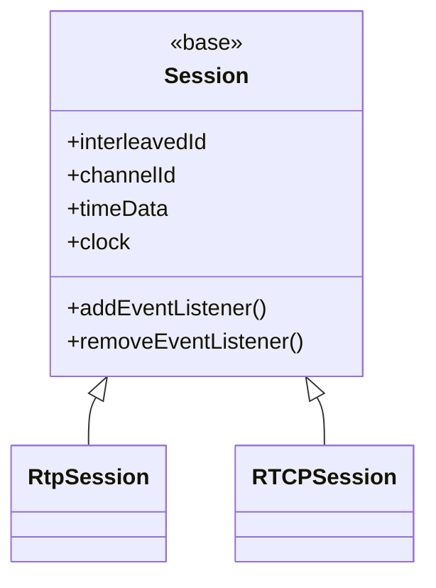

---

## `RtpSession` (`mediaSession/RtpSession.ts`)

### Structure

`RtpSession extends Session` and is the common base for every *codec* session (video and audio) —
`H264Session`, `H265Session`, `MjpegSession`, `AACSession`, `G711Session`, `G726Session`,
`OPUSSession`, `AudioTalkSession`, `MetaSession`, `VideoRtcpSession`. Constructor takes no
arguments, calls `super()`, and sets `deviceType = 'camera'` as the default.

Fields: `decoder` (unused placeholder), `codec`/`mime` (strings set by `RtpClient` from SDP),
`rtcpSession: RTCPSessionLike | null` (a narrow structural type — just `interleavedId` and
`rtpTimestamp` — pointing at the sibling `RTCPSession` for this media line), `sessionId`,
`information?` (present only for sessions carrying a legacy "information" SDP attribute, e.g.
`MetaImageSession`), `isLost` (packet-loss flag, starts `true` until first packet arrives),
packet-count/drop-count bookkeeping (`numberOfDroppedPacket`, `numberOfReceivedPacket`,
`numberOfPrevTotalCount`, `numberOfMediaTimerCount`, `rtpLostCount`), `frameRate?`,
`startTimestamp?`, `sumOfInterval`, and three private fields: `govLength`, `dropPer`, `dropCount`
(GOP length / drop-percentage / drop-count — set via setters but, per the code comments, largely
write-only carryovers from the legacy port), plus `statisticsTimer: IntervalTimer | null`.

`Session <|-- RtpSession <|-- {H264Session, H265Session, MjpegSession, AACSession, G711Session,
G726Session, OPUSSession, AudioTalkSession, MetaSession, VideoRtcpSession}`. `RtpSession` itself
does not implement `depacketize` meaningfully (still a no-op override) — every leaf class must.

### Method Analysis

- `setFrameCallback`/`setBufferingCallback`/`setTimestampCallback`/`setOutputSizeCallback`/`setAACCodecInfo` — declared no-ops kept for legacy API-shape parity (not used by the concrete video sessions covered here; relevant to audio codec sessions documented elsewhere).
- `appendBuffer(currentBuffer, newBuffer, readLength)` — grows `currentBuffer` by 1 MiB chunks (`BUFFER_SIZE = 1024*1024`) whenever `readLength + newBuffer.length` would overflow it, then copies `newBuffer` in at `readLength`. A generic append-with-growth helper; the video sessions below implement their own private `setBuffer` with the same growth strategy rather than calling this (kept for audio-session use).
- `setFramerate`/`getFramerate` — `frameRate` accessor, read by `MediaRouter.getFrameSizeInfo`/`VideoInfo.framerate` and by `PlaybackBufferManager.push` to size its buffer window.
- `setGovLength`/`getGovLength` — GOP-length accessor.
- `setDecodingTime`/`initStartTime`/`setCheckDelay` — explicit no-ops; the comment at RtpSession.ts:100-102 documents that the legacy values they'd set were never read anywhere either.
- `getDropPercent`/`getDropCount` — accessors for `dropPer`/`dropCount` (set nowhere in this file; part of the legacy write path for other subsystems).
- `close()` — clears `sessionId`. Overridden by `H264Session`/`H265Session`/`MjpegSession` to also stop the statistics timer (and, for MJPEG, terminate its worker).
- `startStatisticsTimer(interval?)` — lazily creates an `IntervalTimer` (see `util/IntervalTimer`) that calls `onStatisticsTimer()` every `DEFAULT_STATISTICS_INTERVAL` (1000 ms), regardless of the `interval`/frame-rate-derived value computed (dead parity code, per the inline comment).
- `stopStatisticsTimer()` / `getStatisticsTimer()` — timer lifecycle.
- `setStartTimeStamp(timeStamp)` — records the first frame's RTP-derived timestamp and resets `sumOfInterval`; `getTimerStamp()` returns `startTimestamp + sumOfInterval`.
- `increaseNumberOfReceivedPacketCount()` / `getNumberOfReceivedPacketCount()` / `setNumberOfReceivedPacketCount()` / `isInitializeReceivedPacketCount()` — packet counters; `isInitializeReceivedPacketCount()` (count === 0) gates the one-time `setStartTimeStamp` call in each codec session's marker-bit branch.
- `increaseNumberOfDroppedPacket()` / `getNumberOfDroppedPacketCount()` — drop counters (incremented by callers outside this file; not invoked internally by the classes documented here).
- `onStatisticsTimer()` — the core per-second statistics/loss-detection routine:
  - Compares `numberOfReceivedPacket` to the last tick's snapshot (`numberOfPrevTotalCount`).
  - If unchanged (`compare === 0`): increments `rtpLostCount`; once it exceeds `eventWaitingTimeout ?? LOST_TIMEOUT` (`LOST_TIMEOUT = 5` seconds), and only for `type === 'video'` with no `information` set, or any `type === 'audio'` session, and only if not already flagged lost, fires `eventWaitingCallback` with `islost: true` and flips `isLost = true`.
  - If changed: if it *was* lost (`isLost === false` is the "not lost" check — read closely: the branch fires when `isLost === false` and `rtpLostCount > lostTimeout`, i.e. recovering from a previous stall) it fires `eventWaitingCallback` with `islost: this.isLost` (still `false` at that point) to signal recovery, then resets `rtpLostCount = 0`.
  - Independently, if not lost, fires `eventStatisticsCallback` with `{ channelId, interleavedId, codec: information ?? codec, media: type, type: 'rtp', fps: receivedPacket - prevTotalCount, interval: sumOfInterval / numberOfMediaTimerCount (truncated), receviedPacket, droppedPacket }` (`RtpStatistics`, spelling as in source).
  - Always updates `numberOfPrevTotalCount = numberOfReceivedPacket` at the end.

### Call Stack

See `RtpClient`/concrete session call stacks below — `RtpSession` itself is not directly invoked from the wire; `RtpClient.sendRtpData` dispatches to the concrete `depacketize` override.

### RFC / Standard References

`RtpSession` doesn't parse RTP fields directly (that's shared via `rtpDepacketizeUtils` and
performed per-subclass), but it owns the "loss detection" semantics layered on top of RFC 3550
RTP reception — a local heuristic (packet-count-unchanged-for-N-seconds), not an RFC mechanism.

### Relations & Data Flow

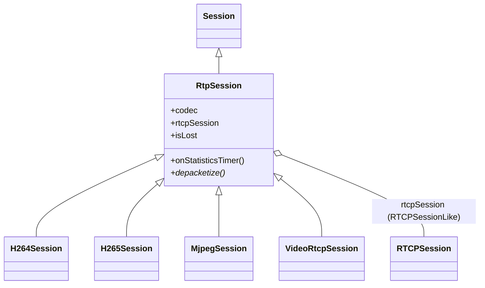

---

## `RTCPSession` (`mediaSession/RTCPSession.ts`)

### Structure

`RTCPSession extends Session` directly (not `RtpSession` — it is a sibling branch of the
hierarchy, one per media line, created alongside each `RtpSession`). Fields: `sessionId`, and six
private reusable 4-byte scratch buffers (`ssrc`, `ntpMsw`, `ntpLsw`, `rtp`, `spc`, `soc`) used to
avoid reallocating per RTCP packet.

### Method Analysis

- `init()` — resets `timeData` to `{ timestamp: null, timestamp_usec: null, timezone: null }`.
- `sdesParse(sdes)` — walks a buffer of concatenated SDES items (`type` byte, `length` byte, then `length` bytes of content converted via `String.fromCharCode`), returning `SdesEntry[]`. Loop is `do...while (ptr < sdes.length)`, i.e. always parses at least one entry.
- `parse(rtcpData)` — dispatches on `rtcpData[1]` (the RTCP packet-type byte) against `RTCP_TYPE` (`RTCP_SR = 200`, `RTCP_RR = 201`, `RTCP_SDES = 202`, `RTCP_BYE = 203`, `RTCP_APP = 204` — the standard RFC 3550 §12.1 payload-type range 200–204):
  - **`RTCP_SR` (200) — Sender Report**: reads, from offset 4, `SSRC(4)`, `NTP MSW(4)`, `NTP LSW(4)`, `RTP timestamp(4)`, `sender's packet count(4)`, `sender's octet count(4)` — the exact RFC 3550 §6.4.1 SR layout after the fixed RTCP header. Converts NTP MSW to Unix seconds via `ntohl(ntpMsw) - 0x83aa7e80` (the standard 1900→1970 epoch offset, `2,208,988,800` seconds) and NTP LSW to a millisecond fraction via `ntohl(ntpLsw) / 0xffffffff * 1000`; stores via `SetTimeStamp` (leaving `timezone` as `undefined`, explicitly noted as a legacy quirk — RTCP's own sync path never had a timezone field, unlike the codec sessions' RTP-extension-based sync). Computes `rtpTimestamp = ntohl(rtp) / clock` (converts the 90kHz — or negotiated — RTP clock ticks to a `clock`-scaled unit, i.e. milliseconds when `clock` is in kHz) and fires `eventRtcpCallback` with `{ interleaved, packetCount, octetCount, timeStamp: { rtpTimestamp, timestamp, timestamp_usec, timezone } }`.
  - **`RTCP_SDES` (202)**: reads `SSRC(4)` then parses the rest via `sdesParse` (result currently discarded — no further use of the parsed entries).
  - **`RTCP_BYE` (203)**: only acts if `this.type === 'video'`, throwing an `RTCPError` (`errorCode: 0x0209`, `'RTCP goodbye message'`) — i.e. an RTCP BYE on the video track is treated as a fatal stream-end signal; audio/other BYEs are silently ignored.
  - `RTCP_RR`/`RTCP_APP` are recognized constants but have no `case` — unhandled (fall through the switch, no-op).
- `depacketize(_rtspInterleaved, rtcpHeader, rtpPayload)` — concatenates header+payload into one buffer, then loops extracting one RTCP compound-packet member at a time: `rtcpLength` is read as a big-endian 16-bit value at bytes `[2,3]` of the current sub-packet (the RFC 3550 §6.1 `length` field, "the length of this RTCP packet in 32-bit words minus one"), so each member's total length in bytes is `4 + 4*rtcpLength`; `parse()` is called on each member's slice, correctly handling **compound RTCP packets** (multiple RTCP packets concatenated in one UDP/interleaved datagram, as RFC 3550 mandates for SR/RR + SDES).
- `close()` — clears `sessionId`.

### Call Stack

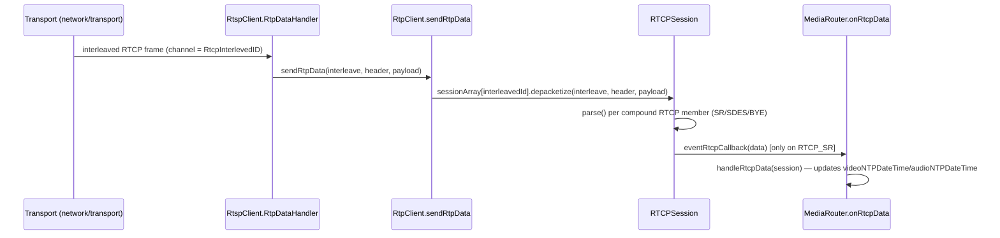

Note `RTCPSession.depacketize` is invoked the same way as any other session — `RtpClient`
indexes `sessionArray` by interleaved channel ID and calls `.depacketize()` polymorphically; it
does not know or care that this particular "session" is RTCP rather than RTP.

### RFC / Standard References

RFC 3550 §6 (RTCP): packet types 200–204 (§12.1), Sender Report layout (§6.4.1: SSRC, NTP
timestamp as two 32-bit halves, RTP timestamp, sender's packet count, sender's octet count),
compound-packet `length` field semantics (§6.1, "words minus one"). NTP-to-Unix epoch conversion
constant `0x83aa7e80` = 2,208,988,800 matches the standard NTP (1900) → Unix (1970) epoch delta.
RTCP BYE (type 203, §6.6) is present but only actioned for the video track, as a
stream-termination signal rather than full RFC semantics (no source-list/reason parsing).

### Relations & Data Flow

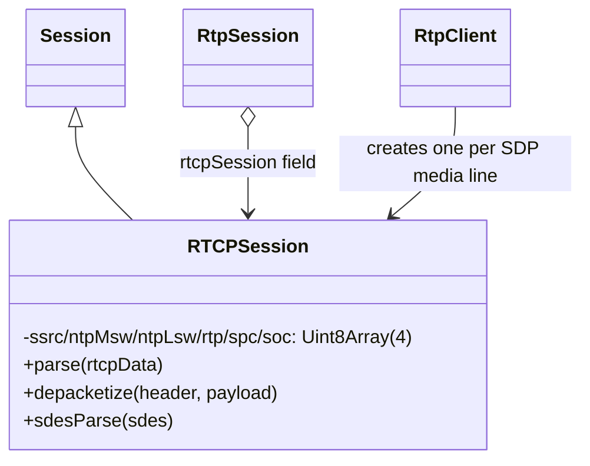

---

## `RtpClient` (`mediaSession/RtpClient.ts`)

### Structure

`RtpClient` is **not** a `Session` subclass — it is the per-channel factory/owner/dispatcher that
`StreamPlayer` (referenced by name; not documented here) creates one of per stream. Constructor
takes a `MediaRouterLike` (the narrow interface `MediaRouter` implements — see `MediaRouter.ts`)
and immediately registers itself as `MediaRouter`'s `'rtpClient'` listener.

Fields: `sessionArray: AnySession[]` (`AnySession = RtpSession | RTCPSession`) — a sparse array
indexed **by interleaved channel ID**, not by track index; `sendAudioTalkDataCallback`;
`audioTalkSession: AudioTalkSession | null`; `_running`; `channelId` (copied from the router);
`rtpWaitingTimeout?` (public escape hatch, never assigned internally — set by external callers).

### Method Analysis

- **`sendSdpInfo(sdpInfo: SdpInfoEntry[])`** — the SDP-driven session factory, called once per
  negotiated stream (RTSP `DESCRIBE`/`SETUP` result). For each `SdpInfoEntry` (see
  `network/rtspOverWebsocket/RtspClient.ts`'s `SdpInfoEntry`: `Type`, `codecName`, `codecMime`,
  `trackID`, `ClockFreq`, `Framerate`, `information`, `Bitrate`, `config`, `SizeLength`,
  `IndexLength`, `IndexDeltaLength`, `RtpInterlevedID`, `RtcpInterlevedID`, `SessionID`), it
  switches on **`entry.codecName`** (the SDP `a=rtpmap` codec name) to decide which concrete
  session class to instantiate:
  - `'H264'` → `new H264Session()`, `init()`, `setFramerate(entry.Framerate ?? 0)`.
  - `'H265'` → `new H265Session()`, same framerate wiring.
  - `'JPEG'` → `new MjpegSession()`, `init()` (no framerate call).
  - `'G.711'` → if `trackID` does **not** contain `trackID=t` (talk) or `trackID=back` (backup), creates `G711Session` with `{ clockFreq, bitrate }`; otherwise (talk track) creates `AudioTalkSession` and kicks off `mediaRouter.startAudioTalk(...)` to bridge Web Audio capture → RTP encoding.
  - `'G.726-16'|'G.726-24'|'G.726-32'|'G.726-40'` → (non-talk/backup tracks only) `G726Session` with bitrate parsed either from `entry.Bitrate` or from the codec-name's numeric suffix (`substr(6,2)`).
  - `'OPUS'` → (non-talk/backup) `OPUSSession` with `{ clockFreq, bitrate }`.
  - `'mpeg4-generic'` → (non-talk/backup) `AACSession` with `{ config, clockFreq, bitrate, sizeLength, indexLength, indexDeltaLength }` — the RFC 3640 (MPEG-4 generic / AAC-hbr) fmtp parameters.
  - `'MetaData'` → `new MetaSession()`, `init()`.
  - default: no session created for this entry.

  If a session was created, it also unconditionally creates a companion `RTCPSession`
  (`rtcpSession.interleavedId = entry.RtcpInterlevedID`, `deviceType`, `channelId`, `type =
  entry.Type`, and wires `mediaRouter.onRtcpData` as its `'rtcp'` listener if present), then
  cross-links `rtpSession.rtcpSession = rtcpSession`, sets `codec`, `interleavedId`, `channelId`,
  `sessionId`, `type`, registers `'statistics'`/`'waiting'` listeners back to `RtpClient`'s own
  `onStatistics`/`onWaiting`, and dispatches the media-type-specific listener:
  `'video'` → `onVideoData`, `'audio'` → `onAudioData`, `'application'` → `onMetadata` (registered
  as `'text'`) — all sourced from `mediaRouter.onVideoData`/`onAudioData`/`onMetadata`. If
  `entry.ClockFreq` is present, both `rtpSession.clock` and `rtcpSession.clock` are set to
  `ClockFreq / 1000` (Hz → kHz). For `type === 'video' | 'audio'` sessions, `startStatisticsTimer()`
  is started immediately. Finally both the RTP and RTCP sessions are stored into `sessionArray`
  at their respective interleaved IDs. After the loop, `mediaRouter.gotAudioSupport(...)` is
  called with whether any session ended up with `type === 'audio'`.

- **`sendRtpData(rtspinterleave, rtpheader, rtpPacketArray)`** — the hot path: reads
  `rtspinterleave[1]` (the RTSP interleaved-framing channel byte — see RFC 2326 §10.12 / RFC 7826
  §14, `$` + channel + 2-byte length prefix) as `interleavedId`, looks up `sessionArray[interleavedId]`,
  and if present calls `session.depacketize(rtspinterleave, rtpheader, rtpPacketArray)` — this is
  the single dispatch point that routes every incoming interleaved frame (RTP *or* RTCP) to the
  correct `RtpSession`/`RTCPSession` instance purely by channel number, since `sendSdpInfo` stored
  both under their respective interleaved IDs in the same array.
- **`addListener('audioTalk', func)`** — registers the callback that receives RTP-encoded talk-back audio bytes.
- **`checkRtpSession(type)`** — true if any session of the given `type` has a non-null `rtcpSession` (only meaningful for `RtpSession`s, guarded by the `isRtpSession` type guard which checks for an `'rtcpSession'` own property).
- **`getRtpSession(interleavedId)`** — linear scan for an `RtpSession` (not RTCP) with matching `interleavedId`.
- **`getRtpSessionWithType(type)`** — overloaded lookup: string `type` matches either `.type` or `.codec`; numeric `type` matches `.interleavedId`; always additionally requires a live `rtcpSession`.
- **`close()`** — closes and clears all sessions.
- **`running` getter/setter** — propagates to every session's own `running` flag.
- **`mediaRouterMessage(msgType, data)`** (private, invoked via the `'rtpClient'` listener registered in the constructor) — on `'close'`, closes and clears `sessionArray`; `'backup'|'stepPlay'|'bufferFree'|'audioBackup'` are recognized but no-op.
- **`sendAudioTalkData(stream)`** (private) — calls `audioTalkSession.getRTPPacket(stream)` then forwards the resulting `Uint8Array` to `sendAudioTalkDataCallback`.
- **`onWaiting`/`onStatistics`** (private) — thin forwarders to `mediaRouter.onWaiting?.()`/`mediaRouter.onStatistics?.()`.
- **`setSampleRate(sampleRate)`** (private) — forwards to `audioTalkSession.setSampleRate`.
- **`onError(error)`** (private) — swallows the error (legacy logged it; no other effect).

### Call Stack

```mermaid
sequenceDiagram
    participant SP as StreamPlayer
    participant RtspC as RtspClient
    participant RPC as RtpClient
    participant Sess as concrete *Session

    SP->>RtspC: DESCRIBE/SETUP negotiation
    RtspC->>RPC: sendSdpInfo(SDPinfo[])
    RPC->>RPC: switch(entry.codecName) -> new H264Session()/H265Session()/MjpegSession()/...
    RPC->>Sess: session.init(), setFramerate()
    RPC->>RPC: sessionArray[RtpInterlevedID] = rtpSession; sessionArray[RtcpInterlevedID] = rtcpSession

    Note over RtspC,RPC: streaming begins
    RtspC->>RPC: sendRtpData(rtspinterleave, rtpheader, rtpPacketArray)
    RPC->>RPC: interleavedId = rtspinterleave[1]
    RPC->>Sess: sessionArray[interleavedId].depacketize(...)
```

### RFC / Standard References

- SDP (RFC 4566) media descriptions feed `SdpInfoEntry.codecName` from `a=rtpmap:<pt> <codec>/<clock>` and `Bitrate`/`config`/`SizeLength`/`IndexLength`/`IndexDeltaLength` from `a=fmtp:<pt> ...` (RFC 3640 for `mpeg4-generic`/AAC).
- RTSP interleaved binary data framing (RFC 2326 §10.12 / RFC 7826 §14): `$` (0x24) + 1-byte channel + 2-byte big-endian length, then payload — `rtspinterleave[1]` is that channel byte, and (see `H264Session`/`H265Session` below) `rtspinterleave[0]` is checked to equal `0x24`.

### Relations & Data Flow

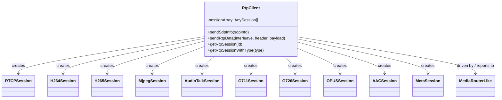

---

## `rtpDepacketizeUtils` (`mediaSession/rtpDepacketizeUtils.ts`)

### Structure

Not a class — a pair of pure functions shared across every codec session that needs RTP header
parsing or the Hanwha playback-timestamp RTP-extension sync (per its own doc comment: h264Session,
h265Session, aacSession, g711Session, g726Session, metaSession in the legacy codebase; ported
identically here for `H264Session`/`H265Session` and — by the same contract — the audio/meta
sessions documented elsewhere).

### Method Analysis

- **`parseRtpHeaderFlags(rtpHeader: Uint8Array): RtpHeaderFlags`** — decodes the first two bytes of the 12-byte fixed RTP header (RFC 3550 §5.1):
  - `version = (rtpHeader[0] & 0xC0) >> 6` (bits 7-6)
  - `padding = ((rtpHeader[0] & 0x20) >> 5) === 1` (bit 5)
  - `extension = ((rtpHeader[0] & 0x10) >> 4) === 1` (bit 4)
  - `csrcCount = rtpHeader[0] & 0x0F` (bits 3-0, CC)
  - `markerBit = ((rtpHeader[1] & 0x80) >> 7) === 1` (bit 7 of byte 1, M)
  - `payloadType = rtpHeader[1] & 0x7F` (bits 6-0, PT)
- **`syncPlaybackTimestampFromRtpExtension(session, rtpPayload, currentPlayback): boolean`** — a
  vendor-specific (Hanwha) sync mechanism layered on top of the standard RTP extension header
  (RFC 3550 §5.3.1): it only activates when `rtpPayload[0] === 0xAB` and `rtpPayload[1]` is
  `0xAD` or `0xAC` (a proprietary marker, not the RFC 3550 generic extension-profile field, since
  this function is called *after* the caller has already computed `extensionHeaderLen` from the
  standard extension length field — see `H264Session`/`H265Session` `depacketize`). If the marker
  doesn't match, it returns `currentPlayback` unchanged (i.e. this is a "Live" stream with no
  playback-timestamp extension present). Otherwise: reads an 8-byte NTP timestamp (4-byte MSW +
  4-byte LSW) starting at offset 4; if `session.deviceType === 'camera'`, additionally reads a
  2-byte big-endian signed GMT/timezone offset 6 bytes further in. Converts NTP → Unix seconds the
  same way as `RTCPSession` (`ntohl(msw) - 0x83aa7e80`) and a millisecond fraction from the LSW.
  If a previous timestamp exists (`session.GetTimeStamp()`) and the gap between the new and old
  second-granularity timestamps is `<= 1`, it computes the sub-second `distance` between the two
  full timestamps and, if nonzero, calls `session.setFramerate(Math.round(1000 / distance))` —
  i.e. it **estimates the live framerate from the wall-clock gap between consecutive playback
  timestamp markers** rather than trusting a static SDP `Framerate` value. Finally stores the new
  timestamp via `session.SetTimeStamp(...)` and returns `true` (marking the session as being in
  "Playback" mode from here on — the return value is stored into `H264Session`/`H265Session`'s
  private `playback` field and later drives `playMode = this.playback ? 'Playback' : 'Live'`).

### Call Stack

Called directly from `H264Session.depacketize`/`H265Session.depacketize` when `flags.extension`
is set — see those sections' call-stack diagrams.

### RFC / Standard References

RFC 3550 §5.1 (RTP fixed header field layout — V, P, X, CC, M, PT), §5.3.1 (generic extension
header presence, the `X` bit and 16-bit length field consumed by the *caller* before this function
is invoked). The `0xAB 0xAD`/`0xAC` marker and the timestamp layout it decodes are a
vendor-specific (Hanwha) extension, not part of RFC 3550 itself.

### Relations & Data Flow

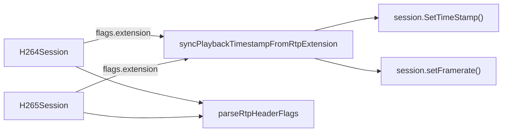

---

## `MediaRouter` (`mediaSession/MediaRouter.ts`)

### Structure

`MediaRouter` is the hub that owns the *active player* (video/audio/talk/backup/metadata) for one
channel and translates depacketized RTP session output into player calls, plus the reverse path
(UI commands → session/player control). It is constructed with a single `MediaRouterFactories`
object (`createCanvasPlayer`, `createVideoPlayer`, `createAudioPlayer`, `createTalk`,
`createMetaDataParser`, `createBackupProvider`, `cloneArray`) — **this is the dependency-inversion
seam**: `MediaRouter.ts` never imports `CanvasTagPlayer`, `VideoTagPlayer`, `AudioPlayerGxx`,
`Talk`, `BackupProvider`, or any concrete player class. `StreamPlayer` (in `interface/`, not
documented here) is the one place that constructs `MediaRouter` and supplies these factories,
each returning an object satisfying `VideoPlayerLike` / `AudioPlayerLike` / `TalkLike` /
`MetaDataParserLike` / `BackupProviderLike`.

Key fields: video sizing/codec state (`videoCodec`, `videoSize`, `videoWidth`, `videoHeight`,
`spsParser: H264SPSParser | H265SPSParser | null`), rendering mode (`tagMode: 'canvas' | 'video'`),
step-play state (`stepFlag`, `stepCmd`, `stepStatus`, `stepObj`), NTP sync caches per track
(`videoNTPDateTime`/`rtcpTSvideo`, `audioNTPDateTime`/`rtcpTSaudio` — legacy also tracked a
`meta` variant, confirmed dead and dropped, per the file's own comment), `audioPlayer`,
`audioTalker`, `metaDataParser`, `backupProvider`/`isBackup`, a battery of registered callbacks
(`errorCallback`, `timeStampCallback`, `resizeCallback`, `stepRequestCallback`,
`videoModeCallback`, `rtpClientCallback`, `metaImageCallback`, `statisticsCallback`,
`captureCallback`, `instantplaybackCallback`, `gotAudioSupportCallback`), minimap timer state, and
`activeSessions: { video, audio, meta }` (each `{ rtp: SessionContext | null, rtcp: unknown }`) —
tracking which session is currently "active" per media type so stale sessions' statistics timers
get stopped when a new one takes over (see `handleVideoData`/`handleAudioData`/`handleMetadata`).

`onVideoData`/`onAudioData`/`onMetadata`/`onRtcpData` are assigned in the constructor as detached
functions (not prototype methods) that close over `self` (the router) while also being callable
*unbound* — `RtpClient.sendSdpInfo` registers them directly as
`rtpSession.addEventListener('video', mediaRouter.onVideoData)`, so when the owning session later
invokes `this.eventVideoCallback(...)`, `this` inside the function is the **session**
(`SessionContext`), not the router; the closure-captured `self` is how router-level state is
still reached. `onWaiting`/`onStatistics`, by contrast, are ordinary methods invoked as
`this.mediaRouter.onWaiting?.(...)` from `RtpClient`, so `this` is the router there.

### Method Analysis

Selected methods (full public surface is large; grouped by role):

- **`handleVideoData(session, playMode, streamData, videoInfo, isMetaImage?)`** — the video data
  entry point (invoked as `this.eventVideoCallback` from `H264Session`/`H265Session`/`MjpegSession`).
  If `isMetaImage`, short-circuits to `metaImageCallback` (used by `MetaImageSession`-flavored
  MJPEG, not full video playback). Otherwise: updates `activeSessions.video` (stopping the
  previous session's statistics timer if the session changed), optionally clones frame data for
  the active `backupProvider`, and if `playMode === 'Live'` and NTP sync data is available,
  recomputes `streamData.timeStamp.{utcTimeStamp,timestamp,timestamp_usec,utcDatetime}` from the
  RTCP-derived NTP anchor (`videoNTPDateTime`) plus the RTP-timestamp delta since that anchor
  (`streamData.timeStamp.rtpTimestamp - rtcpTSvideo`). On an **I-frame** (`videoInfo.frameType ===
  'I'`), calls `getFrameSizeInfo` (parses SPS via `H264SPSParser`/`H265SPSParser`, or for MJPEG
  just reads `videoInfo.width/height`) and, if the codec/size/dimensions changed or there is no
  current player, tears down and recreates the player via `selectVideoPlayer`, validates the
  resolution via `checkVideoResolution`, wires timestamp/error/resize/framerate callbacks onto it,
  resolves the DOM element via `selectVideoElement`, calls `player.init(videoElement)`, applies
  mute/volume, and — if width/height changed — fires `resizeCallback` with a `VideoResizeInfo`.
  On non-I-frames it still computes size info (for MJPEG's per-frame dimensions) and, once a
  player exists, reuses the cached `videoWidth`/`videoHeight`. Finally, if a player exists: for
  `tagMode === 'video'` I-frames it fills in `videoInfo.codecInfo`/`profileIdc`/`levelIdc` (H264)
  or `profileTierLevel` (H265) from the SPS parser; then dispatches to exactly one of
  `player.bufferingVideoData` (camera + step-play), `player.onVideoData` (non-camera step-play, or
  normal playback when `checkBufferManagerAvailable` is false), or
  `player.sendToBufferManager` (when `checkBufferManagerAvailable(playMode, codecType)` — i.e.
  `Playback` + `H265` + canvas mode — is true, routing through `PlaybackBufferManager` instead of
  direct rendering). If backup is active, forwards the (cloned) frame to `backupProvider.onVideoData`.
- **`handleAudioData(session, playMode, streamData, audioInfo)`** — mirrors the video path for
  audio: updates `activeSessions.audio`, applies the same Live NTP-timestamp recomputation using
  `audioNTPDateTime`/`rtcpTSaudio`, and then either forwards to `player.onAudioData` (video-tag
  MSE path handles audio itself) or, if unmuted, lazily creates/reconfigures a standalone
  `audioPlayer` (`AudioPlayerLike`, i.e. `AudioPlayerGxx`) and calls `BufferAudio`/`setBufferingFlag`
  on it — with special-case ADTS-header prefixing for AAC (`streamData.ADTs`). Backup forwarding
  mirrors the video path. Wraps the whole body in try/catch, rethrowing as `RTSPOverWebSocketError`
  (`0x030B`) on failure.
- **`handleMetadata(session, metadata)`** — updates `activeSessions.meta`, forwards
  `metadata.frameData` to `metaDataParser.parse(...)` if one is registered.
- **`handleRtcpData(session)`** — reads `session.timeData` (already populated by
  `RTCPSession.parse`'s SR handling) and, per `session.type`, updates `videoNTPDateTime`/`rtcpTSvideo`
  or `audioNTPDateTime`/`rtcpTSaudio` — these are exactly the values `handleVideoData`/`handleAudioData`
  later use to convert RTP timestamps into wall-clock UTC for `'Live'` playback.
- **`spsParse(sps, codecType)`** — lazily creates the right parser (`H264SPSParser`/`H265SPSParser`) whenever `videoCodec` changes, throws `RTSPOverWebSocketError` (`0x0304`) if `sps` is missing (encoder sent SPS via an unsupported aggregation type, or SPS hasn't arrived yet), then calls `spsParser.parse(sps)`.
- **`getFrameSizeInfo(codecType, videoInfo)`** — MJPEG reads `videoInfo.width/height` directly (no SPS); H264/H265 delegate to `spsParse` + `spsParser.getSizeInfo()` and copy width/height/cropWidth/cropHeight back onto `videoInfo`.
- **`checkValidSpeed(codecType, size)`** — for MJPEG above `LIMIT_SPEED_RESOLUTION` (1920×1080), flags `currentProfile.isLimitSpeed` and fires an `0x0302` error/notice when the limit state changes (both directions).
- **`selectVideoPlayer(channelid, playMode, codecType, size, framerate)`** — closes any existing player; if `stepFlag`, always returns a fresh canvas player. Otherwise picks `tagMode`: MJPEG always canvas; H264/H265 checks `MediaSource.isTypeSupported(mimeType)` (built from `spsParser.getCodecInfo()`) to decide MSE `<video>`-tag eligibility, then applies device/profile/size heuristics (`LIMIT_SIZE.Live/Playback`, `deviceType === 'nvr'`, `defaultVideoTagMode`) to choose canvas vs video tag, emitting `0x0301`/`0x030C`-class errors when the profile can't support the requested resolution. Instantiates via `factories.createVideoPlayer()`/`createCanvasPlayer()`, wires `statistics`/`capture`/`instantplayback` listeners, and applies `boxsize`/`maxInstantPlayback`/`bufferClearInterval`.
- **`selectVideoElement(mode)`** — resolves the actual `<canvas>`/`<video>` DOM element via `getElementByAttributeValue` (by mapped element ID, mapped channel ID, or plain channel ID, in that priority), firing `videoModeCallback` first and an error callback (`0x0900`/`0x0901`) if nothing is found.
- **`checkVideoResolution(codec, info)`** — in `'video'` tag mode, rejects (`'Over4K'`) resolutions above `getMaxResolutionSize()` (browser/codec-dependent 4096×2688 or 4096×2304 for Firefox/Edge) or width > 4096; for H265 on Chromium additionally caps at the Firefox/Edge height limit; canvas mode always passes.
- **`sendCommandData(type, data)`** — the UI/host command dispatcher: `capture`, `backup` (start/stop, creates/tears down `backupProvider`), `forward`/`backward` (step-play, delegates to `player.forward()`/`backward()` or issues a `stepRequest()`), `speed` (also toggles `dropOut` between 1 and `DROP_OUT_LEVEL` at `|speed| >= ULTRA_SPEED`), `pause`/`resume` (resume re-inits the video player if returning from step mode or `data === true`), `seek`, `audioIn` (delegates to `controlAudioPlayer`), `digitalZoom`, `clearBuffer`, `minimap` (delegates to `handleMinimapCommand`, which manages a `setInterval`-driven minimap refresh), `requestTimeChanged` (skipped on Firefox), `instantplayback`.
- **`onWaiting(waiting)`** — forwards to `player.onWaitingPackets`, fires an `0x0107` error/notice, and if the *video* track is lost and `supportCovertAndOff` is enabled, closes and nulls the player (privacy/covert-mode behavior).
- **`onStatistics(statistics)`** — for video, updates `player.rfps` and calls `changeBoxSize(fps)` (adjusts `player.boxsize` — a canvas-renderer detail — across seven fps bands from `<5` to `>55`), then forwards to the external `statisticsCallback`.
- **`createAudioPlayer`/`deleteAudioPlayer`** — lifecycle for the standalone `AudioPlayerLike`.
- **`startAudioTalk(sendAudioTalkBuffer)`** — creates a `TalkLike` via the factory, initializes it, wires the raw-PCM buffer callback, and resolves with the negotiated sample rate (or rejects/error-callbacks on failure) — this is exactly the `MediaRouterLike.startAudioTalk` that `RtpClient.sendSdpInfo` calls for the talk-back (`trackID=t`) SDP entry.
- **`terminate(func?)`** — full teardown: closes player, deletes audio player, terminates talk, signals `rtpClientCallback('close', '')` (which is what actually reaches `RtpClient.mediaRouterMessage('close', ...)` and cascades to closing every `RtpSession`/`RTCPSession`), resets NTP/profile state.
- **`initializeNTPTimestamp()`** — clears all four NTP anchor fields (used on reconnect/seek to avoid using stale wall-clock anchors).
- Assorted `addListener(type, func, data?)` registrations for the many callback categories listed above, plus getters/setters (`mute`, `boxsize`, `deviceType`, `player`, `audioshift`, etc.) with side effects (e.g. `mute` setter creates/destroys the audio player only in `'canvas'` tag mode; `audioshift` setter forwards to the player only in `'video'` tag mode).

### Call Stack

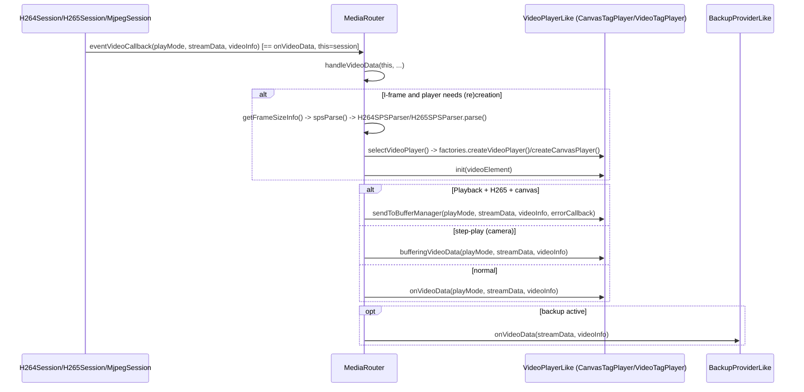

### RFC / Standard References

No direct wire parsing — `MediaRouter` consumes already-depacketized `VideoStreamData`/`AudioStreamData`/`MetadataFrame` produced by the RTP sessions. Its NTP-based Live-timestamp math reuses the same NTP-epoch convention (`0x83aa7e80`) established in RFC 3550 §6.4.1 Sender Reports.

### Relations & Data Flow

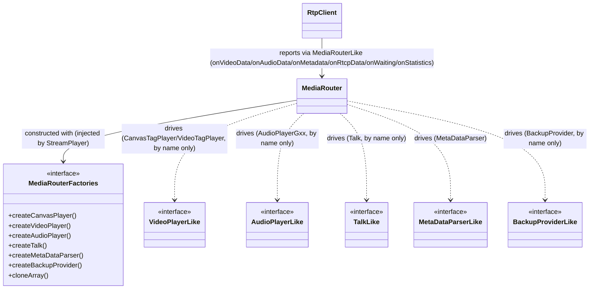

`MediaRouter` never imports `CanvasTagPlayer`, `VideoTagPlayer`, `AudioPlayerGxx`, `Talk`, or
`BackupProvider` — the only concrete class it imports besides utilities is `MetaDataParser` itself
being *wrapped* by the `createMetaDataParser` factory contract (`MetaDataParserFactory`), which is
still injected, not hardcoded to a single implementation. This is the same dependency-inversion
seam documented in `src/player/README.md` §1.

---

## `MetaDataParser` (`mediaSession/MetaDataParser.ts`)

### Structure

A standalone class (not a `Session`) constructed with a `callback: (metaData: ParsedMetaData) =>
void`. Fields: `channelIdValue`, `deviceTypeValue` (exposed via `channelId`/`deviceType`
accessors, matching the `MetaDataParserLike` interface `MediaRouter` expects). "Metadata" here
means SUNAPI/ONVIF-style **XML event/analytics metadata carried over the RTP `application`
media line** (SDP `codecName: 'MetaData'` → `MetaSession`, per `RtpClient.sendSdpInfo`) — e.g.
motion/object-detection event XML, not media codec data.

### Method Analysis

- **`utf8ArrayToStr(array)`** (private) — manual UTF-8 byte-sequence decoder (1/2/3/4-byte sequences per the standard UTF-8 bit-pattern prefixes `0xxxxxxx`/`110xxxxx`/`1110xxxx`/`11110xxx`), used only as the `TextDecoder`-unavailable fallback.
- **`parse(byteData)`** — the entry point (called by `MediaRouter.handleMetadata`): decodes `byteData` to a string via `TextDecoder` (preferred) or the manual fallback; if the result doesn't contain `<?xml`, returns early (not XML, silently ignored — no callback fires). If `window.parser` (an optional externally-loaded `fast-xml-parser`-compatible global, read defensively — not a bundled dependency) is present, validates and parses the XML into `metaData.json` (via `fastJsonStringfy`); otherwise only `metaData.xml` is populated. Calls `this.callback({ channelId, xml, json? })` in all XML cases. Wraps the whole body in try/catch, rethrowing as `RTSPOverWebSocketError` (`0x0907`) on any parse failure.

### Call Stack

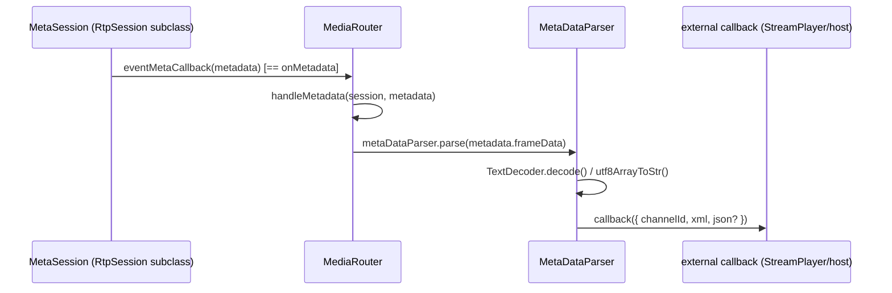

### RFC / Standard References

Not RTP/RTCP-specific — the framing that gets it here (RTSP `application` media line, RTP
transport for the metadata track) follows the same RFC 4566/3550 conventions as audio/video, but
the payload itself is vendor XML, outside RFC scope.

### Relations & Data Flow

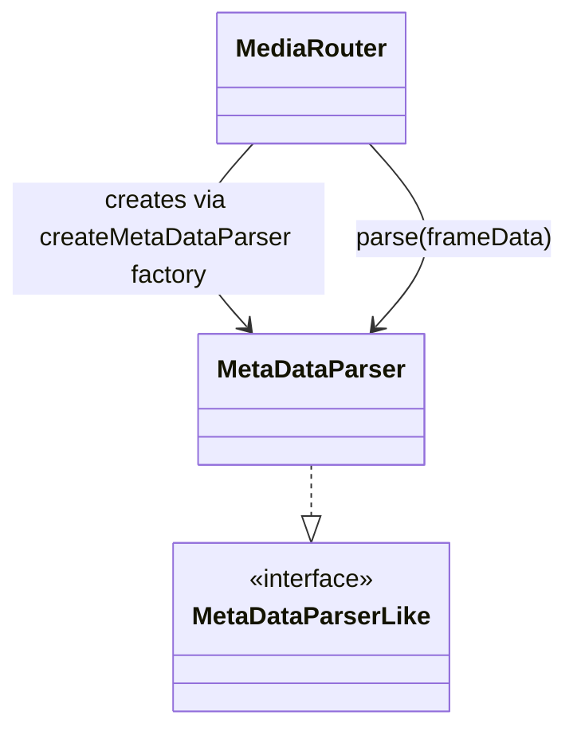

---

## `H264Session` (`mediaSession/videoSession/H264Session.ts`)

### Structure

`H264Session extends RtpSession`. Private state: `inputBuffer: Uint8Array` (starts at `SIZE_1_4K
= floor(1.4*1024) = 1433` bytes, grown on demand), `inputLength` (write cursor), `playback:
boolean` (Live vs Playback, set by `syncPlaybackTimestampFromRtpExtension`), `spsSegment` /
`ppsSegment: Uint8Array | null` (most recent raw SPS/PPS NAL payloads, retained across frames for
`MediaRouter.getFrameSizeInfo`/`checkBufferManagerAvailable`-adjacent logic). `H264_NAL` constant
map: `SPS=7, PPS=8, AUD=9, SPS_EXT=13, SUB_SPS=15, STAP_A=24, STAP_B=25, MTAP16=26, MTAP24=27,
UNSPECIFIED28=28` (matches RFC 6184 Table 1's NAL unit type numbers for aggregation/fragmentation
plus the standard H.264 SPS/PPS/AUD types from ITU-T H.264 Annex/Table 7-1). `PREFIX =
[0x00,0x00,0x00,0x01]` is the 4-byte Annex-B start code prepended to every reassembled NAL unit,
so the output buffer is an Annex-B elementary stream, not length-prefixed.

### Method Analysis

- **`init()`** — resets `playback = false` and `timeData` to nulls.
- **`setBuffer(chunk)`** (private) — appends `chunk` to `inputBuffer` at `inputLength`, growing the buffer (by exactly `chunk.length` extra capacity, copying the old contents) if it would overflow; returns the buffer.
- **`depacketize(rtspInterleaved, rtpHeader, rtpPayload)`** — the core per-packet handler:
  1. `parseRtpHeaderFlags(rtpHeader)` for V/P/X/CC/M/PT.
  2. Validates `rtspInterleaved[0] === 0x24` (RTSP interleaved `$` marker) — throws `RTSPOverWebSocketError` `0x0102` if not.
  3. Rejects any CSRC (`flags.csrcCount !== 0`) with `0x0103` — CSRC lists are unsupported.
  4. If `flags.padding`, reads the padding length from the last payload byte (RFC 3550 §5.1 padding convention) into `paddingSize`.
  5. If `flags.extension`, computes `extensionHeaderLen = ((payload[2]<<8)|payload[3]) * 4 + 4` — the RFC 3550 §5.3.1 extension: a 16-bit length-in-32-bit-words field at bytes 2-3 of the extension, plus the 4-byte extension header itself — and calls `syncPlaybackTimestampFromRtpExtension` to update `playback`/framerate/NTP sync.
  6. Slices `payload = rtpPayload.subarray(extensionHeaderLen, length - paddingSize)` — the actual NAL-unit-stream payload after stripping extension header and padding.
  7. Reads the RTP timestamp from header bytes 4-8 via `ntohl`.
  8. `nalType = payload[0] & 0x1f` (the low 5 bits of the first payload byte — RFC 6184 §5.3's "NAL unit type" field, identical bit layout to a raw H.264 NAL header byte). `nalType === 0` throws `0x0101` (unsupported/reserved type).
  9. Dispatches on `nalType`:
     - **SPS (7) / PPS (8)**: writes `PREFIX + payload` into the buffer verbatim and caches the raw payload as `spsSegment`/`ppsSegment`.
     - **STAP-A (24)** — RFC 6184 §5.7.1 Single-Time Aggregation Packet: after the 1-byte STAP-A header (`payload[0]`), loops reading `[2-byte big-endian NALU size][NALU bytes]` pairs, writing each as `PREFIX + NALU` into the buffer, and updating `spsSegment`/`ppsSegment` if the aggregated unit's own type is SPS/PPS. Bounds-checks `aggregatedSize` against remaining payload length, breaking the loop defensively on malformed input.
     - **STAP-B (25) / MTAP16 (26) / MTAP24 (27)**: explicitly unsupported — throws `0x0101` ("STAP-B/MTAP16/MTAP24 aggregation is additional which is not handled in this version").
     - **SPS_EXT (13)**: unsupported, throws `0x0101`.
     - **SUB_SPS (15)**: unsupported, throws `0x0101`.
     - **UNSPECIFIED28 = FU-A (28)** — RFC 6184 §5.8 Fragmentation Unit A: `payload[1]` is the FU header — `startBit = (payload[1] & 0x80) === 0x80` (S bit), `endBit = (payload[1] & 0x40) === 0x40` (E bit), `fuType = payload[1] & 0x1f` (the original NAL type, 5 bits, R bit at 0x20 ignored/must-be-zero). On the **start fragment** (`startBit && !endBit`), synthesizes a new one-byte NAL header — `(payload[0] & 0x60) | fuType` — reconstructing the F/NRI bits from the FU indicator byte (`payload[0]`) combined with the real NAL type from the FU header, and writes `PREFIX + newNalHeader + payload.subarray(2)`. On **continuation/end fragments**, just appends `payload.subarray(2)` (no new start code — it's part of the same NAL unit already opened).
     - **AUD (9)**: silently dropped (Access Unit Delimiter, not needed for the Annex-B reconstruction path used here).
     - **default** (any other type, e.g. 1-5 = actual slice NAL units): writes `PREFIX + payload` verbatim — this is the path ordinary I/P slice NAL units take.
  10. On **marker bit set** (`flags.markerBit`, RFC 3550's "last packet of the access unit" signal, RFC 6184 §5.3 confirms M=1 marks the last packet of an access unit): snapshots the assembled buffer, computes `rtpTimestamp = (rtpTimeStamp / clock).toFixed(0)`, resets `inputLength = 0` for the next frame, records `startTimestamp` on the very first frame (`isInitializeReceivedPacketCount()`), increments the received-packet counter. Asserts the reassembled buffer's *second* NAL unit (`inputBufferSub[3]`, i.e. the byte right after the first 4-byte start code) is not itself an SPS (`0x07`) — a 3-byte-start-code sanity check the code explicitly says is unsupported, throwing `0x0101` if violated. Determines `frameType`: `'I'` if the *next* NAL unit's type (`inputBufferSub[4] & 0x1f`) is SPS (7) — meaning the frame begins with an SPS/IDR sequence — or AUD (9); otherwise `'P'`. Builds `streamData` (`interleaved`, `codecType: 'H264'`, `frameData`, `channelId`, `packetSeq`, `receiveClock: performance.now()`, `timeStamp`, `rtcp_interleavedId`) and `videoInfo` (`frameType`, `spsPayload`, `ppsPayload`, `framerate`), then fires `eventVideoCallback(playMode, streamData, videoInfo)` where `playMode` is `'Playback'`/`'Live'` from the `playback` flag.
- **`close()`** — clears `sessionId`, stops the statistics timer (override adds this to the base `close()`).

### Call Stack

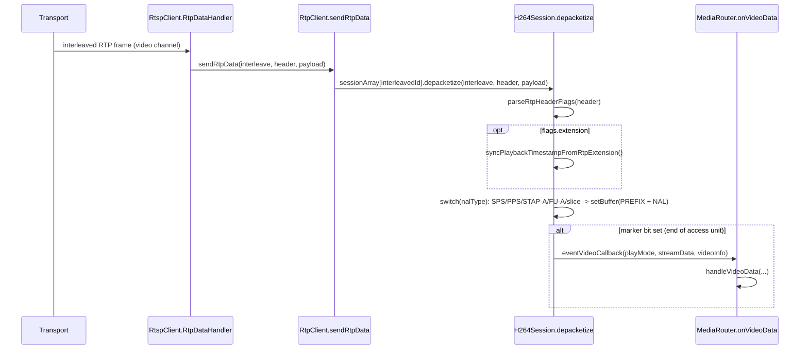

### RFC / Standard References

RFC 6184 (RTP Payload Format for H.264 Video): §5.3 NAL unit header/type field (`payload[0] &
0x1f`), Table 1 type numbers (STAP-A=24, STAP-B=25, MTAP16=26, MTAP24=27, FU-A=28, FU-B=29 —
FU-B is *not* separately handled here, only FU-A/type 28), §5.7.1 STAP-A layout (2-byte
size-prefixed aggregation), §5.8 FU-A header layout (S/E/R bits + 5-bit type in the second
payload byte). RFC 3550 §5.1 for the RTP fixed header (padding, marker bit, timestamp). The
Annex-B `00 00 00 01` start-code convention is from ITU-T H.264 Annex B, not RFC 6184 itself
(RFC 6184 payloads have no start codes — this class reintroduces them for the Annex-B-based
decode path used downstream).

### Relations & Data Flow

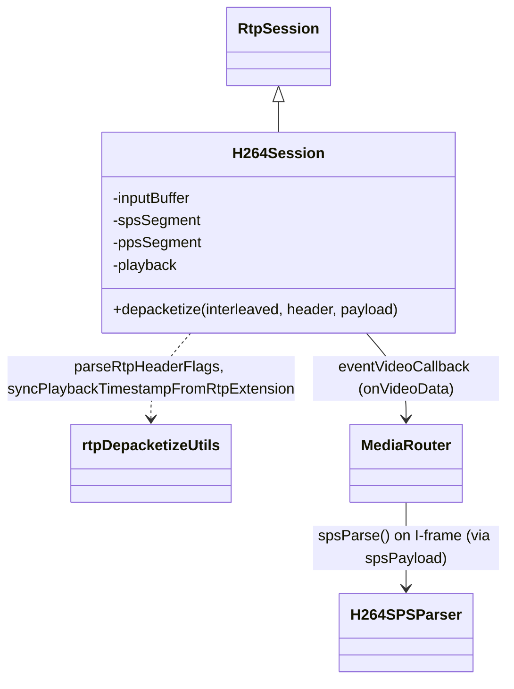

---

## `H265Session` (`mediaSession/videoSession/H265Session.ts`)

### Structure

`H265Session extends RtpSession`, structurally parallel to `H264Session`: `inputBuffer`
(`SIZE_1_4K`), `inputLength`, `playback`, plus **three** cached NAL payloads instead of two —
`vpsPayload`, `spsPayload`, `ppsPayload` (HEVC has a VPS layer H.264 lacks). `HEVC_NAL`: `VPS=32,
SPS=33, PPS=34, AUD=35, UNSPEC49=49` — matching RFC 7798 / H.265 NAL unit type numbers (`nal_unit_type`
values 32-34 for parameter sets, 35 for AUD, 49 for the aggregation/fragmentation-unit type used
here as FU).

### Method Analysis

- **`init()`**, **`setBuffer(chunk)`** — identical shape/logic to `H264Session`'s.
- **`depacketize(rtspInterleaved, rtpHeader, rtpPayload)`**:
  1. `parseRtpHeaderFlags(rtpHeader)`.
  2. Validates the `0x24` interleaved marker (`0x0102` on failure) — same as H264.
  3. **CSRC check differs from H264Session by design** (documented in-code): rather than using the computed `flags.csrcCount !== 0`, it checks the raw nibble `(rtpHeader[0] & 0x0f) === 0x0f`, i.e. it only rejects when CSRC count is *exactly* 15, not merely nonzero — preserved as a faithful port of a legacy quirk, not "fixed" to match H264Session's stricter check.
  4. Padding: checks `(rtpHeader[0] & 0x20) === 0x20` directly (equivalent to `flags.padding`) and reads the trailing padding-length byte.
  5. Extension handling and playback-timestamp sync: identical to H264Session (`extensionHeaderLen` computed the same way, same `syncPlaybackTimestampFromRtpExtension` call).
  6. `nalType = (payload[0] >> 1) & 0x3f` — the HEVC NAL header is **2 bytes**, and `nal_unit_type` is a **6-bit** field occupying bits 6-1 of the first byte (RFC 7798 §1.1.1 / H.265 §7.3.1.2), unlike H.264's 5-bit type in the low bits — hence the different shift/mask compared to `H264Session`.
  7. Dispatches on `nalType`:
     - **VPS (32) / SPS (33) / PPS (34)**: writes `PREFIX + payload`, caches into `vpsPayload`/`spsPayload`/`ppsPayload` respectively.
     - **AUD (35)**: dropped silently.
     - **UNSPEC49 = Fragmentation Unit** — RFC 7798 §4.4.3: the FU header is the **third** payload byte (`payload[2]`), after the 2-byte HEVC NAL header (`payload[0]`, `payload[1]`) — `startBit = (payload[2] & 0x80)`, `endBit = (payload[2] & 0x40)`, `fuType = payload[2] & 0x3f` (6-bit original NAL type, S/E bits in the top 2 bits of the same byte). On the start fragment, reconstructs a full 2-byte HEVC NAL header: `[(payload[0] & 0x81) | (fuType << 1), payload[1]]` — preserving the forbidden-zero-bit and `nuh_layer_id`'s low bit from byte 0 (`0x81` mask keeps bit 7 and bit 0) while substituting the real `nal_unit_type` shifted into bits 6-1, and copying byte 1 (`nuh_layer_id`/`nuh_temporal_id_plus1`) unchanged. Writes `PREFIX + newHeader(2 bytes) + payload.subarray(3)`. Continuation/end fragments append `payload.subarray(3)` only.
     - **default**: writes `PREFIX + payload` verbatim (ordinary VCL NAL units, i.e. slice types 0-31 and other non-fragmented/non-aggregated types).

     Note: unlike `H264Session`, there is **no STAP-A-equivalent aggregation handling** in this
     class — HEVC's AP (Aggregation Packet, type 48) is not implemented; only VPS/SPS/PPS/AUD/FU
     (49)/default are handled.
  8. On marker bit: same pattern as H264 — snapshot buffer, compute `rtpTimestamp`, reset
     `inputLength`, record start timestamp on first frame, increment counter. `frameType` is
     determined differently from H264: `inputBufferSub[4] === 0x40` — byte offset 4 is the first
     byte of the **second** NAL unit's header (after the first NAL's 4-byte start code), and
     `0x40` is `nal_unit_type << 1` for type 32 (VPS) with forbidden-bit 0 — i.e. `'I'` if the
     access unit begins with a VPS unit (implying a full parameter-set-led IDR/CRA sequence),
     else `'P'`. Builds `streamData`/`videoInfo` (now including `vpsPayload`) and fires
     `eventVideoCallback`.
- **`close()`** — clears `sessionId`, stops statistics timer.

### Call Stack

Structurally identical to `H264Session`'s (see diagram there) with `H265Session.depacketize` in
place of `H264Session.depacketize`, and `MediaRouter.getFrameSizeInfo` using `H265SPSParser`
instead of `H264SPSParser` (selected by `spsParse(sps, codecType)`'s `codecType === 'H264' ?
H264SPSParser : H265SPSParser` branch).

### RFC / Standard References

RFC 7798 (RTP Payload Format for HEVC): §1.1.1 NAL unit header (2 bytes: `forbidden_zero_bit(1)
+ nal_unit_type(6) + nuh_layer_id(6) + nuh_temporal_id_plus1(3)`, matching H.265 §7.3.1.2 exactly),
§4.4.3 Fragmentation Units (FU header byte: `S(1) E(1) FuType(6)`, immediately following the
2-byte payload header that carries the FU's own `LayerId`/`TID` but a placeholder `nal_unit_type`
of 49). NAL type constants 32 (VPS)/33 (SPS)/34 (PPS)/35 (AUD)/49 (FU) match RFC 7798 Table 1 /
H.265 Table 7-1.

### Relations & Data Flow

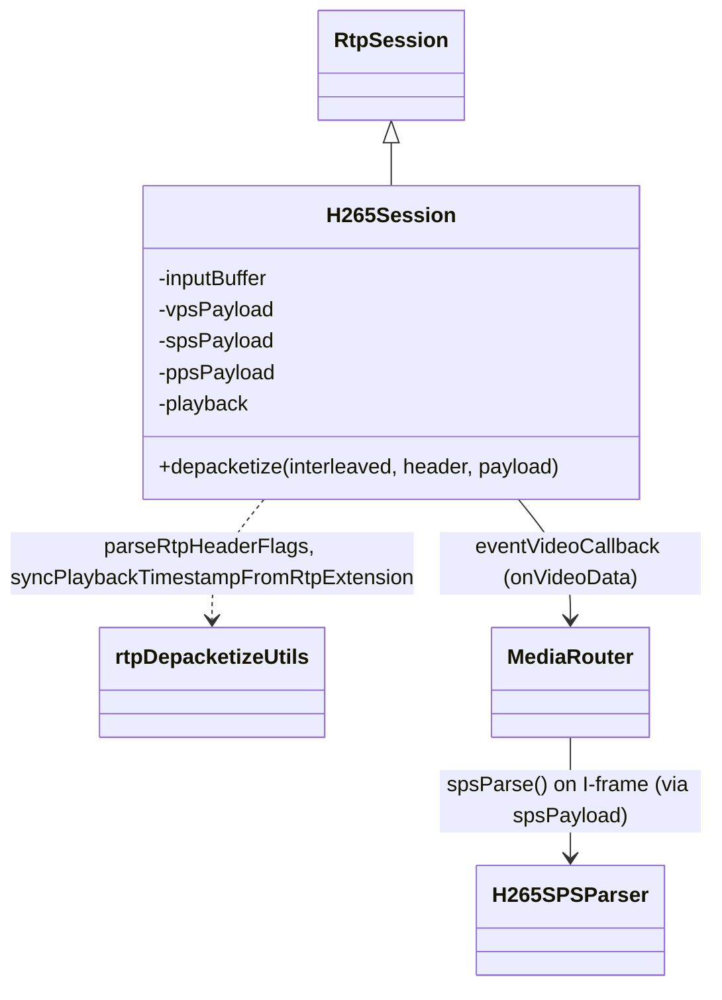

---

## `MjpegSession` (`mediaSession/videoSession/MjpegSession.ts`)

### Structure

`MjpegSession extends RtpSession`. Unlike H264/H265, depacketization is **offloaded to a Web
Worker** (`worker/mjpegSession/mjpegDepacketizeWorker.ts`, documented in the `worker/` subsystem
doc — referenced here by name only). Fields: `worker: MjpegWorkerLike | null`, `rtpDataArray:
MjpegRtpDataEntry[]` (raw-packet accumulator awaiting a worker flush), `workerFactory:
MjpegWorkerFactory` — injected via the constructor (defaulting to `new Worker(new
URL('../../worker/mjpegSession/mjpegDepacketizeWorker.ts', import.meta.url))`), which is itself a
small DI seam (mirrors `MediaRouterFactories`) allowing tests to substitute a fake worker.
`RTP_STACK_CHECK_NUM = 50` — the batch size at which accumulated packets are flushed to the
worker even without a marker bit.

### Method Analysis

- **`init()`** — lazily creates the worker (if not already created) and wires `worker.onmessage` to `handleWorkerMessage`.
- **`handleWorkerMessage(message)`** (private) — receives `{ playMode, streamData, videoInfo }` back from the worker (i.e. the worker does the actual RFC 2435 JPEG/RTP reassembly and JFIF framing — not shown in this file), determines `isMetaImage = information === 'MetaImageSession'` (this session type is reused for still-image "meta image" delivery, a separate use case from the main MJPEG video track — see `information` on `RtpSession`), and fires `eventVideoCallback(message.playMode, message.streamData, message.videoInfo, isMetaImage)` — the fourth argument routes into `MediaRouter.handleVideoData`'s `isMetaImage` short-circuit branch when set.
- **`depacketize(rtspInterleaved, rtpHeader, rtpPayload)`** — **does not parse JPEG structure itself**; it only extracts the RTP marker bit and timestamp (`rtpMarkerBit`, `rtpTimeStamp` via `ntohl(header[4:8])`) for bookkeeping (packet counting, `setStartTimeStamp` on first frame), pushes a raw `MjpegRtpDataEntry` (`deviceType`, `rtspInterleave`, `interleavedId`, `channelId`, `header`, `payload`) onto `rtpDataArray`, and flushes a batch (`rtpDataArray.splice(0, RTP_STACK_CHECK_NUM)`) to the worker via `postMessage({ dataArray })` whenever the accumulator reaches `RTP_STACK_CHECK_NUM` (50) entries **or** the current packet has the marker bit set (end of a JPEG frame) — ensuring a frame's packets are always flushed together even if fewer than 50, and large frames are still chunked at 50-packet boundaries.
- **`close()`** — clears `sessionId`, stops statistics timer, and terminates+nulls the worker (releasing the worker thread), unlike H264/H265's simpler close.

### Call Stack

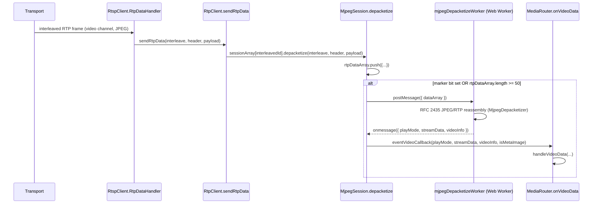

### RFC / Standard References

RFC 2435 (RTP Payload Format for JPEG-compressed Video) governs the actual depacketization, but
that logic lives in the worker-side `MjpegDepacketizer` (`worker/` subsystem, not read for this
document) — `MjpegSession` itself only touches the generic RFC 3550 marker-bit/timestamp fields
(`rtpHeader[1] & 0x80`, `ntohl(rtpHeader.subarray(4,8))`) before handing raw packets off.

### Relations & Data Flow

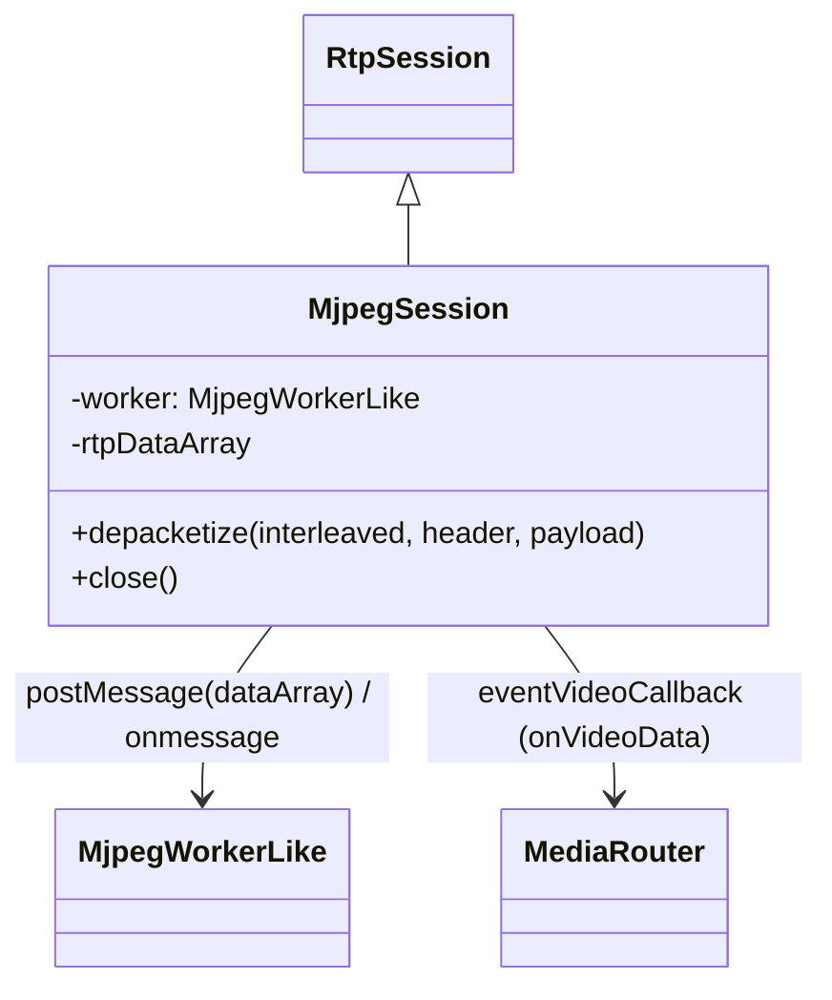

---

## `VideoRtcpSession` (`mediaSession/videoSession/VideoRtcpSession.ts`)

### Structure

`VideoRtcpSession extends RtpSession` (despite the name, it is **not** related to
`mediaSession/RTCPSession.ts` by inheritance — the doc comment explicitly notes the class was
renamed from the legacy `RtcpSession` to avoid a case-only collision with that unrelated class).
Constructed with a `clockFreq: number`. Private fields: `ntpMsw`, `ntpLsw`, `rtpTimestampValue`,
`fsyncTimestamp`, `fsyncTime: { seconds, useconds }`.

Per `src/player/README.md` §3, `RtpSession <|-- VideoRtcpSession` is listed in the class hierarchy,
but this session type is **not** among those `RtpClient.sendSdpInfo` instantiates (it has no
`codecName` case there) — it appears to be a standalone helper used elsewhere (e.g. by a
video-tag/backup path needing RTCP SR-based presentation-time computation independent of the
main `RTCPSession`/`MediaRouter` NTP-sync path), consistent with its distinct `calculatePacketTime`
API shape not matching `RTCPSession`'s.

### Method Analysis

- **`noteIncomingSR(ntpmsw, ntplsw, rtptimestamp)`** (private) — converts the NTP LSW fraction to microseconds (`ntplsw * 15625.0 / 0x04000000` — an alternate, division-free-friendly formula equivalent to `lsw / 2^32 * 1e6`, since `15625/2^26 = 1e6/2^32`), computes `fsyncTime = { seconds: ntpmsw - 0x83aa7e80, useconds: microseconds + 0.5 }` (same NTP-epoch constant as `RTCPSession`, plus a 0.5 rounding nudge), and records `fsyncTimestamp = rtptimestamp` as the RTP-clock anchor paired with that wall-clock reading.
- **`SendRtpData(_rtspInterleaved, rtpHeader, rtpPayload)`** — despite the name (misleading — it *receives*, not sends), rebuilds a 12-byte-header-prefixed RTCP buffer, reads `pt = rtcpBuffer[1]`; only acts on `pt === 200` (Sender Report): skips the 4-byte sender SSRC, reads NTP MSW/LSW and RTP timestamp (each via `ntohl` on a 4-byte scratch array), and calls `noteIncomingSR`.
- **`calculatePacketTime(rtpTimeStamp)`** (overrides `RtpSession`'s no-op) — converts an arbitrary RTP timestamp into an absolute `{ tv_sec, tv_usec }` presentation time relative to the last-seen SR anchor: `timeDiff = (rtpTimeStamp - fsyncTimestamp) / clockFreq` (seconds). If no SR has ever been seen (`fsyncTime.seconds === 0`), falls back to the current wall-clock time as the anchor. Then adds (or subtracts, if `timeDiff` is negative) `timeDiff` from the anchor's seconds/microseconds, normalizing microsecond overflow/underflow against `1e6`. Note: the microsecond delta term literally computes `(timeDiff - timeDiff) * million`, i.e. always `0` — a preserved legacy quirk (the sub-second part of `timeDiff` is dropped; only whole seconds carry through, microseconds always equal the anchor's `fsyncTime.useconds` unchanged by the offset). This looks like a bug in the ported original, kept for fidelity rather than "fixed."

### Call Stack

Not wired into the `RtpClient.sendSdpInfo` codec dispatch table documented above; it is
constructed and driven directly by its own external caller (outside the files read for this
document — likely the video-tag/backup demuxing path). `SendRtpData` is its RTCP-packet entry
point, analogous in spirit to `RTCPSession.depacketize` but implemented independently and with
different NTP handling (no `SetTimeStamp`/`eventRtcpCallback`, since it's not integrated into the
`MediaRouter` NTP-sync path).

### RFC / Standard References

Same RFC 3550 §6.4.1 Sender Report layout as `RTCPSession` (SSRC, NTP MSW/LSW, RTP timestamp) and
the same `0x83aa7e80` NTP-epoch constant, but implemented as an independent reader rather than
sharing code with `RTCPSession`.

### Relations & Data Flow

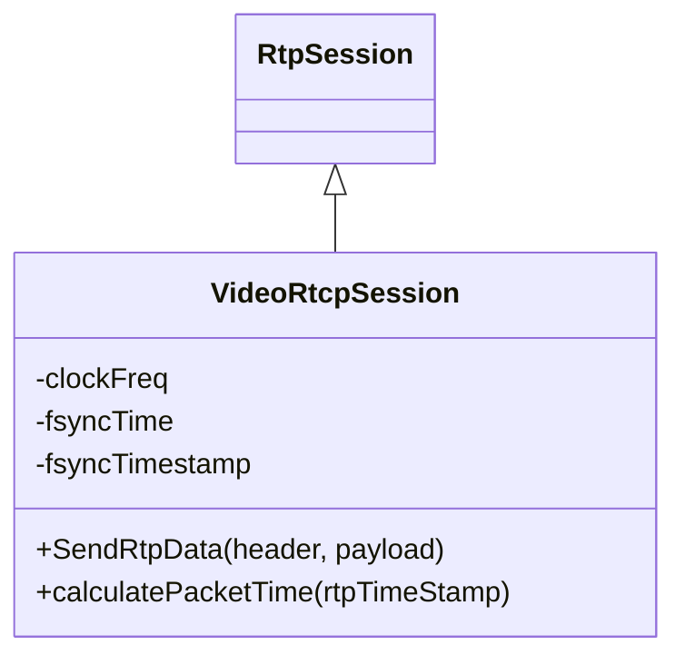

---

## `PlaybackBufferManager` and `BufferManagerStates`

### Structure

`PlaybackBufferManager` (not a `Session`) is a jitter/playback buffer sitting between
`MediaRouter` and the `video/player` rendering layer, used specifically for the `Playback + H265 +
canvas` combination (`MediaRouter.checkBufferManagerAvailable`). It owns a `VideoBufferList`
(`buffer`) and delegates all state-transition decisions to a **State pattern**
(`BufferManagerStates.ts`): `bufferStatus: BufferState`, initialized to `new InitState(this)`.
Other fields: `channelId`, `bufferSize` (derived from framerate, see `push` below), `callbackFunc`
(host notification sink for `BufferControlMessage`s), `reserveNode: VideoBufferNode | null`
(holds a popped node so it can be pushed back to the front via `front()` — used for step-back/replay).

`BufferManagerStates.ts` defines the shared `BufferState` interface —
`isReadyToPop(): boolean`, `push(): boolean`, `pause(): BufferControlMessage | undefined`,
`full(): BufferControlMessage | undefined`, `restart(): BufferControlMessage | undefined`,
`clear(): void`, `resume(): BufferControlMessage | undefined`, optional `checkBufferLength?()` —
and six concrete states, each taking a `BufferManagerLike` (`{ change(status) }`, i.e.
`PlaybackBufferManager` itself) in its constructor so it can transition the manager to the next
state:

| State | `isReadyToPop` | Triggers **out** |
|---|---|---|
| `InitState` | `false` | `push()` → `PlayState` (returns `true`, i.e. the push that triggers the transition is itself accepted) |
| `PlayState` | `true` | `pause()` → `PauseState`; `full()` → `WaitPauseState` (returns an `0x0500` error message); `clear()`/`restart()` → `InitState` |
| `WaitPauseState` | `true` | `pause()` → `FullState`; `clear()` → `InitState` |
| `FullState` | `true` | `pause()` → `FakePauseState` (returns an `0x0000`/"Pause" message); `restart()` → `PlayState` (returns an `0x0501` message); `clear()` → `InitState` |
| `FakePauseState` | `false` | `resume()` → `FullState` (returns an `0x0000`/"Resume" message); `clear()` → `InitState` |
| `PauseState` | `false` | `resume()` → `InitState`; `clear()` → `InitState` |

All states' `push()` returns `false` except `InitState`'s (which returns `true` exactly once, on
the transition-triggering push). This means `PlaybackBufferManager.push()`'s return value
(propagated straight from `bufferStatus.push()`) is only ever `true` on the very first push after
`init()`/`clear()`/`restart()` — every subsequent push while already in `PlayState` (or beyond)
returns `false`, even though the underlying `VideoBufferList.push` always succeeds; the boolean
here signals "did this push just start playback," not "did the push succeed."

### Method Analysis

- **`change(status)`** — swaps `bufferStatus` (called by the states themselves, not external callers).
- **`fullCallback()`** (private, registered with `VideoBufferList.setBufferFullCallback` in the constructor) — delegates to `bufferStatus.full()`; if it returns a message (only `PlayState` does), forwards it through `callbackFunc`.
- **`init(callback)`** — resets to `InitState`, stores `callbackFunc`, clears the underlying buffer.
- **`push(bufferInfo)`** — if `bufferInfo.videoInfo.framerate` is present and differs from the currently-derived `bufferSize`, recomputes `bufferSize = framerate * 4` and calls `buffer.setBUFFERING(bufferSize)` (jitter-buffer fill threshold, clamped 20-240 by `VideoBufferList`) and `buffer.setMaxLength(framerate * 6)` (a no-op currently, see `VideoBufferList.setMaxLength`'s comment — dead parity code). Wraps `frameData` in a fresh `Uint8Array`, pushes it (with width/height/crop/codec/frameType/timeStamp) onto `buffer`, then returns `bufferStatus.push()`.
- **`front()`** — pushes back `reserveNode` (the last-popped node) to the head of the buffer list and clears `reserveNode` — used to "un-pop" a frame, e.g. when stepping backward.
- **`pause()`** — delegates to `bufferStatus.pause()`, forwarding any resulting message.
- **`resume()`** — delegates to `bufferStatus.resume()`, forwarding any message, and returns `bufferStatus.isReadyToPop()` (the caller uses this to know whether it's now safe to start popping frames).
- **`pop()`** — pops the head node from `buffer`; if empty, calls `bufferStatus.clear()` (forcing back to `InitState`) and returns `false`; otherwise stashes the popped node as `reserveNode` (for a possible later `front()`) and returns a `PopFrameInfo` (`playMode: 'Playback'`, `streamData`, `videoInfo`) shaped exactly like what `VideoPlayerLike` implementations expect for rendering.
- **`full()`** — direct passthrough to `bufferStatus.full()` (used by callers other than the internal `fullCallback` wiring, e.g. explicit polling).
- **`checkRestart()`** — if the underlying buffer is empty (`getBufferLength() < 1`), calls `bufferStatus.restart()`; if that yields a message, forwards it and returns `true` (signaling "a restart happened"); otherwise `false`.
- **`isReadyToPop()`** — passthrough to the current state.
- **`clear()`** — passthrough to `bufferStatus.clear()`.

### Call Stack

```mermaid
sequenceDiagram
    participant MR as MediaRouter.handleVideoData
    participant PBM as PlaybackBufferManager
    participant VBL as VideoBufferList
    participant State as current BufferState

    MR->>PBM: sendToBufferManager(...) -> push(bufferInfo)  [conceptually, via CanvasTagPlayer]
    PBM->>VBL: push(frameData, width, height, ..., timeStamp)
    VBL->>VBL: length++; if length >= buffering -> bufferFullCallback()
    VBL-->>PBM: fullCallback() -> bufferStatus.full()
    PBM->>State: push()
    State-->>PBM: change(nextState) [InitState->PlayState on first push]

    Note over PBM,VBL: renderer side, driven by CanvasTagPlayer
    PBM->>VBL: pop()
    VBL-->>PBM: VideoBufferNode | null
    PBM->>State: (indirectly) isReadyToPop()/clear() as needed
```

Note: `PlaybackBufferManager` itself is owned/driven by the `video/player` rendering layer
(`CanvasTagPlayer`, per `src/player/README.md` §5's `CanvasTagPlayer --> PlaybackBufferManager :
creates`), not directly by `MediaRouter` — `MediaRouter.handleVideoData` calls
`player.sendToBufferManager(...)`, and it is `CanvasTagPlayer`'s implementation of that method
(not read for this document) that actually calls into `PlaybackBufferManager.push`/`pop`.

### RFC / Standard References

Not applicable — this is playback jitter-buffering logic, not RTP/RTCP wire format.

### Relations & Data Flow

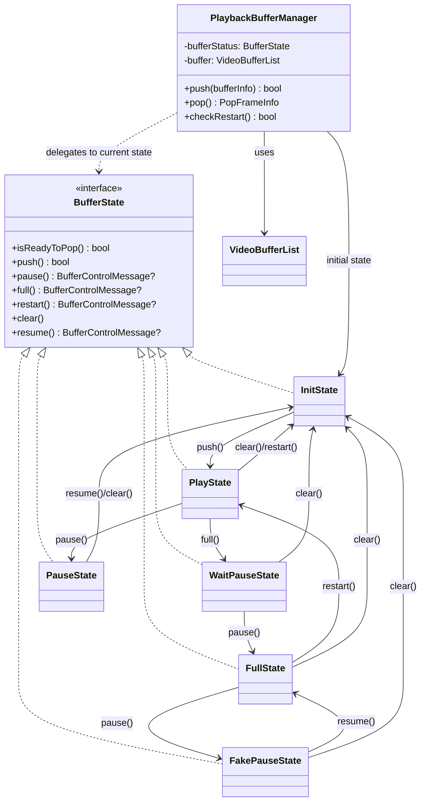

---

## `VideoBufferList` (`mediaSession/videoSession/VideoBufferList.ts`)

### Structure

A hand-rolled doubly-linked list (`VideoBufferNode`: `buffer`, `width`, `height`, `cropWidth`,
`cropHeight`, `codecType`, `frameType`, `timeStamp`, `next`/`previous`), used exclusively by
`PlaybackBufferManager`. Fields: `length`, `head`/`tail`, `curIdx` (cursor used by
`searchTimestamp`/`findIFrame`), `buffering` (fill threshold, default `DEFAULT_BUFFERING = 240`),
`bufferFullCallback`, `checkFull` (edge-detection latch so the full callback only fires once per
crossing, not on every push while still above threshold).

### Method Analysis

- **`push(...)`** — appends a new tail node; if `bufferFullCallback` is set and `length >=
  buffering`, fires the callback **once** per threshold-crossing (`checkFull` latch prevents
  refiring on every subsequent push while still full); resets the latch once length drops back
  below `buffering` implicitly (the `else if (this.checkFull)` branch — actually this only clears
  the latch when a push happens while `length < buffering` *and* `checkFull` is still true, since
  pops don't touch `checkFull` — meaning the latch really resets on the next push after the buffer
  has drained, not immediately on drain).
- **`front(node)`** — prepends a node at the head (used by `PlaybackBufferManager.front()` to restore a previously-popped node).
- **`pop()`** — standard head-removal, fixing up `head`/`tail`/`previous` pointers.
- **`setMaxLength(_length)`** — explicit no-op (confirmed write-only in the legacy source too, per the code comment).
- **`setBUFFERING(interval)`** — clamps the fill threshold to `[20, 240]` — the RFC-agnostic jitter-buffer size in frame count, derived by `PlaybackBufferManager.push` as `framerate * 4`.
- **`setBufferFullCallback(callback)`** — registers the full-notification sink (called by `PlaybackBufferManager`'s constructor).
- **`searchTimestamp(frameTimestamp)`** — linear scan from `head` for a node whose `timeStamp.{timestamp,timestamp_usec}` matches exactly; throws if the list is empty or no timestamp given; sets `curIdx` to the matched position (1-based) on success, else returns `null`.
- **`findIFrame(isForward)`** — starting from the node at `curIdx`, walks forward or backward until it finds a node with `frameType === 'I'`, updating `curIdx`; used for step-frame / seek-to-keyframe navigation. No bounds guard on the backward walk beyond `currentNode!.previous` eventually becoming accessed on a null (relies on there being an I-frame in the buffer).
- **`clearBuffer()`** — walks the whole list nulling out each node's `buffer` (early GC hint) and resets `length`/`head`/`tail`/`curIdx`.
- **`getBufferLength()`** — returns `length`.

### Call Stack

Invoked only from `PlaybackBufferManager` (`push`→`VideoBufferList.push`, `pop`→`.pop`,
`front`→`.front`, `init`→`.clearBuffer`, plus the constructor wiring `setBufferFullCallback`). No
direct callers outside that class among the files read for this document.

### RFC / Standard References

Not applicable — generic buffering data structure.

### Relations & Data Flow

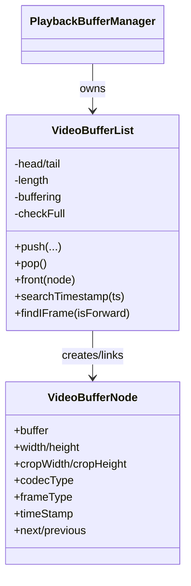

---

## `H264SPSParser` and `H265SPSParser`

### Structure

Both live in `util/` (not `mediaSession/`) but are documented here because `MediaRouter` and the
video sessions are their only real consumers. Both share an identical shape: private `bitCount`
(bit-level read cursor), `spsMap: RTSPOverWebSocketMap<SpsValue>` (an ordered key/value store —
see `util/RTSPOverWebSocketMap`, not detailed here), `spsBytes: Uint8Array` (the RBSP-extracted
SPS after emulation-prevention removal). Neither extends a common base class or interface — they
are structurally parallel (same private helper method names/logic) but independently implemented,
consistent with `MediaRouter.spsParser: H264SPSParser | H265SPSParser` being a union type rather
than a shared interface type.

### Method Analysis

Both parsers share near-identical private bit-reading primitives:

- **`nalUnitExtractRbsp(src)`** — removes H.264/H.265 **emulation prevention bytes**: scans for
  the 3-byte sequence `0x00 0x00 0x03` and drops the `0x03`, per the standard NAL-to-RBSP
  conversion both codecs specify (H.264 §7.4.1.1 / H.265 §7.4.2) to prevent start-code emulation
  within the bitstream.
- **`getBit(base, offset)`** / **`readBits(buf, n)`** — MSB-first bit extraction using the shared
  `bitCount` cursor, advancing it by `n` after each read (`readBits(1)` special-cased to a single
  `getBit` call for a minor speed win, functionally identical to the general path).
- **`ue(base, offset)`** — Exp-Golomb unsigned decode (`ue(v)`, ITU-T H.264/H.265 §9.1): counts
  leading zero bits, then reads that many info bits, computing `(1 << zeros) - 1 + infoBits`.
  **H264SPSParser's version has an extra end-of-buffer guard** (`if (base.length === idx) break`
  inside the leading-zero-counting loop) that `H265SPSParser`'s does not — a real, if minor,
  divergence between the two ports (H265's `ue` would read out-of-bounds/`undefined` if the
  zero-run ran past the buffer end, where H264's stops early).
- **H264SPSParser-only: `se(base, offset)`** — Exp-Golomb **signed** decode (`se(v)`, §9.1.1):
  maps the unsigned code `k` to `k odd ? (k+1)/2 : -k/2`, used for `offset_for_non_ref_pic` etc.
  H265SPSParser has no `se` (not needed for the fields it reads).
- **H264SPSParser-only: `hrdParameters(spsBytes)`** — parses the HRD (Hypothetical Reference
  Decoder) parameter set (§E.1.2) — CPB count, bit-rate/CPB-size scale, per-CPB bitrate/size/CBR
  flags, and delay-length fields — invoked from `vuiParameters` for both NAL-HRD and VCL-HRD when
  present.
- **H264SPSParser-only: `vuiParameters(spsBytes)`** — parses the VUI (Video Usability
  Information) block (Annex E.1.1) in full: aspect ratio, overscan, video signal type + colour
  description, chroma sample location, timing info (`num_units_in_tick`/`time_scale`/
  `fixed_frame_rate_flag`), HRD parameters (both NAL and VCL), `low_delay_hrd_flag`,
  `pic_struct_present_flag`, and bitstream restriction fields (motion vector bounds, max
  reorder/DPB frames). None of these VUI-derived fields are read back by
  `getSizeInfo`/`getCodecInfo`/`getSpsValue` callers documented in this set — they're parsed for
  completeness/consumability via `getSpsValue(key)` rather than used internally.
- **`parse(spsPayload)`** (both) — the main SPS grammar walk:
  - **H264**: `forbidden_zero_bit`, `nal_ref_idc`, `nal_unit_type`, `profile_idc`,
    `profile_compatibility`, `level_idc`, `seq_parameter_set_id`; if `profile_idc` is one of the
    "High"-family profiles (`[100,110,122,244,44,83,86,118,128,138,139,134,135]` — matching the
    H.264 spec's list of profiles that carry chroma-format/bit-depth/scaling-list fields in the
    SPS), reads `chroma_format_idc` (+`separate_colour_plane_flag` if `== 3`),
    `bit_depth_luma_minus8`, `bit_depth_chroma_minus8`,
    `qpprime_y_zero_transform_bypass_flag`, `seq_scaling_matrix_present_flag` (+ full scaling-list
    parsing if present, computing but not retaining `scalingList` per-entry beyond the loop scope
    — dead in the sense that only presence flags are stored, not the values, matching the "we
    only need width/height/profile" scope of this parser). Then `log2_max_frame_num_minus4`,
    `pic_order_cnt_type` (+ type-0/type-1-specific sub-fields), `num_ref_frames`,
    `gaps_in_frame_num_value_allowed_flag`, **`pic_width_in_mbs_minus1`**,
    **`pic_height_in_map_units_minus1`**, **`frame_mbs_only_flag`** (+
    `mb_adaptive_frame_field_flag` if 0), `direct_8x8_interence_flag`, **`frame_cropping_flag`** (+
    the four crop-offset fields if set), `vui_parameters_present_flag` (+ full VUI if set). The
    bolded fields are exactly what `getSizeInfo()` needs.
  - **H265**: NAL header (`forbidden_zero_bit`, 6-bit `nal_unit_type`, 6-bit `nuh_layer_id`, 3-bit
    `nuh_temporal_id_plus1` — note this reads the SPS's *own* NAL header, not a video NAL, since
    the SPS payload handed in still carries its 2-byte HEVC NAL header per §7.3.1.2), then
    `sps_video_parameter_set_id`, `sps_max_sub_layers_minus1`,
    `sps_temporal_id_nesting_flag`, the full `profile_tier_level()` fixed fields
    (`general_profile_space`(2), `general_tier_flag`(1), `general_profile_idc`(5),
    `general_profile_compatibility_flags`(32), `general_constraint_indicator_flags`(3×16=48 bits,
    stored as three 16-bit words), `general_level_idc`(8) — matching H.265 §7.3.3's fixed-length
    prefix, **without** the variable sub-layer profile/level loop that would follow it in a full
    `profile_tier_level()` for `sps_max_sub_layers_minus1 > 0` — this parser only reads the
    general (layer-0) profile/tier/level, not per-sub-layer ones), `sps_seq_parameter_set_id`,
    `chroma_format_idc` (+ `separate_colour_plane_flag` if `== 3`), **`pic_width_in_luma_samples`**,
    **`pic_height_in_luma_samples`**, **`conformance_window_flag`** (+ the four `conf_win_*_offset`
    fields if set). Parsing stops there (no SPS fields beyond the conformance window are read —
    scaling lists, short/long-term ref pic sets, VUI, etc. are not parsed by this class at all).
- **`getSizeInfo()`** (both) — computes final pixel `width`/`height`/`decodeSize`/`cropWidth`/`cropHeight`:
  - **H264**: derives `SubWidthC`/`SubHeightC` chroma subsampling factors from `chroma_format_idc`/`separate_colour_plane_flag` per H.264 Table 6-1 (4:2:0→2,2; 4:2:2→2,1; 4:4:4 depends on separate-plane flag), computes `picWidthInMbs = pic_width_in_mbs_minus1+1`, `frameHeightInMbs = (2 - frame_mbs_only_flag) * (pic_height_in_map_units_minus1+1)` (the standard field/frame-coding doubling per §7.4.2.1.1), multiplies by the 16×16 macroblock size, then subtracts the crop rectangle (`cropUnitX = SubWidthC`, `cropUnitY = SubHeightC * (2 - frame_mbs_only_flag)`, exactly per H.264 Eq. 7-19/7-20) times `(left+right)`/`(top+bottom)` offsets.
  - **H265**: simpler — `pic_width_in_luma_samples`/`pic_height_in_luma_samples` are already the frame dimensions in the standard (no macroblock multiplication needed); subtracts `SubWidthC * (conf_win_right + conf_win_left)` / `SubHeightC * (conf_win_bottom + conf_win_top)` per H.265 §7.4.3.2.1's conformance-cropping-window formula, with `SubWidthC`/`SubHeightC` from `chroma_format_idc` (4:2:0→2,2; 4:2:2→2,1; 4:4:4→1,1 — note this parser's H265 chroma_format_idc===0 case sets both to `1`, i.e. monochrome is treated with a unity subsampling factor for the crop-scaling formula, matching the spec's convention that `SubWidthC=SubHeightC=1` when `ChromaArrayType==0`).
- **`getSpsValue(key)`** (both) — raw accessor into `spsMap`, used by `MediaRouter.handleVideoData` for `profileIdc`/`levelIdc` (H264) directly.
- **`getCodecInfo()`** — builds the MSE/`MediaSource.isTypeSupported` codec string:
  - **H264**: `'avc1.' + profile_idc(hex,2digit) + profile_compatibility(hex,2digit) + level_idc(hex,2digit)` — the standard RFC 6381 `avc1.PPCCLL` codec-parameter syntax. Returns `null` if any of the three fields is missing (SPS not yet parsed).
  - **H265**: `'hvc1.' + [profileSpaceLabel]generalProfileIdc + '.' + reverseBits(compatFlags,32) + '.' + (tierFlag?'H':'L') + levelIdc + '.' + constraints.toString(16)` — the RFC 6381-derived HEVC codec string convention (profile-space letter `A0`-`A3` for space 1-3 or empty for 0, bit-reversed compatibility flags per the spec's "encoded in reverse bit order" convention, tier as H/L, then trimmed constraint-flag bytes).
- **H264SPSParser has no profile-name helper**; **H265SPSParser-only: `getProfileName()`** — maps `general_profile_idc` to `'Main'`(1)/`'Main 10'`(2)/`'Main Still Picture'`(3)/`'Rext'`(4)/`'Unknown'` — used by `MediaRouter.selectVideoPlayer`'s non-MSE-supported fallback path (`getProfileName() !== 'Main'` gates an error) and by the module doc's own `getMaxResolutionSize`-adjacent H265 check in `checkVideoResolution`.
- **H265SPSParser-only: `getProfileTierLevel()`** — packs the parsed profile/tier/level fields back into a raw 12-byte array matching the HEVC `profile_tier_level()` bitstream layout (byte 0 = `space(2)|tier(1)|profileIdc(5)`, bytes 1-4 = compatibility flags, bytes 5-10 = the three 16-bit constraint words split into bytes, byte 11 = `general_level_idc`) — consumed by `MediaRouter.handleVideoData` to populate `videoInfo.profileTierLevel` for H265 I-frames (used downstream, presumably by MSE codec-description construction in `video/player`, not read for this document).

### Call Stack

```mermaid
sequenceDiagram
    participant MR as MediaRouter.handleVideoData
    participant Parser as H264SPSParser / H265SPSParser

    MR->>MR: getFrameSizeInfo(codecType, videoInfo)  [on I-frame]
    MR->>MR: spsParse(videoInfo.spsPayload, codecType)
    MR->>Parser: new H264SPSParser()/H265SPSParser()  [if codec changed]
    MR->>Parser: parse(spsPayload)
    MR->>Parser: getSizeInfo()
    Parser-->>MR: { width, height, decodeSize, cropWidth, cropHeight }
    MR->>Parser: getCodecInfo()  [for MediaSource.isTypeSupported / videoInfo.codecInfo]
    MR->>Parser: getSpsValue('profile_idc'/'level_idc')  [H264]  or  getProfileTierLevel()  [H265]
```

### RFC / Standard References

ITU-T H.264 §7.3.2.1.1 (SPS RBSP syntax), §7.4.1.1 (emulation prevention / RBSP extraction),
§9.1/§9.1.1 (`ue(v)`/`se(v)` Exp-Golomb coding), Annex E (VUI/HRD parameters), Table 6-1
(chroma subsampling factors), Eq. 7-19/7-20 (crop-unit scaling). ITU-T H.265 §7.3.1.2 (NAL unit
header), §7.3.2.2.1 (SPS RBSP syntax prefix through the conformance window), §7.3.3
(`profile_tier_level()` fixed-length general fields), §7.4.3.2.1 (conformance cropping window
size derivation), §Annex A (profile naming: Main/Main10/Main Still Picture/Rext, though the exact
string labels here are this codebase's own, not verbatim spec text). RFC 6381 (codec-parameter
string syntax) for `getCodecInfo()`'s `avc1.PPCCLL`/`hvc1....` output, consumed by
`MediaSource.isTypeSupported()` per the W3C Media Source Extensions spec (not itself read here).

### Relations & Data Flow

```mermaid
classDiagram
    class H264SPSParser {
        +parse(spsPayload) bool
        +getSizeInfo() SpsSizeInfo
        +getSpsValue(key)
        +getCodecInfo() string?
    }
    class H265SPSParser {
        +parse(spsPayload) bool
        +getSizeInfo() SpsSizeInfo
        +getSpsValue(key)
        +getCodecInfo() string
        +getProfileName() string
        +getProfileTierLevel() number[]
    }
    MediaRouter --> H264SPSParser : creates/uses (H264 I-frames)
    MediaRouter --> H265SPSParser : creates/uses (H265 I-frames)
```

---

## Module-wide data flow

End-to-end path for one video access unit, from wire to renderer, showing every class documented
in this file plus the named boundary collaborators:

```mermaid
flowchart TD
    subgraph network["network/ (not detailed here)"]
        Transport
        RtspClient
    end

    subgraph mediaSession["mediaSession/"]
        RtpClient
        RTCPSession
        MediaRouter
        MetaDataParser
        subgraph videoSession["mediaSession/videoSession/"]
            H264Session
            H265Session
            MjpegSession
            VideoRtcpSession
            PlaybackBufferManager
            BufferManagerStates
            VideoBufferList
        end
    end

    subgraph util["util/"]
        H264SPSParser
        H265SPSParser
    end

    subgraph downstream["video/player, listen/, backup/, talk/ (documented elsewhere)"]
        VideoPlayerLike["VideoPlayerLike (CanvasTagPlayer/VideoTagPlayer)"]
        AudioPlayerLike["AudioPlayerLike (AudioPlayerGxx)"]
        BackupProviderLike["BackupProviderLike (BackupProvider)"]
    end

    Transport -->|interleaved TCP frame| RtspClient
    RtspClient -->|sendRtpData / sendSdpInfo| RtpClient
    RtpClient -->|depacketize per interleaved channel| H264Session
    RtpClient -->|depacketize| H265Session
    RtpClient -->|depacketize| MjpegSession
    RtpClient -->|depacketize| RTCPSession

    H264Session -->|eventVideoCallback| MediaRouter
    H265Session -->|eventVideoCallback| MediaRouter
    MjpegSession -->|eventVideoCallback via worker| MediaRouter
    RTCPSession -->|eventRtcpCallback| MediaRouter

    MediaRouter -->|spsParse| H264SPSParser
    MediaRouter -->|spsParse| H265SPSParser
    MediaRouter -->|onVideoData / bufferingVideoData| VideoPlayerLike
    MediaRouter -->|sendToBufferManager, Playback+H265+canvas| VideoPlayerLike
    VideoPlayerLike -.->|owns| PlaybackBufferManager
    PlaybackBufferManager --> BufferManagerStates
    PlaybackBufferManager --> VideoBufferList

    MediaRouter -->|onAudioData| AudioPlayerLike
    MediaRouter -->|parse| MetaDataParser
    MediaRouter -->|onVideoData/receiveAudioData, backup active| BackupProviderLike
```

**Dependency-inversion seam** (see `MediaRouter` section above and `src/player/README.md` §1):
`MediaRouter.ts` imports no concrete player/talk/backup class. `StreamPlayer` (in `interface/`)
constructs `MediaRouter` with a `MediaRouterFactories` object and supplies `createCanvasPlayer` →
`CanvasTagPlayer`, `createVideoPlayer` → `VideoTagPlayer`, `createAudioPlayer` → `AudioPlayerGxx`,
`createTalk` → `Talk`, `createMetaDataParser` → (wraps `MetaDataParser`), `createBackupProvider` →
`BackupProvider`. `MediaRouter` only ever holds these behind the `VideoPlayerLike` /
`AudioPlayerLike` / `TalkLike` / `MetaDataParserLike` / `BackupProviderLike` interfaces declared in
`MediaRouter.ts`, so this module can be tested (and reasoned about) without any of those concrete
classes.
