# `mediaSession` — Audio & Text Sessions

*Per-class reference for the concrete `RtpSession` subclasses under `src/player/mediaSession/audioSession/` (the
receive-side audio codecs plus the talk-back send session) and the text/meta session.*

**Version:** 1.1.0 · **Author:** Youngho Kim

**History**

| Date | Change |
| --- | --- |
| 2026-08-06 | Add per-class reference docs for `src/player` (initial version) |
| 2026-08-26 | Added Title/Abstract/Version/Author/History metadata header |
| 2026-09-04 | Every class here gained `debug`-gated `console.log` tracing "for free": they all extend `RtpSession`/`Session`, which gained one generic `setDebugConfig(config, componentName)` (see `03-mediaSession-core-video.md`'s History) — no changes to any file in this directory were needed. `RtpClient.sendSdpInfo()` calls it right after constructing each one, passing its own literal class name. See `01-elements-interface-exceptions.md`'s new `debug` attribute and `08-util.md`'s `debugLog.ts`. |
| 2026-09-04 | Follow-up: unlike the "for free" entry above, actually instrumenting `depacketize()`'s body in each of these files needed real per-file edits (the "for free" part was only the enable-gate wiring, not any trace calls). `G711Session`/`G726Session`/`OPUSSession` — one RTP packet is already one complete frame for these codecs (RFC 3551/7587, no reassembly), so each gets a single `info`-level trace right before `eventAudioCallback` fires (byte count, packet-sequence number) rather than a separate, redundant `debug`-level "packet arrived" line. `AACSession` (packets can bundle multiple access units) gets a `debug`-level trace per raw packet plus an `info`-level trace per AU inside its existing aggregation loop (AU index/count, byte size) — switched that loop from `for...of` to an indexed `for` since the trace needed the AU's position, not just its size. `AudioTalkSession` (outbound talk-back, no `depacketize()` override at all — see its own Structure notes) gets a `debug`-level trace in `getRTPPacket()` instead, the actual per-outbound-packet method. `MetaSession` follows the same pattern as the video sessions in `03`: `debug` per packet, `info` when `flags.markerBit` completes the buffered metadata payload. Requested directly by the user, verified live against a real camera (`03`'s History has the concrete counts). See `08-util.md`'s new `mediaSession` group aliases (`"audioSession"`/`"textSession"`) for selecting just these classes without listing each by name. |

---

This document covers the concrete `RtpSession` subclasses under `src/player/mediaSession/audioSession/` (the four
receive-side audio codecs plus the talk-back send session) and `src/player/mediaSession/textSession/MetaSession.ts`,
plus the shared ADPCM helper `src/player/util/CommonAudioUtil.ts`. It is one file in a per-subsystem reference set
for `src/player`; see [src/player/README.md](../../src/player/README.md) §3 for the full `mediaSession` class
diagram and how this fits with the video sessions and `RtpClient`/`MediaRouter` (documented in full elsewhere).

## Shared base classes (for context only)

All six classes documented below extend `RtpSession` (`src/player/mediaSession/RtpSession.ts`), which itself extends
`Session` (`src/player/mediaSession/Session.ts`). Neither is documented in full here — only the parts these
subclasses actually use:

- **`Session`** (`src/player/mediaSession/Session.ts`) owns the event-callback slots (`eventAudioCallback`,
  `eventMetaCallback`, etc., wired via `addEventListener`/`removeEventListener`, `Session.ts:56-103`), the
  `timeData`/`clock`/`channelId`/`interleavedId` fields every session stamps into its output, and the byte-order
  helpers `ntohl`/`htonl`/`ntohs`/`htons` (`Session.ts:36-54`) used to read the 32-bit RTP timestamp out of the RTP
  header.
- **`RtpSession`** (`src/player/mediaSession/RtpSession.ts`) adds `codec`/`mime`/`sessionId`/`rtcpSession`, the
  received/dropped packet counters used by `onStatisticsTimer()` (`RtpSession.ts:174-231`) to emit `'statistics'`
  and `'waiting'` events, and `startStatisticsTimer()`/`stopStatisticsTimer()`. Every session below reuses
  `isInitializeReceivedPacketCount()`/`setStartTimeStamp()`/`increaseNumberOfReceivedPacketCount()` in its
  `depacketize()` to seed and advance these counters, and calls `stopStatisticsTimer()` from `close()`.
- Two RTP-parsing helpers in `src/player/mediaSession/rtpDepacketizeUtils.ts` are shared verbatim by every codec
  session (video included): `parseRtpHeaderFlags()` (version/padding/extension/CSRC-count/marker/payload-type) and
  `syncPlaybackTimestampFromRtpExtension()`, which recognizes a vendor (Hanwha) RTP-extension marker (`0xAB
  0xAD`/`0xAC`) carrying an NTP playback timestamp, decodes it, estimates framerate from consecutive frames, and
  records it via `session.SetTimeStamp()`. Its return value becomes each session's `playback` flag (`true` once the
  marker has ever been seen), which in turn selects `'Live'` vs `'Playback'` in the emitted `streamData`.

Per `src/player/README.md`'s class diagram: `RtpSession <|-- AACSession, AudioTalkSession, G711Session, G726Session,
OPUSSession` (plus `MetaSession`, not shown in that particular bullet list but present in the diagram alongside the
video sessions). All six classes documented below confirm this inheritance directly in their source.

---

## `AACSession` (`mediaSession/audioSession/AACSession.ts`)

### Structure

- Extends `RtpSession` (`AACSession.ts:19`).
- Fields: `config` (AudioSpecificConfig hex string), `bitrate`, `channelCount` (default `1`), `samplingFrequencyIndex`
  (default `8` — i.e. 16 kHz per ISO/IEC 14496-3 Table 1.16, a real-camera-oriented fallback overridden once a real
  `config` is parsed), `sampleRate`, the RFC 3640 AU-header bit widths `sizeLength`/`indexLength`/`indexDeltaLength`
  (default `13`/`3`/`3`, this repo's demo server's own values and a common default elsewhere), a reusable 7-byte
  `adts` buffer, and `playback` (`AACSession.ts:20-40`).
- No custom constructor — instance state is populated by `init()`.
- `AACCodecInfo` (`AACSession.ts:5-12`) is the `init()` parameter shape: `config`, `bitrate`, `clockFreq`, and
  optional `sizeLength`/`indexLength`/`indexDeltaLength` overrides, all sourced from SDP `fmtp` attributes by the
  caller (`RtpClient`).
- Module constant `AAC_FRAME_SAMPLES = 1024` (`AACSession.ts:16`): AAC-LC (the only `audioObjectType` this
  depacketizer's ADTS generation targets) always codes 1024 PCM samples per access unit; used to advance the
  per-AU RTP timestamp when a packet aggregates several AUs.

### Method Analysis

- **`init(info?: AACCodecInfo)`** (`AACSession.ts:65-92`): stores `config`/`bitrate`, resets `playback` and
  `timeData`, sets `clock = clockFreq * 0.001` (RTP-ticks-per-millisecond) and `sampleRate = clockFreq`. Applies the
  caller-supplied AU-header bit widths if present. If `config` is at least 4 hex chars, decodes the
  AudioSpecificConfig (ISO/IEC 14496-3 §1.6.2.1: 5-bit `audioObjectType`, 4-bit `samplingFrequencyIndex`, 4-bit
  `channelConfiguration`) to get the *real* `samplingFrequencyIndex`/`channelCount` — a code comment explains this
  matters concretely: this repo's own demo server encodes 48 kHz stereo AAC, not the 16 kHz mono a real IP camera
  typically sends, and declaring the wrong values makes the browser's AAC decoder reject the track with an MSE
  decode error.
- **`genADTSAAC(frameSize)`** (private, `AACSession.ts:42-63`): builds a 7-byte ADTS header into `this.adts` from
  `config`'s `audioObjectType`, `samplingFrequencyIndex`, `channelCount`, and the AU's frame size (header + payload
  length, hence `frameSize + 7`). Only called when the raw access unit does *not* already start with an ADTS sync
  word (`0xFF` + top nibble `0xF`), and relies purely on the `this.adts` side effect (no return value used) — ported
  verbatim from the legacy depacketizer.
- **`parseAuHeaders(payload, byteOffset)`** (private, `AACSession.ts:100-122`): implements the RFC 3640 §3.3.6
  AU-header-section: reads a 2-byte `AU-headers-length` (in *bits*) at `byteOffset`, then walks that many bits as
  back-to-back AU headers — `sizeLength + indexLength` bits for the first header, `sizeLength + indexDeltaLength`
  bits for each subsequent one — extracting each AU's byte size (discarding the index/index-delta bits via `>>>
  indexBits`). Returns `{ auSizes, dataStart }`, where `dataStart` is the byte offset where the concatenated AU
  payload data begins.
- **`depacketize(rtspInterleaved, rtpHeader, rtpPayload)`** (`AACSession.ts:124-222`), overriding `RtpSession`'s
  no-op: validates the RTSP-over-TCP interleave marker (`0x24`) and rejects nonzero CSRC count, both via
  `RTSPOverWebSocketError`; computes `paddingSize` from the RTP padding flag. If the RTP extension bit is set,
  computes `extensionHeaderLen` and calls `syncPlaybackTimestampFromRtpExtension()`. Extracts the 32-bit RTP
  timestamp via `ntohl`. **Unlike the other four codec sessions in this file, AACSession still gates on
  `flags.markerBit`** — it returns early if the marker bit is not set, then computes `rtpTimestamp` and updates the
  packet-count/statistics bookkeeping only once the marker arrives.
  - Then calls `parseAuHeaders(rtpPayload, extensionHeaderLen)`. A packet may aggregate **multiple** complete AAC
    access units — the code comment notes this repo's own demo server does exactly that (bundling 3-4 ~350B frames
    per packet at 48 kHz/96 kbps) and that treating the whole payload as one AU (the depacketizer's previous,
    buggy behavior) desyncs partway through. It loops `auSizes`, slicing each AU out of `rtpPayload`, regenerating
    the ADTS header via `genADTSAAC()` only if the AU doesn't already carry one, and emitting one `eventAudioCallback`
    call per AU with `codecType: 'AAC'`, the `ADTs` header, `frameData` (the raw AU bytes), and a per-AU
    `timeStamp.rtpTimestamp` computed by advancing `auRtpTimeStamp` by `AAC_FRAME_SAMPLES` (1024) between AUs —
    i.e. consecutive AUs in one packet are assumed back-to-back in time (index-delta 0, the standard CBR-ish case).
  - `audioInfo` passed alongside each `streamData` carries `bitrate`, `channelCount`, `samplingFrequencyIndex`,
    `sampleRate`.
- **`close()`** (`AACSession.ts:224-227`): clears `sessionId`, stops the statistics timer.

### Call Stack

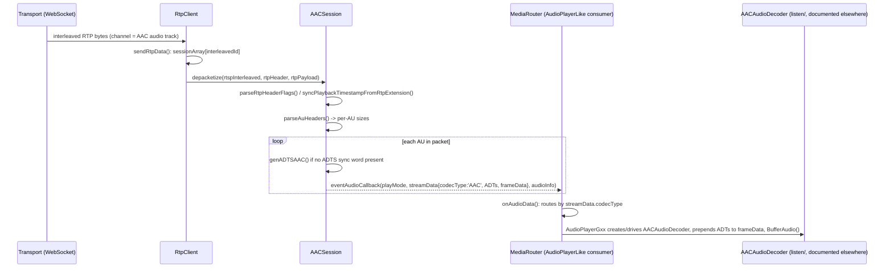

### RFC / Standard References

- **RFC 3640** ("RTP Payload Format for Transport of MPEG-4 Elementary Streams", MPEG4-GENERIC) defines the
  AU-header-section this class parses in `parseAuHeaders()` — §3.3.6 specifically. The `sizeLength`/`indexLength`/
  `indexDeltaLength` field widths are negotiated per-stream via SDP `fmtp` (as reflected in `AACCodecInfo`), and
  this depacketizer only supports the resulting "AAC-hbr" style layout (one AU-headers-length prefix followed by
  N AU headers, then concatenated AU data) — no interleaving or CRC modes.
- The AudioSpecificConfig bit layout decoded in `init()` and the ADTS header generated in `genADTSAAC()` follow
  **ISO/IEC 14496-3** (MPEG-4 Audio), not an IETF RFC.
- RFC 3551 (RTP A/V Profile) is not directly relevant to AAC — MPEG4-GENERIC is a dynamic payload type negotiated
  via SDP, unlike the static payload types used by G.711/G.726 below.

### Relations & Data Flow

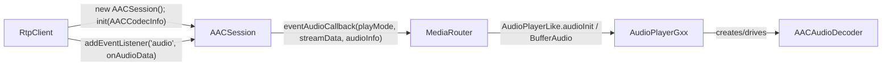

`RtpClient.sendSdpInfo()` instantiates `AACSession` for the `mpeg4-generic` SDP codec entry (excluding talk-back
tracks), calling `init()` with `config`/`clockFreq`/`bitrate` and the optional AU-header lengths from SDP `fmtp`
(`RtpClient.ts:177-192`). `MediaRouter` never imports `AACSession` directly — it only sees the `AudioStreamData`/
`AudioInfo` payloads via the `eventAudioCallback` wired through `RtpSession.addEventListener('audio', ...)`, then
dispatches to an `AudioPlayerLike` (`AudioPlayerGxx` in practice), which owns and drives `AACAudioDecoder` (see the
`listen/` documentation for decoder internals).

---

## `AudioTalkSession` (`mediaSession/audioSession/AudioTalkSession.ts`)

### Structure

- Extends `RtpSession` (`AudioTalkSession.ts:13`), confirming the README diagram's `RtpSession <|-- AudioTalkSession`
  edge — but structurally it is the odd one out among the five audio sessions in this directory.
- **This is a send-path (talk-back / two-way audio) session, not a receive/decode session.** It has no `init()`
  override, no `depacketize()` override, and never touches `eventAudioCallback` — its only substantive method,
  `getRTPPacket()`, *builds* an outbound RTP/RTSP-interleaved packet from locally captured microphone audio, the
  inverse direction of every other class in this file.
- Fields: `rtpHeaderSize = 12`, `rtspHeaderSize = 4` (byte counts for the two headers it hand-assembles),
  `sequenceNum` (starts at `0xffde` and increments per packet), a random `ssrcId` (`Math.floor(Math.random() *
  1000000 + 1)`), and an owned `audioEncoder = new G711AudioEncoder()` (`talk/encoder/G711AudioEncoder.ts`) that
  does the actual PCM → G.711 mu-law encoding. `channelID` is the RTSP interleaved channel number to stamp into
  outbound packets.
- **Constructor**: `constructor(channel: number)` (`AudioTalkSession.ts:21-24`) — unlike the other four sessions
  (all use the implicit no-arg `RtpSession` constructor and get configured via `init()`), `AudioTalkSession` takes
  its RTSP interleaved channel ID up front, since it needs it to build outbound headers immediately, not lazily
  from SDP info.

### Method Analysis

- **`setSampleRate(sampleRate)`** (`AudioTalkSession.ts:26-28`): forwards to `audioEncoder.setSampleRate()`, so the
  encoder can downsample the captured mic buffer (typically the browser's `AudioContext` rate) to the G.711 target
  rate (8 kHz, encoded in `G711AudioEncoder`'s own `codecInfo`).
- **`getRTPPacket(buffer: Float32Array): Uint8Array`** (override, `AudioTalkSession.ts:30-53`) — the core method:
  1. Encodes the raw PCM `buffer` via `audioEncoder.encode(buffer)` (`G711AudioEncoder`'s mu-law + downsampling
     logic — see `talk/encoder/G711AudioEncoder.ts`), producing `rtpPayload`.
  2. Hand-builds a 4-byte RTSP-over-TCP interleave header: `0x24` marker, `channelID`, then a 2-byte big-endian
     payload-size field written via the module-level helper `intToByteArrayHtoN()` (`AudioTalkSession.ts:4-11`, a
     host-to-network integer-to-byte-array packer parameterized by length).
  3. Hand-builds a 12-byte RTP header: byte 0 = `0x80` (version 2, no padding/extension/CSRC), byte 1 = `0x80`
     (marker bit set, payload type 0 — PCMU is RTP static payload type 0), a 2-byte sequence number
     (`sequenceNum`, pre-incremented every call), a 4-byte timestamp field populated from `Date.now()` (wall-clock
     milliseconds, **not** an RTP media clock — a simplification acceptable for talk-back, which is a one-way
     unidirectional stream the far end just plays out), and the 4-byte `ssrcId`.
  4. Concatenates RTSP header + RTP header + encoded payload into one `Uint8Array` and returns it — ready to hand
     directly to the WebSocket transport.
- No `depacketize()`, `init()`, or `close()` overrides — those are inherited as `RtpSession`'s no-ops/defaults,
  since this session never receives RTP data.

### Call Stack

Unlike the other sessions in this file, the "real invocation chain" for `AudioTalkSession` runs **outbound**, from
captured microphone audio to the network, not RTP-in to decoder-out:

```mermaid
sequenceDiagram
    participant Talk as Talk (talk/, documented elsewhere)
    participant MR as MediaRouter
    participant RC as RtpClient
    participant ATS as AudioTalkSession
    participant Enc as G711AudioEncoder
    participant RClient as RtspClient
    participant Net as WebSocket transport

    Talk->>MR: setSendAudioTalkBufferCallback(cb) via TalkLike
    MR->>RC: startAudioTalk(cb) (MediaRouterLike)
    RC->>ATS: new AudioTalkSession(RtpInterlevedID); mediaRouter.startAudioTalk(...).then(setSampleRate)
    Note over Talk: ScriptProcessorNode captures mic PCM
    Talk-->>RC: onaudioprocess -> Float32Array via sendAudioTalkData()
    RC->>ATS: getRTPPacket(buffer)
    ATS->>Enc: encode(buffer)
    Enc-->>ATS: G.711 mu-law payload
    ATS-->>RC: RTSP-interleaved RTP packet (Uint8Array)
    RC->>RClient: sendAudioTalkDataCallback(packet) (via rtpClient.addListener('audioTalk', ...))
    RClient->>Net: SendAudioTalkData() -> ws.send()
```

### RFC / Standard References

- The wire format it emits is standard **RTP over RTSP interleaved framing** (RFC 2326 §10.12 / carried forward
  into RFC 7826 for RTSP 2.0) plus a plain 12-byte RTP header (RFC 3550). Payload type is not explicitly set as a
  named constant in code, but byte 1 = `0x80` selects payload type 0, which is **PCMU (G.711 mu-law)** per RFC
  3551's static payload type table — consistent with the fact that its only encoder is `G711AudioEncoder`.
  There's no fragmentation/aggregation logic (RFC 3551 defines G.711 as one RTP packet per contiguous chunk of
  companded samples, same as the receive-side `G711Session` below).
- Unlike the receive sessions, this class does not consume the RTP-extension "playback timestamp" mechanism (that
  mechanism, per `rtpDepacketizeUtils.ts`, is a vendor/Hanwha-specific playback-sync extension relevant only to
  camera-to-client streams, not talk-back).

### Relations & Data Flow

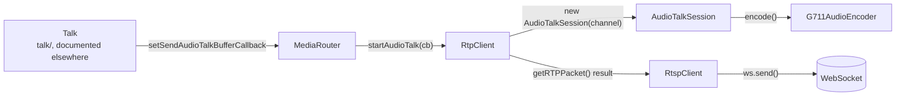

`RtpClient.sendSdpInfo()` special-cases the G.711 SDP entry whose `trackID` matches `t`/`back` (the talk-back
track, distinct from the receive-only G.711 track handled by `G711Session`): it constructs `AudioTalkSession`
directly (not pushed into `sessionArray`, since it never receives `depacketize()` calls) and kicks off
`mediaRouter.startAudioTalk(...)`, whose resolved sample rate feeds `setSampleRate()` (`RtpClient.ts:135-149`,
`RtpClient.ts:87-90,100-102`). `MediaRouter.startAudioTalk()` in turn is driven by `Talk` (`talk/Talk.ts`) via the
`TalkLike` interface's `setSendAudioTalkBufferCallback`, which supplies raw `Float32Array` PCM straight from a
`ScriptProcessorNode`'s `onaudioprocess` callback — `AudioTalkSession` is the last stop before that PCM becomes RTP
bytes handed to `RtspClient.SendAudioTalkData()` for the actual WebSocket send (`RtspClient.ts:1546-1548`).

---

## `G711Session` (`mediaSession/audioSession/G711Session.ts`)

### Structure

- Extends `RtpSession` (`G711Session.ts:10`).
- Minimal state: `bitrate` and `playback` (`G711Session.ts:11-12`). No codec-specific buffering fields — G.711 has
  no framing to reassemble.
- `G711CodecInit` (`G711Session.ts:5-8`): `{ bitrate, clockFreq }`, supplied by `RtpClient` from SDP.
- No custom constructor.

### Method Analysis

- **`init(info?: G711CodecInit)`** (`G711Session.ts:14-20`): stores `bitrate`, resets `playback`/`timeData`, sets
  `clock = clockFreq * 0.001`.
- **`depacketize(rtspInterleaved, rtpHeader, rtpPayload)`** (`G711Session.ts:22-88`): the usual interleave-marker
  and CSRC-count validation, padding-size extraction, and RTP-extension playback-timestamp sync
  (`syncPlaybackTimestampFromRtpExtension`), identical in shape to `AACSession`'s preamble. The payload after any
  extension header is *directly* the frame data — `processedMessage = rtpPayload.subarray(extensionHeaderLen,
  rtpPayload.length)` — since **G.711 has no internal RTP framing to parse**: every packet is already one complete,
  independent chunk of continuous mu-law/A-law companded PCM samples (one byte per sample, no headers, no
  AU/NAL-style structure). A code comment is explicit about a fixed bug here: depacketize() previously gated on
  `flags.markerBit` (copied from the video-session pattern), which silently dropped every packet from this repo's
  demo server, because RFC 3551 only defines the marker bit for talk-spurt boundaries under silence suppression,
  and ffmpeg's G.711 RTP muxer (no silence suppression) never sets it — real cameras happening to always set it is
  why the bug went unnoticed. **`G711Session` does not gate on the marker bit at all** — every packet is emitted.
  Emits `eventAudioCallback(playMode, streamData, audioInfo)` per packet, with `codecType: 'G711'`,
  `frameData: processedMessage` (the raw mu-law/A-law bytes, un-decoded — actual PCM decoding happens in
  `G711AudioDecoder`, documented elsewhere), and `audioInfo = { bitrate }`. The code notes the mu-law vs. A-law
  distinction is not made here at all — the raw companded bytes are passed through unchanged; which law applies is
  determined by codec negotiation/SDP (`codecMime`) upstream, not by this depacketizer.
- **`close()`** (`G711Session.ts:90-93`): clears `sessionId`, stops the statistics timer.

### Call Stack

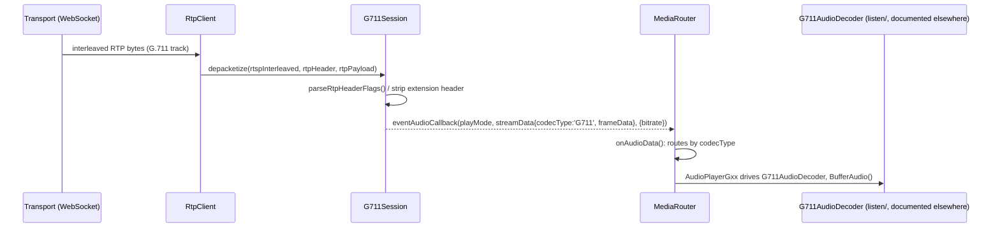

### RFC / Standard References

- **RFC 3551** ("RTP Profile for Audio and Video Conferences with Minimal Control") defines PCMU (payload type 0,
  mu-law) and PCMA (payload type 8, A-law) as static payload types, and specifies that G.711 carries one octet per
  sample with no additional RTP-payload framing — matching the direct pass-through in `depacketize()`. G.711 itself
  is an ITU-T recommendation, not an IETF-defined codec; RFC 3551 only defines how to carry it over RTP.
- The marker-bit semantics referenced in the code comment (talk-spurt boundary under silence suppression) are also
  from RFC 3551.

### Relations & Data Flow

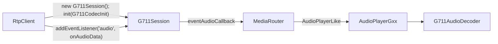

`RtpClient.sendSdpInfo()` constructs `G711Session` for the `G.711` SDP entry whose `trackID` is *not* the talk-back
track (`entry.trackID.search('trackID=t') === -1 && ... 'trackID=back' === -1`), distinguishing it from the
talk-back branch that instead builds `AudioTalkSession` (`RtpClient.ts:135-149`). Downstream, `MediaRouter` selects
and drives `G711AudioDecoder` inside `AudioPlayerGxx` (see `listen/` documentation).

---

## `G726Session` (`mediaSession/audioSession/G726Session.ts`)

### Structure

- Extends `RtpSession` (`G726Session.ts:10`).
- Fields identical in shape to `G711Session`: `bitrate`, `playback` (`G726Session.ts:11-12`).
- `G726CodecInit` (`G726Session.ts:5-8`): `{ bitrate, clockFreq }`.
- No custom constructor. Notably, `G726Session` itself carries **no ADPCM decode state** (no `G726State`) — it is a
  pure depacketizer; the actual bitrate-specific ADPCM state machine lives downstream in the `listen/` decoders
  (`G726_16/24/32/40_AudioDecoder`), which is where `CommonAudioUtil`'s helpers are actually consumed (see below).

### Method Analysis

- **`init(info?: G726CodecInit)`** (`G726Session.ts:14-20`): stores `bitrate`, resets `playback`/`timeData`, sets
  `clock = clockFreq * 0.001`.
- **`depacketize(...)`** (`G726Session.ts:22-80`): structurally identical to `G711Session`'s — same interleave/CSRC
  validation, same extension-header/playback-sync handling, same direct pass-through (`processedMessage =
  rtpPayload.subarray(extensionHeaderLen, rtpPayload.length)`), same **no marker-bit gate** (the code comment
  explicitly cross-references `G711Session.ts`: "See G711Session.ts's depacketize() for why this doesn't gate on
  flags.markerBit — same continuous-PCM-like codec, same reasoning"). Emits `codecType: 'G726'`, `frameData:
  processedMessage`, `audioInfo = { bitrate }`.
- **Bitrate variant selection is not done inside `G726Session` itself.** The class is bitrate-agnostic — it just
  carries whatever `bitrate` value `RtpClient` passed to `init()` through to `audioInfo.bitrate` on every emitted
  packet. The actual choice of which G.726 decoder variant (16/24/32/40 kbit/s) to instantiate happens in
  `RtpClient.sendSdpInfo()`, which derives the bitrate either from `entry.Bitrate` or by parsing it out of the SDP
  codec name itself (`parseInt(entry.codecName!.substr(6, 2), 10)` — e.g. `"G.726-32"` → `32`) for the `G.726-16` /
  `G.726-24` / `G.726-32` / `G.726-40` SDP codec names (`RtpClient.ts:150-164`), and downstream in `MediaRouter`,
  which re-creates the audio player/decoder whenever `audioInfo.bitrate` changes for a `G726` stream
  (`MediaRouter.ts:787`: `streamData.codecType === 'G726' && self.audioBitrate !== audioInfo.bitrate`) — the
  `G726xAudioDecoder` facade (documented in `listen/`) then picks the matching `G726_NN_AudioDecoder`.
- **`close()`** (`G726Session.ts:82-85`): clears `sessionId`, stops the statistics timer.

### Call Stack

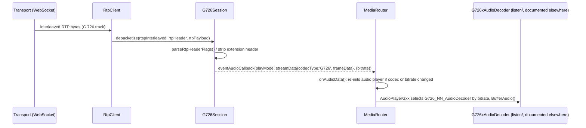

### RFC / Standard References

- **G.726** is an **ITU-T** recommendation (ADPCM at 16/24/32/40 kbit/s), not an IETF-defined codec. Its RTP
  carriage is referenced via **RFC 3551**'s AV profile, which lists G726-16/24/32/40 as dynamic payload types (no
  RTP-level framing beyond the raw ADPCM octet stream, same one-packet-one-chunk model as G.711).
- `CommonAudioUtil.ts`'s header comment states it was "ported from the legacy player's Util/audioUtil — G.72x ADPCM
  helper routines", i.e. it implements the ITU-T G.726/G.727 reference ADPCM algorithm (predictor, quantizer,
  adaptation state), not something defined by an RFC.

### Relations & Data Flow

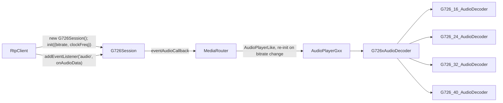

`RtpClient.sendSdpInfo()` constructs `G726Session` for any of the four `G.726-NN` SDP codec names, again excluding
talk-back tracks (`RtpClient.ts:150-164`). `G726Session` itself never touches `CommonAudioUtil` — that helper is
consumed by the bitrate-specific decoders it hands off to (see `CommonAudioUtil` section below).

---

## `OPUSSession` (`mediaSession/audioSession/OPUSSession.ts`)

### Structure

- Extends `RtpSession` (`OPUSSession.ts:10`).
- Fields: `bitrate`, `playback` (`OPUSSession.ts:11-12`) — same shape as `G711Session`/`G726Session`.
- `OPUSCodecInit` (`OPUSSession.ts:5-8`): `{ bitrate, clockFreq }`, though `clockFreq` is deliberately **ignored**
  in `init()` (see below).
- No custom constructor.

### Method Analysis

- **`init(info?: OPUSCodecInit)`** (`OPUSSession.ts:14-25`): stores `bitrate`, resets `playback`/`timeData`, and
  hardcodes `this.clock = 48000 * 0.001` rather than deriving it from `info.clockFreq`. The code comment explains
  why: RFC 7587 §4.1 mandates that Opus RTP timestamps always run at a fixed 48000 Hz clock rate regardless of the
  codec's actual internal sample rate (and the SDP `rtpmap`'s clock field is, by the same rule, only ever `"48000"`
  anyway) — hardcoded defensively in case a server ever sends something else in that field.
- **`depacketize(...)`** (`OPUSSession.ts:27-93`): same interleave/CSRC validation, extension-header/playback-sync
  handling, and direct pass-through (`processedMessage = rtpPayload.subarray(extensionHeaderLen,
  rtpPayload.length)`) as `G711Session`/`G726Session`. A code comment states the RTP-framing rationale explicitly:
  per RFC 7587 §4.2, "no fragmentation or aggregation" — one RTP packet is always exactly one complete Opus packet,
  so there's nothing to reassemble across packets. **Also does not gate on `flags.markerBit`**, with the same
  class of reasoning as G.711/G.726: RFC 7587 §4.1 only asks the marker be set on the first packet of a talkspurt
  and doesn't require receivers to depend on it, so encoders without silence suppression (which never set it)
  shouldn't have every packet dropped. Emits `codecType: 'OPUS'`, `frameData: processedMessage`, and
  `audioInfo = { bitrate, channelCount: 1, sampleRate: 48000 }` — channel count and sample rate are **hardcoded**
  rather than derived from the stream; the code comment points to `OPUSAudioDecoder.ts` for why this player only
  ever decodes Opus as mono, consistent with the fixed-clock reasoning in `init()`.
- **`close()`** (`OPUSSession.ts:95-98`): clears `sessionId`, stops the statistics timer.

### Call Stack

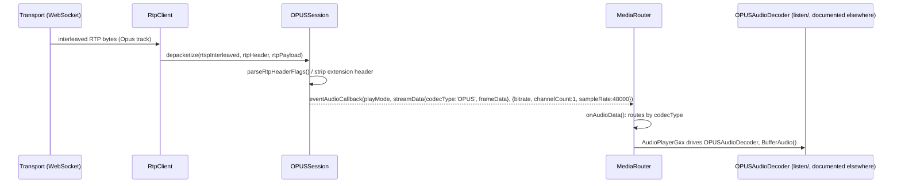

### RFC / Standard References

- **RFC 7587** ("RTP Payload Format for the Opus Speech and Audio Codec") governs both the fixed 48000 Hz RTP clock
  (§4.1, applied in `init()`) and the "no fragmentation or aggregation" framing rule (§4.2, relied on implicitly by
  `depacketize()`'s direct pass-through).
- **RFC 6716** defines the Opus codec itself (bitstream, encoding); this depacketizer doesn't touch codec internals
  — it only unwraps RTP framing, leaving actual Opus decoding to `OPUSAudioDecoder`.
- Opus is a dynamically-negotiated payload type via SDP, not one of RFC 3551's static assignments.

### Relations & Data Flow

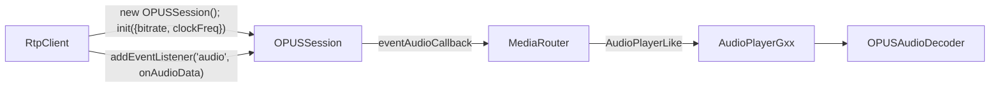

`RtpClient.sendSdpInfo()` constructs `OPUSSession` for the `OPUS` SDP entry, again excluding talk-back tracks
(`RtpClient.ts:165-176`).

---

## `MetaSession` (`mediaSession/textSession/MetaSession.ts`)

### Structure

- Extends `RtpSession` (`MetaSession.ts:7`) — present in the README's class diagram's `RtpSession <|--` list even
  though it's a text/metadata session, not audio or video.
- Fields: `inputBuffer` (a growable `Uint8Array`, initial capacity `SIZE_1_4K = Math.floor(1.4 * 1024)` bytes ≈
  1434 bytes — sized around a typical Ethernet MTU-ish metadata chunk), `inputLength` (bytes currently buffered),
  and `playback` (`MetaSession.ts:5-10`).
- No `init()` parameter — `override init(): void` takes nothing (`MetaSession.ts:12-15`), unlike every audio
  session above; metadata has no codec/bitrate/clock configuration to receive from SDP beyond what `RtpSession`
  already sets generically.

### Method Analysis

- **`setBuffer(chunk)`** (private, `MetaSession.ts:17-26`): appends `chunk` to `inputBuffer`, growing the backing
  array (by exactly `chunk.length` more bytes) if it would overflow. This is a **fragment-reassembly buffer**: a
  single logical metadata/text message can span multiple RTP packets, unlike G.711/G.726/OPUS (always one message
  per packet) but similar in spirit to AAC's AU aggregation (though here it's the reverse — one message split
  *across* packets rather than several packed *into* one).
  - **`init()`** (`MetaSession.ts:12-15`): resets `playback` and `timeData`. Notably does **not** reset
    `inputBuffer`/`inputLength` — those are only ever reset inside `depacketize()` once a marker-terminated message
    completes.
- **`depacketize(rtspInterleaved, rtpHeader, rtpPayload)`** (`MetaSession.ts:28-79`): the same interleave-marker/
  CSRC-count validation, padding extraction, and extension-header/playback-sync handling as the audio sessions.
  Unlike them, the payload slice explicitly trims padding too: `payload = rtpPayload.subarray(extensionHeaderLen,
  rtpPayload.length - paddingSize)`. Every packet's payload is appended via `setBuffer()` regardless of the marker
  bit — **this is the fragment-accumulation step**. Only when `flags.markerBit` is set does it finalize: it takes a
  `subarray(0, inputLength)` view of the accumulated buffer, computes `rtpTimestamp`, resets `inputLength = 0` (but
  keeps the underlying `inputBuffer` allocation for reuse), builds a `streamData` object (`frameData`, `channelId`,
  `receiveClock: performance.now()` — a field none of the audio sessions include — `timeStamp`, `rtcp_interleavedId`),
  and calls `eventMetaCallback?.(streamData)`. Note this uses **`eventMetaCallback`** (the `'text'` event slot on
  `Session`), not `eventAudioCallback` — metadata is routed through `RtpSession.addEventListener('text', ...)`.
- **`close()`** (`MetaSession.ts:81-84`): clears `sessionId`, stops the statistics timer. Does not reset
  `inputBuffer`/`inputLength` either.

### Call Stack

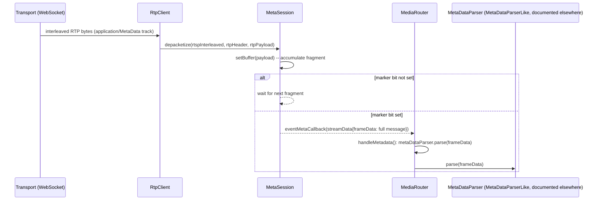

### RFC / Standard References

The code shows **no RFC or IETF standard governing the payload contents** of this "meta" RTP stream. The class only
implements generic RTP depacketization/reassembly (RFC 3550-style header parsing, shared with every other session
via `parseRtpHeaderFlags`) and a vendor-specific playback-timestamp RTP extension (the same `0xAB 0xAD`/`0xAC`
marker documented in `rtpDepacketizeUtils.ts`, attributed elsewhere in this codebase to Hanwha/SUNAPI cameras). The
SDP media type is `application`/codec name `MetaData` (`RtpClient.ts:193-198`), which is not one of RFC 3551's or
any other RFC's registered audio/video/text payload formats — it is best understood as a **vendor-specific (SUNAPI)
metadata channel**: `MetaSession` just reassembles and hands off opaque bytes, and the actual structure/schema of
those bytes is defined and parsed by `MetaDataParser` (not part of this file's scope), not by an RFC. No RFC
citation should be forced here.

### Relations & Data Flow

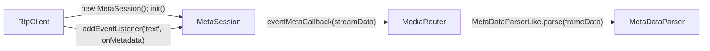

`RtpClient.sendSdpInfo()` constructs `MetaSession` unconditionally for the `MetaData` SDP codec name, with no
talk-back-style exclusion (`RtpClient.ts:193-198`). Because the SDP `entry.Type` for this track is `'application'`,
`RtpClient` wires `rtpSession.addEventListener('text', this.mediaRouter.onMetadata)` rather than `'audio'`
(`RtpClient.ts:230-232`). `MediaRouter.handleMetadata()` (`MediaRouter.ts:825-836`) receives the completed message
and forwards `metadata.frameData` verbatim to `this.metaDataParser.parse()` — a `MetaDataParserLike` instance,
documented elsewhere.

---

## `CommonAudioUtil` (`util/CommonAudioUtil.ts`)

A stateless collection of **G.72x ADPCM reference-algorithm routines**, explicitly ported ("Bitwise arithmetic is
copied verbatim; this is reference DSP code where the exact operations — not just the mathematical intent — are the
contract") from the legacy player's `Util/audioUtil`. It is **not** used by any of the RTP-session classes in this
file directly — `G711Session`/`G726Session`/`OPUSSession`/`AACSession`/`MetaSession`/`AudioTalkSession` all just
pass raw bytes through; none of them decode ADPCM. It exists purely for the **G.726 decode path**, consumed by the
bitrate-specific decoders (`G726_16/24/32/40_AudioDecoder` in `listen/`, documented elsewhere) that
`G726xAudioDecoder` dispatches to once `G726Session`'s depacketized frames reach `MediaRouter`.

Exported surface (`CommonAudioUtil.ts`):

- **`G726State`** interface (`:7-19`): the full ADPCM codec state — predictor coefficients `a`/`b`, sign history
  `pk`, quantized-difference history `dq`, reconstructed-signal history `sr`, adaptive step-size trackers
  `yl`/`yu`, speed-control accumulators `dms`/`dml`, adaptation flag `ap`, and tone/transition detector `td`.
- **`g726_init_state()`** (`:49-73`): allocates and zero/default-initializes a fresh `G726State` (matching the
  ITU-T reference initial conditions: `yl = 34816`, `yu = 544`, `sr[i] = 32`, `dq[i] = 32`).
- **`predictor_zero(state)`** / **`predictor_pole(state)`** (`:75-85`): the ADPCM predictor's zero-section (6-tap,
  using `b`/`dq` history) and pole-section (2-tap, using `a`/`sr` history) estimates, both built on the private
  **`fmult()`** floating-point-like fixed-point multiply helper (`:37-47`).
- **`step_size(state)`** (`:87-100`): computes the current adaptive quantizer step size from `yl`/`yu`/`ap`.
- **`quantize(d, y, table, size)`** / **`reconstruct(sign, dqln, y)`** (`:102-128`): the adaptive quantizer
  (difference signal → quantized code) and its inverse (quantized code → reconstructed difference signal), both
  built on the private **`quan()`** table-lookup helper (`:24-35`) shared with `fmult()`.
- **`update(...)`** (`:130-293`): the large ADPCM adaptation step — updates predictor coefficients (`a`, `b`),
  step-size trackers (`yl`, `yu`), tone-detector state (`td`), and speed-control accumulators (`dms`, `dml`, `ap`)
  from one decoded sample's inputs (`code_size`, `y`, `wi`, `fi`, `dq`, `sr`, `dqsez`) and the previous `state`,
  returning the mutated `state`.

None of these methods are RTP- or framing-aware — they operate purely on already-depacketized ADPCM sample streams,
which is why `G726Session` (the RTP-facing class) has no dependency on this file at all; the dependency is entirely
downstream, in the bitrate-specific `listen/` decoders.

---

## Summary: receive vs. send audio sessions

| Class | Direction | Framing per RTP packet | Marker-bit gated? | Emits via |
|---|---|---|---|---|
| `AACSession` | receive | 1..N AUs (RFC 3640 AU-headers) | yes | `eventAudioCallback` |
| `G711Session` | receive | exactly 1 chunk, no framing | no | `eventAudioCallback` |
| `G726Session` | receive | exactly 1 chunk, no framing | no | `eventAudioCallback` |
| `OPUSSession` | receive | exactly 1 Opus packet (RFC 7587 §4.2) | no | `eventAudioCallback` |
| `MetaSession` | receive | 1 fragment, reassembled across packets until marker | yes (terminates reassembly) | `eventMetaCallback` |
| `AudioTalkSession` | **send** | builds 1 outbound G.711 RTP packet per call | n/a (always sets marker on send) | return value of `getRTPPacket()`, not an event |
