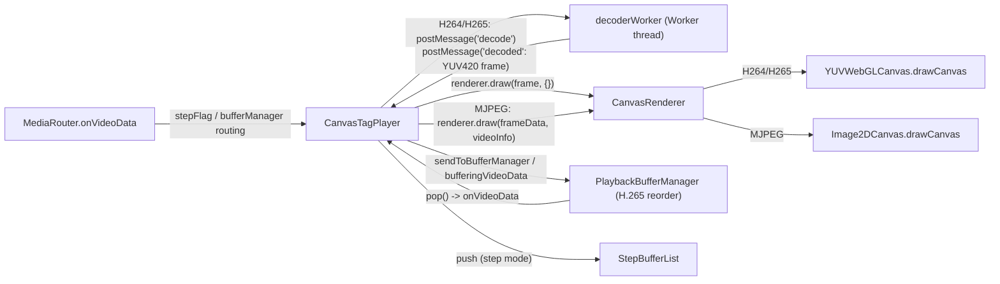
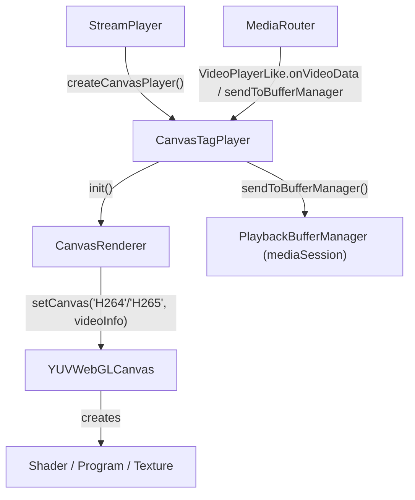
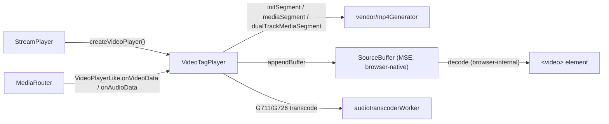
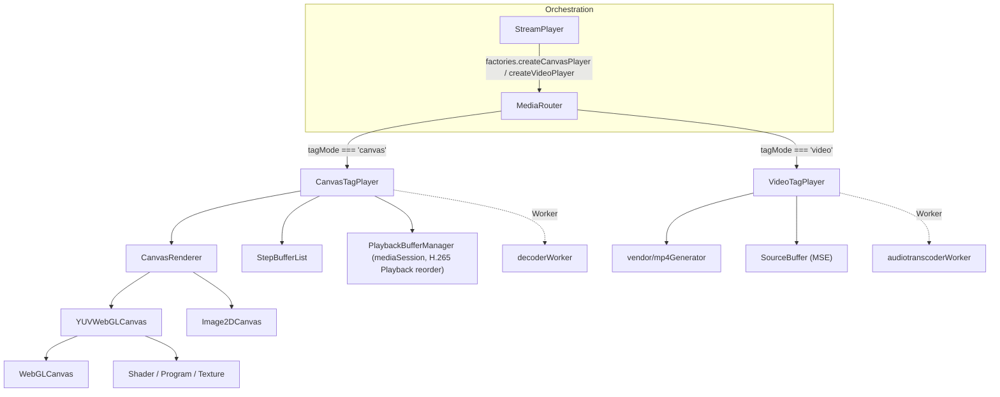

# 05. Video Player Rendering (`src/player/video/player`)

This document covers the rendering hierarchy that turns a decoded (or, for MJPEG, still-encoded
JPEG) video frame into visible pixels: the `VideoPlayer` abstract base and its two concrete
strategies — the canvas/WebGL pipeline (`CanvasTagPlayer` + `CanvasRenderer` + the `webgl/`
package) and the `<video>`-tag/MSE pipeline (`VideoTagPlayer`). Both are ports of the legacy
player's `Video/Player/*` sources; see [`src/player/README.md`](../../src/player/README.md#5-videoplayer--rendering-hierarchy)
for the one-page class-diagram summary this document expands on.

Collaborators documented elsewhere, referenced here by name only:
- **`MediaRouter`** (`mediaSession/MediaRouter.ts`) — the RTP/session-layer class that owns a
  `VideoPlayerLike` instance (`this.player`) and is the sole source of decoded/depacketized frame
  data flowing into this module.
- **`StreamPlayer`** (`interface/StreamPlayer.ts`) — the orchestration-layer class that supplies
  `MediaRouter`'s `createCanvasPlayer`/`createVideoPlayer` factories (`() => new CanvasTagPlayer()`,
  `() => new VideoTagPlayer()`).
- **`PlaybackBufferManager`** (`mediaSession/videoSession/PlaybackBufferManager.ts`) — the
  H.265-playback reordering buffer `CanvasTagPlayer` creates and drives; see §4/§5 relations below.
- **`H264Session`/`H265Session`/`MjpegSession`** (`mediaSession/videoSession/`) — upstream RTP
  depacketizers that produce the `VideoStreamData`/`VideoInfo` objects this module consumes.
- **`decoderWorker`** (`worker/videoDecoder/decoderWorker.ts`) — the Web Worker `CanvasTagPlayer`
  spawns to decode H264/H265 Annex-B NAL units into planar YUV420 frames off the main thread.
- **`CircularTypedArrayQueue`, `Median`, `Mean`, `IntervalTimer`, `Size`, `BrowserDetect`** (`util/`)
  — small standalone utilities consumed here; usage is described precisely below but their own
  implementations are documented in the `util/` reference.

## Class hierarchy

```mermaid
classDiagram
    class VideoPlayer {
        <<abstract>>
        +boxsize number
        +frameRate number
        +rfps number
        +audioshift number
        +speed number
        +init(element)
        +onVideoData(playMode, streamData, videoInfo)
        +play() pause() resume() stop() close()
        +onNetworkState(variance, mean)* abstract
        +onChangeAudioShift(v)* abstract
        +onChangeSpeed(v)* abstract
        +capture(fileName)* abstract
        +toggleControls(flags)* abstract
    }
    class CanvasTagPlayer
    class VideoTagPlayer
    class CanvasRenderer
    class Image2DCanvas
    class WebGLCanvas
    class YUVWebGLCanvas
    class Shader
    class Program
    class Texture
    class StepBufferList

    VideoPlayer <|-- CanvasTagPlayer
    VideoPlayer <|-- VideoTagPlayer

    CanvasTagPlayer --> CanvasRenderer : creates (init())
    CanvasTagPlayer --> StepBufferList : creates (init())
    CanvasTagPlayer ..> "decoderWorker (Worker)" : postMessage/onmessage

    CanvasRenderer --> YUVWebGLCanvas : creates (H264/H265)
    CanvasRenderer --> Image2DCanvas : creates (MJPEG)

    WebGLCanvas <|-- YUVWebGLCanvas
    WebGLCanvas --> Shader : creates
    WebGLCanvas --> Program : creates
    WebGLCanvas --> Texture : creates
    YUVWebGLCanvas --> Shader : creates (own scripts)
    YUVWebGLCanvas --> Program : creates (own scripts)
    YUVWebGLCanvas --> Texture : creates (Y/U/V)
```

`VideoTagPlayer` has **no** `CanvasRenderer`/WebGL dependency whatsoever — confirmed by reading the
whole file: its only non-`VideoPlayer` imports are `moment-timezone`, `file-saver`, the vendored
`mp4Generator`, and the small utils listed above (`VideoTagPlayer.ts:1-12`). It builds fragmented
MP4 directly and feeds it to a native `<video>` element via Media Source Extensions.

---

### `VideoPlayer` (`src/player/video/player/VideoPlayer.ts`)

- **Structure.** Abstract base class (`VideoPlayer.ts:46`). Plain fields: `boxsize`, `currentFrameCount`,
  `previousFrameCount`, `framedrop`, `type`, `frameRate`, `minRemainTime`, `minTimerInterval`,
  `maxdelay`, `currentdelay`, plus optional callbacks `errorCallback`/`eventStatisticsCallback`/
  `eventCaptureCallback`/`eventInstantPlaybackCallback` (`:47-69`). Backing-field-driven getter/setter
  pairs (real TS accessors, not plain fields) for `channelId`, `playmode`, `instantplayback`,
  `deviceType`, `codec`, `rfps`, `audioshift`, `speed` (`:81-175`) — ported from legacy's
  `Object.defineProperty` calls on `VideoPlayer`'s prototype so both subclasses inherit the exact
  same side effects. A private `fpsQueue = new CircularTypedArrayQueue<number>(5, true)` (`:79`)
  backs the `rfps` setter's network-state analysis. No constructor of its own (implicit default);
  never instantiated directly — only `CanvasTagPlayer`/`VideoTagPlayer` extend it.
  Inheritance: `VideoPlayer <<abstract>> <|-- CanvasTagPlayer, VideoTagPlayer`.

- **Method Analysis.**
  - `set rfps(v)` (`:125-157`) — the one method with real logic in this class. Pushes `v` into the
    5-slot `fpsQueue`; once full, computes `Median.variance(samples)` and buckets it into a
    `'poor' | 'fair' | 'good' | 'very_good' | 'excellent'` state string, reports it through
    `errorCallback` with `fromHex('0x1005')`, then calls the abstract `onNetworkState(variance, mean)`
    hook so each subclass can react (`CanvasTagPlayer` ignores it; `VideoTagPlayer` uses it to tune
    `networkWeight`, which feeds its MSE buffering delay).
  - `set audioshift(v)` / `set speed(v)` (`:163-175`) — call the abstract `onChangeAudioShift`/
    `onChangeSpeed` hooks *before* updating the backing field, so subclasses see the *previous*
    value via `this.audioshift`/`this.speed` while handling the change.
  - `init`, `onVideoData`, `onWaitingPackets`, `play`, `pause`, `resume`, `stop`, `close`,
    `clearBuffer`, `updateMiniMapInfo` (`:177-233`) — no-op defaults; every real subclass overrides
    them.
  - `addEventListener(event, callback)` (`:195-207`) — a 3-case switch (`statistics`/`capture`/
    `instantplayback`) storing the callback into the matching `event*Callback` field; not a real
    `EventTarget`, just a legacy-compatible dispatch table.
  - `setFrameRate`/`getFrameRate`, `setMaxInstantPlayback`/`getMaxInstantPlayback`,
    `setBufferClearInterval`/`getBufferClearInterval`, `setDefaultDelay`/`getDefaultDelay`,
    `setCurrentDelay`/`getCurrentDelay` (`:209-253`) — plain accessor pairs over the fields above.
  - `instantplaybackCmd({cmd})` (`:255-261`) — only handles `cmd === 'play'` (calls `this.play()`);
    both subclasses override this with a fuller command set.
  - `onNetworkState`, `onChangeAudioShift`, `onChangeSpeed`, `capture`, `toggleControls` (`:267-271`)
    — declared `abstract`. Legacy never defines a base implementation for these either (not even a
    log-only stub, unlike the no-op methods above); every real instance is one of the two
    subclasses, both of which implement all five, so the `abstract` keyword is a compile-time
    encoding of what was an implicit runtime contract in legacy.
  - Deliberately **not** declared here despite looking universal: `bufferingVideoData`,
    `sendToBufferManager`, `digitalZoom`, `controlStepPlay` — legacy's `videoTagPlayer` never
    defines these on its own prototype, so calling them on a real `VideoTagPlayer` throws
    `TypeError`. See `VideoTagPlayer`'s own section below.

- **Call Stack.** N/A directly — `VideoPlayer` itself never runs a frame through; see the
  `CanvasTagPlayer`/`VideoTagPlayer` sections.

- **RFC / Standard References.** None — pure internal state/lifecycle base class.

- **Relations & Data Flow.** `MediaRouter` talks to instances of this hierarchy only through the
  structural `VideoPlayerLike` interface (`mediaSession/MediaRouter.ts:136-176`), which both
  `CanvasTagPlayer` and `VideoTagPlayer` satisfy without formally implementing it in TypeScript —
  it exists purely for `MediaRouter`'s own typing of `this.player`.

---

### `CanvasTagPlayer` (`src/player/video/player/canvas/CanvasTagPlayer.ts`)

- **Structure.** Extends `VideoPlayer` (`CanvasTagPlayer.ts:60`). Fields: `renderer: CanvasRenderer
  | null`, `canvasElement: HTMLCanvasElement | null`, `rendererCheck` (resize-event dedup flag),
  `videoSizeCallback`/`timeStampCallback`, `decoderWorker: Worker | null`, `frameCount` (MJPEG
  frame-drop counter), `stepVideoList: StepBufferList | null`, `isStepPlaying`,
  `bufferManager: PlaybackBufferManager | null`, `mediaTimer` (1s FPS-stats interval),
  `checkedPlayer` (`:61-77`). Constructor takes an injectable `DecoderWorkerFactory` defaulting to
  `() => new Worker(new URL('.../decoderWorker.ts', import.meta.url))` (`:114-119`) — the same
  injectable-factory pattern used elsewhere in this codebase for browser-dependent APIs. A
  module-level `decoderCount` counter (`:42`) is passed to the worker as `setDecoderIndex` on each
  creation. Inheritance: `VideoPlayer <|-- CanvasTagPlayer`.

- **Method Analysis.**
  - `init(element)` (`:300-321`) — clones the caller's `<canvas>` element and replaces it in the
    DOM (so React/consumer re-renders don't fight with in-place canvas mutation), constructs a
    `CanvasRenderer`, wires its `channelId` and `capture` listener, calls `renderer.init(canvasElement)`,
    creates a fresh `StepBufferList`, registers a `webglcontextlost` handler
    (`onHandleContextLost`, reports error `0x0902`), and starts a 1s `setInterval` driving
    `onMediaTimer` (FPS/bandwidth statistics).
  - `checkPlayer(streamData, videoInfo, playMode)` (`:138-148`, private, idempotent via
    `checkedPlayer`) — for non-MJPEG codecs spawns the decoder worker (`createDecoderWorker`);
    always calls `renderer.setCanvas(codecType, videoInfo)` to lazily construct the right drawer.
  - `createDecoderWorker(codecType, videoInfo, playMode)` (`:121-136`) — creates the `Worker`,
    wires `onmessage → decoderWorkerMessage`, and posts a sequence of setup messages:
    `createDecoder`, `setOutputSize` (`w*h + w*h/4 + w*h/4` — exact YUV420 planar byte count),
    `setFrameRate`, `setDecoderIndex`, `useDropPacket`, `playMode`.
  - `onVideoData(playMode, streamData, videoInfo)` (`:335-390`, overrides `VideoPlayer`) — the
    per-frame entry point from `MediaRouter`/`PlaybackBufferManager`. Calls `checkPlayer`, then
    `checkFrameDrop` (MJPEG-only frame-skip logic driven by `videoInfo.dropOut`). For MJPEG:
    schedules `renderer.draw(frameData, videoInfo, callback)` via `setTimeout` with a
    size-tiered delay (`FRAME_SIZE.HD/FHD/UHD` thresholds → 200/160/120/80ms) that throttles
    decode-free JPEG blits to something screen-refresh-reasonable. For H264/H265: posts a
    `decode` message to `decoderWorker` carrying `frameData`, `frameType`, `width`/`height`,
    `cropWidth`/`cropHeight`, and `currentFps` (`this.rfps ?? this.getFrameRate()`).
  - `decoderWorkerMessage(event)` (`:164-256`, private) — the worker's `onmessage` handler; the
    core of the rendering pipeline for the coded path. `'decoded'` case (`:167-218`): increments
    `currentFrameCount`; bails if `renderer.userPaused && !isStepPlaying`; if a
    `PlaybackBufferManager` exists and doesn't need a restart, immediately pops the next buffered
    frame (`popNextFrame(true)`) to keep the pipeline moving; if the canvas element's current
    `width`/`height` matches the decoded frame's, calls `renderer.draw(data.frame, {})` (drawing
    the actual YUV buffer) and `resizeCheck`; otherwise it *resizes the canvas attributes instead
    of drawing* (first-frame / resolution-change bootstrapping). Forwards `data.time` to
    `timeStampCallback` for A/V-sync bookkeeping. `'notReady'` case: asks the buffer manager to
    retry via `front()` + a 500ms `setTimeout(() => popNextFrame(false), 500)`. `'lowPerformance'`
    case: reports error `0x090B` with decoder id/perf info. `'terminated'`: tears down the worker.
  - `bufferingVideoData`/`sendToBufferManager`/`controlStepPlay`/`digitalZoom` (`:394-416, 456-461,
    479-483`) — the four methods `VideoPlayer.ts` deliberately does *not* declare abstract because
    they're canvas-only. `sendToBufferManager` lazily creates the `PlaybackBufferManager` (H.265
    Playback reordering) and pushes into it; `bufferingVideoData` pushes into `StepBufferList`
    instead (frame-stepping mode). `digitalZoom` forwards into `CanvasRenderer.digitalZoom`, which
    (see below) is genuinely broken/dead in both legacy and this port.
  - `stepPlay(cmd)` / `forward()` / `backward()` (`:258-270, 463-471`) — drive `StepBufferList`
    forward/backward and re-invoke `onVideoData` with the retrieved node's data, or (on list
    exhaustion) call `renderer.renewCanvas()` for camera devices.
  - `play`/`pause`/`resume`/`stop` (`:431-454`) — toggle `renderer.userPaused` and, where
    applicable, pause/resume the `PlaybackBufferManager`.
  - `close()` (`:489-512`) — tears down the context-lost listener, the stats timer, the renderer
    (`renewCanvas` + `destroy`), posts `terminate` to the decoder worker, and drops the buffer
    manager reference.

- **Call Stack.** See the combined diagram in the "Relations & Data Flow" section below (H264/H265
  branch) — the decoder-worker round trip is the defining feature of this path versus
  `VideoTagPlayer`'s synchronous, worker-free muxing.

- **RFC / Standard References.** None of its own (orchestration only); the actual pixel-producing
  standard is WebGL, owned by `CanvasRenderer`'s `YUVWebGLCanvas` drawer (see below). MJPEG frames
  are plain JFIF/JPEG blitted via the 2D Canvas API (no external RFC — `Image2DCanvas` just calls
  `ctx.drawImage`).

- **Relations & Data Flow.** Created by `StreamPlayer`'s `createCanvasPlayer` factory
  (`() => new CanvasTagPlayer()`), selected by `MediaRouter.selectVideoPlayer()` when `tagMode ===
  'canvas'` (MJPEG always, small/step-play H264, H265 whenever the browser's `MediaSource` can't
  handle the negotiated codec profile, or NVR/oversized H264 falls to `video` instead — see
  `MediaRouter.ts:1308-1391`). `CanvasTagPlayer.init()` creates its own `CanvasRenderer` and
  `StepBufferList`; `sendToBufferManager()` lazily creates its own `PlaybackBufferManager`
  (documented under `mediaSession`) — matching the README's class diagram, which shows
  `CanvasTagPlayer --> PlaybackBufferManager : creates`.



---

### `CanvasRenderer` (`src/player/video/player/canvas/CanvasRenderer.ts`)

- **Structure.** Two classes in this file: the exported `CanvasRenderer` (`:69-272`) and a private,
  un-exported `Image2DCanvas` (`:24-48`) used only for the MJPEG drawer. `CanvasRenderer` fields:
  `userPaused`, `channelId`, `eventCaptureCallback`, private `canvasElement`, `drawer: Drawer | null`
  (`Drawer = YUVWebGLCanvas | Image2DCanvas`), `mapDrawer` (minimap's own drawer instance),
  `codecType`, `captureFlag`, `captureframeData`, `fileName`, `size: Size | null`, `minimapInfo`.
  Constructor takes an injectable `saveAsFn` defaulting to `file-saver`'s real `saveAs` (`:87`).
  `Image2DCanvas` wraps a `CanvasRenderingContext2D`; `drawCanvas(image)` resizes the canvas to the
  image's dimensions and calls `ctx.drawImage`; `initCanvas()` clears the canvas rect.
  Note (preserved from legacy, documented in the source comment at `:55-67`): `channelId`/
  `userPaused` are plain data properties, not accessors, despite legacy declaring them via
  `Object.defineProperty` — the outer legacy factory function discarded its own `this` by
  `return`-ing a different object, so those accessor definitions never actually attached.

- **Method Analysis.**
  - `setCanvas(codec, videoInfo)` (`:150-174`) — lazily (once; guarded by `drawer === null`)
    constructs `this.size = new Size(videoInfo.width, videoInfo.height)` and, per `codec`,
    instantiates `YUVWebGLCanvas` (via `canvasElement.getContext('webgl')`) for `H264`/`H265`, or
    `Image2DCanvas` (via `getContext('2d')`) for `MJPEG`.
  - `draw(frameData, videoInfo, callback)` (`:185-201`) — the public per-frame entry point. For
    MJPEG: builds an `HTMLImageElement`, sets `image.src` to an object URL over
    `new Blob([frameData.buffer])`, and on `image.onload` calls `drawCanvas(image)`, revokes the
    object URL, and invokes `callback`. For coded video: calls `drawCanvas(frameData)` directly
    (already-decoded YUV buffer, no image decode needed) and stashes `frameData` as
    `captureframeData` for a possible paused-state capture.
  - `drawCanvas(data)` (`:113-135`, private) — duck-types `drawer.drawCanvas(data)` across both
    possible drawer types (a `Uint8Array` for `YUVWebGLCanvas`, an `HTMLImageElement` for
    `Image2DCanvas` — they're unrelated classes, not siblings under a shared interface; the cast
    just gives TypeScript one call signature). Marks `canvasElement.updatedCanvas = true`,
    triggers `download()` if a capture was requested, and mirrors the draw into `mapDrawer` for
    the minimap if one is active and flagged for update.
  - `capture(name)` (`:176-183`) — sets `captureFlag`/`fileName`; if the renderer is currently
    paused and a last frame is cached, draws it immediately (so "capture while paused" doesn't
    need a new frame to arrive).
  - `download()` (`:89-111`, private) — `canvas.toBlob()` then either `saveAsFn(blob, fileName +
    '.png')` (direct file save) or, if no filename was given, invokes `eventCaptureCallback` with
    `{channelId, blob}` (in-memory capture, e.g. for programmatic snapshotting) — throwing
    `RTSPOverWebSocketError(0x0909)` if neither is available.
  - `digitalZoom(bufferData)` (`:214-218`) — calls `drawer.updateVertexArray(bufferData)` via an
    unsafe cast. **Confirmed dead/broken**: `updateVertexArray` is commented out on both
    `WebGLCanvas`'s and `YUVWebGLCanvas`'s prototypes in legacy, and `Image2DCanvas` never defined
    it either — every call throws `TypeError: drawer.updateVertexArray is not a function`. Kept
    as-is per this repo's fidelity-to-legacy convention rather than silently "fixed."
  - `updateMinimapInfo({mode, target})` (`:234-263`) — lazily creates `mapDrawer` (same
    `YUVWebGLCanvas`/`Image2DCanvas` choice as the main drawer) sized off `target`'s `width`/
    `height` attributes on first `'on'`/target-bearing call; `'draw'` flags `minimapInfo.isUpdate`
    for the next `drawCanvas`; `'off'` tears the minimap drawer down.
  - `destroy()` (`:220-232`) — `initCanvas()` + `destroy()` on both `drawer` and `mapDrawer`, then
    nulls everything.

- **Call Stack.** See `CanvasTagPlayer`'s diagram above — `CanvasRenderer.draw`/`drawCanvas` is the
  midpoint between the decoder worker (or the MJPEG `Image` decode) and the WebGL/2D drawer.

- **RFC / Standard References.** No standard of its own; delegates to WebGL (via `YUVWebGLCanvas`)
  or the Canvas 2D API (via `Image2DCanvas`, itself just wrapping browser-native JPEG decoding
  through ``/`Blob` — no explicit JPEG spec handling in this code).

- **Relations & Data Flow.** Created exactly once per `CanvasTagPlayer.init()` call
  (`CanvasTagPlayer.ts:312`); owns the `drawer`/`mapDrawer` `YUVWebGLCanvas`/`Image2DCanvas`
  instances it lazily constructs in `setCanvas`/`updateMinimapInfo`.

---

### `StepBufferList` (`src/player/video/player/canvas/StepBufferList.ts`)

- **Structure.** Standalone class (`:33-132`), **not** a subclass of any `BufferList` type despite
  the legacy source grafting these methods onto one via `inheritObject` — the source comment
  (`:18-32`) explains `push`'s signature and internal array-based storage are incompatible with
  `BufferList`'s linked-list `push(buffer)`, and no `BufferList` method is ever called on a real
  instance, so this port makes it a genuinely standalone class instead of a fake subclass. Fields:
  `bufferingLength` (auto-tuned, default/max `240`, min `6` — `DEFAULT_BUFFERING_LENGTH`/
  `MAX_BUFFERING_LENGTH`/`MIN_BUFFERING_LENGTH`), `listLength`, `curIndex`, and the backing
  `stepList: StepBufferNode[]` array. `StepBufferNode = {playMode, streamData, videoInfo}`.

- **Method Analysis.** Pure internal ring/array buffer — no external standard. `push(playMode,
  streamData, videoInfo)` (`:45-63`) — on the *second* pushed item, auto-tunes
  `bufferingLength = videoInfo.framerate * 4` via `setBufferingLength` (clamped to
  `[MIN_BUFFERING_LENGTH, MAX_BUFFERING_LENGTH]`); appends a node (deep-copying `frameData` into a
  fresh `Uint8Array` so later mutation of the source buffer can't corrupt buffered history) while
  under `bufferingLength`; returns whether the caller may keep pushing (`false` once full) — note
  the code comment at `:57-61` explaining why the return expression is written as
  `length >= bufferingLength ? false : true` rather than the seemingly-equivalent `<` form: they
  diverge under `NaN` (a possible `bufferingLength` if `videoInfo.framerate` was missing), and the
  `>=`-based form is what legacy actually used. `forward()`/`backward()` (`:65-85`) — step
  `curIndex` and return the node at the new position; `backward()` additionally *skips* forward
  through non-keyframes, only returning on an I-frame or MJPEG node (frame-accurate step-back needs
  a decodable start point); both call `clear()` (reset to empty) when they run off either end.
  `searchTimestamp(frameTimestamp)` (`:87-101`) — linear scan for an exact
  `timestamp`/`timestamp_usec` match, or the first node whose timestamp exceeds the target,
  positioning `curIndex` there. `findIFrame(cmd)` (`:103-118`) — walks `curIndex` forward/backward
  from its current position until it lands on a `frameType === 'I'` node. `bufferClear()` (`:129-131`)
  — public wrapper over the private `clear()`.

- **Call Stack.** Driven entirely by `CanvasTagPlayer`'s step-play controls: `bufferingVideoData`
  pushes, `controlStepPlay` calls `searchTimestamp` then `findIFrame`, `forward`/`backward` call
  the matching `StepBufferList` method and feed the result back into `onVideoData` (see
  `CanvasTagPlayer.stepPlay`, `:258-270`).

- **RFC / Standard References.** None — pure internal buffering/indexing logic, no external
  standard basis.

- **Relations & Data Flow.** Created once per `CanvasTagPlayer.init()` (`:316`); the only consumer
  anywhere in the codebase is `CanvasTagPlayer` (confirmed via grep). Matches the README's
  `CanvasTagPlayer --> StepBufferList : creates`.

---

## `webgl/` — WebGL rendering primitives

### `Shader` (`src/player/video/player/canvas/webgl/GLPrimitives.ts`)

- **Structure.** `GLPrimitives.ts` also exports the `ShaderScript` interface and two free
  functions used across the WebGL classes: `createShaderScript(type, source): ShaderScript`
  (`:15-17`, a trivial object literal constructor) and `glAssert`/`glError` (`:20-29`, a
  log-only "assert" — never throws, just `console.error` + `console.trace`, matching legacy's
  `window.assert`/`window.error`). `Shader` itself (`:31-57`) holds `gl: WebGLRenderingContext`
  and `shader: WebGLShader | null`.
- **Method Analysis.** Constructor (`:35-52`) — dispatches on `script.type`
  (`'x-shader/x-fragment'` → `gl.createShader(gl.FRAGMENT_SHADER)`, `'x-shader/x-vertex'` →
  `gl.createShader(gl.VERTEX_SHADER)`, anything else → `glError` and early return), then
  `gl.shaderSource` + `gl.compileShader`, checking `gl.COMPILE_STATUS` and routing failures through
  `glError` with `gl.getShaderInfoLog`. `destroy()` (`:54-56`) calls `gl.deleteShader`.
  `Script.createFromElementId` and `ImageTexture` from the legacy source were dropped entirely —
  grep across the legacy tree confirmed neither is ever called (source comment `:3-9`).

### `Program` (`src/player/video/player/canvas/webgl/GLPrimitives.ts`)

- **Structure.** `:59-93`. Holds `gl` and `program: WebGLProgram | null` (created in the
  constructor via `gl.createProgram()`, `:63-66`).
- **Method Analysis.** `attach(shader)` (`:68-70`) — `gl.attachShader`. `link()` (`:72-75`) —
  `gl.linkProgram` then `glAssert(gl.getProgramParameter(..., LINK_STATUS), ...)`. `use()`
  (`:77-79`) — `gl.useProgram`. `getAttributeLocation(name)` (`:81-83`) — thin wrapper over
  `gl.getAttribLocation`, used by both `WebGLCanvas` and `YUVWebGLCanvas` to resolve
  `aVertexPosition`/`aTextureCoord`. `setMatrixUniform(name, array)` (`:85-88`) — resolves the
  uniform location and calls `gl.uniformMatrix4fv`; the only uniform ever set this way is
  `uMVMatrix` (always the identity matrix in practice — see `WebGLCanvas`'s `mvMatrix` note below).
  `destroy()` (`:90-92`) — `gl.deleteProgram`.

### `Texture` (`src/player/video/player/canvas/webgl/GLPrimitives.ts`)

- **Structure.** `:100-147`. Holds `gl`, `size: Size`, `texture: WebGLTexture | null`, `format:
  number` (defaults to `gl.LUMINANCE` — the format `YUVWebGLCanvas` relies on for its 8-bit
  single-channel Y/U/V planes). A module-level `textureIDs` array (`:98`, lazily filled with
  `[TEXTURE0, TEXTURE1, TEXTURE2]`) is shared across every `Texture` instance — harmless since
  those enum values are identical on any `WebGLRenderingContext`.
- **Method Analysis.** Constructor (`:106-117`) — `gl.createTexture()`, binds it, calls
  `gl.texImage2D(..., size.w, size.h, ..., format, UNSIGNED_BYTE, null)` to allocate storage with
  no initial data, and sets `NEAREST` mag/min filtering with `CLAMP_TO_EDGE` wrapping (no mipmaps,
  no filtering artifacts at plane edges — appropriate for exact per-pixel YUV sampling).
  `fill(textureData, useTexSubImage2D?)` (`:119-132`) — the actual per-frame upload: asserts the
  supplied buffer is at least `w*h` bytes, then either `gl.texSubImage2D` (in-place update, used
  when `useTexSubImage2D` is explicitly requested — not the default anywhere in this codebase) or
  `gl.texImage2D` (full re-specification; the code comment notes this benchmarked faster and is
  kept as the default). `bind(n, program, name)` (`:134-142`) — `gl.activeTexture(textureIDs[n])`,
  binds the texture, and sets the named sampler uniform on `program` to unit `n` via
  `gl.uniform1i`. `destroy()` (`:144-146`) — `gl.deleteTexture`.

- **Call Stack (Shader/Program/Texture, combined).** Compiled/linked once at `WebGLCanvas`/
  `YUVWebGLCanvas` construction time (`onInitShaders`/`onInitTextures`); `Texture.fill` +
  `WebGLCanvas.drawScene` run on every decoded frame. See the "Rendering pipeline" call stack under
  `YUVWebGLCanvas` below.

- **RFC / Standard References.** WebGL (Khronos/W3C WebGL 1.0 specification, built on OpenGL ES
  2.0 shader semantics — GLSL ES 1.00 for the shader sources compiled here).

- **Relations & Data Flow.** Both `WebGLCanvas` and `YUVWebGLCanvas` depend directly on all three
  (`WebGLCanvas --> Shader/Program/Texture : creates`); `YUVWebGLCanvas` additionally holds three
  private `Texture` instances (`YTexture`/`UTexture`/`VTexture`) instead of `WebGLCanvas`'s single
  `texture`.

---

### `WebGLCanvas` (`src/player/video/player/canvas/webgl/WebGLCanvas.ts`)

- **Structure.** `:54-267`. Fields: `canvas`, `size: Size`, `gl`, plus protected rendering state:
  `glNames` (reverse-lookup table of every numeric `WebGLRenderingContext` constant, built once for
  error-code-to-name translation), `vertexShader`/`fragmentShader: Shader`, `program: Program`,
  `texture: Texture`, `vertexPositionAttribute`/`textureCoordAttribute` (attribute locations),
  `quadVPBuffer`/`quadVTCBuffer` (vertex-position / texture-coordinate `WebGLBuffer`s for a
  full-viewport quad), optional `framebuffer`/`framebufferTexture`/`renderbuffer` (only allocated
  if `useFrameBuffer` is passed — no call site in this codebase passes `true`), and a private
  `mvMatrix: Float32Array` always set to a compile-time-constant 4×4 identity matrix
  (`IDENTITY_MATRIX_4X4`, `:40`) — the code comment notes legacy's real Sylvester-matrix math
  (`mvMultiply`/`mvTranslate`/`zoomScene`) is dead/commented-out in the source itself, so only the
  identity case is ever reachable. Ships its own generic pass-through vertex/fragment shader pair
  (`VERTEX_SHADER_SCRIPT`/`FRAGMENT_SHADER_SCRIPT`, `:9-33`) that just samples a single `texture`
  uniform unmodified — this is what a *non*-YUV `WebGLCanvas` would render, though in this codebase
  only `YUVWebGLCanvas` (which overrides the shaders entirely) is ever actually constructed
  (`CanvasRenderer.setCanvas` only ever builds `YUVWebGLCanvas`, never a bare `WebGLCanvas`).
  `onInitWebGL`/`onInitShaders`/`onInitTextures`/`onInitSceneTextures` are real (non-arrow) instance
  methods specifically so the constructor's calls into them dispatch to a subclass override even
  mid-construction (`:44-53`) — this is exactly how `YUVWebGLCanvas` replaces the shader/texture
  setup without needing its own constructor logic beyond calling `super()`.
  Inheritance: `WebGLCanvas <|-- YUVWebGLCanvas`.

- **Method Analysis (rendering pipeline).**
  - **Constructor** (`:73-88`) — sets `canvas.width`/`height` from `size.viewWidth`/`viewHeight`
    (falling back to `size.w`/`size.h`), then runs the fixed setup sequence:
    `onInitWebGL()` → `onInitShaders()` → `initBuffers()` → (optionally `initFramebuffer()`) →
    `onInitTextures()` → `initScene()`.
  - `onInitWebGL()` (`:181-195`) — warns via `glError` if `gl` is falsy; builds `glNames` (numeric
    GL constant → name) once, by iterating every enumerable property of `gl` and keeping the
    numeric ones — used later by `checkLastError` to print human-readable WebGL error names.
  - `onInitShaders()` (`:197-210`) — compiles the base pass-through vertex+fragment `Shader`s,
    creates a `Program`, `attach`es both, `link()`s and `use()`s it, then resolves and
    `enableVertexAttribArray`s `aVertexPosition`/`aTextureCoord`. **`YUVWebGLCanvas` fully
    overrides this** with its own three-texture YUV→RGB shader pair (see below).
  - `initBuffers()` (`:107-125`, private) — allocates `quadVPBuffer` with 4 vertex positions
    forming a full-viewport `TRIANGLE_STRIP` quad (`[1,1,0, -1,1,0, 1,-1,0, -1,-1,0]`) and
    `quadVTCBuffer` with matching texture coordinates; includes an Edge-browser-specific
    `scaleX` correction (via `browserDetect()`) to avoid a gray edge line when canvas width isn't
    exactly divisible by the source width.
  - `onInitTextures()` (`:212-216`) — sets the GL viewport to the canvas's actual pixel size and
    allocates a single RGBA `Texture` sized to `this.size`. **Overridden entirely by
    `YUVWebGLCanvas`** (three `LUMINANCE` textures instead — see below).
  - `initScene()` (`:135-148`, private) — binds `quadVPBuffer`/`quadVTCBuffer` to the vertex
    position/texture-coordinate attributes via `gl.vertexAttribPointer`, calls
    `onInitSceneTextures()` (binds the texture(s) to their sampler uniform(s) — subclass-overridable),
    uploads the (always-identity) MV matrix uniform, and binds the optional framebuffer if one was
    requested.
  - `drawScene()` (`:222-224`) — the actual draw call: `gl.drawArrays(gl.TRIANGLE_STRIP, 0, 4)`,
    rasterizing the quad with whatever texture(s) are currently bound — this is what actually
    paints the previously-`fill()`ed texture data onto the canvas each frame.
  - `checkLastError(operation?)` (`:154-179`) — polls `gl.getError()`, translates it through
    `glNames`, and logs; throws a `ReferenceError` for genuinely unknown error codes (preserved
    legacy quirk referencing an undeclared global — effectively unreachable with a real
    `WebGLRenderingContext`, kept for fidelity per the source comment `:163-170`).
  - `readPixels(buffer)` (`:226-229`) — `gl.readPixels` into a caller-supplied buffer (RGBA); not
    called anywhere in this module's own code (available for external tooling/testing).
  - `destroy()` (`:231-266`) — deletes the framebuffer/renderbuffer/buffers, destroys both shaders,
    the (optional) framebuffer texture, the texture, and the program; shrinks the underlying
    `gl.canvas` to `1×1` (releases GPU memory eagerly) before nulling every field.

- **Call Stack.** See `YUVWebGLCanvas`'s combined pipeline diagram below — `WebGLCanvas` supplies
  the shared quad/attribute/uniform machinery that every draw call runs through, but `YUVWebGLCanvas`
  is the class actually instantiated for real video and the one whose overrides matter for the
  per-frame path.

- **RFC / Standard References.** WebGL 1.0 (Khronos/W3C specification; GLSL ES 1.00 shading
  language).

- **Relations & Data Flow.** Base class for `YUVWebGLCanvas`; not directly instantiated by
  anything in this codebase (`CanvasRenderer.setCanvas` only ever builds the subclass). Depends on
  `Shader`/`Program`/`Texture` from `GLPrimitives.ts` and `Size`/`browserDetect` from `util/`.

---

### `YUVWebGLCanvas` (`src/player/video/player/canvas/webgl/YUVWebGLCanvas.ts`)

- **Structure.** `:45-132`. Extends `WebGLCanvas`. Adds three protected `Texture` fields —
  `YTexture`, `UTexture`, `VTexture` — deliberately declared **without** a `= null` initializer
  (using the `!` definite-assignment marker) because subclass field initializers run *after*
  `super()` returns, which would otherwise stomp the values `onInitTextures()` (invoked *during*
  `super()`'s constructor execution, dispatching to this class's override) already assigned
  (source comment `:46-50`). Ships its own shader pair (`:5-38`): the vertex shader is identical to
  `WebGLCanvas`'s; the fragment shader is the real YUV→RGB specialization — see below. This is the
  only concrete `WebGLCanvas` subclass, and the only WebGL drawer `CanvasRenderer` ever constructs
  (for `H264`/`H265`). Inheritance: `WebGLCanvas <|-- YUVWebGLCanvas`.

- **Method Analysis — the actual rendering pipeline.**
  - **YUV→RGB conversion approach**: entirely in the fragment shader (`:19-38`), via a hardcoded
    `mat4 YUV2RGB` (BT.601-style coefficients: `1.16438, 0, 1.59603, -.87079` / `1.16438, -.39176,
    -.81297, .52959` / `1.16438, 2.01723, 0, -1.08139` / `0,0,0,1`) multiplying the vector
    `(Y, U, V, 1)` sampled independently from three separate `sampler2D` uniforms (`YTexture`,
    `UTexture`, `VTexture`) — i.e. **no** CPU-side color conversion; every pixel's YUV→RGB math
    runs on the GPU, once per fragment, in parallel.
  - `onInitShaders()` (override, `:59-72`) — same structure as the base class's but compiles
    *this* file's three-texture shader pair instead of the base pass-through one.
  - `onInitTextures()` (override, `:74-85`) — allocates `YTexture` at full `this.size` (luma
    plane, one byte per pixel) and `UTexture`/`VTexture` at `this.size.getHalfSize()` (chroma
    planes at half width and half height each) — the standard **4:2:0 planar** subsampling layout.
    All three default to `Texture`'s `LUMINANCE` format (single 8-bit channel).
  - `onInitSceneTextures()` (override, `:87-91`) — binds `YTexture`/`UTexture`/`VTexture` to
    texture units 0/1/2 under the sampler uniform names `YTexture`/`UTexture`/`VTexture`
    respectively (matching the fragment shader's uniform names).
  - `drawCanvas(bufferData)` (`:99-106`) — **the per-frame entry point**, called by
    `CanvasRenderer.drawCanvas()`. Computes `lumaSize = w*h` and `chromaSize = lumaSize >> 2`
    (quarter size — consistent with 4:2:0's half-width×half-height chroma planes), then slices
    the single incoming `Uint8Array` into three contiguous regions — `[0, lumaSize)` for Y,
    `[lumaSize, lumaSize+chromaSize)` for U, `[lumaSize+chromaSize, lumaSize+2*chromaSize)` for V
    — uploading each via `Texture.fill` (`gl.texImage2D`), then calls `drawScene()` to issue the
    actual `gl.drawArrays` draw call. This confirms the decoder worker hands back one flat planar
    I420/YUV420P buffer (Y plane followed by U then V), not three separate arrays.
  - `fillYUVTextures(y, u, v)` (`:93-97`) — a three-separate-array variant of the same upload.
    **Confirmed dead code** (grep across the whole `src/player` tree finds no call site anywhere)
    — `drawCanvas`'s single-buffer-slicing form is what's actually used; this method is a legacy
    leftover kept for API-surface fidelity.
  - `initCanvas()` (`:112-115`) — `gl.clear(DEPTH_BUFFER_BIT | COLOR_BUFFER_BIT)`, used to blank
    the canvas (e.g. on step-play list exhaustion, or before `destroy()`).
  - `destroy()` (override, `:117-131`) — destroys all three YUV textures before delegating to
    `super.destroy()` for the shared buffer/program/shader teardown.

- **Call Stack.**

```mermaid
sequenceDiagram
    participant DW as decoderWorker
    participant CTP as CanvasTagPlayer
    participant CR as CanvasRenderer
    participant YUV as YUVWebGLCanvas
    participant TEX as Texture (x3)
    participant GL as WebGLRenderingContext

    DW->>CTP: postMessage({type:'decoded', data:{frame: Uint8Array YUV420, width, height}})
    CTP->>CTP: decoderWorkerMessage('decoded')
    CTP->>CR: renderer.draw(frame, {})
    CR->>CR: drawCanvas(frame)
    CR->>YUV: drawer.drawCanvas(frame)
    YUV->>YUV: slice frame into Y/U/V subarrays
    YUV->>TEX: YTexture.fill(Y) / UTexture.fill(U) / VTexture.fill(V)
    TEX->>GL: gl.texImage2D(...) per plane
    YUV->>YUV: drawScene()
    YUV->>GL: gl.drawArrays(TRIANGLE_STRIP, 0, 4)
    GL-->>GL: fragment shader samples Y/U/V, applies YUV2RGB matrix, rasterizes quad
    Note over GL: visible pixels on the &lt;canvas&gt; element
```

- **RFC / Standard References.** WebGL 1.0 / GLSL ES 1.00 (Khronos/W3C). The YUV→RGB matrix
  implements the standard BT.601 (ITU-R BT.601) full-range-ish conversion coefficients commonly
  used for SD/consumer video — no formal citation in-source, but the coefficient pattern matches
  the well-known BT.601 Y'CbCr→RGB conversion.

- **Relations & Data Flow.** Created exclusively by `CanvasRenderer.setCanvas()` for `H264`/`H265`
  codec types (`CanvasRenderer.ts:157-161`), and again for the minimap drawer in
  `updateMinimapInfo` (`CanvasRenderer.ts:249`). Never constructed anywhere else. Matches the
  README's `CanvasRenderer --> YUVWebGLCanvas : creates` and `WebGLCanvas <|-- YUVWebGLCanvas`.



---

### `VideoTagPlayer` (`src/player/video/player/video/VideoTagPlayer.ts`)

- **Structure.** `:127-2219`. The largest, most stateful class in this subsystem — a `<video>`
  element driven entirely by Media Source Extensions, fed fragmented-MP4 (fMP4) segments built on
  the fly from RTP-depacketized H264/H265 video and AAC/OPUS/G711/G726 audio, with A/V sync driven
  by `VTTCue` text-track entries carrying JSON timestamps. Extends `VideoPlayer`; kept as one
  cohesive class (matching legacy's single closure) rather than split up, since nearly every method
  reads/writes the same ~50 shared fields. Key field groups:
  - **MSE plumbing**: `videoElement`, `mediaSource: MediaSource | null`, `sourceBuffer: SourceBuffer
    | null`, `sourceBufferAudioIsOpus` (tracks what codec string the `SourceBuffer` was actually
    created with, since MSE forbids changing it later).
  - **fMP4 muxing state**: `segmentArray: Uint8Array[]` (pending, not-yet-appended segments),
    `sequenseNum`, `videoSamples`/`audioSamples` (pending per-track sample queues), `baseVideoTime`/
    `baseAudioTime`/`baseNTPTimestamp` (decode-time bases), `boxStartTime`, `lastBoxSize`,
    `audioInfo: Mp4AudioTrackInfo`, `videoInfoBox: Mp4VideoTrackInfo | null`, `dummyAudio`,
    `realAacActive`/`opusActive` (which real audio codec is currently muxed).
  - **Timing/statistics**: `bufferedFrameCount`, `defaultDelay`/`delay` (browser-tiered — Chrome/
    Windows, Safari/Mac ≥10.13, and a generic-other bucket each get different
    `*_DEFAULT_FRAME_BUFFER_COUNT`/`*_DEFAULT_DELAY_TIME` constants, chosen in the constructor via
    `getBrowserInfo()`), `statisticsTimer: IntervalTimer | null`, `decodedMean`/`videoMean`/
    `dropMean: Mean`, `videoTimestampIntervalQueue: CircularTypedArrayQueue<number>`.
  - **Workers**: `audiotranscoderWorker: Worker | null` — spawned unconditionally in the
    constructor (`:298-299`) via an injectable `AudiotranscoderWorkerFactory`, used to transcode
    G711/G726 audio to AAC in-browser (Opus and real AAC need no transcode).
  - No `CanvasRenderer`/WebGL/GL-primitive fields anywhere — confirmed by reading the whole file;
    its only rendering surface is the native `<video>` element itself.
  Inheritance: `VideoPlayer <|-- VideoTagPlayer`.

- **Method Analysis — fMP4 muxing / MSE pipeline.**
  - **Constructor** (`:266-300`) — calls `super()`, sets `this.rfps = 30`/`this.boxsize = 1`,
    inspects `getBrowserInfo()` to select buffering constants (throwing `RTSPOverWebSocketError
    0x090D` for unsupported old-Safari/OSX-10.7 combinations), and eagerly spawns the audio
    transcoder worker with its `onmessage → audiotranscoderWorkerMessage`.
  - `init(element)` (`:1681-1704`) — registers a `beforeunload` handler that flushes the
    `MediaSource` via `endOfStream()` before calling `close()`; sets `background_img` (loading
    spinner asset, jQuery-detection-adjusted); calls `elementSetting()` (wires the full
    `<video>` event-listener set — `playing`/`pause`/`canplay`/`waiting`/`seeking`/`seeked`/
    `timeupdate`/etc., `:302-311`) and `createMediaSource()` (constructs a `new MediaSource()`,
    assigns it to `videoElement.src` via `URL.createObjectURL`, and listens for `sourceopen`).
  - `mediaSourceEventListener('sourceopen')` (`:327-340`) → `setSourceBuffer()` (`:1376-1398`) —
    on first call, builds the MIME/codecs string
    `video/mp4;codecs="${videoCodecInfo}, ${opusActive ? 'opus' : 'mp4a.40.2'}"`, checks
    `MediaSource.isTypeSupported`, and calls `mediaSource.addSourceBuffer(mimeCodec)` — this is
    the point the browser is told exactly which H264/H265 profile+level and which audio codec to
    expect for the entire session (audio codec can only be declared once, see `sourceBufferAudioIsOpus`).
  - `onVideoData(playMode, streamData, videoInfo)` (`:1706-1731`, overrides `VideoPlayer`) — the
    per-video-frame entry point. On the first `I`-frame of a session, captures `videoCodecInfo`,
    calls `setVideoInfo()` (builds the `Mp4VideoTrackInfo` box descriptor — width/height with a
    crop-correction heuristic for non-16-aligned resolutions, `:2132-2175`, plus SPS/PPS or
    VPS/PTL for H264/H265 respectively), `initBaseNTPTimestamp()`, and `createInitSegment()`
    (calls the vendored `initSegment([videoInfoBox, audioInfo])` to build the fMP4 `ftyp+moov`
    initialization segment, then immediately tries to append it). Every call then runs
    `createVideoSample()`.
  - `createVideoSample(streamData, videoInfo)` (`:1083-1120`) — builds a `VideoSample`
    (NAL-length-prefixed via `createSampleFrameData`/`setNalLength`, which rewrites Annex-B
    start-codes into 4-byte big-endian length prefixes — the AVCC/HVCC format fMP4 requires
    instead of raw Annex-B). Live mode: computes `frameDuration` via `getVideoFrameDuration()`
    (RTP-timestamp-delta-based, with `Median`-based jitter smoothing — see below), feeds a
    dummy-audio generator if no real audio track is active yet (`makeDummyAudio` — MSE requires an
    audio track sample cadence even with no real audio, to avoid buffering stalls), and once
    `boxsize` samples have accumulated, calls `createVideoSegment(boxsize)`. Playback mode: pushes
    unconditionally and, on each I-frame boundary once there's more than one buffered sample,
    calls `createSegment()` (a combined video+audio segment).
  - `createVideoSegment`/`createAudioSegment`/`createSegment` (`:1225-1344`) — splice the pending
    sample queue(s), build an `Mp4BoxInfo` (`id`, `samples`, `baseMediaDecodeTime`, `type`), flatten
    the samples' frame data via `createFrameDataBuffer` (single-`memcpy`-equivalent concatenation
    when >1 sample), update the `VTTCue` timestamp text track (`updateVideoTimestamp`/
    `updateAudioTimestamp`) for A/V-sync consumers, then call the vendored `mediaSegment(seqNum,
    [boxInfo], frameDataBuffer)` (single-track) or `dualTrackMediaSegment(seqNum, [videoBoxInfo,
    audioBoxInfo], [videoBuf, audioBuf])` (`createSegment`, both tracks in one `moof+mdat` — used
    in Playback mode to keep video/audio segments atomically paired) to build the actual `moof`+
    `mdat` fragment, pushing the result onto `segmentArray` and calling
    `appendSegmentToSourceBuffer()`.
  - `appendSegmentToSourceBuffer()` (`:1346-1374`) — the MSE append itself: no-ops if the
    `SourceBuffer` doesn't exist or is mid-update (`sourceBuffer.updating`); on empty queue, calls
    `mediaSource.endOfStream()` if the stream is flagged to end; otherwise shifts one segment off
    the queue and calls `sourceBuffer.appendBuffer(segment)`, wrapping append failures into
    `RTSPOverWebSocketError(0x030A)`.
  - `sourceBufferEventListener('updateend')` (`:350-359`) — drains any pending `clearBufferFlag`
    (removes everything from `0` to the buffered end via `sourceBuffer.remove()`) then calls
    `appendSegmentToSourceBuffer()` again — this is what actually keeps the segment queue draining,
    since MSE only allows one `appendBuffer` in flight at a time.
  - `videoUpdating()` (`:1497-1590`, triggered from `onDurationChange`) — the live-edge/latency
    controller: reads `sourceBuffer.buffered`'s start/end, computes `latency = endTime -
    currentTime`, and nudges `videoElement.currentTime` forward (skipping ahead) when latency
    exceeds `this.delay`, or backs off `bufferedFrameCount` when latency is comfortably low —
    effectively an adaptive jitter buffer implemented via `<video>` seeking rather than an actual
    audio/video decoder queue. Also calls `checkBufferSize()` (`:1475-1495`) to `sourceBuffer.remove()`
    old buffered ranges once they exceed `getMaxInstantPlayback()`, capping MSE buffer growth.
  - **Framerate/network estimation utils** — `getVideoFrameDuration()` (`:995-1075`) pushes each
    inter-frame RTP-timestamp delta into `videoTimestampIntervalQueue` (a 10-slot
    `CircularTypedArrayQueue<number>`) and uses `Median.mean`/`Median.median`/`Median.variance`/
    `Median.findRangeAndCoefficient` both for a `'timestamp'` statistics event and to detect+smooth
    jittery timestamps (`VIDEO_MAX_VARIANCE_VALUE` threshold triggers substituting the queue's mean
    delta for a wild single-sample outlier). `onNetworkState(variance, mean)` (`:2031-2045`,
    called from the inherited `rfps` setter's own `Median.variance` computation) tunes
    `networkWeight`, which directly scales `this.delay` in `getVideoFrameDuration`'s final delay
    calculation (`:1072`). `recalcRates()`/`getCurrentVideoFrame()` (`:577-653`) record
    decoded-frames/bytes/dropped-frames-per-second into three separate `Mean` instances
    (`decodedMean`/`videoMean`/`dropMean`) every second, driven by a `statisticsTimer =
    new IntervalTimer(() => this.getCurrentVideoFrame(), 1000)` started in `onPlaying()` and
    paused in `onClose()`/`pause()` — `IntervalTimer` (vs. a raw `setInterval`) is what lets this
    survive/resume correctly around tab backgrounding.
  - `capture(fileName)` / `download(videoElem)` (`:1770-1777, 1624-1655`) — snapshotting: draws
    the current `<video>` frame to an offscreen `<canvas>` via `ctx.drawImage(videoElem, ...)`,
    then `canvas.toBlob()` → `saveAs` or `eventCaptureCallback`, mirroring `CanvasRenderer`'s
    capture flow but sourced from the video element instead of a WebGL/2D canvas.
  - `digitalZoom`/`bufferingVideoData`/`controlStepPlay`/`sendToBufferManager` (`:1949-1963`) —
    all four **unconditionally throw** `TypeError('this.player.<method> is not a function')`.
    These exist only so `VideoTagPlayer` structurally satisfies `VideoPlayerLike` for
    `StreamPlayer`'s factory wiring; legacy's real `videoTagPlayer.js` never defines them either,
    and `MediaRouter`'s own call sites already gate every one of them behind `tagMode ===
    'canvas'`/`stepFlag` checks that are provably always false when a `VideoTagPlayer` is active
    — so in the real wired-up system these are unreachable, but the throw preserves the genuine
    legacy crash if something ever did call them.
  - `setAudioInfo(audioinfo)` (`:2051-2130`) — the audio-codec-switch handler: refuses to switch
    (drops the new codec's audio silently) if the `SourceBuffer` was already created for the other
    Opus-vs-non-Opus family (MSE can't change codecs string post-creation); otherwise flushes
    pending segments, rebuilds `this.audioInfo` (real AAC uses actual `sampleRate`/
    `channelCount`/`samplingFrequencyIndex`; Opus uses a native-mux config with no
    `audioobjecttype`; G711/G726 keeps a fixed 8kHz-mono AAC-transcode target), and calls
    `createInitSegment()` again to re-declare the init segment with the new track config.

- **Call Stack.**

```mermaid
sequenceDiagram
    participant MR as MediaRouter
    participant VTP as VideoTagPlayer
    participant M4 as mp4Generator (vendor)
    participant SB as SourceBuffer (MSE)
    participant VE as &lt;video&gt; element (browser-native decode)

    MR->>VTP: onVideoData(playMode, streamData, videoInfo)
    alt first I-frame of session
        VTP->>VTP: setVideoInfo() / initBaseNTPTimestamp()
        VTP->>M4: initSegment([videoInfoBox, audioInfo])
        M4-->>VTP: ftyp+moov Uint8Array
        VTP->>VTP: segmentArray.unshift(...) 
        VTP->>VTP: appendSegmentToSourceBuffer()
    end
    VTP->>VTP: createVideoSample() (NAL length-prefixing, frameDuration calc)
    VTP->>VTP: createVideoSegment()/createSegment() once boxsize samples queued
    VTP->>M4: mediaSegment(seq, [boxInfo], frameData) / dualTrackMediaSegment(...)
    M4-->>VTP: moof+mdat Uint8Array
    VTP->>VTP: segmentArray.push(...)
    VTP->>VTP: appendSegmentToSourceBuffer()
    VTP->>SB: sourceBuffer.appendBuffer(segment)
    SB-->>VTP: 'updateend' event
    VTP->>VTP: appendSegmentToSourceBuffer() (drain next queued segment)
    Note over VE: browser MSE pipeline demuxes/decodes fMP4 internally
    VE-->>VE: visible pixels rendered to the &lt;video&gt; element
    VTP->>VTP: videoUpdating() (on durationchange) adjusts currentTime for live-edge latency
```

- **RFC / Standard References.**
  - **Media Source Extensions** (W3C MSE specification) — `MediaSource`, `SourceBuffer`,
    `appendBuffer`, `buffered`, `updateend`, `endOfStream`, `isTypeSupported` are all MSE APIs used
    directly (`:406-412, 1346-1433`).
  - **ISO Base Media File Format / fragmented MP4** (ISO/IEC 14496-12, ISOBMFF — not an IETF RFC)
    — the segments this class builds via the vendored `mp4Generator` (`initSegment`/`mediaSegment`/
    `dualTrackMediaSegment`) are `ftyp`/`moov` initialization segments and `moof`/`mdat` media
    segments per the ISOBMFF fragmented-MP4 profile (the same box structure used by MPEG-DASH/HLS
    fMP4 delivery).
  - Text-track A/V sync uses **WebVTT** `VTTCue` objects (`makeOnCueChange`/`makeOnCueEnter`/
    `makeOnCueExit`, `:420-494`) purely as a timestamp-delivery side channel (each cue's `text` is
    JSON, not real subtitle text) — not itself a rendering standard, just repurposing the
    `TextTrack`/`VTTCue` W3C APIs as an event-scheduling mechanism synced to `<video>` playback
    position.

- **RFC-free (internal-only) note.** The NAL Annex-B → length-prefixed (AVCC/HVCC) rewrite
  (`createSampleFrameData`/`setNalLength`, `:931-958`) is a real ITU-T H.264/H.265 Annex B bitstream
  convention (start-code `0x00000001` framing → 4-byte big-endian length prefixing, as ISOBMFF's
  `avcC`/`hvcC` sample format requires) rather than an ad hoc format.

- **Relations & Data Flow.** Created by `StreamPlayer`'s `createVideoPlayer` factory
  (`() => new VideoTagPlayer()`), selected by `MediaRouter.selectVideoPlayer()` when `tagMode ===
  'video'` — H264 above `LIMIT_SIZE[playMode]`, H265 whenever `MediaSource.isTypeSupported` accepts
  the negotiated profile, or NVR devices (`MediaRouter.ts:1324-1364`). Unlike `CanvasTagPlayer`, it
  never touches `PlaybackBufferManager` (its own MSE `SourceBuffer` *is* its buffer) and never
  constructs a `CanvasRenderer`/`WebGLCanvas`/`YUVWebGLCanvas` — its only non-`VideoPlayer`
  collaborators are the vendored `mp4Generator` module and the small `util/` helpers
  (`CircularTypedArrayQueue`, `Median`, `Mean`, `IntervalTimer`).



---

### `vendor/mp4Generator.d.ts` (type-only reference)

Not a class — a hand-written `.d.ts` for the vendored, unmodified mux.js-derived fMP4 box builder
(`src/player/vendor/mp4Generator.js`, ported verbatim like `ffmpeg.js`/`ffmpegAAC.js`/
`minizip-asm.js` elsewhere in this codebase). It exposes exactly the surface `VideoTagPlayer`
actually calls:
- `initSegment(tracks: (Mp4VideoTrackInfo | Mp4AudioTrackInfo)[]): Uint8Array` — builds the
  `ftyp`+`moov` initialization segment for one or two tracks.
- `mediaSegment(sequenceNumber, tracks: [Mp4BoxInfo], data: Uint8Array): Uint8Array` — builds a
  single-track `moof`+`mdat` media segment.
- `dualTrackMediaSegment(sequenceNumber, tracks: [Mp4BoxInfo, Mp4BoxInfo], data: [Uint8Array,
  Uint8Array]): Uint8Array` — builds a combined video+audio `moof`+`mdat` segment.

Supporting types (`Mp4TimeStamp`, `Mp4Sample`, `Mp4VideoTrackInfo`, `Mp4AudioTrackInfo`,
`Mp4BoxInfo`) describe exactly the shapes `VideoTagPlayer` constructs and passes in — not the full
internal box-building surface of the underlying JS. See `VideoTagPlayer`'s section above for how
each of these three functions is actually invoked.

---

## Combined relations diagram


