# 05. Video Tag Player (`src/player/video/player/video`)

*Per-class reference for the `<video>`-tag / Media Source Extensions rendering pipeline: the shared
`VideoPlayer` abstract base and `VideoTagPlayer` — its fMP4-muxing/`SourceBuffer`-append lifecycle,
its two G.711/G.726 audio-transcoding tiers (WASM vs. WebCodecs), every `currentTime`/seeking trigger
it owns, the Live-only local-scrub "instant playback" mode, and the `VTTCue`-based timestamp channel
that ultimately surfaces as `RTSPOverWebSocket`'s `'timestamp'` DOM event. The sibling canvas/WebGL
rendering pipeline (`CanvasTagPlayer` and friends) split out to
[11-canvas-tag-player.md](11-canvas-tag-player.md) on 2026-09-08 — see this file's own History and
that file's Context note for why.*

**Version:** 1.2.18 · **Author:** Youngho Kim

**History**

| Date | Change |
| --- | --- |
| 2026-08-06 | Add per-class reference docs for `src/player` (initial version) |
| 2026-08-11 | Add AV1/VP8/VP9 + WebCodecs decode support, per-class player docs, server lifecycle/config improvements, and fix SUNAPI protocol clobbering on non-http(s) hosts |
| 2026-08-11 | Add real B-frame support to `VideoTagPlayer` via ISOBMFF composition-time-offsets |
| 2026-08-11 | Guard `VideoTagPlayer.createAudioSample()` against undefined `frameData` |
| 2026-08-26 | Added Title/Abstract/Version/Author/History metadata header |
| 2026-08-26 | Cross-link the new box-level MP4 container generation doc (file 09) |
| 2026-09-03 | Added MJPEG's new real-MSE tier: `WebCodecsVideoEncoder` (`worker/videoEncoder/`, new) re-encodes each JPEG frame to H264, muxed into fMP4 via the same `mp4Generator` path H264/H265/VP9/AV1 already use. Quick-reference table gained an MJPEG column; `VideoTagPlayer`'s Method Analysis gained a new "MJPEG real-MSE tier" section (`decideUseMjpegEncoder`/`setupMjpegEncoder`/`submitMjpegFrame`/`onMjpegEncodedChunk`/`closeMjpegEncoder`, plus the shared `ingestVideoSample()` extracted from `onVideoData()` and `createSampleFrameData()`'s new `isEncoderSourced` parameter). Requested directly by the user, sized and reviewed as an approved plan before implementation. See `03-mediaSession-core-video.md`, `08-util.md`, `09-mp4-container-generation.md`, and this repo's `MEMORY.md` for the full cross-file picture. |
| 2026-09-03 | Fixed a real, previously-undiscovered `setSourceBuffer()`/`ingestVideoSample()` `SourceBuffer`-creation race, found live via a synthetic-JPEG Playwright harness testing the MJPEG tier above (reported by the user as MJPEG not playing via the video tag against a real device — root cause confirmed to explain it exactly). `setSourceBuffer()` no longer calls `addBufferEventListener()` on a `null` `this.sourceBuffer`; `ingestVideoSample()` now retries `setSourceBuffer()` itself once the real codec is known if `'sourceopen'` beat it there first. General fix, not MJPEG-gated — see the new bullet in `VideoTagPlayer`'s Method Analysis and `MEMORY.md`'s full live-debugging narrative. |
| 2026-09-03 | Fixed a second real bug in the same tier, reported immediately after the fix above against the same real camera: `WebCodecsVideoEncoder: no supported VideoEncoder configuration found for 2048x1536`. `codecString.ts`'s `mjpegEncoderCandidateCodecStrings()` used to return one fixed Level 3.1/4.0 candidate pair regardless of actual resolution — MJPEG has no codec-level resolution ceiling, and 2048x1536 (12,288 macroblocks/frame) exceeds Level 4.0's 8,192 MaxFS. Now resolution- and framerate-aware (`H264_LEVEL_LIMITS`, the full H.264 Annex A level table, `selectH264LevelIndexes()`) — both `MediaRouter.ts`'s pre-flight probe and `WebCodecsVideoEncoder.configure()`'s real check now compute the actually-required level instead of guessing. See `08-util.md` and `MEMORY.md`. |
| 2026-09-03 | Fixed a third real bug: Playback mode (recorded MJPEG, not Live) still didn't play even with `tagMode: 'video'` correctly selected. `createSegment()` (the dual-track `moof+mdat` builder Playback mode uses, shared with every real-MSE codec — not MJPEG-specific) requires both video *and* audio samples queued before building anything; the only place dummy audio was seeded only ran from the *second* I-frame boundary onward, so a Playback session with no real audio track and either a short clip or (MJPEG's case) an infrequent keyframe cadence could deadlock forever with zero segments ever appended. `createSegment()` now also seeds dummy audio itself, on any caller, whenever none is queued yet — capped through `makeDummyAudio()`'s safe direct-add input range (its own `>100000` branch silently no-ops for large multi-sample spans, a real trap the first fix attempt hit). See `MEMORY.md` for the full narrative. |
| 2026-09-03 | Fixed a fourth real bug, the most serious in this saga: Playback video now appeared but played back corrupted (OSD oscillating, 20+s latency, wrong apparent frame rate). Two layers: (a) `createSegment()`'s `MAX_PLAYBACK_DIFF` fallback timeout was only ever rescheduled from an I-frame boundary, so periodic flushing silently stopped between whatever keyframe cadence a real `VideoEncoder` happened to choose on its own (observed ignoring this tier's own `forceKeyFrame` request) — now reschedules unconditionally on every `createSegment()` call. (b) `initBaseAudioTime()` (an A/V-drift resync helper, shared by every codec's Playback path) reassigned `this.baseVideoTime` — not `baseAudioTime`, despite the function's name — from an absolute wall-clock formula, corrupting the purely-relative video clock every time a resync fired mid-session in Playback mode specifically (Live mode's own resync never zeroed `baseVideoTime` first, so never hit this). Confirmed live: `baseVideoTime` jumping from ~65,000 to ~75,000,000 mid-session. Fixed by deleting the reassignment. A smaller, not-yet-root-caused oscillation pattern remains — see `MEMORY.md`. |
| 2026-09-03 | Fixed a fifth real bug, continuing the fourth's leftover oscillation: two corrections tuned for H264/H265's larger, sparser Playback segments fired far too often against MJPEG's smaller, real-time-paced ones. `onWaiting()` used to unconditionally truncate `currentTime` to the floor integer second on every ordinary 'waiting' event (not just genuine out-of-range recovery), discarding real playback progress every ~0.5-0.9s cycle — now only truncates when `currentTime` is actually non-finite or at/past the buffered end. `videoPlay()` used to require a full 1s buffer-ahead margin before *every* resume, not just cold start — a permanent deadlock for MJPEG's slow, small-increment trickle — now only cold start (`currentTime === 0`) requires that margin; mid-session resume just requires `latency <= 0`. See `MEMORY.md`. |
| 2026-09-03 | Fixed a sixth real bug, the root cause the fifth bug's fixes didn't reach: `onWaiting()`'s A/V-drift resync compared the real, monotonically-accumulating `baseVideoTime` against `baseAudioTime` even when `dummyAudio` is `true` (MJPEG's re-encoder tier has no real audio at all — `baseAudioTime` only advances via `makeDummyAudio()`'s synthetic seeding, not a real timing signal). Dummy audio routinely drifts past the 2-second threshold with no real desync, triggering `resetBaseDecodingTime()` to zero `baseVideoTime` and discard several already-buffered real seconds — every subsequent muxed segment's PTS then landed back inside the already-covered buffered range instead of extending it, so `SourceBuffer.buffered.end()` froze despite appends continuing to succeed (confirmed via direct instrumentation: `{baseVideoTime: 85000, baseAudioTime: 58880, dummyAudio: true}` logged at the exact moment the freeze began). This is what the user reported as OSD cycling and a 2fps source appearing to output ~7fps. Fixed by skipping this resync check entirely while `dummyAudio` is `true`; a real second audio track's resync behavior is unchanged. See `MEMORY.md` for the full trace narrative. |
| 2026-09-03 | Fixed a seventh real bug, reported live against a real 2048x1536 camera after the sixth fix: a real "Statistics" panel `Latency` value going negative (`currentTime` past the actual buffered end) after playing for a while. Root-caused two contributing issues via direct instrumentation: (a) `WebCodecsVideoEncoder`'s backpressure signal (`encodeQueueSize`) didn't count frames still awaiting its own `createImageBitmap()` decode step, only the underlying `VideoEncoder`'s queue — an invisible backlog that grew from ~1s to ~28s of real lag within one real minute in a synthetic 2048x1536 noise-JPEG trace (see `07-talk-backup-worker.md`). (b) `videoUpdating()`'s Playback branch snapped `currentTime` to the *raw* buffered `endTime` with zero safety margin on a `boxsize` transition, unlike every other currentTime correction in this class (which all back off by `defaultDelay`/`this.delay` first) — risking landing exactly on the edge of what's not yet fully decodable. Fixed (a) in `WebCodecsVideoEncoder` (see that doc) and (b) by backing this snap off by `defaultDelay`, clamped to not go behind `startTime`, matching `onWaiting()`'s own pattern. See `MEMORY.md` for the full narrative, including the caveat that (a)'s measured magnitude may be specific to a software-only (no hardware acceleration) test environment — not yet confirmed as the full explanation for the real device's smaller-magnitude (~6s) negative latency. |
| 2026-09-03 | Fixed an eighth real bug, the actual root cause of the negative-`Latency` stall the seventh bug's fixes didn't resolve: `changeCurrentTime()` (only called from `onVisibilityChange()`, on the page's `visibilitychange` event) jumped `currentTime` to a `boxStartTime`-derived value with no validation against what's actually buffered — safe while the tab stays foregrounded, but not after a real background period, where a browser-throttled `<video>` clock stays frozen while RTP delivery/segment creation keeps running, so the jump target can point past whatever's actually finished appending by the time the tab refocuses. The user's own report of the exact symptom shape (stall is transient, self-recovers once `Latency` turns positive again) is what narrowed it to this jump-then-wait-to-catch-up site specifically, distinct from the seventh bug's chronic-backlog/zero-margin issues. Confirmed via an A/B synthetic harness (freeze `currentTime` via `playbackRate = 0` while feeding continues, then fire a real `visibilitychange`): reverting the fix reproduced a real overshoot in the same harness. Fixed by clamping the jump target to `sourceBuffer.buffered.end() - defaultDelay`, the same margin pattern used everywhere else in this class. See `MEMORY.md` for the full narrative. |
| 2026-09-03 | Fixed Playback timestamp cues (the `VTTCue`/`timeStampCallback` mechanism feeding OSD/UI clock sync) going missing at higher device Scale, reported directly by the user. Not MJPEG-specific — applies to Playback for any codec. A first attempt (pulling `TextTrack.activeCues` from `onTimeUpdate()`) made no measurable difference, confirmed via an A/B test: `activeCues` is recomputed by the same "time marches on" algorithm responsible for `onenter`/`onexit` in the first place, so it shares the identical coarse dispatch cadence — a cue whose entire lifetime falls inside one scheduling gap is invisible to both. Fixed by searching `track.cues` (the static list, unaffected by that batching) directly against the live `videoElement.currentTime`, driven by a new `requestAnimationFrame` poll (`startTimestampCuePolling()`/`stopTimestampCuePolling()`) instead of any TextTrack-native event. A same-scenario A/B test went from 10% to 90% cue-delivery coverage at 8x requested speed under low system load; re-confirming later under heavier concurrent load showed the measured percentage is highly load-sensitive (the bottleneck shifts to encode throughput, the seventh bug's territory, when CPU is scarce) — the fix never measured worse than the pre-fix baseline in any same-load comparison, and some residual loss at extreme speeds/heavy load is an accepted, expected limit of firing cue-shaped events off a `<video>` timeline at all. See `MEMORY.md` for the full narrative, including a corrected initial assumption about Playback's own speed handling and the load-sensitivity caveat. |
| 2026-09-04 | Reported by the user: Live-mode `<video>`-tag `SourceBuffer` memory growing unbounded ("exponentially"). Investigation found `checkBufferSize()`'s `sourceBuffer.remove()` trimming was never deleted, but its only trigger in Live mode was `onDurationChange()` — and a 2026-09-03 fix (the eighth-bug entry above) had already found `durationchange` stops firing after a handful of appends for a continuously-growing fragmented-MP4 stream, adding an `updateend`-triggered fallback scoped to Playback only, on the reasoning that Live "wasn't reported broken" at the time. Extended that same `updateend` trigger to Live mode (removed the `playbackFlag` gate in `sourceBufferEventListener`'s `updateend` case) so `checkBufferSize()` keeps running even if `durationchange` goes quiet in Live too. Not yet confirmed against a real device — temporary `console.log('[VideoTagPlayer][trace] ...')` counters were added at `onDurationChange()`, the `updateend` handler, and `checkBufferSize()`'s `remove()` call sites specifically to confirm (a) whether `durationchange` really does stall in Live mode the same way, and (b) that trimming now actually fires afterward; to be stripped once confirmed. See `MEMORY.md`. |
| 2026-09-04 | Follow-up, same investigation: reported memory still exceeded 1GB during a long session and didn't clear after `stop()`. Hardened `close()` (`:2642-2745`): `segmentArray`/`videoSamples`/`audioSamples`/`boxStartTime` are now cleared explicitly rather than left referenced until the instance is GC'd (they can hold a real backlog of queued `Uint8Array` frame data), and `this.mediaSource` is now nulled at the end of `close()` (after `removeAllEventListener()` runs, which still needs a non-null `mediaSource` to detach its own listeners — previously never nulled at all). The actual DOM-level `<video>` element reset needed to reclaim browser-internal MSE/decoder memory was added one layer up, in `RTSPOverWebSocket.ts`'s new `resetPlayerElement()` (see `01-elements-interface-exceptions.md`'s History) — `close()`'s own cleanup can't force that by itself since it operates on the same persisted DOM node the whole session. Not yet verified against a real device. See `MEMORY.md`. |
| 2026-09-04 | Renamed `VideoPlayer.getMaxInstantPlayback()`/`setMaxInstantPlayback()` to `getMaxInstantPlaybackTime()`/`setMaxInstantPlaybackTime()` (requested directly by the user: the old name didn't convey that the value is a *time* — the requested instant-playback catch-up span, also reused as `checkBufferSize()`'s buffer-trim cap). Now matches the already-existing, same-semantic `MediaRouter.getMaxInstantPlaybackTime()`/`setMaxInstantPlaybackTime()` pair one layer up (and the `configInfo.media.instantPlaybackTime` config field name both ultimately trace back to) instead of two different names for the same value across the two classes. Pure rename, no behavior change — updated the `VideoPlayerLike` interface declaration and the `player.setMaxInstantPlaybackTime()` call site in `MediaRouter.ts`, and all `this.getMaxInstantPlaybackTime()` call sites (plus one comment) in `VideoTagPlayer.ts`. |
| 2026-09-04 | The 2026-09-04 entry above's "temporary diagnostic, to be stripped once confirmed" `console.log('[VideoTagPlayer][trace] ...')` counters (`onDurationChange()`, the `updateend` handler, `checkBufferSize()`'s two `remove()` call sites) were reported as firing too often in normal use. Rather than stripping them outright, they were converted to the new `debug`-gated `this.debugLog(...)` (`util/debugLog.ts`, `debug["video"]` — see `01-elements-interface-exceptions.md`'s new `debug` attribute and `08-util.md`) — silent by default, reactivatable on demand instead of always-on. `VideoPlayer` (the shared abstract base `CanvasTagPlayer`/`VideoTagPlayer` both extend) gained `setDebugConfig(config, componentName)` + `protected debugLog`/`debugConfig`, mirroring `Session`'s pattern in `03-mediaSession-core-video.md` — `componentName` is always a hardcoded literal (`'VideoTagPlayer'`/`'CanvasTagPlayer'`), never `constructor.name` (unsafe under `build:player`'s minified output). `MediaRouter.selectVideoPlayer()` supplies the precise name since it already knows which factory (`createVideoPlayer`/`createCanvasPlayer`) it just called, from its own `tagMode` decision. `VideoTagPlayer`'s other `console.log`/`console.error` calls were also migrated (errors stay `console.error`, untouched). See [11-canvas-tag-player.md](11-canvas-tag-player.md)'s matching History entry for `CanvasTagPlayer`/`CanvasRenderer`/`StepBufferList`'s side of this same rollout. |
| 2026-09-07 | Reported live against an H.265 camera (uncaught, but the RTSP-over-WebSocket connection itself still recovered): `close()`'s `endOfStream()` guard checked `readyState !== 'ended'`, which still let a `readyState === 'closed'` `MediaSource` through — reachable on reconnect, when an `RTSPOverWebSocketError` mid-session drives `play()` → `control()` → `open()` → this same `close()` before the `MediaSource` has necessarily settled back to `'open'`. `endOfStream()` then threw `InvalidStateError` (MSE spec requires exactly `'open'`), which — since the whole call sequence lives in one `try` block — skipped every step after it in the same pass, including `removeAllEventListener()`. Fixed by changing the guard to `readyState === 'open'`, matching the identical pattern already established at `setSourceBuffer()`'s own guard. |
| 2026-09-07 | Follow-up, same investigation, same session: after the fix above stopped `close()` from throwing, the user re-tested and still saw two of the original errors (`appendSegmentToSourceBuffer()`'s "This SourceBuffer has been removed from the parent media source" and `videoUpdating()`'s "fail to detect the video tag element"), now both invoked directly from `sourceBufferEventListener`'s `'updateend'` case rather than from the `close()`/`Disconnect` stack — i.e. a real, independent second bug, previously masked because the first bug used to abort `close()` before reaching it almost every time. Root cause: `close()` set `this.sourceBuffer = null` immediately after `removeSourceBuffer()` (a few lines above `removeAllEventListener()`'s call, later in the same method), but `removeAllEventListener()` detaches the `SourceBuffer`'s listeners *through* `this.sourceBuffer` and no-ops silently if it's already `null` — so the listeners were never actually removed from the detached `SourceBuffer` object. `removeSourceBuffer()`'s abort-in-progress-append step queues a real `'updateend'` task (MSE spec, fired asynchronously) whenever a `SourceBuffer` mid-append gets removed; by the time it fired, the listener was still live and called back into a player state `close()` had already torn down. Fixed by no longer nulling `this.sourceBuffer` early — `removeAllEventListener()` (called later in the same synchronous `close()` pass, before any queued task can run) now detaches the listeners and nulls the field together, in the correct order. |
| 2026-09-07 | Follow-up, same investigation, same session: after the fix above, the user re-tested again and still saw the identical two errors, just no longer via the `close()`/`Disconnect` stack. Rather than continue chasing the exact upstream timing (multiple overlapping `close()`/reconnect cycles across `MediaRouter.selectVideoPlayer()`'s several `player.close()` call sites are the likely source, but the precise interleaving wasn't pinned down), hardened the two actual failure sites directly — the same defensive-guard pattern this file already uses at `setSourceBuffer()`'s `readyState !== 'open'` check. New private `isSourceBufferAttached()` (`:2065-2071`) checks `this.mediaSource.sourceBuffers` actually still contains `this.sourceBuffer`. `appendSegmentToSourceBuffer()` now returns early if not attached, before ever calling `appendBuffer()`. `videoUpdating()`'s own pre-existing guard (`typeof sourceBuffer.buffered === 'undefined'`) turned out not to catch this case at all — accessing `.buffered` on a detached `SourceBuffer` throws `InvalidStateError` per the MSE spec rather than returning `undefined`, so the guard itself was throwing, landing in the generic catch-all and surfacing as the misleading "fail to detect the video tag element" — replaced with the same `isSourceBufferAttached()` call. |
| 2026-09-07 | Follow-up, same investigation, same session: the fix above stopped the errors, but the user then reported the `.32` camera's H.265 stream no longer played at all (silently — no console errors). Root cause: `isSourceBufferAttached()`'s `Array.prototype.includes.call(this.mediaSource.sourceBuffers, this.sourceBuffer)` — `SourceBufferList` is a browser host object, not a real `Array`, and borrowing `Array.prototype.includes` onto it apparently always evaluated to `false` regardless of true membership in the browser used, so `appendSegmentToSourceBuffer()` silently no-op'd on every single call, breaking playback outright with nothing ever appended. Notably this camera (`.32`) is the first Opus-audio camera this investigation touched (the original G.711-audio camera the bug was found against never exercised this new guard's false-negative path, since — per the user — `.32`/`.39`'s only relevant difference across both H.264 and H.265 is Opus vs. G.711 audio). Replaced `isSourceBufferAttached()` with `isSourceBufferDetached()` (`:2074-2082`), which asks the browser directly (`try { void sourceBuffer.buffered } catch { detached }`) instead of reimplementing membership tracking against a host object — `.buffered`'s spec-mandated `InvalidStateError`-on-detached behavior (see the 2026-09-07 entry two above) is exactly the ground truth needed, with no membership-list semantics to get wrong. Not yet re-verified live against the reporting H.265/Opus camera. |
| 2026-09-07 | Follow-up, new session: the user reported the identical symptom again ("video doesn't play for OPUS-audio connections") after the fix above, still silent with no console errors. Re-verifying against the real H.265 camera wasn't available, so this was reproduced instead end-to-end against this repo's own YouTube-transcode demo server (`src/server`) with a **fresh, non-reconnect** H.264+Opus session — ruling out both H.265 and the whole `close()`/reconnect investigation above as the actual cause: the black-screen/silent-failure symptom reproduced identically on a brand-new connection. Root cause, found by forcing the demo's `attachShadow()` calls open and reading `videoElement.error` directly (normally invisible — see the masking bug below): `CHUNK_DEMUXER_ERROR_APPEND_FAILED: "audio object type 0x40 does not match what is specified in the mimetype"`. The 2026-08-11-era `init()` fix (see `setAudioInfo()`'s entry above) pre-seeds `opusActive` from `audioCodecHint` so the *first* `SourceBuffer` is created with the right `'opus'` MIME codecs string regardless of video/audio arrival order — but it never seeded the parallel field, `this.audioInfo`, which controls what `createInitSegment()` actually *writes* into the init segment's audio `stsd` entry (`mp4Generator.js`'s `opusSample()`/`dOps()` vs. `audioSample()`/`esds()`). `audioInfo` stays at its class-field default (`codecType: 'AAC'`) until a real `onAudioData()` call runs `setAudioInfo()`'s Opus branch — so if the first video I-frame (and therefore the first `createInitSegment()` call, from `onVideoData()`) arrives before the first real Opus RTP packet does (the common case for a live H264/H265 stream, not a rare race), the init segment declares `opus` in the `SourceBuffer`'s MIME type while its `stsd` box still contains an AAC `esds` (object type `0x40`) — an internally-inconsistent init segment Chrome's demuxer rejects outright, closing the `MediaSource`. Fixed by seeding `this.audioInfo` with provisional Opus-shaped values (`:2534-2567`) alongside `opusActive` in `init()`, mirroring the shape `setAudioInfo()`'s own Opus branch builds; `opusActiveIsHintOnly` (already existing, see above) still forces the first real Opus `setAudioInfo()` call to overwrite these provisional values with the real `channelCount`/`sampleRate` once known. **Second, independent bug found in the same investigation**: this failure was completely silent because `mediaSourceEventListener`'s `'error'`/`'sourceclose'`/`'sourceended'` cases and `videoElementEventListener`'s `'error'` case were both just `default: break` — no MSE decode/pipeline error of *any* kind (not just this one) ever reached `errorCallback` or the console, which is why the reconnect-detachment investigation two entries above had nothing to go on either. `videoElementEventListener` now reports the `<video>` element's `MediaError` via `errorCallback` (`0x0908`) when a real `'error'` event fires — safe from false positives since `videoElement.error` is only ever set on a genuine pipeline failure, never during normal `close()`. Verified live (well, against the demo server): black screen with OPUS reproduced on the pre-fix build, then confirmed fixed after rebuilding — `video.currentTime` advancing, `readyState: 4`, `error: null`, `MediaSource.readyState: 'open'`, identical visual output to the AAC control case. |
| 2026-09-08 | Added an alternative G.711/G.726-to-AAC transcoding path: `WebCodecsAudioEncoder` (`worker/audioEncoder/`, new) encodes PCM (decoded via the pure-JS `G711AudioDecoder`/`G726xAudioDecoder` `src/player/listen/decoder/` already has for the unrelated "Listen" feature — no WASM on the decode side either) to AAC via the browser's native WebCodecs `AudioEncoder`, structurally mirroring the MJPEG tier's `WebCodecsVideoEncoder`. Selectable via `RTSPOverWebSocket.ts`'s new `audioencodermode` attribute/property (`'auto'` default, `'wasm'`, `'webcodecs'` — see `01-elements-interface-exceptions.md`), threaded through `StreamPlayer`/`MediaRouter` (`VideoPlayerLike.setAudioEncoderMode?`) down to `VideoTagPlayer.setAudioEncoderMode()`, and changeable dynamically while a session is already running (mirrors `debug`'s live-refresh pattern, not just "read once at `play()`"). The existing WASM `AssemblyTranscoder`/`audiotranscoderWorker` path is unchanged and remains the default fallback whenever WebCodecs is unsupported/unconfigurable for the current runtime (`'auto'`) or errors mid-session (`'webcodecs'`) — both paths converge on the same `createAudioSample(data, audioInfo, 'AAC')` re-entry point, so every downstream muxing/timing decision is fully shared. Requested directly by the user as a way to A/B test whether the WASM Worker round-trip (found, in an earlier investigation this same session, to have no backpressure and to share one `SourceBuffer`/`segmentArray` append queue with video — a plausible contributor to reported `DEMUXER_UNDERFLOW`/playback-stutter symptoms) is actually the bottleneck on real hardware; not yet verified against a real device (this repo's WSL2 dev sandbox can't reach real camera UDP/RTSP traffic — see `README.md`'s networking note). See `VideoTagPlayer`'s "Audio encoder selection: WASM vs. WebCodecs" section below and `MEMORY.md` for the full design rationale (notably: output stays AAC either way, deliberately not switched to Opus, to keep this a pure implementation swap with no `SourceBuffer`-codec-family side effects). |
| 2026-09-08 | Fixed a ninth real bug, reported directly by the user: Live mode playback would repeatedly cycle Pause/Play/Pause after the browser tab/window was minimized and restored, not just stall once. `onVisibilityChange()`'s Live-mode catch-up (added for the eighth-bug-adjacent fix, reuses `videoUpdating()`) jumped `currentTime` to `endTime - defaultDelay` — a 0.3-0.7s margin tuned for nudging *steady-state* jitter, not for resuming after a real background gap, where the decoder may not have anything actually playable ready that close to the buffered edge yet. Landing there re-fired `'waiting'`, which called `videoUpdating()` again, computed the identical too-small jump again, and repeated indefinitely. Fixed by arming a new `visibilityResumeUntil` deadline (`performance.now() + VISIBILITY_RESUME_COOLDOWN_MS`, 5s) in `onVisibilityChange()`'s Live branch — while active, `videoUpdating()`'s Live-branch catch-up jump (from *any* trigger: `'waiting'`, `'updateend'`, `'durationchange'`, not just the visibility-restore call itself) uses `defaultDelay * VISIBILITY_RESUME_DELAY_MULTIPLIER` (5x) instead of the bare steady-state margin, giving the decoder real runway across however many retries it actually takes; reverts to normal steady-state behavior once the cooldown expires. See the new "Seeking" section below for the full catalog this fix is part of. |
| 2026-09-08 | Fixed a tenth real bug, found from the ninth fix's own chrome://media-internals trace: after `DEMUXER_UNDERFLOW`, one seek would cascade into a "domino" of dozens of `Seek`/`kPipelineStateChange` pairs within the same handful of milliseconds, `currentTime` creeping forward by roughly one segment's duration each time, before settling into plain Play/Pause cycling with no more seeking at all. Root cause: `videoUpdating()`'s Live-branch catch-up jump runs on *every* `sourceBuffer` `'updateend'` (one per MSE append) with no rate limit — when a backlog of many segments drains in a burst (a queue built up during a stall, or right after the ninth fix's own visibility-resume catch-up), each `updateend` sees `endTime` a little further along than the previous one and immediately re-jumps `currentTime` to chase it, every single time, often only milliseconds apart — playback never gets a chance to actually render a frame before being yanked forward again. Fixed with a new `lastLiveCatchUpJumpAt` timestamp: the jump (and its `videoPlay()` call) now only actually executes if at least `MIN_LIVE_CATCHUP_JUMP_INTERVAL_MS` (500ms) has passed since the last one; the `bufferedFrameCount` NVR tuning below it is unaffected. The later plain Play/Pause-with-no-seeking phase this bug's own report also described is a separate, likely non-client-side symptom — see `MEMORY.md`'s matching entry for why. |
| 2026-09-08 | Fixed two real, independent memory-leak bugs, reported directly by the user as Live-session memory exceeding 1GB despite `checkBufferSize()`'s existing `getMaxInstantPlaybackTime()`-based trimming (which the user correctly suspected might not actually be working as intended). **Bug one**: `checkBufferSize()`'s trim-trigger check measured `endTime - startTime` from `sourceBuffer.buffered`'s *last range only* (`buffered.start/end(buffered.length - 1)`), not the true total buffered span — see the new "`SourceBuffer` fill/trim lifecycle" section below for the full fixed behavior. **Bug two**: `makeOnCueChange()`'s safety-net cue-count cap (`MAX_CUE_COUNT` = 100) — meant to catch `VTTCue`s orphaned by a currentTime seek skipping over their `[startTime, endTime)` range entirely (so `onCueExit()`, the normal removal path, never fires for them) — had an inverted condition, `cues.length < i` inside a loop that only runs after already confirming `cues.length > MAX_CUE_COUNT`, which can never be true for any `i` in `[0, MAX_CUE_COUNT)`; `removeCue()` there was dead code. Every seek-orphaned cue accumulated for the rest of the session with nothing ever trimming them — and this session's own tenth-bug fix (frequent Live-branch catch-up jumps) is itself a likely source of many such orphaned cues. Fixed by removing `cues[0]` (the oldest, since cues are always appended in chronological order) exactly `cues.length - MAX_CUE_COUNT` times, the same pattern `removeAllCues()` already uses. See `MEMORY.md` for the full narrative. |
| 2026-09-08 | Fixed a third memory-accumulation bug in the same investigation, reported by the user as memory still exceeding 1GB after the two fixes above: `boxStartTime` was appended to directly (`this.boxStartTime.push(...)`, once per segment) for the entire life of a Live/Playback session, with nothing ever trimming it during active playback — only `close()` ever cleared it. New `pushBoxStartTime()` replaces the two direct `.push()` call sites and caps the array at `MAX_BOX_START_TIME_ENTRIES` (10) via `.shift()`. See `MEMORY.md`. |
| 2026-09-08 | Fixed the actual dominant contributor to the same 1GB leak: `segmentArray` (already-muxed `moof`+`mdat` `Uint8Array` buffers awaiting `appendSegmentToSourceBuffer()`) had no size limit at all — if the browser suspends the tab's MSE append pipeline for an extended period (e.g. Windows "Efficiency Mode"/Chrome Energy Saver) while segment creation keeps running regardless, nothing ever bounded how large this backlog could grow. Fixed with a new `pushSegment()`, used at every non-init push site instead of `.push()` directly — see the new "Video/Audio sample → `SourceBuffer` pipeline" section below. See `MEMORY.md`. |
| 2026-09-08 | Found and fixed the real reason `checkBufferSize()`'s 30s trim wasn't actually capping growth during exactly the Efficiency-Mode-recovery scenario the fix above targeted — reported by the user as memory still jumping ~200MB (600MB -> 800MB) on recovery even with `pushSegment()`'s cap in place. Root cause: `sourceBufferEventListener`'s `'updateend'` case called `appendSegmentToSourceBuffer()` *before* `videoUpdating()` (which is what actually invokes `checkBufferSize()`) — see the new "`SourceBuffer` fill/trim lifecycle" section below for the full fixed ordering and its own follow-up livelock. See `MEMORY.md`. |
| 2026-09-08 | Fixed a real regression the `videoUpdating()`-before-`appendSegmentToSourceBuffer()` reorder (immediately above) itself introduced: a genuine livelock where a near-no-op `remove()`'s own completion fired another `'updateend'`, re-triggering another near-no-op `remove()`, indefinitely — see the new "`SourceBuffer` fill/trim lifecycle" section below for the full mechanism and the two-part fix (`CHECK_BUFFER_SIZE_HYSTERESIS_SECONDS` + `MIN_CHECK_BUFFER_SIZE_TRIM_INTERVAL_MS`). See `MEMORY.md`. |
| 2026-09-08 | Split out of the former combined `05-video-player-rendering.md`: `CanvasTagPlayer`/`CanvasRenderer`/`StepBufferList`/the `webgl/` package moved to new [11-canvas-tag-player.md](11-canvas-tag-player.md) (see its own History for what it carried forward). This file keeps the shared `VideoPlayer` abstract base and is now `VideoTagPlayer`-only, and gained five new deep-dive sections requested directly by the user: "Video/Audio sample → `SourceBuffer` pipeline", "Audio encoder selection: WASM vs. WebCodecs", "`SourceBuffer` fill/trim lifecycle", "Seeking", and "Timestamp cue → `RTSPOverWebSocket` flow". Also folded several of the History rows above's inline mechanism descriptions into those new sections rather than duplicating them — the rows above now cross-reference the sections instead. No behavior change — pure documentation reorganization/expansion. See `docs/player/README.md`'s updated index and this repo's root `MEMORY.md`. |
| 2026-09-08 | Added dedicated call-stack `sequenceDiagram`s, requested directly by the user, to three sections that previously only had a structural `flowchart`: "Video/Audio sample → `SourceBuffer` pipeline" gained one diagram covering *both* the video and audio entry points converging on `appendBuffer()` (previously only the class-level "Call Stack" section covered this, and only the video side); "Audio encoder selection" gained two — one per transcode path (WASM's Worker round trip vs. WebCodecs' synchronous-decode/async-encode call order), since the two paths' actual participants/timing differ enough that one shared diagram would blur the distinction; "Timestamp cue → `RTSPOverWebSocket` flow"'s single combined diagram was split into a dedicated "enqueue" (cue creation/`addCue()`) diagram and a dedicated "dequeue" (`onCueEnter`/polling → `reportCueTimestamp()` → `RTSPOverWebSocket`) diagram. No behavior change — pure documentation addition. |
| 2026-09-08 | Fixed the real reason the same Live memory leak resurfaced *again* despite every fix above (`segmentArray`/`boxStartTime`/cue-count caps, the `updateend` reorder, the hysteresis/min-interval livelock guards) — reported live as memory still climbing (800MB → 1.2GB → 1.5GB across a single continuous session) and, once past roughly 1GB, the player visibly cycling Play → Pause → Play. Root cause, in `checkBufferSize()`'s trim-target calculation (`:2654`/`:2660`): `Math.abs(Math.min(endTime, currentTime) - getMaxInstantPlaybackTime())` is negative whenever `currentTime` hasn't reached `getMaxInstantPlaybackTime()` seconds yet — which the outer gate (`endTime - bufferedStart > getMaxInstantPlaybackTime() + 5`, measuring total buffered *span*, entirely independent of `currentTime`) does nothing to rule out. This is routinely true whenever `currentTime` has been sitting still for more than `getMaxInstantPlaybackTime()` seconds while Live appends keep arriving in the background regardless — e.g. the video was `pause()`d for a while (appends never stop for Live just because the `<video>` element is paused), or playback stalled/fell behind for any other reason. `Math.abs()` flipped that negative value positive instead of treating it as "no real margin yet, don't trim": e.g. `currentTime = 0` with the 30s default computed `removeEnd = 30`, so `sourceBuffer.remove(0, 30)` deleted the *exact* data still needed to resume from `currentTime` — a self-inflicted, permanent stall (the video can never advance past its own now-missing current position), after which every later `checkBufferSize()` call recomputes the same already-cleared `removeEnd` and no-ops forever while `endTime` (unaffected by the stall) keeps growing completely untrimmed for the rest of the session. Any transient stall/pause past the ~30-35s watermark was therefore enough to turn itself permanent and start the same unbounded-growth pattern all over again, explaining why the leak kept resurfacing after each of the fixes above closed off a different specific trigger for reaching that watermark. Fixed by clamping to 0 (`Math.max(0, ...)`, skip trimming — nothing safe to remove yet) instead of flipping the sign, in both the `boxsize !== 1` and `boxsize === 1` branches, and adding the same `if (removeEnd > 0)` guard to the first branch that the second already had. See `MEMORY.md`. |
| 2026-09-08 | **Correction to this file's 2026-09-04 entry above** ("The actual DOM-level `<video>` element reset needed to reclaim browser-internal MSE/decoder memory was added one layer up, in `RTSPOverWebSocket.ts`'s new `resetPlayerElement()`"): no `resetPlayerElement()` exists anywhere in this codebase (confirmed via `grep`, prompted by a direct user question about how `<video>`/`<canvas>` resources get cleared on stop). The DOM-level reset described is real, just not where that entry says — it's inline in this class's own `close()` (`:3236-3265`), documented in the new "Teardown" bullet above. While investigating, also found and documented (not fixed — see that same bullet) that `close()`'s `videoElement.load()` call is Live-only (`if (!this.playbackFlag)`), with no comment anywhere explaining why; a proposed fix to also call it in Playback mode was not applied once tracing `close()`'s actual callers showed it fires on every in-session reinit (seek/resume/speed-change via `MediaRouter.initVideoPlayer()`, codec/size change via `selectVideoPlayer()`), not just final teardown — Playback reinits via seeking far more often than Live does, and `.load()`'s full pipeline reset is disruptive enough (visible flash, added latency) that blanket-enabling it for Playback risked a real, user-visible seek/scrub regression instead of the requested leak fix. See `01-elements-interface-exceptions.md`'s matching correction and `MEMORY.md`. |
| 2026-09-08 | Fixed a Mermaid render error the user hit pasting the "Call Stack" `sequenceDiagram` (`:783-`) into a renderer: `participant VE as &lt;video&gt; element (browser-native decode)` and `VE-->>VE: visible pixels rendered to the &lt;video&gt; element` used HTML-entity-escaped angle brackets in bare (unquoted) sequence-diagram participant-alias/message text, which some Mermaid parsers fail on (`Expecting ... arrow token, got 'NEWLINE'`) — unlike this doc's `flowchart` diagrams elsewhere, where the same `&lt;video&gt;` pattern *inside a quoted `["..."]` node label* renders fine and was left as-is. Fixed by dropping the angle brackets in the two sequence-diagram occurrences (plain "video element" text) rather than escaping further. See `11-canvas-tag-player.md`'s matching fix (same pattern, `&lt;canvas&gt;`) and `MEMORY.md`. |
| 2026-09-08 | Fixed one more Mermaid render error in the "Class hierarchy" diagram (`:85-`), same underlying issue as the entry above: `CanvasTagPlayer`'s stereotype `<<see 11-canvas-tag-player.md>>` crammed a cross-reference into the stereotype slot instead of a plain word like this doc's own `<<abstract>>` two lines above it — removed entirely (the cross-reference is already redundant with this file's own opening paragraph and History). See `11-canvas-tag-player.md`'s/`07-talk-backup-worker.md`'s matching stereotype fixes (same day) and `MEMORY.md`. |
| 2026-09-08 | Expanded "Timestamp cue → `RTSPOverWebSocket` flow"'s "Up through `MediaRouter` to `RTSPOverWebSocket`" bullet and the dequeue `sequenceDiagram`'s tail, requested directly by the user to match `11-canvas-tag-player.md`'s own "Timestamp callback" section depth (expanded there first, same day). Added: where the cue's `timestamp`/`timestamp_usec` originate before this class ever sees them (`MediaRouter.handleVideoData()`'s RTCP-Sender-Report-anchored NTP sync, Live-mode only — cross-referenced to file 11's full formula rather than duplicated, since it's the identical shared code path, not `VideoTagPlayer`-specific); `MediaRouter.sendTimeStamp()`'s actual code and its previously-undocumented `lastRenderingTime` side channel (read back by step-play's `controlStepPlay()`); and `RTSPOverWebSocket.onRTSPOverWebSocketTimestamp()`'s full 5-step breakdown ending in the dispatched `'timestamp'` event's field-by-field shape. No behavior change — pure documentation depth increase. |
| 2026-09-08 | Fixed a Mermaid render error in that same expanded dequeue `sequenceDiagram` (introduced by the entry immediately above, same day): `RWS-->>RWS: timestamp.timezone = GMT*60; localTimestamp = curDate + timezone offset -> this._localTimestamp` combined two statements with a `;` — every other self-message in this diagram is one clause per line, and the semicolon-joined line is the one that failed to parse (`Expecting ... arrow token, got '+'`). Fixed by splitting into two separate `RWS-->>RWS:` lines, matching the diagram's own established one-clause-per-line style; also reworded `+` to "plus" in the split line's own text as a precaution, though the semicolon is the more likely actual cause (the adjacent line above it, `curDate = new Date(timestamp*1000 + timestamp_usec) -> this._currentTimestamp`, keeps a bare `+` and an inline `->` and parses fine, both present before this fix and unchanged by it). See `11-canvas-tag-player.md`'s matching fix (identical line, copied into both diagrams the same day) and `MEMORY.md`. |
| 2026-09-08 | Added a new "Instant playback" section, requested directly by the user (this class had no coverage of the feature at all before now). Traced the full path across five classes: `RTSPOverWebSocket.ts`'s `playType`/`mode` setters and `pause()`/`resume()` (the public entry/exit points), `StreamPlayer.control()`'s `instantplayback` `cmd` routing, `MediaRouter.sendCommandData('instantplayback', ...)`, and this class's own `instantplaybackCmd()` (`init`/`play`/`pause`/`seek`/`terminate`) plus every site gated on `this.instantplayback` (`checkBufferSize()` suspension, `onPause()`/`onWaiting()`/`onSeeking()`/`onCanPlay()`/`getCurrentVideoFrame()`/`resume()`). Documented all eight `0x110`-prefixed status/error codes with their exact trigger and dispatched-detail shape (including two real asymmetries found along the way: `0x1104` is thrown directly rather than delivered via the event callback like the other seven, and `0x1107` isn't in `onRTSPOverWebSocketInstantPlayback()`'s switch so its `currentTime` gets silently dropped at dispatch) and the unrelated same-named `RtspClient.instantplayback` field (a different flag, on a different class, that only suppresses the RTSP alive-watchdog during any Live pause — easy to confuse with this section's field given the identical name). Added a call-stack `sequenceDiagram` covering entry, the pause/status-report cycle, and exit. Updated this file's opening abstract to mention the feature. No behavior change — pure documentation addition. |

---

This document covers the `<video>`-tag/MSE half of the rendering hierarchy that turns depacketized
RTP video/audio into visible pixels + audible sound: the `VideoPlayer` abstract base and its
`VideoTagPlayer` implementation. This is a port of the legacy player's `Video/Player/videoTagPlayer.js`
source; see [`src/player/README.md`](../../src/player/README.md#5-videoplayer--rendering-hierarchy)
for the one-page class-diagram summary this document expands on, and
[11-canvas-tag-player.md](11-canvas-tag-player.md) for the sibling canvas/WebGL pipeline
(`CanvasTagPlayer`).

**Decode-path quick reference** (read this before chasing a decode-performance or
codec-support question into the wrong file — confirmed the hard way once already, see
MEMORY.md's "canvas tag vs video tag decode paths" entry). Kept in sync with the identical table in
[11-canvas-tag-player.md](11-canvas-tag-player.md) — this file's own row is `video`:

| Renderer Type (`tagMode`) | H.264 / H.265                                              | VP8 / VP9 / AV1                                                              | MJPEG |
| -------------------------- | ----------------------------------------------------------- | ----------------------------------------------------------------------------- | ----- |
| `canvas` (see [11-canvas-tag-player.md](11-canvas-tag-player.md)) | `decoderWorker` → `AssemblyDecoder` (vendored ffmpeg.wasm, **software** decode) | `decoderWorker` → `WebCodecsVideoDecoder` (browser-native `VideoDecoder`, hardware-capable) | `CanvasRenderer.draw()` — `new Image()` + a Blob URL, i.e. the browser's native (non-WebCodecs) JPEG image decoder; no worker, no JS decode of any kind. |
| `video` (this file)        | **No JS decoder at all.** `VideoTagPlayer` remuxes RTP → fragmented MP4 (`mp4Generator`) and hands it to a real `<video>` element via MSE — the *browser's own* internal decoder does the work, same as playing a local MP4 file. | `MediaSource.isTypeSupported()`-gated: real MSE (same as H264/H265 above) if the browser declares support for that codec's fMP4 box type, else falls back to `WebCodecsVideoDecoder` in **`'bridge'`** output mode (decoded `VideoFrame`s piped into a `MediaStreamTrackGenerator` feeding the `<video>` element) — see this file's own Method Analysis below for the `realMseSupported` check. | (2026-09-03) **Re-encodes, doesn't decode.** `WebCodecsVideoEncoder` re-compresses each JPEG frame to H264 (`createImageBitmap` → `VideoFrame` → `VideoEncoder`), muxed into fMP4 via the same `mp4Generator` path as native H264 above — `MediaRouter.ts`'s `typeof VideoEncoder !== 'undefined'` + `MediaSource.isTypeSupported()` pre-flight gates this; **no bridge fallback exists** (a decode-direction bridge can't produce an encoded bitstream), so unsupported means `tagMode` stays `'canvas'`, never a broken `'video'`. See the "MJPEG real-MSE tier" section below. |

The one thing both tag modes share for H.264/H.265: neither one ever runs `WebCodecsVideoDecoder`
for those two codecs specifically — `canvas` always uses the WASM path, `video` always uses real
MSE (browser-native decode, not WebCodecs). A decode-throughput complaint for H.264/H.265 in
`canvas` mode is a `decoderWorker`/`AssemblyDecoder` question (see file 11); the same complaint in
`video` mode is *not* — there's no vendored decoder involved at all, so look at this file's own
fMP4-muxing/MSE-append pipeline (and the browser's own decode capability for that resolution/profile)
instead.

Collaborators documented elsewhere, referenced here by name only:
- **`MediaRouter`** (`mediaSession/MediaRouter.ts`) — the RTP/session-layer class that owns a
  `VideoPlayerLike` instance (`this.player`) and is the sole source of decoded/depacketized frame
  data flowing into this module.
- **`StreamPlayer`** (`interface/StreamPlayer.ts`) — the orchestration-layer class that supplies
  `MediaRouter`'s `createVideoPlayer` factory (`() => new VideoTagPlayer()`).
- **`H264Session`/`H265Session`/`VP8Session`/`VP9Session`/`AV1Session`/`MjpegSession`**
  (`mediaSession/videoSession/`) — upstream RTP depacketizers that produce the
  `VideoStreamData`/`VideoInfo` objects this module consumes.
- **`CircularTypedArrayQueue`, `Median`, `Mean`, `IntervalTimer`, `BrowserDetect`** (`util/`)
  — small standalone utilities consumed here; usage is described precisely below but their own
  implementations are documented in the `util/` reference.
- **`RTSPOverWebSocket`** (`elements/RTSPOverWebSocket.ts`) — the custom element that ultimately
  dispatches this class's `timeStampCallback` output as a public `'timestamp'` DOM event; see the
  "Timestamp cue → `RTSPOverWebSocket` flow" section below.

## Class hierarchy

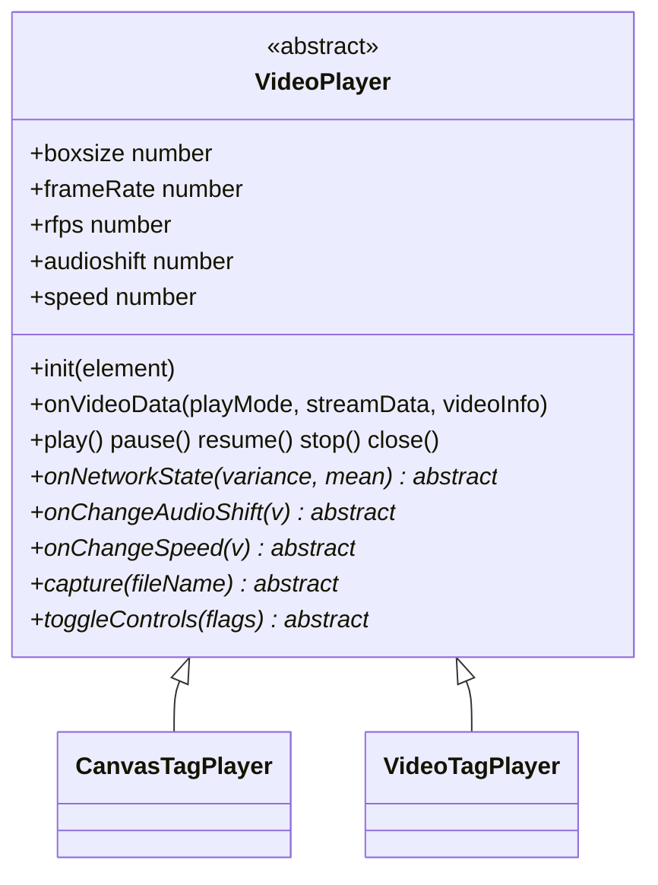

`VideoTagPlayer` has **no** `CanvasRenderer`/WebGL dependency whatsoever — confirmed by reading the
whole file: its only non-`VideoPlayer` imports are `moment-timezone`, `file-saver`, the vendored
`mp4Generator`, `worker/audioEncoder/WebCodecsAudioEncoder`, `listen/decoder/G711AudioDecoder`/
`G726xAudioDecoder`, and the small utils listed above (`VideoTagPlayer.ts:1-14`). It builds
fragmented MP4 directly and feeds it to a native `<video>` element via Media Source Extensions.

---

### `VideoPlayer` (`src/player/video/player/VideoPlayer.ts`)

- **Structure.** Abstract base class (`VideoPlayer.ts:46`). Plain fields: `boxsize`, `currentFrameCount`,
  `previousFrameCount`, `framedrop`, `type`, `frameRate`, `minRemainTime`, `minTimerInterval`,
  `maxdelay`, `currentdelay`, `audioCodecHint` (real bug fix: set by `MediaRouter.handleVideoData`
  from SDP — see `MediaRouter`'s `setAudioCodecHint()` in `03-mediaSession-core-video.md` — right
  before `init()`, alongside `codec`, so a subclass can know the audio codec *before* its first
  `onVideoData`/`onAudioData` call rather than only reactively; `VideoTagPlayer` is the only current
  consumer, see its `init()`/`setAudioInfo()` entries below), plus optional callbacks
  `errorCallback`/`eventStatisticsCallback`/`eventCaptureCallback`/`eventInstantPlaybackCallback`
  (`:47-69`). Backing-field-driven getter/setter
  pairs (real TS accessors, not plain fields) for `channelId`, `playmode`, `instantplayback`,
  `deviceType`, `codec`, `rfps`, `audioshift`, `speed` (`:81-175`) — ported from legacy's
  `Object.defineProperty` calls on `VideoPlayer`'s prototype so both subclasses inherit the exact
  same side effects. A private `fpsQueue = new CircularTypedArrayQueue<number>(5, true)` (`:79`)
  backs the `rfps` setter's network-state analysis. No constructor of its own (implicit default);
  never instantiated directly — only `CanvasTagPlayer`/`VideoTagPlayer` extend it.
  Inheritance: `VideoPlayer <<abstract>> <|-- CanvasTagPlayer, VideoTagPlayer`.

- **Method Analysis.**
  - `set rfps(v)` (`:125-157`) — the one method with real logic in this class. Pushes `v` into the
    5-slot `fpsQueue`; once full, computes `Median.variance(samples)` and buckets it into a
    `'poor' | 'fair' | 'good' | 'very_good' | 'excellent'` state string, reports it through
    `errorCallback` with `fromHex('0x1005')`, then calls the abstract `onNetworkState(variance, mean)`
    hook so each subclass can react (`CanvasTagPlayer` ignores it; `VideoTagPlayer` uses it to tune
    `networkWeight`, which feeds its MSE buffering delay).
  - `set audioshift(v)` / `set speed(v)` (`:163-175`) — call the abstract `onChangeAudioShift`/
    `onChangeSpeed` hooks *before* updating the backing field, so subclasses see the *previous*
    value via `this.audioshift`/`this.speed` while handling the change.
  - `init`, `onVideoData`, `onWaitingPackets`, `play`, `pause`, `resume`, `stop`, `close`,
    `clearBuffer`, `updateMiniMapInfo` (`:177-233`) — no-op defaults; every real subclass overrides
    them.
  - `addEventListener(event, callback)` (`:195-207`) — a 3-case switch (`statistics`/`capture`/
    `instantplayback`) storing the callback into the matching `event*Callback` field; not a real
    `EventTarget`, just a legacy-compatible dispatch table.
  - `setFrameRate`/`getFrameRate`, `setMaxInstantPlaybackTime`/`getMaxInstantPlaybackTime`,
    `setBufferClearInterval`/`getBufferClearInterval`, `setDefaultDelay`/`getDefaultDelay`,
    `setCurrentDelay`/`getCurrentDelay` (`:209-253`) — plain accessor pairs over the fields above.
  - `instantplaybackCmd({cmd})` (`:255-261`) — only handles `cmd === 'play'` (calls `this.play()`);
    both subclasses override this with a fuller command set.
  - `onNetworkState`, `onChangeAudioShift`, `onChangeSpeed`, `capture`, `toggleControls` (`:267-271`)
    — declared `abstract`. Legacy never defines a base implementation for these either (not even a
    log-only stub, unlike the no-op methods above); every real instance is one of the two
    subclasses, both of which implement all five, so the `abstract` keyword is a compile-time
    encoding of what was an implicit runtime contract in legacy.
  - Deliberately **not** declared here despite looking universal: `bufferingVideoData`,
    `sendToBufferManager`, `digitalZoom`, `controlStepPlay` — legacy's `videoTagPlayer` never
    defines these on its own prototype, so calling them on a real `VideoTagPlayer` throws
    `TypeError`. See `VideoTagPlayer`'s own section below.
  - `setDebugConfig(config, componentName)` / `protected debugLog`/`debugConfig` (added 2026-09-04)
    — the shared `debug`-gated tracing plumbing both subclasses build on; see this file's History
    and [11-canvas-tag-player.md](11-canvas-tag-player.md)'s matching History entry for how each
    subclass forwards it further to its own child components.

- **Call Stack.** N/A directly — `VideoPlayer` itself never runs a frame through; see
  `VideoTagPlayer`'s section below and [11-canvas-tag-player.md](11-canvas-tag-player.md)'s
  `CanvasTagPlayer` section.

- **RFC / Standard References.** None — pure internal state/lifecycle base class.

- **Relations & Data Flow.** `MediaRouter` talks to instances of this hierarchy only through the
  structural `VideoPlayerLike` interface (`mediaSession/MediaRouter.ts:136-176`), which both
  `CanvasTagPlayer` and `VideoTagPlayer` satisfy without formally implementing it in TypeScript —
  it exists purely for `MediaRouter`'s own typing of `this.player`.

---

### `VideoTagPlayer` (`src/player/video/player/video/VideoTagPlayer.ts`)

- **Structure.** The largest, most stateful class in this subsystem — a `<video>`
  element driven entirely by Media Source Extensions, fed fragmented-MP4 (fMP4) segments built on
  the fly from RTP-depacketized H264/H265 video and AAC/OPUS/G711/G726 audio, with A/V sync driven
  by `VTTCue` text-track entries carrying JSON timestamps. Extends `VideoPlayer`; kept as one
  cohesive class (matching legacy's single closure) rather than split up, since nearly every method
  reads/writes the same ~50 shared fields. Key field groups:
  - **MSE plumbing**: `videoElement`, `mediaSource: MediaSource | null`, `sourceBuffer: SourceBuffer
    | null`, `sourceBufferAudioIsOpus` (tracks what codec string the `SourceBuffer` was actually
    created with, since MSE forbids changing it later).
  - **fMP4 muxing state**: `segmentArray: Uint8Array[]` (pending, not-yet-appended segments, capped
    — see `pushSegment()` below), `sequenseNum`, `videoSamples`/`audioSamples` (pending per-track
    sample queues), `baseVideoTime`/`baseAudioTime`/`baseNTPTimestamp` (decode-time bases),
    `boxStartTime` (also capped — see `pushBoxStartTime()`), `lastBoxSize`,
    `audioInfo: Mp4AudioTrackInfo`, `videoInfoBox: Mp4VideoTrackInfo | null`, `dummyAudio`,
    `realAacActive`/`opusActive` (which real audio codec is currently muxed), `opusActiveIsHintOnly`
    (true when `opusActive` was pre-seeded from `audioCodecHint` — inherited from `VideoPlayer`,
    set by `MediaRouter` from SDP — rather than confirmed by a real `onAudioData` call yet; see
    `init()`/`setAudioInfo()` below).
  - **Timing/statistics**: `bufferedFrameCount`, `defaultDelay`/`delay` (browser-tiered — Chrome/
    Windows, Safari/Mac ≥10.13, and a generic-other bucket each get different
    `*_DEFAULT_FRAME_BUFFER_COUNT`/`*_DEFAULT_DELAY_TIME` constants, chosen in the constructor via
    `getBrowserInfo()`), `statisticsTimer: IntervalTimer | null`, `decodedMean`/`videoMean`/
    `dropMean: Mean`, `videoTimestampIntervalQueue: CircularTypedArrayQueue<number>`,
    `visibilityResumeUntil`/`lastLiveCatchUpJumpAt`/`lastCheckBufferSizeTrimAt` (2026-09-08,
    seeking/trim rate-limit bookkeeping — see the "Seeking" and "`SourceBuffer` fill/trim lifecycle"
    sections below).
  - **Workers/encoders (G.711/G.726 → AAC transcoding)**: `audiotranscoderWorker: Worker | null` —
    spawned unconditionally in the constructor (`:298-299`) via an injectable
    `AudiotranscoderWorkerFactory`, the original WASM (`AssemblyTranscoder`) transcode path (Opus and
    real AAC need no transcode at all). `audioEncoderMode: AudioEncoderMode` (`'auto'`/`'wasm'`/
    `'webcodecs'`, added 2026-09-08) selects between that path and `webCodecsAudioEncoder:
    WebCodecsAudioEncoder | null`, a main-thread (no Worker) native `AudioEncoder` alternative —
    see "Audio encoder selection: WASM vs. WebCodecs" below for the full flow.
  - No `CanvasRenderer`/WebGL/GL-primitive fields anywhere — confirmed by reading the whole file;
    its only rendering surface is the native `<video>` element itself.
  Inheritance: `VideoPlayer <|-- VideoTagPlayer`.

- **Method Analysis — fMP4 muxing / MSE pipeline.**
  - **Constructor** (`:266-300`) — calls `super()`, sets `this.rfps = 30`/`this.boxsize = 1`,
    inspects `getBrowserInfo()` to select buffering constants (throwing `RTSPOverWebSocketError
    0x090D` for unsupported old-Safari/OSX-10.7 combinations), and eagerly spawns the audio
    transcoder worker with its `onmessage → audiotranscoderWorkerMessage`.
  - `init(element)` (`:1860-1905`) — registers a `beforeunload` handler that flushes the
    `MediaSource` via `endOfStream()` before calling `close()`; sets `background_img` (loading
    spinner asset, jQuery-detection-adjusted); seeds `opusActive` (and `opusActiveIsHintOnly`) from
    `this.audioCodecHint` — set by `MediaRouter` from SDP, before either the first video I-frame or
    the first audio packet arrives, see `setAudioInfo()`'s doc entry below for why; calls
    `elementSetting()` (wires the full `<video>` event-listener set —
    `playing`/`pause`/`canplay`/`waiting`/`seeking`/`seeked`/`timeupdate`/etc., `:302-311`) and
    `createMediaSource()` (constructs a `new MediaSource()`, assigns it to `videoElement.src` via
    `URL.createObjectURL`, and listens for `sourceopen`). Also starts `startTimestampCuePolling()`
    (see "Timestamp cue → `RTSPOverWebSocket` flow" below).
  - `mediaSourceEventListener('sourceopen')` (`:327-340`) → `setSourceBuffer()` (`:2443-`) —
    on first call, builds the MIME/codecs string
    `video/mp4;codecs="${videoCodecInfo}, ${opusActive ? 'opus' : 'mp4a.40.2'}"`, checks
    `MediaSource.isTypeSupported`, and calls `mediaSource.addSourceBuffer(mimeCodec)` — this is
    the point the browser is told exactly which H264/H265 profile+level and which audio codec to
    expect for the entire session (audio codec can only be declared once, see `sourceBufferAudioIsOpus`).
    See "`SourceBuffer` fill/trim lifecycle" below for the full creation/fill/trim/teardown picture.
  - `onVideoData(playMode, streamData, videoInfo)` (`:1706-1731`, overrides `VideoPlayer`) — the
    per-video-frame entry point. On the first `I`-frame of a session, captures `videoCodecInfo`,
    calls `setVideoInfo()` (builds the `Mp4VideoTrackInfo` box descriptor — width/height with a
    crop-correction heuristic for non-16-aligned resolutions, plus SPS/PPS or
    VPS/PTL for H264/H265 respectively), `initBaseNTPTimestamp()`, and `createInitSegment()`
    (calls the vendored `initSegment([videoInfoBox, audioInfo])` to build the fMP4 `ftyp+moov`
    initialization segment, then immediately tries to append it). Every call then runs
    `createVideoSample()`. See "Video/Audio sample → `SourceBuffer` pipeline" below for the full
    chain from here through to `appendBuffer()`.
  - `videoElementEventListener('error')` (`:495-`) — **real bug, found live (2026-09-07)**: every
    case here besides `'resize'` used to fall through to `default: break`, including `'error'` —
    so any `<video>` element pipeline failure (a rejected MSE append, a decode error, not specific
    to Opus) died with zero console output and no `errorCallback` invocation, indistinguishable
    from the player simply going idle. Now reports `videoElement.error` (code +
    message) via `errorCallback` (`0x0908`) whenever a real `'error'` event fires; safe from false
    positives since `.error` is only ever set on a genuine pipeline failure, never during a normal
    `close()`. `mediaSourceEventListener`'s own `'error'`/`'sourceclose'`/`'sourceended'` cases
    (`:431-444`) are still `break`-only — left alone since a `'sourceclose'` also fires during
    ordinary teardown, and the `<video>` element's own `'error'` event reliably fires alongside any
    real MediaSource-level failure anyway, so this one fix point covers both without new
    false-positive risk on intentional disconnects.
  - `setVideoInfo(videoinfo, codecType)` (`:2315-`) — builds `videoInfoBox.sps`/`.pps` only inside
    the `H264`/`H265` branches specifically (a real, fixed bug: assigning them unconditionally for
    every codec used to leave a `[undefined]` array for VP8/VP9/AV1/MJPEG, which
    `mp4Generator.js`'s `videoSample()` treated as truthy-non-empty and crashed on
    `a[0].byteLength` before ever reaching its own codec check).
  - `createInitSegment()` (`:2128-`) — no-ops if `this.videoInfoBox` is still `null` (audio arriving
    before the first video I-frame costs nothing — `onVideoData()`'s own call runs once it does,
    with whatever `this.audioInfo` is current by then).
  - `createAudioSample(streamData, audioinfo, chunkCodec)` (`:2052-`) — also bails out defensively if
    `streamData.frameData` is falsy, skipping just that one sample rather than letting a
    `.byteLength` throw take down the session.
  - `setSourceBuffer()` (`:2443-`) — returns early unless `mediaSource.readyState === 'open'`,
    guarding the immediately-following `mediaSource.duration = 0` (which the MSE spec requires
    `readyState === 'open'` for). Only ever called from the `'sourceopen'` listener, which should
    already guarantee that — but a stale/late-firing event during session teardown/reconnect
    churn (observed live as a downstream symptom of an earlier crash) can
    still reach here after the `MediaSource` has already moved on to `'closed'`/`'ended'`,
    throwing an uncaught `InvalidStateError`.

#### Video/Audio sample → `SourceBuffer` pipeline

Every video or audio RTP frame that reaches this class runs the same essential funnel before it can
ever become visible/audible pixels/sound: per-sample assembly → per-box (`boxsize`-many samples)
muxing into a real fMP4 fragment → a bounded pending-append queue → the actual MSE
`appendBuffer()` call, drained one at a time as the browser finishes each previous append.

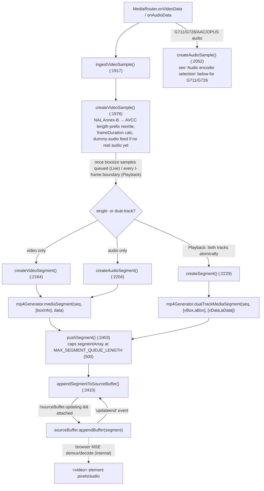

**Call stack — video and audio, both converging on `SourceBuffer.appendBuffer()`.** The flowchart
above shows the shape of the pipeline; this sequence diagram shows the actual call order, including
the `'updateend'`-driven drain loop that keeps `segmentArray` moving one append at a time (MSE only
ever allows one `appendBuffer()` in flight):

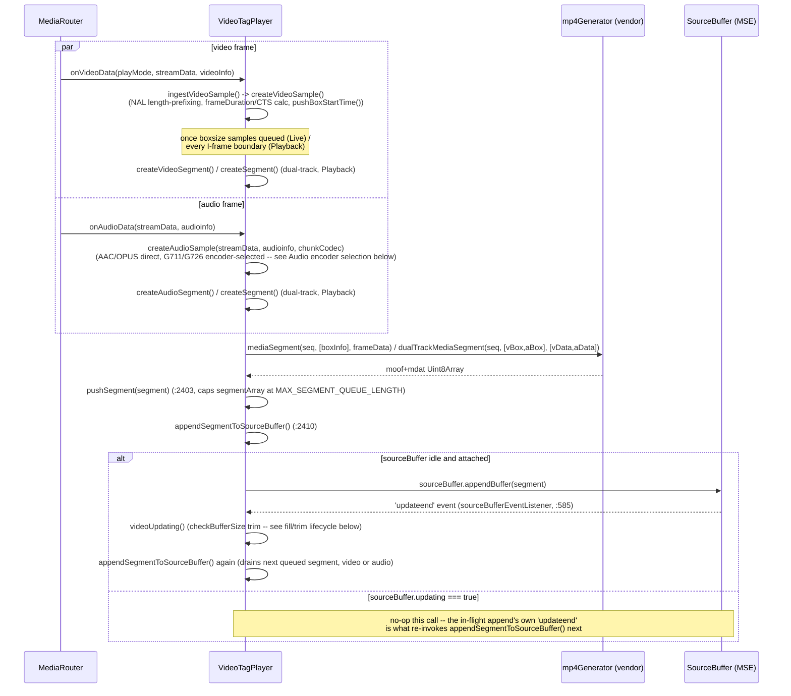

- `createVideoSample()`/`createAudioSample()` accumulate per-track sample queues
  (`videoSamples`/`audioSamples`); once enough have queued (Live: `boxsize` video samples;
  Playback: every I-frame boundary once more than one sample is buffered), `createVideoSegment()`/
  `createAudioSegment()`/`createSegment()` (`:2164-2260`) splice the queue, build an `Mp4BoxInfo`
  (`id`, `samples`, `baseMediaDecodeTime`, `type`), flatten sample frame data via
  `createFrameDataBuffer()` (`:2149`, a single concatenation when more than one sample), update the
  `VTTCue` timestamp text track (`updateVideoTimestamp()`/`updateAudioTimestamp()` — see "Timestamp
  cue → `RTSPOverWebSocket` flow" below), then call the vendored muxer.
- **`pushSegment(segment)` (`:2403-2408`, added 2026-09-08)** — the *only* way a non-init segment
  enters `segmentArray` now; drops the incoming segment (never evicts index 0, since
  `createInitSegment()`'s own `unshift()` can leave the not-yet-appended init segment sitting there)
  once `segmentArray.length >= MAX_SEGMENT_QUEUE_LENGTH` (500). In steady state one entry drains per
  `'updateend'` about as fast as they're produced, so this cap almost never actually engages — it
  exists specifically for the case where the browser suspends this tab's MSE append pipeline for an
  extended period (observed live: Windows "Efficiency Mode"/Chrome Energy Saver) while RTP delivery
  and segment *creation* keep running regardless; without it this backlog — real encoded frame
  `Uint8Array` data, not a small fixed-size array — grew unbounded and was the dominant contributor
  to a reported >1GB Live-session memory figure. Same backpressure-by-dropping trade-off
  `MJPEG_ENCODER_MAX_QUEUE_SIZE` already makes elsewhere in this class.
- **`appendSegmentToSourceBuffer()` (`:2410-2441`)** — the actual MSE append: no-ops if
  `sourceBuffer` is `null`, mid-update (`sourceBuffer.updating`), or detached
  (`isSourceBufferDetached()`, `:2365-`); on an empty queue, calls `mediaSource.endOfStream()` if the
  stream is flagged to end; otherwise `segmentArray.shift()`s one segment and calls
  `sourceBuffer.appendBuffer(segment)`, wrapping append failures into
  `RTSPOverWebSocketError(0x030A)`.
- **`sourceBufferEventListener('updateend')` (`:585-`)** — MSE only allows one `appendBuffer` in
  flight at a time, so this handler is what actually keeps `segmentArray` draining: it calls
  `videoUpdating()` (see "Seeking" and "`SourceBuffer` fill/trim lifecycle" below) and then
  `appendSegmentToSourceBuffer()` again, in that specific order — see the fill/trim section below
  for why the order matters and what happened when it was briefly reversed.

#### Audio encoder selection: WASM vs. WebCodecs

G.711/G.726 audio (the only codecs this class ever transcodes — real AAC/Opus need no transcode at
all) can reach the same downstream muxing/timing path through either of two independent encoder
implementations, selected by `audioEncoderMode: 'auto' | 'wasm' | 'webcodecs'`
(`RTSPOverWebSocket.ts`'s `audioencodermode` attribute/property, threaded down via
`StreamPlayer`/`MediaRouter`'s `VideoPlayerLike.setAudioEncoderMode?` to
`VideoTagPlayer.setAudioEncoderMode()`, `:3482-`). Both paths produce the exact same thing — AAC
bytes — and re-enter the identical `createAudioSample(data, audioInfo, 'AAC')` call, so **every**
downstream decision (`esds` box construction, `sourceBufferAudioIsOpus`, `realAacActive`, the
Video/Audio-sample pipeline above) is fully shared; the flag only changes *which implementation
produced the AAC bytes*, never the `SourceBuffer`'s declared codec family (deliberately not switched
to Opus — see `MEMORY.md`'s design-rationale entry).

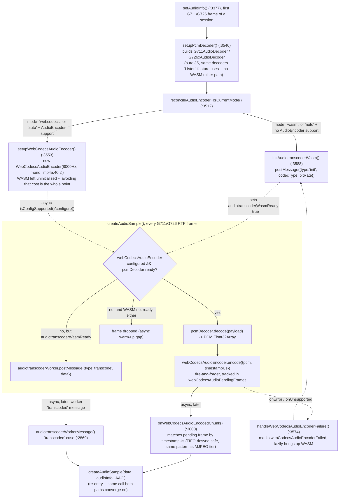

**Call stack — WASM path (`audioEncoderMode='wasm'`, or `'auto'` fallback).** A round trip through
the `audiotranscoderWorker` Web Worker; the reply is asynchronous, arriving as a `'transcoded'`
`postMessage` on a later JS-thread turn, not synchronously within the same call:

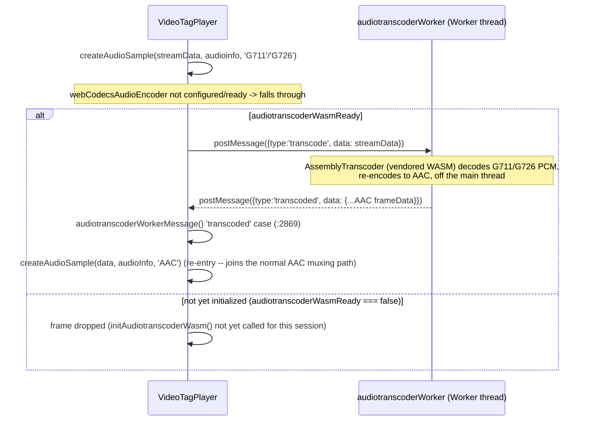

**Call stack — WebCodecs path (`audioEncoderMode='webcodecs'`, or `'auto'` when `AudioEncoder` is
supported).** No Worker at all — `pcmDecoder.decode()` runs synchronously on the main thread;
`webCodecsAudioEncoder.encode()` is fire-and-forget, with its own output arriving asynchronously via
the encoder's `onEncodedChunk` callback:

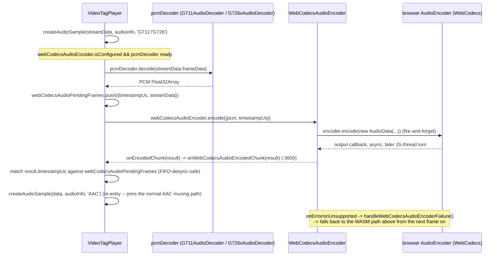

- **WASM path** (`audiotranscoderWorker`, the original `AssemblyTranscoder`-backed Worker) —
  `initAudiotranscoderWasm()` (`:3588-`) sends the exact same `postMessage({type:'init', ...})`
  this branch always sent, now factored into its own idempotent-safe-to-call-again method (used both
  from `setAudioInfo()`'s first frame and later, lazily, from a mode-switch fallback).
  `createAudioSample()`'s dispatch only posts to this Worker once `audiotranscoderWasmReady` is
  `true` — a field distinct from `audioEncoderMode` itself, since `'auto'` alone can't tell "WASM
  chosen" apart from "WASM chosen but not initialized yet". Output arrives asynchronously as a
  `'transcoded'` Worker message, handled by `audiotranscoderWorkerMessage()` (`:2869-`), which
  re-enters `createAudioSample(data, audioInfo, 'AAC')`.
- **WebCodecs path** (`webCodecsAudioEncoder: WebCodecsAudioEncoder | null`,
  `worker/audioEncoder/WebCodecsAudioEncoder.ts`, structurally mirrors the MJPEG tier's
  `WebCodecsVideoEncoder`) — `setupWebCodecsAudioEncoder()` (`:3553-`) constructs it
  (constructor throws if `typeof AudioEncoder === 'undefined'`; `configure()` verifies
  `AudioEncoder.isConfigSupported()` for a fixed 8000Hz-mono `'mp4a.40.2'` config before building
  the real encoder). `createAudioSample()`'s G711/G726 branch decodes the raw payload to PCM via
  `pcmDecoder` (`G711AudioDecoder`/`G726xAudioDecoder`, lazily created once per session by
  `setupPcmDecoder()`, `:3540-`, reused across frames — not recreated per-sample) and calls
  `webCodecsAudioEncoder.encode({pcm, timestampUs})` (a caller-assigned monotonic `timestampUs`,
  tracked in `webCodecsAudioPendingFrames` alongside the *original* `streamData` — the same
  FIFO-desync-safe matching pattern the MJPEG tier's `mjpegPendingFrames` uses). Output arrives
  asynchronously via `onEncodedChunk`, handled by `onWebCodecsAudioEncodedChunk()` (`:3600-`), which
  matches the chunk back to its pending frame by `timestampUs` (a mismatch is detected and the
  chunk dropped rather than risking misattribution) and re-enters `createAudioSample(data, audioInfo,
  'AAC')`. A real, accepted gap: a G.711/G.726 frame arriving in the brief window before
  `webCodecsAudioEncoder.isConfigured` turns true (the async `isConfigSupported()`/`configure()`
  round trip) is dropped rather than falling back to an uninitialized WASM worker — WASM is
  deliberately left uninitialized in this mode specifically to avoid its cost entirely, not just
  avoid using it once ready.
- **Failure/fallback** — `WebCodecsAudioEncoder`'s `onError`/`onUnsupported` callbacks both route to
  `handleWebCodecsAudioEncoderFailure()` (`:3574-`), which closes it, marks
  `webCodecsAudioEncoderFailed` (skips retrying WebCodecs for the rest of the session unless the
  mode is explicitly changed again via `setAudioEncoderMode()`), and lazily brings up WASM at that
  point — so a runtime WebCodecs failure recovers audio on the very next frame instead of staying
  silent for the rest of the session.
- **Live mid-session switch** — `setAudioEncoderMode(mode)` (`:3482-`) supports changing the mode
  while a session is already running (mirrors `setDebugConfig()`'s live-refresh pattern): a WASM
  `transcode` request already in flight is left to complete normally rather than force-cancelled;
  a fresh mode change also clears `webCodecsAudioEncoderFailed` so a previously-failed WebCodecs
  attempt gets a fresh try if the user explicitly re-selects it.
- **Teardown** — `close()` calls `closeWebCodecsAudioEncoder()` (`:3615-`, closes the encoder, clears
  pending frames, resets `pcmDecoder`/`webCodecsAudioEncoderFailed`) alongside resetting
  `audiotranscoderWasmReady = false` and posting `{type: 'terminate'}` to `audiotranscoderWorker`.
- **`<video>` element reset (`close()`, `:3236-3265`)** — this is the actual DOM-level `<video>`
  reset a 2026-09-04 History entry above mis-described as living in a `RTSPOverWebSocket.ts`
  `resetPlayerElement()` method — no such method exists anywhere in this codebase (confirmed via
  `grep`, 2026-09-08); the real logic is inline here instead, one layer lower than that entry
  claims. Runs whenever `videoElement` is non-null: revokes the `MediaSource` Blob URL
  (`URL.revokeObjectURL(videoElement.src)`, called twice — once before, once after the block below,
  both harmless no-ops on an already-revoked URL), clears `src`/`srcObject`, removes every
  TextTrack cue and its `oncuechange` handler, calls `removeAllEventListener()` (the custom
  `sourceBuffer`/`mediaSource`/element listener set), nulls every native `on*` handler
  (`onpause`/`oncanplay`/`onwaiting`/`ondurationchange`/`onloadeddata`/`onprogress`/`onseeking`/
  `onseeked`/`ontimeupdate`/`onstalled`/`oncanplaythrough`/`onemptied`), and resets
  `style.background`. **`videoElement.load()` — the one call that actually forces the browser to
  reset its internal decode pipeline — is only made `if (!this.playbackFlag)`, i.e. Live sessions
  only.** Not yet explained anywhere why Playback is excluded (this line dates to the initial
  ported commit, `fdd4548`, with no comment either here or in the port) — but `close()` is called
  far more than just at final teardown: `MediaRouter.initVideoPlayer()` (seek/resume/speed-change)
  and `selectVideoPlayer()` (codec/size/framerate change) both call it as part of an **in-session
  reinit**, immediately followed by constructing a fresh player against the *same* persisted
  `<video>` DOM node — and Playback sessions reinit via seeking far more often than Live ever does.
  `.load()`'s full pipeline reset is disruptive (a visible flash/black-frame, added latency) if
  fired on every one of those, which is the likely (unconfirmed) reason it's Live-only: Live's own
  `close()`-then-reinit calls are comparatively rare, so paying that cost every time is tolerable
  there but was presumably judged not to be for a per-seek reinit in Playback. **Investigated
  2026-09-08 at the user's request** (a proposed "just also call `.load()` in Playback mode" fix
  was *not* applied for this reason) — `close()` has no way to distinguish "this is the final
  teardown" from "this is an in-session reinit" for either mode today; making `.load()` fire only
  on the former (in both modes) would need that distinction threaded through explicitly (e.g. a
  `close(final: boolean)` parameter) rather than a blanket per-mode toggle. See `MEMORY.md`.

#### `SourceBuffer` fill/trim lifecycle

- **Creation.** `setSourceBuffer()` (`:2443-`, only call site is the `'sourceopen'` listener) builds
  the MIME/codecs string from `videoCodecInfo` (only known once a real video frame has been
  ingested) and `opusActive`, and calls `mediaSource.addSourceBuffer(mimeCodec)` — the audio codec
  family (`opus` vs. `mp4a.40.2`) is locked in for the entire session at this point (MSE forbids
  changing it later; see `setAudioInfo()`'s codec-switch guard in the pipeline section above). Two
  real races were fixed here: (a) a stale/late-firing `'sourceopen'` after the `MediaSource` already
  moved on to `'closed'`/`'ended'` during reconnect churn — guarded by `readyState !== 'open'` →
  early return; (b) `'sourceopen'` firing *before* the first video frame (so `videoCodecInfo` is
  still `null`) used to throw inside the unconditional `addBufferEventListener()` call right after —
  fixed by only calling it when `this.sourceBuffer !== null`, plus `ingestVideoSample()` retrying
  `setSourceBuffer()` itself once the real codec is known if `'sourceopen'` won the race.
- **Fill.** Exactly the Video/Audio sample pipeline above: `appendSegmentToSourceBuffer()` shifts one
  queued segment and calls `sourceBuffer.appendBuffer()` whenever the buffer isn't already mid-update
  and isn't detached; the next `'updateend'` drains the next one.
- **Trim.** `checkBufferSize()` (`:2595-2673`) is the only thing that ever calls
  `sourceBuffer.remove()`. Two real bugs were found and fixed here in the same 2026-09-08
  investigation:
  1. *Last-range-only measurement.* The trim-trigger check used to measure `endTime - startTime`
     from `sourceBuffer.buffered`'s **last range only**
     (`buffered.start/end(buffered.length - 1)`). `SourceBuffer.buffered` can legitimately fragment
     into more than one range (a PTS discontinuity between segments, or the very currentTime-jump
     fragmentation the "Seeking" section below documents) — once fragmented, the last range's own
     width can stay small indefinitely while everything in *earlier* ranges keeps growing completely
     untrimmed, since the gate never measured them. `sourceBuffer.remove(0, removeEnd)` itself was
     always correct (MSE removes across every range intersecting `[0, removeEnd)` regardless of
     fragmentation) — only the *gating measurement* was wrong. Fixed to measure `bufferedStart =
     buffered.start(0)` (the true earliest position across every range) against the last range's own
     `end()`.
  2. *No hysteresis/debounce → livelock.* `remove(0, removeEnd)` always trims down to exactly
     `currentTime - getMaxInstantPlaybackTime()`, so the buffered span settles *just barely above*
     the bare threshold (observed live: a constant ~30.3-30.4s, never below 30s). With no margin, the
     outer `if (span > getMaxInstantPlaybackTime())` condition stayed true on the very next call too
     — combined with a same-session reorder fix (`sourceBufferEventListener`'s `'updateend'` case now
     calls `videoUpdating()` **before** `appendSegmentToSourceBuffer()`, not after, so
     `checkBufferSize()`'s `!sourceBuffer.updating` guard isn't starved by a backlog-draining burst
     already having kicked off the next append a few lines earlier in the same handler), this created
     a genuine livelock: a near-no-op `remove()`'s own completion fires another `'updateend'`, which
     re-triggers another near-no-op `remove()`, indefinitely, as fast as the browser can cycle —
     confirmed live via the `[trace]` `updateend` counter climbing by tens of thousands while
     `durationchangeCount` (real new data) never moved. Fixed two ways: `CHECK_BUFFER_SIZE_HYSTERESIS_SECONDS`
     (5) — the outer condition now requires `span > getMaxInstantPlaybackTime() + 5`, so a
     just-trimmed buffer stays quiet until genuinely new data re-accumulates; and
     `lastCheckBufferSizeTrimAt`/`MIN_CHECK_BUFFER_SIZE_TRIM_INTERVAL_MS` (1000ms) — a hard floor on
     how often an actual `remove()` can fire at all, independent of the hysteresis math, as
     defense-in-depth (degrades a similar future bug to "trims slightly less often than ideal"
     instead of "livelocks the player").
  Both guards must pass (`span` over threshold **and** `now - lastCheckBufferSizeTrimAt >=
  MIN_CHECK_BUFFER_SIZE_TRIM_INTERVAL_MS` **and** `!sourceBuffer.updating`) before an actual
  `remove()` call — a slightly larger ~35s worst-case buffered span instead of exactly 30s, not a
  meaningful regression. `checkBufferSize()` itself is called from `videoUpdating()`
  (`:2675-`, both Live and Playback branches), which in turn is triggered from `onDurationChange()`
  and every `sourceBuffer` `'updateend'` (see "Seeking" below for the full trigger list).
  3. *Negative trim target got sign-flipped into a self-destructive trim.* The actual `remove(0,
     removeEnd)` target is `min(endTime, currentTime) - getMaxInstantPlaybackTime()` — deliberately
     clamped to `currentTime` so the trim never deletes data ahead of what's still playing. That
     expression goes negative whenever `currentTime` hasn't reached `getMaxInstantPlaybackTime()`
     seconds yet (Live appends never stop just because the `<video>` element is `pause()`d, so the
     outer span-based gate above can still be true while `currentTime` itself is small or frozen).
     `Math.abs()` used to flip that negative value positive instead of skipping the trim — e.g.
     `currentTime = 0` computed `removeEnd = getMaxInstantPlaybackTime()` and deleted the exact data
     `currentTime` needed to resume, permanently stalling playback at that position while `endTime`
     kept growing untrimmed for the rest of the session. Fixed to `Math.max(0, ...)` (skip trimming
     instead of sign-flipping) in both branches, with the same `if (removeEnd > 0)` guard on both.
- **Full teardown (not re-creation).** `close()` (`:3138-`) calls `removeSourceBuffer()` on the
  `mediaSource` if one exists, then `endOfStream()` only if `readyState === 'open'` (a real fixed
  bug: the guard used to check `!== 'ended'`, which still let a `'closed'` `MediaSource` — reachable
  on reconnect — through, throwing `InvalidStateError` and skipping every step after it in the same
  `try` block, including listener cleanup). Deliberately does **not** null `this.sourceBuffer` before
  `removeAllEventListener()` runs (a second real fixed bug: nulling it early left that method's own
  `this.sourceBuffer !== null` guard silently no-op, orphaning listeners on the now-detached
  `SourceBuffer` — a queued `'updateend'` task from `removeSourceBuffer()`'s own abort-in-progress-
  append step could still fire it afterward, calling back into an already-torn-down player).
  `segmentArray`/`videoSamples`/`audioSamples`/`boxStartTime` are all explicitly cleared to empty
  arrays (previously left referenced, delaying GC of potentially-large queued frame data).

#### Seeking

Every site in this class that reassigns `videoElement.currentTime`, what triggers it, and the margin
it uses:

| Site | Mode | Trigger | Target / margin | Notes |
| --- | --- | --- | --- | --- |
| `videoUpdating()` Live-branch catch-up jump (`:2732-2751`) | Live | `latency = endTime - currentTime > this.delay`, called from `onDurationChange()`/every `'updateend'`/`onVisibilityChange()`/`onWaiting()`'s Live `else` branch | `endTime - catchUpDelay` (`defaultDelay`, or `defaultDelay * VISIBILITY_RESUME_DELAY_MULTIPLIER` (5x) while `performance.now() < visibilityResumeUntil`) | Rate-limited to at most once per `MIN_LIVE_CATCHUP_JUMP_INTERVAL_MS` (500ms) via `lastLiveCatchUpJumpAt` — without this, a draining backlog re-jumps on every `'updateend'`, producing the "seek domino" (dozens of `Seek`/`kPipelineStateChange` pairs within milliseconds — see History). |
| `videoUpdating()` Playback-branch `boxsize` transition (`:2689-2709`) | Playback | `prevBoxsize !== boxsize && boxsize === 1 && deviceType === 'camera'` | `max(startTime, targetTime - defaultDelay)` | Backed off by `defaultDelay` (a real fixed bug: used to snap directly to the raw buffered `endTime` with zero margin, risking landing exactly on the edge of not-yet-decodable data). |
| `changeCurrentTime()` (`:1275-1311`) | Playback | Called only from `onVisibilityChange()` on a tab/window refocus while `playbackFlag` | `boxStartTime`-derived value (a few segments back, `boxTimeIndex` = 1 or 2 depending on `lastBoxSize`), clamped to `min(lastBoxTime, bufferedEnd - defaultDelay)` | The clamp is a real fixed bug: `boxStartTime` keeps growing while a backgrounded tab's `<video>` clock is frozen, so an unclamped jump could target a segment appended *during* the background period, well past what's actually finished decoding. |
| `onVisibilityChange()` Live branch (`:1313-1355`) | Live | `document.visibilityState === 'visible'` while not `playbackFlag` | Arms `visibilityResumeUntil = performance.now() + VISIBILITY_RESUME_COOLDOWN_MS` (5s), then calls `videoUpdating()` (reuses the Live catch-up jump above, at the larger margin for the whole cooldown window) | Fixes an indefinite Pause/Play/Pause loop: a single one-shot larger margin on only this call wasn't enough on its own if the first jump still landed somewhere not-yet-playable and a later `'waiting'`/`'updateend'` retry fell back to the small margin. |
| `onWaiting()` Playback branch, catch-up (`:1459-1465`) | Playback | Native `'waiting'` event, `currentTime` behind `endTime - getMaxInstantPlaybackTime()` (or `currentTime === 0`) | `endTime - defaultDelay` | Only when `userPaused === false` and `localSpeedValue === 1`. |
| `onWaiting()` Playback branch, floor-second truncation (`:1490-1492`) | Playback | Native `'waiting'` event, catch-up condition above *not* met | `parseInt(String(currentTime), 10)` (floor to the integer second) | Only when `currentTime` is non-finite or already at/past `endTime` (a real fixed bug: used to truncate unconditionally on *every* `'waiting'` event, discarding real playback progress on every ordinary buffering pause — read live as an OSD timestamp oscillating back and forth). |
| `onWaiting()` Live `else` branch (`:1543`) | Live | Native `'waiting'` event, not Playback | Calls `videoUpdating()` (reuses the Live catch-up jump) | Same fix pattern as `onVisibilityChange()`'s Live branch, for the case `'waiting'` fires before/without a `visibilitychange` event. |
| Initial `currentTime = 0` | Both | Session start, before any real playback position exists | N/A (default) | The `videoElement.currentTime === 0` branch inside `videoUpdating()`'s Live latency calc, and `onCanPlay()`'s `videoPlay()` call, are what move it off this. |

`'seeking'`/`'seeked'` fire on the `<video>` element for essentially every jump above per the HTML
spec (a `currentTime` assignment while data isn't immediately available at the new position triggers
`'seeking'`, then `'seeked'` once the browser can resume); `'waiting'` fires separately whenever
playback actually stalls waiting for more buffered data, which is both a *trigger* for some of the
jumps above (`onWaiting()` itself) and a frequent *side effect* of one landing somewhere not yet
fully decodable — see `MEMORY.md`'s "seek domino" entry for a real `chrome://media-internals` trace
of this cascading before the rate-limit fix above.

#### Instant playback

A Live-only feature letting a host page pause and locally scrub within the last
`getMaxInstantPlaybackTime()` seconds (default 30s) of *already-downloaded* video — entirely
client-side, against the `<video>` element's own `SourceBuffer`, with no RTSP round trip to the
camera for the pause/seek/resume operations themselves (that's the "instant" in the name: no
network latency for any of them). Spans five classes; this section documents the
`VideoTagPlayer`-side mechanics in full and only as much of `RTSPOverWebSocket.ts`/`StreamPlayer.ts`
as is needed to see where each call originates — see `01-elements-interface-exceptions.md` for the
full public API surface.

**Entry.** A host page sets `element.mode = 'instantplayback'` (or the equivalent
`element.playType = RTSPOverWebSocketPlayType.INSTANTPLAYBACK`). The `playType` setter
(`RTSPOverWebSocket.ts:1500-1527`) stashes the current mode as `_oldPlayType` (to restore later),
pauses if currently playing, then sends `cmd: 'init'` with `media.type: 'instantplayback'` via
`player.control(this.info)`. `StreamPlayer.control()` (`:820-836`) routes every `instantplayback`
`cmd` the same way: `MediaRouter.sendCommandData('instantplayback', {cmd, ...})` →
`MediaRouter`'s `case 'instantplayback'` (`:1334-1336`) → `this.player.instantplaybackCmd(data)` →
this class's own `instantplaybackCmd(data)` (`:3340-3381`). Its `'init'` case only takes effect
`if (this.playmode === 'live')`: sets `this.instantplayback = true`, and if the `MediaSource` is
already marked `willEnd`, calls `mediaSource.endOfStream()`.

**While active.**
- `checkBufferSize()`'s normal ~30-35s trim is suspended (`videoUpdating()`'s Live branch only calls
  it `if (!this.instantplayback)` — see "`SourceBuffer` fill/trim lifecycle" above) — the entire
  point is to *keep* the buffer around for scrubbing, not trim it away out from under a paused user.
- The host page's `pause()`/`resume()`/`seek()` calls (`RTSPOverWebSocket.ts`, gated on
  `this._playType === INSTANTPLAYBACK`) no longer issue a real RTSP PAUSE/PLAY/SEEK to the camera —
  they instead send `cmd: 'pause'`/`'play'`/`'seek'` through the same `instantplayback` channel,
  landing in this class's `instantplaybackCmd()` switch: `'play'` calls `this.play()` (which, if
  resuming and the buffer/`MediaSource` "will end", also calls `endOfStream()` — `:3116`); `'pause'`
  calls `this.pause()`; `'seek'` bounds-checks (`0 <= seekTime <= videoElement.duration`) then
  assigns `videoElement.currentTime` directly — a plain local seek within the existing buffer, nothing
  else.
- `onSeeked()` and `onSeeking()`/`onWaiting()`/`onCanPlay()` all branch on `this.instantplayback`:
  a seek while scrubbing does **not** auto-resume playback or clear timestamp cues the way a normal
  seek does (`onSeeked()`, `:1572-1577`) — the user stays paused at the scrubbed position,
  matching the expected "scrub while paused" UX instead of snapping back to playing.
- **Status/error reporting.** Every checkpoint below calls `this.eventInstantPlaybackCallback(data)`
  (registered the same way as every other player-level callback, via `MediaRouter`'s
  `'instantplayback'` listener category, `:1410-1411`/`:1738`, up to
  `RTSPOverWebSocket.onRTSPOverWebSocketInstantPlayback()`, `:4676-4697`, which dispatches the
  public `'instantplayback'` `CustomEvent`):

  | Code | Fired from | When | Dispatched detail |
  | --- | --- | --- | --- |
  | `0x1100` | `onPause()` (`:1392-1419`) | Native `'pause'` event confirms the video actually stopped, while `instantplayback && userPaused` | `{timeline: {startTime, endTime, currentTime}}` — the scrubbable range, read straight off `sourceBuffer.buffered`. **The key event for building a rewind-scrubber UI.** |
  | `0x1101` | `VideoTagPlayer.resume()` (`:3142-3154`, the class's own `resume()`, not `RTSPOverWebSocket.resume()`) | `playmode === 'live' && instantplayback`, i.e. instant playback is ending | `{timeline: undefined}` — no extra fields (falls into `onRTSPOverWebSocketInstantPlayback()`'s `0x1100`/`0x1101` branch, which reads `.timeline`, absent here) |
  | `0x1102` | `getCurrentVideoFrame()` (`:1189-1193`) | Every rendered-frame tick (via `statisticsTimer`) while `instantplayback && !videoElement.paused` | `{currentTime}` — a periodic "here's your current instant-playback position while playing forward" tick, not an error |
  | `0x1103` | `onPause()` | Same trigger as `0x1100`, fired first | `{currentTime}` |
  | `0x1104` | `instantplaybackCmd()`'s `'terminate'` case (`:3368-3378`) | `this.clearBuffer()` itself throws | **Not** delivered via `eventInstantPlaybackCallback` — thrown directly as an `RTSPOverWebSocketError`, a different delivery mechanism from every other code here |
  | `0x1105` | `onWaiting()` (`:1439-1453`) | Native `'waiting'` event while `instantplayback` — scrubbed to a position with no buffered data | `{currentTime}` |
  | `0x1106` | `onSeeking()` (`:1558-1569`) | Native `'seeking'` event while `instantplayback` | `{currentTime}` |
  | `0x1107` | `onCanPlay()` (`:1365-1382`) | Native `'canplay'` event while `instantplayback` and still paused — the scrubbed-to position has finished (re)buffering | `{currentTime}` gets dropped: `onRTSPOverWebSocketInstantPlayback()`'s `switch` has no `'0x1107'` case, so it falls to `default` and dispatches only `{error, state}` |

  `onRTSPOverWebSocketInstantPlayback()`'s own grouping: `0x1100`/`0x1101` read `.timeline`;
  `0x1102`/`0x1103`/`0x1105`/`0x1106` read `.currentTime`; everything else (including `0x1107`)
  falls to the `default` branch and dispatches neither.

**Exit.** Setting `element.mode`/`.playType` back to `'live'` calls `RTSPOverWebSocket.resume()`
(`:5844-5862`) while `_playType` is still `INSTANTPLAYBACK`: sends `cmd: 'terminate'` through the
same channel → `instantplaybackCmd()`'s `'terminate'` case calls `this.clearBuffer()` (sets
`clearBufferFlag = true`, drained by the next `sourceBuffer` `'updateend'` into a full
`sourceBuffer.remove(0, endTime)` wipe of the whole instant-playback window — see the
`sourceBufferEventListener` `'updateend'` case in "`SourceBuffer` fill/trim lifecycle" above) — then
`RTSPOverWebSocket.resume()` restores `info.media.type`/`_playType` from `_oldPlayType`. The
`instantplayback` field itself flips back to `false` (and fires `0x1101`) separately, inside
`VideoTagPlayer.resume()` — not inside `instantplaybackCmd()`'s `'terminate'` case itself, which
only clears the buffer.

**A same-named, unrelated flag one layer down.** `RtspClient.ts` has its own `instantplayback`
field (`:342`), set by `StreamPlayer.pause()`/`resume()` specifically when `media.type === 'live'`
(`:615`/`:632`) — nothing to do with this class's field of the same name, and not gated on the
`INSTANTPLAYBACK` play type at all (a plain Live pause sets it too). Its only effect: the RTSP
alive-watchdog (`checkAliveIntervalHandlerFunc`'s 1s interval, `:1275`) skips marking
`isRTPRunning = false` while it's `true`, so intentionally pausing Live playback doesn't get
misread as a dead connection. Easy to confuse with this section's `VideoTagPlayer.instantplayback`
given the identical name — they're different fields on different classes with different triggers.

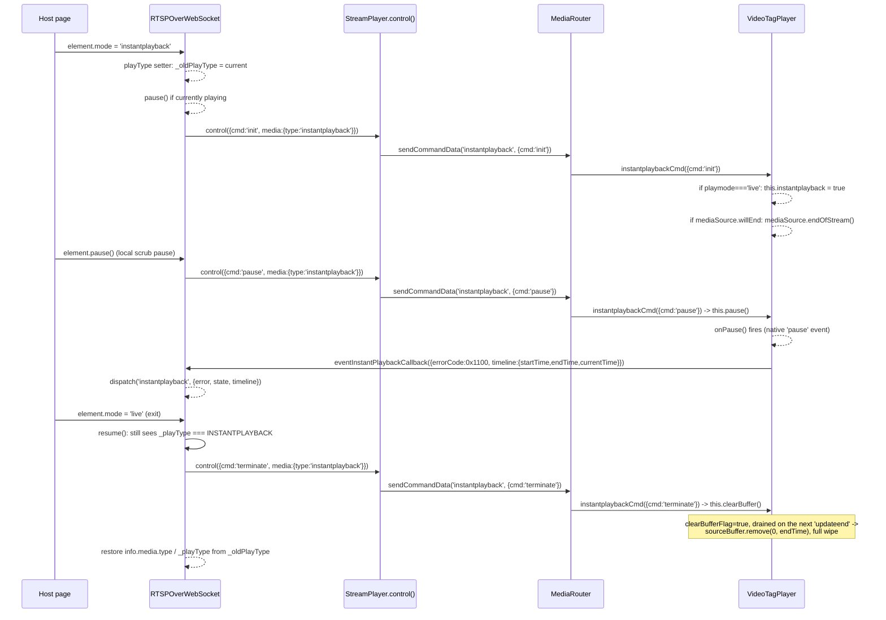

#### Timestamp cue → `RTSPOverWebSocket` flow

Every muxed video/audio sample carries its own RTP-derived wall-clock `timeStamp` (`.timestamp`/
`.timestamp_usec`/`.timezone`) alongside the encoded frame data. This class delivers that timestamp
to the outside world (ultimately, `RTSPOverWebSocket`'s public `'timestamp'` DOM event) via a
`VTTCue`-based side channel on a dedicated, invisible `TextTrack` — repurposing WebVTT `VTTCue`
objects purely as a timestamp-delivery/event-scheduling mechanism synced to `<video>` playback
position, not as real subtitle text (each cue's `text` is JSON).

**Call stack — enqueue (cue creation).** Runs synchronously inside every `createVideoSegment()`/
`createSegment()` call, right after muxing — one `VTTCue` gets `addCue()`d onto the timestamp
`TextTrack` per video sample in the box just muxed:

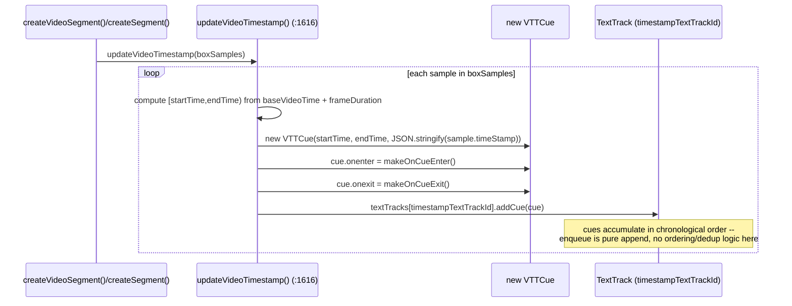

**Call stack — dequeue (cue consumption → `RTSPOverWebSocket`).** Two independent triggers can pull
a cue back out and report it — the browser's own native dispatch, or this class's own
`requestAnimationFrame` poll — but both converge on the exact same `reportCueTimestamp()` call, and
from there the call stack up through `MediaRouter` to `RTSPOverWebSocket` is identical either way:

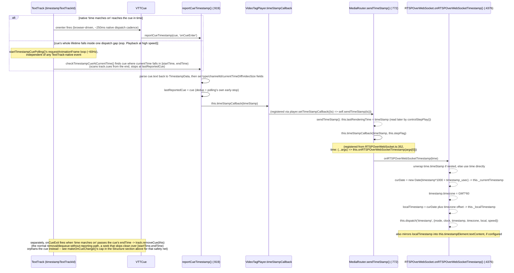

- **Where the cue comes from.** `updateVideoTimestamp(boxSamples)` (`:1616-1665`, called from
  `createVideoSegment()`/`createSegment()` right after muxing) computes each sample's
  `[startTime, endTime)` window on the running `baseVideoTime` clock, builds a `VTTCue` whose `text`
  is `JSON.stringify(sample.timeStamp)`, wires `cue.onenter`/`cue.onexit` via
  `makeOnCueEnter()`/`makeOnCueExit()` (`:1017-1054`), and calls `addCue()` on the dedicated
  timestamp `TextTrack` (`timestampTextTrackId`, created once in `init()` if the video element had no
  tracks yet). `updateAudioTimestamp()` (`:1667-1674`) advances `baseAudioTime`/`preAudioTimeStamp`
  bookkeeping but does **not** create its own cues — only the video-sample side drives this channel.
- **Two independent delivery paths, one target method.** `makeOnCueEnter()`'s closure calls
  `reportCueTimestamp(this, 'onCueEnter')` whenever the browser's native "time marches on" algorithm
  actually fires `onenter` for a cue — the normal, expected path. But `onenter`/`onexit` (and
  `TextTrack.activeCues`) share that same algorithm's dispatch cadence, which isn't fine enough to
  guarantee observing a cue whose entire lifetime falls inside one of its own scheduling gaps —
  confirmed live as missing OSD-clock updates, worst at high Playback speed. `startTimestampCuePolling()`
  (`:997-1008`, started once from `init()`, only does work while `playbackFlag`) drives
  `checkTimestampCueAtCurrentTime()` (`:963-986`) every rendered frame via `requestAnimationFrame`,
  independently searching `track.cues` (the plain, unbatched list — cues are always appended in
  chronological order, so scanning from the end finds the most recent match fastest, and hitting
  `lastReportedCue` first means everything before it was already reported) against the live
  `videoElement.currentTime`. Both paths converge on the same `reportCueTimestamp(cue, place)`
  (`:919-`).
- **`reportCueTimestamp(cue, place)`** — parses `cue.text` back to a `TimestampData` object, stamps
  `type: 'timestamp'`, `channelId`, `currentTimeDiff` (`(currentTime - cue.startTime) * 1000`, ms),
  and `videoSize`, records `cue` as `lastReportedCue` (dedup + `checkTimestampCueAtCurrentTime()`'s
  own early-stop optimization), then calls `this.timeStampCallback(timeStamp)`.
- **Where the cue's own `timeStamp.timestamp`/`timestamp_usec` come from in the first place.**
  Computed one layer up from this class entirely, in `MediaRouter.handleVideoData()` (`:811-815`,
  **Live-mode only**): `videoNTPDateTime`/`rtcpTSvideo` (set by `MediaRouter.handleRtcpData()` the
  moment the video track's RTCP Sender Report arrives — an NTP wall-clock reading paired with the
  RTP timestamp it corresponds to, RFC 3550 §6.4.1) anchor every subsequent frame's own RTP
  timestamp to real time via a fixed-clock-rate delta from that one anchor — see
  [11-canvas-tag-player.md](11-canvas-tag-player.md)'s "Timestamp callback" section for the exact
  `utcTimeStamp`/`timestamp`/`timestamp_usec` formula (identical code path, not
  `VideoTagPlayer`-specific — this class only differs in *how* the resulting timestamp gets
  delivered, via the `VTTCue` mechanism documented above, not in where the value itself comes from).
- **`MediaRouter.sendTimeStamp()` (`:772-777`)** — the callback `reportCueTimestamp()` above calls
  into:

  ```ts
  private sendTimeStamp(timeStamp: unknown): void {
    if (this.timeStampCallback !== null) {
      this.lastRenderingTime = timeStamp;
      this.timeStampCallback(timeStamp, this.stepFlag);
    }
  }
  ```

  Two effects: forwards to `MediaRouter`'s *own* registered `timeStampCallback` (the
  `RTSPOverWebSocket.ts:352` one, next), **and** stashes the raw timestamp as
  `this.lastRenderingTime` first — read exactly once elsewhere, at `MediaRouter.ts:965`
  (`self.player.controlStepPlay(self.lastRenderingTime, self.stepCmd)`): step-play (single-frame
  forward/backward) resumes from whatever timestamp the *last rendered frame* actually carried, not
  from any independently-tracked playback position.
- **`RTSPOverWebSocket.onRTSPOverWebSocketTimestamp()` (`:4392-4458`)** — registered from
  `RTSPOverWebSocket.ts:352` (`time: (...args: unknown[]) => this.onRTSPOverWebSocketTimestamp(args[0])`,
  part of the same callbacks object `StreamPlayer` wires up for `codec`/`error`/`resize`/etc.). Exact
  steps:
  1. Unwraps the input: accepts either a bare `{timestamp, timestamp_usec, ...}` object or one
     nested one level under a `.timeStamp` property (both shapes reach this method from different
     callers — see `:4738`'s backup-mode call site for the nested case).
  2. `curDate = new Date(timestamp.timestamp * 1000 + timestamp.timestamp_usec)` — the UTC instant —
     stored as `this._currentTimestamp` (ISO string).
  3. `timestamp.timezone = this.GMT * 60` (minutes), then (`GMT` always defaults to `0`, so always
     present): `localTimestamp = new Date(curDate.valueOf() + (timestamp.timezone / 60) * 3600 *
     1000)`, stored as `this._localTimestamp` (ISO string) — the same UTC instant shifted to the
     device's own local wall clock.
  4. Dispatches the public, consumer-facing `'timestamp'` `CustomEvent`
     (`01-elements-interface-exceptions.md`'s events reference) with this exact detail shape:

     | Field | Value |
     | --- | --- |
     | `mode` | `timestamp.mode` — `'live'`/`'playback'` |
     | `clock` | `timestamp.timestamp * 1000 + timestamp.timestamp_usec` — the raw UTC instant, in milliseconds |
     | `timestamp` | `this._currentTimestamp` — the same instant, as an ISO string |
     | `timezone` | `timestamp.timezone` (minutes) if set, else `this.GMT` |
     | `local` | `localTimestamp.toISOString()` — the GMT-shifted instant |
     | `speed` | `this.info.media.requestInfo.scale` — the currently-requested playback speed, unrelated to the timestamp itself but piggybacked on the same event |
  5. If a debug `timestampElement` is configured, also mirrors `localTimestamp.toISOString()` into
     its `textContent` — a live on-page clock display, independent of the dispatched event.
- **Cue cleanup.** `makeOnCueExit()`'s closure removes the cue from its `TextTrack` the moment "time
  marches on" passes `endTime` — the normal lifecycle. A currentTime jump (any row in the "Seeking"
  table above) that skips clean over a cue's `[startTime, endTime)` range means `onexit` never fires
  for it, orphaning it in the `TextTrack` forever; `makeOnCueChange()`'s `MAX_CUE_COUNT` (100) safety
  net (its own inverted-condition bug fixed 2026-09-08 — see History) is what bounds this. `close()`
  clears every remaining cue via `removeAllCues()` and stops the polling loop via
  `stopTimestampCuePolling()`.
- **`CanvasTagPlayer` has no equivalent mechanism** — it calls `timeStampCallback` directly, once per
  decoded/drawn frame, from three call sites with no `TextTrack`/`VTTCue` involved at all (no
  `<video>` element exists to attach a `TextTrack` to in the first place). See
  [11-canvas-tag-player.md](11-canvas-tag-player.md)'s own "Timestamp callback" section for the
  contrast.

- **Call Stack.**

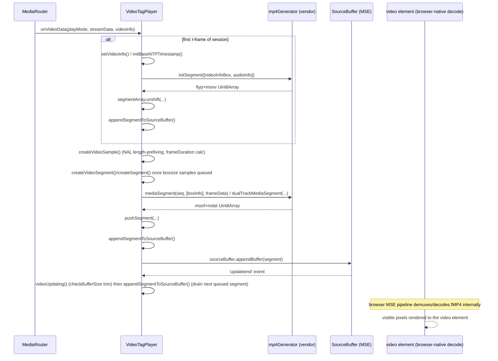

- **RFC / Standard References.**
  - **Media Source Extensions** (W3C MSE specification) — `MediaSource`, `SourceBuffer`,
    `appendBuffer`, `buffered`, `updateend`, `endOfStream`, `isTypeSupported` are all MSE APIs used
    directly.
  - **ISO Base Media File Format / fragmented MP4** (ISO/IEC 14496-12, ISOBMFF — not an IETF RFC)
    — the segments this class builds via the vendored `mp4Generator` (`initSegment`/`mediaSegment`/
    `dualTrackMediaSegment`) are `ftyp`/`moov` initialization segments and `moof`/`mdat` media
    segments per the ISOBMFF fragmented-MP4 profile (the same box structure used by MPEG-DASH/HLS
    fMP4 delivery).
  - Text-track A/V sync uses **WebVTT** `VTTCue` objects purely as a timestamp-delivery side
    channel — see "Timestamp cue → `RTSPOverWebSocket` flow" above.
  - **WebCodecs** (W3C, `AudioEncoder`) — the WebCodecs audio-transcode tier's actual encode step;
    see "Audio encoder selection" above.

- **RFC-free (internal-only) note.** The NAL Annex-B → length-prefixed (AVCC/HVCC) rewrite
  (`createSampleFrameData`/`setNalLength`) is a real ITU-T H.264/H.265 Annex B bitstream
  convention (start-code `0x00000001` framing → 4-byte big-endian length prefixing, as ISOBMFF's
  `avcC`/`hvcC` sample format requires) rather than an ad hoc format.

- **Relations & Data Flow.** Created by `StreamPlayer`'s `createVideoPlayer` factory
  (`() => new VideoTagPlayer()`), selected by `MediaRouter.selectVideoPlayer()` when `tagMode ===
  'video'` — H264 above `LIMIT_SIZE[playMode]`, H265 whenever `MediaSource.isTypeSupported` accepts
  the negotiated profile, or NVR devices. Unlike `CanvasTagPlayer` (file 11), it
  never touches `PlaybackBufferManager` (its own MSE `SourceBuffer` *is* its buffer) and never
  constructs a `CanvasRenderer`/`WebGLCanvas`/`YUVWebGLCanvas` — its only non-`VideoPlayer`
  collaborators are the vendored `mp4Generator` module, `worker/audioEncoder/WebCodecsAudioEncoder`,
  `listen/decoder/G711AudioDecoder`/`G726xAudioDecoder`, and the small `util/` helpers
  (`CircularTypedArrayQueue`, `Median`, `Mean`, `IntervalTimer`). **Video and audio together** —
  its `onAudioData` is what `MediaRouter.handleAudioData` checks for to route
  audio here instead of to the standalone `AudioPlayerGxx` decode/playback subsystem
  (`06-listen-audio.md`); real AAC/Opus/G711/G726 audio gets muxed straight into this class's own
  fMP4 `SourceBuffer` alongside video, so that subsystem is never even constructed for a
  `VideoTagPlayer` session.

- **B-frame reordering: composition-time-offset (CTS).** Unlike `CanvasTagPlayer` (whose WASM
  decoder reorders B-frames internally as ordinary decoder behavior, via `PlaybackBufferManager`'s
  jitter buffer downstream of that — see file 11), `VideoTagPlayer` hands *encoded* NAL units to the
  browser via MSE — RTP packets for a B-frame source arrive in decode order, and each one's own
  `rtpTimestamp` is still its true presentation time (RFC 3550), so the arrival-order timestamp
  sequence is inherently non-monotonic whenever a B-frame is in flight. Originally undiagnosed as
  exactly that: confirmed live via `chrome://media-internals` against this repo's own YouTube-to-RTSP
  H.265 transcoding demo (x265 uses B-frames by default even at `-preset veryfast`) — every
  session logged `Decoded frame ... is out of order` / `Dropping frame ... which is earlier than
  the last rendered frame` continuously for the whole playback, Chrome's own MSE pipeline silently
  discarding most frames (an apparent ~24fps input throttled to ~7fps displayed, with hardware
  decode confirmed active the whole time — not a decode-throughput problem). Real Hanwha camera
  encoders don't use B-frames for low-latency streaming, so `video`-tag mode against a real camera
  was never affected.

  Fixed with real ISOBMFF composition-time-offsets rather than a source-side workaround:
  `getVideoCompositionTimeOffset(streamData)` (private, live-mode only) computes, per sample,
  `presentationTime - decodeTime` where `presentationTime` is this sample's own `rtpTimestamp`
  relative to the stream's first sample (`presentationBaseRtpTimestamp`, reset in
  `initBaseNTPTimestamp()`) and `decodeTime` is `baseVideoTime` plus the summed `frameDuration` of
  any samples already buffered in `this.videoSamples` but not yet flushed — i.e. this sample's own
  position on the *existing* (unmodified) decode-time clock `getVideoFrameDuration()`/
  `baseVideoTime` already maintain. Both are scaled identically (`* TEN`), so for a non-reordered
  stream the two clocks track each other almost exactly and this evaluates to ~0 — no observable
  behavior change for the camera path this was always correct for. `createVideoSample()` stores the
  result on `VideoSample.compositionTimeOffset`, which `mp4Generator.js`'s `videoTrun()` now
  detects (`samples[0].compositionTimeOffset !== undefined`) and writes as a real, signed
  (trun version 1) `sample_composition_time_offset` per ISO/IEC 14496-12 §8.8.8 — a genuine,
  additive extension to the vendored muxer (see `mp4Generator.test.ts`'s CTS describe block for
  byte-level coverage of both the new path and the unchanged fallback), not a JS-side reordering
  buffer, since B-frame *decode* dependencies mean the samples still have to reach the browser's
  decoder in decode order regardless.

  The demo transcoding server (`src/server/services/transcodeSession.ts`) no longer forces
  `bframes=0` unconditionally — `CreateSessionRequest.bFrames` (default `true`, ffmpeg's own
  default) is now a real user-facing option (the demo's Transcoding Settings panel exposes it as
  a checkbox, enabled only for H264/H265), useful for deliberately comparing against
  `bFrames: false`'s IPPP-only/camera-like behavior rather than as a required workaround.

- **MJPEG real-MSE tier (WebCodecs `VideoEncoder`), added 2026-09-03.** `decideUseMjpegEncoder()`
  (`useMjpegEncoder` field) mirrors `decideUseBridge()`'s style (re-derives its own
  support check — `typeof VideoEncoder !== 'undefined'` — rather than trusting `MediaRouter.ts`'s
  earlier `tagMode` decision blindly) but is structurally simpler: there is no bridge-style
  fallback tier for an *encode* direction, so this either can run, or `MediaRouter.ts` should never
  have picked `'video'`/this class at all for MJPEG in the first place. `init()` sets
  `useMjpegEncoder` alongside `useBridge`, but — unlike the bridge tier — still calls
  `createMediaSource()` for it (this tier genuinely needs a real `SourceBuffer`, same as H264/H265/
  VP9/AV1's real-MSE path); the `WebCodecsVideoEncoder` itself is constructed lazily in
  `setupMjpegEncoder()`, called from the first frame each session actually reaches
  (`VideoEncoder.configure()` needs real width/height, unlike the bridge decoder which only needs a
  codec string).

  The core wrinkle this tier has that every other real-MSE codec doesn't: `VideoEncoder.encode()`
  is fire-and-forget (its `EncodedVideoChunk` output arrives later, async, via
  `mjpegEncoder.onEncodedChunk`), but `onVideoData()`'s normal path assumes `streamData.frameData`
  is the complete bitstream synchronously, right now. `submitMjpegFrame()` (called
  from `onVideoData()` in place of the normal synchronous `ingestVideoSample()` call whenever
  `useMjpegEncoder`) hands the raw JPEG to the encoder and records a `mjpegPendingFrames` entry
  (original RTP-derived `streamData`/`videoInfo`, keyed by a caller-assigned `timestampUs` —
  purely internal `VideoFrame` bookkeeping, unrelated to real presentation timing);
  `onMjpegEncodedChunk()` is the async replay half — matches a chunk back to its
  pending entry by that same `timestampUs` (a mismatch, e.g. from a mid-flight encoder `error`
  silently dropping an `encode()` call's output, is detected and the chunk dropped rather than
  risk misattributing it to the wrong frame), parses the chunk's `description` (present on the
  first chunk) via `avcConfigParser.ts`'s `parseAvcConfigurationRecord()`/`buildAvc1CodecString()`
  into `mjpegAvcConfig`, builds a synthesized `streamData`/`videoInfo` pair (`codecType: 'H264'`,
  `frameType` from `chunk.type`, `spsPayload`/`ppsPayload`/`profileIdc`/`levelIdc`/`codecInfo` from
  the parsed avcC), and feeds it through `ingestVideoSample()` — the SAME
  init-segment-once + `createVideoSample()`-every-time logic every synchronous codec's
  `onVideoData()` branch uses, extracted out specifically so this async path doesn't duplicate it
  (including `videoCodecInfo`'s own population, which `setSourceBuffer()`'s MIME-codecs string
  needs and is otherwise an easy new-call-site omission).

  `createSampleFrameData()` gained a third `isEncoderSourced` parameter for this tier
  specifically: a `VideoEncoder` configured with `avc: { format: 'avc' }` (the default) already
  emits length-prefixed AVCC bytes, so `isEncoderSourced` frames skip the Annex-B-start-code
  rewrite entirely (same early-return VP8/VP9/AV1 already take, just for a different reason) —
  without it, encoder output tagged `codecType: 'H264'` (needed for `mp4Generator.js`'s box-type
  dispatch) would otherwise hit that rewrite and corrupt already-correct bytes. Backpressure
  (`MJPEG_ENCODER_MAX_QUEUE_SIZE`, checked in `submitMjpegFrame()`) never drops a frame while
  `mjpegAvcConfig === null` (no init segment yet, so playback could never start at all without
  it); keyframe cadence (`MJPEG_ENCODER_KEYFRAME_INTERVAL`, `mjpegFramesSinceKeyFrame`) forces a
  periodic `VideoEncoder` keyframe, since MJPEG's own source frames carry no GOP signal of their
  own to derive one from. `close()` calls the new `closeMjpegEncoder()` alongside the existing
  `closeBridge()`. See `MEMORY.md` for the full narrative and the `mp4Generator.js` dead-MJPEG-
  branch (`mpv4`/`esds` stsd, unrelated to this — nothing reaches it) this tier deliberately avoids.

- **`setSourceBuffer()`/`ingestVideoSample()` `SourceBuffer`-creation race, found live via a
  synthetic-JPEG Playwright harness (not by the demo pipeline above, which turned out to have its
  own separate, pre-existing gap — see `MEMORY.md`).** `setSourceBuffer()`'s only call site is the
  `'sourceopen'` listener, and it needs `this.videoCodecInfo` (only set once a real video frame has
  been ingested) to build its MIME/codecs string — if `'sourceopen'` fires first, `isTypeSupported`
  fails on a `"null"` codec string, `this.sourceBuffer` stays `null`, and `addBufferEventListener()`
  — called unconditionally right after regardless — threw `Cannot read properties of null (reading
  'addEventListener')`, permanently aborting `SourceBuffer` creation for the whole session. Not
  MJPEG-specific (the same race exists for H264/H265/VP9/AV1 too — they'd never before had a real
  async gap before their first sample makes it likely to actually trigger), but this tier's
  unavoidable `createImageBitmap()`/`VideoEncoder.configure()` round trip before the first sample
  can exist makes it the first one to hit it reliably. Fixed with two general (not MJPEG-gated)
  changes: `setSourceBuffer()` only calls `addBufferEventListener()` when `this.sourceBuffer !==
  null`; `ingestVideoSample()` retries `setSourceBuffer()` itself right after `createInitSegment()`
  if `this.sourceBuffer` is still `null` at that point (a safe no-op once one already exists, per
  `setSourceBuffer()`'s own `sourceBuffers.length === 0` guard). See `MEMORY.md` for the full
  live-debugging narrative, including the screenshot that confirmed real decoded pixels post-fix.

- **`mjpegEncoderCandidateCodecStrings()` resolution-awareness, found live against a real camera at
  2048x1536.** The candidate list used to be one fixed Level 3.1/4.0 pair, which
  `VideoEncoder.isConfigSupported()` correctly rejected for any resolution whose macroblock count
  exceeds those levels' `maxFS` (H.264 Annex A Table A-1) — MJPEG has no codec-level resolution
  ceiling the way H264/H265 do, so this silently broke the whole tier for real (non-~720p) camera
  resolutions, with only a `console.error` in `WebCodecsVideoEncoder`'s own `configure()` as any
  visible signal. `util/codecString.ts` now computes the actually-required level from the real
  `pixelCount`/`framerate` (`H264_LEVEL_LIMITS`, `selectH264LevelIndexes()`) instead of guessing one
  — see `08-util.md` and `MEMORY.md`.

- **Playback-mode dual-track segment flush deadlock with no audio track, found live immediately
  after Live mode was confirmed working end to end.** `createSegment()` (Playback's `moof+mdat`
  builder, shared with every real-MSE codec, not MJPEG-specific) requires both video *and* audio
  samples queued before building anything; dummy-audio seeding only ran from the *second* I-frame
  boundary onward, so a session with no real audio and either a short clip or an infrequent keyframe
  cadence (MJPEG's own re-encoded stream keyframes only every 60 frames) could permanently deadlock
  with zero segments ever appended — no crash, no error, just nothing plays. `createSegment()` now
  seeds dummy audio itself whenever none is queued yet, capped to stay on `makeDummyAudio()`'s safe
  direct-add path (its own `>100000` branch silently no-ops for a multi-sample span, a trap the
  first fix attempt hit before landing on the cap). See `MEMORY.md` for the full narrative.

- **`initBaseAudioTime()` corrupting `baseVideoTime` (not `baseAudioTime`) on every Playback
  A/V-drift resync, the most serious bug in this saga.** Playback video now appeared (previous
  bug's fix) but played back corrupted — a burned-in OSD timestamp visibly oscillating, 20+s
  latency, a 2fps source appearing to play at a mismatched frame rate. Two layers, found with a
  synthetic-JPEG Playwright trace reading back a distinct per-frame hue from a sampling canvas at
  realistic 2fps/500ms pacing: (a) `createSegment()`'s `MAX_PLAYBACK_DIFF` fallback timeout was only
  ever *scheduled* from `createVideoSample()`'s I-frame-boundary code, so once consumed, nothing
  rescheduled another until the next real keyframe — a real `VideoEncoder` inserts keyframes on its
  own internal cadence, independent of this tier's `forceKeyFrame` request hint, causing multi-second
  stalls; fixed by rescheduling `createVideoSegmentTimeout` unconditionally at the top of every
  `createSegment()` call. (b) `initBaseAudioTime()` (called whenever `baseAudioTime` is the `-1`
  "needs (re)init" sentinel — at session start, and again every `resetBaseDecodingTime()` resync)
  reassigned `this.baseVideoTime` from an *absolute* wall-clock-anchored formula whenever it was
  falsy — harmless the first time (already 0 by default), but `resetBaseDecodingTime()` also zeroes
  `baseVideoTime` itself, Playback-only, so every mid-session resync re-triggered this falsy check
  and clobbered the purely-relative running clock with an absolute millisecond-scale value (confirmed
  live: `baseVideoTime` jumping from ~65,000 to ~75,000,000 between consecutive calls). Live mode's
  own resync never zeroes `baseVideoTime` first, so never hit this. Fixed by deleting the destructive
  reassignment — nothing needs deriving there at all. See `MEMORY.md` for the full narrative.

- **A/V-drift resync comparing real `baseVideoTime` against *synthetic* dummy-audio `baseAudioTime`,
  the root cause the previous bug's fixes didn't reach.** `onWaiting()`'s drift check
  (`Math.abs(baseVideoTime - baseAudioTime) > 20000`) ran unconditionally, even when `dummyAudio` is
  `true` — MJPEG's re-encoder tier has no real audio at all, so `baseAudioTime` only advances via
  `makeDummyAudio()`'s synthetic seeding, an approximation for MSE's technical audio-track
  requirement, not a real timing signal. Dummy audio routinely drifts past the 2s threshold with no
  actual desync, triggering `resetBaseDecodingTime()` to zero `baseVideoTime` and discard several
  already-buffered real seconds; every subsequently-muxed segment's PTS then landed back inside the
  already-covered buffered range instead of extending it, freezing `SourceBuffer.buffered.end()`
  despite appends continuing to succeed (confirmed via direct instrumentation logging
  `{baseVideoTime, baseAudioTime, dummyAudio}` at the exact freeze moment: `{85000, 58880, true}`) —
  and because this re-triggered on nearly every subsequent 'waiting' event, playback stayed
  permanently pinned just past the first reset, matching the reported OSD cycling and the "2fps in,
  ~7fps out" mismatch. Fixed by skipping the resync check entirely while `dummyAudio` is `true`; a
  real second audio track's resync behavior is unchanged. See `MEMORY.md` for the full trace narrative.

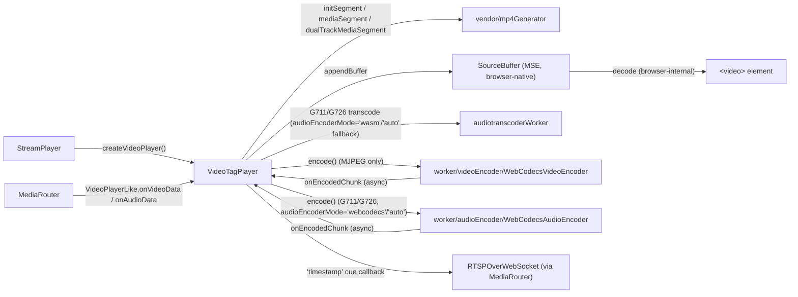

---

### `vendor/mp4Generator.d.ts` (type-only reference)

Not a class — a hand-written `.d.ts` for the vendored, unmodified mux.js-derived fMP4 box builder
(`src/player/vendor/mp4Generator.js`, ported verbatim like `ffmpeg.js`/`ffmpegAAC.js`/
`minizip-asm.js` elsewhere in this codebase). It exposes exactly the surface `VideoTagPlayer`
actually calls:
- `initSegment(tracks: (Mp4VideoTrackInfo | Mp4AudioTrackInfo)[]): Uint8Array` — builds the
  `ftyp`+`moov` initialization segment for one or two tracks.
- `mediaSegment(sequenceNumber, tracks: [Mp4BoxInfo], data: Uint8Array): Uint8Array` — builds a
  single-track `moof`+`mdat` media segment.
- `dualTrackMediaSegment(sequenceNumber, tracks: [Mp4BoxInfo, Mp4BoxInfo], data: [Uint8Array,
  Uint8Array]): Uint8Array` — builds a combined video+audio `moof`+`mdat` segment.

Supporting types (`Mp4TimeStamp`, `Mp4Sample`, `Mp4VideoTrackInfo`, `Mp4AudioTrackInfo`,
`Mp4BoxInfo`) describe exactly the shapes `VideoTagPlayer` constructs and passes in — not the full
internal box-building surface of the underlying JS. See `VideoTagPlayer`'s section above for how
each of these three functions is actually invoked.

For the actual box tree these three functions build inside `mp4Generator.js` — the `ftyp`/`moov`/
`stsd`/`moof`/`traf`/`trun` structure, every codec's sample-entry/config-box byte layout, and known
dead-code quirks — see [09-mp4-container-generation.md](09-mp4-container-generation.md).

---

## Video-tag relations diagram

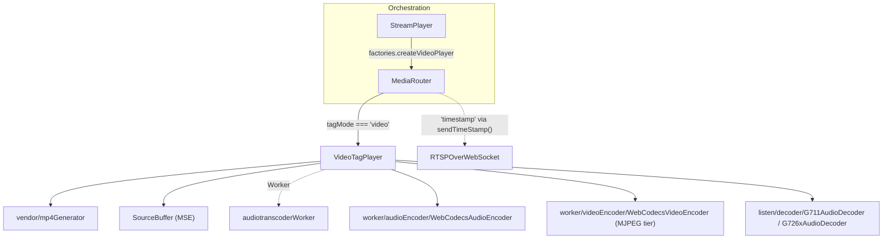

See [11-canvas-tag-player.md](11-canvas-tag-player.md)'s own relations diagram for the sibling
canvas/WebGL pipeline, and both files' History for what moved where.
