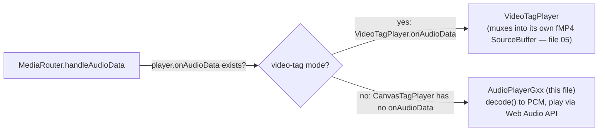
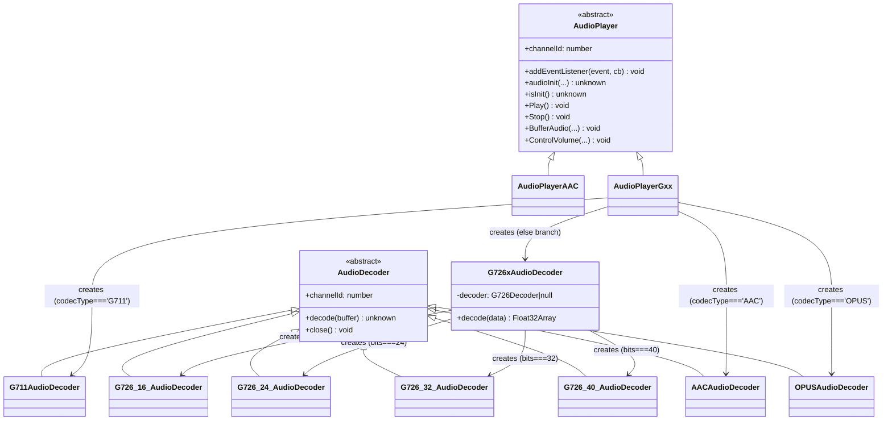

# `listen` — Audio Decode + Playback

*Per-class reference for `src/player/listen/decoder/*` and `src/player/listen/renderer/*` — the audio decode and
playback subsystem, including decode math/tables and Web Audio API / MSE usage.*

**Version:** 1.1.0 · **Author:** Youngho Kim

**History**

| Date | Change |
| --- | --- |
| 2026-08-06 | Add per-class reference docs for `src/player` (initial version) |
| 2026-08-13 | Load `ffmpegAAC.decoder.js`'s Module before AAC canvas-tag audio decode; cross-link canvas/video-tag audio routing in docs |
| 2026-08-26 | Added Title/Abstract/Version/Author/History metadata header |
| 2026-09-04 | Added `debug`-gated `console.log` tracing (`util/debugLog.ts`, `debug["listen"]` — see `01-elements-interface-exceptions.md`'s new `debug` attribute and `08-util.md`). `AudioPlayer` (the shared base `AudioPlayerGxx`/`AudioPlayerAAC` both extend) gained a `debug` setter — logged as the fixed literal name `'AudioPlayer'` regardless of which concrete subclass, since `MediaRouter`'s `createAudioPlayer()` factory call site is generic and doesn't distinguish them (unlike `video`'s `VideoPlayer`, which does — see `05`); `debug["listen"]: ["AudioPlayer"]` is the matching filter name for both. `AudioDecoder` (base for `AACAudioDecoder`/`G711AudioDecoder`/`G726_16/24/32/40_AudioDecoder`/`OPUSAudioDecoder`) instead got `Session`-style `setDebugConfig(config, componentName)`, since `AudioPlayerGxx.audioInit()` always knows exactly which decoder class it's about to construct at each branch (mirrors `RtpClient`'s own reasoning in `03`) — a literal name like `'AACAudioDecoder'`, never `constructor.name`. `G726xAudioDecoder` (a thin dispatcher wrapping the four bit-depth variants, not itself an `AudioDecoder` subclass) forwards `setDebugConfig()` to whichever concrete decoder it picked. `AACAudioDecoder`'s own two `console.log` calls (`'Construct AAC Codec'`/`'AAC Decoder init'`) were deliberately **left untouched** — that file's own doc comment states they're preserved-faithfully legacy behavior, always-on by design, not something this feature should gate. |

---

This document is per-class reference documentation for `src/player/listen/decoder/*` and
`src/player/listen/renderer/*` — the audio decode and playback subsystem. It goes deeper than the
class-diagram summary in [src/player/README.md §6](../../src/player/README.md) — actual decode
math/tables and the Web Audio API / MSE usage for playback — but does not re-document the
mediaSession/audioSession classes that feed it (`AACSession`, `G711Session`, `G726Session`,
`OPUSSession`, all under `src/player/mediaSession/audioSession/`) or `MediaRouter`, which are
covered elsewhere; they're referenced here only as collaborators.

## Module layout

```
listen/
├── decoder/
│   ├── AudioDecoder.ts            <<abstract>> base class
│   ├── AACAudioDecoder.ts         AAC → PCM via vendored ffmpeg asm.js build
│   ├── G711AudioDecoder.ts        G.711 µ-law/A-law → PCM (pure JS table math)
│   ├── G726_16_AudioDecoder.ts    G.726 ADPCM @ 16 kbit/s (2 bits/sample)
│   ├── G726_24_AudioDecoder.ts    G.726 ADPCM @ 24 kbit/s (3 bits/sample)
│   ├── G726_32_AudioDecoder.ts    G.726 ADPCM @ 32 kbit/s (4 bits/sample)
│   ├── G726_40_AudioDecoder.ts    G.726 ADPCM @ 40 kbit/s (5 bits/sample)
│   ├── G726xAudioDecoder.ts       dispatcher/facade selecting one of the four G.726 decoders
│   └── OPUSAudioDecoder.ts        Opus → PCM via the browser's native WebCodecs AudioDecoder
└── renderer/
    ├── AudioPlayer.ts             <<abstract>> base class
    ├── AudioPlayerAAC.ts          plays AAC via a hidden <audio> element + MSE SourceBuffer
    └── AudioPlayerGxx.ts          decodes+plays G.711/G.726/AAC/Opus via the Web Audio API
```

`AudioPlayerAAC` exists in the source tree but — per `AudioPlayerGxx.ts`'s `audioInit()` — is not
actually wired up for the `'AAC'` codec branch; `AudioPlayerGxx` handles AAC (and Opus) itself via
`AACAudioDecoder`/`OPUSAudioDecoder`, so `AudioPlayerAAC` is effectively a second, currently-unused
AAC playback path preserved from the legacy port. It is documented in full below regardless, since
it's one of the files in scope.

## Where this subsystem fits: canvas-tag vs. video-tag audio routing

Everything in this file is reachable from exactly one of the two audio-dispatch branches in
`MediaRouter.handleAudioData` (documented in full in `03-mediaSession-core-video.md`): it either
forwards the frame to `player.onAudioData` — implemented only by `VideoTagPlayer`
(`05-video-player-rendering.md`), which muxes real audio directly into its own fMP4
`SourceBuffer` and needs none of this subsystem — or, when the active player has no
`onAudioData` of its own, falls back to a standalone `AudioPlayerGxx` (this file), decoding
frame-by-frame to PCM and playing it through the Web Audio API instead.

`CanvasTagPlayer` (`05-video-player-rendering.md`) is the only other `VideoPlayerLike`
implementation, and it declares no `onAudioData` at all — so in practice this whole subsystem
(`AudioPlayerGxx` and every decoder below) is **canvas-tag-mode-only** audio: MJPEG, small/
step-play H264, H265 profiles the browser's `MediaSource` can't accept, and VP8/VP9/AV1 (see
`MediaRouter.selectVideoPlayer` in file 03 for exactly which combinations land on canvas mode).
Whenever `VideoTagPlayer` is the active player, `AudioPlayerGxx` is never even constructed —
audio for that session is entirely file 05's concern, muxed alongside video into the same MP4
container the `<video>` element plays.





Note `G726xAudioDecoder` is *not* in the `AudioDecoder <|--` chain — confirmed in code
(`G726xAudioDecoder.ts:9`, `export class G726xAudioDecoder` with no `extends`). It is a plain
dispatcher/facade that owns one concrete `G726_xx_AudioDecoder` instance chosen by the `bits`
constructor argument and forwards `decode()` to it, converting the `Int16Array` result to a
normalized `Float32Array` on the way out (see its Method Analysis below).

---

### `AudioDecoder` (`src/player/listen/decoder/AudioDecoder.ts`)

- **Structure** — The abstract root of the decoder hierarchy (`src/player/listen/decoder/AudioDecoder.ts:1-9`).
  One field: `channelId = 0`. No constructor beyond the implicit default. Every concrete audio
  decoder except `G726xAudioDecoder` and `OPUSAudioDecoder` (which imports it as
  `AudioDecoderBase`) extends this directly.
- **Method Analysis**
  - `decode(_buffer: unknown): unknown` — no-op stub, returns `undefined`. All real subclasses
    override it with a concrete signature (`ArrayLike<number> -> Float32Array` or `Int16Array`).
  - `close(): void` — no-op stub. Overridden only by `AACAudioDecoder` and `OPUSAudioDecoder`,
    both of which own an external resource (an Emscripten decode context / a WebCodecs
    `AudioDecoder`) that needs explicit teardown; `G711AudioDecoder` and the `G726_*` decoders
    hold no such resource and never override it.
- **Call Stack** — N/A; this class is never instantiated directly, only through its subclasses (see
  each subclass's Call Stack below).
- **RFC / Standard References** — None; this is a pure structural base class.
- **Relations & Data Flow** — Base type for the whole decoder hierarchy; `AudioPlayerGxx` holds
  its decoder instances typed as the narrower `AudioDecoderLike` interface it defines itself (see
  `AudioPlayerGxx` below), not as `AudioDecoder`, so this class's contribution is really just the
  shared `channelId` field and the inheritance shape shown in the diagram above.

---

### `AACAudioDecoder` (`src/player/listen/decoder/AACAudioDecoder.ts`)

- **Structure** (`AACAudioDecoder.ts:21-79`) — Extends `AudioDecoder`. Fields:
  - `context: number | null` — opaque pointer (as a number) into the Emscripten heap identifying
    the decode context.
  - `outpic: Float32Array` — a typed-array *view* directly onto the Emscripten heap
    (`Module.HEAPF32.buffer`) at the address returned by `Module._malloc(OUTPIC_SIZE)`
    (`OUTPIC_SIZE = 4096`), used as the decoder's scratch output buffer.
  - Three `readonly` bound-function fields — `initDecoder`, `decodeAacByFfmpeg`, `closeContext` —
    each produced by `Module.cwrap(...)`, i.e. thin JS wrappers around C functions exported by the
    vendored `ffmpegAAC.js` asm.js build (`vendor/ffmpegAAC.decoder.js`, referenced via the
    `vendor/EmscriptenModule.d.ts` ambient type). This confirms the "delegates to a WASM/vendor
    decoder" expectation for AAC — there's no JS-native AAC decode math in this class at all; it's
    a thin FFI wrapper.
  - The constructor takes no arguments, calls `super()`, logs `'Construct AAC Codec'`, `cwrap`s the
    three native entry points, and calls `this.init()`. It assumes the global `Module` object (the
    Emscripten module) is already loaded before construction — loading that vendor script is
    `elements/RTSPOverWebSocket.ts`'s responsibility, not this class's.
- **Method Analysis**
  - `init(): void` — if a `context` already exists, closes it first (defensive re-init guard),
    then calls the native `init_aac_jsFFmpeg()` to obtain a fresh context handle, `Module._malloc`s
    a 4096-byte scratch buffer, and wraps it as `this.outpic` (a `Float32Array` view over that
    heap region).
  - `decode(buffer: ArrayLike<number>): Float32Array` — the actual decode step: if `context` is
    `null` (only possible after `close()`), it returns `null` cast to `Float32Array` (an
    intentionally-preserved legacy quirk — callers don't null-check, so this reproduces the same
    crash-if-called-after-close behavior rather than silently returning an empty array). Otherwise
    it calls the native `decode_aac_jsFFmpeg(context, buffer, buffer.length, outpic.byteOffset,
    OUTPIC_SIZE)` — passing the raw AAC access-unit bytes and the scratch buffer's heap offset —
    then copies the first 1024 floats out of `outpic` into a fresh `Float32Array(1024)` (one AAC
    frame is 1024 PCM samples per channel) and returns it.
  - `close(): void` — if a context is open, calls native `close_jsFFmpeg(context)` and nulls the
    field.
- **Call Stack**

  ```mermaid
  sequenceDiagram
      participant AACSession as mediaSession/audioSession/AACSession
      participant MR as MediaRouter.handleAudioData
      participant Gxx as AudioPlayerGxx
      participant Dec as AACAudioDecoder
      participant WASM as ffmpegAAC.js (Module/cwrap)

      AACSession->>MR: depacketized AAC access unit (streamData.frameData + ADTS header)
      MR->>Gxx: BufferAudio(frameData, rtpTimestamp)
      Gxx->>Dec: decode(data)
      Dec->>WASM: decode_aac_jsFFmpeg(context, buffer, len, outpicPtr, OUTPIC_SIZE)
      WASM-->>Dec: PCM samples written into outpic (HEAPF32 view)
      Dec-->>Gxx: Float32Array(1024) PCM
      Gxx->>Gxx: playAudioIn(pcm, rtpTimestamp) → AudioBufferSourceNode
  ```

- **RFC / Standard References** — The AAC bitstream/decode itself follows MPEG-4 Audio
  (ISO/IEC 14496-3), not an IETF RFC. Its RTP transport (how `AACSession` extracts access units
  from RTP packets before handing them here) is RFC 3640 ("RTP Payload Format for Transport of
  MPEG-4 Elementary Streams"). This class only implements the codec/decode side; the RTP framing
  is `AACSession`'s concern.
- **Relations & Data Flow** — Constructed by `AudioPlayerGxx` (directly, or via the injectable
  `aacAudioDecoderFactory` constructor parameter used by tests to avoid needing the real vendored
  `Module` global). Source of its input is `AACSession` via `MediaRouter.handleAudioData` →
  `AudioPlayerGxx.BufferAudio`. Not used by `AudioPlayerAAC`, which takes a completely different
  (MSE-based) approach and never touches this class.

  ```mermaid
  flowchart LR
      AACSession -->|RTP AAC access units| MediaRouter
      MediaRouter -->|BufferAudio| AudioPlayerGxx
      AudioPlayerGxx -->|decode| AACAudioDecoder
      AACAudioDecoder -->|cwrap FFI| ffmpegAAC_asm_js[("vendor/ffmpegAAC.decoder.js<br/>(Module)")]
      AACAudioDecoder -->|Float32Array PCM| AudioPlayerGxx
  ```

---

### `G711AudioDecoder` (`src/player/listen/decoder/G711AudioDecoder.ts`)

- **Structure** (`G711AudioDecoder.ts:37-69`) — Extends `AudioDecoder`. One field: `mime:
  G711Mime = 'PCMU'` (the exported type `G711Mime = 'PCMU' | 'PCMA'`), set by the caller
  (`AudioPlayerGxx.audioInit`) right after construction to select µ-law vs A-law. Two
  module-level pure functions implement the codec math: `alaw2linearPcm` and `ulaw2linearPcm`,
  using the standard ITU-T G.711 constants `BIAS = 0x84`, `SIGN_BIT = 0x80`, `QUANT_MASK = 0xf`,
  `SEG_SHIFT = 4`, `SEG_MASK = 0x70`.
- **Method Analysis**
  - `ulaw2linearPcm(uVal)` (module-level, `:28-33`) — standard µ-law expansion: bitwise-inverts
    the input (`uValc = ~uVal`), extracts the 4-bit mantissa `(uValc & QUANT_MASK)`, scales by 8
    and adds `BIAS`, then left-shifts by the 3-bit exponent/segment `(uValc & SEG_MASK) >>
    SEG_SHIFT`; the sign bit (`uValc & SIGN_BIT`) selects `BIAS - t` (negative) or `t - BIAS`
    (positive). This is the textbook segment-based µ-law-to-linear table algorithm (equivalent to
    ITU-T G.711's µ-law compansion table), implemented arithmetically rather than via a literal
    256-entry lookup table.
  - `alaw2linearPcm(aVal)` (module-level, `:10-26`) — standard A-law expansion: XORs the input
    with `0x55` (A-law's even-bit-inversion convention), extracts mantissa/segment the same way,
    and reconstructs via a `switch` on the 3-bit segment (`seg 0` and `seg 1` are special-cased per
    the G.711 A-law spec's linear-near-zero segments; `seg >= 2` uses `t = (t + 0x108) << (seg -
    1)`); sign bit again selects the output's polarity.
  - `decode(buffer: ArrayLike<number>): Float32Array` — for each input byte, dispatches to
    `ulaw2linearPcm` or `alaw2linearPcm` based on `this.mime`, producing one 16-bit PCM sample
    per input byte into an `Int16Array`. An unreachable-in-practice `else` branch throws a well-formed
    `RTSPOverWebSocketError` (errorCode `0x0310`) for an invalid `mime` — replacing a legacy branch
    that referenced undefined globals and would itself have thrown a raw `ReferenceError`. Finally,
    every sample is normalized to `[-1, 1]` float range by dividing by `2^15` into a returned
    `Float32Array`, matching the range Web Audio API buffers expect.
- **Call Stack**

  ```mermaid
  sequenceDiagram
      participant G711Session as mediaSession/audioSession/G711Session
      participant MR as MediaRouter.handleAudioData
      participant Gxx as AudioPlayerGxx
      participant Dec as G711AudioDecoder

      G711Session->>MR: depacketized G.711 payload (1 byte/sample, PCMU or PCMA)
      MR->>Gxx: BufferAudio(frameData, rtpTimestamp)
      Gxx->>Dec: decode(data)
      Dec->>Dec: ulaw2linearPcm(byte) or alaw2linearPcm(byte), per this.mime
      Dec-->>Gxx: Float32Array PCM (normalized to [-1,1])
      Gxx->>Gxx: playAudioIn(pcm, rtpTimestamp) → AudioBufferSourceNode
  ```

- **RFC / Standard References** — The codec itself is ITU-T Recommendation G.711 ("Pulse code
  modulation (PCM) of voice frequencies", the µ-law/A-law companding algorithm) — an ITU-T
  standard, not an IETF RFC. Its RTP transport (payload types 0/PCMU and 8/PCMA, one octet per
  sample, no framing) is defined by RFC 3551 ("RTP Profile for Audio and Video Conferences with
  Minimal Control").
- **Relations & Data Flow** — Constructed by `AudioPlayerGxx.audioInit()` when `codecType ===
  'G711'`; `mime` is set immediately after construction from `codecMime` (`'PCMU'`/`'PCMA'`, as
  reported by `G711Session`/SDP). Source of its input is `G711Session` via
  `MediaRouter.handleAudioData` → `AudioPlayerGxx.BufferAudio`.

---

### `G726_16_AudioDecoder` (`src/player/listen/decoder/G726_16_AudioDecoder.ts`)

- **Structure** (`:9-51`) — Extends `AudioDecoder`. Fields: `commonAudioUtil = new
  CommonAudioUtil()` (the shared ADPCM DSP helper, `src/player/util/CommonAudioUtil.ts`) and
  `state: G726State = this.commonAudioUtil.g726_init_state()` — the codec's running predictor
  state (predictor coefficients `a`/`b`, quantized-difference history `dq`, reconstructed-sample
  history `sr`, step-size adaptation state `yl`/`yu`/`dms`/`dml`/`ap`/`td`). One instance = one
  independent decode stream with its own state, matching the fact that ADPCM decode is inherently
  stateful/sequential (each sample's decode depends on prior samples).
  Module-level constant tables sized for a 4-level (2-bit) codeword: `DQLNTAB` (quantized
  difference, log domain), `WITAB` (step-size adaptation speed), `FITAB` (fast/slow adaptation
  mix), each with 4 entries — one per possible 2-bit code.
- **Method Analysis**
  - `decodeSample(iIn, outCoding)` (private) — the ADPCM decode step for one codeword `i = iIn &
    0x03` (masked to 2 bits, since 16 kbit/s = 2 bits/sample at 8 kHz): computes the zero-section
    predictor `sezi = predictor_zero(state)`, adds the pole-section predictor
    `predictor_pole(state)` to get the total predicted signal estimate `se`, looks up the adaptive
    step size `y = step_size(state)`, reconstructs the quantized difference `dq =
    reconstruct(sign, DQLNTAB[i], y)`, adds/subtracts from `se` to get the reconstructed sample
    `sr`, computes the predictor error signal `dqsez`, and finally calls
    `commonAudioUtil.update(2, y, WITAB[i], FITAB[i], dq, sr, dqsez, state)` to advance the
    adaptive predictor/step-size state for the next sample (`2` here is a G.726 `code_size`
    parameter — see `G726xAudioDecoder`'s central note on `code_size` = bits-per-sample per
    variant). Only `AUDIO_ENCODING_LINEAR` output coding is implemented (`case
    AUDIO_ENCODING_LINEAR: return sr << 2`, upscaling from the codec's internal 14-bit range to
    16-bit linear PCM); anything else returns `-1`.
  - `decode(buffer: ArrayLike<number>): Int16Array` — each input byte packs **four** 2-bit
    codewords (MSB-first), unpacked via `buffer[i] >> 6`, `>> 4`, `>> 2`, and the raw byte itself
    (implicitly masked to 2 bits inside `decodeSample`), each fed through `decodeSample` to
    produce four 16-bit PCM samples per input byte. Note: `decoded[n++] = res & 0x0000ff00` masks
    the result to bits 8-15 only (not a full 16-bit store) — this mirrors the legacy behavior byte
    for byte and is preserved verbatim.
- **Call Stack** — see the shared G.726 call stack under `G726xAudioDecoder` below (all four
  bitrate variants share the same call path, differing only in which concrete decoder
  `G726xAudioDecoder` picks).
- **RFC / Standard References** — ITU-T Recommendation G.726 ("40, 32, 24, 16 kbit/s Adaptive
  Differential Pulse Code Modulation (ADPCM)") — an ITU-T standard, not an IETF RFC. RTP transport
  for G.726 is covered by RFC 3551 (which defines the "G726-16"/"G726-24"/"G726-32"/"G726-40"
  encoding names and octet-packing conventions referenced by `G726Session`).
- **Relations & Data Flow** — Never constructed directly by `AudioPlayerGxx`; only reachable
  through `G726xAudioDecoder`'s `bits === 16` branch. Depends on `CommonAudioUtil` for all
  predictor/quantizer math (shared with the other three G.726 variants).

---

### `G726_24_AudioDecoder` (`src/player/listen/decoder/G726_24_AudioDecoder.ts`)

- **Structure** (`:9-63`) — Same shape as `G726_16_AudioDecoder` (extends `AudioDecoder`, owns a
  `CommonAudioUtil` + `G726State`). Tables sized for an 8-level (3-bit) codeword: `DQLNTAB`,
  `WITAB`, `FITAB` each with 8 entries.
- **Method Analysis**
  - `decodeSample(iIn, outCoding)` — identical structure to the 16 kbit/s variant but masks `i =
    iIn & 0x07` (3 bits), passes `code_size = 3` to `commonAudioUtil.update(...)`, and uses the
    8-entry tables. Output clamping is not applied here (unlike the 32 kbit/s variant) — `sr << 2`
    is returned as-is.
  - `decode(buffer: ArrayLike<number>): Int16Array` — 24 kbit/s packs 8 codewords (3 bits each)
    into every **3** input bytes: the loop steps `i += 3` and extracts each 3-bit codeword via a
    sequence of shifts/masks that can span a byte boundary (e.g. `(buffer[i] << 1) | (buffer[i + 1]
    >> 7)` for the codeword straddling bytes 0 and 1). Output buffer is sized
    `Math.floor((buffer.length * 8) / 3)` samples (8 samples per 3 input bytes). The loop condition
    `i < buffer.length - 3` means a trailing partial group of fewer than 3 bytes is silently
    dropped.
- **Call Stack / Relations & Data Flow** — same as `G726_16_AudioDecoder` above; only reachable via
  `G726xAudioDecoder`'s `bits === 24` branch.
- **RFC / Standard References** — same as `G726_16_AudioDecoder` (ITU-T G.726; RTP transport
  RFC 3551).

---

### `G726_32_AudioDecoder` (`src/player/listen/decoder/G726_32_AudioDecoder.ts`)

- **Structure** (`:9-51`) — Same shape as the other G.726 variants. Tables sized for a 16-level
  (4-bit) codeword: `DQLNTAB`, `WITAB`, `FITAB` each with 16 entries.
- **Method Analysis**
  - `decodeSample(iIn, outCoding)` — masks `i = iIn & 0x0f` (4 bits), passes `code_size = 4`, and
    notably passes `WITAB[i] << 5` (not the raw table value) into `update(...)` — a scaling
    adjustment specific to this variant's table. Unlike the other three variants, this one clamps
    its linear output: `lino = sr << 2` is clamped to `[-32768, 32767]` before being returned —
    the only G.726 variant here with explicit int16 saturation.
  - `decode(buffer: ArrayLike<number>): Int16Array` — 32 kbit/s packs exactly 2 codewords (4 bits
    each) per input byte — the simplest packing of the four variants, no byte-boundary spanning:
    high nibble `(0xf0 & buffer[i]) >> 4` decoded first, then low nibble `0x0f & buffer[i]`.
    Output buffer is `buffer.length * 2` samples.
- **Call Stack / Relations & Data Flow** — same pattern as above; reachable via
  `G726xAudioDecoder`'s `bits === 32` branch (also the default/most common G.726 bitrate in
  practice).
- **RFC / Standard References** — same as `G726_16_AudioDecoder` (ITU-T G.726; RTP transport
  RFC 3551).

---

### `G726_40_AudioDecoder` (`src/player/listen/decoder/G726_40_AudioDecoder.ts`)

- **Structure** (`:18-73`) — Same shape as the other G.726 variants. Tables sized for a 32-level
  (5-bit) codeword: `DQLNTAB`, `WITAB`, `FITAB` each with 32 entries.
- **Method Analysis**
  - `decodeSample(iIn, outCoding)` — masks `i = iIn & 0x1f` (5 bits), passes `code_size = 5` to
    `update(...)` (this is the variant `CommonAudioUtil.update()` special-cases: `if (code_size
    === 5) { state.b[cnt] -= state.b[cnt] >> 9; }` instead of `>> 8` for the other variants — a
    slower pole-predictor leak specific to 40 kbit/s). Reconstruction masks `dq & 0x7fff` (not
    `0x3fff` as in the other three variants), reflecting the wider dynamic range of the 5-bit
    codeword. No output clamping (like 16/24/40's siblings other than 32).
  - `decode(buffer: ArrayLike<number>): Int16Array` — 40 kbit/s packs 8 codewords (5 bits each)
    into every **5** input bytes (the densest/most complex packing of the four — each of the 8
    codewords except the first and last straddles a byte boundary via 2-bit/3-bit shift-and-OR
    combinations). Output buffer sized `Math.floor(buffer.length * 1.6)` (8 samples per 5 bytes =
    1.6). Loop condition `i < buffer.length - 5` drops a trailing partial group.
- **Call Stack / Relations & Data Flow** — same pattern as above; reachable via
  `G726xAudioDecoder`'s `bits === 40` branch.
- **RFC / Standard References** — same as `G726_16_AudioDecoder` (ITU-T G.726; RTP transport
  RFC 3551).

---

### `G726xAudioDecoder` (`src/player/listen/decoder/G726xAudioDecoder.ts`)

- **Structure** (`:9-42`) — Does **not** extend `AudioDecoder` (confirmed: no `extends` clause,
  and it has no `channelId` field either — see the write-only-field note in `AudioPlayerGxx`
  below). It is a dispatcher/facade: one field `decoder: G726Decoder | null = null`, where
  `G726Decoder` is the union type `G726_16_AudioDecoder | G726_24_AudioDecoder |
  G726_32_AudioDecoder | G726_40_AudioDecoder`. The constructor takes a single `bits: G726Bits`
  argument (`G726Bits = 16 | 24 | 32 | 40`, the ADPCM bitrate reported for the stream) and a
  `switch` picks which concrete decoder to `new` up and assign to `this.decoder`:
  - `16` → `new G726_16_AudioDecoder()`
  - `24` → `new G726_24_AudioDecoder()`
  - `32` → `new G726_32_AudioDecoder()`
  - `40` → `new G726_40_AudioDecoder()`
  - any other value → `console.log('wrong bits')`, leaving `this.decoder` as `null` (an
    intentionally-preserved legacy quirk — see below).
- **Method Analysis**
  - `decode(data: ArrayLike<number>): Float32Array` — forwards to `this.decoder!.decode(data)`
    (the non-null assertion is deliberate: if `bits` was unrecognized at construction, `decoder`
    is `null` and this throws a `TypeError` on the null dereference — the code comment explicitly
    notes this reproduces legacy's own behavior for an invalid `bits` value rather than adding new
    defensive handling). The concrete decoder's `Int16Array` result is then normalized sample-by-
    sample by dividing by `2^15` into a returned `Float32Array`, matching the same `[-1, 1]`
    normalization `G711AudioDecoder` performs (Web Audio API's expected buffer range).
- **Call Stack**

  ```mermaid
  sequenceDiagram
      participant G726Session as mediaSession/audioSession/G726Session
      participant MR as MediaRouter.handleAudioData
      participant Gxx as AudioPlayerGxx
      participant Facade as G726xAudioDecoder
      participant Concrete as G726_xx_AudioDecoder (16/24/32/40)
      participant Util as CommonAudioUtil

      G726Session->>MR: depacketized G.726 ADPCM payload + bitrate
      MR->>Gxx: BufferAudio(frameData, rtpTimestamp)
      Gxx->>Facade: decode(data)  [Facade created earlier in audioInit() with bits=audioInfo.bitrate]
      Facade->>Concrete: decode(data)
      loop per packed codeword
          Concrete->>Concrete: decodeSample(code, AUDIO_ENCODING_LINEAR)
          Concrete->>Util: predictor_zero/predictor_pole/step_size/reconstruct(state)
          Concrete->>Util: update(code_size, y, wi, fi, dq, sr, dqsez, state)
          Util-->>Concrete: mutated G726State
      end
      Concrete-->>Facade: Int16Array PCM
      Facade->>Facade: normalize /2^15 → Float32Array
      Facade-->>Gxx: Float32Array PCM
      Gxx->>Gxx: playAudioIn(pcm, rtpTimestamp) → AudioBufferSourceNode
  ```

- **RFC / Standard References** — Not a codec implementation itself (no bitstream math lives
  here); it composes the ITU-T G.726 decoders above. See `G726_16_AudioDecoder` etc. for the
  standard references.
- **Relations & Data Flow** — Constructed by `AudioPlayerGxx.audioInit()` in the fallback `else`
  branch (i.e. whenever `codecType` is neither `'G711'`, `'AAC'`, nor `'OPUS'` — in practice this
  is the `'G726'` codec path), with `bits` taken from `Number(bitrate)` (the SDP-reported
  bitrate). Source of its input is `G726Session` via `MediaRouter.handleAudioData` →
  `AudioPlayerGxx.BufferAudio`. Confirms the `src/player/README.md` §6 note verbatim: it is a
  dispatcher/facade over the four bitrate-specific decoders, selecting one per stream at
  construction time based on `bits`, and does not itself belong to the `AudioDecoder` hierarchy.

  ```mermaid
  flowchart LR
      G726Session -->|RTP G.726 payload + bitrate| MediaRouter
      MediaRouter -->|BufferAudio| AudioPlayerGxx
      AudioPlayerGxx -->|new bits| G726xAudioDecoder
      G726xAudioDecoder -->|bits==16| G726_16
      G726xAudioDecoder -->|bits==24| G726_24
      G726xAudioDecoder -->|bits==32| G726_32
      G726xAudioDecoder -->|bits==40| G726_40
      G726_16 & G726_24 & G726_32 & G726_40 -->|shared DSP| CommonAudioUtil
  ```

---

### `OPUSAudioDecoder` (`src/player/listen/decoder/OPUSAudioDecoder.ts`)

- **Structure** (`:41-106`) — Extends `AudioDecoder` (imported as `AudioDecoderBase` to avoid a
  name clash with the browser's native `AudioDecoder` type). Fields: `decoder: AudioDecoder`
  (the browser's native WebCodecs `AudioDecoder` instance — note this is a *different* class from
  this repo's own `AudioDecoder` base class, disambiguated at the type level by the import
  rename), `pending: Float32Array[]` (an internal FIFO queue of already-decoded PCM chunks),
  `nextTimestampUs: number` (monotonically increasing synthetic timestamp fed to WebCodecs, since
  Opus RTP packets don't self-report duration), and `lastFrameSamples: number` (defaults to
  `DEFAULT_FRAME_SAMPLES = 960`, i.e. Opus's common 20ms frame at 48kHz; updated to the real
  value once real output arrives). Module constants: `OPUS_SAMPLE_RATE = 48000` (RFC 7587 §4.1:
  Opus-over-RTP always signals a fixed 48kHz clock regardless of the codec's actual internal
  encoding rate) and `OPUS_CHANNELS = 1` (this decoder always configures mono — see the code
  comment on why: RFC 7587 §7 mandates the SDP-level channel count always reads `2`
  regardless of true channel count, with the real value living in `stereo`/`sprop-stereo` fmtp
  attributes this player doesn't currently parse for Opus, so it hardcodes mono, matching the
  overwhelmingly-mono reality of camera microphones).
  Constructor throws an `RTSPOverWebSocketError` (errorCode `0x0311`) if `window.AudioDecoder`
  (WebCodecs) isn't available; otherwise constructs the native decoder with an `output` callback
  (`onDecodedOutput`) and a no-op `error` callback (matching the other decoders' no-surfaced-
  errors behavior), then `configure()`s it for `codec: 'opus'` at 48kHz mono.
- **Method Analysis** — This is the one decoder in the module that delegates entirely to a
  **native browser API** rather than a vendored/WASM decoder or hand-written codec math —
  confirmed: there is no Opus bitstream math anywhere in this file or elsewhere in `src/player`;
  every currently-supported browser (per the code comment: Chrome/Edge 100+, Firefox 133+, Safari
  26+) implements Opus decode natively via WebCodecs.
  - `onDecodedOutput(audioData: AudioData)` (private) — the async callback WebCodecs invokes once
    decoded PCM is ready. Records `lastFrameSamples`, copies the decoded samples out via
    `audioData.copyTo(pcm, { planeIndex: 0, format: 'f32-planar' })` into a fresh `Float32Array`,
    pushes it onto `pending`, and always calls `audioData.close()` in a `finally` (WebCodecs
    `AudioData` objects must be explicitly released to free their underlying buffer).
  - `decode(buffer: ArrayLike<number>): Float32Array` — bridges WebCodecs' **asynchronous**
    decode model (output arrives later via the `output` callback) to the **synchronous**
    `AudioDecoderLike.decode()` contract every other decoder in this module honors (and that
    `AudioPlayerGxx.BufferAudio()` calls into directly). It wraps the input bytes in a WebCodecs
    `EncodedAudioChunk` (`type: 'key'` — Opus has no inter-frame dependency so every chunk is
    effectively a keyframe, `timestamp: nextTimestampUs`), calls `this.decoder.decode(chunk)`
    (fire-and-forget; output lands in `pending` later via the callback), advances
    `nextTimestampUs` by `(lastFrameSamples / OPUS_SAMPLE_RATE) * 1e6` microseconds, and
    **immediately returns** `this.pending.shift() ?? new Float32Array(0)` — i.e. whatever was
    already decoded and queued from *earlier* calls, not necessarily the packet just submitted.
    The first few calls can therefore return an empty array before the first `output` callback
    has fired; `AudioPlayerGxx.playAudioIn()` already tolerates a zero-length chunk safely (see
    below).
  - `close(): void` — clears `pending` and closes the native decoder if not already `closed`.
- **Call Stack**

  ```mermaid
  sequenceDiagram
      participant OPUSSession as mediaSession/audioSession/OPUSSession
      participant MR as MediaRouter.handleAudioData
      participant Gxx as AudioPlayerGxx
      participant Dec as OPUSAudioDecoder
      participant WC as window.AudioDecoder (WebCodecs, native)

      OPUSSession->>MR: depacketized Opus RTP payload
      MR->>Gxx: BufferAudio(frameData, rtpTimestamp)
      Gxx->>Dec: decode(data)
      Dec->>WC: decode(EncodedAudioChunk{timestamp, data})
      Dec-->>Gxx: pending.shift() ?? empty  (PCM from an EARLIER call, if any)
      Note over WC,Dec: asynchronously, some time later
      WC-->>Dec: output callback fires with AudioData
      Dec->>Dec: onDecodedOutput → pending.push(Float32Array)
      Gxx->>Gxx: playAudioIn(pcm, rtpTimestamp) → AudioBufferSourceNode (may be a no-op on empty pcm)
  ```

- **RFC / Standard References** — Opus is unusual among the codecs in this module in that the
  codec/bitstream itself *is* an IETF RFC: RFC 6716 ("Definition of the Opus Audio Codec"). Its
  RTP transport is a separate RFC: RFC 7587 ("RTP Payload Format for the Opus Speech and Audio
  Codec") — this class's `OPUS_SAMPLE_RATE`/`OPUS_CHANNELS` constants and their surrounding
  comments cite RFC 7587 §4.1 and §7 specifically for the fixed-48kHz-clock and
  always-reports-2-channels SDP conventions.
- **Relations & Data Flow** — Constructed by `AudioPlayerGxx.audioInit()` when `codecType ===
  'OPUS'`. Source of its input is `OPUSSession` via `MediaRouter.handleAudioData` →
  `AudioPlayerGxx.BufferAudio`. Unlike `AACAudioDecoder`/`G711AudioDecoder`/`G726xAudioDecoder`,
  it has no vendored decode library dependency — it depends only on the browser's WebCodecs API
  surface.

---

### `AudioPlayer` (`src/player/listen/renderer/AudioPlayer.ts`)

- **Structure** (`:9-35`) — The abstract root of the playback hierarchy, ported from legacy's
  `Listen/Renderer/audioPlayer` (which used an `inheritObject(new AudioPlayer(), {...})` pattern —
  the same style used for the `MediaSession` hierarchy). Fields: `channelId = 0` and
  `protected errorCallbackFunc?: AudioPlayerErrorCallback` (the exported type
  `AudioPlayerErrorCallback = (...args: unknown[]) => void`). All behavioral methods here are
  no-op stubs meant to be overridden by concrete subclasses (`AudioPlayerAAC`, `AudioPlayerGxx`).
- **Method Analysis**
  - `addEventListener(event: 'error', callbackFunc?)` — the one method with real logic: for the
    `'error'` event, stores `callbackFunc` into `errorCallbackFunc` if provided. Any other event
    name is a no-op (`default: break`).
  - `audioInit(..._args): unknown`, `isInit(): unknown`, `Play(): void`, `Stop(): void`,
    `BufferAudio(..._args): void`, `ControlVolume(..._args): void` — all no-op stubs, all
    overridden by both concrete subclasses with real implementations (see below).
- **Call Stack** — N/A; never instantiated directly.
- **RFC / Standard References** — None; structural base class.
- **Relations & Data Flow** — Base type for `AudioPlayerAAC` and `AudioPlayerGxx`. Consumed
  externally through the narrower `AudioPlayerLike` interface `MediaRouter.ts` defines for itself
  (dependency inversion — `MediaRouter` never imports `AudioPlayer` or its subclasses directly),
  and `StreamPlayer` is what actually constructs the concrete player and injects it into
  `MediaRouter` via `MediaRouterFactories`.

---

### `AudioPlayerAAC` (`src/player/listen/renderer/AudioPlayerAAC.ts`)

- **Structure** (`:16-222`) — Extends `AudioPlayer`. Plays AAC via a **hidden `<audio>` element
  backed by a Media Source Extensions (MSE) `SourceBuffer`** — confirmed from the code: no
  AudioContext/AudioBufferSourceNode usage anywhere in this file, purely MSE + a real DOM
  `<audio>` element appended to `document.body`. Fields:
  - `mimeCodec: string` — `'audio/x-aac'` on Apple Safari (detected via `isAppleSafari()`
    sniffing `navigator.vendor`/`navigator.userAgent`), else `'audio/aac'`.
  - `mediaSource: MediaSource | null`, `audio: HTMLAudioElement | null`, `sourceBuffer:
    SourceBuffer | null` — the MSE plumbing.
  - `saveVol: number` — last-set volume (0-5 scale, same convention as `AudioPlayerGxx`).
  - `segmentBuffer: Uint8Array` — accumulates incoming AAC bytes between `SourceBuffer.appendBuffer`
    calls.
  - `preTimeStamp`, `initVideoTimeStamp`, `videoDiffTime` — timestamp-gap/resync bookkeeping,
    mirroring the equivalent fields in `AudioPlayerGxx`.
  - `bufferingFlag: boolean`, `startPosArray: number[] | null`, `startPos: number` — track byte
    offsets into `segmentBuffer` per received chunk while "buffering" (resyncing after a timestamp
    gap), so a later resync can splice in only the bytes from the correct offset onward.
  - The `window.MediaSource = window.MediaSource || window.WebKitMediaSource` vendor-prefix
    fallback from legacy is deliberately dropped (no currently-supported browser or TS DOM type
    has `WebKitMediaSource`).
- **Method Analysis**
  - `isAppleSafari()` (static) — UA/vendor sniffing, shared pattern with `AudioPlayerGxx`.
  - `appendBuffer(buffer1, buffer2)` (static) — concatenates two byte buffers into a new
    `Uint8Array`.
  - `createAudio()` (private) — creates a hidden `<audio>` element, appends it to `document.body`,
    wires an `'error'` listener.
  - `createMediaSource()` (private) — throws `RTSPOverWebSocketError` (errorCode `0x030D`) if
    `window.MediaSource` doesn't exist; otherwise, if `MediaSource.isTypeSupported(mimeCodec)`,
    constructs a `MediaSource`, wires `sourceopen`/`sourceclose`/`sourceended`/`error`/`abort`
    listeners, and returns whether playback is available.
  - `sourceOpenedCallback` — on MSE's `sourceopen` event, creates the `SourceBuffer` via
    `mediaSource.addSourceBuffer(mimeCodec)` if not already created, and listens for its
    `updateend` event.
  - `sourceUpdatedCallback` — on `SourceBuffer`'s `updateend`, calls `audio.play()` if the element
    is currently paused (i.e. starts playback once there's buffered data to play).
  - `sourceCloseCallback`/`sourceEndedCallback`/`sourceErrorCallback`/`sourceAbortCallback` — all
    no-ops (legacy only logged in these; logging is intentionally not reproduced here).
  - `audioInit(codecType, codecMime, bitrate, volume): boolean` (override) — ignores the codec
    parameters (this class is hardcoded to AAC), creates the `<audio>` element and `MediaSource`,
    and if playback is available, sets `audio.src = URL.createObjectURL(mediaSource)`, applies the
    initial volume, and pauses (playback starts later once `sourceOpenedCallback`/
    `sourceUpdatedCallback` fire). Returns whether MSE playback is available.
  - `isInit(): boolean` (override) — `sourceBuffer !== null`.
  - `Play()`/`Stop()` (override) — restore/zero the gain by calling `ControlVolume` with
    `saveVol`/`0` respectively (note: unlike `AudioPlayerGxx.Stop()`, this doesn't touch
    `nextStartTime`-equivalent state — there is none here).
  - `BufferAudio(data, rtpTimestamp)` (override) — the core feed method: on a timestamp gap
    (`timegap > 200 || timegap < 0`), resets `segmentBuffer`/`startPosArray` and sets
    `bufferingFlag = true` (entering a resync window). While buffering, records the current
    `startPos` (running byte offset) into `startPosArray` for every chunk received. Always
    appends the new `data` onto `segmentBuffer`. Once not buffering and the `SourceBuffer` isn't
    mid-update, it either (a) if `startPosArray` is non-null and there's a known
    `videoDiffTime`, computes a target start offset in the recorded position array (a resync
    splice — skip ahead into `segmentBuffer` to the byte offset corresponding to
    `videoDiffTime`, adjusting `audio.currentTime` to the buffered end, optionally minus 0.3s) and
    calls `sourceBuffer.appendBuffer` on the sliced-forward remainder, or (b) if `startPosArray`
    is `null` (no resync in progress), simply appends the whole `segmentBuffer`. Either way,
    resets `segmentBuffer`/`startPosArray`/`startPos` afterward. Wrapped in try/catch (append
    errors are swallowed, matching legacy's console-only handling).
  - `ControlVolume(vol)` (override) — same 0-5 → 0-1 volume scaling convention as `AudioPlayerGxx`,
    applied directly to `audio.volume`.
  - `GetVolume()`, `terminate()` (a genuine no-op — legacy's `audio = null` line is commented out
    and preserved as-is), `setBufferingFlag`/`getBufferingFlag`/`setInitVideoTimeStamp`/
    `getInitVideoTimeStamp` — bookkeeping accessors, structurally identical to `AudioPlayerGxx`'s
    equivalents.
- **Call Stack** — Not currently reachable from `AudioPlayerGxx.audioInit()`'s codec dispatch (AAC
  routes to `AACAudioDecoder` + Web Audio instead — see `AudioPlayerGxx` below). If it *were*
  wired up (e.g. by an alternate `AudioPlayerFactory`), the flow would be:

  ```mermaid
  sequenceDiagram
      participant AACSession as mediaSession/audioSession/AACSession
      participant MR as MediaRouter.handleAudioData
      participant Player as AudioPlayerAAC
      participant SB as SourceBuffer (MSE)
      participant Audio as HTMLAudioElement

      AACSession->>MR: depacketized AAC access unit + ADTS header
      MR->>Player: BufferAudio(frameData, rtpTimestamp)
      Player->>Player: append to segmentBuffer, gap/resync bookkeeping
      Player->>SB: appendBuffer(segmentBuffer[...])
      SB-->>Player: 'updateend' event → sourceUpdatedCallback
      Player->>Audio: play() (if paused)
      Audio-->>Audio: browser's own AAC decode + audio output (no app-level PCM)
  ```

  Note this path never touches a `AudioDecoder` subclass at all — decode happens entirely inside
  the browser's MSE/media pipeline, not in JS.
- **RFC / Standard References** — Same codec standard as `AACAudioDecoder`: MPEG-4 Audio
  (ISO/IEC 14496-3) for the bitstream, RFC 3640 for its RTP transport (handled upstream by
  `AACSession`, not by this class, which only deals in already-depacketized ADTS-framed access
  units).
- **Relations & Data Flow** — Sibling of `AudioPlayerGxx` under `AudioPlayer`; both could serve
  the `'AAC'` codec type, but per `AudioPlayerGxx.audioInit()`'s actual dispatch logic, only
  `AudioPlayerGxx` (via `AACAudioDecoder`) is wired up by `MediaRouter`'s current
  `AudioPlayerFactory`. `AudioPlayerAAC` doesn't create or reference any `AudioDecoder` subclass —
  it delegates decode entirely to the browser's native MSE/`<audio>` pipeline.

---

### `AudioPlayerGxx` (`src/player/listen/renderer/AudioPlayerGxx.ts`)

- **Structure** (`:39-309`) — Extends `AudioPlayer`. Despite the "Gxx" name (suggesting G.7xx-only
  scope), this class actually handles **all four** audio codecs the player supports — G.711,
  G.726, AAC, *and* Opus — confirmed directly from `audioInit()`'s dispatch (`:157-226`), which
  branches on `codecType` to construct one of `G711AudioDecoder`, `AACAudioDecoder`,
  `OPUSAudioDecoder`, or (the `else` fallback) `G726xAudioDecoder`. This is a legacy naming quirk
  carried over from the original port (`Listen/Renderer/audioPlayerGxx`) — at the time the class
  was named, it likely only handled G.711/G.726 (the two ITU-T "Gxx" codecs), and AAC/Opus support
  was added later into the same class rather than being split out to `AudioPlayerAAC` (which,
  per its own section above, is currently unused) or a new class. Plays decoded PCM via the
  **Web Audio API**: an `AudioContext`, a `BiquadFilterNode` (configured `type: 'lowpass'`,
  `frequency: 1000`, `gain: 25` — a fixed low-pass filter always in the signal path) feeding into a
  `GainNode` (used for volume control) feeding into `audioContext.destination`, with each decoded
  chunk scheduled as its own `AudioBufferSourceNode` — confirmed no `AudioWorklet` or
  `ScriptProcessorNode` usage; the doc comment explicitly calls this the "ScriptProcessor-free
  AudioBufferSourceNode scheduling path."
  Fields:
  - `audioContext: AudioContext | null`, `gainInNode: GainNode | null`, `biquadFilter:
    BiquadFilterNode | null` — the Web Audio graph.
  - `saveVol: number` — 0-5 scale volume.
  - `codecInfo = { type: 'G.711', samplingRate: 8000, bitrate: '64000' }` — mutable, updated per
    `audioInit()` call; `samplingRate` drives the `AudioBuffer`'s sample rate for scheduling.
  - `nextStartTime: number` — the Web Audio scheduling cursor (an `AudioContext.currentTime`-space
    timestamp for when the next `AudioBufferSourceNode` should start).
  - `isRunning: boolean` — tracks `audioContext.state === 'running'` via the context's
    `onstatechange` handler; `BufferAudio` is a no-op unless this is true.
  - `preTimeStamp`, `initVideoTimeStamp`, `videoDiffTime`, `bufferingFlag` — timestamp-gap/resync
    state, structurally identical in role to `AudioPlayerAAC`'s equivalents.
  - `playBuffer: Float32Array` (initially 80000 samples), `readLength: number` — an accumulating
    PCM ring/growable buffer that decoded chunks are appended into before being sliced out and
    scheduled.
  - `sourceNode: AudioBufferSourceNode | null` — the currently-scheduled (or most recently
    scheduled) buffer source.
  - `audioDecoder: AudioDecoderLike | null` — the active decoder instance, typed against the
    locally-defined `AudioDecoderLike` interface (`channelId: number; mime?: string;
    decode(buffer): Float32Array; close?(): void`) rather than the concrete `AudioDecoder` base
    class — a minimal structural interface matching exactly what this player calls, which is also
    why `G726xAudioDecoder` (which has no `channelId` and isn't an `AudioDecoder` subclass) can
    still be assigned here via an explicit `as unknown as AudioDecoderLike` cast.
  - Constructor takes two injectable factories (both defaulted): `audioContextFactory: () =>
    AudioContext = () => new AudioContext()` and `aacAudioDecoderFactory: AACAudioDecoderFactory
    = defaultAACAudioDecoderFactory` — the latter exists specifically so tests can substitute a
    fake AAC decoder without needing the real vendored asm.js `Module` global loaded.
  - The `window.AudioContext = window.AudioContext || window.webkitAudioContext || ...`
    vendor-prefix polyfill from legacy is deliberately dropped (same judgment as `Talk.ts` and
    `AudioPlayerAAC.ts` — no supported browser needs it).
- **Method Analysis**
  - `isAppleSafari()` (static) — same UA sniffing as `AudioPlayerAAC`.
  - `appendBufferFloat32(currentBuffer, newBuffer, readLength)` (static) — grows `playBuffer` by
    `BUFFER_SIZE = 80000` samples whenever the incoming write would overflow it, then writes
    `newBuffer` at offset `readLength`. A simple growable-append, not a true ring buffer (never
    shrinks).
  - `upsampling8Kto32K(inputBuffer)` (static) — Safari-only path: upsamples 8kHz PCM to 32kHz
    (4x) using a cosine-based interpolation weight `mu2 = (1 - cos(0.2π)) / 2` blended
    successively across each group of 4 output samples (`point2 = point1*(1-mu2) + point2*mu2`,
    etc.) — a simple raised-cosine-weighted linear interpolation, not a proper polyphase resampler,
    used because (per `audioInit`) Safari's `AudioContext` needs the buffer's *declared* sample
    rate to match its own hardware rate more closely than 8kHz allows in practice.
  - `playAudioIn(data, rtpTimestamp)` (private) — the Web Audio scheduling core:
    1. On a timestamp gap (`timegap > 200 || timegap < 0`), resets `nextStartTime`/`readLength`,
       sets `bufferingFlag = true`, and stops any in-flight `sourceNode`.
    2. If `nextStartTime` has already fallen behind `audioContext.currentTime`, resets it to 0
       (catches up rather than scheduling in the past).
    3. Appends `data` into `playBuffer` via `appendBufferFloat32`.
    4. If not buffering: computes a `startPos` (skip-ahead offset, in samples, derived from
       `videoDiffTime * 8000` when resyncing after buffering ends) and bails early (resetting
       `readLength`) if there isn't enough buffered data yet for that skip target.
    5. On Safari, upsamples the buffered slice 4x; elsewhere uses it as-is.
    6. Creates an `AudioBuffer` (`audioContext.createBuffer(1, playBuffer.length,
       codecInfo.samplingRate)`), copies `playBuffer` into channel 0.
    7. Creates a fresh `AudioBufferSourceNode`, assigns the buffer, connects it to
       `biquadFilter` (not directly to `gainInNode`/`destination` — every chunk passes through the
       fixed low-pass filter).
    8. Schedules it: if `nextStartTime` is unset, seeds it to `currentTime + 0.1`s (100ms initial
       latency buffer); calls `sourceNode.start(nextStartTime)`; advances `nextStartTime` by the
       buffer's `duration` so the *next* chunk schedules immediately after this one — this is the
       gapless back-to-back scheduling pattern for streaming PCM via `AudioBufferSourceNode`.
  - `audioInit(codecType, codecMime, bitrate, volume): boolean` (override) — the per-codec
    dispatch documented in Structure above; also resets `nextStartTime`, sets
    `codecInfo.samplingRate` (8000 default, 16000 for AAC, 48000 for Opus, then ×4 again on Apple
    Safari specifically — i.e. Safari declares a higher `AudioBuffer` sample rate across the
    board, working together with `upsampling8Kto32K` for the G.711/G.726 path specifically).
    Unconditionally assigns `audioDecoder.channelId = this.channelId` after construction — a
    write-only assignment for the G.726 path since `G726xAudioDecoder` has no `channelId` field
    to read back (preserved as legacy's single unconditional assignment covering all decoder
    types rather than special-cased away). If an `audioContext` already exists, returns `false`
    early (init is idempotent — a context is only built once). Otherwise builds the Web Audio
    graph described in Structure (`biquadFilter → gainInNode → destination`), wires
    `onstatechange` to track `isRunning`, calls `ControlVolume(volume)`, and returns `true`. Any
    construction failure is rethrown as an `RTSPOverWebSocketError` (errorCode `0x030F`).
  - `isInit(): boolean` (override) — `audioDecoder !== null`.
  - `Play()`/`Stop()` (override) — `Play()` restores volume via `ControlVolume(saveVol)`; `Stop()`
    zeroes `gainInNode.gain.value`, resets `saveVol` and `nextStartTime`.
  - `BufferAudio(data, rtpTimestamp)` (override) — the entry point from `MediaRouter`: a no-op
    unless `isRunning`; otherwise calls `audioDecoder.decode(data)` then feeds the result straight
    into `playAudioIn(decodedBuffer, rtpTimestamp)`. This is the single call site that ties every
    decoder class in this document to the Web Audio playback path.
  - `ControlVolume(vol)` (override) — same 0-5 → 0-1 scale as `AudioPlayerAAC`, applied to
    `gainInNode.gain.value`; also resets `nextStartTime = 0` when muting to 0 (so playback
    reschedules cleanly on unmute).
  - `GetVolume()` — returns `saveVol`.
  - `terminate()` — closes the `AudioContext` if not already closed (resetting `nextStartTime`/
    `isRunning`), and — only for `codecInfo.type === 'AAC'` or `'OPUS'` — calls
    `audioDecoder.close?.()`. G.711/G.726 decoders have no `close()` to call (they hold no
    external resources), which is why the check is codec-type-gated rather than unconditional.
  - `setBufferingFlag`/`getBufferingFlag`/`setInitVideoTimeStamp`/`getInitVideoTimeStamp` —
    bookkeeping accessors structurally identical to `AudioPlayerAAC`'s equivalents (video/audio
    resync coordination, driven externally by `MediaRouter`'s video-side timestamp).
- **Call Stack** — the full, real, currently-active path from an RTP audio payload to audible
  output for all four codecs (`G711Session`/`G726Session`/`AACSession`/`OPUSSession` are
  interchangeable in this diagram — whichever one is active for the stream feeds
  `MediaRouter.handleAudioData` the same way):

  ```mermaid
  sequenceDiagram
      participant Session as mediaSession/audioSession/*Session
      participant MR as MediaRouter.handleAudioData
      participant Gxx as AudioPlayerGxx
      participant Dec as AudioDecoderLike (G711/G726x/AAC/OPUS)
      participant WA as Web Audio (AudioContext)

      Session->>MR: depacketized RTP payload + timestamp
      MR->>Gxx: audioInit(codecType,...) [once, on codec change]
      Gxx->>Dec: new G711AudioDecoder() / new G726xAudioDecoder(bits) / aacAudioDecoderFactory() / new OPUSAudioDecoder()
      MR->>Gxx: BufferAudio(frameData, rtpTimestamp)
      alt isRunning
          Gxx->>Dec: decode(frameData)
          Dec-->>Gxx: Float32Array PCM (normalized [-1,1])
          Gxx->>Gxx: playAudioIn(pcm, rtpTimestamp)
          Gxx->>Gxx: appendBufferFloat32(playBuffer, pcm) / upsample on Safari
          Gxx->>WA: audioContext.createBuffer(1, len, samplingRate)
          Gxx->>WA: createBufferSource().connect(biquadFilter)
          Gxx->>WA: sourceNode.start(nextStartTime)
          WA-->>WA: biquadFilter -> gainInNode -> destination (audible output)
      end
  ```

- **RFC / Standard References** — Spans all four codecs' standards depending on which decoder is
  active: ITU-T G.711 / RFC 3551 (G711AudioDecoder), ITU-T G.726 / RFC 3551 (G726xAudioDecoder),
  MPEG-4 Audio (ISO/IEC 14496-3) / RFC 3640 (AACAudioDecoder), RFC 6716 / RFC 7587
  (OPUSAudioDecoder) — see each decoder's own section above for the precise codec-vs-transport
  citations. `AudioPlayerGxx` itself implements no wire-format parsing; it only orchestrates
  decode + Web Audio scheduling.
- **Relations & Data Flow** — The central hub of this document: constructed by `StreamPlayer` (via
  `MediaRouterFactories.createAudioPlayer`, referenced through `MediaRouter`'s `AudioPlayerLike`
  interface — `MediaRouter` never imports it directly), driven by `MediaRouter.handleAudioData()`
  for every codec, and itself constructs (and owns the lifecycle of) whichever concrete
  `AudioDecoderLike` implementation matches the negotiated codec. Only reached in the first place
  when `handleAudioData` finds no `player.onAudioData` to forward to instead — i.e. canvas-tag
  mode (`CanvasTagPlayer`, file 05); see "Where this subsystem fits" at the top of this file.
  `VideoTagPlayer` sessions never construct an `AudioPlayerGxx` at all.

  ```mermaid
  flowchart TD
      G711Session -->|G711| MediaRouter
      G726Session -->|G726| MediaRouter
      AACSession -->|AAC| MediaRouter
      OPUSSession -->|OPUS| MediaRouter
      MediaRouter -->|AudioPlayerLike: audioInit/BufferAudio/...| AudioPlayerGxx
      AudioPlayerGxx -->|codecType===G711| G711AudioDecoder
      AudioPlayerGxx -->|codecType===AAC| AACAudioDecoder
      AudioPlayerGxx -->|codecType===OPUS| OPUSAudioDecoder
      AudioPlayerGxx -->|else G726| G726xAudioDecoder
      AudioPlayerGxx -->|schedules PCM via| WebAudioAPI[("AudioContext<br/>BiquadFilterNode -> GainNode -> destination")]
  ```

---

## Cross-cutting notes

- **Normalization convention.** Every decoder that returns `Float32Array` PCM
  (`G711AudioDecoder`, `G726xAudioDecoder`, `AACAudioDecoder`'s native output is already float,
  `OPUSAudioDecoder`'s WebCodecs output is already float) targets the `[-1, 1]` range Web Audio
  API `AudioBuffer`s expect; the two hand-rolled decoders (`G711AudioDecoder`, `G726xAudioDecoder`)
  achieve this explicitly by dividing 16-bit PCM by `2^15`.
- **Timestamp-gap resync pattern.** Both `AudioPlayerGxx.playAudioIn()` and
  `AudioPlayerAAC.BufferAudio()` implement the same shape of logic independently: detect a large
  or negative gap between consecutive `rtpTimestamp`s (`> 200` or `< 0`), enter a `bufferingFlag`
  state that suppresses playback/append while accumulating data, and resume once
  `setBufferingFlag()` (driven externally, from the video side, via `videoDiffTime`) supplies a
  resync offset. This keeps audio roughly in sync with video after a seek/pause/buffering event.
- **Where decode actually happens, per codec:**
  - G.711 — pure JS arithmetic (no lookup table literal; computed compansion formula) in this
    repo.
  - G.726 — pure JS ADPCM state machine (`CommonAudioUtil`), also entirely in this repo.
  - AAC — delegated to a vendored ffmpeg-derived asm.js/WASM build (`AACAudioDecoder` +
    `vendor/ffmpegAAC.decoder.js`), or (if `AudioPlayerAAC` were ever wired up) delegated further
    out to the browser's own MSE/`<audio>` decode pipeline.
  - Opus — delegated to the browser's native WebCodecs `AudioDecoder`, no vendored/JS decode code
    at all.
