# src/player — Talk-Back, Backup, and Worker Classes

*Per-class reference for three subsystems: two-way audio (`talk/`), client-side backup/export (`backup/`), and
the Web Worker–side classes (`worker/`) that do video decode, audio transcode, MJPEG depacketize, SUNAPI REST,
and AVI/ZIP muxing off the main thread.*

**Version:** 1.1.0 · **Author:** Youngho Kim

**History**

| Date | Change |
| --- | --- |
| 2026-08-06 | Add per-class reference docs for `src/player` (initial version) |
| 2026-08-11 | Add AV1/VP8/VP9 + WebCodecs decode support, per-class player docs, server lifecycle/config improvements, and fix SUNAPI protocol clobbering on non-http(s) hosts |
| 2026-08-26 | Added Title/Abstract/Version/Author/History metadata header |

---

This document covers three subsystems from [src/player/README.md](../../src/player/README.md)'s
§7/§8 class map, in more depth than that overview: the **talk-back** (two-way audio) encoder
(`talk/`), the **client-side backup/export** orchestration (`backup/`), and the **Web Worker–side**
classes (`worker/`) that do the actual video decode, audio transcode, MJPEG depacketize, SUNAPI
REST, and AVI/ZIP muxing work off the main thread.

As README §7 notes, none of the `worker/` classes reference main-thread classes directly — every
worker communicates with the main thread purely via `postMessage`/`onmessage` plain-data messages.
Collaborators outside this document's scope (`StreamPlayer`, `MediaRouter`, `RtpClient`,
`RtspClient`, `VideoTagPlayer`, `SunapiClient`, etc.) are referenced by name only; see the other
per-subsystem docs in this series for their own full treatment.

---

## 1. `talk` — two-way audio (talk-back)

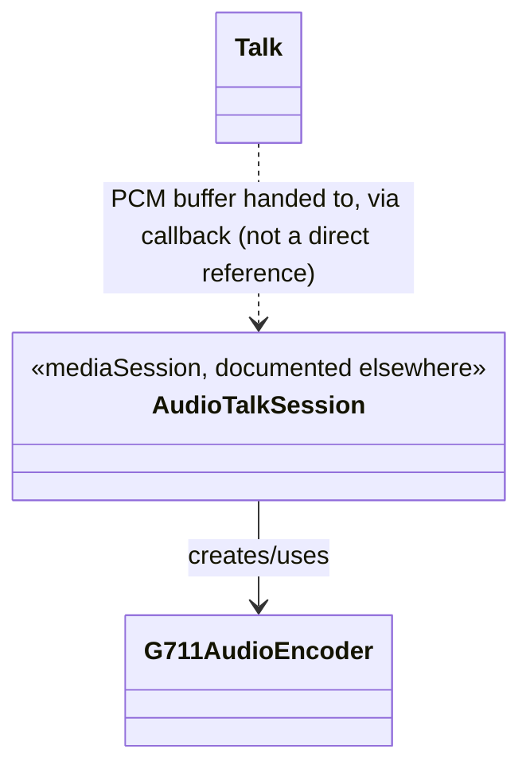

`Talk` has **no compile-time dependency** on `G711AudioEncoder` — the two are wired together only
through `MediaRouter`/`RtpClient`, which is why the class diagram above shows a dashed
(message-passing) link rather than a solid `-->` between them. `G711AudioEncoder` is actually
owned and called by `AudioTalkSession` (`mediaSession/audioSession/AudioTalkSession.ts`), not by
`Talk` itself.

### `Talk` (`talk/Talk.ts`)

- **Structure**
  - Public field: `channelId = 0` (`talk/Talk.ts:26`).
  - Private fields: `audioContext: AudioContext | null`, `gainOutNode: GainNode | null`, `readonly
    bufferSize = 4096`, `scriptNode: ScriptProcessorNode | null`, `localSampleRate: number | null`,
    `isStreaming = false`, `currentLocalStream: MediaStream | null`, `streamNode:
    MediaStreamAudioSourceNode | null`, `sendAudioBufferCallback: ((data: Float32Array) => void) |
    null` (`talk/Talk.ts:28-36`).
  - `readonly constraints` — a `MediaStreamConstraints`-shaped object requesting audio with
    `echoCancellation`/`noiseSuppression`/`autoGainControl` all disabled, plus a legacy Chrome-only
    `mandatory.googAutoGainControl: false` constraint kept verbatim for fidelity even though modern
    browsers silently ignore unrecognized constraint keys (`talk/Talk.ts:41-45`).
  - Constructor: `constructor(private readonly audioContextFactory: () => AudioContext = () => new
    AudioContext())` (`talk/Talk.ts:47`) — injectable purely for testability; production callers
    use the default.
  - No inheritance; standalone class. Does not import or reference `G711AudioEncoder` at all — see
    the class diagram above.
  - Dropped-vs-legacy: `cleanBuffer()` (confirmed dead code, referenced undeclared variables) and
    the vendor-prefixed `getUserMedia` polyfill block (obsolete in evergreen browsers) — both noted
    in the file's own doc comment (`talk/Talk.ts:4-24`).

- **Method Analysis**
  - `init(): boolean` (`talk/Talk.ts:49-59`) — lazily constructs the `AudioContext` via
    `audioContextFactory()`, installs a no-op `onstatechange` handler, and returns `false` if
    construction throws (e.g. no Web Audio support). Idempotent — a second call is a no-op if
    `audioContext` is already set.
  - `initAudioOut(): Promise<number>` (`talk/Talk.ts:61-114`) — the capture pipeline setup:
    1. Lazily builds a `GainNode` (`gainOutNode`) and a `ScriptProcessorNode` (`scriptNode`, buffer
       size 4096, 1 input channel, 1 output channel) via `audioContext.createScriptProcessor(...)`.
    2. Wires `scriptNode.onaudioprocess` to read `e.inputBuffer.getChannelData(0)` (a `Float32Array`
       of raw PCM samples) and, if a stream is active and `isStreaming`, forward it to
       `sendAudioBufferCallback`.
    3. Connects `gainOutNode -> scriptNode -> audioContext.destination` (the `ScriptProcessorNode`
       must be connected to a destination for its `onaudioprocess` to fire at all, even though the
       actual playback of that path is not the point — the point is the tap for outbound capture).
    4. Records `localSampleRate = audioContext.sampleRate` and sets initial gain to `1`.
    5. Calls `navigator.mediaDevices.getUserMedia(this.constraints)`. On success: stores the
       `MediaStream`, creates a `MediaStreamAudioSourceNode` from it, connects it into
       `gainOutNode`, sets `isStreaming = true`, and resolves with `localSampleRate`. On failure:
       rejects with an `RTSPOverWebSocketError` (`errorCode: fromHex('0x0211')`,
       `place: 'Talk.ts:initAudioOut'`, `"Talk service unavailable, Microphone device not found."`).
    - This is the browser's own device-permission/capture path — no vendor-prefixed fallback is
      needed since target browsers guarantee `navigator.mediaDevices.getUserMedia` natively
      (`talk/Talk.ts:81-93` doc comment).
  - `controlVolumeOut(volume: number): void` (`talk/Talk.ts:116-125`) — maps an input `volume` to a
    gain value: `tVol = (volume / 20) * 2`, clamped to `[0, 10]`, applied to
    `gainOutNode.gain.value`.
  - `stopAudioOut(): void` (`talk/Talk.ts:128-141`) — stops every track on `currentLocalStream` via
    `MediaStreamTrack.stop()`, clears `isStreaming`/`currentLocalStream`. Per its own doc comment,
    `initAudioOut()` must be called again to resume capture after this.
  - `terminate(): void` (`talk/Talk.ts:143-148`) — calls `stopAudioOut()`, closes the
    `AudioContext`, and nulls `gainOutNode`/`scriptNode` (but not `audioContext` itself, which stays
    set to the now-closed context).
  - `setSendAudioTalkBufferCallback(callbackFn: (data: Float32Array) => void): void`
    (`talk/Talk.ts:150-152`) — the sole way outbound PCM chunks leave `Talk`; the caller (in
    practice, `RtpClient`, via `MediaRouter`) supplies this.

- **Call Stack** — microphone capture → G.711 encode → RTP send:

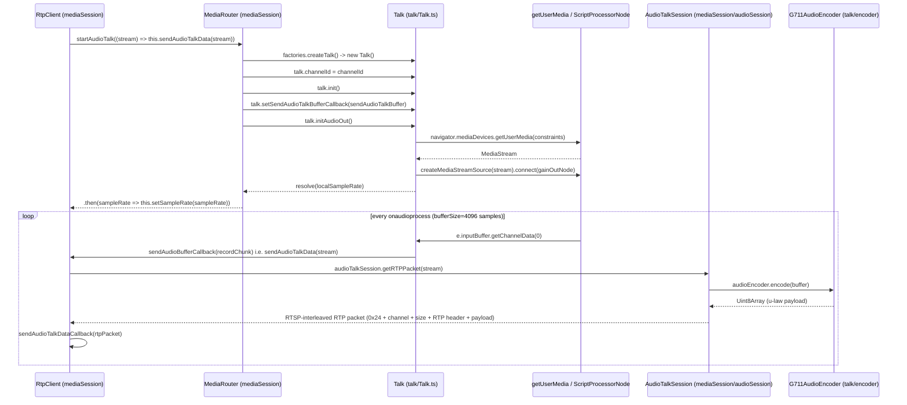

  `RtpClient.sendAudioTalkDataCallback` is set by the RTSP-over-WebSocket transport layer
  (`network/`, documented elsewhere) and is what actually writes the interleaved RTP packet onto
  the WebSocket.

- **RFC / Standard References** — the encoded payload itself is **ITU-T G.711** (µ-law/A-law PCM
  companding), an ITU-T Recommendation, not an IETF RFC. `G711AudioEncoder` only implements the
  µ-law variant (`lin2Mulaw`). The RTP transport of that payload uses the static payload type and
  framing defined by **RFC 3551** ("RTP Profile for Audio and Video Conferences with Minimal
  Control", payload type 0 = PCMU), which in turn builds on the base RTP packet format of
  **RFC 3550**. `Talk.ts` itself is pure Web Audio API plumbing (mic capture) with no protocol
  content of its own — the RTP/RTSP framing happens downstream in `AudioTalkSession`/`RtpClient`.

- **Relations & Data Flow** — `StreamPlayer` constructs `Talk` (via the `createTalk` factory) and
  passes it to `MediaRouter`'s `TalkLike` interface (both documented elsewhere); `MediaRouter`
  never imports `Talk` directly, only drives it through that interface. The actual G.711 encode and
  RTP packetization happen one level below, in `AudioTalkSession`, which `RtpClient` constructs
  when it sees a `G.711` SDP media line whose `trackID` matches `t`/`back` (talk-back) rather than a
  regular playback track.

### `G711AudioEncoder` (`talk/encoder/G711AudioEncoder.ts`)

- **Structure**
  - Module-level constants: `BIAS = 0x84`, `SEG_END` (an 8-entry µ-law segment boundary table)
    (`talk/encoder/G711AudioEncoder.ts:1-2`).
  - Free functions `search(val, table)` (linear scan for the first segment boundary `val` fits
    under) and `lin2Mulaw(pcmValIn)` (the actual 16-bit linear PCM → 8-bit µ-law companding
    algorithm) (`talk/encoder/G711AudioEncoder.ts:9-32`).
  - Exported interface `G711CodecInfo { type: string; samplingRate: number }`.
  - Class fields: `localSampleRate = 48000`, `remainBuffer: Float32Array | null`, `readonly
    codecInfo: G711CodecInfo = { type: 'G.711', samplingRate: 8000 }`
    (`talk/encoder/G711AudioEncoder.ts:35-37`). No constructor parameters, no inheritance.

- **Method Analysis**
  - `setSampleRate(sampleRate: number): void` — records the *input* (microphone) sample rate,
    used as the source rate for downsampling to the fixed 8 kHz G.711 target.
  - `downsampleBuffer(buffer: Float32Array, rate: number): Float32Array` (private) — box-average
    downsampling from `localSampleRate` down to `rate` (always 8000 here). Computes an integer
    `sampleRateRatio`, walks the input in ratio-sized windows averaging samples into each output
    slot, and — critically — carries over any leftover samples that don't divide evenly into
    `remainBuffer`, to be prepended to the *next* call's input. Throws a bare string (not an
    `Error`) if asked to upsample (`rate > this.localSampleRate`).
  - `encode(buffer: Float32Array): Uint8Array` — the main entry point: prepends any carried-over
    `remainBuffer` from the previous call, downsamples to 8 kHz, converts each `Float32` sample to
    16-bit signed PCM (`sample * 2^15`), then µ-law-encodes each sample via `lin2Mulaw`, returning a
    `Uint8Array` half the byte-length of the 16-bit PCM.
  - `getCodecInfo(): G711CodecInfo` — returns the fixed `{ type: 'G.711', samplingRate: 8000 }`
    descriptor.

- **Call Stack** — see the `Talk` sequence diagram above; `G711AudioEncoder.encode()` is called
  once per outbound PCM chunk from `AudioTalkSession.getRTPPacket()`
  (`mediaSession/audioSession/AudioTalkSession.ts:31`).

- **RFC / Standard References** — implements **ITU-T G.711** µ-law encoding directly (the
  classic bias-and-segment-search algorithm, not a table lookup); this is an ITU-T standard, not an
  IETF RFC. No standard governs the encoder class itself; only the wire format it produces (see
  `Talk`'s RFC section above for the RTP transport standard).

- **Relations & Data Flow** — consumed exclusively by `AudioTalkSession`
  (`mediaSession/audioSession/AudioTalkSession.ts:18`), which owns one `G711AudioEncoder` instance
  per talk-back RTP session. `Talk` (this document) does not reference it.

---

## 2. `backup` (main-thread) — client-side backup/export orchestration

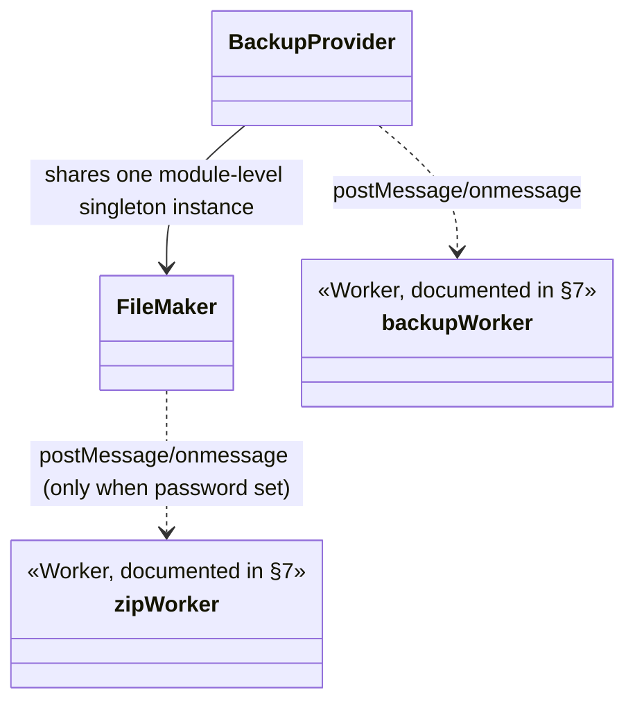

### `BackupProvider` (`backup/BackupProvider.ts`)

- **Structure**
  - Public fields: `channelId = 0`, `deviceType: string | undefined` (`backup/BackupProvider.ts:39-40`).
  - Private fields: `backupStatus` (one of `BACKUP_STATUS.WAIT|PROCESSING|DONE`), `backupWorker:
    Worker | null`, `callback: ((data: unknown) => void) | null`, `timestampCallback: ((data:
    unknown) => void) | null` (`backup/BackupProvider.ts:42-45`).
  - Constructor: `constructor(private readonly backupWorkerFactory: BackupWorkerFactory = () => new
    Worker(new URL('../worker/backup/backupWorker.ts', import.meta.url)))`
    (`backup/BackupProvider.ts:48`) — injectable for testing; production default spins up the real
    `backupWorker.ts` Worker bundle.
  - Module-level `let sharedFileMaker: FileMaker | null = null` (`backup/BackupProvider.ts:27`) —
    shared across **every** `BackupProvider` instance/channel, matching a legacy quirk: only the
    first channel to start a backup constructs the `FileMaker`; later channels' backups reuse it
    (and overwrite its password/callback via `setPassword`/`setCompressCallback` on every `init()`
    call).
  - No inheritance.

- **Method Analysis**
  - `init(data: BackupInitData): void` (`backup/BackupProvider.ts:59-83`) — resets
    `backupStatus` to `WAIT`, constructs the backup `Worker` via the factory and wires
    `onmessage`, stores `callback`/`timestampCallback`, lazily constructs `sharedFileMaker` if
    unset, configures its password and `compressCallback`, then posts a `{ type: 'start', data: {
    channelId, fileName, deviceType, password, split, gmt } }` message to the worker to kick off a
    `BackupSession` there.
  - `onVideoData(streamData: VideoStreamData, videoInfo: VideoInfo): void`
    (`backup/BackupProvider.ts:85-115`) — transitions `WAIT -> PROCESSING` on first call, then (only
    while `PROCESSING`) builds a `frameInfo` object (frame type, codec, PES size, framerate —
    forced to `MAX_FPS = 200` when a `timestamp_usec` is present, width/height/crop) and posts
    `{ type: 'sendVideoFrame', playMode, data: { frameInfo, streamData: streamData.frameData } }` to
    the worker. `VideoStreamData`/`VideoInfo` come from `mediaSession` (documented elsewhere).
  - `receiveAudioData(streamData: AudioStreamData, audioInfo: AudioInfo): void`
    (`backup/BackupProvider.ts:117-135`) — the audio counterpart (note the asymmetric naming vs.
    `onVideoData` — preserved from legacy); only forwards while `PROCESSING`, posts
    `{ type: 'sendAudioFrame', data: { frameInfo, streamData } }`.
  - `closeStream(): void` (`backup/BackupProvider.ts:137-143`) — posts `{ type: 'stop' }` to the
    worker and resets `backupStatus` to `WAIT`.
  - `backupWorkerMessage(event: MessageEvent): void` (private, `backup/BackupProvider.ts:145-167`)
    — the worker's `onmessage` handler, dispatching on `message.type`:
    - `'backup'` — forwards `{ target, data }` to `sharedFileMaker.processMessage(target, data)`.
    - `'backupResult'` — invokes the caller-supplied `callback`.
    - `'timestamp'` — invokes the caller-supplied `timestampCallback`.
    - `'terminate'` — no-op (acknowledged but unhandled).
  - `compressCallback` (private, readonly, arrow field, `backup/BackupProvider.ts:51-57`) — passed
    into `FileMaker.setCompressCallback`; wraps an `errorCode` into `{ channelId, description:
    'backup', errorCode }` and forwards to `callback`. This is how ZIP start/stop progress
    (`0x060C`/`0x060D`, see `FileMaker`) reaches the caller even though it originates inside
    `FileMaker`, not `BackupProvider`.

- **Call Stack** — full local-recording/export pipeline, from streamed frames to a saved file:

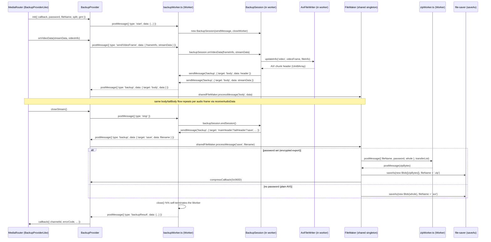

- **RFC / Standard References** — `BackupProvider` is pure orchestration/message-relay plumbing;
  it has no wire-format or protocol content of its own. See `AviFormatWriter`/`FileMaker`/`zipWorker`
  below for the actual file-format standards involved (AVI, ZIP).

- **Relations & Data Flow** — `StreamPlayer` creates one `BackupProvider` (documented elsewhere);
  `MediaRouter` drives it exclusively through the `BackupProviderLike` interface (dependency
  inversion, same pattern as `TalkLike`), never importing the concrete class. `BackupProvider`
  itself only imports `FileMaker` and constructs the `backupWorker.ts` Worker — it has no
  dependency on `AviFileWriter`/`BackupSession`/etc., which live entirely worker-side.

### `FileMaker` (`backup/FileMaker.ts`)

- **Structure**
  - Private fields: `header: unknown = []`, `parts: unknown[] = []`, `tails: unknown[] = []`,
    `tailHeader: unknown = []`, `blob: Blob | null`, `zipPassword: string | null`,
    `compressCallback: ((errorCode: number) => void) | null` (`backup/FileMaker.ts:12-18`).
  - Constructor: `constructor(private readonly zipWorkerFactory: ZipWorkerFactory = () => new
    Worker(new URL('../worker/backup/zipWorker.ts', import.meta.url)))` (`backup/FileMaker.ts:20-22`)
    — same injectable-factory pattern as `BackupProvider`.
  - No inheritance. One instance is shared across all channels via `BackupProvider`'s module-level
    `sharedFileMaker`.

- **Method Analysis**
  - `addBody(part: unknown): void` / `addMainHeader(header)` / `addTailHeader(header)` /
    `addTail(tail)` (all private) — accumulate the pieces of the file as they stream in: `parts`
    holds an ordered list of AVI body chunks (video/audio frame data + chunk headers), `header` and
    `tailHeader` hold the single main/tail headers, `tails` accumulates AVI index-entry (`idx1`)
    chunks. Adding a body part also invalidates any cached `blob` (`this.blob = null`).
  - `clearMemory(): void` (private) — resets all accumulator fields and `blob` to empty/null after
    a file is finalized.
  - `createZipFile(fileName: string, whole: Uint8Array[]): void` (private,
    `backup/FileMaker.ts:49-63`) — spins up a `zipWorker` via the factory, wires its `onmessage` to
    wrap the returned bytes in a `Blob`, `saveAs(blob, fileName + '.zip')` (via `file-saver`), clear
    the zip password, `clearMemory()`, terminate the worker, and invoke `compressCallback(fromHex(
    '0x060D'))` ("COMPRESS_STOP"). Posts `{ fileName, password: zipPassword, whole }` to the worker
    with `whole.map(arr => arr.buffer)` as the transfer list (zero-copy transfer of every chunk's
    underlying `ArrayBuffer`), and immediately fires `compressCallback(fromHex('0x060C'))`
    ("COMPRESS_START") before the worker responds.
  - `createAviFile(fileName: string, whole: unknown[]): void` (private) — the unencrypted path:
    directly builds a `Blob` from the accumulated pieces and `saveAs(blob, fileName + '.avi')`, then
    `clearMemory()`. No worker round-trip needed since no compression/encryption is involved.
  - `createFile(fileName: string): void` (private, `backup/FileMaker.ts:71-89`) — assembles the
    final piece order (`header`, then each `parts[i]`, then `tailHeader`, then each `tails[i]`) into
    a flat `whole` array, and dispatches to `createZipFile` if `zipPassword` is set, else
    `createAviFile`. Only runs if `blob` is currently `null` (guards against double-invocation).
  - `processMessage(target: string, data: unknown): void` (`backup/FileMaker.ts:91-103`) — the
    single entry point `BackupProvider` calls; dispatches on `target`: `'body'` → `addBody`,
    `'mainHeader'` → `addMainHeader`, `'tailHeader'` → `addTailHeader`, `'tailBody'` → `addTail`,
    `'save'` → `createFile(data as string)`.
  - `setPassword(password: string | null): void` / `setCompressCallback(callback): void` — simple
    setters, called by `BackupProvider.init()` on every backup start (which is why the shared
    singleton's password/callback are always fresh per-session even though the instance persists).

- **Call Stack** — see the `BackupProvider` sequence diagram above; `FileMaker.processMessage()` is
  the receiving end of every `'backup'`-typed message relayed from `backupWorker.ts`, and
  `createZipFile`/`createAviFile` are its two terminal branches.

- **RFC / Standard References** — `FileMaker` itself only assembles pre-built binary pieces and
  triggers a browser download; the two file formats it produces are:
  - **AVI**: a **Microsoft RIFF/AVI container format** — there is no IETF RFC or ITU standard
    governing AVI; it's a vendor (Microsoft) binary container specification.
  - **ZIP**: the **PKWARE .ZIP file format specification** — also not an RFC; a vendor
    (PKWARE) specification, implemented here via the vendored `minizip-asm.js` WASM build inside
    `zipWorker.ts`.

- **Relations & Data Flow** — constructed and owned by `BackupProvider` (one shared instance across
  channels, per the module-level singleton note above); spins up its own `zipWorker.ts` Worker
  on demand (only when a password is configured) — this is the one main-thread class in this
  document's scope that itself talks to a Worker rather than being driven by one.

---

## 3. `worker/videoDecoder` — video decode worker (WASM for H.264/H.265, WebCodecs for VP8/VP9/AV1)

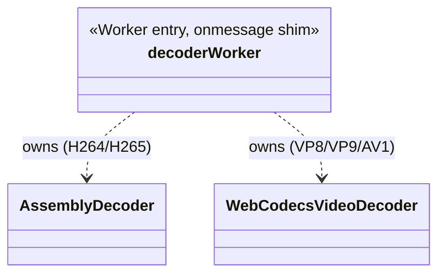

### `AssemblyDecoder` (`worker/videoDecoder/AssemblyDecoder.ts`)

- **Structure**
  - Public field: `channelId = 0` (`worker/videoDecoder/AssemblyDecoder.ts:37`).
  - Private fields: `context: number | null` (opaque native decoder-context handle),
    `readonly ID: number` (264 or 265, selecting the codec), `outpicsize = 0`, `iFrameCheck =
    false`, `decoderReadyCallback: DecoderReadyCallback | null`.
  - Four `cwrap`-bound native function fields, assigned only once the WASM module finishes loading:
    `initDecoderFn`, `decoderContextFn`, `decodeByFFMPEGFn`, `closeContextFn`
    (`worker/videoDecoder/AssemblyDecoder.ts:45-48`).
  - Constructor: `constructor(codecType: string, importScriptsFn = importScripts, fetchFn =
    fetch)` (`worker/videoDecoder/AssemblyDecoder.ts:50-82`) — `codecType === 'H264'` maps to
    `ID = 264`, anything else maps to `ID = 265`. There is still no validation rejecting an
    unrecognized `codecType` (a genuinely-mislabeled bitstream would silently decode as H.265), but
    this is no longer reachable for VP8/VP9/AV1 in practice: `decoderWorker.ts`'s `'createDecoder'`
    case now branches *before* construction (`'H264'`/`'H265'` → `AssemblyDecoder`, everything else
    → `WebCodecsVideoDecoder`, see that class's section below and
    `03-mediaSession-core-video.md`'s VP8/VP9/AV1 section for the full story of that fix) — this
    class is only ever constructed with `'H264'`/`'H265'` now. Sets `Module.onRuntimeInitialized`
    to `cwrap` the four
    native entry points, call `init_jsFFmpeg`, then `this.init()` and `this.setOutputSize(0)`.
    Immediately (not waiting for that callback) `fetch`es the vendored `vendor/ffmpeg.wasm`, sets
    `Module.wasmBinary` to the raw bytes (must happen **before** the glue script runs, since the
    glue's `createWasm()` reads `Module.wasmBinary` synchronously), then `importScripts`s
    `vendor/ffmpeg.js` to actually boot the Emscripten runtime.
  - No inheritance; standalone class wrapping a vendored ffmpeg.js/ffmpeg.wasm build.

- **Method Analysis**
  - `addListener(eventType: 'onDecoderReady', callback): void` — registers the one supported
    lifecycle callback, fired once (per `init()` call) when the native decoder context is ready.
  - `init(): void` (`worker/videoDecoder/AssemblyDecoder.ts:90-101`) — closes any existing native
    context, then opens a fresh one via `decoderContextFn(this.ID)`, and fires
    `decoderReadyCallback()` if set.
  - `close(): void` — closes the native context via `closeContextFn` if one is open.
  - `setOutputSize(size: number): void` — sets `outpicsize` (the WASM output-buffer allocation
    size) if `size > 0`; called once at startup with `0` (a no-op) and later by the decoder Worker
    with the real frame buffer size.
  - `decode(data: AssemblyDecoderFrame): Uint8Array | null`
    (`worker/videoDecoder/AssemblyDecoder.ts:122-147`) — the actual per-frame decode:
    1. Returns `null` immediately if there is no open `context`.
    2. Enforces "must see an I-frame before decoding anything" via `iFrameCheck`: returns `null`
       until the first `data.frameType === 'I'` arrives, then latches `iFrameCheck = true`
       permanently for this instance.
    3. `Module._malloc(this.outpicsize)` to allocate a native output buffer, wraps it in a
       `Uint8Array` view over `Module.HEAPU8.buffer`.
    4. Calls `decodeByFFMPEGFn(context, data.frameData, data.frameData.length,
       outpic.byteOffset)` — the native H.264/H.265 decode call.
    5. Copies the output into a fresh (non-WASM-heap-backed) `Uint8Array`, frees the native buffer
       via `Module._free`, and returns the copy.
  - `checkPerformance`-gated legacy branches (an alternate 5-arg `cwrap` signature and extra
    interval-timing instrumentation) are confirmed dead code (the flag is hardcoded `false`) and
    dropped — see the class doc comment.

- **Call Stack** — see `decoderWorker` below (this class has no direct postMessage surface of its
  own; it's driven entirely by `decoderWorker.ts`).

- **RFC / Standard References** — decodes **ITU-T H.264** (also ISO/IEC 14496-10, MPEG-4 AVC) and
  **ITU-T H.265**/HEVC (also ISO/IEC 23008-2) video bitstreams via a vendored ffmpeg.js/ffmpeg.wasm
  build. These are ITU-T/ISO codec standards, not IETF RFCs — no RFC governs the codec bitstream
  itself (RFC 6184/7798 govern only how such bitstreams are *packetized into RTP*, which is handled
  by `RtpClient`/the H264Session/H265Session classes upstream, documented elsewhere, not by
  `AssemblyDecoder`).

- **Relations & Data Flow** — owned exclusively by `decoderWorker.ts`; per README §7, has no
  reference to any main-thread class. Reachable only via the `postMessage` protocol described
  below.

### `WebCodecsVideoDecoder` (`worker/videoDecoder/WebCodecsVideoDecoder.ts`)

- **Structure** — decodes VP8/VP9/AV1 via the browser's native WebCodecs `VideoDecoder`, inside
  this same Worker. Structurally parallel to `AssemblyDecoder` on purpose (`decode()`/`close()`/
  `channelId`/`addListener('onDecoderReady', cb)`/a no-op `setOutputSize()` kept only for interface
  parity) so `decoderWorker.ts` can hold either behind one `decoder` variable typed
  `AssemblyDecoder | WebCodecsVideoDecoder | null`. Private fields: `decoder: VideoDecoder | null`,
  `pending: Uint8Array[]` (the async→sync bridge queue, same pattern
  `listen/decoder/OPUSAudioDecoder.ts` uses for WebCodecs `AudioDecoder` — see `06-listen-audio.md`),
  `nextTimestampUs`, `closed`. `VideoDecoder`/`EncodedVideoChunk`/`VideoFrame` are referenced as
  bare (unqualified) identifiers, not `self.VideoDecoder` — they're ordinary `dom`-lib ambient
  globals (same mechanism `OPUSAudioDecoder.ts` relies on for `AudioDecoder`) and resolve correctly
  through a Worker's global scope at runtime, the same way this file's own unqualified
  `postMessage`/`MessageEvent` already do.
- Constructor feature-detects via `typeof VideoDecoder === 'undefined'`, throwing
  `RTSPOverWebSocketError` (`0x0312`) synchronously if unsupported — exact same pattern
  `OPUSAudioDecoder.ts` uses for `window.AudioDecoder`. Then kicks off `configure()`
  (fire-and-forget, `void this.configure()`) without blocking the constructor.
- `configure()` (private, async) — tries an ordered candidate list of codec strings
  (`candidateCodecStrings(codecType)`: `'vp8'` for VP8 — no profile/level suffix per spec; two
  profile/bit-depth guesses each for VP9/AV1, since — unlike `AssemblyDecoder`'s static
  `H264→264`/`H265→265` mapping — this class has no encoded frame available yet to derive the real
  profile from: `decoderWorker.ts` only ever calls `decode()` once `onDecoderReady` has fired, and
  frames arriving before that are buffered *outside* this class, in `decoderWorker.ts`'s own
  `frameBuffer`), validating each with `VideoDecoder.isConfigSupported()` before committing via
  `new VideoDecoder({ output, error })` + `.configure({ codec })`, then firing
  `decoderReadyCallback()`. If no candidate is supported, logs via `console.error` and never fires
  ready (frames stay buffered forever in `decoderWorker.ts` — same "silently never decodes" outcome
  an unsupported codec has always had, not a regression).
- `onDecodedOutput(frame)` (private, the WebCodecs `output` callback) — **two things confirmed only
  by live testing against a real VP9 encoder, both load-bearing**:
  1. Rejects any `frame.format !== 'I420'` up front (logs, closes, drops) rather than requesting a
     conversion — Chrome's `copyTo()` rejects any *explicit* non-RGB `format` option outright
     ("copyTo() doesn't support explicit copy to non-RGB formats"); I420 is by far the most common
     native output for 8-bit VP8/VP9-profile-0/AV1-profile-0 decode, so this is the expected path,
     not a workaround for a rare case.
  2. Sizes the destination buffer from `frame.displayWidth`/`frame.displayHeight`, **not**
     `frame.codedWidth`/`frame.codedHeight` — confirmed live that `codedWidth`/`codedHeight` can be
     padded to the decoder's internal alignment (928×480 coded vs. 854×480 actually-encoded for a
     real VP9 stream), while `displayWidth`/`displayHeight` is the unpadded real size, matching what
     `VP8HeaderParser`/`VP9HeaderParser`/`AV1HeaderParser` (`03-mediaSession-core-video.md`) already
     extracted from the bitstream and what `YUVWebGLCanvas`'s fixed-size textures were built for.
     `copyTo()`'s default (no `rect`/`layout` options) already copies this unpadded region tightly
     packed — confirmed via its resolved `PlaneLayout[]` (`{offset, stride}` per plane) matching
     exactly a flat, no-padding buffer.
  Always closes `frame` in a `finally`, mirroring `OPUSAudioDecoder.onDecodedOutput`'s
  `AudioData.close()` — these hold GPU-backed resources.
- `decode(data)` — builds `EncodedVideoChunk({ type: data.frameType === 'I' ? 'key' : 'delta',
  timestamp: <synthetic, +1 per call>, data: data.frameData })`, calls `this.decoder.decode(chunk)`
  in a try/catch (the underlying `VideoDecoder` can move to `'closed'` asynchronously between calls,
  making `decode()` throw — caught and treated as `null`, matching `AssemblyDecoder`'s "nothing
  ready yet" contract rather than crashing the worker's message handler), then returns
  `this.pending.shift() ?? null`.
- `close()` — closes the underlying `VideoDecoder` if not already closed, clears `pending`.

- **RFC / Standard References** — no RFC of its own; decodes the same VP8/VP9/AV1 bitstreams
  `VP8Session`/`VP9Session`/`AV1Session` (`03-mediaSession-core-video.md`) depacketize, via the
  W3C WebCodecs API (`VideoDecoder`/`EncodedVideoChunk`/`VideoFrame`).

- **Relations & Data Flow** — owned exclusively by `decoderWorker.ts`, same as `AssemblyDecoder`;
  no reference to any main-thread class.

### `decoderWorker` (`worker/videoDecoder/decoderWorker.ts`)

- **Structure** — module-level state (not a class): `decoder: AssemblyDecoder | WebCodecsVideoDecoder | null`,
  `frameRate`, `decodedClock`, `usePacketDrop = true`, `isDecoderReady = false`, `decoderIndex = 0`,
  `toBeContinueDropFrameFlag = false`, `threshold`/`threshold2` (frame-drop time budgets in ms),
  and a `frameBuffer: DecoderWorkerFrame[]` queue used while the decoder is still becoming ready
  (`worker/videoDecoder/decoderWorker.ts:63-73`). Pre-declares `globalThis.Module` so
  `AssemblyDecoder`'s constructor can assign `Module.onRuntimeInitialized` without a
  `ReferenceError` before the Emscripten glue script has run — inert for the `WebCodecsVideoDecoder`
  path, which never touches `Module`.

- **Method Analysis** — message types handled by `receiveMessage(event)`
  (`worker/videoDecoder/decoderWorker.ts:136-183`), each delegating to whichever decoder is active:
  - `'createDecoder'` — `decoder = message.data === 'H264' || message.data === 'H265' ? new
    AssemblyDecoder(message.data) : new WebCodecsVideoDecoder(message.data)`; sets
    `decoder.channelId`; registers `onDecoderReady` as the `'onDecoderReady'` listener. Everything
    below this point is decoder-agnostic — confirmed live, no other branching needed anywhere in
    this file.
  - `'terminate'` — `decoder.close()`, then posts `{ type: 'terminated', channelId }`.
  - `'setOutputSize'` — forwards to `decoder.setOutputSize(message.data)`.
  - `'setDecoderIndex'` — sets the module-level `decoderIndex` (used only in `lowPerformance`
    messages' payload, to identify which decoder instance is struggling).
  - `'useDropPacket'` — toggles `usePacketDrop`.
  - `'setFrameRate'` — updates `frameRate`/`threshold`, but **only if** `usePacketDrop` is true.
  - `'playMode'` — accepted but no longer stored (see the fixed bug below — the module-level
    `playMode` variable this used to set became write-only once `onDecoderReady()`'s
    `playMode === 'Playback'` check was removed). `data.playMode` on an individual
    `DecoderWorkerFrame` (a *different*, per-message field, still read by `decodeLiveMessage`) is
    unaffected.
  - `'decode'` — if `isDecoderReady`, calls `decodeLiveMessage(message.data)` directly; otherwise
    buffers the frame into `frameBuffer` for later replay by `onDecoderReady()`.
  - This is the drop-frame performance heuristic layer *on top of* `decoder.decode()`:
    `decodeLiveMessage`/`onDecoderReady`'s buffered-replay loop always decode I-frames
    unconditionally (tracking how long that took against a per-framerate `threshold`), but skip a
    subsequent P/B-frame if either the *previous* frame already tripped the threshold
    (`toBeContinueDropFrameFlag`) or the last measured decode time exceeds `threshold`. Both paths
    send a `'lowPerformance'` message back to the main thread when a frame decode is slow enough to
    warrant reporting — though for `WebCodecsVideoDecoder` this heuristic effectively never fires,
    since its `decode()` returns near-instantly (submits to an async/hardware queue and shifts a
    *previously*-decoded frame off its own FIFO) rather than blocking like the WASM path; it's
    measuring call overhead, not real decode latency, for VP8/VP9/AV1 — accepted, not a bug to chase.
    **A real latched-forever bug here was fixed** (not preserved) after live VP9 testing surfaced
    it: `isDecoderReady` used to only become `true` inside `onDecoderReady()`'s
    `if (frameBuffer.length > 0 || playMode === 'Playback')` guard, so if the decoder finished
    becoming ready while the buffer was still empty and `playMode` wasn't yet `'Playback'`, every
    subsequent `'decode'` message queued forever, no error. `AssemblyDecoder`'s WASM load (network
    fetch + instantiate) was slow enough that `frameBuffer` always had a queued frame by the time
    `onDecoderReady` fired, so this never manifested there — but `WebCodecsVideoDecoder.configure()`
    resolves near-instantly, hitting the empty-buffer trap on essentially every Live-mode session
    (confirmed live: permanently blank canvas, zero errors). The guard's own asymmetry — Playback
    mode already bypassed it unconditionally — was the tell that this was a latent bug the WASM
    path's timing happened to never trigger, not a deliberate invariant; removed rather than kept
    (`worker/videoDecoder/decoderWorker.ts`'s `onDecoderReady()` doc comment has the full writeup).
  - `sendMessage(type, data)` — thin `self.postMessage({ type, data })` wrapper used by every
    outbound message below.

- **Call Stack**:

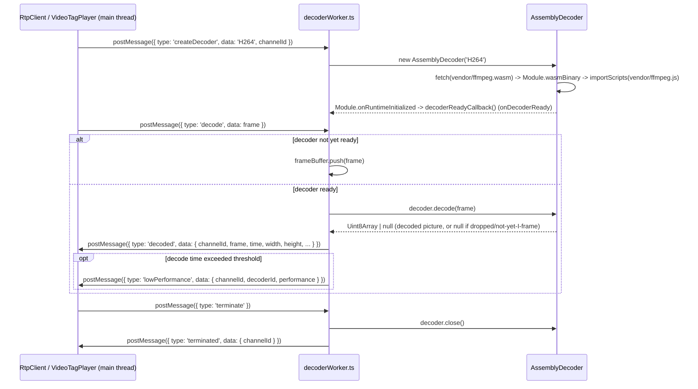

- **RFC / Standard References** — pure Worker-boundary message-passing plumbing plus the
  performance heuristic described above; no external protocol/format standard applies to
  `decoderWorker.ts` itself. See `AssemblyDecoder` above for the codec standards it drives.

- **Relations & Data Flow** — reachable only via `postMessage` from `RtpClient`/`VideoTagPlayer`
  (documented elsewhere), per README §7. Owns exactly one `AssemblyDecoder` instance for the
  Worker's lifetime.

---

## 4. `worker/audioTranscoder` — G.711/G.726 → AAC transcode worker

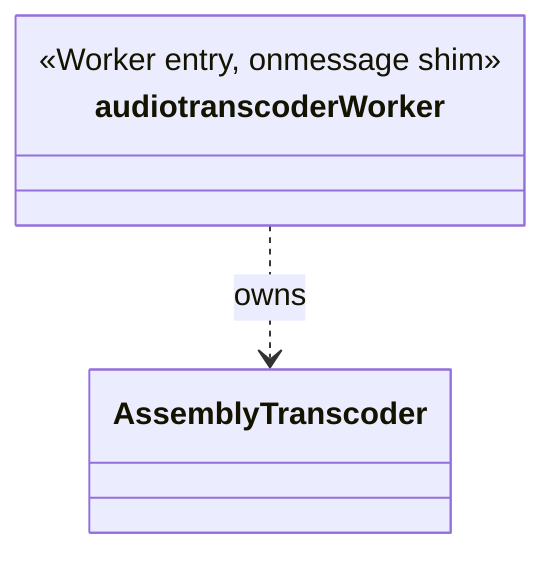

### `AssemblyTranscoder` (`worker/audioTranscoder/AssemblyTranscoder.ts`)

- **Structure**
  - Private fields: `encoderContext: number | null`, `decoderContext: number | null`, `output:
    Uint8Array | null` (a persistent 4096-byte WASM-heap output buffer), `transcoderReadyCallback:
    TranscoderReadyCallback | null`.
  - Six `cwrap`-bound native function fields: `openAudioDecoderFn`, `openAACEncoderFn`,
    `trans2AACPushAudioFn`, `trans2AACGetAACFn`, `closeAudioDecoderFn`, `closeAACEncoderFn`
    (`worker/audioTranscoder/AssemblyTranscoder.ts:45-50`).
  - Constructor: `constructor(codecType: TranscoderCodecInfo, importScriptsFn = importScripts,
    fetchFn = fetch)` — same two-stage bootstrap pattern as `AssemblyDecoder`: `fetch`es the
    vendored `vendor/ffmpegAAC.transcoder.wasm` (a **different** vendored asm.js/wasm build than
    the one `AACAudioDecoder.ts` uses on the main thread — see the class doc comment), assigns
    `Module.wasmBinary`, then `importScripts`s `vendor/ffmpegAAC.transcoder.js`; on
    `Module.onRuntimeInitialized`, `cwrap`s the six native functions and calls `this.init(codecType)`.
  - `OUTPUT_BUFFER_SIZE = 4096` constant. No inheritance.
  - Preserved-faithfully quirk: `init()`'s call to `trans2AACGetAACFn(..., outputSize)` always
    passes `0` for `outputSize` — a legacy module-scope `outputSize` variable that's declared but
    never reassigned from its initial `0`, despite `output` itself being a real 4096-byte buffer
    (`worker/audioTranscoder/AssemblyTranscoder.ts:21-26` doc comment).

- **Method Analysis**
  - `addListener(eventType: 'onTranscoderReady', callback): void` — registers the ready callback.
  - `init(info: TranscoderCodecInfo): void` — opens the AAC encoder (`openAACEncoderFn()`),
    calls `openDecoder(info)`, allocates the persistent 4096-byte output buffer via
    `Module._malloc`, then fires `transcoderReadyCallback`.
  - `openDecoder(info: TranscoderCodecInfo): void` — closes any existing decoder context, then
    opens a new one: `info.codecType === 'G711'` → `openAudioDecoderFn(1, bitRate)`; `'G726'` →
    `openAudioDecoderFn(3, bitRate)` (the `1`/`3` are native codec IDs). `bitRate` is
    `info.bitRate * 1000` (kbps → bps).
  - `close(): void` — clears the `output` reference (does **not** `Module._free` it — a
    fire-and-forget WASM allocation), closes the decoder and encoder native contexts.
  - `transcode(data: Uint8Array): Uint8Array | undefined`
    (`worker/audioTranscoder/AssemblyTranscoder.ts:133-151`) — pushes the raw G.711/G.726 frame into
    the native pipeline via `trans2AACPushAudioFn(decoderContext, encoderContext, frameData,
    frameData.length)`, then pulls out any ready AAC bytes via `trans2AACGetAACFn(encoderContext,
    output.byteOffset, 0)` (note the hardcoded `0` — see Structure above). Returns `undefined` if
    the native call reports an error (`ret < 0`); otherwise copies exactly `ret` bytes out of the
    persistent `output` buffer into a fresh `Uint8Array` and returns it.

- **Call Stack** — see `audiotranscoderWorker` below.

- **RFC / Standard References** — decodes **ITU-T G.711**/**G.726** (ITU-T Recommendations, not
  RFCs) and encodes to **AAC** (ISO/IEC 13818-7 / 14496-3, an ISO/IEC standard, not an IETF RFC or
  ITU-T standard). No RFC governs the transcoding operation itself — this produces AAC audio for
  the *backup file*, not for RTP transport (contrast with the live-playback G.711/G.726/AAC RTP
  depacketization handled by `mediaSession`, documented elsewhere).

- **Relations & Data Flow** — owned exclusively by `audiotranscoderWorker.ts`; per README §7, no
  reference to main-thread classes. Used specifically to make backup-recorded G.711/G.726 audio
  playable as AAC inside the exported AVI file (most media players lack native G.711/G.726 AVI
  decoders).

### `audiotranscoderWorker` (`worker/audioTranscoder/audiotranscoderWorker.ts`)

- **Structure** — module-level state: `transcoder: AssemblyTranscoder | null`, `isDecoderReady =
  false`. Same `globalThis.Module` pre-declaration pattern as `decoderWorker.ts`.

- **Method Analysis** — `receiveMessage(event)` dispatch:
  - `'init'` — if no transcoder exists yet, constructs one (`new AssemblyTranscoder(message.data)`)
    and registers `onTranscoderReady`; if one already exists, calls `transcoder.openDecoder(
    message.data)` instead (re-init with a new codec, without rebuilding the WASM module).
  - `'terminate'` — calls `transcoder.close()`, nulls `transcoder`, posts `{ type: 'terminated',
    data: null }`.
  - `'transcode'` — only acts if `transcoder !== null && isDecoderReady`; calls
    `transcoder.transcode(streamData.frameData)` and reassigns the result directly onto
    `streamData.frameData` **without a null check** — a preserved real bug: since `transcode()` can
    return `undefined` on a native error, this throws a `TypeError` reading `.length` off
    `undefined` on the very next line whenever a transcode call fails
    (`worker/audioTranscoder/audiotranscoderWorker.ts:31-36` doc comment). On success, posts `{
    type: 'transcoded', data: streamData }` via `sendMessage`, transferring `frameData.buffer`
    zero-copy.
  - `onTranscoderReady()` — sets the module-level `isDecoderReady = true`.

- **Call Stack**:

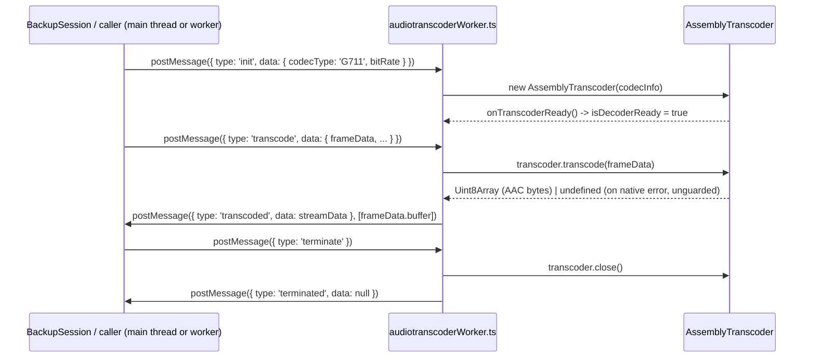

- **RFC / Standard References** — pure message-passing plumbing; no protocol standard of its own.

- **Relations & Data Flow** — reachable only via `postMessage`; per README §7, has no direct
  reference to `BackupSession` or any other class — the two communicate purely through whichever
  code constructs this Worker and forwards frames (outside this document's read set; the wiring
  point is not among the files covered here).

---

## 5. `worker/mjpegSession` — MJPEG RTP depacketize worker

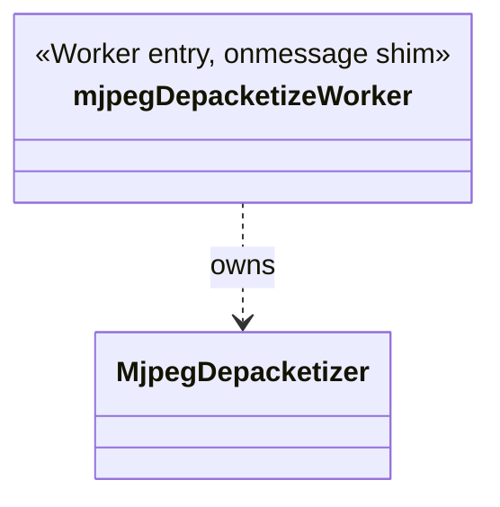

### `MjpegDepacketizer` (`worker/mjpegSession/MjpegDepacketizer.ts`)

- **Structure**
  - Accessors backed by private fields: `interleavedId`/`_interleavedId`, `deviceType`/
    `_deviceType` (`'camera' | 'nvr' | string`, default `'camera'`).
  - Depacketization state: `extensionHeaderLen: number | null`, `width = 0`, `height = 0`,
    `payloadBuffer: Uint8Array[]` (accumulates RTP/JPEG fragments for the frame in progress),
    `skipDataSize = 0`, `playback = false`, `gotFrameCallback`, `objectId: number | null`,
    `frameRate = 0`, `lastRtpTimeStamp = 0`, `rtpExtension = false`.
  - `timeData`/`prevTimeData` — `{ timestamp, timestamp_usec, timezone }` objects with a
    preserved legacy aliasing quirk: `depacketize()` can reassign `this.timeData = this.prevTimeData`
    (the whole object reference, not a field copy), so the two can end up literally the same object
    (`worker/mjpegSession/MjpegDepacketizer.ts:401-404` doc comment, `:708`).
  - `readonly frameData: MjpegFrameData` — the reusable output object mutated and handed to
    `gotFrameCallback` on every complete frame.
  - Module-level Huffman/quantization table constants (`lumDcCodelens`, `lumAcSymbols`,
    `chmDcCodelens`, `chmAcSymbols`, `defaultQuantizers`, etc.) — the standard baseline-JPEG Huffman
    tables used to synthesize a full JFIF header for frames that arrive without one (see RFC 2435
    §3 below). No inheritance.

- **Method Analysis**
  - `init(callback?: (data: MjpegFrameData) => void): void` — resets `playback = false` and
    optionally sets `gotFrameCallback`. Legacy's real call site always calls this with zero
    arguments and wires the callback separately.
  - `setGotFrameCallback(callback): void` — the actual callback-wiring method used in practice.
  - `getspecialheadersize(rtpPayload: Uint8Array): number` (private,
    `worker/mjpegSession/MjpegDepacketizer.ts:462-480`) — computes how many bytes of the RTP/JPEG
    "special header" (restart-marker header + optional quantization-table header, per RFC 2435 §3.1)
    precede the actual JPEG scan data, based on the `Type`/`Q` fields.
  - `createjpegheader(rtpPayload: Uint8Array): Uint8Array` (private,
    `worker/mjpegSession/MjpegDepacketizer.ts:482-538`) — reconstructs a full, standalone JFIF/JPEG
    header (SOI, APP0/JFIF marker, optional DRI, DQT luma/chroma tables — either taken verbatim from
    the RTP payload's inline quantization-table header, or synthesized from the default tables
    scaled by the `Q` factor via `makeDefaultQtables` — SOF0, four DHT Huffman tables via
    `createHuffmanHeader`, and SOS) via the free function `makeJPEGHeader`. Width/height come either
    from the RTP/JPEG header's 8-pixel-unit fields, or (if those are zero) from vendor-specific
    extension-header fields at fixed offsets.
  - `frameDataReturn(count: number): void` (private,
    `worker/mjpegSession/MjpegDepacketizer.ts:540-578`) — pops `count` buffered fragments off
    `payloadBuffer`, concatenates them into one `jpegFrameData` `Uint8Array`, populates
    `frameData.streamData`/`frameData.videoInfo` (playMode, codec `'MJPEG'`, timestamp fields,
    width/height/framerate), and invokes `gotFrameCallback(frameData)`.
  - `parseExtensionHeader(rtpHeader, rtpPayload): void` (private,
    `worker/mjpegSession/MjpegDepacketizer.ts:580-648`) — only runs when the RTP extension bit is
    set; parses a vendor-specific (Hanwha/Samsung-style) timestamp extension carrying NTP-format
    `NTPmsw`/`NTPlsw` (converted to Unix epoch via the standard NTP-to-Unix offset `0x83aa7e80`) plus
    an optional GMT/timezone field, and (for `deviceType === 'nvr'`) an `objectId`. Also derives
    `frameRate` by comparing consecutive frames' timestamps when the gap is small enough to be
    meaningful, and sets `playback = true` whenever this extension is present (i.e. NVR/playback
    streams are detected by the presence of this timestamp extension, not by an explicit flag).
  - `depacketize(rtspInterleaved: Uint8Array, rtpHeader: Uint8Array, rtpPayload: Uint8Array): void`
    (`worker/mjpegSession/MjpegDepacketizer.ts:650-712`) — the main entry point:
    1. Parses the 4-byte RTSP interleaved-frame length prefix to get `payloadsize`.
    2. Parses standard RTP header bits: padding, extension, CSRC count, marker bit
       (`worker/mjpegSession/MjpegDepacketizer.ts:653-658`, citing RFC 3550/RFC 3984 in its own
       comments).
    3. If `rtpCSRCCount !== 0`, logs an error (unsupported) and otherwise no-ops that packet's CSRC
       handling. If `rtpPadding` is set, **throws** `ReferenceError('PaddingSize is not defined')`
       — a preserved real legacy bug (an undeclared `PaddingSize` variable), so any MJPEG RTP packet
       with the padding bit set and no CSRC crashes this method.
    4. If the extension bit is set, delegates to `parseExtensionHeader`; otherwise
       `extensionHeaderLen = 0`.
    5. Extracts `lastRtpTimeStamp` and the JPEG-payload `fragmentOffset`.
    6. If `fragmentOffset === 0` (start of a new frame): resets `payloadBuffer` to `[
       createjpegheader(rtpPayload)]` and computes `skipDataSize` via `getspecialheadersize`.
       Otherwise: computes a fixed `skipDataSize` (8 + extension length, +4 if a restart-marker
       header is present) and bails out early if the payload is too short to even contain that
       header (partial header — "should not happen").
    7. Pushes the remaining payload bytes (`rtpPayload.subarray(skipDataSize, payloadsize)`) onto
       `payloadBuffer`.
    8. On the RTP marker bit (end of frame): if in playback mode, resolves a possible
       `timeData`/`prevTimeData` aliasing (see Structure above), then calls `frameDataReturn`.

- **Call Stack** — see `mjpegDepacketizeWorker` below.

- **RFC / Standard References** — this is the RTP/JPEG **depacketizer**, directly implementing
  **RFC 2435** ("RTP Payload Format for JPEG-compressed Video"): the special-header parsing
  (`getspecialheadersize`), quantization-table handling and default-table scaling
  (`makeDefaultQtables`, matching RFC 2435 §4.2's Q-factor scaling formula almost verbatim), and JFIF
  header reconstruction (`createjpegheader`/`makeJPEGHeader`) are all RFC 2435 mechanics. The base
  RTP header parsing (padding/extension/CSRC/marker bits, sequence number, timestamp) follows
  **RFC 3550** (base RTP). The source code's own comments also cite **RFC 3984** ("RTP Payload
  Format for H.264 Video") next to the header-bit parsing (`worker/mjpegSession/MjpegDepacketizer.ts:653-654`)
  — that citation is not actually applicable to MJPEG (RFC 3984 covers H.264 NAL unit
  packetization, not JPEG), and appears to be a copy-paste artifact from a sibling
  H.264-depacketization code path; it is reproduced here only because it exists in the ported
  source, not because it's a correct reference for this file's actual algorithm.

- **Relations & Data Flow** — this is a **second, worker-side** MJPEG depacketizer distinct from
  whatever main-thread MJPEG handling `mediaSession/videoSession/MjpegSession` (documented
  elsewhere) does — README §7 confirms it has no reference to main-thread classes. Per its own
  class doc comment, it's a faithful line-for-line port of legacy's standalone
  `Worker/MjpegSession/mjpegDepacketizer`, parity-tested independently of the thin
  `mjpegDepacketizeWorker.ts` shim around it.

### `mjpegDepacketizeWorker` (`worker/mjpegSession/mjpegDepacketizeWorker.ts`)

- **Structure** — module-level: `const mjpegDepacketizer = new MjpegDepacketizer()` (constructed
  once, immediately, at Worker script load — not lazily on first message), `bufferArray:
  MjpegDepacketizeRequestEntry[][] = []` (a queue of *batches* of depacketize requests), `isWorking
  = false` (re-entrancy guard). Uses a narrow hand-declared `self` type (not the full `webworker`
  TypeScript lib) to avoid conflicting with the shared DOM-lib main-thread code in the same
  tsconfig project.

- **Method Analysis**
  - `gotFrame(data: MjpegFrameData): void` — the `MjpegDepacketizer`'s frame-ready callback;
    reshapes `data` into a plain `{ playMode, streamData, videoInfo }` message and
    `self.postMessage(message, [message.streamData.frameData.buffer])` (zero-copy transfer of the
    assembled JPEG bytes).
  - `depacketize(): void` — drains `bufferArray` under the `isWorking` guard: for each queued
    batch, for each entry, sets `mjpegDepacketizer.deviceType`/`.interleavedId` from that entry and
    calls `mjpegDepacketizer.depacketize(rtspInterleave, header, payload)`. Scheduled via
    `setTimeout(depacketize, 0)` rather than called synchronously from `onmessage`, so multiple
    rapid-fire messages coalesce into fewer drain passes.
  - `self.onmessage = (event) => { bufferArray.push(event.data.dataArray); setTimeout(depacketize,
    0); }` — the entire inbound message contract: one message type, an array of
    `MjpegDepacketizeRequestEntry` (`deviceType`, `rtspInterleave`, `interleavedId`, `channelId`,
    `header`, `payload`), no `type` discriminator needed since this Worker does only one thing.

- **Call Stack**:

```mermaid
sequenceDiagram
    participant Session as MjpegSession (mediaSession, main thread)
    participant MDW as mjpegDepacketizeWorker.ts
    participant MD as MjpegDepacketizer

    Session->>MDW: postMessage({ dataArray: [{ deviceType, rtspInterleave, interleavedId, header, payload }, ...] })
    MDW->>MDW: bufferArray.push(dataArray); setTimeout(depacketize, 0)
    MDW->>MD: mjpegDepacketizer.deviceType = ...; .interleavedId = ...
    MDW->>MD: mjpegDepacketizer.depacketize(rtspInterleave, header, payload)
    opt RTP marker bit set (frame complete)
        MD->>MDW: gotFrameCallback(frameData) i.e. gotFrame(data)
        MDW->>Session: postMessage({ playMode, streamData, videoInfo }, [frameData.buffer])
    end
```

- **RFC / Standard References** — pure message-batching/dispatch plumbing around
  `MjpegDepacketizer`'s RFC 2435 work; no protocol standard of its own.

- **Relations & Data Flow** — per README §7, reachable only via `postMessage`, with no reference
  to `MjpegSession` or any other main-thread class. `MjpegDepacketizer`'s own standalone logic is
  parity-tested separately; this shim is "faithfully reproduced but not parity-testable itself" per
  its class doc comment, since it has no logic beyond dispatch.

---

## 6. `worker/sunapi` — SUNAPI REST request worker

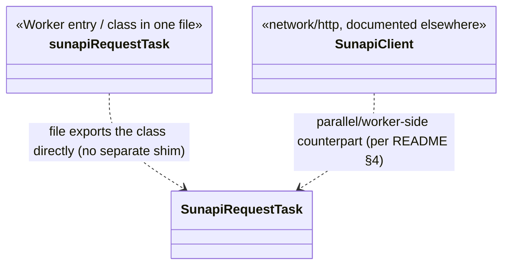

Unlike the other `worker/*` pairs, `sunapiRequestTask.ts` is **not** split into a thin shim file
plus a separate class file — the file both defines `SunapiRequestTask` and (implicitly, via its
constructor defaults) is the class the Worker instantiates. There is no separate
`sunapiRequestWorker.ts` shim in this codebase's `worker/sunapi/` directory.

### `SunapiRequestTask` (`worker/sunapi/sunapiRequestTask.ts`)

- **Structure**
  - Public fields: `digestInfo: DigestCache | undefined`, `data: SunapiTaskRequestData | null`,
    `working = false`, `postMethodTimeout = 10000`, `getMethodTimeout = 1000`
    (`worker/sunapi/sunapiRequestTask.ts:90-94`).
  - Private field: `xhr: XMLHttpRequest | null`.
  - Constructor: `constructor(private readonly xhrFactory: SunapiTaskXHRFactory = () => new
    XMLHttpRequest(), private readonly postMessageFn: SunapiTaskPostMessageFn = (data) =>
    postMessage(data))` (`worker/sunapi/sunapiRequestTask.ts:98-101`) — both dependencies
    injectable for testing.
  - Ported from a legacy file that used bare top-level `this.digestInfo = ...` assignments at
    classic-Worker-script scope (equivalent to `self.digestInfo = ...` there); reproduced here as
    plain instance fields on a class whose single instance plays the same "shared mutable state"
    role. No inheritance.
  - Key types: `SunapiTaskDeviceInfo`, `SunapiTaskRequestData`, `SunapiCallbackList`, `DigestCache`
    (HTTP Digest auth challenge/response state), `SunapiTaskResult`
    (`worker/sunapi/sunapiRequestTask.ts:7-53`).

- **Method Analysis**
  - `onMessage(event: { data: SunapiTaskRequestData }): void`
    (`worker/sunapi/sunapiRequestTask.ts:103-142`) — **confirmed unreachable in the current build**:
    its first statement calls the main-thread-only global `fastJsonStringfy`, which doesn't exist
    in a Worker's global scope, so it throws `ReferenceError` immediately on every invocation. The
    dispatch logic below that throw (store `data`/`digestInfo`, branch on `method.toLowerCase()`
    into `ajaxAsync`/`ajaxSync` for POST/GET, with special-casing for `configbackup` URIs and
    `SunapiSeqId` query-param injection) is preserved faithfully as dead code rather than deleted,
    per the class doc comment.
  - `onError(err: unknown): void` — `console.debug(err)` only.
  - `ajaxAsync(method, uri, scope, fileData?, specialHeaders?, isText?): void` (private) — builds
    an async `XMLHttpRequest` via `makeNewRequest`, wires it via `setupAsyncCall`, optionally
    attaches `specialHeaders`, and sends (with or without a body), catching send errors into
    `parserError`.
  - `ajaxSync(method, uri, isText?): void` (private) — the synchronous-XHR path (used for GET
    requests not matching `configbackup`/`async`), same construction pattern.
  - `onReadyStateChangeEventHandler` (private, arrow field,
    `worker/sunapi/sunapiRequestTask.ts:189-263`) — handles all `XMLHttpRequest.readyState`
    transitions: on `DONE`, checks for a `401` response and — if the server challenged with
    `www-authenticate` — parses digest info, posts an `{ id: 'auth', ... }` message, rebuilds and
    resends the request with an `Authorization` header; otherwise calls `parseResponse`. On
    `HEADERS_RECEIVED`, similarly detects and re-issues on a mid-flight `www-authenticate`
    challenge. Other states (`LOADING`, `OPENED`, `UNSENT`) are logged only.
  - `updateProgress(event: ProgressEvent): void` (private) — logs upload percent-complete when
    `lengthComputable`.
  - `parseResponse(xhr: XMLHttpRequest): void` (private,
    `worker/sunapi/sunapiRequestTask.ts:273-332`) — builds a `SunapiTaskResult`: non-`200` status →
    `id: 'error'`; empty response → early return (no message sent); `arraybuffer`/XML/`isText`
    responses → passed through as-is; otherwise parses as JSON (falling back to
    `getDotEqualStrLineToObj` for non-JSON key=value text) and posts the result. Contains a
    preserved dead branch checking `result.Response === 'Fail'` on a freshly-created `{}` that can
    never have that property set.
  - `parserError(xhr, error): void` (private) — posts `{ id: 'error', success: false, code,
    status, message }`.
  - `makeNewRequest(method, uri, isAsync, wwwAuthenticate?, isText?): XMLHttpRequest` (private,
    `worker/sunapi/sunapiRequestTask.ts:345-373`) — builds the request URL from `deviceInfo`
    (protocol/hostname/port), sets `XClient`/`Accept` headers, and — if a `wwwAuthenticate`
    challenge string is passed or `digestInfo` is already cached — computes and sets the
    `Authorization` header via `setAuthorizationHeader`.
  - `setAuthorizationHeader(xhr, method, uri, digestCache): void` (private,
    `worker/sunapi/sunapiRequestTask.ts:375-414`) — implements **HTTP Digest** response computation
    for `'digest'`/`'xdigest'` schemes via `formulateResponse` (MD5-based HA1/HA2/response per
    RFC 2617); the `'basic'` scheme branch is a **confirmed real bug**: it references an undeclared
    `RESdata` identifier and throws `ReferenceError` whenever a server challenges with Basic auth,
    preserved faithfully rather than fixed.
  - `getDigestInfoInWwwAuthenticate(wwwAuthenticate: string | null): DigestCache | false`
    (`worker/sunapi/sunapiRequestTask.ts:416-459`) — parses a `WWW-Authenticate` header's
    comma-separated `key=value` parts into `scheme`/`realm`/`nonce`/`opaque`/`qop`, generates a
    fresh `cnonce`, and increments `nc` (preserving a `null++` → `1` coercion quirk from legacy).
  - `setupAsyncCall(xhr, method, callbackList?, uri): void` (private) — wires optional
    `ProgressEvent`/`CompleteEvent`/`CancelEvent`/`FailEvent` callbacks (defaulting `FailEvent` to a
    handler that throws `'Network Error'`), sets timeouts (`postMethodTimeout`/`getMethodTimeout`,
    overridable per-`deviceInfo`), and sets `responseType = 'arraybuffer'` for `configbackup` URIs
    or `withCredentials = true` for `opensdk` URIs.
  - `formulateResponse(...): string` (private) — the RFC 2617 digest formula:
    `MD5(HA1:nonce:nc:cnonce:qop:HA2)` where `HA1 = MD5(username:realm:password)` and `HA2 =
    MD5(method:uri)`, via `crypto-js`'s `CryptoJS.MD5`.
  - `generateCnonce(): string` (private) — 16 random hex-alphabet characters (uses `Math.random()`,
    not a CSPRNG).
  - `decimalToHex(d, padding?): string` (private) — zero-pads a decimal `nc` counter to hex.
  - `jsonToText(json): string` (private) — serializes a plain object into `&key=value` query-string
    fragments (booleans as `'True'`/`'False'`).
  - `getDotEqualStrLineToObj(data: string): Record<string, unknown>`
    (`worker/sunapi/sunapiRequestTask.ts:542-567`) — parses `'\r\n'`-delimited `a.b.c=value` lines
    into a nested object (for camera/NVR responses that aren't JSON); also **confirmed unreachable**
    — its own final `console.log` line hits the same undeclared `fastJsonStringfy` bug as
    `onMessage`, so it throws before ever returning, on top of being reachable at all only if
    `onMessage`'s own earlier crash were fixed.
  - `isJSON(str: unknown): boolean` (private) — `try { JSON.parse(str) } catch { false }` check.

- **Call Stack** — this file's own dispatcher (`onMessage`) is confirmed dead (see above); the
  diagram below shows the *intended* (as-designed, currently-unreachable) flow, faithfully
  reflecting what the ported logic does once entered, per the file's own doc comment:

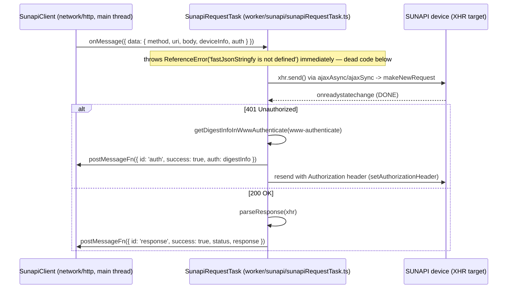

- **RFC / Standard References** — implements **HTTP Digest Access Authentication** per
  **RFC 2617** (obsoleted by RFC 7616, but the MD5-only HA1/HA2 formula implemented here matches
  the original RFC 2617 algorithm, not RFC 7616's newer SHA-256 variants). The underlying transport
  is plain HTTP/XMLHttpRequest — no RTP/RTSP standard applies here, since SUNAPI is a REST/HTTP
  camera-management API, not a media-streaming protocol.

- **Relations & Data Flow** — per README §4, `SunapiRestClient` (the main-thread-callable facade,
  documented in the `network` doc) treats this Worker as its "parallel/worker-side counterpart" —
  `SunapiClient` does not construct `SunapiRequestTask` directly; it dispatches SUNAPI REST calls
  into this Worker to keep XHR I/O off the main thread. Per README §7, `sunapiRequestTask` "owns"
  `SunapiRequestTask` with no reference back to `SunapiClient`.

---

## 7. `worker/backup` — AVI/ZIP muxing worker

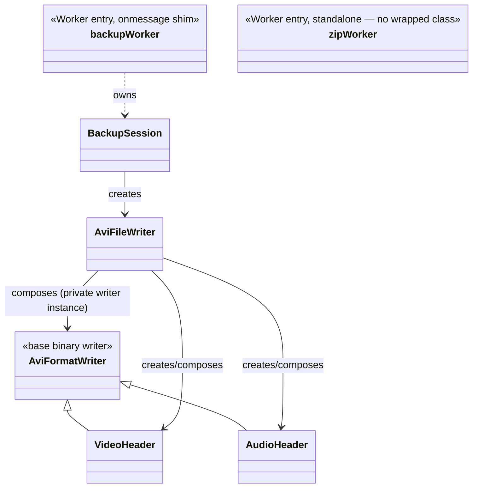

### `AviFormatWriter` (`worker/backup/AviFormatWriter.ts`)

- **Structure**
  - Public fields: `bufferIndex = 0`, `errorCase = 0`, `buffer: Uint8Array = new Uint8Array(0)`,
    and four structured-data fields written by subclasses/composers: `mainHeader: AviMainHeader`,
    `streamHeader: AviStreamHeader`, `streamFormat: AviStreamFormat`, `aviIndexEntry:
    AviIndexEntry`, `chunkHeader: AviChunkHeader` (`worker/backup/AviFormatWriter.ts:91-99`).
  - Module constants encoding fixed AVI struct sizes: `HEADER_BYTES = 2048`,
    `SIZE_OF_CHUNK_HEADER = 8`, `SIZE_OF_AVI_INDEX_ENTRY = 16`, `SIZE_OF_AVI_MAIN_HEADER = 64`,
    `SIZE_OF_STREAM_HEADER = 64`, `SIZE_OF_BITMAP_INFO = 48`, `SIZE_OF_WAVE_FORMAT = 40`, and AVI
    flag bits `AVIF_WASCAPTUREFILE = 0x00010000`, `AVIF_HASINDEX = 0x00000010`.
  - This is the shared base for the whole AVI-writer family. README §7's class diagram shows
    `AviFormatWriter <|-- AudioHeader`/`VideoHeader` as real `extends` inheritance in this port
    (legacy used `inheritObject(new AviFormatWriter(), {...})`, i.e. runtime method-copying onto a
    fresh instance — this TypeScript port uses a genuine base class instead, since the overrides in
    question have compatible signatures for `AudioHeader`/`VideoHeader`).

- **Method Analysis** — low-level binary writer primitives plus AVI-chunk-specific composers:
  - `setBuffer(buffer: Uint8Array): void` — swaps in a new working buffer and resets
    `bufferIndex = 0`.
  - `writeInt8`/`writeInt16`/`writeInt32(val): void` — little-endian byte-at-a-time writes,
    advancing `bufferIndex`.
  - `writeString(str: string): void` — writes each character's char code as a byte; if `str ===
    ''`, instead **skips 4 bytes** (`bufferIndex += 4`) without writing anything — used to reserve
    space for a fixed-width FourCC/tag field that's intentionally left blank.
  - `writeChunkHeader(dummyCountInput?: number): void` — writes one or more `{fourcc, size}` 8-byte
    chunk headers into a freshly sized buffer; `dummyCount` writes that many zero-payload "dummy"
    headers first (used by `VideoHeader` to pad variable-framerate video up to constant-rate AVI
    timing) before the real chunk header.
  - `initMainHeader(frameInfo): void` — populates `mainHeader` with the AVI RIFF `'avih'` chunk
    fields: `aviMicroSecPerFrame = 1e6 / framerate`, flags `AVIF_WASCAPTUREFILE | AVIF_HASINDEX`,
    fixed `aviStreams = 2` (always exactly one video + one audio stream), width/height, and a fixed
    128 KiB suggested buffer size.
  - `updateInfo(frameInfo, fileInfo, streamData?): unknown` — base no-op (`return undefined`),
    overridden by `AudioHeader`/`VideoHeader`.
  - `get/setStreamHeader`, `get/setStreamFormat`, `get/setMainHeader`, `get/setIndexEntry`,
    `setChunkHeader` — plain accessors over the structured fields.
  - `appendBuffer(buffer: Uint8Array): void` — copies another buffer into the current one at
    `bufferIndex`, advancing it (used to concatenate the video-header and audio-header blocks after
    the main AVI header).
  - `getIndexBuffer(): Uint8Array` — serializes one `idx1`-style AVI index entry (`chid`, `flag`,
    `offset` — adjusted for any dummy-count padding — `size`), with dummy-count support mirroring
    `writeChunkHeader`.
  - `writeMainHeader()` / `writeStreamHeader()` / `writeBitmapInfo()` / `writeWaveFormatEx()` —
    serialize the AVI main header (`avih`), a generic stream header (`strh`, shared shape for both
    video and audio streams), the video-specific `BITMAPINFOHEADER` (`strf` for video), and the
    audio-specific `WAVEFORMATEX` (`strf` for audio), respectively — each writing fields in the
    fixed binary layout the AVI/RIFF spec (as implemented by this codebase, informally) requires.
  - `writeAviMainHeader(fileSize: number): void` — writes the outermost `RIFF....AVI ` container
    tag, the `LIST hdrl` chunk, and the main header — the very start of the file.
  - `getVideoHeader()` / `getAudioHeader(): Uint8Array` — each writes one `LIST strl` sub-chunk
    (stream header + format) for video or audio respectively.
  - `writeJunk(pos: number): Uint8Array` — pads the header section out to a fixed `HEADER_BYTES =
    2048` total via a `JUNK` filler chunk, then opens the `LIST movi` chunk that all subsequent
    frame data lives inside — this is why AVI headers conventionally reserve a fixed-size block:
    so the file can be streamed/written incrementally without knowing the final index size upfront.
  - `writeAviTailHeader(tailSize: number): Uint8Array` — writes the `idx1` index-chunk's own RIFF
    tag/size prefix (the actual index *entries* are written separately per-frame via
    `getIndexBuffer`).
  - `getChunkPayloadSize()` / `setErrorCode()` / `getErrorCode()` / `getTotalFrames()` — simple
    accessors, the latter two used for cross-stream codec/resolution-change detection (see
    `VideoHeader`/`AudioHeader`).
  - `getDuration(): number` — `streamHeader.aviLength / (streamHeader.aviRate / 1000)`, i.e. total
    frame count divided by the stream's rate-per-second (used by `BackupSession` to detect the
    5-minute max-duration split trigger).
  - `setResolution(w, h, fps): void` — updates both `streamHeader` (right/bottom/suggested buffer
    size) and `streamFormat` (width/height/image size) together.
  - `getAviSampleSize(): number` — `floor((bitsPerSample + 7) / 8) * channels`, clamped to a
    minimum of `1` — the audio "sample size" field AVI readers use to interpret `auds` chunk
    boundaries.

- **Call Stack** — see `BackupSession` below; `AviFormatWriter`'s methods are called indirectly
  through `VideoHeader`/`AudioHeader` (inheriting its writer methods) and directly by
  `AviFileWriter` (composing a private instance) for the top-level RIFF/main-header/junk/tail
  framing.

- **RFC / Standard References** — implements the **Microsoft RIFF/AVI container format**. This is
  explicitly **not** an IETF RFC or ITU-T standard — it is a vendor (Microsoft) binary file-format
  specification (`RIFF`/`AVI `/`LIST`/`hdrl`/`strl`/`movi`/`idx1` FourCC chunk structure, as seen
  throughout this class's `write*`/`get*Header` methods).

- **Relations & Data Flow** — the shared base every other class in this AVI-writer family builds
  on: extended by `AudioHeader`/`VideoHeader`, composed (as a private field) by `AviFileWriter`.
  Never talks to the main thread directly — only `BackupSession`/`backupWorker.ts` (below) do that.

### `AudioHeader` (`worker/backup/AudioHeader.ts`)

- **Structure** — `export class AudioHeader extends AviFormatWriter` (no fields of its own beyond
  the inherited ones). Module constants for AAC/G.711/G.726 framing: `MEDIASUBTYPE_RAW_AAC1 =
  0x00ff`, `AAC_PER_SAMPLE = 1024`, `WAVE_FORMAT_MULAW = 0x0007`, per-bitrate `BITRATE` map
  (16K/24K/32K/40K, used only for G.726).

- **Method Analysis**
  - `initHeader(): void` — resets `streamHeader`/`streamFormat` to zeroed/empty AVI `auds` stream
    defaults.
  - `settingAAC(audioFrame: AudioBackupFrame): void` — populates header/format for AAC: `aviType =
    'auds'`, `aviScale = AAC_PER_SAMPLE` (1024 samples/AAC-frame), `aviRate =
    audioSamplingRate`, `FormatTag = MEDIASUBTYPE_RAW_AAC1`, `AudioConfig` computed by the free
    function `makeAudioConfig(samplerate, channels)` (packs sample-rate index + channel-count index
    + the `0x0010` "AAC-LC" profile bit into one 16-bit field — a Microsoft/DirectShow-style AAC
    `WAVEFORMATEX` extension, not a raw ADTS/LATM config).
  - `settingG711(): void` — fixed 8000 Hz/8-bit/mono µ-law header (`WAVE_FORMAT_MULAW`,
    `BlockAlign = 1`), with `aviSampleSize` computed via the inherited `getAviSampleSize()`.
  - `settingG726(audioFrame: AudioBackupFrame): void` — bitrate-dependent header (2/3/4/5-bit
    samples for 16/24/32/40 kbps respectively), `FormatTag = 0x0045`. Contains a preserved legacy
    typo: `audioFormat.aviSuggestedBufferSize = audioHeader.aviRate` assigns to the *format*
    object's field of that name, not the *header* object's (`AviStreamHeader.aviSuggestedBufferSize`)
    — a real bug kept for fidelity (`worker/backup/AudioHeader.ts:96-101` doc comment).
  - `checkAudioFrameInfo(audioFrame, fileInfo): number` — on the very first audio frame, dispatches
    to the appropriate `settingAAC`/`settingG711`/`settingG726` and records the chosen
    codec/bitrate/sample-rate into `fileInfo`; on every subsequent frame, verifies the incoming
    frame still matches that recorded config, returning `-1` (a "codec/profile changed" signal) on
    any mismatch.
  - `updateInfo(audioFrame, fileInfo): Uint8Array | null` (override,
    `worker/backup/AudioHeader.ts:237-278`) — the main per-frame entry point `AviFileWriter`
    delegates to: pads odd-length payloads to even, sets up the `01wb` (audio chunk) index entry,
    calls `checkAudioFrameInfo` and returns `null` (with `errorCode = -1`) on a codec change,
    re-applies the relevant `settingAAC`/`settingG711`/`settingG726` (since header fields like
    `aviRate`/`aviLength` need refreshing per-frame, not just once), tracks cumulative
    frame-count/bytes for `aviLength`, and finally calls the inherited `writeChunkHeader()` to
    produce the actual chunk-header bytes returned to the caller.

- **Call Stack** — see `BackupSession`'s sequence diagram below (`AudioHeader.updateInfo` is called
  once per audio frame via `AviFileWriter.updateInfo('audio', ...)`).

- **RFC / Standard References** — same as `AviFormatWriter`: Microsoft RIFF/AVI container format,
  no IETF/ITU standard. The audio *codecs* it describes headers for (AAC, G.711, G.726) each have
  their own standard (ISO/IEC 13818-7/14496-3 for AAC; ITU-T G.711/G.726) but `AudioHeader` itself
  only writes container metadata, not codec bitstream data.

- **Relations & Data Flow** — composed by `AviFileWriter` (one `AudioHeader` instance per file),
  driven per-frame by `BackupSession.onAudioData()`.

### `VideoHeader` (`worker/backup/VideoHeader.ts`)

- **Structure** — `export class VideoHeader extends AviFormatWriter`. Constants: `SEC_TO_MS =
  1000`, `DUMMY_COUNT_RESET_THRESHOLD = 210`.

- **Method Analysis**
  - `initHeader(videoFrame: VideoBackupFrame): void` — populates `streamHeader` (`aviType =
    'vids'`, `aviHandler = codectype` e.g. `H264`/`HEVC`/`MJPG`, `aviScale = 1000`, `aviRate = 1000
    * framerate` — i.e. AVI's "N units per `aviScale` units of time" expressed in milliseconds) and
    `streamFormat` (`BITMAPINFOHEADER`-shaped: width/height/24-bit/`Compression = codectype`).
  - `updateInfo(videoFrame, fileInfo): Uint8Array | null` (override,
    `worker/backup/VideoHeader.ts:60-153`) — the most algorithmically involved method in this
    group, implementing **variable-frame-rate-to-constant-frame-rate AVI timing** via "dummy
    frames":
    1. Pads odd PES sizes to even; sets up a `00dc` (video chunk) index entry with `flag = 0x10`
       for I-frames, `0x00` otherwise.
    2. On the first frame, calls `initHeader` and records width/height/codec into `fileInfo`; on
       later frames, checks the codec and resolution haven't changed (returning `-1`/`-2` error
       codes into `setErrorCode` otherwise, which `BackupSession` interprets as "must split the
       file").
    3. Computes `rate` = expected ms-per-frame at the stream's framerate, then compares the actual
       gap between this frame's `sourceInputMs` and the previous frame's timestamp
       (`fileInfo.last_ms`) against that expected rate. If the source ran ahead of what a
       constant-rate timeline would predict, computes a `dummycount` — the number of zero-payload
       placeholder frames to insert so the AVI's frame-index stays in sync with real elapsed time
       (handles frame drops/gaps in the live source without desyncing AVI playback timing).
       `dummycount` is reset to `0` and `fileInfo.last_ms` reset to `0` if it would exceed
       `DUMMY_COUNT_RESET_THRESHOLD` (a runaway-gap guard, e.g. after a long stream stall).
    4. Writes the real chunk header (with `dummycount` leading zero-payload dummy chunk headers
       prepended, via the inherited `writeChunkHeader(dummycount)`), advances `videoHeader.aviLength`
       by `dummycount + 1`, and updates the index entry / `fileInfo.pos` accordingly.

- **Call Stack** — see `BackupSession` below (`VideoHeader.updateInfo` called once per video frame
  via `AviFileWriter.updateInfo('video', ...)`).

- **RFC / Standard References** — same as `AviFormatWriter`: Microsoft RIFF/AVI container format,
  not an IETF/ITU standard. The video codecs it labels (`H264`/`HEVC`/`MJPG`) are themselves ITU-T/
  ISO standards, but `VideoHeader` only writes AVI container metadata around already-encoded frame
  bytes, not codec bitstream data itself.

- **Relations & Data Flow** — composed by `AviFileWriter`, driven by `BackupSession.onVideoData()`;
  its `getDuration()` (inherited from `AviFormatWriter`) is what `BackupSession` polls to detect
  the 5-minute max-duration split trigger.

### `AviFileWriter` (`worker/backup/AviFileWriter.ts`)

- **Structure**
  - Private fields: `readonly writer = new AviFormatWriter()`, `readonly createVideoHeader = new
    VideoHeader()`, `readonly createAudioHeader = new AudioHeader()`
    (`worker/backup/AviFileWriter.ts:20-22`) — composition, not inheritance (see doc comment: legacy
    built this via `inheritObject`/runtime method-copying with type-incompatible override
    signatures, so this port uses explicit forwarding to three owned instances instead of
    `extends`).
  - No public fields; a thin facade over its three owned writer instances.

- **Method Analysis**
  - `initHeader(type: 'video' | 'audio', frameInfo): void` — for `'video'`: initializes the shared
    `writer`'s main header, then both `createVideoHeader.initHeader(frameInfo)` and
    `createAudioHeader.initHeader()` (audio header is always initialized alongside the first video
    frame, since AVI's main header always declares exactly 2 streams — see
    `AviFormatWriter.initMainHeader`). For `'audio'`: only initializes the audio header (handles the
    case where audio frames start arriving before any video frame has been seen, though
    `BackupSession.onAudioData` actually guards against exactly that — see below).
  - `updateInfo(type, frameInfo, fileInfo): Uint8Array | null` — routes to
    `createVideoHeader.updateInfo(...)` or `createAudioHeader.updateInfo(...)` by `type`.
  - `getErrorCode(type)` / `getChunkPayloadSize(type)` / `getIdxBuffer(type)` — routing forwarders,
    same pattern.
  - `getDuration(): number` — always delegates to `createVideoHeader.getDuration()` (video is the
    canonical duration source; there is no audio-duration equivalent exposed here).
  - `makeAviHeader(fileSize: number, filePos: number): Uint8Array`
    (`worker/backup/AviFileWriter.ts:66-74`) — assembles the complete AVI header block: sets
    `mainHeader.aviTotalFrames` from the video header's frame count, writes the RIFF/main-header via
    the shared `writer`, appends the video `LIST strl` and audio `LIST strl` sub-chunks, then writes
    the `JUNK` padding + opens the `LIST movi` chunk — this is the single call that produces the
    entire fixed 2048-byte header region written once per file (or per split segment).
  - `makeAviTail(tailSize: number): Uint8Array` — writes the `idx1` tail-chunk RIFF prefix via the
    shared `writer`.
  - `setResolution(width, height, fps): void` — forwards to `createVideoHeader.setResolution(...)`.

- **Call Stack** — see `BackupSession` below; this class is the direct collaborator
  `BackupSession` calls for every header/frame operation.

- **RFC / Standard References** — same as `AviFormatWriter`: Microsoft RIFF/AVI, not an
  IETF/ITU standard.

- **Relations & Data Flow** — created and owned exclusively by `BackupSession` (one instance per
  backup session/file). Composes (not extends) `AviFormatWriter`/`VideoHeader`/`AudioHeader`.

### `BackupSession` (`worker/backup/BackupSession.ts`)

- **Structure**
  - Accessors backed by private fields: `channelId`/`_channelId`, `deviceType`/`_deviceType`,
    `gmt`/`_timezone` (setter ignores `null`/`undefined`, only ever *raising* the value once set),
    `filename`/`_filename` (getter falls back to `makeFileName()` — an auto-generated
    codec/resolution/timestamp name — whenever no explicit filename was set).
  - `isPlayback = false` — deliberately **public**, not private: mirrors a legacy module-scope
    variable shared between `backupWorker.ts`'s dispatcher and this session's own methods (see the
    class doc comment) — `backupWorker.ts` sets it directly from the outside whenever an incoming
    message carries `playMode === 'Playback'`.
  - Private state: `fileInfo: BackupFileInfo | null` (`{ pos, tailSize, width?, height?,
    fileSize? }`), `splitEnabled = false`, `zipEncrypt = false`, `videoFrame`/`audioFrame`
    (accumulated per-stream frame-info structs), `createAviFile: AviFileWriter | null`,
    `startDate`/`endDate: BackupTimeInfo` (first/last frame timestamps, for filename/report
    purposes).
  - Constructor: `constructor(private readonly sendMessage: BackupSendCallback, private readonly
    closeWorker: () => void)` (`worker/backup/BackupSession.ts:144`) — both callbacks injected by
    `backupWorker.ts` (wrapping `postMessage`/`close()` respectively), calls `this.init()`
    immediately.

- **Method Analysis**
  - `init(channelId?: number): void` — resets `isPlayback = false`, constructs a fresh
    `AviFileWriter`, clears `filename`, optionally sets `channelId`.
  - `setZipEncrypt(value: boolean): void` / `split(): void` — simple mode-flag setters (the latter
    only ever sets `splitEnabled = true`, never clears it).
  - `makeFileName(): string` (private, `worker/backup/BackupSession.ts:204-220`) — builds
    `"{videoCodec} {width}x{height}[ {audioCodec}[_{bitrateKbps}]]_{YYYYMMDD}_{HHMMSS}"` from the
    accumulated frame info and the current wall-clock time.
  - `setVideoFrameInfo(data: BackupVideoFrameInfo): void` (private,
    `worker/backup/BackupSession.ts:222-271`) — on the very first video frame, lazily creates
    `fileInfo = { pos: 4, tailSize: 0 }` and immediately sends a `'backupResult'` message with
    `errorCode: 0x0600` ("backup started"); normalizes codec names (`MJPEG -> 'MJPG'`, `H264 ->
    'H264'`, `H265 -> 'HEVC'` — there is no `else` branch, so a `'VP8'`/`'VP9'`/`'AV1'`
    `data.codectype` leaves `this.videoFrame.codectype` `undefined` rather than being rejected or
    passed through; local-backup/export (AVI file writing) for these three codecs remains
    unimplemented — a separate, still-open gap from live decode/render (§3's
    `AssemblyDecoder`/`WebCodecsVideoDecoder`, which *does* now handle all five video codecs);
    computes `sourceInputMs` from
    the RTP timestamp fields (seconds +
    microseconds, rounded down to the nearest 10ms); records `startDate`/`endDate` and sends a
    `'timestamp'` progress message whenever real timestamp fields are present; on the first frame
    only, calls `createAviFile.initHeader('video', videoFrame)`.
  - `setAudioFrameInfo(data: BackupAudioFrameInfo): void` (private,
    `worker/backup/BackupSession.ts:273-294`) — normalizes codec-specific sampling
    rate/bitrate (G.711 → fixed 8kHz/64kbps, AAC → fixed 16kHz/48kbps, G.726 → 8kHz + the reported
    bitrate); lazily creates `fileInfo` (with the same `'backupResult' 0x0600` announcement) if no
    video frame has arrived yet either; on the first audio frame, calls
    `createAviFile.initHeader('audio', ...)`.
  - `checkMaxSize(): boolean` (private, `worker/backup/BackupSession.ts:296-319`) — computes the
    current projected file size against a mode-dependent cap (`MAX_FILESIZE_ZIP` ≈ 250 MiB if
    encrypting, `MAX_FILESIZE_300` ≈ 300 MiB if split-enabled, else `MAX_FILESIZE_500` ≈ 500 MiB);
    if exceeded: either triggers `fileSplit()` (split mode) or finalizes and ends the session
    entirely (non-split mode, `errorCode: 0x0608`).
  - `fileSplit(): void` (private) — writes the AVI header/tail for the *current* segment, sends a
    `'backup'` `{ target: 'save', ... }` message (with a `filename start-end` timestamp suffix) to
    trigger `FileMaker`/`BackupProvider` to finalize that segment as its own file, sends a
    `'backupResult'` progress message (`errorCode: 0x0607`), then resets `fileInfo`/`videoFrame`/
    `startDate` so a **new** segment begins on the next frame (this is why `onVideoData`'s I-frame
    check below matters — a fresh segment needs to start on an I-frame).
  - `onVideoData(frameInfo, streamData): void` (`worker/backup/BackupSession.ts:339-421`) — the
    main per-video-frame entry point: bails if no `createAviFile`, or if no session is open yet and
    this isn't an I-frame (can't start mid-GOP). Calls `setVideoFrameInfo`, then (if under the size
    cap) `createAviFile.updateInfo('video', videoFrame, fileInfo)`. On a codec/resolution-change
    error (`header === null`): if split-enabled, splits the file and — if the triggering frame was
    itself an I-frame — immediately retries on the fresh segment; if not split-enabled, sends a
    terminal error `'backupResult'` (`0x060b` codec-changed or `0x060a` profile-changed) and ends
    the session. On success: pads a trailing dummy byte if the actual stream data is shorter than
    the AVI writer's expected chunk payload size, sends the index-buffer/header/streamData as
    `'backup'` `{ target: 'tailBody'|'body', ... }` messages, and — outside split mode — ends the
    session once `getDuration() >= MAX_BACKUP_DURATION_SEC` (5 minutes), unless currently in
    playback mode (`isPlayback` suppresses the duration-based auto-stop, since playback exports are
    expected to run longer than 5 minutes of *wall clock* recording time).
  - `onAudioData(frameInfo, streamData): void` (`worker/backup/BackupSession.ts:423-476`) — the
    audio counterpart: requires `fileInfo` to already exist (i.e. at least one video frame must have
    started the session first — audio alone never starts a backup); same
    codec-change/size-cap/duration-cap handling pattern as `onVideoData`, plus an AAC-specific
    trailing-dummy-byte pad.
  - `writeAviHeader()` / `writeAviTail()` (private) — compute final file/tail sizes and send
    `'backup'` `{ target: 'mainHeader' }` / `{ target: 'tailHeader' }` messages built via
    `AviFileWriter.makeAviHeader`/`makeAviTail`.
  - `endSession(): void` (`worker/backup/BackupSession.ts:492-525`) — the terminal path: if no
    frames were ever received, sends an immediate error result (`0x0604`) and returns; otherwise
    writes the header/tail, sends the `'backup'` `{ target: 'save', ... }` message (split-mode
    filenames get a start-end timestamp suffix, non-split ones don't), sends a final
    `'backupResult'` success message (`0x0601`) if both video and audio error codes are clean, then
    calls `closeWorker()` (which `backupWorker.ts` wires to `close()`, terminating the Worker) and
    nulls `fileInfo`/`createAviFile`.

- **Call Stack** — end-to-end backup pipeline (video frame → AVI chunk stream → saved file), the
  worker-side half of the `BackupProvider` sequence diagram in §2:

```mermaid
sequenceDiagram
    participant BW as backupWorker.ts
    participant BS as BackupSession
    participant AFW as AviFileWriter
    participant VH as VideoHeader
    participant AH as AudioHeader

    BW->>BS: new BackupSession(sendMessage, closeWorker)
    BW->>BS: channelId = ...; deviceType = ...; gmt = ...; filename = ...; setZipEncrypt(!!password)
    BW->>BS: onVideoData(frameInfo, streamData)
    BS->>BS: setVideoFrameInfo(frameInfo)  %% first frame: fileInfo = {pos:4,...}, sends 'backupResult' 0x0600
    BS->>AFW: createAviFile.initHeader('video', videoFrame)  %% first frame only
    AFW->>VH: createVideoHeader.initHeader(videoFrame)
    AFW->>AH: createAudioHeader.initHeader()
    BS->>BS: checkMaxSize()
    BS->>AFW: createAviFile.updateInfo('video', videoFrame, fileInfo)
    AFW->>VH: createVideoHeader.updateInfo(videoFrame, fileInfo)
    VH-->>AFW: Uint8Array chunk header (or null on codec/profile change)
    AFW-->>BS: header
    BS->>BW: sendMessage('backup', { target: 'tailBody', data: idxBuffer })
    BS->>BW: sendMessage('backup', { target: 'body', data: header })
    BS->>BW: sendMessage('backup', { target: 'body', data: streamData })
    BW->>BS: onAudioData(frameInfo, streamData)  %% same body/tailBody flow via AudioHeader
    Note over BS: getDuration() >= 300s, or checkMaxSize() exceeded -> endSession()/fileSplit()
    BW->>BS: endSession() (on 'stop' message, or auto-triggered)
    BS->>AFW: makeAviHeader(fileSize, filePos) / makeAviTail(tailSize)
    BS->>BW: sendMessage('backup', { target: 'mainHeader'/'tailHeader', data })
    BS->>BW: sendMessage('backup', { target: 'save', data: filename })
    BS->>BW: sendMessage('backupResult', { errorCode: 0x0601, ... })
    BS->>BW: closeWorker() -> close()
```

- **RFC / Standard References** — orchestration/state-machine logic only; the file format it
  produces is the same **Microsoft RIFF/AVI container format** as `AviFormatWriter` (no IETF/ITU
  standard involved). The 5-minute (`MAX_BACKUP_DURATION_SEC`) and size-cap (250/300/500 MiB)
  constants are application-level policy, not standards.

- **Relations & Data Flow** — owned by `backupWorker.ts` (one instance per active backup); creates
  and drives one `AviFileWriter`. All communication back to the main thread (and thus to
  `BackupProvider`/`FileMaker`) is via the injected `sendMessage` callback — no direct reference.

### `backupWorker` (`worker/backup/backupWorker.ts`)

- **Structure** — module-level `let backupSession: BackupSession | null = null`. Message union type
  `BackupWorkerMessage` (`'start' | 'sendVideoFrame' | 'sendAudioFrame' | 'stop'`).

- **Method Analysis** — `receiveMessage(event)` (`worker/backup/backupWorker.ts:42-80`):
  - First, regardless of message type: if `message.playMode === 'Playback'` and a session already
    exists, sets `backupSession.isPlayback = true` (see `BackupSession`'s doc comment on why this is
    a module-level-shared flag, not reset here — only a fresh `'start'` resets it).
  - `'start'` — constructs a new `BackupSession`, wiring `sendMessage` to `postMessage({ type,
    data })` and `closeWorker` to `close()`; sets `channelId`/`deviceType`/`gmt`/`filename` from the
    message, `setZipEncrypt(!!password)`, and calls `split()` if `message.data.split` is truthy.
  - `'sendVideoFrame'` — `backupSession.onVideoData(frameInfo, streamData)`.
  - `'sendAudioFrame'` — `backupSession.onAudioData(frameInfo, streamData)`.
  - `'stop'` — `backupSession.endSession()`, nulls `backupSession`, and calls `close()` directly
    (in addition to whatever `endSession()`'s own `closeWorker()` call already did).

- **Call Stack** — see `BackupSession`'s diagram above and `BackupProvider`'s diagram in §2; this
  file is the thin message-routing layer connecting the two.

- **RFC / Standard References** — pure message-dispatch plumbing; no protocol standard of its own.

- **Relations & Data Flow** — per README §7, reachable only via `postMessage` from
  `BackupProvider` (§2); owns exactly one `BackupSession` for the Worker's lifetime (a new `'start'`
  message replaces it outright rather than reusing the old one).

### `zipWorker` (`worker/backup/zipWorker.ts`)

- **Structure** — no class, no wrapped class either: this file is a standalone Worker script that
  `importScripts`s the vendored `vendor/minizip-asm.js` UMD bundle (loaded as a classic top-level
  script, not an ES import, since the vendor bundle isn't an ES module) at load time, then installs
  a single `self.onmessage` handler. This is the one Worker in this document's scope that does
  **not** follow the "thin shim around one real class" pattern — the vendored `Minizip` class comes
  entirely from the third-party bundle, not from this codebase.

- **Method Analysis** — `self.onmessage = (event) => {...}`
  (`worker/backup/zipWorker.ts:30-51`) — the entire file's logic: destructures `{ fileName,
  password, whole }` from the message, concatenates every `Uint8Array` chunk in `whole` into one
  flat `buffer`, constructs a vendored `new Minizip()`, calls `mz.append(fileName + '.avi',
  buffer.buffer, { compressLevel: 0, password })` (store-only, no actual DEFLATE compression — the
  `password` still applies ZipCrypto/AES encryption via Minizip if set), calls `mz.zip()` to
  produce the final archive bytes, and `self.postMessage(result, [result.buffer])` (zero-copy
  transfer).

- **Call Stack** — see `FileMaker`'s section in §2 (`createZipFile`) for the full round trip; this
  file is the receiving end of that single message.

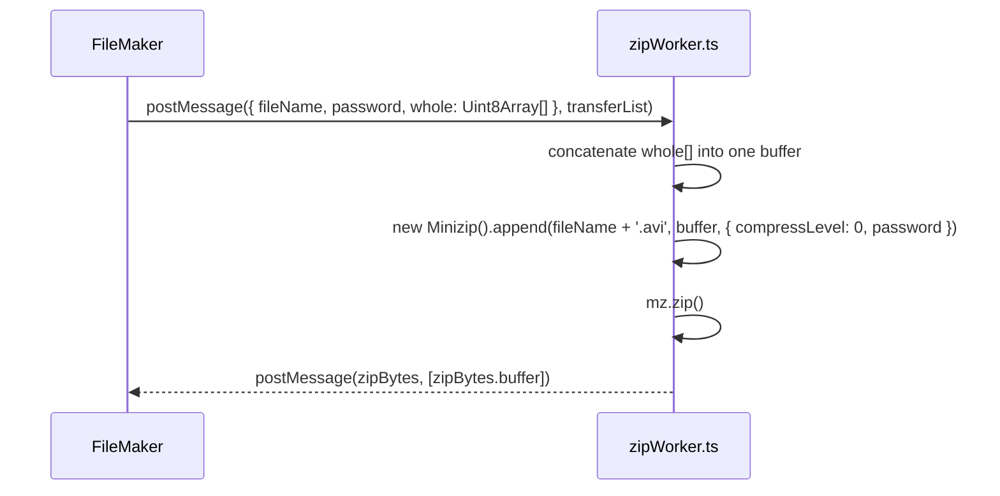

- **RFC / Standard References** — produces a **PKWARE .ZIP file** (the PKWARE .ZIP File Format
  Specification) — explicitly **not** an IETF RFC; it's a vendor (PKWARE) specification. The
  compression level is `0` (stored, uncompressed) — this Worker is used purely for the optional
  **password-protected encryption** of a backup export, not for size reduction.

- **Relations & Data Flow** — constructed on demand by `FileMaker` (§2), only when a password is
  configured; terminated immediately after producing its one result. No reference to
  `BackupSession`/`backupWorker.ts`/`AviFileWriter` or any other class in this document — it
  receives already-fully-assembled AVI bytes as plain `Uint8Array[]` chunks.

---

## Summary of standards referenced in this document

| Subsystem | Standard | Body | Notes |
|---|---|---|---|
| Talk-back audio codec | G.711 | ITU-T | Not an RFC; µ-law only implemented here |
| Talk-back RTP transport | RFC 3551 (+ RFC 3550) | IETF | AV Profile / base RTP, handled downstream in `AudioTalkSession` |
| MJPEG depacketization | RFC 2435 (+ RFC 3550) | IETF | `MjpegDepacketizer`; RFC 3984 cited in source comments is an H.264 copy-paste artifact, not applicable |
| SUNAPI auth | RFC 2617 | IETF | HTTP Digest (MD5 variant); `SunapiRequestTask.formulateResponse` |
| AVI container | Microsoft RIFF/AVI | Vendor (Microsoft) | No IETF/ITU standard exists; `AviFormatWriter`/`AviFileWriter`/`AudioHeader`/`VideoHeader`/`BackupSession` |
| ZIP archive | PKWARE .ZIP spec | Vendor (PKWARE) | No IETF/ITU standard exists; `zipWorker.ts` |
| Video codecs in backup/decode | H.264, H.265 | ITU-T / ISO-IEC | `AssemblyDecoder`, `VideoHeader`'s `aviHandler` field |
| VP8/VP9/AV1 decode | W3C WebCodecs (`VideoDecoder`/`EncodedVideoChunk`/`VideoFrame`) | W3C | `WebCodecsVideoDecoder` — no vendored WASM decoder for these, decoded natively by the browser; backup/export (AVI) still unimplemented for these three, unlike decode |
| Audio codec in backup transcode | AAC | ISO/IEC | `AssemblyTranscoder`, `AudioHeader.settingAAC` |
| Worker message passing (all workers) | — | — | Internal plain-data protocol, no external standard |
