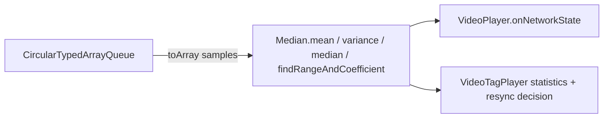
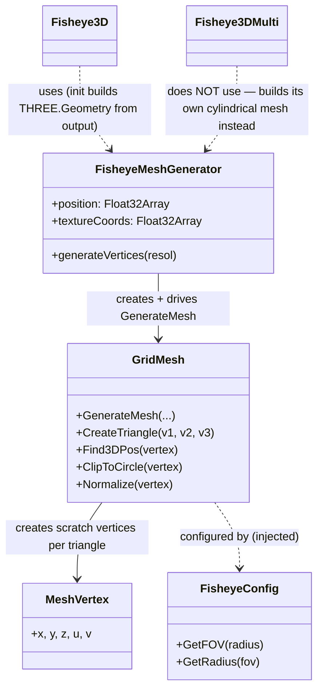

# `src/player/util` — Standalone Helper Classes and Functions (part 2)

*Per-class reference for the general-purpose helpers under `src/player/util/` that don't belong to any other
subsystem's documentation — data structures, timing, and math utilities.*

**Version:** 1.1.0 · **Author:** Youngho Kim

**History**

| Date | Change |
| --- | --- |
| 2026-08-06 | Add per-class reference docs for `src/player` (initial version) |
| 2026-08-26 | Added Title/Abstract/Version/Author/History metadata header |
| 2026-09-03 | Added `avcConfigParser.ts` (`parseAvcConfigurationRecord`/`buildAvc1CodecString`) — feeds MJPEG's new `WebCodecsVideoEncoder`-based real-MSE tier. See `05-video-player-rendering.md`, `07-talk-backup-worker.md` §3b, `09-mp4-container-generation.md`, and this repo's `MEMORY.md`. |
| 2026-09-04 | Added `debugLog.ts` (`DebugConfig`/`DebugTarget`, `parseDebugAttribute`, `validateDebugConfig`, `isDebugEnabled`, `createDebugLogger`) — backs the new `debug` attribute on `RTSPOverWebSocket` (`01-elements-interface-exceptions.md`), consumed by every subsystem's own `debug` setter/`setDebugConfig()` (`02` through `07`). |

---

This document covers the general-purpose helpers under `src/player/util/` that don't belong to any other
subsystem's documentation. It complements [`src/player/README.md`](../../src/player/README.md)'s
["10. `util` — notable standalone classes"](../../src/player/README.md) section, going deeper into the actual
algorithms; it deliberately **skips** `util/DigestGenerator.ts` (documented alongside `network/`),
`util/H264SPSParser.ts`, `util/H265SPSParser.ts`, and `util/CommonAudioUtil.ts` (documented alongside
`mediaSession/`).

Everything here is exported from the `util/` barrel, [`src/player/util/index.ts`](../../src/player/util/index.ts).

## Contents

- Data structures: [`BufferList`/`BufferNode`](#bufferlist--buffernode-utilbufferlistts),
  [`CircularTypedArrayQueue`](#circulartypedarrayqueue-utilcirculartypedarrayqueuets),
  [`Queue`](#queue-utilqueuets), [`RTSPOverWebSocketMap`](#rtspoverwebsocketmap-utilrtspoverwebsocketmapts)
- Geometry/statistics: [`Size`](#size-utilsizets), [`Mean`](#mean-utilmeants), [`Median`](#median-utilmedianfxxts)
- Timing/environment: [`IntervalTimer`](#intervaltimer-utilintervaltimerts),
  [`browserDetect`](#browserdetect-utilbrowserdetectts)
- Fisheye dewarping: [`Fisheye3D`](#fisheye3d-utilfisheye3dts), [`Fisheye3DMulti`](#fisheye3dmulti-utilfisheye3dmultits),
  [`fishEyeMesh.ts`](#fisheyemeshts-utilfisheyemeshts) (`FisheyeMeshGenerator`, `GridMesh`, `MeshVertex`, `FisheyeConfig`)
- Small functions: [`binaryString.ts`](#binarystringts-utilbinarystringts), [`cloneArray`](#clonearray-utilclonearrayts),
  [`dateFormat.ts`](#dateformatts-utildateformatts), [`fastJsonStringfy`](#fastjsonstringfy-utilfastjsonstringfyts),
  [`formatBytes.ts`](#formatbytests-utilformatbytests),
  [`getElementByAttributeValue`](#getelementbyattributevalue-utilgetelementbyattributevaluets),
  [`hex.ts`](#hexts-utilhexts), [`indexOfMulti`](#indexofmulti-utilindexofmultits)
- MSE codec strings: [`avcConfigParser.ts`](#avcconfigparserts-utilavcconfigparserts) (new, 2026-09-03)
- Diagnostics: [`debugLog.ts`](#debuglogts-utildebuglogts) (new, 2026-09-04)

All of these are ported from the legacy player's `Util/util` grab-bag module (or, for the fisheye files, from
`Util/fishEye3D` / `Util/fishEye3D_multi`), per each file's own header comment. None of them import from elsewhere
in `src/player` except `Fisheye3D.ts` (which imports `fishEyeMesh.ts`) — this group is leaf-level plumbing.

---

### `BufferList` / `BufferNode` (`util/BufferList.ts`)

- **Structure**
  - `BufferNode<T>`: `next: BufferNode<T> | null`, `previous: BufferNode<T> | null`, and a mutable
    `buffer: T | null` set via the constructor (`constructor(public buffer: T | null)`).
  - `BufferList<T>`: `protected length`, `head: BufferNode<T> | null`, `tail: BufferNode<T> | null`,
    `curIdx = 0`. No constructor arguments — starts empty.
  - Methods: `getCurIdx(): number`, `push(buffer: T): BufferNode<T>`, `pop(): BufferNode<T> | null`,
    `clear(): void`.

- **Method Analysis** — A textbook doubly-linked list, intentionally minimal. `push` allocates a new
  `BufferNode`, appends it after the current `tail` (wiring `tail.next`/`node.previous`), and updates `tail`
  (or initializes `head`/`tail` if the list was empty); it always returns the created node. `pop` removes and
  returns the **head** node — but only when `length > 1`: if the list has exactly one or zero elements, `pop`
  is a no-op that returns `null`, so the very last node is never actually removed via `pop` (a preserved legacy
  quirk, not accidental — the class-level doc comment notes this file only ports the subset of the legacy
  `BufferNode`/`BufferList` API that has real callers, and `pop`'s "always leave the last node" behavior is
  copied as-is). `clear()` walks the list from `head` to `tail`, nulling out each node's `buffer` field (to drop
  references for GC) without unlinking the nodes themselves, then resets `length`, `head`, `tail`, and `curIdx`.
  `curIdx` itself is only ever read (`getCurIdx`) or reset (`clear`) — nothing in this file ever advances it;
  it exists purely as public state for a consumer to manage. Per the file's header comment, `pushPop`,
  `searchNodeAt`, `remove`, and `removeTillCurrent` from the legacy source were intentionally **not** ported
  because nothing in the ported codebase calls them yet.

- **Call Stack** — Grep-confirmed: **no other file under `src/player` currently imports `BufferList` or
  `BufferNode`** (only `util/index.ts`'s barrel re-export references them). This is a reserved/parity utility,
  not dead code removed — see Relations below for why it still matters.

- **RFC / Standard References** — N/A. A generic internal data structure with no external standard.

- **Relations & Data Flow** — Two other classes in this codebase are structurally near-identical
  hand-written linked lists that exist *instead of* using `BufferList` directly:
  [`mediaSession/videoSession/VideoBufferList.ts`](../../src/player/mediaSession/videoSession/VideoBufferList.ts)'s
  `VideoBufferNode`/`VideoBufferList` (adds width/height/codec/frameType/timestamp fields per node, plus a
  buffer-full callback) and
  [`video/player/canvas/StepBufferList.ts`](../../src/player/video/player/canvas/StepBufferList.ts)'s
  `StepBufferList` (an array-backed step/seek buffer, whose own doc comment explains it was **not** built by
  extending `BufferList` because its `push` signature is incompatible and `BufferList`'s other methods have no
  callers on a `StepBufferList` instance). Both are documented in the `mediaSession`/`video/player` docs. In
  other words, `BufferList`/`BufferNode` currently function as the generic template these two more specialized
  buffers were modeled after, rather than as a shared base class or a directly-invoked dependency.

---

### `CircularTypedArrayQueue<T>` (`util/CircularTypedArrayQueue.ts`)

- **Structure** — `static readonly MAX_SIZE = 2**53 - 1`; instance fields `maxSize: number`,
  `autodelete?: boolean`, private `items: (T | null)[]`, private `head = -1`, private `tail = -1`.
  `constructor(maxSize?: number, autodelete?: boolean)` — `maxSize` defaults to `MAX_SIZE` if falsy/omitted.
  Public API: `setMaxSize`, `isFull`, `isEmpty`, `enQueue`/`push`/`insert` (all aliases), `deQueue`/`pop`
  (aliases), `front`/`peak` (aliases, `peak` is a preserved legacy misspelling of "peek"), `getLength`,
  `Clear` (capital-C, distinct from a hypothetical `clear`), `toArray`, `print`.

- **Method Analysis** — A true circular (ring) buffer over a fixed logical capacity `maxSize`, using two
  index cursors, `head` and `tail`, both initialized to `-1` (meaning empty). `increment(value)` computes
  `(value + 1) % maxSize`, wrapping indices back to `0` once they pass `maxSize - 1` — this is the actual
  wraparound logic. `isEmpty()` checks `tail === -1 && head === -1`. `isFull()` checks whether incrementing
  `tail` would land exactly on `head` — i.e. the ring is full when the next write slot is the oldest unread
  slot. `enQueue(record)`: if full, either throws (`"Queue is full can't add new records"`) or, when
  `autodelete` is set, silently `deQueue()`s the oldest element first to make room (this is how the two real
  call sites use it — see Call Stack); if the queue was empty, `head` is advanced from `-1` to `0` first; then
  `tail` is always advanced and the new record written at `items[tail]`. `deQueue()` throws on an empty queue,
  otherwise reads `items[head]`, nulls that slot, and either fully resets (`head = tail = -1`) if `head === tail`
  (last element removed) or just advances `head`. Note the ring never actually shrinks the backing `items`
  array — old slots are only ever nulled, not spliced out.
  `getLength()` is explicitly documented (and confirmed by reading the body) to return `this.items.length` —
  the **total backing-array length ever grown to**, not the logical element count (`tail - head` accounting for
  wraparound). This is a deliberately preserved legacy naming/behavior mismatch: `getLength()` does not report
  how many elements are actually queued.  `Clear()` (capital C) throws on an already-empty queue (unlike a
  conventional "clear" which is normally a no-op on empty input), nulls every slot from `head` to `tail`,
  reassigns `items = []`, and resets the cursors.

- **Call Stack** — Both real consumers use it as a fixed-size ring buffer of recent numeric samples with
  `autodelete: true` (so pushing past capacity silently evicts the oldest sample instead of throwing):
  - [`video/player/VideoPlayer.ts`](../../src/player/video/player/VideoPlayer.ts)`:79` —
    `fpsQueue = new CircularTypedArrayQueue<number>(5, true)`, filled via `enQueue` and drained via `toArray()`
    once `isFull()`, then fed into `Median.variance`/`Median.mean` to compute a framerate/jitter statistic
    reported through `onNetworkState`.
  - [`video/player/video/VideoTagPlayer.ts`](../../src/player/video/player/video/VideoTagPlayer.ts)`:152` —
    `videoTimestampIntervalQueue = new CircularTypedArrayQueue<number>(VIDEO_MAX_TIMESTAMP_QUEUE, true)`
    (`VIDEO_MAX_TIMESTAMP_QUEUE = 10`), storing consecutive frame-timestamp deltas; drained via `toArray()` and
    fed into `Median.mean`/`Median.median`/`Median.variance`/`Median.findRangeAndCoefficient` to build
    diagnostic playback statistics and to detect abnormal timestamp variance (compared against
    `VIDEO_MAX_VARIANCE_VALUE`).

- **RFC / Standard References** — N/A. A generic internal ring-buffer implementation, no external standard.

- **Relations & Data Flow** — Consumed by `VideoPlayer` (canvas-tag rendering path) and `VideoTagPlayer`
  (`<video>`-tag rendering path), both documented under `video/player`; both hand its drained contents to
  `Median` (below) for the actual statistics math.

---

### `Queue<T>` (`util/Queue.ts`)

- **Structure** — `private static readonly DEFAULT_MAX_SIZE = 2**53 - 1`; instance fields
  `private readonly maxSize`, `private items: T[] = []`, `private offset = 0`.
  `constructor(maxSize?: number)`. Public API: `getLength`, `isEmpty`, `isFull`, `enqueue`, `dequeue`, `peek`,
  `print`.

- **Method Analysis** — A conventional array-backed FIFO queue using the classic "lazy compaction" trick
  instead of a ring buffer: `dequeue()` doesn't shift the array (an O(n) operation); it just reads
  `items[offset]` and increments `offset`, leaving dequeued elements in place until `offset` reaches at least
  half of `items.length`, at which point `items` is compacted via `items.slice(offset)` and `offset` reset to
  `0`. This amortizes dequeue cost to O(1) while bounding wasted memory to roughly 2x the live element count.
  `getLength()` correctly returns the logical count (`items.length - offset`), unlike
  `CircularTypedArrayQueue.getLength()`. `isFull()` compares the same logical count against `maxSize`, and
  `enqueue`/`dequeue` throw on overflow/underflow respectively, same error strings as
  `CircularTypedArrayQueue`. `peek()` returns `undefined` (not throwing) when empty.

- **Call Stack** — N/A — grep-confirmed there are currently no imports of `Queue` anywhere under `src/player`
  outside its own barrel re-export in `util/index.ts`. It is exported but unused by any ported class so far.

- **RFC / Standard References** — N/A. Generic internal FIFO utility.

- **Relations & Data Flow** — None currently; a reserved general-purpose FIFO for future use, distinct from
  `CircularTypedArrayQueue`'s fixed-capacity ring-buffer semantics (`Queue` grows unbounded up to `maxSize`
  rather than overwriting).

---

### `RTSPOverWebSocketMap<V>` (`util/RTSPOverWebSocketMap.ts`)

- **Structure** — `private map: Record<string, V> = {}`. No constructor parameters. Public API: `put`, `get`,
  `containsKey`, `containsValue`, `isEmpty`, `clear`, `remove`, `keys`, `values`, `size` — a Java-`HashMap`-style
  method set (`put`/`containsKey`/`containsValue` rather than native `Map`'s `set`/`has`).

- **Method Analysis** — Backed by a plain object (`Record<string, V>`) rather than a native ES `Map`, with
  keys coerced to strings (`key as string`) even when a `number` is passed — so numeric and string keys that
  stringify the same collide (`put(1, x)` and `put('1', y)` overwrite each other), matching plain-object key
  semantics. `containsValue` does a linear `for...in` scan comparing with **loose equality** (`==`), which the
  code explicitly calls out via an inline comment — `"Legacy loose-equality (==) semantics preserved
  intentionally — see hashMap"` — and suppresses with an eslint-disable for `eqeqeq`, i.e. this is a
  deliberately preserved legacy quirk (a value `0` would loosely match a stored `false`, etc.), not an
  oversight. `size()` is `Object.keys(this.map).length`, `clear()`/`remove()` use `delete`. This class exists
  as a straight, behavior-preserving port of a legacy Java-influenced `hashMap`-like helper (the class name
  itself, and the `put`/`containsKey`/`containsValue` naming, are the giveaway) — the codebase needs its own
  wrapper instead of a native `Map` purely for API/behavioral parity with that legacy `hashMap` type (loose-
  equality `containsValue`, string-coerced keys, Java-style method names), not for any performance or
  correctness reason a native `Map` couldn't otherwise satisfy.

- **Call Stack** — Used by the two SPS parsers as a small key/value cache:
  [`util/H264SPSParser.ts`](../../src/player/util/H264SPSParser.ts)`:15` and
  [`util/H265SPSParser.ts`](../../src/player/util/H265SPSParser.ts)`:23`, both as
  `private spsMap = new RTSPOverWebSocketMap<SpsValue>()` (documented in the `mediaSession` docs, which cover
  both SPS parser classes in full).

- **RFC / Standard References** — N/A. Internal legacy-parity data structure with no external standard.

- **Relations & Data Flow** — Consumed by `H264SPSParser` and `H265SPSParser` only (both documented under
  `mediaSession/`). Not used elsewhere.

---

### `Size` (`util/Size.ts`)

- **Structure** — Fields `w: number`, `h: number`, `viewWidth?: number`, `viewHeight?: number`.
  `constructor(width: number, height: number, viewWidth?: number, viewHeight?: number)` — `viewWidth`/
  `viewHeight` are only assigned if not `undefined` (so omitting them leaves the fields genuinely absent, not
  set to `undefined` explicitly — relevant for any `'viewWidth' in size` style check). Methods: `toString()`,
  `getHalfSize(): Size`, `length(): number`.

- **Method Analysis** — A small value object for a 2D pixel size plus an optional secondary "view"
  size. `toString()` renders `"(w, h)"`. `getHalfSize()` returns a **new** `Size` with `w`/`h` right-shifted by
  1 via the unsigned right-shift operator (`w >>> 1`), i.e. an integer halving that also happens to floor
  towards zero for non-negative inputs (and would reinterpret negative numbers as unsigned 32-bit — not a
  concern here since dimensions are never negative). `length()` returns `w * h` — pixel area. The class-level
  doc comment explains it's a straight port of legacy's `Size` factory function; despite that factory's unusual
  "assign onto `Constructor.prototype`" style, it's behaviorally equivalent to a normal constructor since each
  call created a fresh `Constructor`, so it was ported as a conventional class without preserving the odd
  factory mechanics.

- **Call Stack** — Used throughout the WebGL/canvas rendering path:
  [`video/player/canvas/CanvasRenderer.ts`](../../src/player/video/player/canvas/CanvasRenderer.ts)`:152` builds
  `this.size = new Size(videoInfo.width, videoInfo.height)` from decoded frame dimensions, and later (`:245`)
  builds a second `Size` carrying `mapWidth`/`mapHeight` as the `viewWidth`/`viewHeight` fields (with a noted
  pre-existing bug where those are not coerced through `Number()`, so they can end up holding strings — call
  site comment flags this as a preserved legacy defect).
  [`video/player/canvas/webgl/WebGLCanvas.ts`](../../src/player/video/player/canvas/webgl/WebGLCanvas.ts) and
  [`YUVWebGLCanvas.ts`](../../src/player/video/player/canvas/webgl/YUVWebGLCanvas.ts) take a `Size` in their
  constructors and read `.w`/`.h` for viewport/texture sizing; `YUVWebGLCanvas` also calls `getHalfSize()` to
  size the chroma (U/V) textures at half resolution, which is the standard 4:2:0 chroma-subsampling layout.
  [`GLPrimitives.ts`](../../src/player/video/player/canvas/webgl/GLPrimitives.ts) takes a `Size` (type-only
  import) for its `Texture` constructor.

- **RFC / Standard References** — N/A. Plain internal value object; the half-size/4:2:0 usage reflects a
  general video convention (chroma subsampling), not something this file itself encodes as a standard.

- **Relations & Data Flow** — Produced by `CanvasRenderer` from decoded video dimensions, consumed by
  `WebGLCanvas`/`YUVWebGLCanvas`/`GLPrimitives` (all documented under `video/player`) to size GL textures and
  viewports.

---

### `Mean` (`util/Mean.ts`)

- **Structure** — Fields `count = 0`, `sum = 0`. No constructor arguments. Methods: `record(val: number): void`,
  `variance(val: number): number`, `mean(): string | number`.

- **Method Analysis** — A minimal running-average (cumulative mean) tracker, not a windowed one: `record`
  unconditionally accumulates every value ever passed in (`count++`, `sum += val`), so unlike
  `CircularTypedArrayQueue`-backed stats, older samples are never evicted or reweighted — the mean is over the
  entire lifetime of the instance. `mean()` returns `(sum / count).toFixed(3)` — a **string** — once at least
  one value has been recorded, or the **number** `0` before that; the doc comment explicitly flags this mixed
  return type as intentional, preserved because real call sites already guard with `isNaN(x.mean())`, which
  works against both a numeric `0` and a numeric string. `variance(val)` computes the squared deviation of a
  single given value from the current mean (`Number(this.mean())` coerces the string case back to a number) —
  note this is *not* the population/sample variance of all recorded values (that's `Median.variance`, a
  different algorithm below); it's a single-point squared-deviation helper.

- **Call Stack** — Used exclusively by
  [`video/player/video/VideoTagPlayer.ts`](../../src/player/video/player/video/VideoTagPlayer.ts), which keeps
  three separate `Mean` instances (`:169-171`): `decodedMean` (decoded-frames-per-second), `videoMean`
  (decoded-bytes-per-second), and `dropMean` (dropped-frames-per-second), each `record()`-ed once per second
  (`:650-652`) and read back via `.mean()` into the periodic statistics payload (`:610-625`,
  `decodedFramesMean`/`decodedBytesMean`/`dropFramesMean`), guarded by `isNaN(...)` checks consistent with the
  documented mixed return type.

- **RFC / Standard References** — N/A. Basic descriptive-statistics helper, no external standard.

- **Relations & Data Flow** — Consumed only by `VideoTagPlayer` (documented under `video/player`) for its
  framerate/bitrate/drop-rate telemetry.

---

### `Median` (`util/Median.ts`)

- **Structure** — Not a class: a plain object literal exporting a fixed set of pure functions, all operating
  on `number[]` inputs: `max`, `min`, `range`, `midrange`, `sum`, `mean`, `median`, `getMaxOfArray`,
  `getMinOfArray`, `findRangeAndCoefficient`, `modes`, `variance`, `standardDeviation`,
  `meanAbsoluteDeviation`, `zScores`.

- **Method Analysis** — A grab-bag of basic descriptive-statistics helpers over an arbitrary numeric sample
  array (i.e. these operate on a full array passed at call time, not an accumulated running window like
  `Mean`). Notable details from reading the implementation:
  - `sum`/`mean` are straightforward reductions; `max`/`min`/`getMaxOfArray`/`getMinOfArray` are duplicate
    pairs (`Math.max.apply`/`Math.min.apply`) kept for legacy API-surface parity — `max`/`min` and
    `getMaxOfArray`/`getMinOfArray` are functionally identical.
  - `median(array)` sorts a **copy** of the array ascending, then for an odd-length array indexes the exact
    middle element and for an even-length array averages the two middle elements — a correct, standard median
    algorithm.
  - `range(array)` is a **confirmed dead/broken function**: it references an undeclared global `arr.min(...)`
    that was never defined in the legacy source (`arr` is not `array`, a bug in the original), so this port
    reproduces the same failure via an explicit `throw new ReferenceError('arr is not defined')` rather than
    silently "fixing" it. It's preserved for fidelity even though the doc comment confirms (via grep) nothing
    in the ported codebase actually calls `Median.range` or `Median.midrange` (which calls `range`) — so this
    is inert dead code kept only because `Median` is ported as a complete object.
  - `findRangeAndCoefficient(array)` computes `(max - min) / (max + min)` — a coefficient-of-range style
    normalized spread metric, distinct from `range()`'s (broken) simple max-min.
  - `variance`/`standardDeviation`/`meanAbsoluteDeviation`/`zScores` are textbook population-statistics
    formulas built compositionally on top of `mean`: variance is the mean of squared deviations, standard
    deviation its square root, mean absolute deviation the mean of absolute deviations, and z-scores the
    per-element `(x - mean) / stddev` normalization.
  - `modes(array)` does a single pass building a frequency map, tracking the running maximum count and
    collecting *all* values tied for that maximum (so it can return multiple modes, not just one).

- **Call Stack** — Used by both canvas-based and `<video>`-tag playback paths to turn raw per-frame timing
  samples into diagnostic/adaptive statistics:
  - [`video/player/VideoPlayer.ts`](../../src/player/video/player/VideoPlayer.ts)`:131,155` — computes
    `Median.variance(samples)` and `Median.mean(samples)` over the `fpsQueue`
    (`CircularTypedArrayQueue`, see above) contents, feeding `onNetworkState`.
  - [`video/player/video/VideoTagPlayer.ts`](../../src/player/video/player/video/VideoTagPlayer.ts)`:1040-1055`
    — computes `Median.mean`/`Median.median`/`Median.variance`/`Median.findRangeAndCoefficient` over
    `videoTimestampIntervalQueue`'s drained samples (inter-frame timestamp deltas) both to populate a
    statistics payload (`mean_duration`, `timestamp_mean`, `timestamp_median`, `timestamp_variance`,
    `cofficient_of_range` — note the preserved legacy typo in that last field name) and to decide whether the
    variance exceeds `VIDEO_MAX_VARIANCE_VALUE`, which drives an adaptive re-sync/skip decision.

- **RFC / Standard References** — N/A — standard descriptive-statistics formulas (mean, variance, standard
  deviation, z-score), not tied to any RFC or player-specific standard.

- **Relations & Data Flow** — Consumed by `VideoPlayer` and `VideoTagPlayer` (both `video/player`), typically
  fed by samples drained from a `CircularTypedArrayQueue`:

---

### `IntervalTimer` (`util/IntervalTimer.ts`)

- **Structure** — Fields: `private timerId?`, `private startTime = 0`, `private remaining = 0`,
  `private state: 0 | 1 | 2 | 3 = 0` (`0` idle, `1` running, `2` paused, `3` resumed — per the inline comment).
  `constructor(private readonly callback: () => void, private readonly interval: number)`. Public API:
  `pause(): void`, `resume(): void`; private `timeoutCallback(): void`.

- **Method Analysis** — A thin wrapper around `setInterval` that adds pause/resume with **elapsed-time
  preservation** (not drift correction in the sense of compensating for event-loop jitter, but in the sense of
  not losing/restarting progress across a pause). The constructor immediately starts ticking
  (`setInterval(callback, interval)`) and records `startTime = Date.now()`; state becomes `1` (running).
  `pause()` is only effective from state `1`: it computes `remaining = interval - (Date.now() - startTime)`
  (how much of the current period is left), clears the native interval, and moves to state `2` (paused).
  `resume()` is only effective from state `2`: it moves to state `3` ("resumed", a transitional state) and
  schedules a one-shot `setTimeout` for exactly the previously-computed `remaining` ms. When that timeout fires,
  `timeoutCallback` double-checks the state is still `3` (guards against a `pause()` happening again during the
  timeout window, though there is no `pause` handling for state `3` itself since `pause()` requires state `1`)
  — invokes the callback once immediately (completing the interrupted period), resets `startTime`, restarts a
  fresh native `setInterval`, and returns to state `1`. There is no `stop()`/`dispose()` method — the only way
  to stop it permanently is external (e.g. `clearInterval` on a captured id is not exposed; a consumer simply
  stops calling `pause`/`resume` and lets the underlying `setInterval` keep running, or the whole object is
  dropped along with its owner).

- **Call Stack** — Used as a fixed-cadence statistics-polling timer in three unrelated modules, always at a
  1-second period and always assigned to a field literally named `statisticsTimer`:
  [`network/transport/Transport.ts`](../../src/player/network/transport/Transport.ts)`:241` —
  `new IntervalTimer(() => this.onStatisticsTimer(), 1000)`;
  [`mediaSession/RtpSession.ts`](../../src/player/mediaSession/RtpSession.ts)`:124` —
  `new IntervalTimer(() => this.onStatisticsTimer(), DEFAULT_STATISTICS_INTERVAL)` (also exposes a
  `getStatisticsTimer()` accessor);
  [`video/player/video/VideoTagPlayer.ts`](../../src/player/video/player/video/VideoTagPlayer.ts)`:678` —
  `new IntervalTimer(() => this.getCurrentVideoFrame(), 1000)`. In all three cases the pause/resume machinery
  lets the owning session/player suspend statistics polling (e.g. while backgrounded or buffering) without
  losing its place in the current 1-second period.

- **RFC / Standard References** — N/A. A generic internal timer utility with no external standard.

- **Relations & Data Flow** — Consumed independently by `Transport` (`network/`), `RtpSession`
  (`mediaSession/`), and `VideoTagPlayer` (`video/player`) — three separate subsystems each documented
  elsewhere, with no relation to each other beyond sharing this utility.

---

### `browserDetect` (`util/BrowserDetect.ts`)

- **Structure** — `export type BrowserName = 'ie' | 'ie10' | 'ie11' | 'edge' | 'chrome' | 'safari' | 'firefox'
  | undefined`. `export function browserDetect(): BrowserName` — no parameters, reads global `navigator`.

- **Method Analysis** — A `navigator.userAgent`/`navigator.appName` sniffing function (not feature-detection):
  returns `undefined` immediately if `navigator` doesn't exist (Node/SSR/test environment), otherwise
  lower-cases the user-agent string and checks, in order: (1) IE/Edge family — `appName === 'Microsoft Internet
  Explorer'` (old IE, further parses an `msie N` version number via regex into `'ie' + N`, e.g. `'ie8'`), or
  `'trident'` in the UA (IE11, which changed its `appName`) returning `'ie11'`, or `'edge/'` in the UA returning
  `'edge'`, else a bare `'ie'` fallback; (2) `'safari'` in the UA — returns `'chrome'` if `'chrome'` is *also*
  present (since Chrome's UA string includes "Safari" for legacy compatibility reasons), else `'safari'`;
  (3) `'firefox'` in the UA — returns `'firefox'`; otherwise `undefined` (covers non-matching browsers,
  including modern Edge-on-Chromium, which no longer matches any of the above branches since it dropped
  `edge/` from its UA and instead reads as Chrome).

- **Call Stack** — Two call sites, each gating a narrow, real per-browser rendering/timing quirk:
  - [`video/player/canvas/webgl/WebGLCanvas.ts`](../../src/player/video/player/canvas/webgl/WebGLCanvas.ts)`:42`
    computes a module-level constant `BROWSER_TYPE = browserDetect()` once, then at `:116` checks
    `BROWSER_TYPE === 'edge'` to apply a horizontal texture-coordinate scale correction "to avoid gray line of
    image when width is not divisible by 16 for Edge browser" (an old-Edge WebGL/canvas width-alignment quirk).
  - [`mediaSession/MediaRouter.ts`](../../src/player/mediaSession/MediaRouter.ts)`:317` stores
    `browserType = browserDetect()` per instance, then at `:1093` checks `this.browserType !== 'firefox'` before
    honoring a `'requestTimeChanged'` command — i.e. Firefox is deliberately excluded from acting on that
    command (a Firefox-specific behavioral difference the legacy code worked around, preserved verbatim without
    further explanation in the source).

- **RFC / Standard References** — N/A. UA-sniffing is explicitly a non-standard, legacy technique (the modern
  alternative is feature-detection); no RFC governs `navigator.userAgent` content itself beyond it being an
  arbitrary browser-supplied string.

- **Relations & Data Flow** — Consumed independently by `WebGLCanvas` (`video/player/canvas/webgl`) and
  `MediaRouter` (`mediaSession/`) to work around browser-specific quirks (an Edge WebGL rendering artifact and
  a Firefox command-handling difference respectively) — unrelated to each other beyond both needing to know
  "which browser am I in."

---

### `Fisheye3D` (`util/FishEye3D.ts`)

- **Structure** — Private fields: THREE.js scene graph handles (`camera: THREE.PerspectiveCamera | null`,
  `scene: THREE.Scene | null`, `renderer: THREE.WebGLRenderer | null`, `_geometry: THREE.Geometry | null`,
  `tex: THREE.Texture | null`), pointer/orbit interaction state (`isUserInteracting`,
  `onPointerDownPointerX/Y`, `onPointerDownLon/Lat`, `lon`, `lat`, `phi`, `theta`), view state (`distance`,
  `fov`, `storedValue: FisheyeStoredView | null`, `_isWallMode`, `_fisheyeviewMode`), plus `_container`,
  `_background`, `_mesh`, `animateId`. Exported types: `FisheyeStoredView` (`{ longitude, latitude, phi, theta,
  distance }`), `FisheyeMountMode = 'wall' | 'celling'` (legacy misspelling of "ceiling", preserved),
  `FisheyeTextureSource` (an `HTMLVideoElement | HTMLCanvasElement` with optional `videoWidth`/`videoHeight`).
  `constructor(rendererFactory: () => THREE.WebGLRenderer = () => new THREE.WebGLRenderer())` — the renderer
  factory is injectable (for testing without a real WebGL context). Key methods: `init(videoElement, container,
  background?)`, `start()`/`stop()`, `animate` (arrow-function render-loop tick), `update()`, mouse/wheel
  handlers (`onDocumentMouseDown/Move/Up/DbClick/Wheel`), `onWindowResize`, and accessor properties `mesh`,
  `mount` (setter only meaningfully usable — see below), `fisheyeview`.

- **Method Analysis** — Sets up a full THREE.js scene that dewarps a fisheye camera feed onto a hemispherical
  mesh generated by `FisheyeMeshGenerator` (from `fishEyeMesh.ts`), with mouse-drag pan/tilt, wheel zoom, and
  a toggleable "fisheye view" (flat/undewarped) vs. dewarped perspective mode.
  - `init()` sizes a `THREE.PerspectiveCamera` (75° FOV) based on the video's aspect ratio (falling back to
    the window's aspect ratio if width equals height — an edge case for a perfectly square source), builds a
    `THREE.Geometry` by calling `FisheyeMeshGenerator.generateVertices(RESOL)` (`RESOL = 2992.0`, a fixed
    working resolution for the mesh regardless of actual video resolution) and copying its
    `position`/`textureCoords` flat `Float32Array`s into `THREE.Vector3` vertices / `Face3` triangles / UV
    coordinates scaled by `200` (an arbitrary world-space scale factor), converts that to a `BufferGeometry`,
    and wraps a `VideoTexture` (for `<video>` sources) or `CanvasTexture` (for `<canvas>` sources, used e.g. for
    canvas-tag rendered frames) around the fisheye frame as the mesh's material map.
  - `update()` (driven by `animate`'s `requestAnimationFrame` loop) computes camera position on a sphere from
    spherical coordinates `phi`/`theta` (derived from `lat`/`lon`, which are driven by drag interaction),
    computes a **clamp limit** on how far the view can pan based on `distance` vs. `DISTANCE_NEAR` (`500`) and
    `fov`, splits into two branches for `_isWallMode` (mounted on a wall — pans within [-90°,90°] longitude,
    with a limit derived from horizontal FOV/aspect via `atan(tan(fov/2) * aspect)`) vs. ceiling/floor mount
    (pans over a wider vertical range, limit is a simpler `fov/2 + 5` degrees), then repositions the camera
    with standard spherical-to-Cartesian conversion (`x = d·sinφ·cosθ`, etc., with axes swapped between the two
    modes) and calls `camera.lookAt(target)` before rendering. The zoom/dolly interaction (mouse wheel,
    double-click) manipulates `distance`/`fov` between `MIN_DISTANCE` (effectively 0, "dewarped/zoomed-in
    perspective" view) and `DEFAULT_DISTANCE` (250, the full fisheye/dewarped-out view) — `fisheyeview` toggles
    between showing the raw fisheye circle (pulled back to `DEFAULT_DISTANCE`, near `distance = MIN_DISTANCE`
    per the toggle logic) and a perspective-corrected pan/tilt/zoom view, and remembers the last pan/tilt/zoom
    state via `storedValue` so leaving and re-entering `fisheyeview` mode restores where the user was looking.
  - Two confirmed legacy bugs are deliberately preserved rather than fixed (per the file's header comment):
    `update()`'s canvas-texture-refresh branch (`if (this.tex) { ... }`) throws a `ReferenceError` for an
    undeclared global `livecanvas` that was never defined anywhere in the original codebase — meaning any use
    of a `<canvas>` texture source (as opposed to `<video>`) would throw on every animation frame; and the
    `mount` setter's invalid-mode branch throws a `ReferenceError` for an undefined `FisheyeError` class.

- **Call Stack** — Grep-confirmed: `Fisheye3D` is currently exported from `util/index.ts` but **not
  imported/instantiated by any other file under `src/player`** — there is no wired-up dewarp rendering path
  (e.g. no `CanvasRenderer` branch that constructs a `Fisheye3D`). It is ported and available as a
  library-level capability but not yet integrated into the main playback pipeline.

- **RFC / Standard References** — N/A. Custom fisheye-to-hemisphere dewarping via a THREE.js mesh; not based
  on a formal standard (equirectangular projection math, but implemented as a specific mesh-triangulation
  algorithm rather than referencing any spec).

- **Relations & Data Flow** — Depends on `FisheyeMeshGenerator` from `fishEyeMesh.ts` (below) for its mesh
  geometry, and on the `three` package, pinned to the exact version `0.84.0` because this code targets the
  pre-`BufferGeometry` THREE API (`THREE.Geometry`/`Face3`/`AxisHelper`/`RGBFormat`), all removed in modern
  three.js. No other `src/player` class currently depends on it (see Call Stack).

---

### `Fisheye3DMulti` (`util/FishEye3DMulti.ts`)

- **Structure** — Similar shape to `Fisheye3D` but simpler: `camera`, `scene`, `renderer`, `tex`, interaction
  state (`isUserInteracting`, `onPointerDownPointerX/Y`, `onPointerDownLon/Lat`, `lon`, `lat`, `phi`, `theta`),
  `distance` (default `230`), `fov` (default `INIT_FOV = 45`). No `_geometry`/`storedValue`/`_isWallMode`/
  `fisheyeview` toggle — this class only has one view mode. Exported type `FisheyeMultiTextureSource`
  (`HTMLVideoElement | HTMLCanvasElement` with required, not optional, `width`/`height`).
  `constructor(rendererFactory = () => new THREE.WebGLRenderer())`. Key methods: `init(videoElement)` (no
  `container` parameter — see below), `animate`, `update()`, the same mouse/wheel handler set as `Fisheye3D`
  (but attached to `document`, not the renderer's own canvas element — see below), `onWindowResize`. Also
  defines a local (non-exported) `buildCylindricalMesh(videoElement): CylindricalMesh` function and a
  `CylindricalMesh` interface (`{ mNumTriangles, position: number[], textureCoords: number[] }`).

- **Method Analysis** — A **cylindrical-panorama** variant, not a hemispherical-fisheye one, intended for a
  multi-camera stitched view. Key differences from `Fisheye3D`:
  - `init()` looks up a **fixed, hardcoded DOM element** `document.getElementById('mi-full-camera')` rather
    than accepting a `container` parameter (a page must provide that specific element ID for this class to
    render anything; `init()` silently returns if it's absent).
  - Instead of using `fishEyeMesh.ts`'s `GridMesh`/`FisheyeMeshGenerator` fisheye-triangulation math, it builds
    its mesh via the local `buildCylindricalMesh()`, a **simpler, unrelated algorithm**: it lays out
    `NUM_RECT = 32` vertical rectangular strips (each split into 2 triangles, so `mNumTriangles = 64`) around a
    unit circle in the XZ-plane (`x = cos(θ), z = sin(θ)` for `θ` stepped by `radGap = π/NUM_RECT`), with each
    strip's vertical extent set by `ratio = (videoHeight/videoWidth) · π/2` — i.e. this projects the source
    video onto the inside of a **half-cylinder** (only `NUM_RECT` steps across a `π` radian half-turn, not a
    full `2π`), with texture coordinates mapped strip-by-strip left-to-right (`texWidth = 1/NUM_RECT` per
    strip). This is a much simpler unrolled-cylinder projection than `Fisheye3D`'s hemispherical fisheye mesh —
    appropriate for a panoramic multi-camera stitch rather than a single circular fisheye lens image.
  - `update()` (called every `animate` frame) has no wall/ceiling mode branch (always uses `camera.up.set(0, 1,
    0)`), and always applies the horizontal-FOV-based pan clamp (`Fisheye3D`'s "wall mode" formula) regardless
    of mount — there is only one behavior.
  - Mouse/wheel listeners are registered on `document` (`document.addEventListener(...)`), **not** on
    `this.renderer.domElement` the way `Fisheye3D` does — meaning drag/zoom interaction here fires from
    anywhere on the page, not just the rendered canvas area.
  - `animate` never records its `requestAnimationFrame` id, so — unlike `Fisheye3D`, which has `start()`/
    `stop()` around a stored `animateId` — this class has **no way to stop its render loop** once started; this
    is called out explicitly in an inline comment as a preserved legacy limitation, not an omission.
  - A confirmed real bug is preserved in `onWindowResize`: it references a bare `container` identifier that
    was only ever a function-local `var container` inside `init()` in the legacy source — a sibling method
    like `onWindowResize` cannot see it — so calling `onWindowResize` throws the same `ReferenceError` the
    legacy code would.
  - A `minimapCamera` (`THREE.PerspectiveCamera`) is constructed and added to the scene but never actually
    rendered to (no reachable code calls `renderer.setViewport`/renders a second pass with it) — kept as an
    inert scene member for fidelity, not exposed as a usable minimap feature.
  - The class-level doc comment also notes that `MeshVertex`/`GridMesh`/`FisheyeConfig` were byte-for-byte
    duplicated between the two legacy source files, but since this class's `init()` builds its mesh with the
    inline cylindrical generator instead (the legacy `var g = new GEN()` call is commented out in the original
    source), this port does **not** use `fishEyeMesh.ts` at all — contrary to what
    [`src/player/README.md`](../../src/player/README.md)'s existing "10. `util`" section and mermaid diagram
    currently state (`Fisheye3DMulti ..> FisheyeMeshGenerator : uses`). Reading the actual source confirms
    `fishEyeMesh.ts`'s classes are dead code with respect to `Fisheye3DMulti` — this doc corrects that.

- **Call Stack** — Grep-confirmed: like `Fisheye3D`, `Fisheye3DMulti` is exported from `util/index.ts` but
  **not imported/instantiated anywhere else** under `src/player`. Also not wired into any rendering pipeline.

- **RFC / Standard References** — N/A. Custom cylindrical-panorama unrolling, not based on a formal standard.

- **Relations & Data Flow** — Self-contained: depends only on `three` (same `0.84.0` pin, for the same
  pre-`BufferGeometry` API reasons as `Fisheye3D`) and its own local `buildCylindricalMesh()` — it does **not**
  depend on `fishEyeMesh.ts` despite superficial code lineage (see above). No other `src/player` class
  currently depends on it.

---

### `fishEyeMesh.ts` (`util/fishEyeMesh.ts`)

Shared, THREE.js/DOM-free numeric mesh-triangulation math extracted (DRY) from what were byte-for-byte
duplicated `meshVertex`/`GridMesh`/`FisheyeConfig`/`GEN` classes in the legacy player's `Util/fishEye3D` and
`Util/fishEye3D_multi` files. Per the file's header comment and confirmed above, only `Fisheye3D` actually uses
this today — `Fisheye3DMulti` builds its own separate cylindrical mesh instead, so this module's classes are
dead code with respect to `Fisheye3DMulti`. Method names here (`GetCenterX`, `ClipToCircle`, `Find3DPos`, ...)
deliberately keep PascalCase/Java-SDK-style naming rather than being renamed to camelCase, since this is judged
to be a direct port of a specific vendor fisheye-dewarping SDK algorithm, and preserving exact names keeps it
traceable against that original source.

#### `MeshVertex` (`util/fishEyeMesh.ts`)

- **Structure** — Fields `u = 0`, `v = 0` (2D texture coordinates), `x = 0`, `y = 0`, `z = 0` (3D position).
  `constructor(vertex?: MeshVertex | null)` — copy-constructor style: given another `MeshVertex` (or literally
  `null`), copies its `x/y/z/u/v`; given `undefined` (i.e. no argument), zero-initializes; anything else throws
  `Error('invalid overload')`.
- **Method Analysis** — A plain 3D+UV vertex record. The constructor's `null` branch is a **preserved legacy
  bug**: per an inline comment, if `vertex` is literally `null`, the condition `(vertex !== null && ... ) ||
  vertex === null` is still true, so the branch that dereferences `vertex!.x` etc. runs anyway and throws a
  `TypeError` at runtime (since `null.x` fails) — this is never actually exercised by any real legacy call site
  (only `new MeshVertex(realVertex)` or `new MeshVertex()` are ever called), so it's inert but preserved for
  fidelity rather than silently fixed.
- **Call Stack** — Constructed extensively inside `GridMesh.CreateTriangle`/`GenerateMesh` (below) as scratch
  vertices; not used outside `fishEyeMesh.ts` itself except transitively via `GridMesh`.
- **RFC / Standard References** — N/A.
- **Relations & Data Flow** — A value type consumed by `GridMesh`; see the mermaid diagram at the end of this
  section.

#### `FisheyeConfig` (`util/fishEyeMesh.ts`)

- **Structure** — `static readonly DEFAULT_MAX_FOV = 170.0`, `static readonly DEFAULT_MAX_RADIUS =
  823.12506` (unused defaults — every call site in this codebase passes explicit values; see below). Private
  readonly fields `m_CenterX`, `m_CenterY`, `m_CircleFOV`, `m_CircleRadius`, `m_FOVToRadius`, `m_MaxFOV`,
  `m_MaxRadius`, `m_RadiusToFOV`. `constructor(centerX, centerY, circleMaxFOV, circleFOV, circleRadius)`.
  Getters: `GetCenterX/Y`, `GetCircleFOV`, `GetCircleRadius`, `GetFOV(radius)`, `GetHeight()`, `GetMaxFOV()`,
  `GetMaxRadius()`, `GetRadius(fov)`, `GetWidth()`.
- **Method Analysis** — Encapsulates the fisheye lens's optical calibration: a circular image of a given pixel
  `circleRadius` maps linearly to a given angular field-of-view `circleFOV` (clamped to at most
  `circleMaxFOV`), i.e. the fisheye lens is modeled as an **equidistant (linear radius-to-angle) projection**
  — `m_RadiusToFOV = maxFOV / maxRadius` and its inverse `m_FOVToRadius = maxRadius / maxFOV` are precomputed
  once in the constructor. `GetFOV(radius)` converts a pixel radius to a FOV angle (linear scale), returning
  `-1.0` as a sentinel if `radius` exceeds `m_MaxRadius` (outside the lens's usable circle). `GetRadius(fov)` is
  the inverse conversion, similarly sentineled. `GetWidth()`/`GetHeight()` both just return `2 · maxRadius`
  (the fisheye image circle's bounding square is treated as width == height, consistent with a circular
  fisheye source).
- **Call Stack** — Constructed once by `FisheyeMeshGenerator.generateVertices()` (below) as
  `new FisheyeConfig(resol/2, resol/2, 170.0, 170.0, resol/2)` — i.e. the circle is centered in a square
  `resol × resol` frame with a 170° max FOV and radius `resol/2`; consumed internally by `GridMesh`.
- **RFC / Standard References** — N/A. Reflects a standard equidistant fisheye lens model (a common but
  informal optics convention, not a citable RFC/spec).
- **Relations & Data Flow** — Configures `GridMesh` (constructor-injected via `GenerateMesh`); see diagram
  below.

#### `GridMesh` (`util/fishEyeMesh.ts`)

- **Structure** — `static readonly DEGREETORAD = 0.017453293` (a hardcoded `π/180` approximation rather than
  computing it). Fields: `m_InvertX`/`m_InvertY: boolean`, `m_FisheyeHeight`/`m_FisheyeWidth: number`,
  `m_NumTriangles = 0`, `m_TextureHeight`/`m_TextureWidth: number`, `m_FisheyeConfig!: FisheyeConfig`,
  `m_Triangles: number[] = []` (a flat output buffer, 15 numbers per triangle — 3 vertices × (x,y,z,u,v)).
  Methods: `ClipToCircle`, `CreateTriangle`, `Find3DPos`, `GenerateMesh`, `GetTriangleCount`, `GetTriangles`,
  `Normalize`.
- **Method Analysis** — The core dewarping algorithm: generates a triangulated mesh in 2D texture space, then
  maps each vertex onto a 3D hemisphere via an equidistant fisheye-to-3D-ray projection, discarding/clipping
  anything outside the fisheye's circular image.
  - `GenerateMesh(step, fisheyeConfig, fisheyeWidth, fisheyeHeight, textureWidth, textureHeight, invertX,
    invertY)` lays out a regular grid of triangles in **texture (u,v) space**, at horizontal spacing `step` and
    vertical spacing `stepY = 0.75 · step` (a slightly compressed row height, presumably to better approximate
    the tessellation of a circle with roughly-equilateral triangles), computing `cols`/`rows` from
    `maxRadius/step` and `maxRadius/stepY` respectively so the grid fully covers the fisheye circle, centered on
    `FisheyeConfig`'s center. It then walks each grid cell row/column, alternating a "brick-like" offset
    pattern between even and odd rows (`row % 2 === 0` shifts the triangle pairing horizontally by half a step)
    — a standard way to tile a plane with triangles without every row lining up vertically, which for a
    circular boundary produces a less directionally-biased approximation than a plain rectangular grid — and
    calls `CreateTriangle` twice per cell (two triangles forming a quad).
  - `CreateTriangle(v1, v2, v3)` copy-constructs three scratch `MeshVertex`es, calls `ClipToCircle` on each
    (clamping any vertex outside the fisheye circle back onto its edge, returning whether it was originally
    inside), calls `Normalize` on each (converts pixel-space u/v into 0..1 texture-space, clamping and flagging
    out-of-bounds), and **only emits the triangle into `m_Triangles` if at least one vertex passed each check**
    (`(v1||v2||v3) && (n1||n2||n3)`) — i.e. triangles are kept unless *all three* vertices are outside both the
    circle and the texture bounds, which keeps boundary triangles (partially clipped) rather than dropping them
    entirely. Each kept triangle's 3 vertices are written into `m_Triangles` at `m_NumTriangles * 15 + offset`
    (5 floats per vertex: x,y,z,u,v), and `m_NumTriangles` is incremented.
  - `ClipToCircle(vertex)` computes the vertex's pixel distance from the fisheye center; if it's outside
    `maxRadius`, it's radially projected back onto the circle boundary (`vertex.u/v` rescaled by
    `maxRadius/dist`); returns whether the point was originally within the circle.
  - `Find3DPos(vertex)` is the actual **fisheye-to-3D-ray unprojection**: converts the vertex's texture-space
    u/v (scaled to fisheye pixel space, offset from center, with optional X/Y inversion) into a pixel radius,
    clamped to `maxRadius`; looks up the corresponding FOV angle via `FisheyeConfig.GetFOV(radius)` (the linear
    equidistant mapping) and halves it to `halfFovRad`; computes the azimuthal `angle = atan2(v, u)`; and
    finally sets `vertex.z = cos(halfFovRad)`, `vertex.y = sin(halfFovRad)·sin(angle)`, `vertex.x =
    sin(halfFovRad)·cos(angle)` — this is a standard spherical-to-Cartesian conversion placing the point on a
    **unit hemisphere** (since `halfFovRad` maxes out at `170°/2 = 85°`, just short of the equator at 90°),
    which is exactly what `Fisheye3D` needs to build a dewarping dome mesh: each fisheye pixel maps to a ray
    direction on that hemisphere, and rendering a video texture onto the mesh with those UV coordinates
    "unwraps" the fisheye distortion into a perspective-correct dome.
  - `Normalize(vertex)` rescales `u`/`v` from fisheye pixel space into `[0,1]` texture space (dividing by
    `m_FisheyeWidth`/`m_FisheyeHeight`), clamping to `[0,1]` and flagging `withinBounds = false` on any clamp,
    then rescales again by `fisheyeWidth/textureWidth` (and height equivalent) to account for the fisheye
    image possibly being smaller than the full texture it's embedded in.
- **Call Stack** — Instantiated and driven entirely by `FisheyeMeshGenerator.generateVertices()` (below);
  not used directly by `Fisheye3D`.
- **RFC / Standard References** — N/A. Implements a specific (likely vendor-SDK-derived, per the file header)
  equidistant-fisheye dewarping algorithm; not tied to a citable formal standard.
- **Relations & Data Flow** — Built from `MeshVertex` instances, configured by a `FisheyeConfig`, driven by
  `FisheyeMeshGenerator`; see diagram below.

#### `FisheyeMeshGenerator` (`util/fishEyeMesh.ts`)

- **Structure** — Fields `mNumTriangles = 0`, `position: Float32Array = new Float32Array(0)`,
  `textureCoords: Float32Array = new Float32Array(0)`. One method: `generateVertices(resol: number): void`.
- **Method Analysis** — The public entry point tying the above pieces together: builds a `FisheyeConfig`
  centered in a `resol × resol` frame (170° max FOV, radius `resol/2`), drives a `GridMesh.GenerateMesh(124.0,
  ...)` (a hardcoded `step = 124.0` pixel grid spacing — coarser spacing means fewer, larger triangles; not
  configurable from this method's own signature), and then **repacks** `GridMesh`'s flat 15-floats-per-triangle
  `m_Triangles` array (x,y,z,u,v per vertex, 3 vertices) into two separate flat `Float32Array`s more convenient
  for a WebGL vertex buffer: `position` (9 floats/triangle — just x,y,z × 3 vertices) and `textureCoords` (6
  floats/triangle — just u,v × 3 vertices), reading from fixed offsets (`triangles[i*15+3]`,
  `triangles[i*15+10+3]`, `triangles[i*15+5+3]`, etc. — note the vertex order is 1st, 3rd, 2nd rather than
  sequential, i.e. vertices are re-ordered/possibly winding-corrected during the repack, not merely split).
  `invertX = false, invertY = true` are hardcoded in the `GenerateMesh` call (flipping the V texture axis,
  typical for converting between texture-space and screen-space Y orientation).
- **Call Stack** — Called only from `Fisheye3D.init()` (`util/FishEye3D.ts:96-97`,
  `g.generateVertices(RESOL)` with `RESOL = 2992.0`), which then iterates `g.mNumTriangles` copying
  `g.position`/`g.textureCoords` into a `THREE.Geometry`'s vertices/faces/UVs (scaled by `200`). **Not** used by
  `Fisheye3DMulti` (see that section above) despite the shared code lineage.
- **RFC / Standard References** — N/A.
- **Relations & Data Flow**:

Note: this corrects `src/player/README.md`'s "10. `util`" section, whose existing mermaid diagram shows
`Fisheye3DMulti ..> FisheyeMeshGenerator : uses` — reading `FishEye3DMulti.ts`'s own header comment and
`init()` body confirms that dependency is not actually exercised; `Fisheye3DMulti` builds its mesh via a
local `buildCylindricalMesh()` function instead.

---

### `binaryString.ts` (`util/binaryString.ts`)

- **Structure** — Three standalone functions: `stringToUint8Array(inputString: string): Uint8Array`,
  `uint8ArrayToString(byteData: ArrayLike<number>): string`, `hex2Ascii(hex: string | number): string`.

- **Method Analysis** — `stringToUint8Array` builds a `Uint8Array` the same length as the input string,
  filling each slot with `charCodeAt(i)` — a direct code-unit-per-byte mapping, correct only for strings whose
  characters are all in the 0-255 range (i.e. binary-safe "byte strings", not general Unicode text; this is
  the classic JS idiom for representing raw bytes as a string). `uint8ArrayToString` is the inverse, via
  `String.fromCharCode.apply(null, byteData)` (spread-apply rather than a loop — fine for the frame/message
  sizes this codebase deals with, but would blow the call-stack argument limit for very large arrays).
  `hex2Ascii(hex)` interprets a hex string two characters at a time as an ASCII byte (`String.fromCharCode(
  parseInt(hexx.substr(i,2), 16))`), stopping early at the first `"00"` byte pair (a NUL-terminated-string
  convention) or at the end of the input, whichever comes first.

- **Call Stack** — `stringToUint8Array`/`uint8ArrayToString` are used exclusively by
  [`network/transport/Transport.ts`](../../src/player/network/transport/Transport.ts) to convert between the
  raw `Uint8Array` bytes received over the WebSocket and RTSP request/response text (e.g. detecting a `"RTSP"`
  prefix on incoming binary data via `uint8ArrayToString(byteData.subarray(0, 4))`, and encoding outgoing RTSP
  request text back to bytes via `stringToUint8Array` before sending on the socket). `hex2Ascii` itself is not
  directly imported by `Transport.ts` — that file defines its own local `hex2AsciiForCloseCode` helper
  (unrelated, WebSocket close-code specific) rather than reusing this one; grep confirms no file currently
  imports `hex2Ascii` from `binaryString.ts` outside the `util/index.ts` barrel re-export.

- **RFC / Standard References** — No formal RFC. `stringToUint8Array`/`uint8ArrayToString`'s per-character
  byte mapping is a common (if now largely superseded by `TextEncoder`/`TextDecoder` for UTF-8) JavaScript
  idiom for treating a JS string as a raw byte buffer; `hex2Ascii`'s NUL-terminated-string convention is a
  general C-string convention, not itself a formal spec.

- **Relations & Data Flow** — Consumed by `Transport` (`network/`, documented elsewhere) for RTSP-over-
  WebSocket byte/text framing.

---

### `cloneArray` (`util/cloneArray.ts`)

- **Structure** — `export function cloneArray(array: Uint8Array): Uint8Array`.

- **Method Analysis** — Produces an independent deep copy of a `Uint8Array`'s **backing bytes** (not just a
  new view over the same buffer): reads `byteOffset`/`length`, then calls `.slice(byteOffset, byteOffset +
  length)` on the underlying `ArrayBuffer` — `ArrayBuffer.prototype.slice` always copies, unlike
  `Uint8Array.prototype.subarray` which would share the buffer. This matters when the source `Uint8Array` is a
  view into a larger, possibly-reused buffer (e.g. a WebSocket receive buffer that gets overwritten on the next
  message) — cloning here guarantees the copy survives independently. The doc comment notes the legacy
  version was written to be typed-array-agnostic, but this port narrows the signature to `Uint8Array`
  specifically because that's the only type any real caller ever passes, and because TypeScript's typed-array
  lib types can't actually express a sound generic constraint for "construct a new instance of whatever
  concrete TypedArray subclass this is" (a TypedArray's `.constructor` is typed as plain `Function`).

- **Call Stack** — Used by
  [`interface/StreamPlayer.ts`](../../src/player/interface/StreamPlayer.ts)`:117`, passed as the `cloneArray`
  field of `MediaRouterFactories` (a factory-injection object) — i.e. `StreamPlayer` hands this function down
  to whatever consumes `MediaRouterFactories`, for cloning `streamData.frameData` in the backup-recording data
  path (per the file's own header comment, "the only real caller anywhere in the codebase (mediaRouter's
  backup-data path)").

- **RFC / Standard References** — N/A. Generic byte-buffer-copy utility.

- **Relations & Data Flow** — Injected into `MediaRouterFactories` by `StreamPlayer` (`interface/`), consumed
  by `MediaRouter`'s backup-data path (`mediaSession/`) — both documented elsewhere.

---

### `dateFormat.ts` (`util/dateFormat.ts`)

- **Structure** — `export function toYYYYMMDDHHMMSS(date: Date): string`; private helper
  `pad2(n: number): string` (zero-pads to 2 digits).

- **Method Analysis** — Formats a `Date` as a 14-digit `YYYYMMDDHHMMSS` string
  (`getFullYear()` + zero-padded month/day/hours/minutes/seconds concatenated), entirely in the **local**
  timezone with no GMT/UTC offset correction. The doc comment explicitly distinguishes this from a
  similarly-named but independently-implemented private helper in the backup worker
  (`worker/backup/BackupSession.ts`'s `formatYYYYMMDDHHMMSS`, documented under `talk/backup/worker`), which
  *does* apply a GMT offset correction — the two are separate per-realm ports of what was originally the same
  `Date.prototype.YYYYMMDDHHMMSS` monkeypatch in the legacy source, but with genuinely different bodies in the
  legacy code itself, not a duplicate accidentally introduced by this port. This function itself is a
  non-mutating, non-prototype-patching replacement for that legacy `Date.prototype` extension (takes an
  explicit `date` argument instead of being called as `date.YYYYMMDDHHMMSS()`).

- **Call Stack** — Used by
  [`elements/RTSPOverWebSocket.ts`](../../src/player/elements/RTSPOverWebSocket.ts)`:3875` — the `<rtsp-over-
  websocket>` custom element — to format `this._seekingTime = toYYYYMMDDHHMMSS(targetDateTime)` when building a
  playback-seek request.

- **RFC / Standard References** — No formal RFC; `YYYYMMDDHHMMSS` is a common (ISO-8601-adjacent but not
  ISO-8601 itself, which requires separators like `-`/`:`) compact timestamp convention used by this protocol's
  seek-time parameter format.

- **Relations & Data Flow** — Consumed only by the custom element (`elements/RTSPOverWebSocket.ts`, documented
  under `elements/interface`) for building seek requests.

---

### `fastJsonStringfy` (`util/fastJsonStringfy.ts`)

- **Structure** — `export function fastJsonStringfy(obj: unknown): string` (note the preserved legacy
  misspelling "Stringfy", not "Stringify" — kept for API-name fidelity with the legacy source, not a typo
  introduced by this port).

- **Method Analysis** — A thin wrapper around `JSON.stringify` that adds **circular-reference protection**:
  it maintains a `cache` array of every object/array value seen so far during serialization, and the
  `JSON.stringify` replacer function returns `undefined` (omitting the property) instead of recursing into any
  value already present in `cache` (checked via `indexOf`, i.e. reference identity, not deep equality) — this
  prevents `JSON.stringify`'s normal behavior of throwing `TypeError: Converting circular structure to JSON` on
  cyclic object graphs, at the cost of silently dropping the second (and later) occurrence of any repeated
  object reference, whether or not it was actually part of a cycle. Falls back to `''` if `JSON.stringify`
  itself returns `undefined` (e.g. when `obj` is `undefined` or a function). Despite the "fast" in the name,
  nothing here makes it algorithmically faster than plain `JSON.stringify` — the name is inherited from the
  legacy source as-is; the actual value-add is safety against circular structures, not speed.

- **Call Stack** — [`mediaSession/MetaDataParser.ts`](../../src/player/mediaSession/MetaDataParser.ts)`:114`
  uses it to serialize parsed metadata (`metaData.json = fastJsonStringfy(json)`) — XML/metadata payloads that
  may contain self-referential or deeply nested structures where safety against circularity is worth the
  small overhead.
  [`video/player/video/VideoTagPlayer.ts`](../../src/player/video/player/video/VideoTagPlayer.ts) (`:900`,
  `:1251`, `:1326`) uses it to serialize per-frame `timeStamp` objects into `VTTCue` text/cue data for the
  step/seek buffer's forward/backward frame list.

- **RFC / Standard References** — N/A. A defensive wrapper over the standard `JSON.stringify`; JSON itself is
  RFC 8259, but this function's only real contribution is the circular-reference guard, not JSON semantics.

- **Relations & Data Flow** — Consumed by `MetaDataParser` (`mediaSession/`) and `VideoTagPlayer`
  (`video/player`), both documented elsewhere — unrelated use cases (metadata serialization vs. cue-data
  serialization) that happen to share the same circular-safety need.

---

### `formatBytes.ts` (`util/formatBytes.ts`)

- **Structure** — Two functions: `formatBytes(bytes: number): string`, `formatBps(bits: number): string`.

- **Method Analysis** — Both are simple binary-magnitude formatters using **1024-based** (not 1000-based
  decimal SI) thresholds, each returning a value fixed to 3 decimal places with a unit suffix: `formatBytes`
  steps through `Bytes` → `KB` (÷1024) → `MB` (÷1024²) → `GB` (÷1024³) based on which threshold `bytes` falls
  under (`< 1024`, `< 1048576`, `< 1073741824`, else GB); `formatBps` is the identical structure but for a bit
  rate, with unit labels `bps`/`Kbps`/`Mbps`/`Gbps`. Despite the 1024-based divisors, the labels used
  (`KB`/`MB`/`GB` rather than `KiB`/`MiB`/`GiB`) are the common (if technically imprecise per IEC 80000-13)
  convention, not a mistake specific to this port.

- **Call Stack** — Both used exclusively by
  [`elements/RTSPOverWebSocket.ts`](../../src/player/elements/RTSPOverWebSocket.ts) for rendering
  human-readable statistics text in the demo/debug UI: `formatBytes(this.totalDecodedBytes)` for a running
  total, `formatBps(statistics.decodedBytesMean * 8)` for an average decode bitrate, and
  `formatBps(recv.current)` / `formatBytes(recv.total / 8)` for live/total network receive statistics.

- **RFC / Standard References** — No formal RFC. Reflects the common (if not IEC-precise) binary-prefix
  display convention used throughout consumer software; explicitly not worth forcing a citation for.

- **Relations & Data Flow** — Consumed only by the custom element's statistics/debug rendering
  (`elements/interface`, documented elsewhere).

---

### `getElementByAttributeValue` (`util/getElementByAttributeValue.ts`)

- **Structure** — `export function getElementByAttributeValue(elementType: string, attribute: string, value:
  unknown): Element | undefined`.

- **Method Analysis** — A linear DOM scan: `document.getElementsByTagName(elementType || '*')` (defaulting to
  matching every tag if `elementType` is falsy), then iterates every match checking
  `all[i].getAttribute(attribute) == value` — **loose equality** again (comparing a string DOM attribute value
  against a caller-supplied `unknown` value), and explicitly guards `value !== undefined` first (so passing
  `undefined` as the target value never matches anything, even an element whose attribute is literally the
  string `"undefined"`). Returns the first match or `undefined` if none found — effectively a manual
  `document.querySelector('[attribute="value"]')` predating (or avoiding, for whatever reason) that selector
  API's use in this codebase.

- **Call Stack** — [`mediaSession/MediaRouter.ts`](../../src/player/mediaSession/MediaRouter.ts)`:1286-1293`
  uses it to locate the `<canvas>` or `<video>` element associated with a channel, trying
  `rtsp-channel-mapped-id` first (against both the resolved DOM element and the raw `channelId`) and falling
  back to `rtsp-channel-id`, chained with `??` — i.e. a prioritized lookup across a few different ways a host
  page might have tagged its media element.
  [`elements/RTSPOverWebSocket.ts`](../../src/player/elements/RTSPOverWebSocket.ts)`:3642` uses it similarly to
  resolve `videoElement` from an incoming worker/event's `tagmode` and `elementId`.

- **RFC / Standard References** — N/A. A DOM-query helper predating/avoiding CSS attribute-selector query
  usage; no external standard beyond general DOM API conventions.

- **Relations & Data Flow** — Consumed by `MediaRouter` (`mediaSession/`) and the custom element
  (`elements/interface`) to resolve host-page DOM elements by RTSP-specific data attributes.

---

### `hex.ts` (`util/hex.ts`)

- **Structure** — Three functions: `toHex(decimal: number): string`, `fromHex(hex: string): number`,
  `decimalToHex(dec: number, padding = 2): string`.

- **Method Analysis** — Three related but distinct hex-formatting helpers, not one function with options:
  - `toHex(decimal)` formats a signed 16-bit-ish value as a **fixed 4-hex-digit, `0x`-prefixed, uppercase**
    string: `'0x' + (decimal + 0x10000).toString(16).substr(-4).toUpperCase()`. Adding `0x10000` before
    converting is a two's-complement-style trick that makes small negative numbers (down to `-0x10000`) format
    as their unsigned 16-bit hex representation instead of producing a JS `toString(16)` leading-minus-sign
    string; `.substr(-4)` then takes just the last 4 hex digits, discarding the carry — so this function is
    specifically shaped for **error/status codes** in the RTSP-over-WebSocket protocol's `0xNNNN` numeric
    range, not a general-purpose hex formatter.
  - `fromHex(hex)` is a trivial `parseInt(hex, 16)` — the inverse direction, accepting the `'0x...'`-prefixed
    string form (`parseInt` tolerates the `0x` prefix natively).
  - `decimalToHex(dec, padding = 2)` is a general zero-left-padded hex formatter with **no `0x` prefix** and a
    caller-controlled minimum digit count (default 2) — used where a bare hex digit string is needed (e.g.
    embedding into another formatted string) rather than a `0x`-prefixed numeric-code string.

- **Call Stack** — `fromHex` is the most widely used, almost always as `fromHex('0xNNNN')` to construct a
  numeric `errorCode` field for protocol error objects — call sites across
  [`network/rtspOverWebsocket/RtspClient.ts`](../../src/player/network/rtspOverWebsocket/RtspClient.ts) (many,
  e.g. `fromHex('0x0006')`, `fromHex('0x0210')`, `fromHex('0x0403')`, plus one dynamic
  `fromHex(errorHexCode)`) and
  [`mediaSession/MetaDataParser.ts`](../../src/player/mediaSession/MetaDataParser.ts) (`fromHex('0x0907')`).
  `decimalToHex` is used by `RtspClient.ts` to format the digest-auth nonce-count field
  (`data.Nc = decimalToHex(this.digestGenerator.nc, 8)` — 8-digit padded, per RFC 2617/7616 digest
  authentication's `nc` parameter format). `toHex` and the full set of exports are also referenced (via `hex`
  or specific imports) across many other files for logging/formatting raw protocol bytes — grep shows imports
  in `interface/StreamPlayer.ts`, `listen/renderer/AudioPlayerGxx.ts` and `AudioPlayerAAC.ts`,
  `network/http/SunapiManager.ts`/`SunapiRestClient.ts`/`SunapiClient.ts`, `video/player/VideoPlayer.ts` and
  `video/player/video/VideoTagPlayer.ts`, `elements/RTSPOverWebSocket.ts`, `video/player/canvas/CanvasTagPlayer.ts`
  and `CanvasRenderer.ts`, `backup/FileMaker.ts`, `talk/Talk.ts`, and `mediaSession/MediaRouter.ts` — i.e. this
  is genuinely general-purpose plumbing used almost everywhere the codebase needs to render or parse a hex
  value, not tied to one subsystem.

- **RFC / Standard References** — No formal RFC for the hex-formatting functions themselves (hex/base-16
  notation is a general convention, not something a specific RFC defines the *string format* of). The one
  concrete protocol tie-in is `decimalToHex`'s use for the digest-auth `nc` (nonce count) parameter, whose
  8-hex-digit zero-padded format is specified by RFC 2617 (obsoleted by RFC 7616) HTTP Digest Access
  Authentication — documented in full under the `network/` docs' `DigestGenerator` coverage.

- **Relations & Data Flow** — The single most widely-consumed utility in this file group — used across nearly
  every subsystem (`network/`, `mediaSession/`, `video/player/`, `listen/`, `backup/`, `talk/`,
  `elements/interface`) for protocol error-code formatting and general hex logging/parsing. No diagram is
  warranted; it's generic leaf plumbing, not a multi-class relationship.

---

### `indexOfMulti` (`util/indexOfMulti.ts`)

- **Structure** — `export function indexOfMulti(data: Uint8Array, searchElements: number[], fromIndex = 0):
  number`.

- **Method Analysis** — A multi-byte-sequence search over a `Uint8Array`, i.e. "indexOf" generalized from a
  single value to an ordered sequence of values (there is no native `Uint8Array.prototype.indexOf` variant that
  searches for a subsequence — only single-element search). Implementation: finds the first occurrence of
  `searchElements[0]` via `Array.prototype.indexOf.call(data, searchElements[0], fromIndex)`; if the search
  sequence is length 1 or no match was found, returns that result directly. Otherwise it walks forward from
  that candidate index comparing subsequent bytes against `searchElements[1..]`; on any mismatch, it
  **recurses** — calling itself again starting the search from `index + 1` — rather than continuing a linear
  scan in place, i.e. every failed candidate match restarts the whole single-element `indexOf` search from just
  past the previous candidate (this is a correctness-first, not asymptotically optimal, algorithm — no
  KMP/Boyer-Moore-style skip-table; fine for the short fixed patterns this codebase actually searches for). On
  a full match (`i === index + searchElements.length`), returns the starting `index`; otherwise `-1` (reached
  end of `data` without completing the match). The doc comment notes the legacy version monkey-patched
  `Uint8Array.prototype.indexOfMulti` directly; this port is a plain function instead, avoiding global
  prototype mutation.

- **Call Stack** — Used exclusively by
  [`network/transport/Transport.ts`](../../src/player/network/transport/Transport.ts) (`:119`, `:173`) to find
  the RTSP header/body boundary in incoming WebSocket byte data — searching for a CRLFCRLF
  (`indexOfMulti(byteData, [CR, LF, CR, LF])`) sequence, i.e. the standard HTTP/RTSP header-terminator pattern.

- **RFC / Standard References** — No RFC governs `indexOfMulti` itself (it's a generic byte-search utility),
  but its one real call site searches for the CRLFCRLF header-terminator sequence defined by RTSP's
  HTTP-derived message framing (RFC 2326 / RFC 7826) — documented in full under the `network/` docs' coverage
  of `Transport.ts`.

- **Relations & Data Flow** — Consumed only by `Transport` (`network/`, documented elsewhere) for RTSP message
  framing.

---

### `avcConfigParser.ts` (`util/avcConfigParser.ts`)

Added 2026-09-03, alongside MJPEG's new `WebCodecsVideoEncoder`-based real-MSE tier
(`05-video-player-rendering.md`, `07-talk-backup-worker.md` §3b).

- **Structure** — two standalone functions, no class/state:
  `parseAvcConfigurationRecord(description: Uint8Array): AvcConfigurationRecord | null` and
  `buildAvc1CodecString(record: AvcConfigurationRecord): string`, plus the
  `AvcConfigurationRecord` interface (`{ profileIdc, profileCompatibility, levelIdc, sps:
  Uint8Array[], pps: Uint8Array[] }`) they share.

- **Method Analysis.**
  - `parseAvcConfigurationRecord(description)` — parses an ISO/IEC 14496-15
    `AVCDecoderConfigurationRecord` ("avcC" box payload), byte-for-byte:
    `configurationVersion`(1) skipped, `profileIdc`(1), `profileCompatibility`(1), `levelIdc`(1),
    a `lengthSizeMinusOne` byte skipped (this player always assumes 4-byte NAL lengths, matching
    `mp4Generator.js`'s own hardcoded avcC and `VideoTagPlayer.ts`'s `prefixSize`/`PREFIX_SIZE`),
    then a `numSPS`(low 5 bits) + repeated `(length(2) + bytes)` SPS list, then the same shape for
    PPS. This is exactly what WebCodecs' `VideoEncoder` surfaces as
    `EncodedVideoChunkMetadata.decoderConfig.description` for an `avc1.*` codec (present on the
    first output chunk after `configure()`, and again after any config change) — the encoder-
    sourced equivalent of what `H264SPSParser` extracts from a real network SPS NAL, needed
    because MJPEG has no SPS/PPS of its own to parse. Wrapped in a try/catch; returns `null`
    (logging, not throwing — matching `WebCodecsVideoDecoder.ts`'s error-swallow convention, since
    a `DataView` read past the buffer's end throws `RangeError` on genuinely truncated/malformed
    input) rather than letting one bad encoder output take down the whole session.
  - `buildAvc1CodecString(record)` — builds the `avc1.PPCCLL` MSE codec string from a parsed
    record, using the exact same zero-padded-hex format `H264SPSParser.getCodecInfo()` builds from
    a real SPS (`03-mediaSession-core-video.md`) — kept in sync here rather than re-deriving the
    format independently, since there's no SPS parser instance to call `getCodecInfo()` on for
    this tier.

- **Call Stack** — Both functions are called exclusively from `VideoTagPlayer.ts`'s
  `onMjpegEncodedChunk()` (`05-video-player-rendering.md`'s "MJPEG real-MSE tier" section), which
  feeds the parsed `AvcConfigurationRecord` into a synthesized `VideoInfo` (`spsPayload`/
  `ppsPayload`/`profileIdc`/`levelIdc`/`codecInfo`) for the shared `setVideoInfo()`/
  `createInitSegment()` path every other real-MSE codec also uses. The sibling static candidate
  list this feeds from on the *encode-config* side (not parsed from output, but what
  `WebCodecsVideoEncoder.configure()`/`MediaRouter.ts`'s pre-flight probe both try) is
  `codecString.ts`'s `mjpegEncoderCandidateCodecStrings()` — not part of this file, but the two
  are always used together for this one tier.

- **RFC / Standard References** — ISO/IEC 14496-15 (Carriage of NAL unit structured video in the
  ISO Base Media File Format), the `AVCDecoderConfigurationRecord` ("avcC") structure specifically.

- **Relations & Data Flow** — Consumed only by `VideoTagPlayer.ts` (`video/player/video/`,
  documented in `05-video-player-rendering.md`); produces data for `vendor/mp4Generator`'s
  `Mp4VideoTrackInfo` shape (`09-mp4-container-generation.md`) but never calls into it directly.

---

### `debugLog.ts` (`util/debugLog.ts`)

*New, 2026-09-04. Backs the `debug` attribute/property on `RTSPOverWebSocket.ts` — see
`01-elements-interface-exceptions.md`'s History entry for the attribute itself, and
`02`/`03`/`04`/`05`/`06`/`07`'s own History entries for how each subsystem wires it in.*

- **Structure**
  - `DebugSubsystem = 'mediaSession' | 'network' | 'listen' | 'video' | 'backup'` — the five
    groupings a component can belong to, matching this doc set's own file split (`02` = network,
    `03`/`04` = mediaSession, `05` = video, `06` = listen, `07` = backup). `vendor/` is
    deliberately excluded: it has no real runtime classes to gate (plain functions/minified
    Emscripten glue, confirmed by inspection).
  - `DebugTarget = boolean | string[]` — `true` enables every component in a subsystem; a string
    array enables only the named ones (exact match against a literal component name — see below).
  - `DebugConfig` — `{[K in DebugSubsystem]?: DebugTarget} & {'*'?: boolean}`, the parsed shape of
    the `debug` attribute's JSON value. `'*': true` is a shortcut that overrides every individual
    subsystem key.

- **Method Analysis**
  - `parseDebugAttribute(raw: string): DebugConfig` — `JSON.parse`s the attribute string, then
    delegates to `validateDebugConfig`. Throws a plain `Error` (not `RTSPOverWebSocketError`) on
    malformed JSON or an invalid shape — `RTSPOverWebSocket.ts`'s `attributeChangedCallback`
    `case 'debug'` catches this and re-throws as `RTSPOverWebSocketError` (`0x0414`, the same
    generic invalid-attribute-value code every other malformed attribute case already uses).
  - `validateDebugConfig(value: unknown): DebugConfig` — shared by `parseDebugAttribute` and the
    `debug` property setter (which also accepts an already-parsed object directly, not just a JSON
    string). Rejects a non-object top level, an unrecognized key (anything other than the five
    subsystem names or `'*'`), or a subsystem value that isn't a boolean or string array.
  - `isDebugEnabled(config, subsystem, componentName): boolean` — resolves whether one component
    should log: `false` for a `null`/`undefined` config (the default, attribute never set), `true`
    if `config['*']`, else the subsystem's own boolean-or-array resolution.
  - `createDebugLogger(config, subsystem, componentName): (...args: unknown[]) => void` — returns
    either a no-op or a `console.log`-backed function prefixed `[componentName]`. This is the
    **only** function in the whole feature that touches `console.log` directly (one
    `eslint-disable-next-line no-console`) — every consuming class across `02`–`07` just calls the
    function this returns, so none of them need their own lint exception.

- **Design notes** (why this shape, not something else — see `MEMORY.md` for the full narrative)
  - **Setters, not constructor parameters.** Every class this feature touches already takes only
    optional, defaulted constructor params (worker/context factories); the established idiom for
    "configure an already-constructed instance" elsewhere in this codebase is a post-construction
    setter (`MediaRouter`'s `deviceType`/`boxsize` get/set pairs; `RtpClient`'s
    `new H264Session()` → `.init()` → `.setFramerate(...)` sequence). A `debug`/`setDebugConfig()`
    setter follows that same pattern instead of touching ~15 constructor signatures and their
    test call sites.
  - **No `constructor.name` reflection.** `build:player` ships minified (`build:player:dev`
    doesn't); matching user-supplied class-name strings against runtime reflection would silently
    break if a minifier ever renamed classes. Every component instead hardcodes its own literal
    name at the exact point it builds its logger (`createDebugLogger(config, 'video',
    'VideoTagPlayer')`, not `this.constructor.name`) — the same principle the pre-existing
    `[RtspClient]`/`[VideoTagPlayer]` log prefixes already used before this feature existed.
  - **Base-class sharing where one exists.** `Session` (all `*Session` classes), `AudioPlayer`,
    `AudioDecoder`, and `VideoPlayer` each get the gate added once at the base rather than
    duplicated per concrete subclass — cutting the real edit count from ~40 files to ~20.

- **Relations & Data Flow** — `RTSPOverWebSocket.ts` → `StreamPlayerInfo.debug`
  (`interface/StreamPlayer.ts`) → `StreamPlayer`'s constructor, which applies it to `mediaRouter`/
  `rtspClient` immediately and to `rtpClient` once `startStreaming()` constructs it →
  `MediaRouter`/`RtpClient` forward it onward to every video/audio/talk/backup/metadata-parser/
  session instance they construct. See `01-elements-interface-exceptions.md`'s `StreamPlayer`
  constructor bullet for the exact propagation hops.
