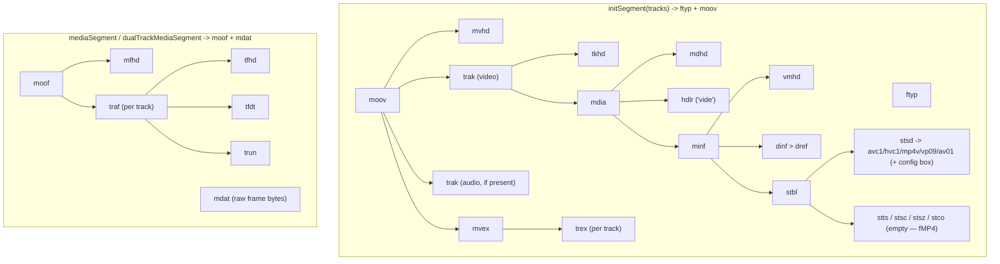
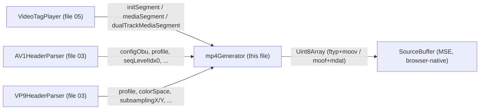

# 09. MP4 Container Generation (`vendor/mp4Generator.js`)

*Box-level reference for the vendored fragmented-MP4 (ISOBMFF) builder `src/player/vendor/mp4Generator.js` —
what box tree each exported function actually constructs, byte by byte, for every codec this player supports.*

**Version:** 1.1.0 · **Author:** Youngho Kim · **Milestone:** [docs/ROADMAP.md](../ROADMAP.md)'s M-1 (the
`vp09`/`av01` `stsd` entries described below are already implemented; the only remaining gap is
`RTSPOverWebSocket.ts`'s `codec` attribute allow-list, not this module)

**History**

| Date | Change |
| --- | --- |
| 2026-08-26 | Initial version |
| 2026-08-26 | Fix `dualTrackMediaSegment`'s `var` declaration (`:1344`) — a stray `;` instead of `,` after `mdatlen = 0` left `mdatLens`/`i` as bare assignments to undeclared bindings, throwing `ReferenceError: mdatLens is not defined` in strict-mode (ESM) builds on every dual-track (video+audio, `<video>`-tag mode) segment |
| 2026-09-03 | Updated the "MJPEG `stsd` entry references an undefined type" known-issue note: `MediaRouter.ts` no longer always forces MJPEG to `tagMode = 'canvas'` (see `03-mediaSession-core-video.md`), but this file's dead `mpv4`/`esds` MJPEG branch is still never reached — the new tier tags its muxed samples `codecType: 'H264'`, reusing the real `avc1`/`avcC` branch instead. No code in this file changed. |

---

## Scope and how this relates to file 05

[05-video-player-rendering.md](05-video-player-rendering.md)'s `VideoTagPlayer` section already covers the
**caller side** in depth: when `initSegment`/`mediaSegment`/`dualTrackMediaSegment` get called, how samples are
accumulated, and *why* composition-time-offsets exist (B-frame reordering). This document does not repeat any of
that — it covers only what happens **inside** `mp4Generator.js` once those three functions are called: the actual
ISOBMFF box tree each one emits, and the exact byte layout of every codec-specific box.

`mp4Generator.js` is vendored (a mux.js-derived module, ported verbatim like `ffmpeg.js`/`ffmpegAAC.js`/
`minizip-asm.js` elsewhere in this codebase — not rewritten), so this document is a reference for *reading* it
correctly, not a description of code this project owns and can freely restructure.

## Box tree overview

`box(type, ...payloads)` (`mp4Generator.js:200-229`) is the one primitive everything else is built from: an
8-byte header (4-byte big-endian total size, 4-byte FourCC) followed by the concatenated payload buffers. Every
function below either returns one `box(...)` call or a small number of `Uint8Array` literals fed into one.

`initSegment(tracks)` (`:1302-1320`) is `ftyp() + moov(tracks)` concatenated **without an outer box** — the two
top-level boxes are simply laid end to end, which is exactly what a fragmented-MP4 initialization segment is.
`mediaSegment(sequenceNumber, tracks, data)` (`:1322-1341`) and `dualTrackMediaSegment(sequenceNumber, tracks,
data)` (`:1343-1378`) are likewise `moof(...) + mdat(data)` with no outer box — a movie fragment.

## Initialization segment (`ftyp` + `moov`)

- **`ftyp()`** (`:308-310`) — brand box: major brand `isom`, minor version `1`, compatible brands `avc1`, `mp41`,
  `iso5`, `dash`. **Note:** the `avc1` compatible brand is emitted unconditionally, even for a VP9/AV1/MJPEG-only
  init segment — hardcoded, not derived from `track.codecType`. Harmless in practice (compatible-brands are
  advisory, and the actual sample-entry FourCC in `stsd` is what browsers key decode behavior off of) but worth
  knowing if you're diffing this player's output against a "clean" muxer's.
- **`mvhd(duration)`** (`:669-707`) — movie header. Takes a `duration` argument but **ignores it**: the emitted
  bytes hardcode `duration = 0xFFFFFFFF` (ISOBMFF's "unknown duration" sentinel) regardless of what's passed —
  correct for a live/fragmented stream (duration genuinely isn't known up front) but means the parameter is dead
  weight. `timescale` is hardcoded to `10000` ("ticks per second" — every duration/timestamp field elsewhere in
  this module that isn't audio-specific uses this same 10000 scale, see `mdhd` below).
- **`trak(track)`** (`:1087-1092`) → `box('trak', tkhd(track), mdia(track))`, one per track (video, and audio if
  present).
  - **`tkhd(track)`** (`:982-1022`) — track header. Same `duration` sentinel pattern as `mvhd`: hardcodes
    `0xFFFFFFFF` regardless of `track.duration`. `track_ID = track.id`; `width`/`height` are written as 16.16
    fixed-point with the fractional half always zeroed (integer pixel dimensions only).
  - **`mdia(track)`** (`:476-478`) → `box('mdia', mdhd(track), hdlr(track.type), minf(track))`.
    - **`mdhd(track)`** (`:449-475`) — media header. Unlike `mvhd`/`tkhd`, this one's `duration` field **is** the
      real `track.duration` value. `timescale` defaults to `10000` but is overwritten with `track.samplerate`
      when the track has one (audio tracks) — i.e. an audio track's `mdhd` timescale is its actual sample rate,
      while video/other tracks keep the fixed `10000`. `language` is hardcoded `0x55c4` ("und", undetermined).
    - **`hdlr(type)`** (`:429-445`) — handler-reference box; `'video'` → `handler_type: 'vide'`, `'audio'` →
      `handler_type: 'soun'`, both fixed literal byte blocks (`VIDEO_HDLR`/`AUDIO_HDLR`, `:132-157`).
    - **`minf(track)`** (`:489-494`) → `box('minf', <vmhd|smhd>, dinf(), stbl(track))` — `vmhd` (video media
      header) for video tracks, `smhd` (sound media header) for everything else, both fixed literal blocks.
      - **`dinf()`** (`:231-233`) → `box('dinf', box('dref', DREF))` — one hardcoded `'url '` self-reference
        entry (`DREF`, `:162-170`); the media data is always in the same file, never externally referenced.
      - **`stbl(track)`** (`:745-752`) → `box('stbl', stsd(track), stts, stsc, stsz, stco)`. **The `stts`/`stsc`/
        `stco` boxes all reuse the exact same `STCO` constant** (`STSC = STCO`; `STTS = STCO`, `:182,189`) — a
        4-byte all-zero `entry_count` FullBox. This is intentional, not a copy-paste bug: in a *fragmented* MP4,
        per-sample timing/chunk tables live in each fragment's `traf`/`trun` (below), so the init segment's
        `stbl` sample tables are legitimately empty — only `stsd` (the sample *description*, i.e. codec config)
        carries real content here.

### `stsd` — codec-specific sample entries

`stsd(track)` (`:757-764`) writes a 1-entry sample description box, then delegates to `videoSample(track)` for
video tracks, `opusSample(track)` for `codecType === 'OPUS'`, or `audioSample(track)` otherwise.

| codecType | Sample entry | Config box | Key fields |
| --- | --- | --- | --- |
| H264 | `avc1` | `avcC` | `profileIdc`/`profileCompatibility`/`levelIdc`, `lengthSizeMinusOne` hardcoded `0xff` → 4-byte NAL length prefixes, then length-prefixed SPS array + length-prefixed PPS array |
| H265 | `hvc1` | `hvcC` | `track.profileTierLevel` spread verbatim, then length-prefixed VPS/SPS/PPS as three separate NALU arrays (`0xA0`/`0xA1`/`0xA2` array-type markers) |
| MJPEG | *(see note below)* | `esds` | ES_Descriptor with `object type 0x6C`, `streamType 0x11` — MPEG-4 Visual/M-JPEG per ISO/IEC 14496-3 |
| AAC / G711 / G726 (transcoded) | `mp4a` | `esds` | `AudioSpecificConfig` (ISO/IEC 14496-3) packed from `audioobjecttype`/`samplingfrequencyindex`/`channelcount` into 2 bytes |
| OPUS | `Opus` | `dOps` | `OutputChannelCount`, `InputSampleRate` hardcoded `48000` (RFC 7587 §4.1's fixed Opus-over-RTP clock) |
| VP9 | `vp09` | `vpcC` | `profile`, CICP colour primaries/transfer/matrix via a `VP9_CICP_COLOR_CONFIG` lookup table |
| AV1 | `av01` | `av1C` | verbatim Sequence Header OBU bytes (`configObu`), not a re-serialization |
| VP8 | — | — | **no `stsd` branch at all** — see "Known issues" below |

- **`visualSampleEntry(width, height)`** (`:315-345`) is a shared 78-byte `VisualSampleEntry` (ISO/IEC 14496-12
  §12.1.3) header used by the VP9 and AV1 branches. H264/H265/MJPEG instead each inline their own byte-identical
  78-byte literal rather than calling this helper — purely historical (the helper was extracted only when VP9/AV1
  support was added; the older branches were never refactored to use it). All four/five shapes are byte-for-byte
  identical aside from width/height.
- **`avcC`** (`:826-836`, inside `videoSample`) — `configurationVersion=1`, then `profileIdc`/
  `profileCompatibility`/`levelIdc`/`lengthSizeMinusOne`, then `numOfSequenceParameterSets` + each SPS
  2-byte-length-prefixed, then `numOfPictureParameterSets` + each PPS likewise. `track.sps`/`track.pps` must be
  *absent* (not `[undefined]`) for non-H264 codecs — see `mp4Generator.d.ts`'s field comment and file 05's
  `setVideoInfo()` entry for the real bug this constraint traces back to.
- **`hvcC`** (`:866-880`) — a fixed 9-byte tail (profile-compatibility/constraint flags/level, hardcoded) after
  `profileTierLevel`, then a `numOfArrays` count and three fixed-type arrays (VPS/SPS/PPS) each prefixed with
  `[array_completeness|NAL_unit_type, 0x00, count]`.
- **`vpcC`** (`:382-396`) — VP Codec ISO Media File Format Binding `VPCodecConfigurationRecord`. `level` is
  always `0` ("unspecified" — VP9's bitstream has no per-keyframe level field to source it from).
  `chromaSubsampling` is derived from `subsamplingX`/`subsamplingY` via `vp9ChromaSubsampling()` (`:372-380`);
  colour primaries/transfer/matrix come from `VP9_CICP_COLOR_CONFIG[track.colorSpace]` (`:361-370`), a table that
  mirrors ffmpeg's own VP9-`color_space`-to-CICP convention (a de facto ecosystem mapping, not something this
  player's decode correctness depends on — colour metadata only).
- **`av1C`** (`:409-427`) — AV1 Codec ISO Media File Format Binding `AV1CodecConfigurationRecord`
  ([aomediacodec.github.io/av1-isobmff §2.3.3](https://aomediacodec.github.io/av1-isobmff/)). Not a `FullBox` —
  a `marker(1)=1/version(7)=1` byte pair plays that role instead of box-level version/flags. `configOBUs` is the
  **verbatim** Sequence Header OBU byte range (`track.configObu`, sourced from
  `AV1HeaderParser.parseAV1SequenceHeader`'s `obuStart`/`obuEnd`), not a from-scratch re-serialization.
- **`esds`** (`:235-283`) — two entirely separate literal byte layouts depending on `track.codecType === "MJPEG"`
  vs. everything else (AAC/transcoded-G711/G726). The non-MJPEG branch's `DecoderSpecificInfo` is where the real
  `AudioSpecificConfig` bytes get packed (`:278-281`, see table above).
- **`dOps`** (`:294-306`) — `OpusSpecificBox` ("Encapsulation of Opus in ISO Base Media File Format", v0).
  `ChannelMappingFamily` is hardcoded `0` (simple mono/stereo) and `PreSkip` is hardcoded `0` (RTP-transported
  Opus per RFC 7587 has no Ogg-header-derived preskip value to source one from).
- **`opusSample`** vs. **`audioSample`** (`:918-979`) share the same 28-byte `AudioSampleEntry` shape, but
  `opusSample`'s `samplerate` field is **hardcoded `48000<<16`** regardless of `track.samplerate`, while
  `audioSample`'s is written from `track.samplerate` directly — confirmed live as necessary: Chromium's MP4
  demuxer cross-checks `Opus`'s `AudioSampleEntry.samplerate` against `dOps`'s `InputSampleRate` and rejects the
  whole `appendBuffer` on a mismatch if it's left unset.

## Media segment (`moof` + `mdat`)

- **`mfhd(sequenceNumber)`** (`:479-488`) — one field, `sequence_number`, which MSE requires to be monotonically
  increasing across appended fragments.
- **`traf(track, moreOffset)`** (`:1028-1080`) → `box('traf', tfhd(track), tfdt(track), trun(track, dataOffset))`.
  - **`tfhd`** (`:1032-1048`) — flags `0x020000` (`default-base-is-moof`), `track_ID` only. No
    `default_sample_duration`/`default_sample_size`/`default_sample_flags` fields are written (the source has
    them scaffolded out in comments) — every sample's duration/size/flags come from `trun` directly, not a `tfhd`
    or `trex` default.
  - **`tfdt`** (`:1050-1058`) — version 0 only, `baseMediaDecodeTime` as an unsigned 32-bit value. There is no
    64-bit (`version 1`) fallback, so `baseMediaDecodeTime` wraps at 2³²-1 "ticks" — at the `10000`/sec video
    timescale that's ~4.97 days of continuous decode time before wraparound; worth knowing for very long-running
    unattended sessions, though not something confirmed to have caused a real failure.
  - **`dataOffset`** — computed in `traf()` as a fixed `72 + moreOffset` bytes (the sum of `tfhd`+`tfdt`+`traf`
    header+`mfhd`+`moof` header+`mdat` header sizes), i.e. the byte distance from the start of `moof` to the
    first sample byte in the following `mdat`. The source code comment above `moof()` (`:504-507`, `// all
    existing offsets would need fixing, so hardcoded for now :(`) flags this as a known rough edge, only ever
    exercised through the 1-track and 2-track cases this player actually uses.
- **`moof(sequenceNumber, tracks, dataLens)`** (`:495-514`) builds one `traf` per track with `moreOffset = 0`
  first, then — **only when `tracks.length === 2`** (the dual-track case) — rebuilds both: video's `traf` gets
  `moreOffset = <audio traf's byte length>` and audio's gets `moreOffset = dataLens[0] + <video traf's byte
  length>`. This is what lets `dualTrackMediaSegment`'s single `mdat` hold both tracks' frame data back-to-back
  (video first, then audio — matching `dualTrackMediaSegment`'s own concatenation order, `:1343-1358`) while each
  track's `trun.data_offset` still points at its own slice.
- **`mvex`/`trex`** (`:531-540`, `:1094-1119`) — one `trex` per track, each with `default_sample_duration`
  computed as `1000 / tracks[0].fps`. **Note:** this uses `tracks[0].fps` for *every* track's `trex`, not each
  track's own `fps` — for a 2-track init segment the audio `trex`'s default duration is derived from the video
  track's frame rate. Harmless in practice since every real sample's duration comes from `trun` (see `tfhd`
  above, which carries no defaults for `trun` to fall back to) rather than `trex`, but worth knowing if you're
  reading `trex` bytes directly.

### `trun` — three variants

`trun(track, offset)` (`:1293-1299`) dispatches on `track.type`. `audioTrun` (`:1260-1291`) always uses the
plain, dynamically-flagged `trunHeader()` (`:1129-1163`, flags probed from `samples[0]`'s own shape); each sample
writes either `[duration, size]` (8 bytes) or just `[size]` (4 bytes) depending on whether that sample carries an
explicit `duration`.

`videoTrun` (`:1201-1258`) picks one of three header builders based on what the first sample looks like — this
is the box-level mechanism behind file 05's B-frame/CTS write-up, described here only as *what bytes get
written*, not *why*:

| Sample shape | Header builder | Per-sample fields | When |
| --- | --- | --- | --- |
| No `frameDuration` | `trunHeader` (`:1129-1163`) | `size` only | Playback-mode samples (per `Mp4Sample.compositionTimeOffset`'s own doc comment, CTS is only honored on the `frameDuration`-based path) |
| `frameDuration` + `compositionTimeOffset` on sample 0 | `trunHeader1Cts` (`:1185-1199`) | `[frameDuration, size, cts]` | Live-mode samples from a B-frame source — `cts` is coerced to a signed 32-bit int (`\| 0`) since presentation-time-minus-decode-time can be negative for the first few samples of a GOP |
| `frameDuration`, no CTS | `trunHeader1` (`:1165-1179`) | `[frameDuration, size]` | Live-mode samples, no B-frames (the common camera case) |

`trunHeader1Cts` is `version 1` (required for a *signed* `sample_composition_time_offset`, ISO/IEC 14496-12
§8.8.8) with flags `0x0B05` (data-offset | first-sample-flags | duration-present | size-present |
composition-time-offset-present); `trunHeader`/`trunHeader1` are `version 0`.

## Known issues (documented, not fixed — preserved per `CLAUDE.md`)

- **MJPEG `stsd` entry references an undefined type.** `videoSample`'s MJPEG branch (`:881-910`) calls
  `box(types.mpv4, ...)`, but the `types` lookup table (`:22-76`) only defines `mp4v` (correctly commented `//
  MJPEG`) — there is no `mpv4` key, so `types.mpv4` is `undefined` and `box()` would crash writing an undefined
  FourCC into the box header. **Updated 2026-09-03, still confirmed unreachable, but for a different reason
  than before:** `MediaRouter.selectVideoPlayer()` no longer unconditionally forces `tagMode = 'canvas'` for
  `codecType === 'MJPEG'` — it can now reach `VideoTagPlayer` via the new `WebCodecsVideoEncoder`-based
  real-MSE tier (`05-video-player-rendering.md`). That tier deliberately does **not** exercise this branch,
  though: encoder-sourced samples are tagged `codecType: 'H264'` throughout (`VideoTagPlayer.ts`'s
  `onMjpegEncodedChunk()`), not `'MJPEG'`, both because `mp4Generator.js` needs the real `avc1`/`avcC` H264
  `stsd` entry (this file's H264 branch, not the `mpv4`/`esds` one) to describe the actual re-encoded
  bitstream, and — incidentally — because doing so keeps this particular dead branch dead. Left as-is rather
  than "fixed", same reasoning as before: still genuinely unreachable, just worth re-confirming *why* each
  time something changes upstream of it, so this note doesn't quietly go stale. See this repo's `MEMORY.md`
  for the full narrative.
- **VP8 has no `stsd` branch at all.** `videoSample`'s `if`/`else if` chain (`:797-915`) covers H264/H265/
  MJPEG/VP9/AV1 only; a VP8 track falls through and the function implicitly returns `undefined`, which would
  crash the same way. Matches file 05's existing note that VP8 has no real-MSE tier at all (`vp08`/`vp09`
  ambiguity aside, no browser ships a VP8-in-fMP4 `stsd` box type in practice) — VP8 always decodes via
  `WebCodecsVideoDecoder` + canvas, never `VideoTagPlayer`, so this path is equally unreachable today.
- **`ftyp`'s `avc1` compatible brand is unconditional**, independent of `track.codecType` — see "Initialization
  segment" above.
- **`mvhd`/`tkhd` ignore their `duration` argument**, always emitting the ISOBMFF "unknown duration" sentinel
  (`0xFFFFFFFF`) — see above; correct for this player's live/fragmented use case, just worth knowing the
  parameter is otherwise dead.
- **`trex`'s `default_sample_duration` is computed from `tracks[0].fps` for every track**, not each track's own
  — see "Media segment" above.

## RFC / Standard references

- **ISO/IEC 14496-12 (ISOBMFF)** — the base box format (`box()`), `ftyp`/`moov`/`mvhd`/`trak`/`tkhd`/`mdia`/
  `mdhd`/`hdlr`/`minf`/`vmhd`/`smhd`/`dinf`/`dref`/`stbl`/`stsd`/`stts`/`stsc`/`stsz`/`stco`, and the movie-
  fragment boxes `mvex`/`trex`/`moof`/`mfhd`/`traf`/`tfhd`/`tfdt`/`trun`/`mdat` (§8.8 for the fragment boxes
  specifically; §8.8.8 for `trun`'s composition-time-offset field).
- **ISO/IEC 14496-14 (MP4 file format)** — `avc1`/`avcC` sample entry (via ISO/IEC 14496-15 for AVC specifically)
  and the overall MP4 brand conventions `ftyp` declares.
- **ISO/IEC 14496-3 (MPEG-4 Audio)** — `AudioSpecificConfig` packing inside `esds`'s `DecoderSpecificInfo`.
- **ISO/IEC 14496-15 (AVC/HEVC file format)** — `avcC`/`hvcC` `*DecoderConfigurationRecord` layouts.
- **AOM "AV1 Codec ISO Media File Format Binding"** — `av01`/`av1C`'s `AV1CodecConfigurationRecord`.
- **"VP Codec ISO Media File Format Binding"** (webmproject/vp9-dash) — `vp09`/`vpcC`'s
  `VPCodecConfigurationRecord`, including the `chromaSubsampling` enum this module's `vp9ChromaSubsampling()`
  reproduces.
- **"Encapsulation of Opus in ISO Base Media File Format" v0** — `Opus`/`dOps`'s `OpusSpecificBox`.
- **RFC 7587 (Opus RTP payload)** — the fixed `48000` Hz clock `dOps`/`opusSample` hardcode.

## Testing

`src/player/vendor/mp4Generator.test.ts` (vitest) covers two areas of this module directly:

- `describe('mp4Generator VP9/AV1 sample entries', ...)` — byte-level assertions on `vpcC`/`av1C` field packing,
  including that `av1C`'s `configOBUs` is written verbatim (not re-encoded).
- `describe('mp4Generator video trun composition-time-offset (CTS)', ...)` — confirms the plain `frameDuration`
  trun layout is unchanged when no sample carries a `compositionTimeOffset`, and that the version-1 CTS trun
  writes the correct per-sample offset while keeping `mdat` byte alignment intact.

There is no automated coverage of `initSegment`'s `moov`/`trak`/`stbl` tree or the H264/H265/MJPEG `stsd`
branches specifically — those are exercised only indirectly, end to end, via `VideoTagPlayer`'s own tests and
the manual video-tag smoke test in [test-script.md](../test-script.md).

## Relations & data flow

