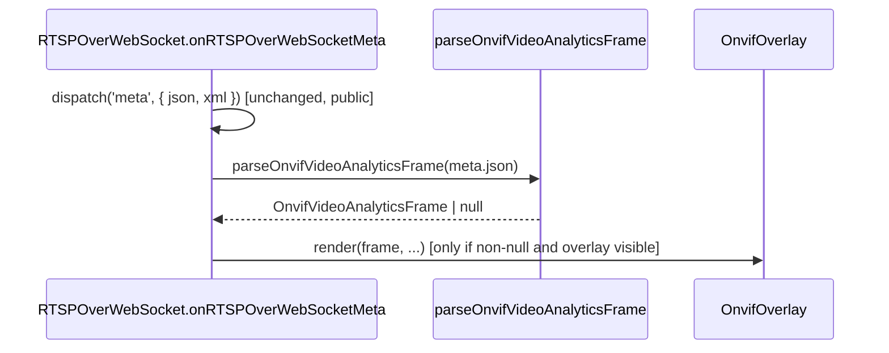
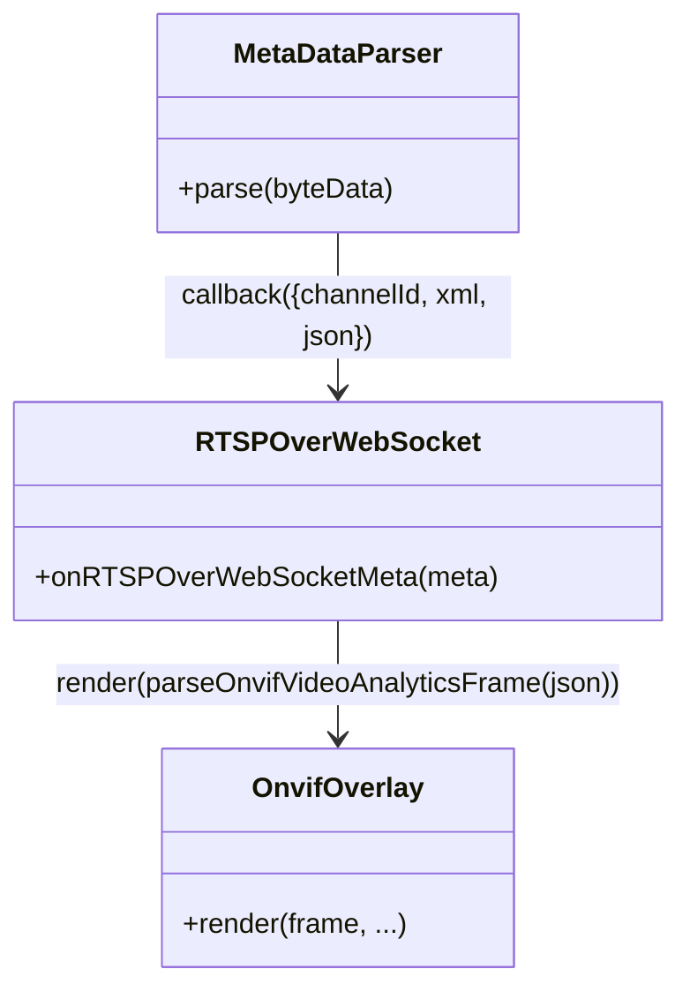
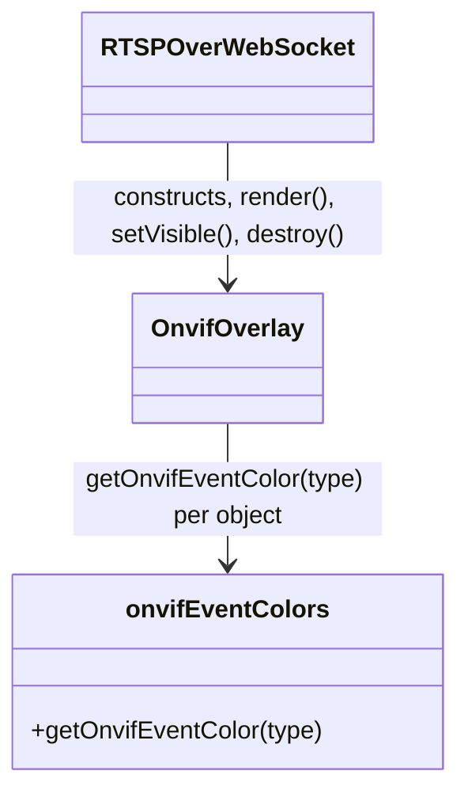

# ONVIF Metadata Overlay (`src/player/util/onvifMetadata.ts`, `src/player/components/ui/`)

*Per-class reference for the ONVIF `VideoAnalytics` bounding-box/label overlay and the reusable
toggle-switch UI component it's shown/hidden with.*

**Version:** 1.1.13 · **Author:** Youngho Kim · **Milestone:** M-4

**History**

| Date | Change |
| --- | --- |
| 2026-09-08 | Bug fix: with native `<video controls>` on, the browser's own overflow "more options" popup stopped appearing once the "ONVIF Event" toggle was on. Root cause: `OnvifOverlay`'s mounted `<div>` is `position: absolute`, a sibling appended after `this.video` — the same stacking shape `RTSPOverWebSocket`'s pre-existing `videoContainerElement` already had a fix for (a positioned element paints above a plain-flow sibling regardless of DOM order, so it visually sits on top of the native controls bar whenever it isn't `hidden`; `pointer-events: none` only stops it intercepting clicks, not covering the popup visually). `OnvifOverlay` gained a second, independent `setSuppressed(suppressed)` on top of the existing user-facing `setVisible(visible)` — shown only when both allow it — and `RTSPOverWebSocket.applyVideoContainerVisibility()` now also calls `this.onvifOverlay?.setSuppressed(this._controls)` alongside its existing `videoContainerElement` handling, at all three of its call sites. See `setVisible(visible)`'s Method Analysis entry below and `MEMORY.md`'s matching entry. |
| 2026-09-07 | Perf fix: reported live as "video playback stutters while ONVIF bounding boxes are being drawn." Root cause: `OnvifOverlay.render()`/`RTSPOverWebSocket.renderOnvifOverlay()`/`MetaDataParser.parse()` all ran synchronously in the same main-thread call stack as video/audio RTP demuxing, once per metadata frame. Three overload sources fixed: (1) `OnvifOverlay` now pools box/label `<div>` pairs (`resizePool()`) instead of `removeChild`+`createElement` on every `render()`; (2) `RTSPOverWebSocket` now caches container size via a `ResizeObserver` (`onvifContainerSize`) instead of reading `clientWidth`/`clientHeight` — and forcing a synchronous reflow — on every metadata frame; (3) `MetaDataParser.ParsedMetaData` gained `jsonValue` (the pre-stringify parsed object) so `RTSPOverWebSocket` calls the new `parseOnvifVideoAnalyticsFrameFromValue()` directly instead of `JSON.parse()`-ing `.json` straight back out of the string it was just `JSON.stringify()`'d into. See `MEMORY.md`'s matching entry for the full benchmark/investigation and the `OnvifOverlay`/`parseOnvifVideoAnalyticsFrame` Method Analysis sections below for the per-symbol detail. |
| 2026-09-04 | `RTSPOverWebSocket.stop()` now hides the ONVIF overlay (`this.onvifOverlay?.setVisible(false)`) — requested directly by the user, so a stopped session doesn't leave a stale bounding box visible. See `setVisible(visible)`'s Method Analysis entry above. |
| 2026-09-04 | Bug fix: `parseOnvifVideoAnalyticsFrame` no longer applies `tt:Transformation` to `BoundingBox`/`CenterOfGravity` — a real device capture proved that inverse-divide corrupted already-pixel-space coordinates (see `parseOnvifVideoAnalyticsFrame`'s Method Analysis below and `MEMORY.md`) |
| 2026-09-04 | `OnvifOverlay` rendering surface changed from SVG (`<rect>`/`<text>`) to plain positioned `<div>`s, per explicit user request — see its Structure/Method Analysis/RFC References sections below |
| 2026-09-04 | Bug fix: `RTSPOverWebSocket` now caches the last-parsed frame (`onvifLastFrame`) and calls a shared `renderOnvifOverlay()` from three trigger points instead of only from `onRTSPOverWebSocketMeta` — see `OnvifOverlay`'s Call Stack section below |
| 2026-09-04 | Initial version — implements SRS §4.10 (REQ-PLY-110 through REQ-PLY-116), DESIGN §2.7 |

---

This document covers three new, related pieces added on top of the existing `MetaDataParser`
(`03-mediaSession-core-video.md`) pipeline: a pure ONVIF XML-shape parser, an SVG overlay renderer,
and a standalone toggle-switch component the overlay is shown/hidden with. None of these replace or
modify `MetaDataParser`'s own behavior or the public `meta` event — they consume its already-parsed
JSON output as one more listener alongside the existing `dispatch('meta', ...)` call.

## Contents

- [`parseOnvifVideoAnalyticsFrame` (`util/onvifMetadata.ts`)](#parseonvifvideoanalyticsframe-utilonvifmetadatats)
- [`onvifEventColors` (`components/ui/onvifOverlay/onvifEventColors.ts`)](#onvifeventcolors-componentsuionvifoverlayonvifeventcolorsts)
- [`OnvifOverlay` (`components/ui/onvifOverlay/OnvifOverlay.ts`)](#onvifoverlay-componentsuionvifoverlayonvifoverlayts)
- [`createSwitch` (`components/ui/switch/Switch.ts`)](#createswitch-componentsuiswitchswitchts)

## `parseOnvifVideoAnalyticsFrame` (`util/onvifMetadata.ts`)

### Structure

A pure function module — no class, no state. Takes the *already-parsed* JSON string
`MetaDataParser`/`MetaDataParser.test.ts` already produce (via `fast-xml-parser`, see
`03-mediaSession-core-video.md`) and extracts a small typed model, matching only the shapes real
ONVIF `tt:MetadataStream`/`tt:VideoAnalytics` metadata actually uses (verified against the real
`onvif.xsd` `ClassDescriptor`/`ShapeDescriptor`/`Frame` types — see `MEMORY.md`'s
`MetaDataParser.parse()` entry for that verification).

```ts
export interface OnvifBoundingBox { left: number; top: number; right: number; bottom: number; }
export interface OnvifPoint { x: number; y: number; }
export interface OnvifClassCandidate { type: string; likelihood: number; }
export interface OnvifAnalyticsObject {
  objectId: string;
  boundingBox?: OnvifBoundingBox;   // read as-is; already intrinsic pixel space on real hardware
  centerOfGravity?: OnvifPoint;     // same
  classCandidates: OnvifClassCandidate[];
}
export interface OnvifVideoAnalyticsFrame {
  utcTime: string;
  videoSourceToken?: string;
  objects: OnvifAnalyticsObject[];
}

export function parseOnvifVideoAnalyticsFrame(json: string): OnvifVideoAnalyticsFrame | null;
export function parseOnvifVideoAnalyticsFrameFromValue(parsed: unknown): OnvifVideoAnalyticsFrame | null;
```

### Method Analysis

- **`parseOnvifVideoAnalyticsFrameFromValue(parsed)`** — the real implementation: walks
  `parsed['tt:MetadataStream']['tt:VideoAnalytics']['tt:Frame']` off an already-parsed value (no
  `JSON.parse` of its own). Extracted out of `parseOnvifVideoAnalyticsFrame` (below) so a caller that
  already has the parsed object — `RTSPOverWebSocket` via `ParsedMetaData.jsonValue`, see
  `MetaDataParser`'s own doc comment and `MEMORY.md`'s "ONVIF overlay drawing stole main-thread time"
  entry — doesn't have to `JSON.parse()` a string that was *just* `JSON.stringify()`'d from this exact
  same object, on every single metadata frame. Same `null`-not-throw contract as
  `parseOnvifVideoAnalyticsFrame` for anything that isn't a non-`null` object or isn't this exact shape.
- **`parseOnvifVideoAnalyticsFrame(json)`** — thin wrapper: `JSON.parse(json)` (catching and returning
  `null` on malformed JSON), then delegates to `parseOnvifVideoAnalyticsFrameFromValue` for the actual
  `['tt:MetadataStream']['tt:VideoAnalytics']['tt:Frame']` walk (the shape `fast-xml-parser`'s
  `removeNSPrefix: false` configuration in `MetaDataParser.ts` produces — namespace prefixes are
  kept on every key). Kept for callers that only have the JSON string (this file's own tests; any
  future caller without direct access to the pre-stringify object). Returns `null` (does not throw)
  for anything that isn't this exact shape — malformed JSON, a metadata frame belonging to a
  different ONVIF topic, or a `Frame` with no
  `Object` at all (an empty-but-valid analytics tick) all resolve to `null`, which callers treat as
  "nothing to render," not an error.
- **Transformation is deliberately NOT applied.** `Frame['tt:Transformation']`'s `Translate`/`Scale`
  is parsed by nothing in this file — `BoundingBox`/`CenterOfGravity` `@attributes` are read
  straight through as-is. An earlier version of this function *did* inverse-apply it
  (`px = (rx - translateX) / scaleX`), on the assumption that non-identity `Translate`/`Scale`
  meant raw coordinates needed correcting into pixel space. A real Wisenet/Samsung camera capture
  (2048x1536, see `MEMORY.md`) disproved that: its `BoundingBox`/`CenterOfGravity` values were
  already in that camera's own intrinsic pixel space (confirmed two ways — their magnitudes matched
  the live resolution, and `CenterOfGravity` was exactly the `BoundingBox`'s own midpoint, which
  only holds if both are already the same untransformed coordinates), while its accompanying
  `Transformation` (`Translate x="-1.0" y="1.0"`, `Scale x="0.000977" y="-0.001302"`) turned out to
  be a *pixel-to-normalized* ONVIF-compliance recipe instead (`scaleX`/`scaleY` come out to
  `~= 2/width`/`~= -2/height` for that camera's real resolution — the standard pixel → `[-1, 1]`
  conversion). Inverse-applying it blew these exact real numbers up into coordinates far outside the
  video frame (with a resulting negative height on the rendered `<rect>`, which browsers silently
  refuse to draw at all) — the actual root cause of a real "toggled the overlay on, no bounding box
  ever appears" report on production hardware. See `onvifMetadata.ts`'s `parseBoundingBox` doc
  comment for the full writeup, and `onvifMetadata.test.ts`'s real-device-capture regression test.
- **`tt:Object` extraction.** `Frame['tt:Object']` may be a single object or an array (an XML
  element that occurs once vs. more than once parses to a bare object vs. an array with
  `fast-xml-parser`'s default settings, since `isArray` wasn't configured in `MetaDataParser.ts` —
  this function normalizes both into an array). Each object's `@attributes.ObjectId`,
  `tt:Appearance/tt:Shape/tt:BoundingBox`/`tt:CenterOfGravity` `@attributes` (if present), and
  `tt:Appearance/tt:Class/tt:ClassCandidate` (single-or-array, same normalization; each candidate's
  `tt:Type` text + `tt:Likelihood` number) are read into one `OnvifAnalyticsObject`. A vendor-only
  `tt:Class/tt:Type`-with-`Likelihood`-attribute shape (confirmed non-standard against the real
  `ClassDescriptor` schema — see `MEMORY.md`) is *not* specially handled here; only the standard
  `ClassCandidate` list is read. `boundingBox`/`centerOfGravity`/`classCandidates` are all optional/
  can be empty — `OnvifOverlay` (below) renders whatever subset is actually present.

### Call Stack



### RFC / Standard References

ONVIF Streaming Specification / `onvif.xsd` (`tt:` namespace) — not an IETF/ITU RFC. See
`docs/player/README.md`'s consolidated standards map.

### Relations & Data Flow



---

## `onvifEventColors` (`components/ui/onvifOverlay/onvifEventColors.ts`)

### Structure

A small, standalone module owning the class/event-type -> color palette (REQ-PLY-114), kept
separate from `OnvifOverlay` so the palette can be tested/extended independently of rendering.

```ts
export function getOnvifEventColor(type: string): string; // CSS color, case-insensitive lookup
export const DEFAULT_ONVIF_EVENT_COLOR: string;             // fallback for an unrecognized type
```

### Method Analysis

- **`getOnvifEventColor(type)`** — case-insensitive lookup (ONVIF `ClassType` values and common
  vendor extensions like `Fire` are compared lowercased) against a built-in `Record<string,
  string>`; returns `DEFAULT_ONVIF_EVENT_COLOR` for anything not in the table. Pure, no state, no
  DOM access — trivially unit-testable.

### RFC / Standard References

None — a built-in, this-repository-defined palette, not derived from any standard's own color
conventions.

### Relations & Data Flow

Consumed only by `OnvifOverlay.render()` (below), once per object per render, to color that
object's `<rect>`/label background.

---

## `OnvifOverlay` (`components/ui/onvifOverlay/OnvifOverlay.ts`)

### Structure

```ts
export interface OnvifOverlayRenderInput {
  frame: OnvifVideoAnalyticsFrame | null;
  videoIntrinsicSize: { width: number; height: number };
  containerSize: { width: number; height: number };
}
export class OnvifOverlay {
  constructor(hostElement: HTMLElement); // mounts its own <div class="onvif-overlay">, absolutely positioned, as hostElement's child
  render(input: OnvifOverlayRenderInput): void;
  setVisible(visible: boolean): void;
  setSuppressed(suppressed: boolean): void;
  destroy(): void;
}
```

Owns one `<div class="onvif-overlay">` element (`position: absolute; inset: 0; pointer-events: none;`
— the overlay never intercepts mouse events meant for the video/context menu underneath it),
mounted as a sibling of the video/canvas rendering element inside `RTSPOverWebSocket`'s shadow DOM.
`pointer-events: none` is load-bearing: without it, the overlay (which fully covers the video) would
swallow clicks meant to open the context menu. Rendering uses plain positioned `<div>`s, not SVG —
switched from an earlier SVG (`<rect>`/`<text>`) implementation per explicit user request; see
DESIGN §2.7's "Rendering surface" for the rationale. Also owns two parallel node pools,
`boxPool`/`labelPool` (`HTMLDivElement[]`, index-aligned with the most recently rendered
`frame.objects`) — see `render()`'s Method Analysis entry below for why.

### Method Analysis

- **`render({ frame, videoIntrinsicSize, containerSize })`** — if `frame` is `null`, `frame.objects`
  is empty, or `videoIntrinsicSize` isn't yet known (`width`/`height` `<= 0`), calls
  `resizePool(0)` (shrinks the pool to nothing, `remove()`-ing every pooled node from the DOM) and
  returns — nothing to draw. Otherwise calls `resizePool(frame.objects.length)`, computes the
  rendered/letterboxed sub-rect from `videoIntrinsicSize` + `containerSize` using the same
  containment math `object-fit: contain` itself applies (DESIGN §2.7's coordinate mapping, step 2),
  then for each object at index `i` (`renderObject(object, rendered, i)`) rewrites `boxPool[i]`/
  `labelPool[i]`'s dynamic style properties (`left`/`top`/`width`/`height`/`border`/`display` on the
  box, `left`/`top`/`background`/`display`/`textContent` on the label) from scratch:
  - if `boundingBox` is present, maps its four corners into that sub-rect and shows the box
    (`border: 2px solid {getOnvifEventColor(...)}`, positioned/sized via `left`/`top`/`width`/
    `height`; `box-sizing: border-box`/`position`/`pointer-events` are static, set once when the
    node is created in `resizePool()`, not re-applied per render);
  - shows a label (background-colored the same as the box's border, `transform: translateY(-100%)`
    — also static, set once — to sit just above its anchor point regardless of its own auto-sized
    width/height) showing `objectId`, the highest-`likelihood` `classCandidates` entry's
    `type`+`likelihood` (or just `objectId` alone if there are no candidates), anchored at the
    bounding box's top-left when one exists, or at the mapped `centerOfGravity` (box hidden via
    `display: none` in this case) otherwise; if neither is present, both box and label are hidden
    for that index instead.

  **Real problem, found live** (see `MEMORY.md`'s "ONVIF overlay drawing stole main-thread time"
  entry): the original implementation did a full `container.removeChild()` sweep plus fresh
  `createElement()`/`appendChild()` for every object on *every* `render()` call, i.e. on every
  metadata frame — real ONVIF analytics streams can send one of those per video frame while an
  event is active, so this was continuous DOM churn directly competing with video decode/paint on
  the same main thread. Pooling (this version) still fully recomputes every drawn value on every
  call — DESIGN §2.7's "each Frame is a full refresh" lifecycle (no cross-frame object tracking/
  interpolation/staleness timeout) is unchanged and still applies — only the underlying DOM node
  *objects* are recycled across consecutive `render()` calls with the same object count, turning
  that case into plain style-property writes on already-attached elements instead of DOM
  creation/removal. `resizePool()` still fully clears the pool (matching the pre-pooling
  create/destroy behavior, and what `OnvifOverlay.test.ts` already asserted) whenever there's
  nothing to draw at all — only the *steady-object-count* case (a tracked object across consecutive
  frames, the common case) benefits from reuse; growing/shrinking the pool by the exact delta when
  the count changes is still cheaper than the old full-clear-and-rebuild, just not free.
- **`setVisible(visible)`** — sets the user-facing `visible` flag (the "ONVIF Event" toggle's own
  ON/OFF state) and recomputes the mounted `<div class="onvif-overlay">`'s `hidden` property via
  `applyHidden()`; does *not* clear already-rendered content, so toggling back on immediately shows
  the last `render()`'s output without waiting for a new metadata frame. `RTSPOverWebSocket.stop()`
  calls `this.onvifOverlay?.setVisible(false)` at the end of every stop, requested directly by the
  user — without it, a stopped session's last-drawn bounding box(es) stayed visible over the (now
  frozen) video frame, and would reappear immediately if the "ONVIF Event" toggle were flipped
  again before a new session's first metadata frame arrived, since `onvifLastFrame` itself isn't
  cleared on stop.
- **`setSuppressed(suppressed)`** — sets a second, independent `suppressedByControls` flag and
  recomputes `hidden` the same way (`hidden = !visible || suppressedByControls`). Real bug, found
  live: this container is `position: absolute`, appended as a sibling after `this.video` — the same
  stacking shape `RTSPOverWebSocket`'s `videoContainerElement` already had a dedicated fix for (see
  that class's `applyVideoContainerVisibility()`) — so whenever it isn't `hidden` it paints above
  the video's native `controls` bar regardless of DOM order, `z-index`, or its own
  `pointer-events: none` (which only stops it *intercepting* clicks, not *covering* the bar
  visually). Once the "ONVIF Event" toggle was on, this visually swallowed the native controls
  bar's own overflow "more options" popup. `RTSPOverWebSocket.applyVideoContainerVisibility()` now
  calls `this.onvifOverlay?.setSuppressed(this._controls)` alongside its existing
  `videoContainerElement` handling, at all three of that method's own call sites (the `controls`
  attribute changing, `updateRendering()`, and the context menu's Controls toggle) — this is
  intentionally kept separate from `setVisible()`/the `visible` flag so the user's own "ONVIF
  Event" preference is untouched and the overlay reappears on its own the moment controls are
  turned back off, without the user having to re-toggle it.
- **`destroy()`** — removes the mounted `<div class="onvif-overlay">` from the DOM. Called from
  `RTSPOverWebSocket`'s teardown path alongside its other per-instance cleanup.

### Call Stack

See `parseOnvifVideoAnalyticsFrame`'s Call Stack diagram above — `render()` is the last step in
that same chain, called from `RTSPOverWebSocket`'s private `renderOnvifOverlay()` helper, which in
turn is called from three separate trigger points, not just `onRTSPOverWebSocketMeta`:

1. `onRTSPOverWebSocketMeta` — a new metadata frame arrived (the common case).
2. `onRTSPOverWebSocketResize` — the video's intrinsic size just became known (first keyframe).
3. The toggle's `onChange` (via `createSwitch`, below) — the user just turned the overlay On.

This exists to fix a real reported bug: the metadata RTP track and the video RTP track have no
ordering guarantee relative to each other, so a metadata frame can arrive *before*
`onRTSPOverWebSocketResize` has ever set `onvifVideoIntrinsicSize`. `render()`'s own guard
(`videoIntrinsicSize.width/height <= 0` → no-op) then silently drew nothing, and since real ONVIF
analytics streams are event-triggered (not a steady stream), there was no guarantee a *later*
frame would ever arrive to retroactively fix it — reported live as "turned the toggle on, no
bounding box ever shows up." `RTSPOverWebSocket` now caches the most recent parsed frame in
`onvifLastFrame` regardless of whether it was drawable at the time, and `renderOnvifOverlay()`
re-issues `render()` with that cached frame at all three points above — whichever of "a frame
arrives" / "sizing becomes known" / "the user looks at it" happens last is what actually triggers
the draw. Verified via a Playwright harness that feeds metadata before ever calling
`onRTSPOverWebSocketResize`, confirms nothing draws yet (matching the pre-fix bug), then fires the
resize event and confirms the box appears retroactively — plus a re-run of the original
metadata-after-resize scenario to confirm no regression.

`renderOnvifOverlay()` itself builds `containerSize` from `this.onvifContainerSize` — a field kept
up to date by a `ResizeObserver` set up once in `updateRendering()` (observing
`rtspOverWebSocketWrapperElement`, disconnected in `disconnectedCallback()`) — rather than reading
`rtspOverWebSocketWrapperElement.clientWidth`/`.clientHeight` directly on every call, which is what
it did originally. Real problem, found live alongside the DOM-pooling fix above (same investigation,
same `MEMORY.md` entry): reading a layout-geometry property immediately after `OnvifOverlay.render()`'s
own DOM writes forces a synchronous browser reflow ("layout thrashing"), and this method runs once
per metadata frame — the `ResizeObserver` decouples the frequent read (every metadata frame) from the
infrequent write (an actual container resize), so the hot path is a plain field read with no layout
cost. Falls back to a direct `clientWidth`/`.clientHeight` read only if `onvifContainerSize` was never
set (e.g. `ResizeObserver` unavailable in the runtime), which is not the hot path.

### RFC / Standard References

None specific to the rendering surface itself — plain absolutely-positioned `<div>`s (standard CSS
positioning), not SVG or a standards-defined graphics API. See DESIGN §2.7's "Rendering surface" for
why `<div>`s were chosen over `<canvas>`.

### Relations & Data Flow



---

## `createSwitch` (`components/ui/switch/Switch.ts`)

### Structure

```ts
export interface SwitchOptions {
  initialValue: boolean;
  onChange?: (value: boolean) => void;
  ariaLabel?: string;
}
export interface SwitchController {
  element: HTMLElement;     // mount this wherever the caller needs the toggle to appear
  getValue(): boolean;
  setValue(value: boolean): void; // does not fire onChange, same convention as a native input's .checked
  destroy(): void;
}
export function createSwitch(options: SwitchOptions): SwitchController;
```

A standalone, reusable toggle factory — not markup progressively enhanced in place (unlike
`wisenet-camera-discovery`'s `mountSwitch()`, which wraps pre-existing static HTML; this element's
context menu has none, it's all built imperatively — see DESIGN §2.7). First consumer is the ONVIF
Event overlay toggle (REQ-PLY-115/116); the pre-existing hand-rolled Audio mute toggle in
`RTSPOverWebSocket.ts` is left as-is, not migrated onto this component in this change.

### Method Analysis

- **`createSwitch(options)`** — builds a track (`span.ui-switch-track`) + thumb
  (`span.ui-switch-thumb`) DOM structure (mirroring the existing `audio-toggle-*` structure in
  `RTSPOverWebSocket.ts`, but under generic `ui-switch*` class names so it isn't visually coupled to
  the Audio toggle's own styling), wraps it in a clickable `element` with `role="switch"` +
  `aria-checked`, sets initial `.on`/off visual state from `options.initialValue`, and wires a
  `click` listener that flips internal state, updates `aria-checked`/the `.on` class, and calls
  `options.onChange(newValue)`. Returns the controller.
- **`getValue()`/`setValue(value)`** — read/write the internal boolean and the `.on` class/
  `aria-checked` directly; `setValue()` deliberately does not invoke `onChange` (matches assigning a
  native `<input>`'s `.checked` property, which also never fires `change`).
- **`destroy()`** — removes the `click` listener and detaches `element` from its parent if still
  attached.

### CSS

Lives in the existing `panelStyles.ts` (the one stylesheet string this element already injects into
its shadow DOM — see DESIGN §2.7 for why a second styling mechanism wasn't introduced), under
`.ui-switch`/`.ui-switch-track`/`.ui-switch-thumb`/`.ui-switch.on`. Sized/colored to match
`wisenet-camera-discovery`'s `mountSwitch({variant: 'slider'})` dark-theme values — `40x20px` track,
`14px` thumb, `#191b20` (off)/`#1c2c4a` (on) track fill, `#3a4049` track border, `#3b82f6`
accent-colored thumb — a deliberate external visual-parity target requested directly by the user,
not derived from this element's own pre-existing (differently-sized/colored, white-thumbed) Audio
toggle.

### Relations & Data Flow

```mermaid
classDiagram
    class RTSPOverWebSocket
    class SwitchController { +element +getValue() +setValue() +destroy() }
    RTSPOverWebSocket --> SwitchController : createSwitch({initialValue: false, onChange})
    RTSPOverWebSocket ..> OnvifOverlay : onChange calls setVisible(value)
```
