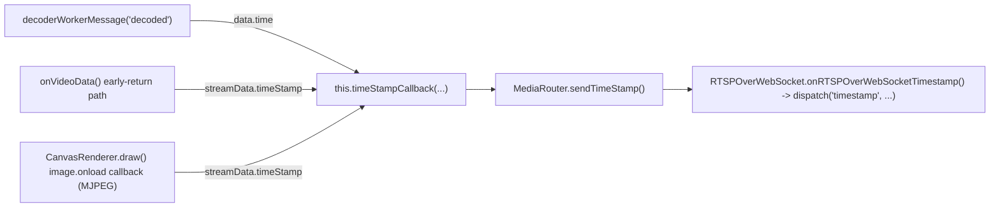
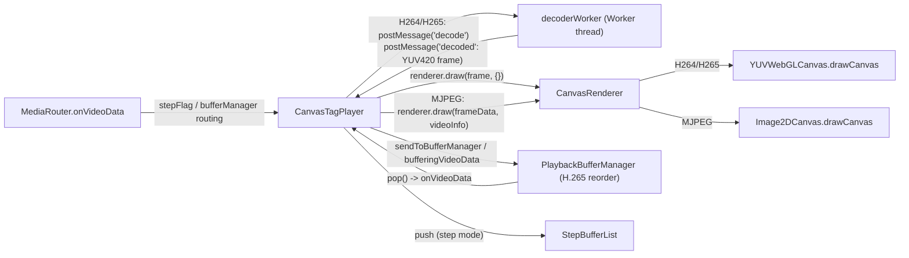
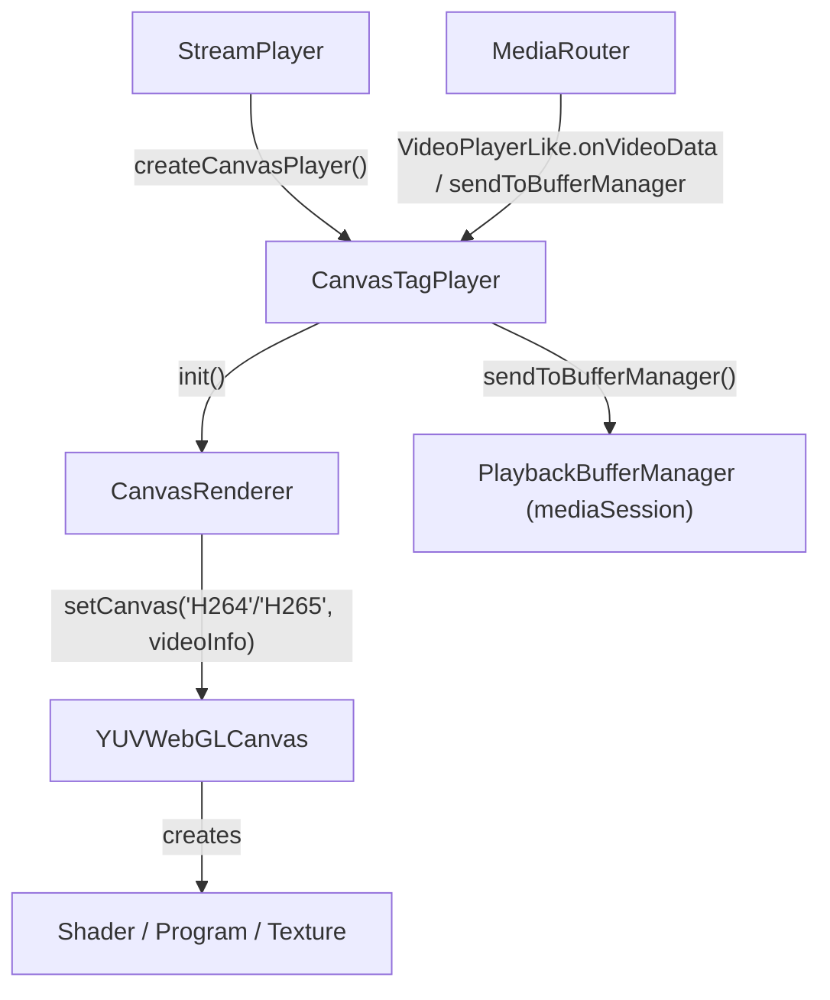
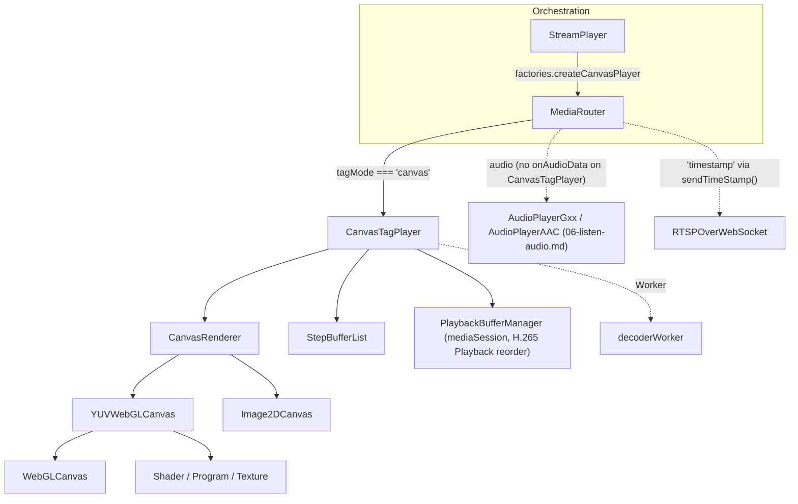

# 11. Canvas Tag Player (`src/player/video/player/canvas`)

*Per-class reference for the canvas/WebGL rendering pipeline: `CanvasTagPlayer` (+ its
`decoderWorker` collaborator), `CanvasRenderer`, `StepBufferList`, and the `webgl/` package
(`Shader`/`Program`/`Texture`/`WebGLCanvas`/`YUVWebGLCanvas`). No Media Source Extensions, no
`SourceBuffer`, no audio — every decoded frame is drawn straight to a `<canvas>` element, and audio
for a `canvas`-mode session is routed to an entirely separate subsystem
([06-listen-audio.md](06-listen-audio.md)) instead. Split out of the former combined
`05-video-player-rendering.md` on 2026-09-08 — see [05-video-tag-player.md](05-video-tag-player.md)
for the sibling `<video>`-tag/MSE pipeline and its own History for the full split rationale.*

**Version:** 1.1 · **Author:** Youngho Kim

**History**

| Date | Change |
| --- | --- |
| 2026-08-06 | (Carried forward from the former `05-video-player-rendering.md`.) Add per-class reference docs for `src/player`, including this subsystem (initial version). |
| 2026-09-02 | (Carried forward.) Fix `StepBufferList.setBufferingLength()` never guarding against a `NaN` input — reported live as `#forward`/`#backward` staying disabled forever with no crash/error. A stream whose SDP has no optional `a=framerate:` line (`RtspClient.ts`) leaves `videoInfo.framerate` `undefined`, so `push()`'s `videoInfo.framerate * 4` auto-tune passed `NaN` straight through both clamp checks (neither `> MAX` nor `< MIN` ever matches `NaN`), leaving `bufferingLength` permanently `NaN` and `push()` permanently unable to return `false` ("buffer full"). Fixed by falling back to `DEFAULT_BUFFERING_LENGTH` for any non-finite `length` before clamping. See `MEMORY.md`. |
| 2026-09-04 | (Carried forward, shared with [05-video-tag-player.md](05-video-tag-player.md)'s matching entry.) Added `debug`-gated `console.log` tracing (`util/debugLog.ts`, `debug["video"]`) — `VideoPlayer` (the shared abstract base this class and `VideoTagPlayer` both extend, see file 05) gained `setDebugConfig(config, componentName)` + `protected debugLog`/`debugConfig`; `MediaRouter.selectVideoPlayer()` supplies the literal component name (`'CanvasTagPlayer'`) it just built. `CanvasTagPlayer` forwards its `debugConfig` to the `CanvasRenderer`/`StepBufferList` it constructs in `init()`; `CanvasRenderer` (own `debug` setter, new `init()` trace) forwards further to whichever `Drawer` it builds (`YUVWebGLCanvas` via `WebGLCanvas.setDebugConfig()`, or `Image2DCanvas`'s no-op stub — MJPEG's 2D path has nothing worth tracing yet); `StepBufferList` migrated its own "Temporary diagnostic (2026-09-02)" `push()` log onto the same gate. |
| 2026-09-04 | (Carried forward.) Live-refresh: reported directly by the user, a `debug` config change made *during* an already-running stream had no visible effect on this file's classes either. `CanvasTagPlayer` now overrides `setDebugConfig()` to also re-push into `renderer`/`stepVideoList` if either already exists (previously only wired at `init()` time); `CanvasRenderer`'s own `set debug()` now also re-pushes into `drawer`/`mapDrawer` if either already exists, recomputing the `Image2DCanvas`-vs-`YUVWebGLCanvas` name from its own `codecType` field the same way the original construction-time wiring does. `VideoTagPlayer` needed no equivalent override — it has no child components holding their own debug logger, unlike `CanvasTagPlayer`. See `03-mediaSession-core-video.md`'s matching History entry and `MEMORY.md` for the complete per-class breakdown. |
| 2026-09-08 | Split out of the former combined `05-video-player-rendering.md` into this new file, requested directly by the user alongside a matching deep-dive expansion for `VideoTagPlayer` (see [05-video-tag-player.md](05-video-tag-player.md)). Gained two new sections at the same depth as file 05's: "Decoded frame → canvas draw pipeline" (the full `decoderWorker`/MJPEG-timeout → `StepBufferList`/`PlaybackBufferManager` → `CanvasRenderer.draw()` → WebGL/2D pixel-upload chain) and "Buffering, frame-drop, and the step-play 'seeking' equivalent" — explicit about why this class has neither a `SourceBuffer` nor a `currentTime` to seek at all, and what actually plays that role here. No behavior change — pure documentation reorganization/expansion. See `docs/player/README.md`'s updated index and this repo's root `MEMORY.md`. |

---

This document covers the canvas/WebGL half of the rendering hierarchy that turns decoded (or, for
MJPEG, still-encoded JPEG) video frames into visible pixels: `CanvasTagPlayer` and its collaborators.
This is a port of the legacy player's `Video/Player/videoCanvasPlayer.js` (and its WebGL helper
files) sources; see [`src/player/README.md`](../../src/player/README.md#5-videoplayer--rendering-hierarchy)
for the one-page class-diagram summary this document expands on, and
[05-video-tag-player.md](05-video-tag-player.md) for the sibling `<video>`-tag/MSE pipeline
(`VideoTagPlayer`) and the shared `VideoPlayer` abstract base both extend.

**Decode-path quick reference** (read this before chasing a decode-performance or
codec-support question into the wrong file — confirmed the hard way once already, see
MEMORY.md's "canvas tag vs video tag decode paths" entry). Kept in sync with the identical table in
[05-video-tag-player.md](05-video-tag-player.md) — this file's own row is `canvas`:

| Renderer Type (`tagMode`) | H.264 / H.265                                              | VP8 / VP9 / AV1                                                              | MJPEG |
| -------------------------- | ----------------------------------------------------------- | ----------------------------------------------------------------------------- | ----- |
| `canvas` (this file)       | `decoderWorker` → `AssemblyDecoder` (vendored ffmpeg.wasm, **software** decode) | `decoderWorker` → `WebCodecsVideoDecoder` (browser-native `VideoDecoder`, hardware-capable) | `CanvasRenderer.draw()` — `new Image()` + a Blob URL, i.e. the browser's native (non-WebCodecs) JPEG image decoder; no worker, no JS decode of any kind. |
| `video` (see [05-video-tag-player.md](05-video-tag-player.md)) | **No JS decoder at all.** `VideoTagPlayer` remuxes RTP → fragmented MP4 (`mp4Generator`) and hands it to a real `<video>` element via MSE — the *browser's own* internal decoder does the work, same as playing a local MP4 file. | `MediaSource.isTypeSupported()`-gated: real MSE if the browser declares support, else falls back to `WebCodecsVideoDecoder` in `'bridge'` output mode. | (2026-09-03) Re-encodes to H264 via `WebCodecsVideoEncoder`, muxed into fMP4 — no bridge fallback exists. |

The one thing both tag modes share for H.264/H.265: neither one ever runs `WebCodecsVideoDecoder`
for those two codecs specifically — `canvas` (this file) always uses the WASM path via
`decoderWorker`/`AssemblyDecoder`, `video` (file 05) always uses real MSE (browser-native decode, not
WebCodecs). A decode-throughput complaint for H.264/H.265 in `canvas` mode is a
`decoderWorker`/`AssemblyDecoder` question — see `07-talk-backup-worker.md`'s `AssemblyDecoder`
section for the worker-side implementation this class only ever `postMessage`s into.

Collaborators documented elsewhere, referenced here by name only:
- **`MediaRouter`** (`mediaSession/MediaRouter.ts`) — the RTP/session-layer class that owns a
  `VideoPlayerLike` instance (`this.player`) and is the sole source of decoded/depacketized frame
  data flowing into this module.
- **`StreamPlayer`** (`interface/StreamPlayer.ts`) — the orchestration-layer class that supplies
  `MediaRouter`'s `createCanvasPlayer` factory (`() => new CanvasTagPlayer()`).
- **`PlaybackBufferManager`** (`mediaSession/videoSession/PlaybackBufferManager.ts`) — the
  H.265-playback reordering buffer `CanvasTagPlayer` creates and drives; see the relations section
  below.
- **`H264Session`/`H265Session`/`VP8Session`/`VP9Session`/`AV1Session`/`MjpegSession`**
  (`mediaSession/videoSession/`) — upstream RTP depacketizers that produce the
  `VideoStreamData`/`VideoInfo` objects this module consumes. `CanvasRenderer.setCanvas()`
  recognizes all five non-MJPEG `codecType`s identically (`YUVWebGLCanvas`); VP8/VP9 are
  confirmed rendering correctly end-to-end (screenshot-verified via the demo server), AV1 is
  implemented identically but unverified end-to-end (this environment's `ffmpeg` can't produce a
  live AV1 source — see `03-mediaSession-core-video.md`'s VP8/VP9/AV1 section for the full story,
  including two real bugs the live-testing pass found and fixed: a `decoderWorker.ts` readiness
  race, and a missing `UNPACK_ALIGNMENT` WebGL call).
- **`decoderWorker`** (`worker/videoDecoder/decoderWorker.ts`) — the Web Worker `CanvasTagPlayer`
  spawns to decode video off the main thread. Owns either an `AssemblyDecoder` (H264/H265, vendored
  ffmpeg.wasm) or a `WebCodecsVideoDecoder` (VP8/VP9/AV1, browser-native WebCodecs `VideoDecoder`)
  — see `07-talk-backup-worker.md`'s `AssemblyDecoder`/`WebCodecsVideoDecoder` sections.
- **`AudioPlayerGxx`/`AudioPlayerAAC`** (`listen/`) — the standalone audio decode/playback
  subsystem a `canvas`-mode session's audio always routes to, since this class has no audio path of
  its own; documented in [06-listen-audio.md](06-listen-audio.md).
- **`CircularTypedArrayQueue`, `Median`, `Mean`, `IntervalTimer`, `Size`, `BrowserDetect`** (`util/`)
  — small standalone utilities consumed here; usage is described precisely below but their own
  implementations are documented in the `util/` reference.

## Class hierarchy

```mermaid
classDiagram
    class VideoPlayer {
        <<abstract, see 05-video-tag-player.md>>
    }
    class CanvasTagPlayer
    class CanvasRenderer
    class Image2DCanvas
    class WebGLCanvas
    class YUVWebGLCanvas
    class Shader
    class Program
    class Texture
    class StepBufferList

    VideoPlayer <|-- CanvasTagPlayer

    CanvasTagPlayer --> CanvasRenderer : creates (init())
    CanvasTagPlayer --> StepBufferList : creates (init())
    CanvasTagPlayer ..> "decoderWorker (Worker)" : postMessage/onmessage

    CanvasRenderer --> YUVWebGLCanvas : creates (H264/H265)
    CanvasRenderer --> Image2DCanvas : creates (MJPEG)

    WebGLCanvas <|-- YUVWebGLCanvas
    WebGLCanvas --> Shader : creates
    WebGLCanvas --> Program : creates
    WebGLCanvas --> Texture : creates
    YUVWebGLCanvas --> Shader : creates (own scripts)
    YUVWebGLCanvas --> Program : creates (own scripts)
    YUVWebGLCanvas --> Texture : creates (Y/U/V)
```

---

### `CanvasTagPlayer` (`src/player/video/player/canvas/CanvasTagPlayer.ts`)

- **Structure.** Extends `VideoPlayer` (`CanvasTagPlayer.ts:60`). Fields: `renderer: CanvasRenderer
  | null`, `canvasElement: HTMLCanvasElement | null`, `rendererCheck` (resize-event dedup flag),
  `videoSizeCallback`/`timeStampCallback`, `decoderWorker: Worker | null`, `frameCount` (MJPEG
  frame-drop counter), `stepVideoList: StepBufferList | null`, `isStepPlaying`,
  `bufferManager: PlaybackBufferManager | null`, `mediaTimer` (1s FPS-stats interval),
  `checkedPlayer` (`:61-77`). Constructor takes an injectable `DecoderWorkerFactory` defaulting to
  `() => new Worker(new URL('.../decoderWorker.ts', import.meta.url))` (`:114-119`) — the same
  injectable-factory pattern used elsewhere in this codebase for browser-dependent APIs. A
  module-level `decoderCount` counter (`:42`) is passed to the worker as `setDecoderIndex` on each
  creation. Inheritance: `VideoPlayer <|-- CanvasTagPlayer`. **No `onAudioData` anywhere on this
  class** (grep-confirmed) — a `canvas`-mode session's audio is never handed to this player at all;
  see the "No `SourceBuffer`, no audio" note below.

- **Method Analysis.**
  - `init(element)` (`:300-321`) — clones the caller's `<canvas>` element and replaces it in the
    DOM (so React/consumer re-renders don't fight with in-place canvas mutation), constructs a
    `CanvasRenderer`, wires its `channelId` and `capture` listener, calls `renderer.init(canvasElement)`,
    creates a fresh `StepBufferList`, registers a `webglcontextlost` handler
    (`onHandleContextLost`, reports error `0x0902`), and starts a 1s `setInterval` driving
    `onMediaTimer` (FPS/bandwidth statistics).
  - `checkPlayer(streamData, videoInfo, playMode)` (`:138-148`, private, idempotent via
    `checkedPlayer`) — for non-MJPEG codecs spawns the decoder worker (`createDecoderWorker`);
    always calls `renderer.setCanvas(codecType, videoInfo)` to lazily construct the right drawer.
  - `createDecoderWorker(codecType, videoInfo, playMode)` (`:121-136`) — creates the `Worker`,
    wires `onmessage → decoderWorkerMessage`, and posts a sequence of setup messages:
    `createDecoder`, `setOutputSize` (`w*h + w*h/4 + w*h/4` — exact YUV420 planar byte count),
    `setFrameRate`, `setDecoderIndex`, `useDropPacket`, `playMode`.
  - `onVideoData(playMode, streamData, videoInfo)` (`:335-390`, overrides `VideoPlayer`) — the
    per-frame entry point from `MediaRouter`/`PlaybackBufferManager`. Calls `checkPlayer`, then
    tags `streamData.timeStamp.mode = this.playmode` (`'live'`/`'playback'`, already lowercased by
    `MediaRouter.selectVideoPlayer()`'s `player.playmode = playMode.toString().toLowerCase()`)
    before anything else — real bug fix, found live: `VideoTagPlayer` has always tagged its own
    per-sample `timeStamp.mode` this way, but this class never did, so every consumer that switches
    on the dispatched `'timestamp'` event's `mode` field (e.g. an app's Live-vs-Playback timestamp
    readout) silently no-opped for every canvas-rendered frame. Tagged once on
    `streamData.timeStamp` here rather than at each of the three places that later hand it to
    `timeStampCallback` (see "Timestamp callback" below) — the decoder-worker path
    structured-clones this same object into the worker and echoes it straight back as the
    `'decoded'` message's `data.time`, so the one assignment covers all three. Then
    `checkFrameDrop` (MJPEG-only frame-skip logic driven by `videoInfo.dropOut`). See "Decoded
    frame → canvas draw pipeline" below for what happens next per codec family.
  - `decoderWorkerMessage(event)` (`:164-256`, private) — the worker's `onmessage` handler; the
    core of the rendering pipeline for the coded path. See "Decoded frame → canvas draw pipeline"
    below for the full breakdown of its `'decoded'`/`'notReady'`/`'lowPerformance'`/`'terminated'`
    cases.
  - `bufferingVideoData`/`sendToBufferManager`/`controlStepPlay`/`digitalZoom` (`:394-416, 456-461,
    479-483`) — the four methods `VideoPlayer.ts` deliberately does *not* declare abstract because
    they're canvas-only. `sendToBufferManager` lazily creates the `PlaybackBufferManager` (H.265
    Playback reordering) and pushes into it; `bufferingVideoData` pushes into `StepBufferList`
    instead (frame-stepping mode). `digitalZoom` forwards into `CanvasRenderer.digitalZoom`, which
    (see below) is genuinely broken/dead in both legacy and this port.
  - `stepPlay(cmd)` / `forward()` / `backward()` (`:258-270, 463-471`) — drive `StepBufferList`
    forward/backward and re-invoke `onVideoData` with the retrieved node's data, or (on list
    exhaustion) call `renderer.renewCanvas()` for camera devices. See "Buffering, frame-drop, and
    the step-play 'seeking' equivalent" below.
  - `play`/`pause`/`resume`/`stop` (`:431-454`) — toggle `renderer.userPaused` and, where
    applicable, pause/resume the `PlaybackBufferManager`.
  - `close()` (`:489-512`) — tears down the context-lost listener, the stats timer, the renderer
    (`renewCanvas` + `destroy`), posts `terminate` to the decoder worker, and drops the buffer
    manager reference.

#### Decoded frame → canvas draw pipeline

There is no muxing, no `SourceBuffer`, and no browser-internal decoder here — every pixel this class
ever shows was decoded (or, for MJPEG, still-JPEG-encoded) in JavaScript or WebGL, driven entirely by
this class's own explicit `postMessage`/`draw()` calls.

```mermaid
sequenceDiagram
    participant MR as MediaRouter / PlaybackBufferManager
    participant CTP as CanvasTagPlayer
    participant DW as decoderWorker (Worker thread)
    participant CR as CanvasRenderer
    participant YUV as YUVWebGLCanvas / Image2DCanvas

    MR->>CTP: onVideoData(playMode, streamData, videoInfo)
    CTP->>CTP: checkPlayer() (spawn decoderWorker if needed, non-MJPEG)
    CTP->>CTP: tag streamData.timeStamp.mode; checkFrameDrop() (MJPEG)

    alt H264/H265/VP8/VP9/AV1
        CTP->>DW: postMessage({type:'decode', frameData, frameType, width, height, currentFps})
        DW-->>CTP: postMessage({type:'decoded', data:{frame: Uint8Array YUV420, time, width, height}})
        CTP->>CTP: decoderWorkerMessage('decoded')<br/>(pop PlaybackBufferManager's next frame if one exists and doesn't need a restart)
        CTP->>CR: renderer.draw(frame, {})
    else MJPEG
        CTP->>CTP: setTimeout(draw, size-tiered delay: 80-200ms)
        CTP->>CR: renderer.draw(frameData, videoInfo, callback)<br/>(new Image() + Blob URL -- browser-native JPEG decode, no worker)
    end

    CR->>CR: drawCanvas(frame or image)
    CR->>YUV: drawer.drawCanvas(data)
    Note over YUV: H264/H265/VP8/VP9/AV1: slice into Y/U/V, upload 3 textures, GPU YUV2RGB shader<br/>MJPEG: ctx.drawImage() directly, no shader
    YUV-->>YUV: visible pixels on the &lt;canvas&gt; element
    CTP->>CTP: timeStampCallback(data.time / streamData.timeStamp) -- see "Timestamp callback" below
```

- `onVideoData()` (`:335-390`) is the single entry point for every codec; which branch it takes
  (worker `postMessage` vs. `setTimeout`+`Image`) is purely a `codecType === 'MJPEG'` check.
- `decoderWorkerMessage(event)` (`:164-256`, private) — the `'decoded'` case (`:167-218`) increments
  `currentFrameCount`; bails if `renderer.userPaused && !isStepPlaying`; if a
  `PlaybackBufferManager` exists and doesn't need a restart, immediately pops the next buffered
  frame (`popNextFrame(true)`) to keep the pipeline moving; if the canvas element's current
  `width`/`height` matches the decoded frame's, calls `renderer.draw(data.frame, {})` (drawing
  the actual YUV buffer) and `resizeCheck`; otherwise it *resizes the canvas attributes instead
  of drawing* (first-frame / resolution-change bootstrapping). `'notReady'` case: asks the buffer
  manager to retry via `front()` + a 500ms `setTimeout(() => popNextFrame(false), 500)`.
  `'lowPerformance'` case: reports error `0x090B` with decoder id/perf info. `'terminated'`: tears
  down the worker.
- `CanvasRenderer.draw(frameData, videoInfo, callback)` (`:185-201`) — the public per-frame entry
  point on the renderer side. For MJPEG: builds an `HTMLImageElement`, sets `image.src` to an object
  URL over `new Blob([frameData.buffer])`, and on `image.onload` calls `drawCanvas(image)`, revokes
  the object URL, and invokes `callback`. For coded video: calls `drawCanvas(frameData)` directly
  (already-decoded YUV buffer, no image decode needed) and stashes `frameData` as
  `captureframeData` for a possible paused-state capture. `drawCanvas()` itself, and the
  `YUVWebGLCanvas`/`Image2DCanvas` split beneath it, are documented in full under those classes'
  own sections below.
- **Resolution/format**: the decoder worker hands back one flat planar I420/YUV420P buffer (Y plane
  followed by U then V — confirmed by `YUVWebGLCanvas.drawCanvas()`'s single-buffer-slicing logic,
  see below), not three separate arrays.

- **Call Stack.** See the pipeline diagram above (H264/H265/VP8/VP9/AV1 branch) — the decoder-worker
  round trip is the defining feature of this path versus `VideoTagPlayer`'s synchronous, worker-free
  muxing (file 05).

- **RFC / Standard References.** None of its own (orchestration only); the actual pixel-producing
  standard is WebGL, owned by `CanvasRenderer`'s `YUVWebGLCanvas` drawer (see below). MJPEG frames
  are plain JFIF/JPEG blitted via the 2D Canvas API (no external RFC — `Image2DCanvas` just calls
  `ctx.drawImage`).

- **Relations & Data Flow.** Created by `StreamPlayer`'s `createCanvasPlayer` factory
  (`() => new CanvasTagPlayer()`), selected by `MediaRouter.selectVideoPlayer()` when `tagMode ===
  'canvas'` (MJPEG always, small/step-play H264, H265 whenever the browser's `MediaSource` can't
  handle the negotiated codec profile, or NVR/oversized H264 falls to `video` instead — see
  `MediaRouter.ts:1308-1391`). `VP8`/`VP9`/`AV1` aren't a case in that `switch` at all, so they fall
  to `default: break` and land on `'canvas'` too — which is the *correct* outcome for them (not a
  gap): `CanvasRenderer.setCanvas()`'s codec switch (below) and `decoderWorker`/
  `WebCodecsVideoDecoder` do fully decode/render these three now (see
  `03-mediaSession-core-video.md`'s VP8/VP9/AV1 section), and none of them would benefit from the
  H264/H265-only MSE `<video>`-tag path this `switch` also decides between — WebCodecs decoder
  output is raw frames, not encoded data MSE could consume, and `vendor/mp4Generator.js` has no
  `vp08`/`vp09`/`av01` box-type support regardless. `CanvasTagPlayer.init()` creates its own `CanvasRenderer` and
  `StepBufferList`; `sendToBufferManager()` lazily creates its own `PlaybackBufferManager`
  (documented under `mediaSession`) — matching the README's class diagram, which shows
  `CanvasTagPlayer --> PlaybackBufferManager : creates`.

#### No `SourceBuffer`, no audio

This class exists entirely outside Media Source Extensions and never touches audio:

- **No `SourceBuffer`/`MediaSource`.** There is no muxing step, no fMP4, no append/trim lifecycle —
  the entire "fill/trim `SourceBuffer`" and "seeking via `currentTime`" concerns
  [05-video-tag-player.md](05-video-tag-player.md) documents in depth simply don't exist here. A
  `<canvas>` element has no playback position of its own to seek at all; the closest analogues this
  class actually has are covered in "Buffering, frame-drop, and the step-play 'seeking' equivalent"
  below.
- **No audio path.** `CanvasTagPlayer` declares no `onAudioData` method at all (confirmed by reading
  the whole file, and by grep across the class) — `MediaRouter.handleAudioData` checks for its
  presence to decide routing, and since it's absent, a `canvas`-mode session's audio is *always*
  handed instead to a standalone `AudioPlayerGxx`/`AudioPlayerAAC` instance
  ([06-listen-audio.md](06-listen-audio.md)'s own decode/playback pipeline, entirely independent of
  this class). Contrast with `VideoTagPlayer` (file 05), which muxes real AAC/Opus/G711/G726 audio
  directly into its own fMP4 `SourceBuffer` alongside video — that subsystem is never even
  constructed for a `VideoTagPlayer` session. `CanvasTagPlayer.onChangeAudioShift()` is present only
  because `VideoPlayer` declares it abstract; it's a genuine no-op here (`:553`).

#### Timestamp callback

Unlike `VideoTagPlayer`'s `VTTCue`/`TextTrack`-based timestamp channel (there's no `<video>` element
here to attach a `TextTrack` to at all — see
[05-video-tag-player.md](05-video-tag-player.md)'s "Timestamp cue → `RTSPOverWebSocket` flow"
section for the contrast), `CanvasTagPlayer` calls `this.timeStampCallback(timeStamp)` directly, once
per frame, from three separate call sites — no cue objects, no polling loop, no browser-scheduled
dispatch of any kind:

| Call site | When | Source of the timestamp |
| --- | --- | --- |
| `decoderWorkerMessage()`'s `'decoded'` case (`:230`) | Every decoded H264/H265/VP8/VP9/AV1 frame, as soon as the worker message arrives | `data.time` — the same `streamData.timeStamp` object `onVideoData()` structured-cloned into the worker and got echoed back unchanged |
| A direct call inside `onVideoData()`'s own body (`:374`) | An early-return/frame-drop path before the frame ever reaches the worker or `renderer.draw()` | `streamData.timeStamp` directly |
| The callback argument passed into `renderer.draw(frameData, videoInfo, () => timeStampCallback(streamData.timeStamp))` (`:382`) | MJPEG only, invoked from `CanvasRenderer.draw()`'s `image.onload` — i.e. only once the JPEG has actually finished decoding and been drawn | `streamData.timeStamp`, but deliberately deferred until the async `Image` decode completes rather than fired immediately like the other two sites |

`setTimeStampCallback(func)` (`:459`) is the registration point — wired from `MediaRouter.ts:850`
exactly the same way as `VideoTagPlayer`'s (`self.player.setTimeStampCallback((ts) =>
self.sendTimeStamp(ts))`), so everything from `MediaRouter.sendTimeStamp()` upward to
`RTSPOverWebSocket`'s dispatched `'timestamp'` event (`RTSPOverWebSocket.ts:352`/`:4376`) is
identical between the two tag modes — only *how the callback gets invoked in the first place*
differs. The `mode` tagging bug fix documented in `onVideoData()`'s Method Analysis entry above
(`streamData.timeStamp.mode = this.playmode`) applies to all three of these call sites at once,
since it's set once on the shared object before any of them run.



- **Call Stack.** See the diagram above and "Decoded frame → canvas draw pipeline"'s own sequence
  diagram — `CanvasRenderer.draw`/`drawCanvas` is the midpoint between the decoder worker (or the
  MJPEG `Image` decode) and the WebGL/2D drawer.



---

### `CanvasRenderer` (`src/player/video/player/canvas/CanvasRenderer.ts`)

- **Structure.** Two classes in this file: the exported `CanvasRenderer` (`:69-272`) and a private,
  un-exported `Image2DCanvas` (`:24-48`) used only for the MJPEG drawer. `CanvasRenderer` fields:
  `userPaused`, `channelId`, `eventCaptureCallback`, private `canvasElement`, `drawer: Drawer | null`
  (`Drawer = YUVWebGLCanvas | Image2DCanvas`), `mapDrawer` (minimap's own drawer instance),
  `codecType`, `captureFlag`, `captureframeData`, `fileName`, `size: Size | null`, `minimapInfo`.
  Constructor takes an injectable `saveAsFn` defaulting to `file-saver`'s real `saveAs` (`:87`).
  `Image2DCanvas` wraps a `CanvasRenderingContext2D`; `drawCanvas(image)` resizes the canvas to the
  image's dimensions and calls `ctx.drawImage`; `initCanvas()` clears the canvas rect.
  Note (preserved from legacy, documented in the source comment at `:55-67`): `channelId`/
  `userPaused` are plain data properties, not accessors, despite legacy declaring them via
  `Object.defineProperty` — the outer legacy factory function discarded its own `this` by
  `return`-ing a different object, so those accessor definitions never actually attached.

- **Method Analysis.**
  - `setCanvas(codec, videoInfo)` (`:150-174`) — lazily (once; guarded by `drawer === null`)
    constructs `this.size = new Size(videoInfo.width, videoInfo.height)` and, per `codec`,
    instantiates `YUVWebGLCanvas` (via `canvasElement.getContext('webgl')`) for `H264`/`H265`, or
    `Image2DCanvas` (via `getContext('2d')`) for `MJPEG`.
  - `draw(frameData, videoInfo, callback)` (`:185-201`) — the public per-frame entry point; see
    "Decoded frame → canvas draw pipeline" above for the full per-codec breakdown.
  - `drawCanvas(data)` (`:113-135`, private) — duck-types `drawer.drawCanvas(data)` across both
    possible drawer types (a `Uint8Array` for `YUVWebGLCanvas`, an `HTMLImageElement` for
    `Image2DCanvas` — they're unrelated classes, not siblings under a shared interface; the cast
    just gives TypeScript one call signature). Marks `canvasElement.updatedCanvas = true`,
    triggers `download()` if a capture was requested, and mirrors the draw into `mapDrawer` for
    the minimap if one is active and flagged for update.
  - `capture(name)` (`:176-183`) — sets `captureFlag`/`fileName`; if the renderer is currently
    paused and a last frame is cached, draws it immediately (so "capture while paused" doesn't
    need a new frame to arrive).
  - `download()` (`:89-111`, private) — `canvas.toBlob()` then either `saveAsFn(blob, fileName +
    '.png')` (direct file save) or, if no filename was given, invokes `eventCaptureCallback` with
    `{channelId, blob}` (in-memory capture, e.g. for programmatic snapshotting) — throwing
    `RTSPOverWebSocketError(0x0909)` if neither is available.
  - `digitalZoom(bufferData)` (`:214-218`) — calls `drawer.updateVertexArray(bufferData)` via an
    unsafe cast. **Confirmed dead/broken**: `updateVertexArray` is commented out on both
    `WebGLCanvas`'s and `YUVWebGLCanvas`'s prototypes in legacy, and `Image2DCanvas` never defined
    it either — every call throws `TypeError: drawer.updateVertexArray is not a function`. Kept
    as-is per this repo's fidelity-to-legacy convention rather than silently "fixed."
  - `updateMinimapInfo({mode, target})` (`:234-263`) — lazily creates `mapDrawer` (same
    `YUVWebGLCanvas`/`Image2DCanvas` choice as the main drawer) sized off `target`'s `width`/
    `height` attributes on first `'on'`/target-bearing call; `'draw'` flags `minimapInfo.isUpdate`
    for the next `drawCanvas`; `'off'` tears the minimap drawer down.
  - `destroy()` (`:220-232`) — `initCanvas()` + `destroy()` on both `drawer` and `mapDrawer`, then
    nulls everything.

- **Call Stack.** See `CanvasTagPlayer`'s diagram above — `CanvasRenderer.draw`/`drawCanvas` is the
  midpoint between the decoder worker (or the MJPEG `Image` decode) and the WebGL/2D drawer.

- **RFC / Standard References.** No standard of its own; delegates to WebGL (via `YUVWebGLCanvas`)
  or the Canvas 2D API (via `Image2DCanvas`, itself just wrapping browser-native JPEG decoding
  through ``/`Blob` — no explicit JPEG spec handling in this code).

- **Relations & Data Flow.** Created exactly once per `CanvasTagPlayer.init()` call
  (`CanvasTagPlayer.ts:312`); owns the `drawer`/`mapDrawer` `YUVWebGLCanvas`/`Image2DCanvas`
  instances it lazily constructs in `setCanvas`/`updateMinimapInfo`.

---

### `StepBufferList` (`src/player/video/player/canvas/StepBufferList.ts`)

- **Structure.** Standalone class (`:33-132`), **not** a subclass of any `BufferList` type despite
  the legacy source grafting these methods onto one via `inheritObject` — the source comment
  (`:18-32`) explains `push`'s signature and internal array-based storage are incompatible with
  `BufferList`'s linked-list `push(buffer)`, and no `BufferList` method is ever called on a real
  instance, so this port makes it a genuinely standalone class instead of a fake subclass. Fields:
  `bufferingLength` (auto-tuned, default/max `240`, min `6` — `DEFAULT_BUFFERING_LENGTH`/
  `MAX_BUFFERING_LENGTH`/`MIN_BUFFERING_LENGTH`), `listLength`, `curIndex`, and the backing
  `stepList: StepBufferNode[]` array. `StepBufferNode = {playMode, streamData, videoInfo}`.

- **Method Analysis.** Pure internal ring/array buffer — no external standard. `push(playMode,
  streamData, videoInfo)` (`:45-63`) — on the *second* pushed item, auto-tunes
  `bufferingLength = videoInfo.framerate * 4` via `setBufferingLength` (clamped to
  `[MIN_BUFFERING_LENGTH, MAX_BUFFERING_LENGTH]`); appends a node (deep-copying `frameData` into a
  fresh `Uint8Array` so later mutation of the source buffer can't corrupt buffered history) while
  under `bufferingLength`; returns whether the caller may keep pushing (`false` once full) — note
  the code comment at `:57-61` explaining why the return expression is written as
  `length >= bufferingLength ? false : true` rather than the seemingly-equivalent `<` form: they
  diverge under `NaN`, and the `>=`-based form is what legacy actually used. **Real bug fix, found
  live (2026-09-02)**: the `NaN` case this comment already flagged as theoretically possible
  ("a possible `bufferingLength` if `videoInfo.framerate` was missing") turned out to be real —
  `RtspClient.ts`'s SDP parser only sets `session.Framerate` `if` an `a=framerate:` attribute is
  present (`:643-646`, an optional SDP line some cameras simply don't send), leaving
  `videoInfo.framerate` `undefined` for such a stream. `setBufferingLength(undefined * 4)` =
  `setBufferingLength(NaN)`, and neither of its own clamp comparisons (`> MAX`/`< MIN`) ever matches
  `NaN`, so `bufferingLength` stayed `NaN` permanently — meaning `push()`'s own `length >=
  bufferingLength` check could never be `true`, so `push()` could never return `false` ("buffer
  full"), so a `forward()`/`backward()` step could never reach `stepStatus = 'complete'` and
  `#forward`/`#backward` stayed disabled forever, with no crash and no RTSP-level error at all —
  reported live as exactly that ("영원히 활성화 안된다", "never re-enables"). Fixed by validating
  `length` is finite in `setBufferingLength()` before using it, falling back to
  `DEFAULT_BUFFERING_LENGTH` otherwise (which then clamps normally, same as if a "reasonable"
  framerate had been supplied). `forward()`/`backward()` (`:65-85`) — step
  `curIndex` and return the node at the new position; `backward()` additionally *skips* forward
  through non-keyframes, only returning on an I-frame or MJPEG node (frame-accurate step-back needs
  a decodable start point); both call `clear()` (reset to empty) when they run off either end.
  `searchTimestamp(frameTimestamp)` (`:87-101`) — linear scan for an exact
  `timestamp`/`timestamp_usec` match, or the first node whose timestamp exceeds the target,
  positioning `curIndex` there. `findIFrame(cmd)` (`:103-118`) — walks `curIndex` forward/backward
  from its current position until it lands on a `frameType === 'I'` node. `bufferClear()` (`:129-131`)
  — public wrapper over the private `clear()`.

#### Buffering, frame-drop, and the step-play "seeking" equivalent

`CanvasTagPlayer` has neither a `SourceBuffer` nor a `<video>`-tag `currentTime` — there is nothing
here that "seeks" in the MSE sense [05-video-tag-player.md](05-video-tag-player.md) documents at
length. The closest analogues, all driven by `StepBufferList`/`PlaybackBufferManager` rather than any
media-element clock:

| Mechanism | Role | Trigger |
| --- | --- | --- |
| `StepBufferList.push()`'s auto-tuned `bufferingLength` | Caps how many frames can queue in frame-stepping ("step play") mode before `push()` starts returning `false` | Auto-computed once, from the second pushed frame's `videoInfo.framerate * 4` |
| `StepBufferList.forward()`/`backward()` | The actual "jump to a different frame" operation for this tier — moves `curIndex` and hands the resulting node straight back to `onVideoData()` | `CanvasTagPlayer.stepPlay(cmd)`/`forward()`/`backward()`, user-driven (step-play UI controls) |
| `StepBufferList.searchTimestamp()`/`findIFrame()` | Positions `curIndex` at an exact timestamp or the nearest decodable (I-frame/MJPEG) node before a step | `controlStepPlay()`, before the first `forward()`/`backward()` of a step-play session |
| `PlaybackBufferManager` (documented in `mediaSession`) | H.265 Playback-mode B-frame reordering buffer — decode-order-in, presentation-order-out, entirely separate from step-play | `sendToBufferManager()`, driven per-frame from `onVideoData()` in ordinary (non-step) Playback |
| `checkFrameDrop()` (MJPEG-only, driven by `videoInfo.dropOut`) | Skips drawing a frame outright rather than falling behind — this tier's only real-time backpressure mechanism, since there's no buffered-range concept to fall back on | Every MJPEG `onVideoData()` call |

None of these reassign a clock the way `VideoTagPlayer`'s seeking table does — `forward()`/
`backward()` literally hand a *different already-buffered frame's data* back through the normal
`onVideoData()` path, so the "jump" is a data-selection operation, not a media-element `currentTime`
write. There is correspondingly no `'seeking'`/`'seeked'`/`'waiting'` event vocabulary here at all —
those are `<video>`/`<audio>` element events this tier's plain `<canvas>` element doesn't have.

- **Call Stack.** Driven entirely by `CanvasTagPlayer`'s step-play controls: `bufferingVideoData`
  pushes, `controlStepPlay` calls `searchTimestamp` then `findIFrame`, `forward`/`backward` call
  the matching `StepBufferList` method and feed the result back into `onVideoData` (see
  `CanvasTagPlayer.stepPlay`, `:258-270`).

- **RFC / Standard References.** None — pure internal buffering/indexing logic, no external
  standard basis.

- **Relations & Data Flow.** Created once per `CanvasTagPlayer.init()` (`:316`); the only consumer
  anywhere in the codebase is `CanvasTagPlayer` (confirmed via grep). Matches the README's
  `CanvasTagPlayer --> StepBufferList : creates`.

---

## `webgl/` — WebGL rendering primitives

### `Shader` (`src/player/video/player/canvas/webgl/GLPrimitives.ts`)

- **Structure.** `GLPrimitives.ts` also exports the `ShaderScript` interface and two free
  functions used across the WebGL classes: `createShaderScript(type, source): ShaderScript`
  (`:15-17`, a trivial object literal constructor) and `glAssert`/`glError` (`:20-29`, a
  log-only "assert" — never throws, just `console.error` + `console.trace`, matching legacy's
  `window.assert`/`window.error`). `Shader` itself (`:31-57`) holds `gl: WebGLRenderingContext`
  and `shader: WebGLShader | null`.
- **Method Analysis.** Constructor (`:35-52`) — dispatches on `script.type`
  (`'x-shader/x-fragment'` → `gl.createShader(gl.FRAGMENT_SHADER)`, `'x-shader/x-vertex'` →
  `gl.createShader(gl.VERTEX_SHADER)`, anything else → `glError` and early return), then
  `gl.shaderSource` + `gl.compileShader`, checking `gl.COMPILE_STATUS` and routing failures through
  `glError` with `gl.getShaderInfoLog`. `destroy()` (`:54-56`) calls `gl.deleteShader`.
  `Script.createFromElementId` and `ImageTexture` from the legacy source were dropped entirely —
  grep across the legacy tree confirmed neither is ever called (source comment `:3-9`).

### `Program` (`src/player/video/player/canvas/webgl/GLPrimitives.ts`)

- **Structure.** `:59-93`. Holds `gl` and `program: WebGLProgram | null` (created in the
  constructor via `gl.createProgram()`, `:63-66`).
- **Method Analysis.** `attach(shader)` (`:68-70`) — `gl.attachShader`. `link()` (`:72-75`) —
  `gl.linkProgram` then `glAssert(gl.getProgramParameter(..., LINK_STATUS), ...)`. `use()`
  (`:77-79`) — `gl.useProgram`. `getAttributeLocation(name)` (`:81-83`) — thin wrapper over
  `gl.getAttribLocation`, used by both `WebGLCanvas` and `YUVWebGLCanvas` to resolve
  `aVertexPosition`/`aTextureCoord`. `setMatrixUniform(name, array)` (`:85-88`) — resolves the
  uniform location and calls `gl.uniformMatrix4fv`; the only uniform ever set this way is
  `uMVMatrix` (always the identity matrix in practice — see `WebGLCanvas`'s `mvMatrix` note below).
  `destroy()` (`:90-92`) — `gl.deleteProgram`.

### `Texture` (`src/player/video/player/canvas/webgl/GLPrimitives.ts`)

- **Structure.** `:100-147`. Holds `gl`, `size: Size`, `texture: WebGLTexture | null`, `format:
  number` (defaults to `gl.LUMINANCE` — the format `YUVWebGLCanvas` relies on for its 8-bit
  single-channel Y/U/V planes). A module-level `textureIDs` array (`:98`, lazily filled with
  `[TEXTURE0, TEXTURE1, TEXTURE2]`) is shared across every `Texture` instance — harmless since
  those enum values are identical on any `WebGLRenderingContext`.
- **Method Analysis.** Constructor (`:106-117`) — `gl.createTexture()`, binds it, calls
  `gl.texImage2D(..., size.w, size.h, ..., format, UNSIGNED_BYTE, null)` to allocate storage with
  no initial data, and sets `NEAREST` mag/min filtering with `CLAMP_TO_EDGE` wrapping (no mipmaps,
  no filtering artifacts at plane edges — appropriate for exact per-pixel YUV sampling).
  `fill(textureData, useTexSubImage2D?)` (`:119-132`) — the actual per-frame upload: asserts the
  supplied buffer is at least `w*h` bytes, then either `gl.texSubImage2D` (in-place update, used
  when `useTexSubImage2D` is explicitly requested — not the default anywhere in this codebase) or
  `gl.texImage2D` (full re-specification; the code comment notes this benchmarked faster and is
  kept as the default). `bind(n, program, name)` (`:134-142`) — `gl.activeTexture(textureIDs[n])`,
  binds the texture, and sets the named sampler uniform on `program` to unit `n` via
  `gl.uniform1i`. `destroy()` (`:144-146`) — `gl.deleteTexture`.

- **Call Stack (Shader/Program/Texture, combined).** Compiled/linked once at `WebGLCanvas`/
  `YUVWebGLCanvas` construction time (`onInitShaders`/`onInitTextures`); `Texture.fill` +
  `WebGLCanvas.drawScene` run on every decoded frame. See the "Rendering pipeline" call stack under
  `YUVWebGLCanvas` below.

- **RFC / Standard References.** WebGL (Khronos/W3C WebGL 1.0 specification, built on OpenGL ES
  2.0 shader semantics — GLSL ES 1.00 for the shader sources compiled here).

- **Relations & Data Flow.** Both `WebGLCanvas` and `YUVWebGLCanvas` depend directly on all three
  (`WebGLCanvas --> Shader/Program/Texture : creates`); `YUVWebGLCanvas` additionally holds three
  private `Texture` instances (`YTexture`/`UTexture`/`VTexture`) instead of `WebGLCanvas`'s single
  `texture`.

---

### `WebGLCanvas` (`src/player/video/player/canvas/webgl/WebGLCanvas.ts`)

- **Structure.** `:54-267`. Fields: `canvas`, `size: Size`, `gl`, plus protected rendering state:
  `glNames` (reverse-lookup table of every numeric `WebGLRenderingContext` constant, built once for
  error-code-to-name translation), `vertexShader`/`fragmentShader: Shader`, `program: Program`,
  `texture: Texture`, `vertexPositionAttribute`/`textureCoordAttribute` (attribute locations),
  `quadVPBuffer`/`quadVTCBuffer` (vertex-position / texture-coordinate `WebGLBuffer`s for a
  full-viewport quad), optional `framebuffer`/`framebufferTexture`/`renderbuffer` (only allocated
  if `useFrameBuffer` is passed — no call site in this codebase passes `true`), and a private
  `mvMatrix: Float32Array` always set to a compile-time-constant 4×4 identity matrix
  (`IDENTITY_MATRIX_4X4`, `:40`) — the code comment notes legacy's real Sylvester-matrix math
  (`mvMultiply`/`mvTranslate`/`zoomScene`) is dead/commented-out in the source itself, so only the
  identity case is ever reachable. Ships its own generic pass-through vertex/fragment shader pair
  (`VERTEX_SHADER_SCRIPT`/`FRAGMENT_SHADER_SCRIPT`, `:9-33`) that just samples a single `texture`
  uniform unmodified — this is what a *non*-YUV `WebGLCanvas` would render, though in this codebase
  only `YUVWebGLCanvas` (which overrides the shaders entirely) is ever actually constructed
  (`CanvasRenderer.setCanvas` only ever builds `YUVWebGLCanvas`, never a bare `WebGLCanvas`).
  `onInitWebGL`/`onInitShaders`/`onInitTextures`/`onInitSceneTextures` are real (non-arrow) instance
  methods specifically so the constructor's calls into them dispatch to a subclass override even
  mid-construction (`:44-53`) — this is exactly how `YUVWebGLCanvas` replaces the shader/texture
  setup without needing its own constructor logic beyond calling `super()`.
  Inheritance: `WebGLCanvas <|-- YUVWebGLCanvas`.

- **Method Analysis (rendering pipeline).**
  - **Constructor** (`:73-88`) — sets `canvas.width`/`height` from `size.viewWidth`/`viewHeight`
    (falling back to `size.w`/`size.h`), then runs the fixed setup sequence:
    `onInitWebGL()` → `onInitShaders()` → `initBuffers()` → (optionally `initFramebuffer()`) →
    `onInitTextures()` → `initScene()`.
  - `onInitWebGL()` (`:181-195`) — warns via `glError` if `gl` is falsy; builds `glNames` (numeric
    GL constant → name) once, by iterating every enumerable property of `gl` and keeping the
    numeric ones — used later by `checkLastError` to print human-readable WebGL error names.
  - `onInitShaders()` (`:197-210`) — compiles the base pass-through vertex+fragment `Shader`s,
    creates a `Program`, `attach`es both, `link()`s and `use()`s it, then resolves and
    `enableVertexAttribArray`s `aVertexPosition`/`aTextureCoord`. **`YUVWebGLCanvas` fully
    overrides this** with its own three-texture YUV→RGB shader pair (see below).
  - `initBuffers()` (`:107-125`, private) — allocates `quadVPBuffer` with 4 vertex positions
    forming a full-viewport `TRIANGLE_STRIP` quad (`[1,1,0, -1,1,0, 1,-1,0, -1,-1,0]`) and
    `quadVTCBuffer` with matching texture coordinates; includes an Edge-browser-specific
    `scaleX` correction (via `browserDetect()`) to avoid a gray edge line when canvas width isn't
    exactly divisible by the source width.
  - `onInitTextures()` (`:212-216`) — sets the GL viewport to the canvas's actual pixel size and
    allocates a single RGBA `Texture` sized to `this.size`. **Overridden entirely by
    `YUVWebGLCanvas`** (three `LUMINANCE` textures instead — see below).
  - `initScene()` (`:135-148`, private) — binds `quadVPBuffer`/`quadVTCBuffer` to the vertex
    position/texture-coordinate attributes via `gl.vertexAttribPointer`, calls
    `onInitSceneTextures()` (binds the texture(s) to their sampler uniform(s) — subclass-overridable),
    uploads the (always-identity) MV matrix uniform, and binds the optional framebuffer if one was
    requested.
  - `drawScene()` (`:222-224`) — the actual draw call: `gl.drawArrays(gl.TRIANGLE_STRIP, 0, 4)`,
    rasterizing the quad with whatever texture(s) are currently bound — this is what actually
    paints the previously-`fill()`ed texture data onto the canvas each frame.
  - `checkLastError(operation?)` (`:154-179`) — polls `gl.getError()`, translates it through
    `glNames`, and logs; throws a `ReferenceError` for genuinely unknown error codes (preserved
    legacy quirk referencing an undeclared global — effectively unreachable with a real
    `WebGLRenderingContext`, kept for fidelity per the source comment `:163-170`).
  - `readPixels(buffer)` (`:226-229`) — `gl.readPixels` into a caller-supplied buffer (RGBA); not
    called anywhere in this module's own code (available for external tooling/testing).
  - `destroy()` (`:231-266`) — deletes the framebuffer/renderbuffer/buffers, destroys both shaders,
    the (optional) framebuffer texture, the texture, and the program; shrinks the underlying
    `gl.canvas` to `1×1` (releases GPU memory eagerly) before nulling every field.

- **Call Stack.** See `YUVWebGLCanvas`'s combined pipeline diagram below — `WebGLCanvas` supplies
  the shared quad/attribute/uniform machinery that every draw call runs through, but `YUVWebGLCanvas`
  is the class actually instantiated for real video and the one whose overrides matter for the
  per-frame path.

- **RFC / Standard References.** WebGL 1.0 (Khronos/W3C specification; GLSL ES 1.00 shading
  language).

- **Relations & Data Flow.** Base class for `YUVWebGLCanvas`; not directly instantiated by
  anything in this codebase (`CanvasRenderer.setCanvas` only ever builds the subclass). Depends on
  `Shader`/`Program`/`Texture` from `GLPrimitives.ts` and `Size`/`browserDetect` from `util/`.

---

### `YUVWebGLCanvas` (`src/player/video/player/canvas/webgl/YUVWebGLCanvas.ts`)

- **Structure.** `:45-132`. Extends `WebGLCanvas`. Adds three protected `Texture` fields —
  `YTexture`, `UTexture`, `VTexture` — deliberately declared **without** a `= null` initializer
  (using the `!` definite-assignment marker) because subclass field initializers run *after*
  `super()` returns, which would otherwise stomp the values `onInitTextures()` (invoked *during*
  `super()`'s constructor execution, dispatching to this class's override) already assigned
  (source comment `:46-50`). Ships its own shader pair (`:5-38`): the vertex shader is identical to
  `WebGLCanvas`'s; the fragment shader is the real YUV→RGB specialization — see below. This is the
  only concrete `WebGLCanvas` subclass, and the only WebGL drawer `CanvasRenderer` ever constructs
  (for `H264`/`H265`). Inheritance: `WebGLCanvas <|-- YUVWebGLCanvas`.

- **Method Analysis — the actual rendering pipeline.**
  - **YUV→RGB conversion approach**: entirely in the fragment shader (`:19-38`), via a hardcoded
    `mat4 YUV2RGB` (BT.601-style coefficients: `1.16438, 0, 1.59603, -.87079` / `1.16438, -.39176,
    -.81297, .52959` / `1.16438, 2.01723, 0, -1.08139` / `0,0,0,1`) multiplying the vector
    `(Y, U, V, 1)` sampled independently from three separate `sampler2D` uniforms (`YTexture`,
    `UTexture`, `VTexture`) — i.e. **no** CPU-side color conversion; every pixel's YUV→RGB math
    runs on the GPU, once per fragment, in parallel.
  - `onInitShaders()` (override, `:59-72`) — same structure as the base class's but compiles
    *this* file's three-texture shader pair instead of the base pass-through one.
  - `onInitTextures()` (override, `:74-85`) — allocates `YTexture` at full `this.size` (luma
    plane, one byte per pixel) and `UTexture`/`VTexture` at `this.size.getHalfSize()` (chroma
    planes at half width and half height each) — the standard **4:2:0 planar** subsampling layout.
    All three default to `Texture`'s `LUMINANCE` format (single 8-bit channel).
  - `onInitSceneTextures()` (override, `:87-91`) — binds `YTexture`/`UTexture`/`VTexture` to
    texture units 0/1/2 under the sampler uniform names `YTexture`/`UTexture`/`VTexture`
    respectively (matching the fragment shader's uniform names).
  - `drawCanvas(bufferData)` (`:99-106`) — **the per-frame entry point**, called by
    `CanvasRenderer.drawCanvas()`. Computes `lumaSize = w*h` and `chromaSize = lumaSize >> 2`
    (quarter size — consistent with 4:2:0's half-width×half-height chroma planes), then slices
    the single incoming `Uint8Array` into three contiguous regions — `[0, lumaSize)` for Y,
    `[lumaSize, lumaSize+chromaSize)` for U, `[lumaSize+chromaSize, lumaSize+2*chromaSize)` for V
    — uploading each via `Texture.fill` (`gl.texImage2D`), then calls `drawScene()` to issue the
    actual `gl.drawArrays` draw call. This confirms the decoder worker hands back one flat planar
    I420/YUV420P buffer (Y plane followed by U then V), not three separate arrays.
  - `fillYUVTextures(y, u, v)` (`:93-97`) — a three-separate-array variant of the same upload.
    **Confirmed dead code** (grep across the whole `src/player` tree finds no call site anywhere)
    — `drawCanvas`'s single-buffer-slicing form is what's actually used; this method is a legacy
    leftover kept for API-surface fidelity.
  - `initCanvas()` (`:112-115`) — `gl.clear(DEPTH_BUFFER_BIT | COLOR_BUFFER_BIT)`, used to blank
    the canvas (e.g. on step-play list exhaustion, or before `destroy()`).
  - `destroy()` (override, `:117-131`) — destroys all three YUV textures before delegating to
    `super.destroy()` for the shared buffer/program/shader teardown.

- **Call Stack.**

```mermaid
sequenceDiagram
    participant DW as decoderWorker
    participant CTP as CanvasTagPlayer
    participant CR as CanvasRenderer
    participant YUV as YUVWebGLCanvas
    participant TEX as Texture (x3)
    participant GL as WebGLRenderingContext

    DW->>CTP: postMessage({type:'decoded', data:{frame: Uint8Array YUV420, width, height}})
    CTP->>CTP: decoderWorkerMessage('decoded')
    CTP->>CR: renderer.draw(frame, {})
    CR->>CR: drawCanvas(frame)
    CR->>YUV: drawer.drawCanvas(frame)
    YUV->>YUV: slice frame into Y/U/V subarrays
    YUV->>TEX: YTexture.fill(Y) / UTexture.fill(U) / VTexture.fill(V)
    TEX->>GL: gl.texImage2D(...) per plane
    YUV->>YUV: drawScene()
    YUV->>GL: gl.drawArrays(TRIANGLE_STRIP, 0, 4)
    GL-->>GL: fragment shader samples Y/U/V, applies YUV2RGB matrix, rasterizes quad
    Note over GL: visible pixels on the &lt;canvas&gt; element
```

- **RFC / Standard References.** WebGL 1.0 / GLSL ES 1.00 (Khronos/W3C). The YUV→RGB matrix
  implements the standard BT.601 (ITU-R BT.601) full-range-ish conversion coefficients commonly
  used for SD/consumer video — no formal citation in-source, but the coefficient pattern matches
  the well-known BT.601 Y'CbCr→RGB conversion.

- **Relations & Data Flow.** Created exclusively by `CanvasRenderer.setCanvas()` for `H264`/`H265`
  codec types (`CanvasRenderer.ts:157-161`), and again for the minimap drawer in
  `updateMinimapInfo` (`CanvasRenderer.ts:249`). Never constructed anywhere else. Matches the
  README's `CanvasRenderer --> YUVWebGLCanvas : creates` and `WebGLCanvas <|-- YUVWebGLCanvas`.



---

## Canvas-tag relations diagram



See [05-video-tag-player.md](05-video-tag-player.md)'s own relations diagram for the sibling
`<video>`-tag/MSE pipeline, and both files' History for what moved where.
