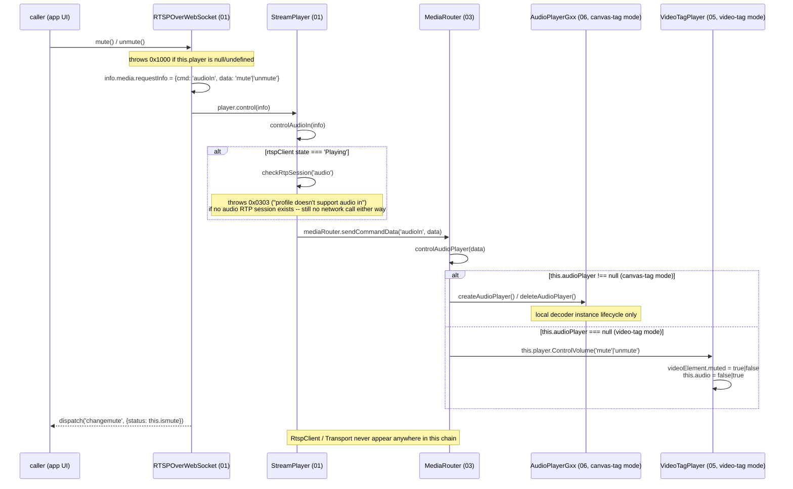
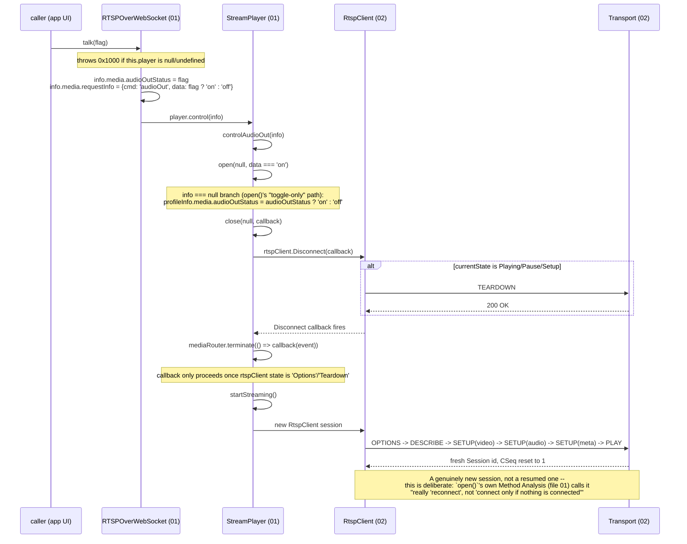
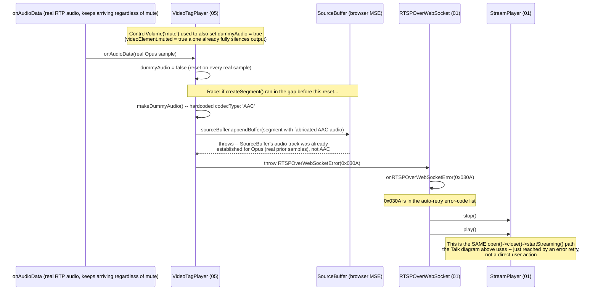

# 12. Audio Control Flows: Mute, Unmute, Talk (cross-cutting)

*Three call-stack deep-dives for `RTSPOverWebSocket`'s three user-facing audio controls —
`mute()`/`unmute()` (incoming playback audio) and `talk()` (outgoing 2-way audio) — spanning
`src/player/elements`, `src/player/interface`, `src/player/mediaSession`,
`src/player/video/player/video`, and `src/player/listen`. Exists because the three flows look
superficially similar (one boolean toggle, one `player.control()` call) but are architecturally very
different underneath: Mute/Unmute never leave the browser tab, Talk tears down and rebuilds the
entire RTSP session every time. Files 01/03/05/06 already document each class's own methods in
isolation ("Method Analysis"); this file is the "trace it end to end, side by side" view, added
after a real user-reported bug (see the "Related incident" section) turned out to need exactly that
comparison to root-cause.*

**Version:** 1.0 · **Author:** Youngho Kim

**History**

| Date | Change |
| --- | --- |
| 2026-09-10 | Initial version, requested directly by the user right after the dummy-audio/codec-mismatch bug below was fixed — three sequence diagrams (Mute, Unmute, Talk) plus the incident writeup connecting them. |

---

## Why this file exists

A downstream consuming app ([`wisenet-camera-discovery`](../../..)) reported clicking Mute/Unmute
appeared to trigger a full RTSP reconnect. Reading `mute()`/`unmute()`'s own source in isolation
said no — correctly, but incompletely: the real reconnect was a real bug, one layer removed from
that direct call chain (see "Related incident" below). Getting from "which function did the user
click" to "which class actually sent TEARDOWN" required tracing across five classes and comparing it
against the *other* audio control (`talk()`) that legitimately does reconnect, to see the difference.
That comparison is worth keeping as a reference — the next time an app reports "X seems to
reconnect the stream," this file is the fastest way to check whether `X` is *supposed to*.

## At a glance

| | `mute()` / `unmute()` | `talk()` |
|---|---|---|
| `cmd` sent to `StreamPlayer.control()` | `'audioIn'` | `'audioOut'` |
| Handler | `controlAudioIn()` | `controlAudioOut()` |
| Touches `RtspClient`/network? | **No** — purely local (`MediaRouter.controlAudioPlayer()`) | **Yes** — `open(null, audioOutStatus)` unconditionally tears down and rebuilds the whole session |
| Why | The incoming audio RTP track (`trackID=a`, `a=recvonly`) is already part of the very first `SETUP` regardless of mute state — muting is just a local playback toggle, nothing to renegotiate with the device | The initial SDP only ever negotiates the audio track as `recvonly`; turning on 2-way Talk needs a send-capable track, which this library achieves by reopening the session rather than adding a track mid-session |
| Guard before doing anything | `isplay` (both) | `isplay` |
| Real device network effect | None at all | Full `TEARDOWN` → new `OPTIONS`/`DESCRIBE`/`SETUP`×N/`PLAY`, brand-new RTSP `Session` id |

## 1. Mute / Unmute (`'audioIn'`) — local only

Both directions share one method shape (`mute()`/`unmute()` differ only in the `data` value and
their own `ismute`-state precondition, per file 01's own Method Analysis), so one diagram covers
both — the `alt` block is the only branch point.

Confirmed empirically, not just by reading source: temporary `console.trace()` diagnostics added to
`StreamPlayer.open()`/`close()` during the incident below never fired anywhere in `mute()`/
`unmute()`'s own call stack across a real, extended device session — only from the unrelated retry
path described in "Related incident."

## 2. Talk (`'audioOut'`) — full reconnect, on purpose

This matches a real device RTSP log captured during the incident below byte-for-byte: `TEARDOWN`
on the old `Session`, then `OPTIONS` with `CSeq: 1`, `DESCRIBE`, three `SETUP`s (video/audio/meta
tracks), `PLAY` with a brand-new `Session` id.

## Related incident: Mute→Unmute→Mute *did* reach a reconnect, but not through this chain

Reported directly by the user (via the consuming app) as a confusing full RTSP TEARDOWN+reconnect on
Mute→Unmute→Mute during Live playback, on an Opus-audio camera. The Mute/Unmute sequence diagram
above was true the whole time — `mute()`/`unmute()` never call `open()`/`close()` — but a *different*
path reached the same `close()`/`startStreaming()` machinery the Talk diagram uses on purpose:

**Root cause**: `VideoTagPlayer.ControlVolume()`'s mute branch set `dummyAudio = true` in addition to
`videoElement.muted = true` — the latter alone is sufficient for the user-facing mute requirement.
`dummyAudio` actually means "no real audio *data* is currently available" (its other two writers:
the field's own initial default before the first real sample, and `onWaitingPackets()` on genuine
RTP packet loss) — a different condition from "the user doesn't want to hear it." The camera keeps
sending real RTP audio regardless of local mute state (see the Mute/Unmute diagram above — nothing
in that chain reaches the network), so `onAudioData()` resets `dummyAudio` back to `false` on the
very next real sample; the mute-forced `true` only ever won a brief race. But `makeDummyAudio()`
hardcodes its synthetic silent sample's codec as `'AAC'` unconditionally — this camera's real codec
was Opus (confirmed from the real `DESCRIBE`/SDP response: `a=rtpmap:110 opus/48000/2`), so a segment
built in that race window muxed a fabricated AAC sample into an audio `SourceBuffer` track already
established for Opus — a codec mismatch the browser's MSE parser rejects.

**Fixed**: removed `dummyAudio = true` from `ControlVolume()`'s mute branch (`05-video-tag-player.md`,
2026-09-10 entry). **Not fixed, same latent risk**: `makeDummyAudio()`'s hardcoded `'AAC'` is still
reachable via its other two triggers (initial default, real packet loss) and would hit the identical
crash on any non-AAC-audio camera if a segment happens to build during one of *those* windows too —
see that same file's entry for the suggested follow-up.

**Root-cause method, worth repeating**: reading `mute()`/`unmute()` in isolation (correctly) ruled
them out, but didn't explain the user's real device log. What settled it was temporary
`console.trace()` diagnostics dropped directly into `StreamPlayer.open()`/`close()` (the actual
TEARDOWN-sending functions) plus `mute()`/`unmute()`/`talk()`'s own entry points, one real
reproduction against the device, and reading the resulting stack traces — which showed every
`close()` call originating from `onRTSPOverWebSocketError()`'s retry path, never from `mute()`/
`unmute()` directly. See this repo's root `MEMORY.md` for the full narrative, including a real
build-caching gotcha hit along the way in the consuming app.

## See also

- [01-elements-interface-exceptions.md](01-elements-interface-exceptions.md) — `RTSPOverWebSocket.mute()`/`unmute()`/`talk()`, `StreamPlayer.open()`/`close()`/`controlAudioIn()`/`controlAudioOut()`/`startStreaming()` Method Analysis (line-numbered).
- [03-mediaSession-core-video.md](03-mediaSession-core-video.md) — `MediaRouter.controlAudioPlayer()`, `createAudioPlayer()`/`deleteAudioPlayer()`.
- [05-video-tag-player.md](05-video-tag-player.md) — `VideoTagPlayer.ControlVolume()`/`makeDummyAudio()`/`onAudioData()`, and the dummy-audio/codec-mismatch fix's own History entry.
- [06-listen-audio.md](06-listen-audio.md) — `AudioPlayerGxx` (canvas-tag mode's mute target).
- [07-talk-backup-worker.md](07-talk-backup-worker.md) — `Talk`/`G711AudioEncoder`, the outbound half of a Talk session once the reconnect above completes and a send-capable track exists.
- [README.md](README.md)'s "End-to-end flow across the documents" — where Talk is currently one
  prose bullet under "Two flows run in parallel"; this file is the detailed version of that bullet.
