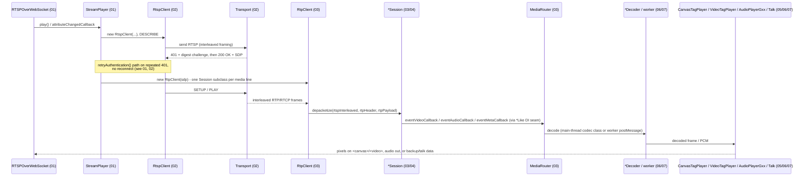

# `src/player` — Per-Class Reference Documentation

This directory is a deep, per-class reference for every subsystem under `src/player`: for each
class it records **Structure**, **Method Analysis**, **Call Stack** (real invocation chains traced
from the code), **RFC / Standard References**, and **Relations & Data Flow** to other classes.

It complements two existing documents rather than replacing them:

- [`src/player/README.md`](../../src/player/README.md) — the static class-relationship map
  (inheritance/composition diagrams, grouped by directory). Read that first for the shape of the
  codebase; come here for what each class actually *does*, method by method.
- [`docs/ARCHITECTURE.md`](../ARCHITECTURE.md) — repository-wide structure and the two top-level
  runtime flows (playing a stream, the demo server's YouTube→RTSP pipeline).

## How the set is organized

The library is documented in 8 files, split by subsystem so each stays a manageable read. Files
cross-reference each other by class name only — a class documented in file *N* that collaborates
with a class in file *M* is named, not re-explained.

| File | Subsystem | Key classes |
|---|---|---|
| [01-elements-interface-exceptions.md](01-elements-interface-exceptions.md) | Public API surface, orchestration, errors | `RTSPOverWebSocket`, `StreamManager`, `StreamPlayer`, React wrapper, `RTSPOverWebSocketBaseError` hierarchy |
| [02-network.md](02-network.md) | RTSP-over-WebSocket signaling + SUNAPI HTTP | `RtspClient`, `RtspClientManager`, `Transport`, `DigestGenerator`, `SunapiClient`, `SunapiManager`, `SunapiRestClient` |
| [03-mediaSession-core-video.md](03-mediaSession-core-video.md) | RTP/RTCP session base classes, routing, video depacketization | `Session`, `RtpSession`, `RTCPSession`, `RtpClient`, `MediaRouter`, `MetaDataParser`, `H264Session`, `H265Session`, `VP8Session`, `VP9Session`, `AV1Session`, `MjpegSession`, `VideoRtcpSession`, `PlaybackBufferManager` |
| [04-mediaSession-audio-text.md](04-mediaSession-audio-text.md) | Audio/text codec sessions | `AACSession`, `AudioTalkSession`, `G711Session`, `G726Session`, `OPUSSession`, `MetaSession` |
| [05-video-player-rendering.md](05-video-player-rendering.md) | Canvas/WebGL and `<video>`(MSE) rendering | `VideoPlayer`, `CanvasTagPlayer`, `CanvasRenderer`, `WebGLCanvas`, `YUVWebGLCanvas`, `VideoTagPlayer` |
| [06-listen-audio.md](06-listen-audio.md) | Audio decode + playback | `AudioDecoder` hierarchy (AAC/G711/G726x/OPUS), `AudioPlayer`, `AudioPlayerAAC`, `AudioPlayerGxx` |
| [07-talk-backup-worker.md](07-talk-backup-worker.md) | Two-way audio, client-side backup, Web Workers | `Talk`, `G711AudioEncoder`, `BackupProvider`, `FileMaker`, `AssemblyDecoder`, `AssemblyTranscoder`, `MjpegDepacketizer`, `SunapiRequestTask`, `AviFormatWriter`/`AviFileWriter`, `BackupSession` |
| [08-util.md](08-util.md) | Stand-alone utilities | `BufferList`, `CircularTypedArrayQueue`, `Mean`/`Median`, `IntervalTimer`, `Fisheye3D`/`Fisheye3DMulti`, misc. helpers |

## End-to-end flow across the documents

A single "play a stream" session touches almost every file in the set, in this order:

The dependency-inversion seam is worth calling out explicitly since it's easy to miss reading any
single file in isolation: **`MediaRouter` never imports a concrete player, decoder, `Talk`, or
`BackupProvider` class.** `StreamPlayer` builds the real instances and injects them into
`MediaRouter` through the `MediaRouterFactories`/`*Like` interfaces declared in `MediaRouter.ts`
(see file 03) — this is also the seam the parity test suite uses to substitute fakes.

Two flows run in parallel to the above and are documented across the same files:

- **Two-way audio (talk-back):** microphone → `Talk` (07) → `G711AudioEncoder` (07, actually
  invoked via `AudioTalkSession`, see 04/07) → `RtpClient`/`RtspClient` (02/03) → outbound RTP to
  the camera/bridge.
- **Local backup/export:** `BackupProvider` (07) → `worker/backup` (`BackupSession`,
  `AviFormatWriter`/`AviFileWriter`, `zipWorker`, all 07) → `FileMaker` (07) → browser download,
  driven by `MediaRouter` via the `BackupProviderLike` seam.

## Consolidated standards/RFC map

Full detail and code-level verification is in each file's own "RFC / Standard References"
sections; this is a quick index of which standard governs which part of the wire/bitstream:

| Standard | Governs | Documented in |
|---|---|---|
| RFC 2326 (RTSP/1.0) | RTSP request/response framing, interleaved (`$`) binary framing | 02 |
| RFC 6455 (WebSocket) | The outer transport carrying RTSP + interleaved RTP/RTCP | 02 |
| RFC 2617 / RFC 7616 (HTTP Digest Auth) | `RtspClient`'s and `SunapiClient`'s challenge/response auth | 02, 07 (SUNAPI worker) |
| RFC 3550 (RTP/RTCP) | RTP header fields, RTCP sender/receiver reports | 03 |
| RFC 6184 (H.264 RTP payload) | `H264Session` NAL/FU-A/STAP-A parsing | 03 |
| RFC 7798 (H.265/HEVC RTP payload) | `H265Session` NAL/FU parsing | 03 |
| RFC 7741 (VP8 RTP payload) + RFC 6386 (VP8 bitstream, informational) | `VP8Session` payload-descriptor/key-frame parsing | 03 |
| draft-ietf-payload-vp9 (VP9 RTP payload) + VP9 Bitstream Spec §6.2 | `VP9Session` payload-descriptor/`frame_type` parsing | 03 |
| AOM "RTP Payload Format For AV1" v1.0 + AV1 Bitstream Spec §5.3.1/§6.2.2 | `AV1Session` aggregation-header/OBU parsing | 03 |
| RFC 2435 (JPEG RTP payload) | `MjpegSession`, worker-side `MjpegDepacketizer` | 03, 07 |
| RFC 3551 (RTP A/V Profile) | Static payload types for G.711/G.726, RTP transport for those codecs | 03, 04, 06 |
| RFC 3640 (MPEG-4 generic / AAC RTP payload) | `AACSession` AU-header parsing | 04, 06 |
| RFC 7587 (Opus RTP payload) / RFC 6716 (Opus codec) | `OPUSSession`, `OPUSAudioDecoder` (delegates to the browser's native WebCodecs `AudioDecoder`) | 04, 06 |
| ITU-T G.711 / G.726 | Codec bitstream itself (not an RFC) | 04, 06 |
| W3C Media Source Extensions + ISO/IEC 14496-12 (ISOBMFF/fMP4) | `VideoTagPlayer`'s muxing into a `SourceBuffer` | 05 |
| WebGL (Khronos/W3C) | `WebGLCanvas`/`YUVWebGLCanvas` rendering path | 05 |
| Microsoft RIFF/AVI (no IETF/ITU standard) | `AviFormatWriter`/`AviFileWriter` local recording | 07 |
| PKWARE .ZIP spec (no IETF/ITU standard) | `zipWorker` local export | 07 |
| No standard — vendor/SUNAPI-specific | `MetaSession`/`MetaDataParser` metadata channel | 03, 04 |

## Notable discrepancies found while writing this set

These were flagged by the agents that produced each file while reading the real source against
the existing `src/player/README.md`/`docs/ARCHITECTURE.md` summaries. They are not fixed here —
per `CLAUDE.md`, quirks that look like bugs may be load-bearing for parity tests — but are worth a
maintainer's attention:

- `docs/ARCHITECTURE.md` still refers to the custom element's directory as `custom/`; the real
  path is `elements/` (see file 01).
- `src/player/README.md` describes `RtspClientManager` as `export const RtspClientManager = new
  RtspClientManagerImpl()` with a "per-channel registry"; the actual code is a lazily-initialized
  `getInstance()` singleton over a flat, unkeyed array, and it currently has **no callers**
  anywhere — `StreamPlayer` constructs `RtspClient` directly (see file 02).
- `src/player/README.md`'s `util` diagram shows `Fisheye3DMulti ..> FisheyeMeshGenerator : uses`;
  in code `Fisheye3DMulti` builds its own inline mesh and never calls `fishEyeMesh.ts` — only
  `Fisheye3D` does (see file 08).
- Several utilities (`BufferList`/`BufferNode`, `Queue`, `Fisheye3D`, `Fisheye3DMulti`) are
  exported from `util/index.ts` but have no current call sites anywhere in `src/player` (see file
  08).
- `AudioPlayerAAC` is a fully-implemented sibling of `AudioPlayerGxx` but is not currently wired
  into the dispatch path — `AudioPlayerGxx` handles AAC itself via `AACAudioDecoder` (see file 06).
- A handful of preserved-intentionally legacy quirks/bugs are called out at their exact location
  in files 02/03/07 (e.g. a dead `VideoRtcpSession` microsecond-diff computation, an
  `AudioHeader.settingG726` field-assignment typo, `SunapiManager`/`SunapiRequestTask` paths that
  reference undeclared globals) — see each file's relevant subsection rather than this summary.
- `VP8Session`/`VP9Session`/`AV1Session` (added after this set was first written) are wired all the
  way through SDP negotiation, RTP depacketization, **and now decode/render** (see file 03's
  VP8/VP9/AV1 section, and file 07's `WebCodecsVideoDecoder`) — VP8/VP9 confirmed working
  end-to-end via a real browser, AV1 implemented identically but unverified end-to-end (this
  environment's `ffmpeg` can't produce a live AV1 source to test against). The
  `RTSPOverWebSocket` `codec` attribute allow-list (file 01, REQ-PLY-027) still doesn't list these
  three — that attribute isn't actually required for playback to work (confirmed live), so it's a
  documentation/API-surface gap, not a functional one.
