# src/player — Class Overview

This document maps the classes defined under `src/player` and how they relate to each other
(inheritance, interface implementation, and the main composition/usage links). It complements
[docs/ARCHITECTURE.md](../../docs/ARCHITECTURE.md), which covers data flow; this file is about
*static structure* — which class knows about which.

For a deeper, per-class reference — full method-by-method behavior, real call-stack traces, the
RFC/standard each class implements, and detailed cross-component data flow — see
[docs/player/](../../docs/player/README.md), which expands every class summarized below into its
own dedicated section.

Diagrams are grouped by directory/subsystem rather than as one giant graph, since a single
diagram for ~100+ classes would not be readable. Only classes are shown (not every exported
interface/type) unless an interface is central to a pattern (e.g. `BufferState`).

## Module layout

```
elements/            <rtsp-over-websocket> custom element (facade)
interface/           StreamManager / StreamPlayer orchestration layer
network/              RTSP-over-WebSocket + SUNAPI HTTP + transport
mediaSession/        RTP/RTCP session hierarchy + MediaRouter + per-codec sessions
video/player/        <video>/<canvas> rendering (VideoPlayer hierarchy)
listen/              Audio decoding + playback (AudioDecoder / AudioPlayer hierarchies)
talk/                 Two-way audio (talk-back) encoder session
backup/              Client-side backup/export orchestration
worker/              Web Worker–side counterparts (backup muxing, decoding, transcoding, mjpeg)
exceptions/          Error class hierarchy
util/                Stand-alone utility classes (no significant inheritance)
react/               React wrapper around the custom element
legacyHostInterface/ Type-only shims describing the legacy host's API surface
```

## 1. System overview — composition

> Per-class detail: [docs/player/01-elements-interface-exceptions.md](../../docs/player/01-elements-interface-exceptions.md),
> [docs/player/03-mediaSession-core-video.md](../../docs/player/03-mediaSession-core-video.md).

The custom element wraps `StreamPlayer` (directly, not via `StreamManager` — see note below),
which wires together the network, media-routing, rendering, audio, talk-back and backup
subsystems.

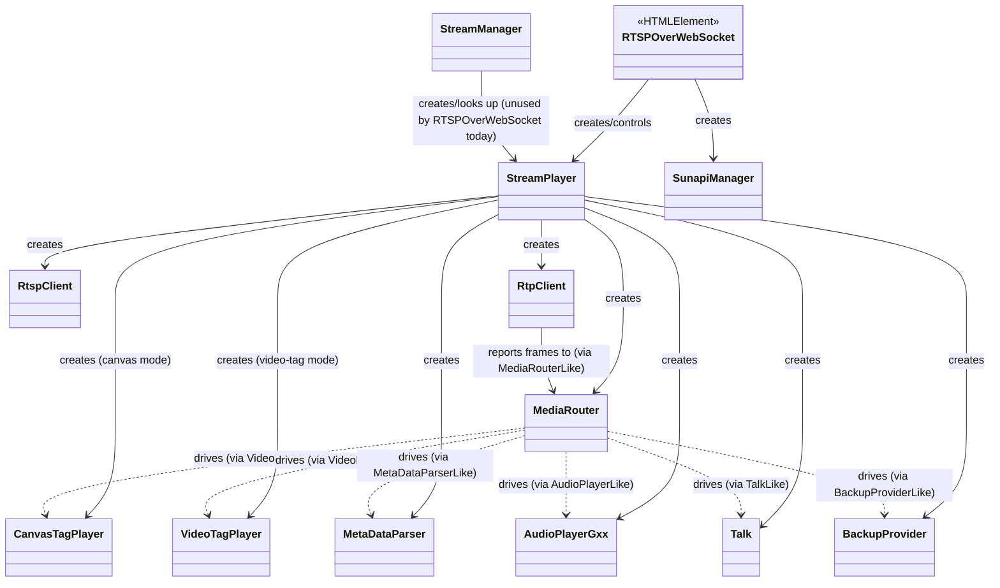

> `MediaRouter` never imports the concrete player/talk/backup classes directly — `StreamPlayer`
> injects them through the `MediaRouterFactories`/`*Like` interfaces defined in `MediaRouter.ts`
> (dependency inversion, and the seam the parity tests use to inject fakes).

## 2. Exceptions

> Per-class detail: [docs/player/01-elements-interface-exceptions.md](../../docs/player/01-elements-interface-exceptions.md) (§ "Exceptions hierarchy").

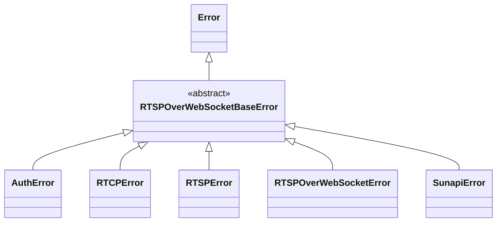

`SunapiException` (`network/http/SunapiException.ts`) is a separate, unrelated standalone class
(legacy SUNAPI HTTP error shape) — it does not extend `RTSPOverWebSocketBaseError`.

## 3. `mediaSession` — RTP/RTCP session hierarchy

> Per-class detail: [docs/player/03-mediaSession-core-video.md](../../docs/player/03-mediaSession-core-video.md)
> (base classes, `RtpClient`, `MediaRouter`, video codec sessions) and
> [docs/player/04-mediaSession-audio-text.md](../../docs/player/04-mediaSession-audio-text.md)
> (audio/text codec sessions).

All per-codec sessions share a `Session` → `RtpSession` base, and `RtpClient` is the factory/
owner that picks which concrete session to instantiate per SDP media line.

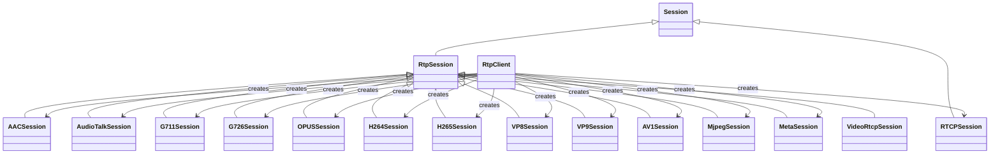

`MediaRouter` sits above `RtpClient`/`RtpSession` and is not part of this hierarchy — it
receives already-depacketized media via the `*Like` interfaces described in §1.

### 3a. `videoSession/BufferManagerStates` — state pattern

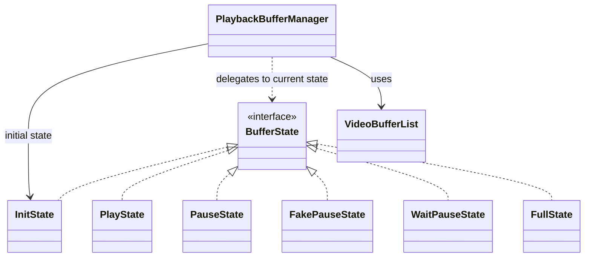

## 4. `network` — RTSP-over-WebSocket + SUNAPI HTTP

> Per-class detail: [docs/player/02-network.md](../../docs/player/02-network.md).

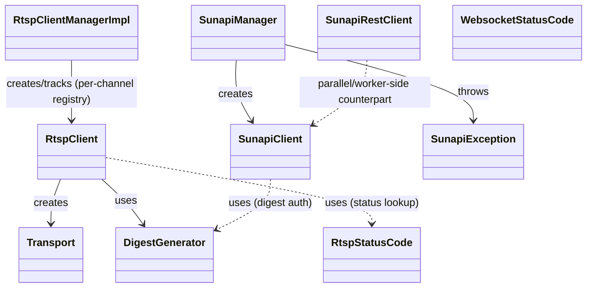

`RtspClientManagerImpl` is the un-exported class behind the singleton exported from
`RtspClientManager.ts` (`export const RtspClientManager = new RtspClientManagerImpl()`).

`SunapiRestClient` runs inside `worker/sunapi/sunapiRequestTask.ts`'s worker rather than being
constructed by `SunapiClient` directly — see §7.

## 5. `video/player` — rendering hierarchy

> Per-class detail: [docs/player/05-video-player-rendering.md](../../docs/player/05-video-player-rendering.md).

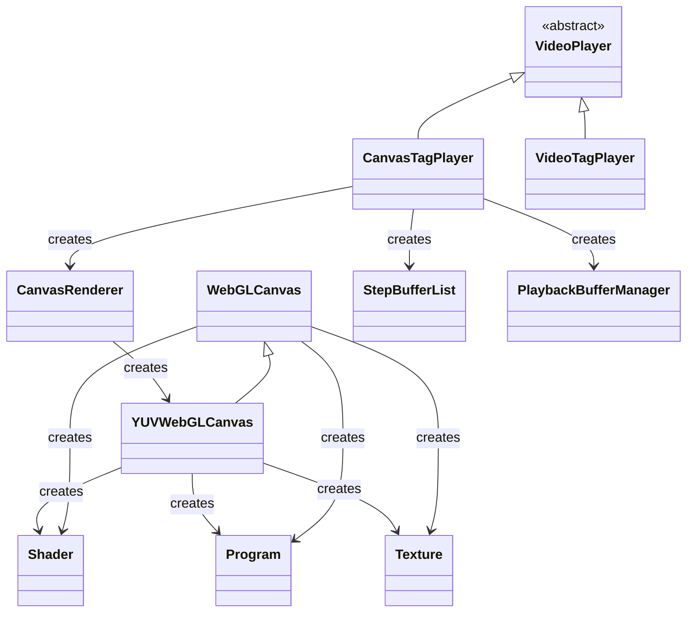

`VideoTagPlayer` (MSE `<video>` tag path) does not use `CanvasRenderer`/WebGL at all — it
demuxes into fragmented MP4 via `vendor/mp4Generator` and feeds a `MediaSource` `SourceBuffer`
directly, so it has no further class dependencies beyond `VideoPlayer` and small utils
(`CircularTypedArrayQueue`, `Median`, `Mean`, `IntervalTimer`).

## 6. `listen` — audio decode + playback

> Per-class detail: [docs/player/06-listen-audio.md](../../docs/player/06-listen-audio.md).

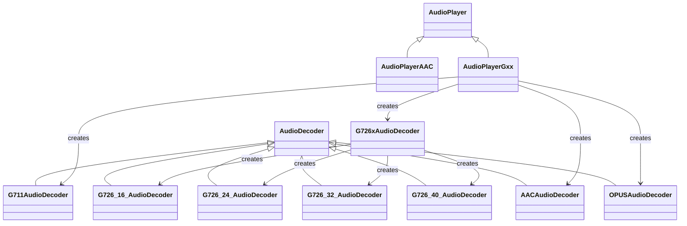

`G726xAudioDecoder` is a dispatcher/facade over the four bitrate-specific G.726 decoders
(16/24/32/40 kbit/s) — it does **not** itself extend `AudioDecoder`, it composes them and
selects one per stream.

## 7. `worker` — Web Worker–side classes

> Per-class detail: [docs/player/07-talk-backup-worker.md](../../docs/player/07-talk-backup-worker.md).

Each worker entry point (`*Worker.ts`) is a thin `onmessage` shim around one real class; none of
these classes reference the main-thread classes above directly (workers only exchange
plain-data messages with `RtpClient`/`VideoTagPlayer`/etc. across the worker boundary).

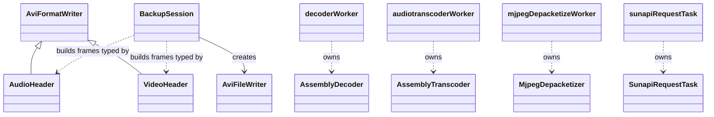

## 8. `backup` (main-thread) and `talk`

> Per-class detail: [docs/player/07-talk-backup-worker.md](../../docs/player/07-talk-backup-worker.md).

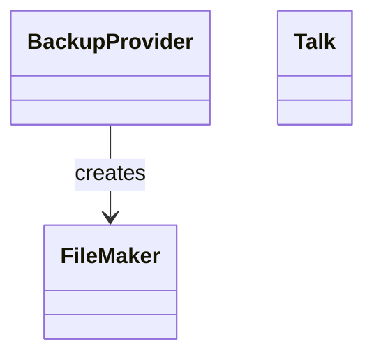

`Talk` (talk-back / two-way audio) has no class dependencies within `src/player` beyond the
shared `exceptions`/`util` helpers — it drives a G.711 encoder function
(`talk/encoder/G711AudioEncoder.ts`) but that module exports a class (`G711AudioEncoder`) used
purely as a stateless-ish encoder, not subclassed or composed by other classes here.

## 9. `interface` — orchestration layer detail

> Per-class detail: [docs/player/01-elements-interface-exceptions.md](../../docs/player/01-elements-interface-exceptions.md).

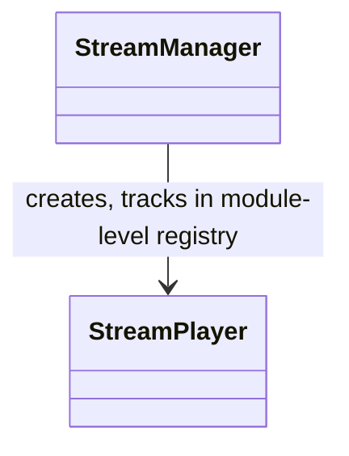

`StreamManager` reproduces a legacy quirk deliberately: `playerContainer`/`currentPlayer` are
module-level (not instance) state, so every `new StreamManager()` shares one player registry
(see the doc comment in [interface/StreamManager.ts](interface/StreamManager.ts)). Don't "fix"
this into instance state without checking `legacyHostInterface` callers that rely on it.

## 10. `util` — notable standalone classes

> Per-class detail: [docs/player/08-util.md](../../docs/player/08-util.md).

Most of `util/` is small, dependency-free helper classes with no inheritance:
`BufferList`/`BufferNode`, `CircularTypedArrayQueue`, `Queue`, `RTSPOverWebSocketMap`, `Size`,
`Mean`, `Median`, `IntervalTimer`, `DigestGenerator`, `H264SPSParser`, `H265SPSParser`,
`CommonAudioUtil`. Two exceptions:

- `Fisheye3D` / `Fisheye3DMulti` — independent (not related by inheritance), both consume
  `fishEyeMesh.ts`'s `GridMesh`/`MeshVertex`/`FisheyeConfig`/`FisheyeMeshGenerator`.
- `fishEyeMesh.ts` — `FisheyeMeshGenerator` creates `GridMesh` (which is built from
  `MeshVertex` instances), configured by `FisheyeConfig`.

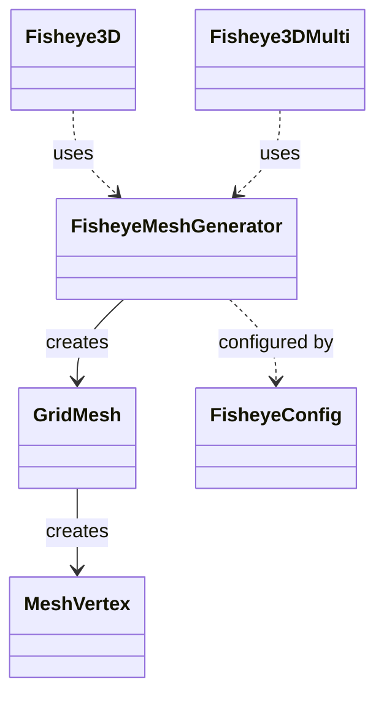

## Notes on scope

- `legacyHostInterface/`, `vendor/*.d.ts`, and `react/Constant.ts` are type-only (interfaces),
  no classes — omitted from the diagrams above.
- `elements/RTSPOverWebSocketTypes.ts` and `elements/panelStyles.ts` are types/constants, not
  classes.
- Interfaces are shown only where they express a real pattern (`BufferState`, the `*Like` DI
  seams in `MediaRouter.ts`); most exported `interface`s here are plain data shapes and were
  left out to keep the diagrams legible.
